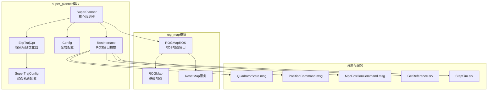
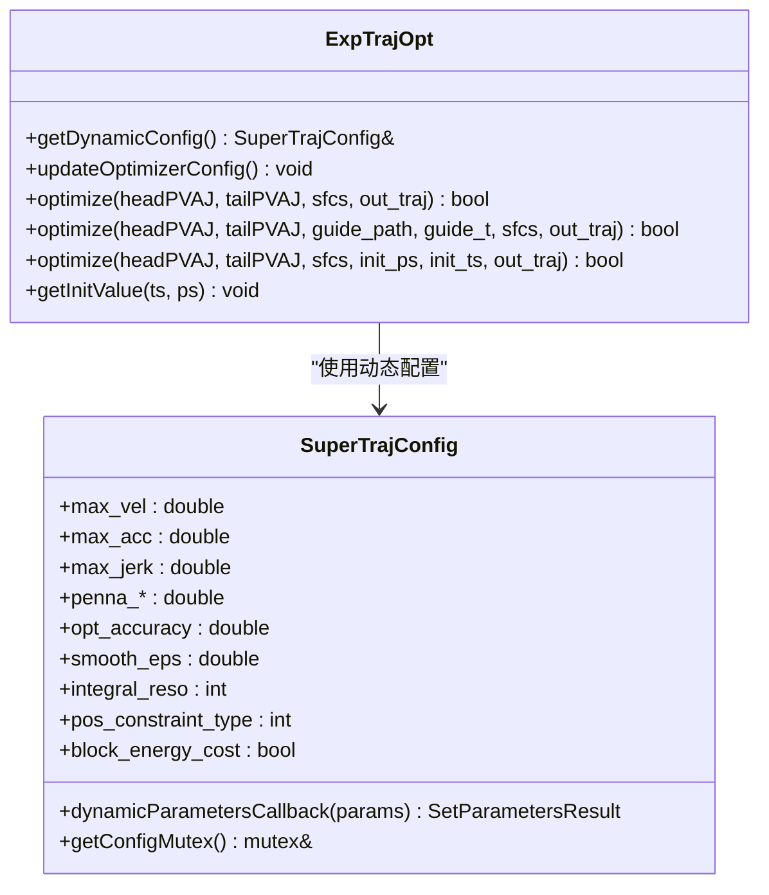
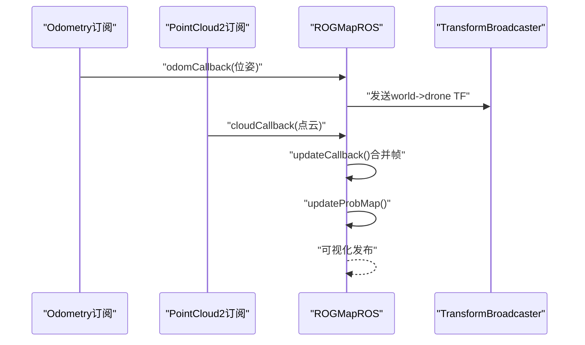
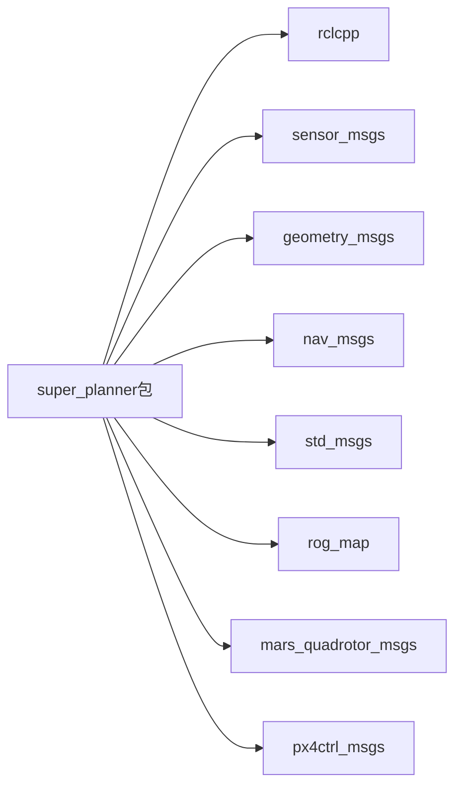

# API参考文档

<cite>
**本文档引用的文件**
- [super_planner.h](file://src/SUPER/super_planner/include/super_core/super_planner.h)
- [exp_traj_optimizer_s4.h](file://src/SUPER/super_planner/include/traj_opt/exp_traj_optimizer_s4.h)
- [rog_map.h](file://src/SUPER/rog_map/include/rog_map/rog_map.h)
- [ros_interface.hpp](file://src/SUPER/super_planner/include/ros_interface/ros_interface.hpp)
- [config.hpp](file://src/SUPER/super_planner/include/super_core/config.hpp)
- [super_traj_config.h](file://src/SUPER/super_planner/include/traj_opt/super_traj_config.h)
- [rog_map_ros2.hpp](file://src/SUPER/rog_map/include/rog_map_ros/rog_map_ros2.hpp)
- [package.xml](file://src/SUPER/super_planner/package.xml)
- [CMakeLists.txt](file://src/SUPER/super_planner/CMakeLists.txt)
- [QuadrotorState.msg](file://src/SUPER/mars_uav_sim/mars_quadrotor_msgs/ros2_msg/QuadrotorState.msg)
- [PositionCommand.msg](file://src/SUPER/mars_uav_sim/mars_quadrotor_msgs/ros2_msg/PositionCommand.msg)
- [MpcPositionCommand.msg](file://src/SUPER/mars_uav_sim/mars_quadrotor_msgs/ros2_msg/MpcPositionCommand.msg)
- [ResetMap.srv](file://src/SUPER/rog_map/srv/ResetMap.srv)
- [GetReference.srv](file://src/SUPER/mars_uav_sim/px4ctrl_msgs/srv/GetReference.srv)
- [StepSim.srv](file://src/SUPER/mars_uav_sim/px4ctrl_msgs/srv/StepSim.srv)
</cite>

## 目录
1. [简介](#简介)
2. [项目结构](#项目结构)
3. [核心组件](#核心组件)
4. [架构总览](#架构总览)
5. [详细组件分析](#详细组件分析)
6. [依赖关系分析](#依赖关系分析)
7. [性能考虑](#性能考虑)
8. [故障排除指南](#故障排除指南)
9. [结论](#结论)
10. [附录](#附录)

## 简介
本API参考文档面向使用SUPER规划器的开发者，系统性地梳理核心类的公共接口、ROS2消息与服务接口、参数接口以及自定义消息类型的规范。重点覆盖以下模块：
- 核心类：SuperPlanner、轨迹优化器（ExpTrajOpt）、地图系统（ROGMapROS）
- ROS2接口：话题、服务、参数、消息类型
- 自定义消息与服务：QuadrotorState、PositionCommand、MpcPositionCommand、ResetMap、GetReference、StepSim
- 版本兼容性与迁移指南、最佳实践与常见错误规避、扩展与自定义开发指南

## 项目结构
该仓库采用模块化组织方式，核心规划器位于super_planner模块，地图系统位于rog_map模块，消息类型位于mars_quadrotor_msgs与px4ctrl_msgs模块。CMakeLists与package.xml定义了编译与依赖关系。



**图表来源**
- [super_planner.h](file://src/SUPER/super_planner/include/super_core/super_planner.h#L59-L296)
- [exp_traj_optimizer_s4.h](file://src/SUPER/super_planner/include/traj_opt/exp_traj_optimizer_s4.h#L55-L368)
- [rog_map.h](file://src/SUPER/rog_map/include/rog_map/rog_map.h#L39-L129)
- [rog_map_ros2.hpp](file://src/SUPER/rog_map/include/rog_map_ros/rog_map_ros2.hpp#L41-L380)
- [ros_interface.hpp](file://src/SUPER/super_planner/include/ros_interface/ros_interface.hpp#L43-L149)

**章节来源**
- [package.xml](file://src/SUPER/super_planner/package.xml#L1-L21)
- [CMakeLists.txt](file://src/SUPER/super_planner/CMakeLists.txt#L1-L188)

## 核心组件
本节概述三个核心类的职责与公共接口要点：
- SuperPlanner：统一调度规划流程，协调地图、轨迹优化器、ROS接口与可视化模块；提供重规划与轨迹查询接口。
- ExpTrajOpt：基于多段MINCO的探索轨迹优化器，支持引导轨迹初始化与动态参数更新。
- ROGMapROS：ROS2地图接口，订阅里程计与点云，发布地图可视化与TF变换，提供重置服务。

**章节来源**
- [super_planner.h](file://src/SUPER/super_planner/include/super_core/super_planner.h#L59-L296)
- [exp_traj_optimizer_s4.h](file://src/SUPER/super_planner/include/traj_opt/exp_traj_optimizer_s4.h#L55-L368)
- [rog_map_ros2.hpp](file://src/SUPER/rog_map/include/rog_map_ros/rog_map_ros2.hpp#L41-L380)

## 架构总览
下图展示SuperPlanner如何与地图、轨迹优化器、ROS接口交互，以及消息与服务的流向。

```mermaid
sequenceDiagram
participant Node as "ROS2节点"
participant Planner as "SuperPlanner"
participant Map as "ROGMapROS"
participant Opt as "ExpTrajOpt"
participant Viz as "RosInterface"
Node->>Planner : "PlanFromRest/ReplanOnce"
Planner->>Map : "updateMap(点云, 位姿)"
Planner->>Opt : "optimize(起点/终点, SFCs, 引导轨迹)"
Opt-->>Planner : "Trajectory"
Planner->>Viz : "vizExpTraj/vizExpSfc/vizReplanLog"
Viz-->>Node : "RViz可视化"
```

**图表来源**
- [super_planner.h](file://src/SUPER/super_planner/include/super_core/super_planner.h#L139-L146)
- [exp_traj_optimizer_s4.h](file://src/SUPER/super_planner/include/traj_opt/exp_traj_optimizer_s4.h#L342-L349)
- [rog_map_ros2.hpp](file://src/SUPER/rog_map/include/rog_map_ros/rog_map_ros2.hpp#L119-L151)
- [ros_interface.hpp](file://src/SUPER/super_planner/include/ros_interface/ros_interface.hpp#L98-L124)

## 详细组件分析

### SuperPlanner 类API
- 构造与生命周期
  - 构造函数：接收配置路径、ROS接口指针、地图指针。
  - 析构：默认析构。
- 规划接口
  - PlanFromRest(goal_p, goal_yaw, new_goal)：从静止状态规划至目标。
  - ReplanOnce(goal_p, goal_yaw, new_goal)：单次重规划。
- 轨迹查询与命令生成
  - getCommittedPositionTrajectory()/getCommittedYawTrajectory()：获取已提交轨迹。
  - getOneCommandFromTraj(statePVAJ, yaw, yaw_dot, on_backup_traj, traj_finish)：按时间戳提取状态与航向。
- 地图与状态
  - updateROGMap(cloud, pose)：增量更新地图。
  - getRobotState(out)：获取机器人状态。
  - getMap()：返回地图指针。
- 优化器访问
  - getExpTrajOptDynamicConfig()/getBackupTrajOptDynamicConfig()：获取动态配置引用。
  - getExpTrajOpt()/getBackupTrajOpt()：获取优化器指针。
- 性能统计
  - getFrontendTime()/getBackendTime()：获取前后端平均耗时。
- 运行时参数
  - updateRuntimeParams(node)：从参数服务器同步配置到优化器动态参数。

**章节来源**
- [super_planner.h](file://src/SUPER/super_planner/include/super_core/super_planner.h#L104-L106)
- [super_planner.h](file://src/SUPER/super_planner/include/super_core/super_planner.h#L139-L146)
- [super_planner.h](file://src/SUPER/super_planner/include/super_core/super_planner.h#L126-L128)
- [super_planner.h](file://src/SUPER/super_planner/include/super_core/super_planner.h#L130-L134)
- [super_planner.h](file://src/SUPER/super_planner/include/super_core/super_planner.h#L226-L228)
- [super_planner.h](file://src/SUPER/super_planner/include/super_core/super_planner.h#L163-L164)
- [super_planner.h](file://src/SUPER/super_planner/include/super_core/super_planner.h#L167-L169)
- [super_planner.h](file://src/SUPER/super_planner/include/super_core/super_planner.h#L176-L178)
- [super_planner.h](file://src/SUPER/super_planner/include/super_core/super_planner.h#L185-L187)
- [super_planner.h](file://src/SUPER/super_planner/include/super_core/super_planner.h#L194-L196)
- [super_planner.h](file://src/SUPER/super_planner/include/super_core/super_planner.h#L203-L205)
- [super_planner.h](file://src/SUPER/super_planner/include/super_core/super_planner.h#L210-L224)
- [super_planner.h](file://src/SUPER/super_planner/include/super_core/super_planner.h#L241-L295)

### 轨迹优化器（ExpTrajOpt）API
- 构造与配置
  - 构造函数：接收配置与ROS接口指针。
  - getDynamicConfig()：返回动态配置引用。
  - updateOptimizerConfig()：在每次优化前调用以同步最新动态参数。
- 优化接口
  - optimize(headPVAJ, tailPVAJ, sfcs, out_traj)：标准优化。
  - optimize(headPVAJ, tailPVAJ, guide_path, guide_t, sfcs, out_traj)：带引导轨迹优化。
  - optimize(headPVAJ, tailPVAJ, sfcs, init_ps, init_ts, out_traj)：指定初始点与时间段优化。
- 内部状态
  - getInitValue(ts, ps)：获取初始时间分配与路径点。
- 关键内部变量（摘要）
  - 优化变量结构体包含：rho、iter_num、pos_constraint_type、block_energy_cost、smooth_eps、integral_res、quadrotor_flatness、梯度与系数矩阵、polytope集合、MINCO求解器实例、引导路径与时间、时空维度等。



**图表来源**
- [exp_traj_optimizer_s4.h](file://src/SUPER/super_planner/include/traj_opt/exp_traj_optimizer_s4.h#L55-L368)
- [super_traj_config.h](file://src/SUPER/super_planner/include/traj_opt/super_traj_config.h#L37-L179)

**章节来源**
- [exp_traj_optimizer_s4.h](file://src/SUPER/super_planner/include/traj_opt/exp_traj_optimizer_s4.h#L329-L338)
- [exp_traj_optimizer_s4.h](file://src/SUPER/super_planner/include/traj_opt/exp_traj_optimizer_s4.h#L342-L349)
- [exp_traj_optimizer_s4.h](file://src/SUPER/super_planner/include/traj_opt/exp_traj_optimizer_s4.h#L346-L349)
- [exp_traj_optimizer_s4.h](file://src/SUPER/super_planner/include/traj_opt/exp_traj_optimizer_s4.h#L362-L367)
- [exp_traj_optimizer_s4.h](file://src/SUPER/super_planner/include/traj_opt/exp_traj_optimizer_s4.h#L357-L360)
- [super_traj_config.h](file://src/SUPER/super_planner/include/traj_opt/super_traj_config.h#L72-L167)

### 地图系统（ROGMapROS）API
- 构造与初始化
  - 构造函数：接收节点指针与配置路径，初始化TF广播、可视化发布者与回调组。
- 地图更新
  - updateMap(cloud, pose)：更新概率占用栅格与ESDF等。
  - updateProbMap(temp_pc, temp_pose)：内部实现概率地图更新。
- 机器人状态
  - updateRobotState(pose)：更新机器人位姿。
  - getRobotState()：获取机器人状态。
- 可视化
  - occ_pub/unknown_pub/esdf_pub等：发布占用/未知/ESDF点云。
  - MarkerArray：发布包围盒、文本标注等。
- 服务
  - reset_map：重置本地地图，返回成功与消息。



**图表来源**
- [rog_map_ros2.hpp](file://src/SUPER/rog_map/include/rog_map_ros/rog_map_ros2.hpp#L75-L97)
- [rog_map_ros2.hpp](file://src/SUPER/rog_map/include/rog_map_ros/rog_map_ros2.hpp#L99-L117)
- [rog_map_ros2.hpp](file://src/SUPER/rog_map/include/rog_map_ros/rog_map_ros2.hpp#L119-L151)
- [rog_map_ros2.hpp](file://src/SUPER/rog_map/include/rog_map_ros/rog_map_ros2.hpp#L317-L380)

**章节来源**
- [rog_map_ros2.hpp](file://src/SUPER/rog_map/include/rog_map_ros/rog_map_ros2.hpp#L41-L380)

### ROS2接口API

#### 话题接口
- 发布
  - rog_map/occ、rog_map/unk、rog_map/inf_occ、rog_map/inf_unk：占用/未知/膨胀占用/膨胀未知点云。
  - rog_map/frontier：前沿点云。
  - rog_map/esdf：正ESDF点云。
  - rog_map/map_bound：MarkerArray，可视化包围盒与文本标注。
  - tf：world->drone 变换。
- 订阅
  - odometry（里程计）：驱动机器人状态更新与TF广播。
  - pointcloud2（点云）：增量更新地图。

**章节来源**
- [rog_map_ros2.hpp](file://src/SUPER/rog_map/include/rog_map_ros/rog_map_ros2.hpp#L330-L356)
- [rog_map_ros2.hpp](file://src/SUPER/rog_map/include/rog_map_ros/rog_map_ros2.hpp#L363-L377)

#### 服务接口
- rog_map/reset_map
  - 请求：无
  - 响应：success(bool)、message(string)
- px4ctrl_msgs/GetReference
  - 请求：use_rhc(bool)、n(int32)、dt(float64)
  - 响应：reference(Setpoint[])
- px4ctrl_msgs/StepSim
  - 请求：command(Command)、command_valid(bool)
  - 响应：state(State)

**章节来源**
- [ResetMap.srv](file://src/SUPER/rog_map/srv/ResetMap.srv#L1-L7)
- [GetReference.srv](file://src/SUPER/mars_uav_sim/px4ctrl_msgs/srv/GetReference.srv#L1-L9)
- [StepSim.srv](file://src/SUPER/mars_uav_sim/px4ctrl_msgs/srv/StepSim.srv#L1-L10)

#### 参数接口
- 全局规划参数（super_planner.*）
  - 布尔型：backup_traj_en、use_fov_cut、print_log、goal_vel_en、goal_yaw_en、visual_process、frontend_in_known_free
  - 数值型：safe_corridor_line_max_length、sensing_horizon、obs_skip_num、replan_forward_dt、corridor_bound_dis、corridor_line_max_length、planning_horizon、receding_dis、robot_r、iris_iter_num、yaw_mode、mpc_horizon、yaw_dot_max
- 轨迹优化边界约束（traj_opt.boundary.*）
  - max_vel、max_acc、max_jerk
- 探索轨迹优化惩罚与算法配置（traj_opt.exp_traj.*）
  - penna_t、penna_pos、penna_vel、penna_acc、penna_jerk、penna_attract、penna_omg、penna_thr、opt_accuracy、smooth_eps、integral_reso、pos_constraint_type、block_energy_cost
- 备份轨迹优化配置（traj_opt.backup_traj.*）
  - uniform_time_en、pos_constraint_type、piece_num、block_energy_cost、penna_t、penna_ts、penna_pos、penna_vel、penna_acc、penna_jerk、penna_attract、penna_omg、penna_thr、penna_max_acc_thr、penna_min_acc_thr、opt_accuracy、smooth_eps、integral_reso

**章节来源**
- [config.hpp](file://src/SUPER/super_planner/include/super_core/config.hpp#L158-L228)
- [super_traj_config.h](file://src/SUPER/super_planner/include/traj_opt/super_traj_config.h#L72-L167)

#### 自定义消息类型规范

##### QuadrotorState.msg
- 字段
  - thrust: float64
  - velocity_norm: float64
  - acceleration_norm: float64
  - jerk_norm: float64
  - position: geometry_msgs/Point
  - velocity: geometry_msgs/Vector3
  - acceleration: geometry_msgs/Vector3
  - jerk: geometry_msgs/Vector3
  - snap: geometry_msgs/Vector3
  - attitude: geometry_msgs/Vector3
  - angular_velocity: geometry_msgs/Vector3

**章节来源**
- [QuadrotorState.msg](file://src/SUPER/mars_uav_sim/mars_quadrotor_msgs/ros2_msg/QuadrotorState.msg#L1-L11)

##### PositionCommand.msg
- 字段
  - header: std_msgs/Header
  - position: geometry_msgs/Point
  - velocity: geometry_msgs/Vector3
  - acceleration: geometry_msgs/Vector3
  - jerk: geometry_msgs/Vector3
  - angular_velocity: geometry_msgs/Vector3
  - attitude: geometry_msgs/Vector3
  - thrust: geometry_msgs/Vector3
  - yaw: float64
  - yaw_dot: float64
  - vel_norm: float64
  - acc_norm: float64
  - kx[3]: float64
  - kv[3]: float64
  - trajectory_id: uint32
  - TRAJECTORY_STATUS_*: uint8常量
  - ACTION_STOP: uint8常量
  - trajectory_flag: uint8

**章节来源**
- [PositionCommand.msg](file://src/SUPER/mars_uav_sim/mars_quadrotor_msgs/ros2_msg/PositionCommand.msg#L1-L30)

##### MpcPositionCommand.msg
- 字段
  - header: std_msgs/Header
  - cmds: mars_quadrotor_msgs/PositionCommand[]
  - mpc_horizon: uint32
  - command_flag: uint8
  - NORMAL_COMMAND: uint8常量
  - BLOCK_COMMAND: uint8常量

**章节来源**
- [MpcPositionCommand.msg](file://src/SUPER/mars_uav_sim/mars_quadrotor_msgs/ros2_msg/MpcPositionCommand.msg#L1-L7)

### 函数参考手册

#### SuperPlanner::PlanFromRest
- 功能：从静止状态规划至目标点与偏航角
- 参数
  - goal_p: Vec3f，目标位置
  - goal_yaw: double，目标偏航角
  - new_goal: bool，是否新目标
- 返回：RET_CODE（重规划结果码）

**章节来源**
- [super_planner.h](file://src/SUPER/super_planner/include/super_core/super_planner.h#L139-L141)

#### SuperPlanner::ReplanOnce
- 功能：单次重规划
- 参数
  - goal_p: Vec3f，目标位置
  - goal_yaw: double，目标偏航角
  - new_goal: bool，是否新目标
- 返回：RET_CODE（重规划结果码）

**章节来源**
- [super_planner.h](file://src/SUPER/super_planner/include/super_core/super_planner.h#L143-L146)

#### SuperPlanner::getOneCommandFromTraj
- 功能：根据当前时间戳提取位置、速度、加速度、航向与导数
- 输出
  - statePVAJ: StatePVAJ，包含位置/速度/加速度/加加速度
  - yaw/yaw_dot: double，偏航角与角速度
  - on_backup_traj: bool，是否处于备份轨迹
  - traj_finish: bool，轨迹是否结束
- 返回：void

**章节来源**
- [super_planner.h](file://src/SUPER/super_planner/include/super_core/super_planner.h#L130-L134)

#### SuperPlanner::updateRuntimeParams
- 功能：从参数服务器读取并同步到动态配置
- 参数
  - node: rclcpp::Node::SharedPtr
- 返回：void

**章节来源**
- [super_planner.h](file://src/SUPER/super_planner/include/super_core/super_planner.h#L241-L295)

#### ExpTrajOpt::optimize
- 功能：轨迹优化（多种重载）
- 输入
  - headPVAJ/tailPVAJ: StatePVAJ，起点/终点边界条件
  - sfcs: PolytopeVec，安全走廊集合
  - guide_path/guide_t: 可选引导路径与时间
  - init_ps/init_ts: 可选初始路径点与时间
- 输出
  - out_traj: Trajectory，优化得到的轨迹
- 返回：bool，是否优化成功

**章节来源**
- [exp_traj_optimizer_s4.h](file://src/SUPER/super_planner/include/traj_opt/exp_traj_optimizer_s4.h#L342-L349)
- [exp_traj_optimizer_s4.h](file://src/SUPER/super_planner/include/traj_opt/exp_traj_optimizer_s4.h#L346-L349)
- [exp_traj_optimizer_s4.h](file://src/SUPER/super_planner/include/traj_opt/exp_traj_optimizer_s4.h#L362-L367)

#### ROGMapROS::updateMap
- 功能：增量更新地图
- 参数
  - cloud: PointCloud，点云数据
  - pose: Pose，机器人位姿
- 返回：void

**章节来源**
- [rog_map_ros2.hpp](file://src/SUPER/rog_map/include/rog_map_ros/rog_map_ros2.hpp#L112-L112)

### 版本兼容性与迁移指南
- 版本声明：package.xml中声明版本为0.0.0，建议遵循语义化版本管理。
- 参数命名：动态参数采用traj_opt.*与super_planner.*命名空间，保持清晰隔离。
- 运行时参数更新：通过updateRuntimeParams与动态参数回调实现热更新，注意在优化过程中使用getConfigMutex保护动态配置。
- 迁移建议
  - 新增参数时，优先在Config或SuperTrajConfig中添加默认值与参数服务器映射。
  - 对于消息与服务，保持字段稳定，新增字段时保留向后兼容。

**章节来源**
- [package.xml](file://src/SUPER/super_planner/package.xml#L1-L21)
- [config.hpp](file://src/SUPER/super_planner/include/super_core/config.hpp#L158-L228)
- [super_traj_config.h](file://src/SUPER/super_planner/include/traj_opt/super_traj_config.h#L72-L167)

### 最佳实践与常见错误规避
- 参数热更新
  - 使用updateRuntimeParams同步参数，随后调用updateOptimizerConfig确保优化器使用最新动态参数。
- 线程安全
  - 动态参数访问需加锁，使用getConfigMutex保护。
- 地图更新
  - 确保里程计先到达再处理点云，避免超时丢帧。
  - 可视化范围过小会导致渲染异常，注意检查可视化范围参数。
- 轨迹优化
  - 引导轨迹初始化可显著提升收敛速度，建议在有先验时启用。
  - 若优化失败，检查边界约束与惩罚权重设置。

**章节来源**
- [super_planner.h](file://src/SUPER/super_planner/include/super_core/super_planner.h#L241-L295)
- [super_traj_config.h](file://src/SUPER/super_planner/include/traj_opt/super_traj_config.h#L174-L176)
- [rog_map_ros2.hpp](file://src/SUPER/rog_map/include/rog_map_ros/rog_map_ros2.hpp#L100-L108)
- [rog_map_ros2.hpp](file://src/SUPER/rog_map/include/rog_map_ros/rog_map_ros2.hpp#L172-L182)

### 扩展与自定义开发指南
- 新增规划策略
  - 在super_planner中扩展新的重规划策略，复用现有地图与优化器接口。
- 自定义轨迹优化器
  - 继承或替换ExpTrajOpt，新增配置项并在SuperTrajConfig中注册动态参数回调。
- 自定义消息与服务
  - 在对应msg/srv目录下定义新消息/服务，更新package.xml与CMakeLists.txt。
- 可视化增强
  - 在RosInterface中扩展新的可视化接口，并在具体实现中发布相应话题。

**章节来源**
- [ros_interface.hpp](file://src/SUPER/super_planner/include/ros_interface/ros_interface.hpp#L97-L135)
- [CMakeLists.txt](file://src/SUPER/super_planner/CMakeLists.txt#L33-L74)

## 依赖关系分析



**图表来源**
- [package.xml](file://src/SUPER/super_planner/package.xml#L8-L15)

**章节来源**
- [package.xml](file://src/SUPER/super_planner/package.xml#L1-L21)

## 性能考虑
- 编译优化：Release模式开启-O3，启用-Wall与-Werror=return-type。
- 地图更新：点云回调与地图更新分离，避免阻塞主循环。
- 可视化频率：通过参数控制可视化刷新频率，避免过度占用CPU/GPU。
- 优化器配置：合理设置积分分辨率与平滑参数，在精度与性能间平衡。

**章节来源**
- [CMakeLists.txt](file://src/SUPER/super_planner/CMakeLists.txt#L7-L10)
- [CMakeLists.txt](file://src/SUPER/super_planner/CMakeLists.txt#L33-L44)
- [config.hpp](file://src/SUPER/super_planner/include/super_core/config.hpp#L226-L228)

## 故障排除指南
- 地图未更新
  - 检查里程计主题名称与超时设置，确认回调组配置。
- 可视化无输出
  - 确认可视化开关与订阅者数量，检查可视化范围参数。
- 参数未生效
  - 确认参数服务器键名正确，调用updateRuntimeParams并同步到优化器。
- 优化失败
  - 检查边界约束与惩罚权重，尝试放宽或调整初始猜测。

**章节来源**
- [rog_map_ros2.hpp](file://src/SUPER/rog_map/include/rog_map_ros/rog_map_ros2.hpp#L119-L151)
- [rog_map_ros2.hpp](file://src/SUPER/rog_map/include/rog_map_ros/rog_map_ros2.hpp#L168-L298)
- [super_planner.h](file://src/SUPER/super_planner/include/super_core/super_planner.h#L241-L295)
- [exp_traj_optimizer_s4.h](file://src/SUPER/super_planner/include/traj_opt/exp_traj_optimizer_s4.h#L128-L130)

## 结论
本文档系统梳理了SUPER规划器的核心类API、ROS2接口与自定义消息规范，提供了参数接口、异常处理与性能优化建议，并给出扩展与迁移指南。建议在实际部署中结合参数热更新与可视化调试工具，持续优化轨迹质量与系统稳定性。