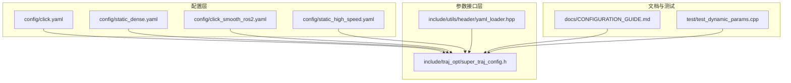
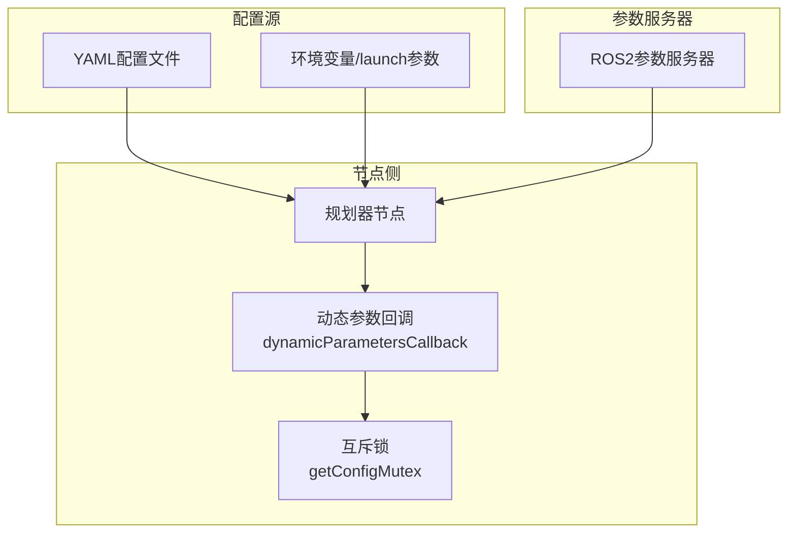
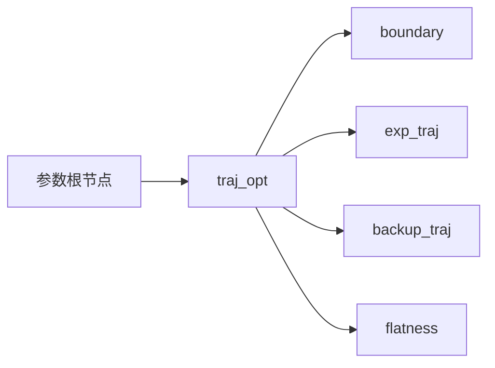
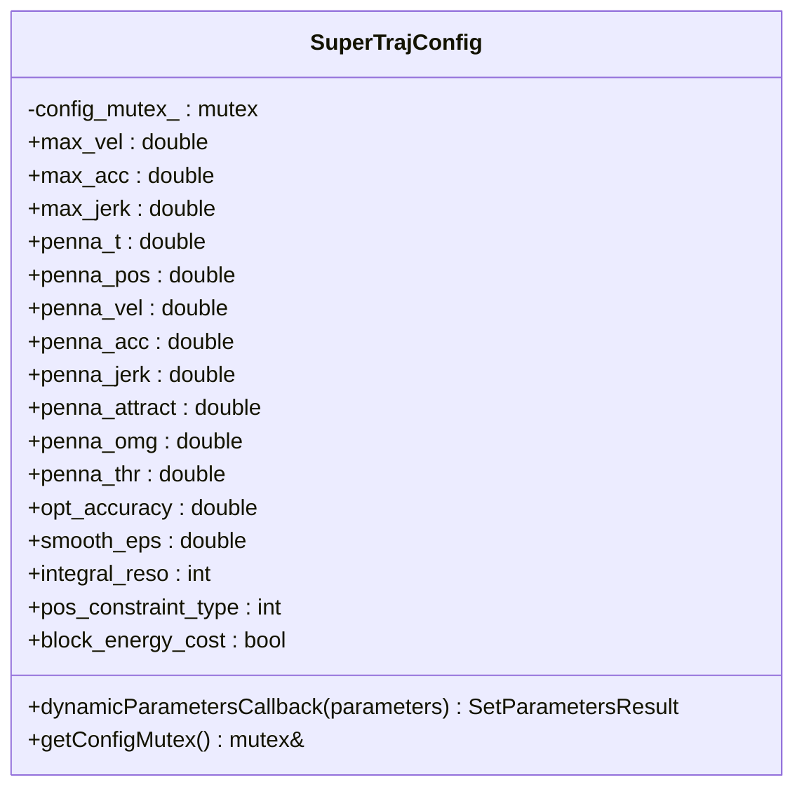
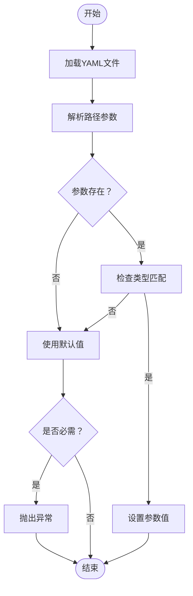
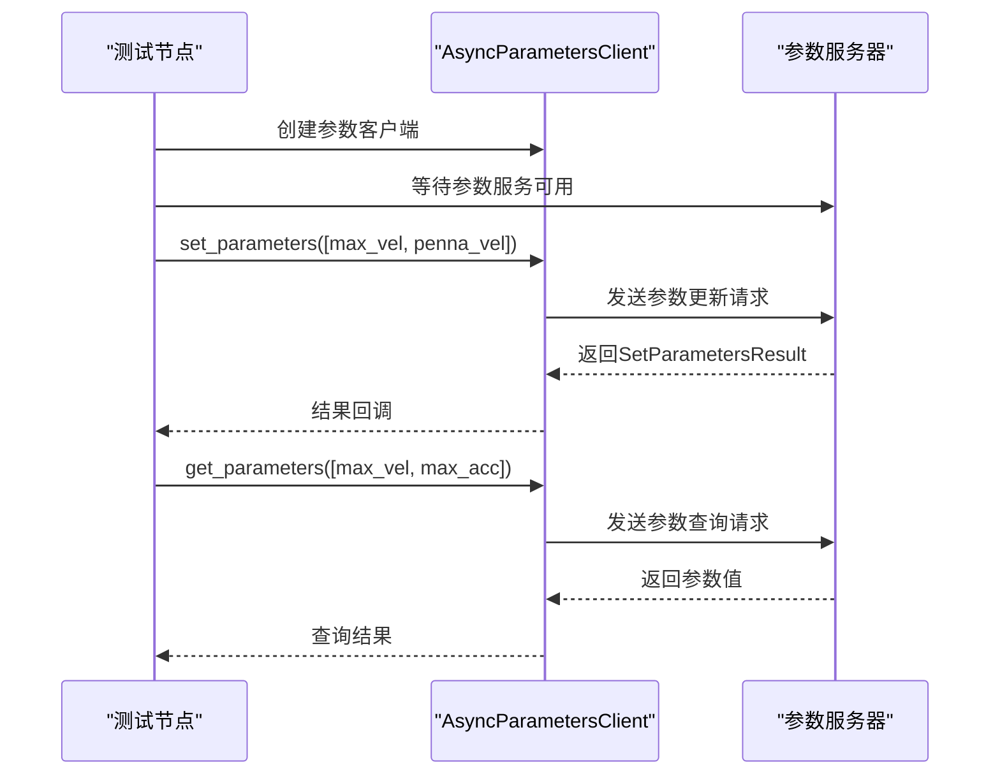
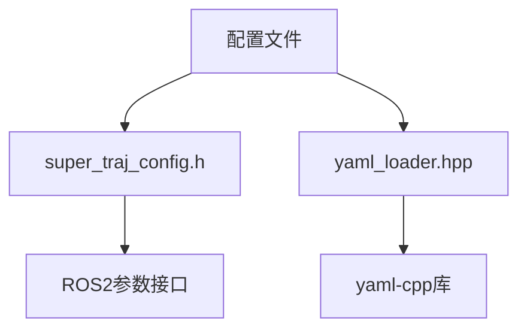

# ROS2参数接口

<cite>
**本文档引用的文件**
- [click.yaml](file://src/SUPER/super_planner/config/click.yaml)
- [static_dense.yaml](file://src/SUPER/super_planner/config/static_dense.yaml)
- [super_traj_config.h](file://src/SUPER/super_planner/include/traj_opt/super_traj_config.h)
- [test_dynamic_params.cpp](file://src/SUPER/super_planner/test/test_dynamic_params.cpp)
- [CONFIGURATION_GUIDE.md](file://src/SUPER/super_planner/docs/CONFIGURATION_GUIDE.md)
- [yaml_loader.hpp](file://src/SUPER/super_planner/include/utils/header/yaml_loader.hpp)
- [click.yaml](file://src/SUPER/mars_uav_sim/perfect_drone_sim/config/click.yaml)
- [waypoint.yaml](file://src/SUPER/mission_planner/config/waypoint.yaml)
</cite>

## 目录
1. [简介](#简介)
2. [项目结构](#项目结构)
3. [核心组件](#核心组件)
4. [架构总览](#架构总览)
5. [详细组件分析](#详细组件分析)
6. [依赖关系分析](#依赖关系分析)
7. [性能考虑](#性能考虑)
8. [故障排除指南](#故障排除指南)
9. [结论](#结论)
10. [附录](#附录)

## 简介
本文件系统性梳理SUPER项目的ROS2参数接口，覆盖参数服务器的组织结构（命名空间、分组与层次关系）、可配置参数清单（规划参数、地图参数、可视化参数等）、数据类型与取值范围、默认值与动态更新机制，并提供最佳实践、性能影响分析、调优策略、参数验证与错误处理、回退策略以及参数持久化与批量配置工具的使用方法。

## 项目结构
本项目围绕超级规划器（super_planner）构建参数体系，主要涉及以下文件与目录：
- 配置文件：位于super_planner/config/，包含运行场景的预设参数
- 参数接口实现：位于super_planner/include/traj_opt/，定义动态参数回调与参数容器
- 参数加载工具：位于super_planner/include/utils/header/，提供YAML参数加载能力
- 文档与示例：位于super_planner/docs/，包含配置指南与动态参数测试代码

**图表来源**
- [click.yaml](file://src/SUPER/super_planner/config/click.yaml#L1-L190)
- [static_dense.yaml](file://src/SUPER/super_planner/config/static_dense.yaml#L1-L186)
- [super_traj_config.h](file://src/SUPER/super_planner/include/traj_opt/super_traj_config.h#L37-L179)
- [yaml_loader.hpp](file://src/SUPER/super_planner/include/utils/header/yaml_loader.hpp#L48-L177)
- [CONFIGURATION_GUIDE.md](file://src/SUPER/super_planner/docs/CONFIGURATION_GUIDE.md#L1-L411)
- [test_dynamic_params.cpp](file://src/SUPER/super_planner/test/test_dynamic_params.cpp#L10-L118)

**章节来源**
- [click.yaml](file://src/SUPER/super_planner/config/click.yaml#L1-L190)
- [static_dense.yaml](file://src/SUPER/super_planner/config/static_dense.yaml#L1-L186)
- [super_traj_config.h](file://src/SUPER/super_planner/include/traj_opt/super_traj_config.h#L37-L179)
- [yaml_loader.hpp](file://src/SUPER/super_planner/include/utils/header/yaml_loader.hpp#L48-L177)
- [CONFIGURATION_GUIDE.md](file://src/SUPER/super_planner/docs/CONFIGURATION_GUIDE.md#L1-L411)
- [test_dynamic_params.cpp](file://src/SUPER/super_planner/test/test_dynamic_params.cpp#L10-L118)

## 核心组件
- 参数容器与动态回调：在轨迹优化模块中定义参数容器类，提供动态参数回调函数，支持在运行时更新参数并保证线程安全。
- YAML参数加载：提供通用的YAML参数加载器，支持按路径访问嵌套参数、类型校验与默认值回退。
- 配置文件：提供多种场景的预设参数文件，便于快速切换不同环境与任务需求。
- 动态参数测试：提供测试节点，演示如何通过参数客户端设置与获取参数，验证动态更新机制。

**章节来源**
- [super_traj_config.h](file://src/SUPER/super_planner/include/traj_opt/super_traj_config.h#L37-L179)
- [yaml_loader.hpp](file://src/SUPER/super_planner/include/utils/header/yaml_loader.hpp#L48-L177)
- [click.yaml](file://src/SUPER/super_planner/config/click.yaml#L1-L190)
- [static_dense.yaml](file://src/SUPER/super_planner/config/static_dense.yaml#L1-L186)
- [test_dynamic_params.cpp](file://src/SUPER/super_planner/test/test_dynamic_params.cpp#L10-L118)

## 架构总览
参数接口采用“配置文件 + 动态参数回调 + YAML加载工具”的分层设计：
- 配置文件层：提供初始参数与场景化预设
- 参数接口层：封装参数容器与动态回调，负责参数同步与线程安全
- 工具层：提供YAML解析与路径访问能力，支持类型校验与默认值回退
- 文档与测试：提供配置指南与动态参数测试脚本

**图表来源**
- [super_traj_config.h](file://src/SUPER/super_planner/include/traj_opt/super_traj_config.h#L72-L179)
- [click.yaml](file://src/SUPER/super_planner/config/click.yaml#L1-L190)
- [static_dense.yaml](file://src/SUPER/super_planner/config/static_dense.yaml#L1-L186)

## 详细组件分析

### 参数命名空间与层次结构
- 命名空间：参数名采用层级命名，如traj_opt.boundary.max_vel、traj_opt.exp_traj.penna_t等
- 分组：按功能域分组，如边界约束（boundary）、期望轨迹（exp_traj）、备份轨迹（backup_traj）、扁平化模型（flatness）等
- 层次关系：父节点为功能域，子节点为具体参数键；支持路径式访问

**图表来源**
- [click.yaml](file://src/SUPER/super_planner/config/click.yaml#L40-L103)
- [static_dense.yaml](file://src/SUPER/super_planner/config/static_dense.yaml#L36-L94)

**章节来源**
- [click.yaml](file://src/SUPER/super_planner/config/click.yaml#L40-L103)
- [static_dense.yaml](file://src/SUPER/super_planner/config/static_dense.yaml#L36-L94)

### 参数容器与动态回调
- 参数容器类封装了轨迹优化相关参数，包括边界约束、惩罚系数、优化参数与算法配置参数
- 动态参数回调函数遍历传入参数，根据参数名与类型更新对应字段，并记录日志
- 线程安全：通过互斥锁保护参数更新过程，避免并发冲突

**图表来源**
- [super_traj_config.h](file://src/SUPER/super_planner/include/traj_opt/super_traj_config.h#L37-L179)

**章节来源**
- [super_traj_config.h](file://src/SUPER/super_planner/include/traj_opt/super_traj_config.h#L37-L179)

### YAML参数加载与路径访问
- 支持按路径访问嵌套参数，如通过“section/key”形式定位参数
- 提供类型校验：若类型不匹配，使用默认值并记录日志
- 支持必需参数检测：缺失时抛出异常或返回失败
- 输出加载结果：成功/失败、默认值回退、类型不匹配提示

**图表来源**
- [yaml_loader.hpp](file://src/SUPER/super_planner/include/utils/header/yaml_loader.hpp#L70-L128)

**章节来源**
- [yaml_loader.hpp](file://src/SUPER/super_planner/include/utils/header/yaml_loader.hpp#L48-L177)

### 动态参数更新与测试
- 动态参数更新：通过参数客户端设置参数，回调函数自动同步到参数容器
- 测试脚本：演示设置边界参数与惩罚系数、获取参数值、错误处理与日志输出
- 参数服务：等待参数服务可用，建立异步参数客户端，周期性执行测试

**图表来源**
- [test_dynamic_params.cpp](file://src/SUPER/super_planner/test/test_dynamic_params.cpp#L10-L118)

**章节来源**
- [test_dynamic_params.cpp](file://src/SUPER/super_planner/test/test_dynamic_params.cpp#L10-L118)

### 参数类型、取值范围与默认值
- 数据类型：双精度浮点（double）、整型（int）、布尔（bool）
- 取值范围：由配置文件与业务逻辑决定，建议结合文档与测试验证
- 默认值：在参数容器中显式初始化；在YAML加载中可指定默认值并进行类型校验

**章节来源**
- [super_traj_config.h](file://src/SUPER/super_planner/include/traj_opt/super_traj_config.h#L42-L65)
- [click.yaml](file://src/SUPER/super_planner/config/click.yaml#L47-L72)
- [static_dense.yaml](file://src/SUPER/super_planner/config/static_dense.yaml#L41-L93)
- [yaml_loader.hpp](file://src/SUPER/super_planner/include/utils/header/yaml_loader.hpp#L70-L128)

### 参数验证机制、错误处理与回退策略
- 类型验证：YAML加载器在类型不匹配时使用默认值并记录日志
- 必需参数：缺失时抛出异常或返回失败，便于及时发现配置问题
- 回退策略：优先使用配置文件默认值，其次使用容器默认值，最后使用加载器默认值
- 错误处理：动态参数回调记录更新日志，测试脚本输出错误原因

**章节来源**
- [yaml_loader.hpp](file://src/SUPER/super_planner/include/utils/header/yaml_loader.hpp#L70-L128)
- [super_traj_config.h](file://src/SUPER/super_planner/include/traj_opt/super_traj_config.h#L72-L167)
- [test_dynamic_params.cpp](file://src/SUPER/super_planner/test/test_dynamic_params.cpp#L55-L80)

### 参数持久化、导入导出与批量配置
- 导出：使用ros2 param dump将当前参数导出为YAML文件
- 导入：通过ros2 param load加载参数文件，或在启动时通过配置文件固化参数
- 批量配置：在配置文件中集中管理参数，按场景切换不同配置文件

**章节来源**
- [CONFIGURATION_GUIDE.md](file://src/SUPER/super_planner/docs/CONFIGURATION_GUIDE.md#L314-L322)

## 依赖关系分析
- 参数容器依赖ROS2参数接口（rclcpp、rcl_interfaces），用于动态参数回调与结果返回
- YAML加载器依赖yaml-cpp库，提供YAML解析与路径访问能力
- 配置文件为参数容器与YAML加载器提供初始数据源
- 文档与测试脚本为参数接口提供使用示例与验证手段

**图表来源**
- [super_traj_config.h](file://src/SUPER/super_planner/include/traj_opt/super_traj_config.h#L26-L29)
- [yaml_loader.hpp](file://src/SUPER/super_planner/include/utils/header/yaml_loader.hpp#L35-L38)
- [click.yaml](file://src/SUPER/super_planner/config/click.yaml#L1-L190)
- [static_dense.yaml](file://src/SUPER/super_planner/config/static_dense.yaml#L1-L186)

**章节来源**
- [super_traj_config.h](file://src/SUPER/super_planner/include/traj_opt/super_traj_config.h#L26-L29)
- [yaml_loader.hpp](file://src/SUPER/super_planner/include/utils/header/yaml_loader.hpp#L35-L38)
- [click.yaml](file://src/SUPER/super_planner/config/click.yaml#L1-L190)
- [static_dense.yaml](file://src/SUPER/super_planner/config/static_dense.yaml#L1-L186)

## 性能考虑
- 参数更新频率：动态参数回调在参数变更时触发，建议避免频繁更新密集参数
- 优化精度与计算开销：降低opt_accuracy、integral_reso可提升性能，但可能影响轨迹质量
- 地图分辨率与A*搜索：分辨率越高，计算开销越大；可通过场景化配置平衡精度与性能
- 可视化与日志：启用可视化与详细日志会增加CPU/GPU与IO开销，建议在离线调试时开启

[本节为通用指导，无需特定文件分析]

## 故障排除指南
- 动态参数不生效：检查参数名大小写、确认节点收到回调、必要时重启节点
- 参数类型不匹配：检查YAML类型与期望类型一致，或提供默认值
- 参数缺失：为必需参数提供默认值或在配置文件中补齐
- 性能问题：降低优化精度与积分分辨率，调整地图分辨率与A*启发式类型

**章节来源**
- [CONFIGURATION_GUIDE.md](file://src/SUPER/super_planner/docs/CONFIGURATION_GUIDE.md#L374-L385)
- [yaml_loader.hpp](file://src/SUPER/super_planner/include/utils/header/yaml_loader.hpp#L118-L128)
- [test_dynamic_params.cpp](file://src/SUPER/super_planner/test/test_dynamic_params.cpp#L37-L103)

## 结论
本参数接口通过清晰的命名空间与分组、完善的动态参数回调、健壮的YAML加载与验证机制，实现了高性能、易维护、可扩展的参数管理体系。结合场景化配置与批量配置工具，可在不同任务与环境中快速切换最优参数组合，并通过导出/导入实现参数的持久化与复用。

[本节为总结性内容，无需特定文件分析]

## 附录

### 参数清单与说明（按功能域）
- 规划参数（traj_opt.boundary）
  - max_vel：最大速度（m/s）
  - max_acc：最大加速度（m/s²）
  - max_jerk：最大加加速度（m/s³）
  - max_acc_thr：最大推力加速度
  - min_acc_thr：最小推力加速度
  - penna_margin：PENNA边界

- 期望轨迹参数（traj_opt.exp_traj）
  - pos_constraint_type：位置约束类型（1=路径点, 2=走廊）
  - energy_cost_type：能量代价类型
  - block_energy_cost：是否禁用能量代价
  - opt_accuracy：优化精度
  - smooth_eps：平滑参数
  - integral_reso：积分分辨率
  - penna_t：时间惩罚
  - penna_pos：位置惩罚
  - penna_vel：速度惩罚
  - penna_acc：加速度惩罚
  - penna_jerk：加加速度惩罚
  - penna_attract：吸引子惩罚
  - penna_omg：角速度惩罚
  - penna_thr：推力惩罚

- 备份轨迹参数（traj_opt.backup_traj）
  - uniform_time_en：是否使用均匀时间
  - pos_constraint_type：位置约束类型
  - piece_num：分段数量
  - energy_cost_type：能量代价类型
  - block_energy_cost：是否禁用能量代价
  - opt_accuracy：优化精度
  - smooth_eps：平滑参数
  - integral_reso：积分分辨率
  - penna_t：时间惩罚
  - penna_ts：时间段惩罚
  - penna_pos：位置惩罚
  - penna_vel：速度惩罚
  - penna_acc：加速度惩罚
  - penna_jerk：加加速度惩罚
  - penna_omg：角速度惩罚
  - penna_max_acc_thr：最大推力加速度惩罚
  - penna_min_acc_thr：最小推力加速度惩罚

- 扁平化模型参数（traj_opt.flatness）
  - mass：无人机质量（kg）
  - dh：水平阻力系数
  - dv：垂直阻力系数
  - cp：系数
  - v_eps：速度小量
  - grav：重力加速度

- A*路径搜索参数（astar）
  - map_voxel_num：地图体素数量[x,y,z]
  - visual_process：是否在搜索中启用可视化
  - allow_diag：是否允许对角线移动
  - heu_type：启发式函数类型（0=对角线, 1=曼哈顿, 2=欧几里得）
  - debug_visualization_en：是否启用调试可视化

- ROG地图参数（rog_map）
  - resolution：分辨率
  - inflation_resolution：膨胀分辨率
  - inflation_step：膨胀步数
  - unk_inflation_en：是否启用未知区域膨胀
  - unk_inflation_step：未知区域膨胀步数
  - map_size：地图大小[x,y,z]
  - fix_map_origin：地图原点[x,y,z]
  - frontier_extraction_en：是否启用前沿提取
  - virtual_ceil_height：虚拟天花板高度
  - virtual_ground_height：虚拟地面高度
  - load_pcd_en：是否加载点云
  - map_sliding.enable：是否启用地图滑动
  - map_sliding.threshold：地图滑动最小距离（m）
  - esdf.enable：是否启用ESDF
  - esdf.resolution：ESDF分辨率
  - esdf.local_update_box：ESDF更新范围[x,y,z]
  - ros_callback.enable：是否启用ROS回调
  - ros_callback.cloud_topic：点云话题
  - ros_callback.odom_topic：里程计话题
  - ros_callback.odom_timeout：里程计超时时间
  - visualization.enable：是否启用可视化
  - visualization.use_dynamic_reconfigure：是否使用rqt_reconfigure
  - visualization.time_rate：可视化速率（Hz）
  - visualization.frame_rate：可视化帧率（Hz）
  - visualization.range：可视化范围[x,y,z]
  - visualization.frame_id：坐标系ID
  - visualization.pub_unknown_map_en：是否发布未知地图
  - intensity_thresh：点云强度滤波阈值
  - point_filt_num：点云时间下采样率
  - raycasting.enable：是否启用射线投射
  - raycasting.batch_update_size：批处理更新大小
  - raycasting.local_update_box：局部更新框[x,y,z]
  - raycasting.ray_range：射线投射范围[最小,最大]
  - raycasting.p_min：最小概率
  - raycasting.p_miss：未命中概率
  - raycasting.p_free：自由概率
  - raycasting.p_occ：占用概率
  - raycasting.p_hit：命中概率
  - raycasting.p_max：最大概率
  - raycasting.unk_thresh：未知阈值[0.0-1.0]

- 超级规划器参数（super_planner）
  - backup_traj_en：是否启用备份轨迹
  - detailed_log_en：是否启用详细日志
  - visualization_en：是否启用可视化
  - use_fov_cut：是否使用视场裁剪
  - print_log：是否打印日志
  - visual_process：是否启用视觉处理
  - frontend_in_known_free：是否在已知自由空间进行前端处理
  - goal_yaw_en：是否启用目标点偏航角
  - goal_vel_en：是否启用目标点速度
  - corridor_bound_dis：通道边界距离
  - corridor_line_max_length：通道线最大长度
  - safe_corridor_line_max_length：安全通道线最大长度
  - iris_iter_num：IRIS迭代次数
  - obs_skip_num：跳过障碍物数量
  - replan_forward_dt：前瞻重规划时间间隔
  - planning_horizon：规划时间范围
  - sensing_horizon：感知范围
  - receding_dis：递减距离
  - robot_r：机器人半径
  - yaw_dot_max：偏航角速度最大值
  - yaw_mode：偏航模式（1=朝向速度方向, 2=朝向目标方向）
  - mpc_horizon：MPC时间步数

- FSM参数（fsm）
  - click_goal_en：是否启用点击目标功能
  - click_goal_topic：点击目标话题名称
  - click_height：点击目标的高度值
  - click_yaw_en：是否启用点击偏航角功能
  - replan_rate：重规划频率（Hz）
  - cmd_topic：位置命令话题名称
  - mpc_cmd_topic：MPC命令话题名称
  - timer_en：是否启用定时器

- 任务规划器参数（mission_planner）
  - goal_pub_topic：目标发布话题
  - odom_topic：里程计话题
  - start_trigger_type：启动触发类型（0=RVIZ, 1=Mavros, 2=常量时间）
  - start_program_delay：程序启动延迟（秒）
  - cmd_type：命令类型（0=路径, 1=航路点）
  - switch_dis：航路点切换距离阈值
  - odom_timeout：里程计超时阈值（秒）
  - publish_dt：目标发布周期（秒）

**章节来源**
- [click.yaml](file://src/SUPER/super_planner/config/click.yaml#L3-L190)
- [static_dense.yaml](file://src/SUPER/super_planner/config/static_dense.yaml#L1-L186)
- [CONFIGURATION_GUIDE.md](file://src/SUPER/super_planner/docs/CONFIGURATION_GUIDE.md#L21-L171)
- [waypoint.yaml](file://src/SUPER/mission_planner/config/waypoint.yaml#L1-L19)

### 最佳实践与调优策略
- 先用高精度、保守参数测试，再逐步优化性能
- 逐项调整单一参数，观察效果后再进行下一项调整
- 建立参数库，按场景保存与切换配置
- 定期备份有效配置，纳入版本控制
- 使用日志记录性能指标，持续监控参数效果

**章节来源**
- [CONFIGURATION_GUIDE.md](file://src/SUPER/super_planner/docs/CONFIGURATION_GUIDE.md#L388-L411)