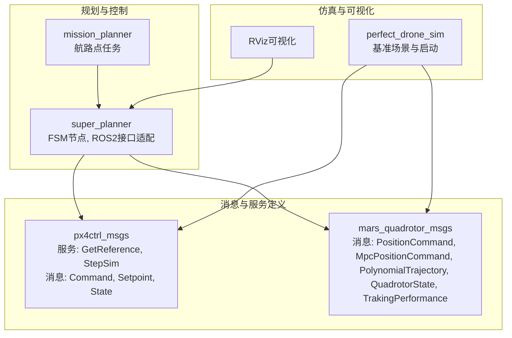
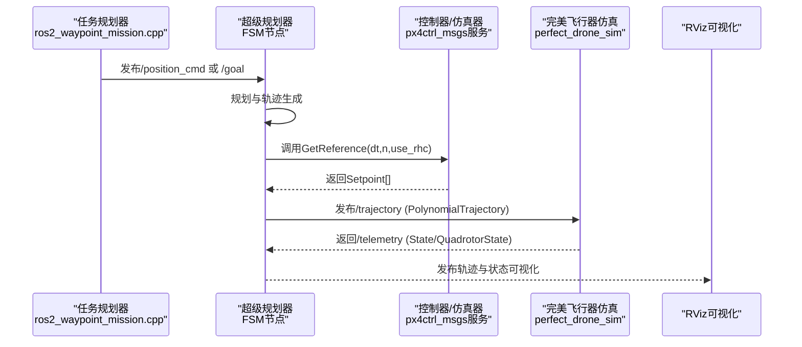
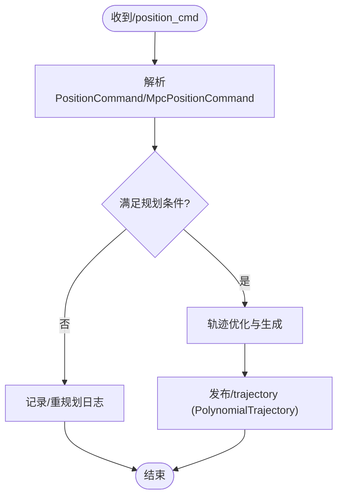
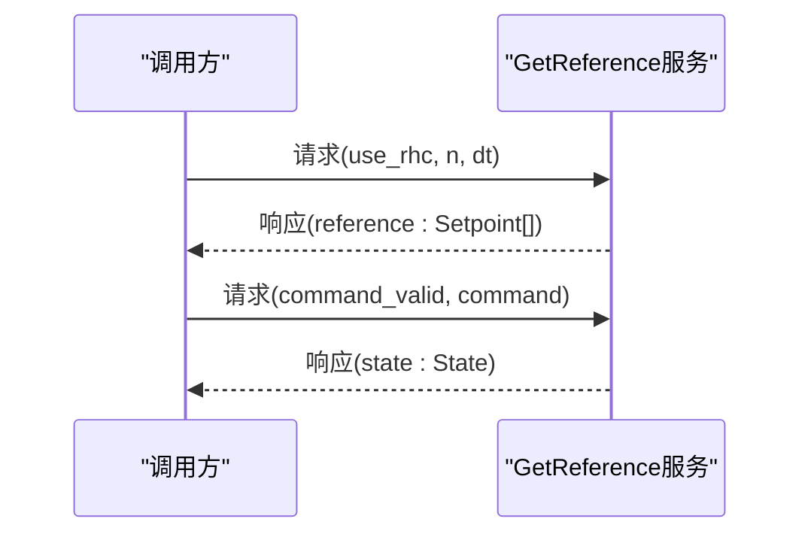
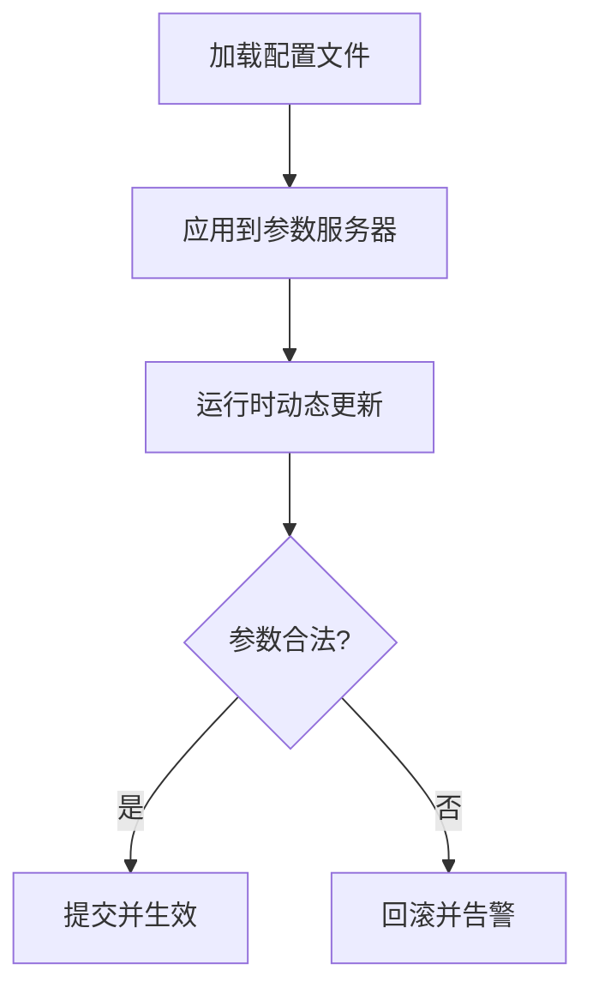
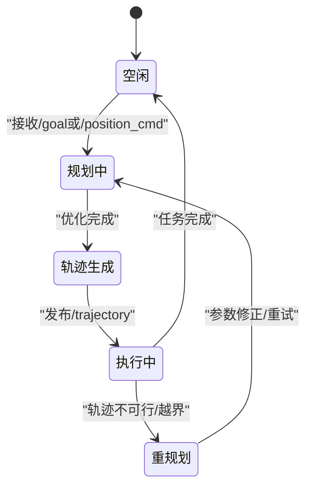
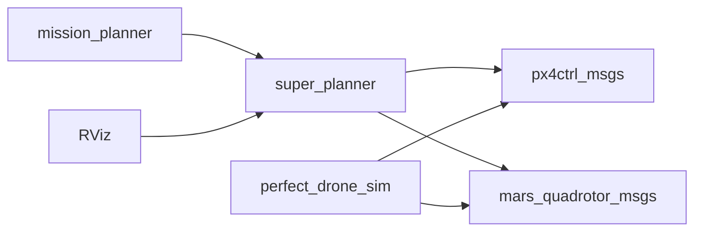
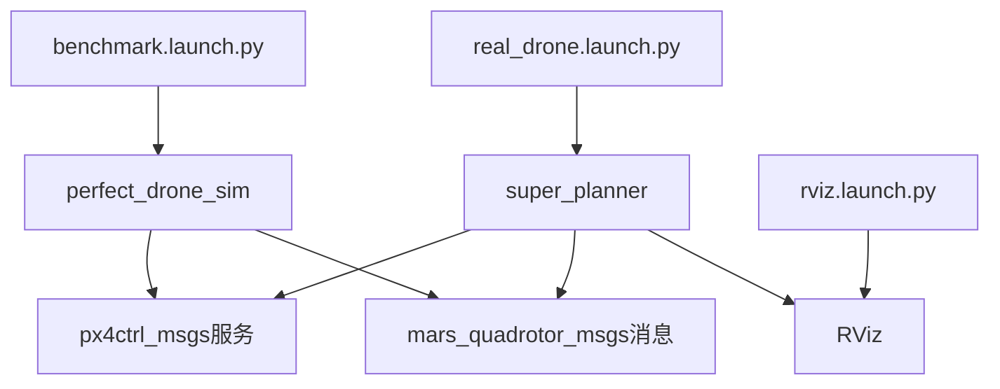

# ROS2接口API

<cite>
**本文引用的文件**
- [MpcPositionCommand.msg](file://src/SUPER/mars_uav_sim/mars_quadrotor_msgs/ros2_msg/MpcPositionCommand.msg)
- [PositionCommand.msg](file://src/SUPER/mars_uav_sim/mars_quadrotor_msgs/ros2_msg/PositionCommand.msg)
- [PolynomialTrajectory.msg](file://src/SUPER/mars_uav_sim/mars_quadrotor_msgs/ros2_msg/PolynomialTrajectory.msg)
- [QuadrotorState.msg](file://src/SUPER/mars_uav_sim/mars_quadrotor_msgs/ros2_msg/QuadrotorState.msg)
- [TrakingPerformance.msg](file://src/SUPER/mars_uav_sim/mars_quadrotor_msgs/ros2_msg/TrakingPerformance.msg)
- [GetReference.srv](file://src/SUPER/mars_uav_sim/px4ctrl_msgs/srv/GetReference.srv)
- [StepSim.srv](file://src/SUPER/mars_uav_sim/px4ctrl_msgs/srv/StepSim.srv)
- [Command.msg](file://src/SUPER/mars_uav_sim/px4ctrl_msgs/msg/Command.msg)
- [Setpoint.msg](file://src/SUPER/mars_uav_sim/px4ctrl_msgs/msg/Setpoint.msg)
- [State.msg](file://src/SUPER/mars_uav_sim/px4ctrl_msgs/msg/State.msg)
- [click.yaml](file://src/SUPER/super_planner/config/click.yaml)
- [static_dense.yaml](file://src/SUPER/super_planner/config/static_dense.yaml)
- [static_high_speed.yaml](file://src/SUPER/super_planner/config/static_high_speed.yaml)
- [click_real_ros2.yaml](file://src/SUPER/super_planner/config/click_real_ros2.yaml)
- [click_smooth_ros2.yaml](file://src/SUPER/super_planner/config/click_smooth_ros2.yaml)
- [fsm_node_ros2.cpp](file://src/SUPER/super_planner/Apps/fsm_node_ros2.cpp)
- [ros2_interface.hpp](file://src/SUPER/super_planner/include/super_planner/ros_interface/ros2/ros2_interface.hpp)
- [ros2_adapter.hpp](file://src/SUPER/super_planner/include/super_planner/ros_interface/ros2/ros2_adapter.hpp)
- [ros2_waypoint_mission.cpp](file://src/SUPER/mission_planner/Apps/ros2_waypoint_mission.cpp)
- [benchmark.launch.py](file://src/SUPER/perfect_drone_sim/launch/benchmark.launch.py)
- [real_drone.launch.py](file://src/SUPER/super_planner/launch/real_drone.launch.py)
- [rviz.launch.py](file://src/SUPER/super_planner/launch/rviz.launch.py)
</cite>

## 目录
1. [简介](#简介)
2. [项目结构](#项目结构)
3. [核心组件](#核心组件)
4. [架构总览](#架构总览)
5. [详细组件分析](#详细组件分析)
6. [依赖关系分析](#依赖关系分析)
7. [性能考虑](#性能考虑)
8. [故障排查指南](#故障排查指南)
9. [结论](#结论)
10. [附录](#附录)

## 简介
本文件面向ROS2环境下的规划与控制接口API，系统性梳理以下内容：
- 话题接口规范：输入话题（如/position_cmd、/goal）与输出话题（如/trajectory、/replan_log）的消息格式与典型发布频率建议。
- 服务接口定义：GetReference服务与StepSim服务的请求/响应字段与交互流程。
- 参数服务器接口：参数名称、数据类型、默认值与动态更新机制。
- 节点间通信协议：消息传递顺序、同步机制与错误处理策略。
- 启动文件配置示例与节点连接图。
- 参数调优实践指南与常见配置问题的解决方案。

## 项目结构
该仓库采用多包协作的组织方式，涉及如下与接口API直接相关的模块：
- 无人机仿真与消息：mars_uav_sim（含px4ctrl_msgs与mars_quadrotor_msgs），提供底层控制与轨迹消息定义。
- 超级规划器：super_planner，包含ROS2适配层、FSM节点与配置文件。
- 任务规划器：mission_planner，提供航路点任务接口与启动脚本。
- 完美飞行器仿真：perfect_drone_sim，提供基准场景与可视化启动。

**图表来源**
- [GetReference.srv](file://src/SUPER/mars_uav_sim/px4ctrl_msgs/srv/GetReference.srv#L1-L9)
- [StepSim.srv](file://src/SUPER/mars_uav_sim/px4ctrl_msgs/srv/StepSim.srv#L1-L10)
- [Command.msg](file://src/SUPER/mars_uav_sim/px4ctrl_msgs/msg/Command.msg#L1-L18)
- [Setpoint.msg](file://src/SUPER/mars_uav_sim/px4ctrl_msgs/msg/Setpoint.msg#L1-L14)
- [State.msg](file://src/SUPER/mars_uav_sim/px4ctrl_msgs/msg/State.msg#L1-L12)
- [PositionCommand.msg](file://src/SUPER/mars_uav_sim/mars_quadrotor_msgs/ros2_msg/PositionCommand.msg#L1-L30)
- [MpcPositionCommand.msg](file://src/SUPER/mars_uav_sim/mars_quadrotor_msgs/ros2_msg/MpcPositionCommand.msg#L1-L7)
- [PolynomialTrajectory.msg](file://src/SUPER/mars_uav_sim/mars_quadrotor_msgs/ros2_msg/PolynomialTrajectory.msg#L1-L39)
- [QuadrotorState.msg](file://src/SUPER/mars_uav_sim/mars_quadrotor_msgs/ros2_msg/QuadrotorState.msg#L1-L11)
- [TrakingPerformance.msg](file://src/SUPER/mars_uav_sim/mars_quadrotor_msgs/ros2_msg/TrakingPerformance.msg#L1-L16)

**章节来源**
- [fsm_node_ros2.cpp](file://src/SUPER/super_planner/Apps/fsm_node_ros2.cpp#L1-L200)
- [ros2_interface.hpp](file://src/SUPER/super_planner/include/super_planner/ros_interface/ros2/ros2_interface.hpp#L1-L200)
- [ros2_adapter.hpp](file://src/SUPER/super_planner/include/super_planner/ros_interface/ros2/ros2_adapter.hpp#L1-L200)

## 核心组件
本节聚焦于接口API的核心组成：消息、服务与参数。

- 位置/轨迹相关消息
  - PositionCommand：目标位置、速度、加速度、急动度、角速度、姿态、推力、偏航、雅可比范数等，以及轨迹标志位与增益参数。
  - MpcPositionCommand：包含多个PositionCommand、MPC时域长度与命令标志。
  - PolynomialTrajectory：轨迹ID、类型标志（位置/偏航/心跳/紧急停止）、分段阶数与系数、起始系统墙钟时间、调试信息。
  - QuadrotorState：飞行器状态（位置、速度、加速度、急动度、姿态、角速度）与推力范数。
  - TrakingPerformance：跟踪误差与参考/命令/反馈状态的对比。

- 控制服务与消息
  - GetReference：请求是否使用滚动时域控制、参考轨迹点数量与时间步长；响应为Setpoint数组。
  - StepSim：请求包含Command与有效性标记；响应为当前State。
  - Command：控制输入、位置/速度/加速度/急动度、偏航与角速度、姿态类型与四元数。
  - Setpoint：状态设定点与对应Command。
  - State：当前状态向量与四个旋翼转速/推力。

- 典型话题接口
  - 输入话题
    - /position_cmd：接收MpcPositionCommand或PositionCommand，驱动控制器生成轨迹。
    - /goal：接收目标点或任务目标，触发路径规划与轨迹生成。
  - 输出话题
    - /trajectory：发布PolynomialTrajectory，供控制器执行。
    - /replan_log：发布规划日志或状态信息，便于诊断与回放。

- 参数服务器接口
  - 关键参数类别：轨迹优化参数、MPC配置、控制增益、仿真步长、可视化开关等。
  - 默认值与动态更新：通过配置文件加载默认值，支持在运行时通过动态重配置或参数服务器更新。

**章节来源**
- [PositionCommand.msg](file://src/SUPER/mars_uav_sim/mars_quadrotor_msgs/ros2_msg/PositionCommand.msg#L1-L30)
- [MpcPositionCommand.msg](file://src/SUPER/mars_uav_sim/mars_quadrotor_msgs/ros2_msg/MpcPositionCommand.msg#L1-L7)
- [PolynomialTrajectory.msg](file://src/SUPER/mars_uav_sim/mars_quadrotor_msgs/ros2_msg/PolynomialTrajectory.msg#L1-L39)
- [QuadrotorState.msg](file://src/SUPER/mars_uav_sim/mars_quadrotor_msgs/ros2_msg/QuadrotorState.msg#L1-L11)
- [TrakingPerformance.msg](file://src/SUPER/mars_uav_sim/mars_quadrotor_msgs/ros2_msg/TrakingPerformance.msg#L1-L16)
- [GetReference.srv](file://src/SUPER/mars_uav_sim/px4ctrl_msgs/srv/GetReference.srv#L1-L9)
- [StepSim.srv](file://src/SUPER/mars_uav_sim/px4ctrl_msgs/srv/StepSim.srv#L1-L10)
- [Command.msg](file://src/SUPER/mars_uav_sim/px4ctrl_msgs/msg/Command.msg#L1-L18)
- [Setpoint.msg](file://src/SUPER/mars_uav_sim/px4ctrl_msgs/msg/Setpoint.msg#L1-L14)
- [State.msg](file://src/SUPER/mars_uav_sim/px4ctrl_msgs/msg/State.msg#L1-L12)

## 架构总览
下图展示典型节点间通信与接口交互：任务规划器产生目标与航路点，超级规划器接收目标并生成轨迹，控制器通过服务/消息与仿真器交互，RViz进行可视化。

**图表来源**
- [ros2_waypoint_mission.cpp](file://src/SUPER/mission_planner/Apps/ros2_waypoint_mission.cpp#L1-L200)
- [fsm_node_ros2.cpp](file://src/SUPER/super_planner/Apps/fsm_node_ros2.cpp#L1-L200)
- [GetReference.srv](file://src/SUPER/mars_uav_sim/px4ctrl_msgs/srv/GetReference.srv#L1-L9)
- [StepSim.srv](file://src/SUPER/mars_uav_sim/px4ctrl_msgs/srv/StepSim.srv#L1-L10)
- [PolynomialTrajectory.msg](file://src/SUPER/mars_uav_sim/mars_quadrotor_msgs/ros2_msg/PolynomialTrajectory.msg#L1-L39)
- [State.msg](file://src/SUPER/mars_uav_sim/px4ctrl_msgs/msg/State.msg#L1-L12)

## 详细组件分析

### 话题接口规范
- 输入话题
  - /position_cmd：订阅MpcPositionCommand或PositionCommand，驱动轨迹生成与执行。
  - /goal：订阅目标点或任务目标，触发路径规划。
- 输出话题
  - /trajectory：发布PolynomialTrajectory，包含位置/偏航轨迹的分段阶数、系数与起始时间。
  - /replan_log：发布规划日志或状态信息，便于诊断与回放。
- 典型发布频率建议
  - /trajectory：与控制环周期一致（例如10–50Hz，依据实时性需求调整）。
  - /replan_log：按需发布，当发生重规划或异常时触发。

**图表来源**
- [PositionCommand.msg](file://src/SUPER/mars_uav_sim/mars_quadrotor_msgs/ros2_msg/PositionCommand.msg#L1-L30)
- [MpcPositionCommand.msg](file://src/SUPER/mars_uav_sim/mars_quadrotor_msgs/ros2_msg/MpcPositionCommand.msg#L1-L7)
- [PolynomialTrajectory.msg](file://src/SUPER/mars_uav_sim/mars_quadrotor_msgs/ros2_msg/PolynomialTrajectory.msg#L1-L39)

**章节来源**
- [PositionCommand.msg](file://src/SUPER/mars_uav_sim/mars_quadrotor_msgs/ros2_msg/PositionCommand.msg#L1-L30)
- [MpcPositionCommand.msg](file://src/SUPER/mars_uav_sim/mars_quadrotor_msgs/ros2_msg/MpcPositionCommand.msg#L1-L7)
- [PolynomialTrajectory.msg](file://src/SUPER/mars_uav_sim/mars_quadrotor_msgs/ros2_msg/PolynomialTrajectory.msg#L1-L39)

### 服务接口定义
- GetReference服务
  - 请求：use_rhc（是否使用滚动时域控制）、n（参考轨迹点数量）、dt（时间步长，秒）。
  - 响应：reference（Setpoint数组）。
- StepSim服务
  - 请求：command（Command）、command_valid（布尔）。
  - 响应：state（State）。

**图表来源**
- [GetReference.srv](file://src/SUPER/mars_uav_sim/px4ctrl_msgs/srv/GetReference.srv#L1-L9)
- [StepSim.srv](file://src/SUPER/mars_uav_sim/px4ctrl_msgs/srv/StepSim.srv#L1-L10)
- [Setpoint.msg](file://src/SUPER/mars_uav_sim/px4ctrl_msgs/msg/Setpoint.msg#L1-L14)
- [State.msg](file://src/SUPER/mars_uav_sim/px4ctrl_msgs/msg/State.msg#L1-L12)
- [Command.msg](file://src/SUPER/mars_uav_sim/px4ctrl_msgs/msg/Command.msg#L1-L18)

**章节来源**
- [GetReference.srv](file://src/SUPER/mars_uav_sim/px4ctrl_msgs/srv/GetReference.srv#L1-L9)
- [StepSim.srv](file://src/SUPER/mars_uav_sim/px4ctrl_msgs/srv/StepSim.srv#L1-L10)
- [Setpoint.msg](file://src/SUPER/mars_uav_sim/px4ctrl_msgs/msg/Setpoint.msg#L1-L14)
- [State.msg](file://src/SUPER/mars_uav_sim/px4ctrl_msgs/msg/State.msg#L1-L12)
- [Command.msg](file://src/SUPER/mars_uav_sim/px4ctrl_msgs/msg/Command.msg#L1-L18)

### 参数服务器接口
- 参数分类与用途
  - 轨迹优化：多项式阶数、分段数、边界条件权重。
  - MPC：时域长度、采样周期、终端约束。
  - 控制增益：位置/速度/姿态增益向量。
  - 仿真：仿真步长、是否启用可视化、渲染参数。
- 默认值与动态更新
  - 默认值来源于配置文件（如click.yaml、static_dense.yaml、static_high_speed.yaml等）。
  - 动态更新：通过参数服务器或rqt_reconfigure在运行时调整关键参数，确保不影响主循环稳定性。

**图表来源**
- [click.yaml](file://src/SUPER/super_planner/config/click.yaml#L1-L200)
- [static_dense.yaml](file://src/SUPER/super_planner/config/static_dense.yaml#L1-L200)
- [static_high_speed.yaml](file://src/SUPER/super_planner/config/static_high_speed.yaml#L1-L200)
- [click_real_ros2.yaml](file://src/SUPER/super_planner/config/click_real_ros2.yaml#L1-L200)
- [click_smooth_ros2.yaml](file://src/SUPER/super_planner/config/click_smooth_ros2.yaml#L1-L200)

**章节来源**
- [click.yaml](file://src/SUPER/super_planner/config/click.yaml#L1-L200)
- [static_dense.yaml](file://src/SUPER/super_planner/config/static_dense.yaml#L1-L200)
- [static_high_speed.yaml](file://src/SUPER/super_planner/config/static_high_speed.yaml#L1-L200)
- [click_real_ros2.yaml](file://src/SUPER/super_planner/config/click_real_ros2.yaml#L1-L200)
- [click_smooth_ros2.yaml](file://src/SUPER/super_planner/config/click_smooth_ros2.yaml#L1-L200)

### 节点间通信协议
- 消息传递顺序
  - 任务规划器发布/position_cmd或/goal。
  - 超级规划器接收后进行轨迹优化与生成。
  - 控制器通过GetReference获取参考轨迹，再通过StepSim推进仿真。
- 同步机制
  - 使用Header.stamp进行时间戳对齐，避免跨节点异步导致的控制抖动。
  - 对关键服务调用设置超时与重试策略，防止阻塞主循环。
- 错误处理
  - 当轨迹不可行或参数越界时，发布/replan_log并进入安全模式。
  - 服务调用失败时，记录错误码并降级为上一时刻的轨迹。

**图表来源**
- [ros2_waypoint_mission.cpp](file://src/SUPER/mission_planner/Apps/ros2_waypoint_mission.cpp#L1-L200)
- [fsm_node_ros2.cpp](file://src/SUPER/super_planner/Apps/fsm_node_ros2.cpp#L1-L200)
- [PolynomialTrajectory.msg](file://src/SUPER/mars_uav_sim/mars_quadrotor_msgs/ros2_msg/PolynomialTrajectory.msg#L1-L39)

**章节来源**
- [ros2_waypoint_mission.cpp](file://src/SUPER/mission_planner/Apps/ros2_waypoint_mission.cpp#L1-L200)
- [fsm_node_ros2.cpp](file://src/SUPER/super_planner/Apps/fsm_node_ros2.cpp#L1-L200)

## 依赖关系分析
- 模块耦合
  - mission_planner与super_planner通过/position_cmd与/goal耦合。
  - super_planner依赖px4ctrl_msgs服务与mars_quadrotor_msgs消息实现闭环控制。
- 外部依赖
  - 依赖ROS2生态（rclcpp、tf2、rviz2等）与第三方数学库（Eigen、GLM等）。
- 潜在环依赖
  - 通过消息与服务解耦，避免直接include导致的编译环。

**图表来源**
- [ros2_waypoint_mission.cpp](file://src/SUPER/mission_planner/Apps/ros2_waypoint_mission.cpp#L1-L200)
- [fsm_node_ros2.cpp](file://src/SUPER/super_planner/Apps/fsm_node_ros2.cpp#L1-L200)
- [GetReference.srv](file://src/SUPER/mars_uav_sim/px4ctrl_msgs/srv/GetReference.srv#L1-L9)
- [PolynomialTrajectory.msg](file://src/SUPER/mars_uav_sim/mars_quadrotor_msgs/ros2_msg/PolynomialTrajectory.msg#L1-L39)

**章节来源**
- [ros2_interface.hpp](file://src/SUPER/super_planner/include/super_planner/ros_interface/ros2/ros2_interface.hpp#L1-L200)
- [ros2_adapter.hpp](file://src/SUPER/super_planner/include/super_planner/ros_interface/ros2/ros2_adapter.hpp#L1-L200)

## 性能考虑
- 优化轨迹发布频率：根据控制环带宽与计算负载平衡，避免过高的发布频率造成CPU压力。
- 服务调用批量化：合并多次GetReference调用，减少网络与调度开销。
- 内存与序列化：优先使用紧凑消息，避免频繁分配；必要时复用缓冲区。
- 实时性保障：将关键节点置于实时调度策略下，降低中断延迟。

## 故障排查指南
- 无法接收到/trajectory
  - 检查规划器是否正确发布/position_cmd或/goal。
  - 确认超级规划器节点已启动且参数加载成功。
- StepSim服务超时
  - 检查仿真器是否正常运行，确认请求参数合理（command_valid、dt）。
- 轨迹不可行
  - 查看/replan_log中的错误码，调整MPC时域或边界条件。
- 参数未生效
  - 使用参数服务器检查当前值，确认动态重配置流程无异常。

**章节来源**
- [TrakingPerformance.msg](file://src/SUPER/mars_uav_sim/mars_quadrotor_msgs/ros2_msg/TrakingPerformance.msg#L1-L16)
- [GetReference.srv](file://src/SUPER/mars_uav_sim/px4ctrl_msgs/srv/GetReference.srv#L1-L9)
- [StepSim.srv](file://src/SUPER/mars_uav_sim/px4ctrl_msgs/srv/StepSim.srv#L1-L10)

## 结论
本文系统梳理了ROS2接口API，覆盖消息格式、服务定义、参数管理与节点通信协议，并提供了启动文件与参数调优指南。建议在实际部署中结合硬件能力与任务需求，逐步调参并建立完善的监控与回放机制。

## 附录

### 启动文件配置示例与节点连接图
- 基准场景启动
  - 使用benchmark.launch.py启动仿真与可视化。
- 真机启动
  - 使用real_drone.launch.py启动真实飞行器相关节点。
- RViz可视化
  - 使用rviz.launch.py加载预设配置文件进行轨迹与状态可视化。

**图表来源**
- [benchmark.launch.py](file://src/SUPER/perfect_drone_sim/launch/benchmark.launch.py#L1-L200)
- [real_drone.launch.py](file://src/SUPER/super_planner/launch/real_drone.launch.py#L1-L200)
- [rviz.launch.py](file://src/SUPER/super_planner/launch/rviz.launch.py#L1-L200)

**章节来源**
- [benchmark.launch.py](file://src/SUPER/perfect_drone_sim/launch/benchmark.launch.py#L1-L200)
- [real_drone.launch.py](file://src/SUPER/super_planner/launch/real_drone.launch.py#L1-L200)
- [rviz.launch.py](file://src/SUPER/super_planner/launch/rviz.launch.py#L1-L200)

### 参数调优实践指南
- 初始设置
  - 从配置文件中加载默认参数，确保与硬件规格匹配。
- 迭代优化
  - 以/replan_log为反馈，逐步调整MPC时域、边界条件与增益。
- 动态更新
  - 在线调整dt、轨迹阶数与分段数，观察轨迹平滑性与跟踪误差。
- 常见问题
  - 参数越界：限制搜索空间，增加约束。
  - 发布频率过高：降低/trajectory发布频率，提升稳定性。
  - 服务超时：检查仿真器负载与网络延迟。

**章节来源**
- [click.yaml](file://src/SUPER/super_planner/config/click.yaml#L1-L200)
- [static_dense.yaml](file://src/SUPER/super_planner/config/static_dense.yaml#L1-L200)
- [static_high_speed.yaml](file://src/SUPER/super_planner/config/static_high_speed.yaml#L1-L200)
- [click_real_ros2.yaml](file://src/SUPER/super_planner/config/click_real_ros2.yaml#L1-L200)
- [click_smooth_ros2.yaml](file://src/SUPER/super_planner/config/click_smooth_ros2.yaml#L1-L200)