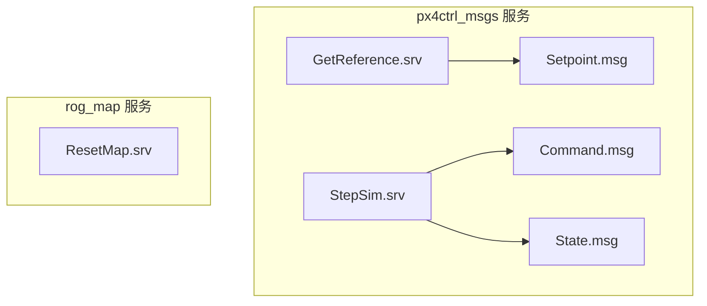
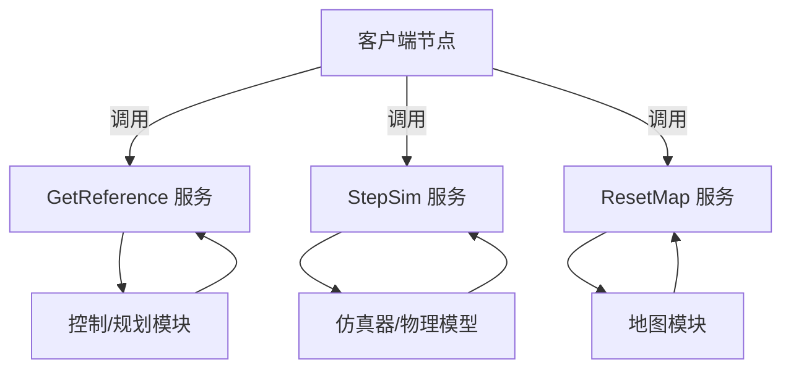
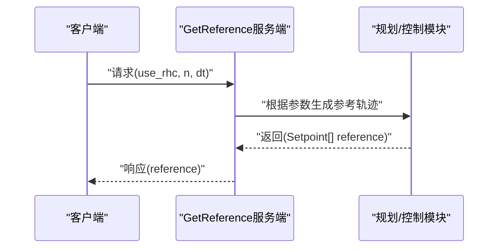
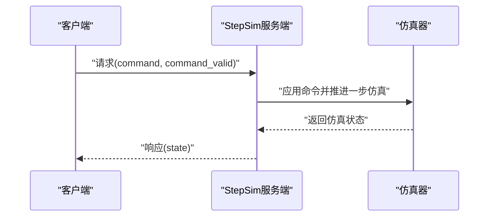
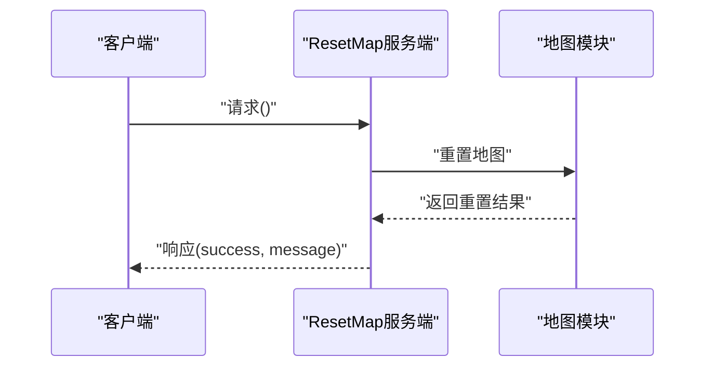
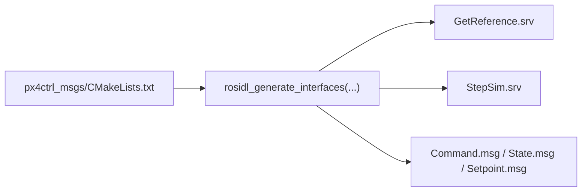

# ROS2服务接口

<cite>
**本文引用的文件**
- [src/SUPER/mars_uav_sim/px4ctrl_msgs/srv/GetReference.srv](file://src/SUPER/mars_uav_sim/px4ctrl_msgs/srv/GetReference.srv)
- [src/SUPER/mars_uav_sim/px4ctrl_msgs/srv/StepSim.srv](file://src/SUPER/mars_uav_sim/px4ctrl_msgs/srv/StepSim.srv)
- [src/SUPER/rog_map/srv/ResetMap.srv](file://src/SUPER/rog_map/srv/ResetMap.srv)
- [src/SUPER/mars_uav_sim/px4ctrl_msgs/CMakeLists.txt](file://src/SUPER/mars_uav_sim/px4ctrl_msgs/CMakeLists.txt)
- [src/SUPER/rog_map/doc/API_REFERENCE.md](file://src/SUPER/rog_map/doc/API_REFERENCE.md)
</cite>

## 目录
1. [简介](#简介)
2. [项目结构](#项目结构)
3. [核心组件](#核心组件)
4. [架构总览](#架构总览)
5. [详细组件分析](#详细组件分析)
6. [依赖关系分析](#依赖关系分析)
7. [性能考虑](#性能考虑)
8. [故障排查指南](#故障排查指南)
9. [结论](#结论)
10. [附录](#附录)

## 简介
本文件面向ROS2环境下的服务接口，围绕以下三个服务进行系统化说明：
- GetReference：用于请求参考轨迹，包含是否使用滚动时域控制、采样数量与时间步长等请求参数；响应为参考轨迹点序列。
- StepSim：用于仿真步进控制，请求包含控制命令与有效性标记；响应为当前仿真状态。
- ResetMap：用于重置地图，请求为空；响应包含成功标志与消息。

文档同时提供服务调用示例的实现思路、超时与重试策略建议、异常处理方法，以及版本兼容性与迁移指南。

## 项目结构
本仓库中与服务接口直接相关的核心文件位于如下位置：
- px4ctrl_msgs包定义了GetReference与StepSim服务，以及相关消息类型（Command、State、Setpoint）。
- rog_map包定义了ResetMap服务，并在API文档中给出服务签名与使用说明。

图表来源
- [src/SUPER/mars_uav_sim/px4ctrl_msgs/srv/GetReference.srv](file://src/SUPER/mars_uav_sim/px4ctrl_msgs/srv/GetReference.srv#L1-L9)
- [src/SUPER/mars_uav_sim/px4ctrl_msgs/srv/StepSim.srv](file://src/SUPER/mars_uav_sim/px4ctrl_msgs/srv/StepSim.srv#L1-L10)
- [src/SUPER/rog_map/srv/ResetMap.srv](file://src/SUPER/rog_map/srv/ResetMap.srv#L1-L7)

章节来源
- [src/SUPER/mars_uav_sim/px4ctrl_msgs/srv/GetReference.srv](file://src/SUPER/mars_uav_sim/px4ctrl_msgs/srv/GetReference.srv#L1-L9)
- [src/SUPER/mars_uav_sim/px4ctrl_msgs/srv/StepSim.srv](file://src/SUPER/mars_uav_sim/px4ctrl_msgs/srv/StepSim.srv#L1-L10)
- [src/SUPER/rog_map/srv/ResetMap.srv](file://src/SUPER/rog_map/srv/ResetMap.srv#L1-L7)

## 核心组件
- GetReference服务
  - 请求参数：use_rhc（布尔）、n（整型）、dt（浮点）
  - 响应参数：reference（Setpoint数组）
- StepSim服务
  - 请求参数：command（Command）、command_valid（布尔）
  - 响应参数：state（State）
- ResetMap服务
  - 请求参数：空
  - 响应参数：success（布尔）、message（字符串）

章节来源
- [src/SUPER/mars_uav_sim/px4ctrl_msgs/srv/GetReference.srv](file://src/SUPER/mars_uav_sim/px4ctrl_msgs/srv/GetReference.srv#L1-L9)
- [src/SUPER/mars_uav_sim/px4ctrl_msgs/srv/StepSim.srv](file://src/SUPER/mars_uav_sim/px4ctrl_msgs/srv/StepSim.srv#L1-L10)
- [src/SUPER/rog_map/srv/ResetMap.srv](file://src/SUPER/rog_map/srv/ResetMap.srv#L1-L7)

## 架构总览
下图展示了服务在系统中的角色与交互关系。GetReference与StepSim属于飞行控制链路，ResetMap属于地图管理链路。

图表来源
- [src/SUPER/mars_uav_sim/px4ctrl_msgs/srv/GetReference.srv](file://src/SUPER/mars_uav_sim/px4ctrl_msgs/srv/GetReference.srv#L1-L9)
- [src/SUPER/mars_uav_sim/px4ctrl_msgs/srv/StepSim.srv](file://src/SUPER/mars_uav_sim/px4ctrl_msgs/srv/StepSim.srv#L1-L10)
- [src/SUPER/rog_map/srv/ResetMap.srv](file://src/SUPER/rog_map/srv/ResetMap.srv#L1-L7)

## 详细组件分析

### GetReference 服务
- 请求参数
  - use_rhc：是否启用滚动时域控制（RHC），用于决定是否以递推方式生成轨迹。
  - n：参考轨迹点的数量，决定返回数组长度。
  - dt：时间步长（秒），用于确定轨迹点之间的时间间隔。
- 响应参数
  - reference：Setpoint数组，表示参考轨迹点序列，每个元素包含期望的位置、速度、加速度、姿态等信息（具体字段由Setpoint消息定义）。
- 典型调用流程
  - 客户端构造请求（设置use_rhc、n、dt）。
  - 发送服务请求并等待响应。
  - 解析reference数组，按需下发给控制器或可视化模块。

图表来源
- [src/SUPER/mars_uav_sim/px4ctrl_msgs/srv/GetReference.srv](file://src/SUPER/mars_uav_sim/px4ctrl_msgs/srv/GetReference.srv#L1-L9)

章节来源
- [src/SUPER/mars_uav_sim/px4ctrl_msgs/srv/GetReference.srv](file://src/SUPER/mars_uav_sim/px4ctrl_msgs/srv/GetReference.srv#L1-L9)

### StepSim 服务
- 请求参数
  - command：Command消息，承载控制命令（如期望的加速度、角速度等）。
  - command_valid：布尔值，指示命令是否有效，用于安全控制。
- 响应参数
  - state：State消息，表示当前仿真状态（如位置、速度、姿态、传感器数据等）。
- 实现要点
  - 服务端接收请求后，依据command_valid判断是否应用命令。
  - 执行一步仿真推进，返回当前状态作为响应。
  - 错误处理：若命令无效或仿真器内部错误，应在响应中通过状态字段或上层日志反馈。

图表来源
- [src/SUPER/mars_uav_sim/px4ctrl_msgs/srv/StepSim.srv](file://src/SUPER/mars_uav_sim/px4ctrl_msgs/srv/StepSim.srv#L1-L10)

章节来源
- [src/SUPER/mars_uav_sim/px4ctrl_msgs/srv/StepSim.srv](file://src/SUPER/mars_uav_sim/px4ctrl_msgs/srv/StepSim.srv#L1-L10)

### ResetMap 服务
- 请求参数：空
- 响应参数
  - success：布尔值，指示重置操作是否成功。
  - message：字符串，包含操作结果的文本说明（如成功、失败原因等）。
- 执行流程
  - 服务端接收请求后，触发地图重置逻辑（清空占用栅格、重置距离场等）。
  - 返回success与message，供客户端判断后续行为（如是否继续发布点云）。

图表来源
- [src/SUPER/rog_map/srv/ResetMap.srv](file://src/SUPER/rog_map/srv/ResetMap.srv#L1-L7)
- [src/SUPER/rog_map/doc/API_REFERENCE.md](file://src/SUPER/rog_map/doc/API_REFERENCE.md#L391-L399)

章节来源
- [src/SUPER/rog_map/srv/ResetMap.srv](file://src/SUPER/rog_map/srv/ResetMap.srv#L1-L7)
- [src/SUPER/rog_map/doc/API_REFERENCE.md](file://src/SUPER/rog_map/doc/API_REFERENCE.md#L391-L399)

## 依赖关系分析
- 服务与消息的关系
  - GetReference依赖Setpoint数组。
  - StepSim依赖Command与State消息。
- 构建与导出
  - px4ctrl_msgs通过CMakeLists生成服务与消息，并导出依赖项，确保其他包可正确引用。

图表来源
- [src/SUPER/mars_uav_sim/px4ctrl_msgs/CMakeLists.txt](file://src/SUPER/mars_uav_sim/px4ctrl_msgs/CMakeLists.txt#L11-L18)

章节来源
- [src/SUPER/mars_uav_sim/px4ctrl_msgs/CMakeLists.txt](file://src/SUPER/mars_uav_sim/px4ctrl_msgs/CMakeLists.txt#L11-L18)

## 性能考虑
- GetReference
  - n与dt直接影响响应大小与处理时间。建议根据控制器采样周期合理设置n与dt，避免过长的轨迹导致客户端处理压力。
- StepSim
  - 命令有效性检查与仿真推进应尽量轻量化，避免阻塞服务线程。必要时采用异步推进或批处理策略。
- ResetMap
  - 地图重置通常涉及大范围内存操作，建议在低负载时段执行，并在响应中明确返回状态以便上层协调。

## 故障排查指南
- GetReference
  - 若reference为空或长度不足，检查n与dt设置是否合理，确认规划模块正常运行。
- StepSim
  - 若state异常或停滞，检查command_valid是否为true，确认仿真器未进入错误状态；查看仿真器日志定位问题。
- ResetMap
  - 若success为false，结合message定位具体原因（如资源占用、权限问题等），并在重试前清理相关资源。

## 结论
本文对GetReference、StepSim与ResetMap三个服务进行了系统化说明，覆盖了请求/响应格式、典型调用流程、实现要点与故障排查建议。建议在实际部署中结合具体硬件与任务需求，对参数进行调优，并完善超时与重试策略以提升鲁棒性。

## 附录

### 服务调用示例（实现思路）
- 客户端调用GetReference
  - 构造请求对象，设置use_rhc、n、dt。
  - 使用服务代理发起请求，解析reference数组。
- 客户端调用StepSim
  - 准备Command与command_valid，发送请求并解析State。
- 客户端调用ResetMap
  - 直接发送空请求，解析success与message并据此采取后续动作。

### 超时与重试策略
- 超时
  - 为每个服务调用设置合理的超时阈值（如1~5秒），避免长时间阻塞。
- 重试
  - 对于瞬时性错误（如通信抖动），可在指数退避基础上进行有限次数重试。
- 异常处理
  - 捕获网络异常、服务不可用、响应格式错误等情况，记录日志并回退到安全状态。

### 版本兼容性与迁移指南
- 服务接口稳定性
  - 保持请求/响应字段不变，新增字段时保留向后兼容（例如添加可选字段并提供默认值）。
- 迁移建议
  - 当需要破坏性变更时，先在新版本中提供兼容层，逐步引导用户迁移至新接口。
  - 更新CMakeLists中的接口生成配置，确保下游包能够正确编译与链接。