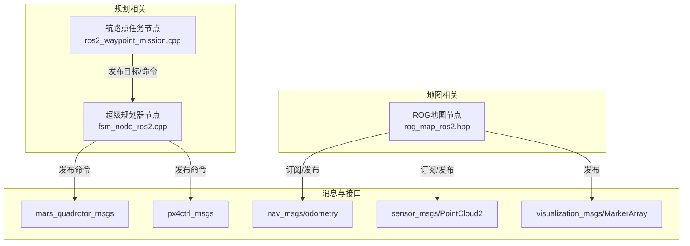
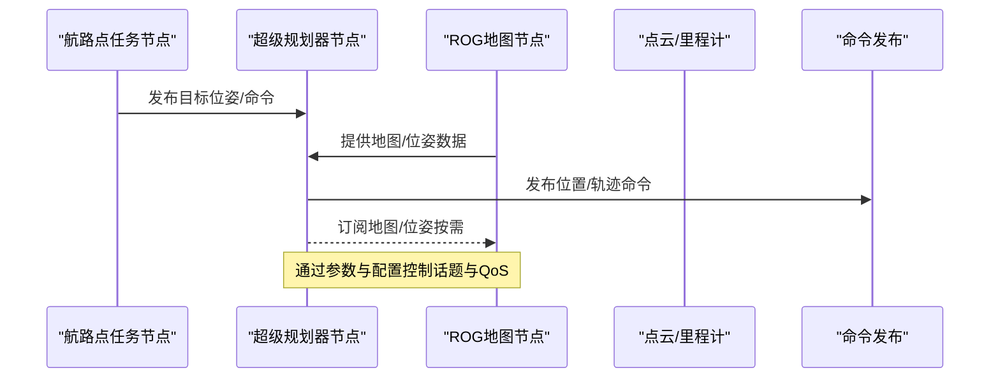
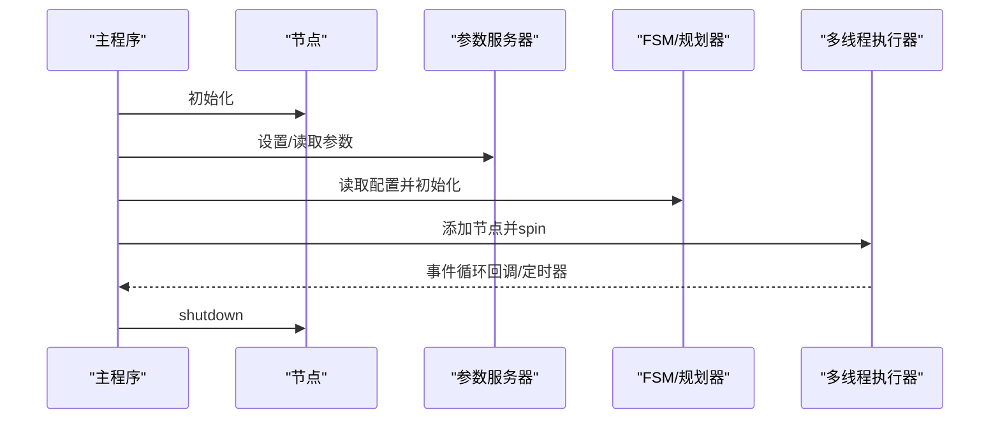
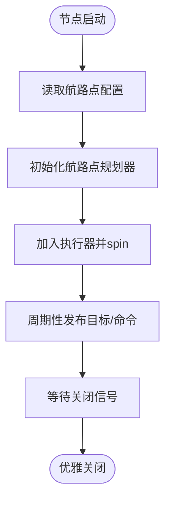
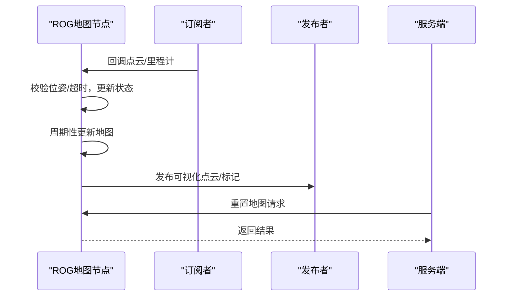
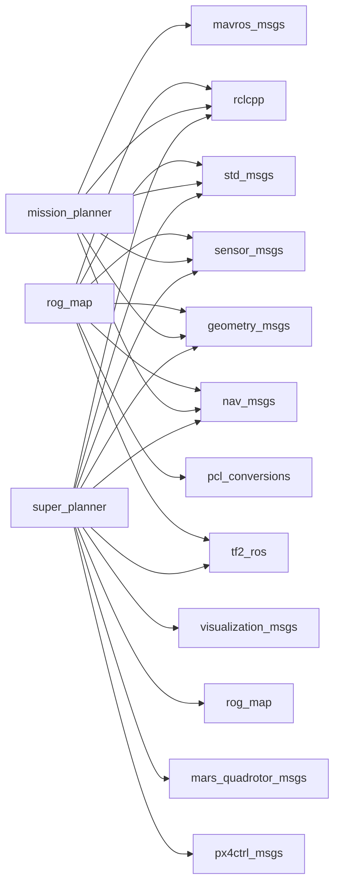

# ROS2节点通信协议

<cite>
**本文引用的文件**
- [fsm_node_ros2.cpp](file://src/SUPER/super_planner/Apps/fsm_node_ros2.cpp)
- [ros2_waypoint_mission.cpp](file://src/SUPER/mission_planner/Apps/ros2_waypoint_mission.cpp)
- [rog_map_ros2.hpp](file://src/SUPER/rog_map/include/rog_map_ros/rog_map_ros2.hpp)
- [rog_map.h](file://src/SUPER/rog_map/include/rog_map/rog_map.h)
- [click.yaml](file://src/SUPER/super_planner/config/click.yaml)
- [waypoint.yaml](file://src/SUPER/mission_planner/config/waypoint.yaml)
- [package.xml（super_planner）](file://src/SUPER/super_planner/package.xml)
- [package.xml（mission_planner）](file://src/SUPER/mission_planner/package.xml)
- [package.xml（rog_map）](file://src/SUPER/rog_map/package.xml)
- [package.xml（mars_quadrotor_msgs）](file://src/SUPER/mars_uav_sim/mars_quadrotor_msgs/package.xml)
- [package.xml（px4ctrl_msgs）](file://src/SUPER/mars_uav_sim/px4ctrl_msgs/package.xml)
- [CMakeLists（super_planner）](file://src/SUPER/super_planner/CMakeLists.txt)
</cite>

## 目录
1. [简介](#简介)
2. [项目结构](#项目结构)
3. [核心组件](#核心组件)
4. [架构总览](#架构总览)
5. [详细组件分析](#详细组件分析)
6. [依赖关系分析](#依赖关系分析)
7. [性能与监控](#性能与监控)
8. [故障排查指南](#故障排查指南)
9. [结论](#结论)
10. [附录：配置与启动规范](#附录配置与启动规范)

## 简介
本技术文档聚焦于该ROS2工作空间中节点间通信协议与生命周期管理，涵盖消息传递顺序、同步与异步处理策略、节点生命周期（启动顺序、依赖关系、优雅关闭）、通信错误处理与恢复策略、完整节点配置示例（launch规范、参数传递与动态重配置）、多节点协作调度机制（优先级、资源分配、冲突解决），以及通信性能监控、延迟测量与带宽优化的实用方法。文档基于仓库中现有实现进行归纳总结，并提供可操作的实践建议。

## 项目结构
该工作空间包含多个功能包，围绕“规划器”“航路点任务”“地图构建（ROG-Map）”“消息定义”等模块组织。关键节点包括：
- 超级规划器节点（FSM节点）：负责状态机与轨迹规划，发布位置/多项式轨迹命令。
- 航路点任务节点：负责航路点生成与目标下发。
- ROG地图节点：负责点云/里程计订阅、地图更新与可视化发布。

图表来源
- [fsm_node_ros2.cpp](file://src/SUPER/super_planner/Apps/fsm_node_ros2.cpp#L48-L101)
- [ros2_waypoint_mission.cpp](file://src/SUPER/mission_planner/Apps/ros2_waypoint_mission.cpp#L11-L22)
- [rog_map_ros2.hpp](file://src/SUPER/rog_map/include/rog_map_ros/rog_map_ros2.hpp#L317-L380)

章节来源
- [CMakeLists（super_planner）](file://src/SUPER/super_planner/CMakeLists.txt#L127-L151)
- [package.xml（super_planner）](file://src/SUPER/super_planner/package.xml#L1-L21)
- [package.xml（mission_planner）](file://src/SUPER/mission_planner/package.xml#L1-L19)
- [package.xml（rog_map）](file://src/SUPER/rog_map/package.xml#L1-L27)

## 核心组件
- 超级规划器节点（FSM）：通过参数服务器读取配置文件，初始化状态机与规划器，使用多线程执行器处理回调与定时器。
- 航路点任务节点：封装航路点规划器，发布目标位姿或命令，支持多线程执行器。
- ROG地图节点：订阅点云与里程计，维护机器人位姿，周期性更新地图并发布可视化标记。

章节来源
- [fsm_node_ros2.cpp](file://src/SUPER/super_planner/Apps/fsm_node_ros2.cpp#L48-L101)
- [ros2_waypoint_mission.cpp](file://src/SUPER/mission_planner/Apps/ros2_waypoint_mission.cpp#L11-L22)
- [rog_map_ros2.hpp](file://src/SUPER/rog_map/include/rog_map_ros/rog_map_ros2.hpp#L41-L380)

## 架构总览
节点间通过标准ROS2话题与服务进行解耦通信。ROG地图节点作为数据源，向规划器与可视化模块提供点云与位姿；航路点任务节点向规划器提供目标；规划器节点根据配置发布命令消息。

图表来源
- [fsm_node_ros2.cpp](file://src/SUPER/super_planner/Apps/fsm_node_ros2.cpp#L84-L89)
- [rog_map_ros2.hpp](file://src/SUPER/rog_map/include/rog_map_ros/rog_map_ros2.hpp#L363-L379)
- [click.yaml](file://src/SUPER/super_planner/config/click.yaml#L4-L11)

## 详细组件分析

### 超级规划器节点（FSM）
- 生命周期与启动
  - 初始化ROS2、设置参数（如仿真时间开关）、声明配置参数、读取配置文件路径并初始化状态机。
  - 使用多线程执行器，添加节点后进入事件循环，等待关闭信号。
- 通信与同步
  - 通过参数读取目标话题、命令话题等，订阅目标并发布规划命令。
  - 使用定时器驱动重规划频率，确保周期性处理。
- 异步处理
  - 多线程执行器提升并发能力；回调组分离不同功能域（如可视化、更新、服务）。
- 优雅关闭
  - 主循环结束后调用关闭，释放资源。

图表来源
- [fsm_node_ros2.cpp](file://src/SUPER/super_planner/Apps/fsm_node_ros2.cpp#L48-L101)
- [click.yaml](file://src/SUPER/super_planner/config/click.yaml#L4-L11)

章节来源
- [fsm_node_ros2.cpp](file://src/SUPER/super_planner/Apps/fsm_node_ros2.cpp#L48-L101)
- [click.yaml](file://src/SUPER/super_planner/config/click.yaml#L4-L11)

### 航路点任务节点
- 功能职责
  - 封装航路点规划器，发布目标位姿或命令，支持多线程执行器。
- 参数与配置
  - 目标发布话题、里程计话题、起始触发方式、切换距离、超时阈值、发布周期等。
- 生命周期
  - 初始化节点、构造规划器实例、加入执行器并进入事件循环。

图表来源
- [ros2_waypoint_mission.cpp](file://src/SUPER/mission_planner/Apps/ros2_waypoint_mission.cpp#L11-L22)
- [waypoint.yaml](file://src/SUPER/mission_planner/config/waypoint.yaml#L1-L19)

章节来源
- [ros2_waypoint_mission.cpp](file://src/SUPER/mission_planner/Apps/ros2_waypoint_mission.cpp#L11-L22)
- [waypoint.yaml](file://src/SUPER/mission_planner/config/waypoint.yaml#L1-L19)

### ROG地图节点
- 订阅与回调
  - 订阅点云与里程计，回调中检查位姿有效性与超时，更新内部状态并加锁保护共享数据。
- 地图更新与可视化
  - 周期性更新地图，发布占用/未知/前沿/ESDF等点云与边界框标记。
- 服务接口
  - 提供重置地图服务，返回成功/失败与消息。
- QoS与回调组
  - 使用可靠QoS与多回调组，分离不同功能域，降低竞争与阻塞。

图表来源
- [rog_map_ros2.hpp](file://src/SUPER/rog_map/include/rog_map_ros/rog_map_ros2.hpp#L75-L151)
- [rog_map_ros2.hpp](file://src/SUPER/rog_map/include/rog_map_ros/rog_map_ros2.hpp#L317-L380)
- [rog_map.h](file://src/SUPER/rog_map/include/rog_map/rog_map.h#L39-L129)

章节来源
- [rog_map_ros2.hpp](file://src/SUPER/rog_map/include/rog_map_ros/rog_map_ros2.hpp#L75-L151)
- [rog_map_ros2.hpp](file://src/SUPER/rog_map/include/rog_map_ros/rog_map_ros2.hpp#L317-L380)
- [rog_map.h](file://src/SUPER/rog_map/include/rog_map/rog_map.h#L39-L129)

## 依赖关系分析
- 包依赖
  - super_planner依赖rclcpp、std_msgs、sensor_msgs、geometry_msgs、nav_msgs、tf2_ros、visualization_msgs、rog_map、mars_quadrotor_msgs、px4ctrl_msgs。
  - mission_planner依赖rclcpp、std_msgs、sensor_msgs、geometry_msgs、nav_msgs、mavros_msgs。
  - rog_map依赖rclcpp、std_msgs、sensor_msgs、geometry_msgs、nav_msgs、tf2_ros、pcl_conversions。
  - 消息包mars_quadrotor_msgs、px4ctrl_msgs提供自定义消息与服务。
- 构建与安装
  - CMakeLists中显式声明目标、链接库与安装规则，包含launch与config目录的安装。

图表来源
- [package.xml（super_planner）](file://src/SUPER/super_planner/package.xml#L8-L15)
- [package.xml（mission_planner）](file://src/SUPER/mission_planner/package.xml#L8-L13)
- [package.xml（rog_map）](file://src/SUPER/rog_map/package.xml#L12-L18)
- [package.xml（mars_quadrotor_msgs）](file://src/SUPER/mars_uav_sim/mars_quadrotor_msgs/package.xml#L10-L16)
- [package.xml（px4ctrl_msgs）](file://src/SUPER/mars_uav_sim/px4ctrl_msgs/package.xml#L10-L16)

章节来源
- [package.xml（super_planner）](file://src/SUPER/super_planner/package.xml#L1-L21)
- [package.xml（mission_planner）](file://src/SUPER/mission_planner/package.xml#L1-L19)
- [package.xml（rog_map）](file://src/SUPER/rog_map/package.xml#L1-L27)
- [package.xml（mars_quadrotor_msgs）](file://src/SUPER/mars_uav_sim/mars_quadrotor_msgs/package.xml#L1-L26)
- [package.xml（px4ctrl_msgs）](file://src/SUPER/mars_uav_sim/px4ctrl_msgs/package.xml#L1-L22)
- [CMakeLists（super_planner）](file://src/SUPER/super_planner/CMakeLists.txt#L33-L74)

## 性能与监控
- 延迟测量
  - 在回调中记录系统时间戳，计算从接收消息到处理完成的时间差，评估端到端延迟。
  - 可在发布前记录时间戳，订阅后对比，得到往返延迟。
- 带宽优化
  - 合理设置QoS（可靠性、历史、持久性），避免过度冗余。
  - 对高频点云/标记采用降采样或按需发布，减少订阅者压力。
- 实时性保障
  - 使用回调组分离高优先级任务（如传感器回调）与低优先级任务（如可视化）。
  - 控制定时器频率，避免抢占CPU时间片。
- 可视化与指标
  - 发布边界框、文本标记辅助定位问题区域，便于性能分析与调试。

章节来源
- [rog_map_ros2.hpp](file://src/SUPER/rog_map/include/rog_map_ros/rog_map_ros2.hpp#L46-L52)
- [rog_map_ros2.hpp](file://src/SUPER/rog_map/include/rog_map_ros/rog_map_ros2.hpp#L168-L298)

## 故障排查指南
- 网络中断与消息丢失
  - 检查订阅者数量与QoS匹配，确认话题名称一致。
  - 在回调中增加超时检测与告警，必要时降级处理或缓存最近有效值。
- 节点崩溃与异常
  - 使用信号处理捕获异常，记录堆栈信息以便定位。
  - 服务端返回明确的成功/失败状态与错误信息，便于上层感知。
- 优雅关闭
  - 在主循环结束前确保资源释放与日志输出，避免僵尸进程或资源泄漏。

章节来源
- [rog_map_ros2.hpp](file://src/SUPER/rog_map/include/rog_map_ros/rog_map_ros2.hpp#L153-L166)
- [fsm_node_ros2.cpp](file://src/SUPER/super_planner/Apps/fsm_node_ros2.cpp#L34-L40)

## 结论
该工作空间通过清晰的消息契约与模块化设计，实现了规划、航路点与地图构建的协同。节点间采用参数驱动与配置文件管理，结合多线程执行器与回调组，兼顾实时性与可维护性。建议在实际部署中进一步完善动态重配置、监控指标与容错策略，以提升整体鲁棒性与可运维性。

## 附录：配置与启动规范

### 节点配置要点
- 超级规划器（FSM）
  - 关键参数：目标话题、命令话题、重规划频率、可视化开关、地图相关参数等。
  - 配置文件路径通过参数声明与读取，便于运行时切换。
- 航路点任务
  - 关键参数：目标发布话题、里程计话题、起始触发方式、切换距离、超时阈值、发布周期等。
- ROG地图
  - 关键参数：点云/里程计话题、超时阈值、可视化范围、ESDF开关、更新范围等。

章节来源
- [click.yaml](file://src/SUPER/super_planner/config/click.yaml#L4-L11)
- [click.yaml](file://src/SUPER/super_planner/config/click.yaml#L148-L153)
- [click.yaml](file://src/SUPER/super_planner/config/click.yaml#L155-L163)
- [waypoint.yaml](file://src/SUPER/mission_planner/config/waypoint.yaml#L1-L19)

### 启动与参数传递
- 启动流程
  - 初始化节点与参数服务器，读取配置文件，声明并读取参数，创建执行器并进入事件循环。
- 参数传递
  - 通过节点参数声明与读取，结合配置文件路径参数实现灵活切换。
- 动态重配置
  - 可结合rqt_reconfigure或ros2 param命令进行参数热更新（需在节点中实现对应逻辑）。

章节来源
- [fsm_node_ros2.cpp](file://src/SUPER/super_planner/Apps/fsm_node_ros2.cpp#L62-L89)

### 多节点协作与调度
- 优先级与资源分配
  - 使用回调组分离高/低优先级任务，避免相互阻塞。
  - 控制定时器频率与发布速率，平衡CPU与带宽。
- 冲突解决
  - 统一命名约定与QoS策略，避免重复订阅与竞争。
  - 在回调中增加超时与一致性校验，防止脏数据影响后续处理。

章节来源
- [rog_map_ros2.hpp](file://src/SUPER/rog_map/include/rog_map_ros/rog_map_ros2.hpp#L359-L379)