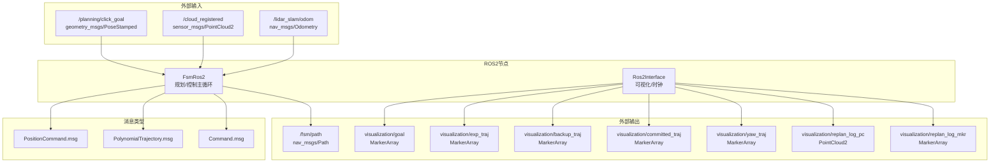
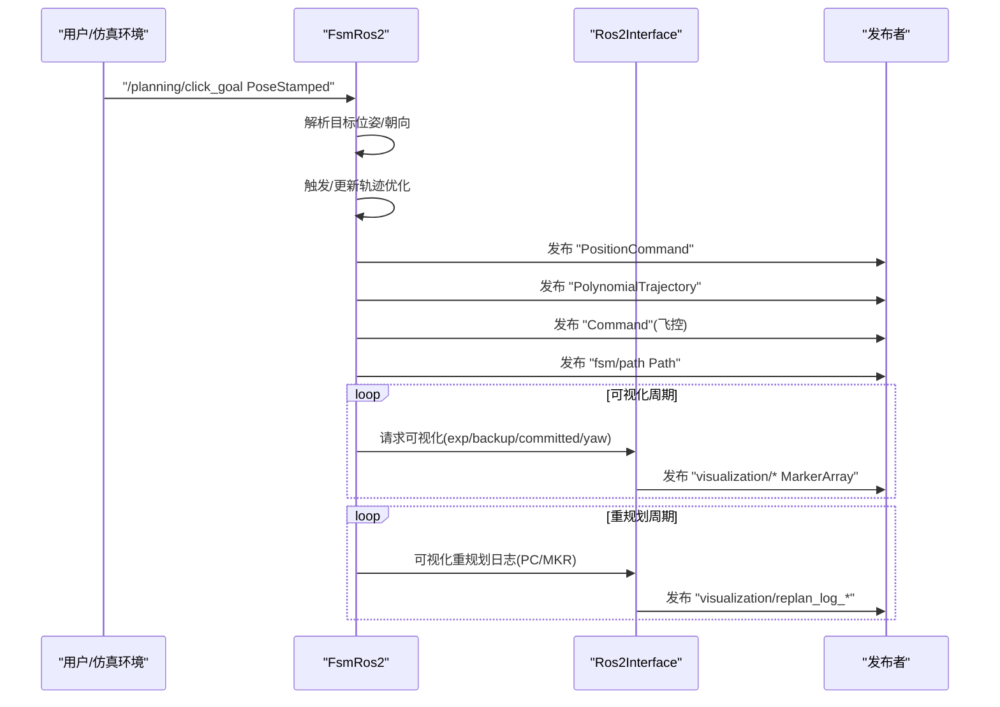
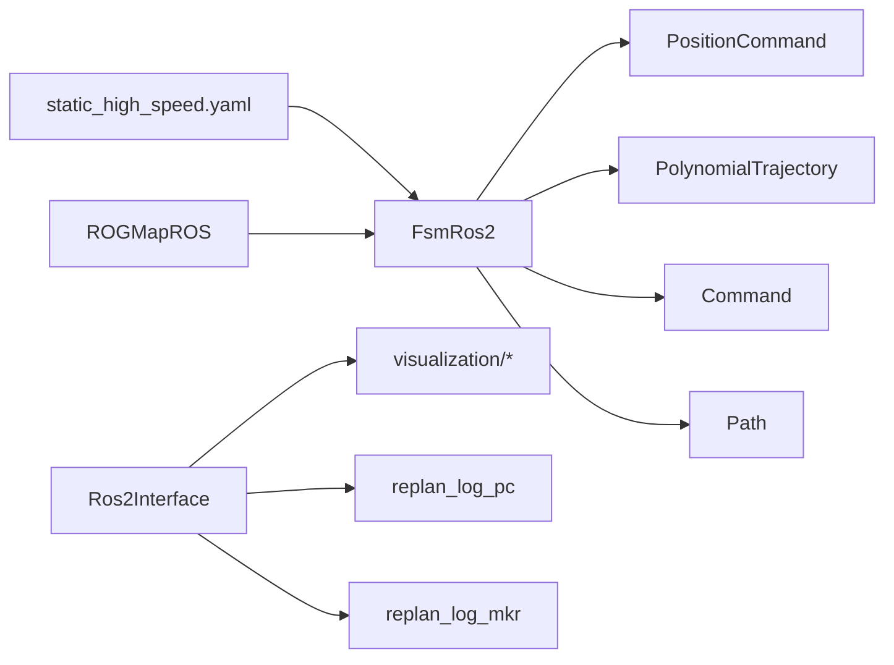

# ROS2话题接口

<cite>
**本文引用的文件**
- [src/SUPER/super_planner/include/ros_interface/ros2/fsm_ros2.hpp](file://src/SUPER/super_planner/include/ros_interface/ros2/fsm_ros2.hpp)
- [src/SUPER/super_planner/include/ros_interface/ros2/ros2_interface.hpp](file://src/SUPER/super_planner/include/ros_interface/ros2/ros2_interface.hpp)
- [src/SUPER/mars_uav_sim/mars_quadrotor_msgs/ros2_msg/PositionCommand.msg](file://src/SUPER/mars_uav_sim/mars_quadrotor_msgs/ros2_msg/PositionCommand.msg)
- [src/SUPER/mars_uav_sim/mars_quadrotor_msgs/ros2_msg/PolynomialTrajectory.msg](file://src/SUPER/mars_uav_sim/mars_quadrotor_msgs/ros2_msg/PolynomialTrajectory.msg)
- [src/SUPER/mars_uav_sim/px4ctrl_msgs/msg/Command.msg](file://src/SUPER/mars_uav_sim/px4ctrl_msgs/msg/Command.msg)
- [src/SUPER/super_planner/config/static_high_speed.yaml](file://src/SUPER/super_planner/config/static_high_speed.yaml)
- [src/SUPER/super_planner/Apps/fsm_node_ros2.cpp](file://src/SUPER/super_planner/Apps/fsm_node_ros2.cpp)
</cite>

## 目录
1. [简介](#简介)
2. [项目结构](#项目结构)
3. [核心组件](#核心组件)
4. [架构总览](#架构总览)
5. [详细组件分析](#详细组件分析)
6. [依赖关系分析](#依赖关系分析)
7. [性能考虑](#性能考虑)
8. [故障排查指南](#故障排查指南)
9. [结论](#结论)
10. [附录](#附录)

## 简介
本文件为ROS2超级规划器（SUPER）的“话题接口”API文档，聚焦于规划与控制模块间的消息流与时间戳机制，覆盖以下内容：
- 输入话题：目标点击/位姿请求、地图点云等
- 输出话题：位置命令、多项式轨迹、期望/备份轨迹可视化、重规划日志等
- 消息格式与数据类型、发布频率与时间戳来源
- 订阅与发布示例（通过源码路径定位实现）
- 话题间依赖与数据流向（异步/同步机制）
- RViz可视化配置要点与最佳实践

## 项目结构
本项目采用“功能域+ROS接口层”的组织方式：
- 规划与控制核心位于 super_planner 模块，对外通过ROS2接口封装
- 无人机消息类型定义位于 mars_quadrotor_msgs 与 px4ctrl_msgs
- 配置文件位于 super_planner/config，包含话题名称、重规划频率、边界约束等

图表来源
- [src/SUPER/super_planner/include/ros_interface/ros2/fsm_ros2.hpp](file://src/SUPER/super_planner/include/ros_interface/ros2/fsm_ros2.hpp#L286-L370)
- [src/SUPER/super_planner/include/ros_interface/ros2/ros2_interface.hpp](file://src/SUPER/super_planner/include/ros_interface/ros2/ros2_interface.hpp#L44-L76)

章节来源
- [src/SUPER/super_planner/Apps/fsm_node_ros2.cpp](file://src/SUPER/super_planner/Apps/fsm_node_ros2.cpp#L48-L101)
- [src/SUPER/super_planner/config/static_high_speed.yaml](file://src/SUPER/super_planner/config/static_high_speed.yaml#L1-L187)

## 核心组件
- FsmRos2：规划/控制主循环，负责接收目标、订阅地图/里程计、生成轨迹、发布命令与可视化
- Ros2Interface：ROS2可视化与时钟接口，统一管理MarkerArray/PointCloud2发布与仿真时间戳
- 消息类型：PositionCommand、PolynomialTrajectory、Command（对应飞控/控制器）

章节来源
- [src/SUPER/super_planner/include/ros_interface/ros2/fsm_ros2.hpp](file://src/SUPER/super_planner/include/ros_interface/ros2/fsm_ros2.hpp#L41-L541)
- [src/SUPER/super_planner/include/ros_interface/ros2/ros2_interface.hpp](file://src/SUPER/super_planner/include/ros_interface/ros2/ros2_interface.hpp#L41-L454)

## 架构总览
下图展示从输入到输出的关键数据流与时间戳来源。

图表来源
- [src/SUPER/super_planner/include/ros_interface/ros2/fsm_ros2.hpp](file://src/SUPER/super_planner/include/ros_interface/ros2/fsm_ros2.hpp#L279-L370)
- [src/SUPER/super_planner/include/ros_interface/ros2/ros2_interface.hpp](file://src/SUPER/super_planner/include/ros_interface/ros2/ros2_interface.hpp#L120-L117)

## 详细组件分析

### 输入话题
- 目标点击/位姿请求
  - 话题名：由配置决定，默认为 /planning/click_goal
  - 类型：geometry_msgs/PoseStamped
  - 作用：设置目标位置与朝向；FsmRos2将其转换为内部目标状态
  - 订阅方式：通过回调绑定，使用互斥回调组
  - 参考路径：[订阅初始化与回调](file://src/SUPER/super_planner/include/ros_interface/ros2/fsm_ros2.hpp#L307-L323)

- 地图点云
  - 话题名：/cloud_registered（配置项中指定）
  - 类型：sensor_msgs/PointCloud2
  - 作用：作为ROG地图的输入，驱动环境建图与避障
  - 参考路径：[配置项](file://src/SUPER/super_planner/config/static_high_speed.yaml#L138-L140)

- 里程计
  - 话题名：/lidar_slam/odom（配置项中指定）
  - 类型：nav_msgs/Odometry
  - 作用：提供机器人位姿与速度，参与轨迹生成与状态反馈
  - 参考路径：[配置项](file://src/SUPER/super_planner/config/static_high_speed.yaml#L138-L140)

章节来源
- [src/SUPER/super_planner/include/ros_interface/ros2/fsm_ros2.hpp](file://src/SUPER/super_planner/include/ros_interface/ros2/fsm_ros2.hpp#L307-L323)
- [src/SUPER/super_planner/config/static_high_speed.yaml](file://src/SUPER/super_planner/config/static_high_speed.yaml#L138-L140)

### 输出话题
- 位置命令（PositionCommand）
  - 话题名：/planning/pos_cmd（配置项）
  - 类型：mars_quadrotor_msgs/PositionCommand
  - 内容要点：位置、速度、加速度、急动度、角速度、姿态、推力、轨迹标志位等
  - 发布频率：由定时器触发（默认约100Hz），在 FOLLOW_TRAJ 或紧急状态下发布
  - 时间戳：使用仿真时钟填充Header
  - 参考路径：[发布实现](file://src/SUPER/super_planner/include/ros_interface/ros2/fsm_ros2.hpp#L372-L431)，[消息定义](file://src/SUPER/mars_uav_sim/mars_quadrotor_msgs/ros2_msg/PositionCommand.msg#L1-L30)

- 多项式轨迹（PolynomialTrajectory）
  - 话题名：/planning_cmd/poly_traj（配置项）
  - 类型：mars_quadrotor_msgs/PolynomialTrajectory
  - 内容要点：位置/偏航多项式系数、分段时长、系统起始时间、类型标志（心跳/位置/偏航/紧急停止）
  - 发布频率：与位置命令同周期，同时携带心跳信号
  - 时间戳：使用仿真时钟填充Header
  - 参考路径：[发布实现](file://src/SUPER/super_planner/include/ros_interface/ros2/fsm_ros2.hpp#L381-L422)，[消息定义](file://src/SUPER/mars_uav_sim/mars_quadrotor_msgs/ros2_msg/PolynomialTrajectory.msg#L1-L39)

- 飞控命令（Command）
  - 话题名：由配置决定（未在上述片段显式声明，但发布逻辑存在）
  - 类型：px4ctrl_msgs/Command
  - 内容要点：位置/速度/加速度/急动度、偏航与角速度、四元数、命令类型
  - 发布频率：与位置命令同周期
  - 时间戳：继承自PositionCommand
  - 参考路径：[发布实现](file://src/SUPER/super_planner/include/ros_interface/ros2/fsm_ros2.hpp#L386-L422)，[消息定义](file://src/SUPER/mars_uav_sim/px4ctrl_msgs/msg/Command.msg)

- 航迹路径（Path）
  - 话题名：/fsm/path
  - 类型：nav_msgs/Path
  - 内容要点：累计轨迹点，用于RViz可视化
  - 发布频率：每执行周期追加当前位姿
  - 时间戳：使用仿真时钟填充Header
  - 参考路径：[发布实现](file://src/SUPER/super_planner/include/ros_interface/ros2/fsm_ros2.hpp#L67-L81)

- 可视化话题（MarkerArray/PointCloud2）
  - 期望轨迹：visualization/exp_traj
  - 备份轨迹：visualization/backup_traj
  - 已提交轨迹：visualization/committed_traj
  - 偏航轨迹：visualization/yaw_traj
  - 目标路径：visualization/goal
  - A*调试：visualization/astar_debug
  - CIRI调试：visualization/ciri_debug_mkr、visualization/ciri_debug_pc
  - 重规划日志：visualization/replan_log_mkr、visualization/replan_log_pc
  - 发布频率：按可视化开关与订阅者数量决定；重规划日志按重规划周期发布
  - 时间戳：MarkerArray使用仿真时钟；PC2消息头包含仿真时间戳
  - 参考路径：[可视化发布](file://src/SUPER/super_planner/include/ros_interface/ros2/ros2_interface.hpp#L120-L366)

章节来源
- [src/SUPER/super_planner/include/ros_interface/ros2/fsm_ros2.hpp](file://src/SUPER/super_planner/include/ros_interface/ros2/fsm_ros2.hpp#L286-L370)
- [src/SUPER/super_planner/include/ros_interface/ros2/ros2_interface.hpp](file://src/SUPER/super_planner/include/ros_interface/ros2/ros2_interface.hpp#L44-L76)
- [src/SUPER/mars_uav_sim/mars_quadrotor_msgs/ros2_msg/PositionCommand.msg](file://src/SUPER/mars_uav_sim/mars_quadrotor_msgs/ros2_msg/PositionCommand.msg#L1-L30)
- [src/SUPER/mars_uav_sim/mars_quadrotor_msgs/ros2_msg/PolynomialTrajectory.msg](file://src/SUPER/mars_uav_sim/mars_quadrotor_msgs/ros2_msg/PolynomialTrajectory.msg#L1-L39)
- [src/SUPER/mars_uav_sim/px4ctrl_msgs/msg/Command.msg](file://src/SUPER/mars_uav_sim/px4ctrl_msgs/msg/Command.msg)

### 消息格式与数据类型详解
- PositionCommand
  - 字段：Header、position/velocity/acceleration/jerk、angular_velocity、attitude、thrust、yaw/yaw_dot、增益kx/kv、trajectory_id/flag
  - 参考路径：[定义](file://src/SUPER/mars_uav_sim/mars_quadrotor_msgs/ros2_msg/PositionCommand.msg#L1-L30)

- PolynomialTrajectory
  - 字段：Header、trajectory_id、type（位标志）、piece_num/order、start_wt、coef/time（x/y/z/yaw）、debug_info
  - 参考路径：[定义](file://src/SUPER/mars_uav_sim/mars_quadrotor_msgs/ros2_msg/PolynomialTrajectory.msg#L1-L39)

- Command（飞控）
  - 字段：Header、pos/vel/acc/jerk、yaw/yawdot、quat、type
  - 参考路径：[定义](file://src/SUPER/mars_uav_sim/px4ctrl_msgs/msg/Command.msg)

章节来源
- [src/SUPER/mars_uav_sim/mars_quadrotor_msgs/ros2_msg/PositionCommand.msg](file://src/SUPER/mars_uav_sim/mars_quadrotor_msgs/ros2_msg/PositionCommand.msg#L1-L30)
- [src/SUPER/mars_uav_sim/mars_quadrotor_msgs/ros2_msg/PolynomialTrajectory.msg](file://src/SUPER/mars_uav_sim/mars_quadrotor_msgs/ros2_msg/PolynomialTrajectory.msg#L1-L39)
- [src/SUPER/mars_uav_sim/px4ctrl_msgs/msg/Command.msg](file://src/SUPER/mars_uav_sim/px4ctrl_msgs/msg/Command.msg)

### 发布与订阅示例（基于源码路径）
- 订阅目标点击
  - 参考路径：[订阅初始化与回调](file://src/SUPER/super_planner/include/ros_interface/ros2/fsm_ros2.hpp#L307-L323)
- 发布位置命令
  - 参考路径：[定时发布](file://src/SUPER/super_planner/include/ros_interface/ros2/fsm_ros2.hpp#L372-L431)
- 发布多项式轨迹
  - 参考路径：[定时发布](file://src/SUPER/super_planner/include/ros_interface/ros2/fsm_ros2.hpp#L381-L422)
- 发布飞控命令
  - 参考路径：[定时发布](file://src/SUPER/super_planner/include/ros_interface/ros2/fsm_ros2.hpp#L386-L422)
- 发布航迹Path
  - 参考路径：[发布实现](file://src/SUPER/super_planner/include/ros_interface/ros2/fsm_ros2.hpp#L67-L81)
- 发布可视化MarkerArray/PointCloud2
  - 参考路径：[可视化发布](file://src/SUPER/super_planner/include/ros_interface/ros2/ros2_interface.hpp#L120-L366)

章节来源
- [src/SUPER/super_planner/include/ros_interface/ros2/fsm_ros2.hpp](file://src/SUPER/super_planner/include/ros_interface/ros2/fsm_ros2.hpp#L372-L431)
- [src/SUPER/super_planner/include/ros_interface/ros2/ros2_interface.hpp](file://src/SUPER/super_planner/include/ros_interface/ros2/ros2_interface.hpp#L120-L366)

### 时间戳机制
- 仿真时钟来源：Ros2Interface统一通过节点时钟获取当前时间，并写入消息Header
- Clock发布：可通过设置/clock话题实现仿真时间同步
- 可视化PC2：在发布前将仿真时间写入PointCloud2.header.stamp
- 参考路径：
  - [仿真时钟获取与设置](file://src/SUPER/super_planner/include/ros_interface/ros2/ros2_interface.hpp#L100-L117)
  - [PC2时间戳写入](file://src/SUPER/super_planner/include/ros_interface/ros2/ros2_interface.hpp#L360-L363)

章节来源
- [src/SUPER/super_planner/include/ros_interface/ros2/ros2_interface.hpp](file://src/SUPER/super_planner/include/ros_interface/ros2/ros2_interface.hpp#L100-L117)
- [src/SUPER/super_planner/include/ros_interface/ros2/ros2_interface.hpp](file://src/SUPER/super_planner/include/ros_interface/ros2/ros2_interface.hpp#L360-L363)

### 异步与同步机制
- 回调组：目标回调、执行回调、重规划回调、命令回调分别置于不同互斥回调组，避免阻塞
- 定时器：执行周期、命令发布周期、重规划周期独立定时器
- 同步点：命令发布前会检查状态机是否处于 FOLLOW_TRAJ 或紧急状态；轨迹完成后切换状态
- 参考路径：
  - [回调组与定时器](file://src/SUPER/super_planner/include/ros_interface/ros2/fsm_ros2.hpp#L325-L346)
  - [状态机切换](file://src/SUPER/super_planner/include/ros_interface/ros2/fsm_ros2.hpp#L423-L431)

章节来源
- [src/SUPER/super_planner/include/ros_interface/ros2/fsm_ros2.hpp](file://src/SUPER/super_planner/include/ros_interface/ros2/fsm_ros2.hpp#L325-L346)
- [src/SUPER/super_planner/include/ros_interface/ros2/fsm_ros2.hpp](file://src/SUPER/super_planner/include/ros_interface/ros2/fsm_ros2.hpp#L423-L431)

## 依赖关系分析
- FsmRos2依赖：
  - 配置文件：决定话题名、重规划频率、可视化开关等
  - 地图模块：ROGMapROS（点云/里程计输入）
  - 可视化接口：Ros2Interface（MarkerArray/PC2发布）
- 消息依赖：
  - PositionCommand/PolynomialTrajectory/Command三者在发布链路中紧密耦合（同一周期内）
- 可视化依赖：
  - Replan日志同时发布MKR与PC2，确保RViz端能对齐显示

图表来源
- [src/SUPER/super_planner/config/static_high_speed.yaml](file://src/SUPER/super_planner/config/static_high_speed.yaml#L1-L187)
- [src/SUPER/super_planner/include/ros_interface/ros2/fsm_ros2.hpp](file://src/SUPER/super_planner/include/ros_interface/ros2/fsm_ros2.hpp#L286-L370)
- [src/SUPER/super_planner/include/ros_interface/ros2/ros2_interface.hpp](file://src/SUPER/super_planner/include/ros_interface/ros2/ros2_interface.hpp#L301-L366)

章节来源
- [src/SUPER/super_planner/config/static_high_speed.yaml](file://src/SUPER/super_planner/config/static_high_speed.yaml#L1-L187)
- [src/SUPER/super_planner/include/ros_interface/ros2/fsm_ros2.hpp](file://src/SUPER/super_planner/include/ros_interface/ros2/fsm_ros2.hpp#L286-L370)
- [src/SUPER/super_planner/include/ros_interface/ros2/ros2_interface.hpp](file://src/SUPER/super_planner/include/ros_interface/ros2/ros2_interface.hpp#L301-L366)

## 性能考虑
- 发布频率：命令与轨迹发布周期约为10ms；重规划周期由配置项决定（如15Hz）
- QoS策略：可靠、保留最后N条、易失持久性，适合实时控制
- 可视化开销：MarkerArray/PC2发布受订阅者数量影响，建议仅在调试阶段开启
- 动态参数：支持运行时调整轨迹优化参数，需及时刷新优化器配置

章节来源
- [src/SUPER/super_planner/include/ros_interface/ros2/fsm_ros2.hpp](file://src/SUPER/super_planner/include/ros_interface/ros2/fsm_ros2.hpp#L287-L346)
- [src/SUPER/super_planner/include/ros_interface/ros2/fsm_ros2.hpp](file://src/SUPER/super_planner/include/ros_interface/ros2/fsm_ros2.hpp#L489-L535)

## 故障排查指南
- 无目标输入
  - 现象：无法进入 FOLLOW_TRAJ 状态
  - 排查：确认 /planning/click_goal 是否正确发布
  - 参考路径：[目标订阅](file://src/SUPER/super_planner/include/ros_interface/ros2/fsm_ros2.hpp#L307-L323)

- 命令不发布
  - 现象：无 /planning/pos_cmd 或 /planning_cmd/poly_traj
  - 排查：检查状态机是否处于 FOLLOW_TRAJ；确认定时器是否启用
  - 参考路径：[命令发布条件](file://src/SUPER/super_planner/include/ros_interface/ros2/fsm_ros2.hpp#L372-L380)

- 可视化无输出
  - 现象：RViz中无轨迹或日志
  - 排查：确认订阅者是否存在；检查 visualization_en 开关
  - 参考路径：[可视化发布条件](file://src/SUPER/super_planner/include/ros_interface/ros2/ros2_interface.hpp#L124-L126)

- 时间戳异常
  - 现象：消息时间戳不随仿真时间推进
  - 排查：确认 /clock 是否发布；检查 getSimTime/setSimTime
  - 参考路径：[时钟接口](file://src/SUPER/super_planner/include/ros_interface/ros2/ros2_interface.hpp#L100-L117)

章节来源
- [src/SUPER/super_planner/include/ros_interface/ros2/fsm_ros2.hpp](file://src/SUPER/super_planner/include/ros_interface/ros2/fsm_ros2.hpp#L372-L380)
- [src/SUPER/super_planner/include/ros_interface/ros2/ros2_interface.hpp](file://src/SUPER/super_planner/include/ros_interface/ros2/ros2_interface.hpp#L124-L126)
- [src/SUPER/super_planner/include/ros_interface/ros2/ros2_interface.hpp](file://src/SUPER/super_planner/include/ros_interface/ros2/ros2_interface.hpp#L100-L117)

## 结论
本API文档梳理了SUPER规划器在ROS2下的输入/输出话题、消息格式与时序机制。通过明确的配置项与定时器/回调组设计，系统实现了高实时性的规划-控制闭环；可视化与重规划日志为调试提供了完备支撑。建议在实际部署中根据任务需求调整重规划频率与可视化开关，并确保仿真时钟与订阅者连接稳定。

## 附录

### RViz可视化配置示例（步骤说明）
- 添加MarkerArray显示
  - 选择主题：visualization/exp_traj、visualization/backup_traj、visualization/committed_traj、visualization/yaw_traj、visualization/goal
  - 参考路径：[可视化发布](file://src/SUPER/super_planner/include/ros_interface/ros2/ros2_interface.hpp#L120-L266)
- 添加PointCloud2显示
  - 主题：visualization/replan_log_pc
  - 参考路径：[PC2发布](file://src/SUPER/super_planner/include/ros_interface/ros2/ros2_interface.hpp#L348-L363)
- 路径显示
  - 主题：/fsm/path
  - 参考路径：[Path发布](file://src/SUPER/super_planner/include/ros_interface/ros2/fsm_ros2.hpp#L67-L81)

### 实际使用最佳实践
- 频率匹配：命令/轨迹发布周期与控制器采样周期一致（约10ms）
- 重规划频率：根据场景复杂度设置（如15Hz），避免过度计算
- 可视化按需开启：调试阶段开启，运行阶段关闭以降低带宽
- 动态参数：通过参数服务器在线调整边界与优化权重，实时生效
- 时间同步：确保 /clock 发布与仿真时间一致，避免消息时间错乱

章节来源
- [src/SUPER/super_planner/include/ros_interface/ros2/fsm_ros2.hpp](file://src/SUPER/super_planner/include/ros_interface/ros2/fsm_ros2.hpp#L325-L346)
- [src/SUPER/super_planner/include/ros_interface/ros2/ros2_interface.hpp](file://src/SUPER/super_planner/include/ros_interface/ros2/ros2_interface.hpp#L301-L366)
- [src/SUPER/super_planner/config/static_high_speed.yaml](file://src/SUPER/super_planner/config/static_high_speed.yaml#L6-L9)