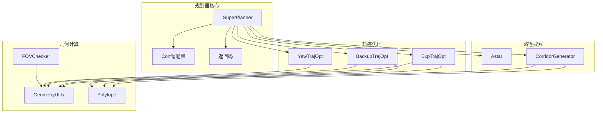
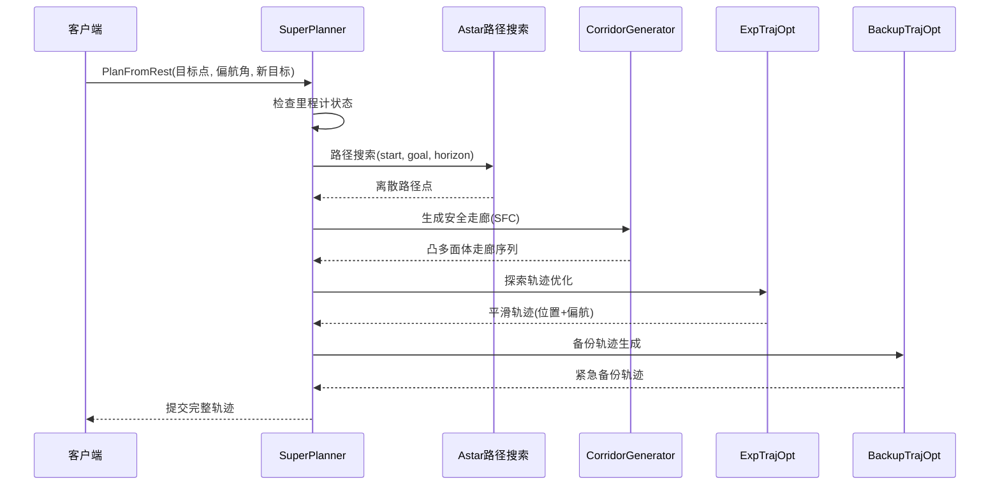
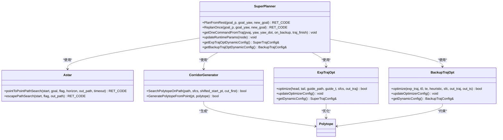
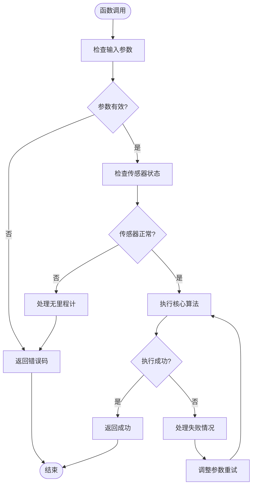

# 函数参考手册

<cite>
**本文档引用的文件**
- [super_planner.h](file://src/SUPER/super_planner/include/super_core/super_planner.h)
- [super_planner.cpp](file://src/SUPER/super_planner/src/super_core/super_planner.cpp)
- [super_ret_code.hpp](file://src/SUPER/super_planner/include/super_core/super_ret_code.hpp)
- [config.hpp](file://src/SUPER/super_planner/include/super_core/config.hpp)
- [exp_traj_optimizer_s4.h](file://src/SUPER/super_planner/include/traj_opt/exp_traj_optimizer_s4.h)
- [backup_traj_optimizer_s4.h](file://src/SUPER/super_planner/include/traj_opt/backup_traj_optimizer_s4.h)
- [astar.h](file://src/SUPER/super_planner/include/path_search/astar.h)
- [trajectory.h](file://src/SUPER/super_planner/include/data_structure/base/trajectory.h)
- [geometry_utils.h](file://src/SUPER/super_planner/include/utils/geometry/geometry_utils.h)
- [optimization_utils.h](file://src/SUPER/super_planner/include/utils/optimization/optimization_utils.h)
- [corridor_generator.h](file://src/SUPER/super_planner/include/super_core/corridor_generator.h)
- [fov_checker.h](file://src/SUPER/super_planner/include/super_core/fov_checker.h)
- [yaw_traj_opt.h](file://src/SUPER/super_planner/include/traj_opt/yaw_traj_opt.h)
- [polytope.h](file://src/SUPER/super_planner/include/data_structure/base/polytope.h)
- [type_utils.hpp](file://src/SUPER/super_planner/include/utils/header/type_utils.hpp)
- [API_REFERENCE.md](file://src/SUPER/super_planner/docs/API_REFERENCE.md)
</cite>

## 目录
1. [简介](#简介)
2. [项目结构](#项目结构)
3. [核心组件](#核心组件)
4. [架构概览](#架构概览)
5. [详细组件分析](#详细组件分析)
6. [依赖关系分析](#依赖关系分析)
7. [性能考虑](#性能考虑)
8. [故障排除指南](#故障排除指南)
9. [结论](#结论)
10. [附录](#附录)

## 简介
本手册为SUPER规划器的函数参考文档，涵盖轨迹生成、路径搜索、几何计算、优化算法等核心功能模块。文档基于代码库的实际实现，提供函数签名、参数说明、返回值定义、异常处理策略、使用示例、最佳实践、错误码参考及性能分析。

## 项目结构
项目采用模块化设计，主要包含以下核心模块：
- 规划器核心：SuperPlanner协调各模块完成规划任务
- 路径搜索：A*算法实现离散路径搜索
- 走廊生成：基于CIRI算法的安全飞行走廊生成
- 轨迹优化：探索轨迹与备份轨迹的双层优化
- 几何计算：多面体、椭球体、FOV裁剪等几何运算
- 优化工具：L-BFGS、MINCO等优化算法封装



**图表来源**
- [super_planner.h](file://src/SUPER/super_planner/include/super_core/super_planner.h#L55-L298)
- [astar.h](file://src/SUPER/super_planner/include/path_search/astar.h#L79-L164)
- [corridor_generator.h](file://src/SUPER/super_planner/include/super_core/corridor_generator.h#L56-L195)
- [exp_traj_optimizer_s4.h](file://src/SUPER/super_planner/include/traj_opt/exp_traj_optimizer_s4.h#L55-L371)
- [backup_traj_optimizer_s4.h](file://src/SUPER/super_planner/include/traj_opt/backup_traj_optimizer_s4.h#L52-L212)

**章节来源**
- [super_planner.h](file://src/SUPER/super_planner/include/super_core/super_planner.h#L1-L298)
- [config.hpp](file://src/SUPER/super_planner/include/super_core/config.hpp#L44-L235)

## 核心组件

### SuperPlanner类
SuperPlanner是规划系统的核心控制器，负责协调各个模块的工作流程。

**主要成员变量：**
- 配置管理：Config cfg_
- 地图接口：rog_map::ROGMapROS::Ptr map_ptr_
- 模块指针：Astar、CorridorGenerator、轨迹优化器等
- 状态管理：GoalInfo、RobotState、备份轨迹状态
- 性能监控：time_consuming_数组

**核心方法：**
- 规划入口：PlanFromRest()、ReplanOnce()
- 轨迹获取：getCommittedPositionTrajectory()、getCommittedYawTrajectory()
- 实时控制：getOneCommandFromTraj()
- 参数管理：updateRuntimeParams()

**章节来源**
- [super_planner.h](file://src/SUPER/super_planner/include/super_core/super_planner.h#L59-L298)
- [super_planner.cpp](file://src/SUPER/super_planner/src/super_core/super_planner.cpp#L33-L74)

### 配置系统
Config类统一管理所有规划相关的参数，支持静态配置和动态更新。

**关键配置类别：**
- 规划参数：planning_horizon、receding_dis、robot_r等
- 轨迹优化参数：max_vel、max_acc、max_jerk等
- 视觉处理参数：sensing_horizon、use_fov_cut等
- 地图参数：resolution、virtual_ground_height等

**动态参数更新机制：**
- 支持ROS2参数服务器热更新
- 自动同步到各优化器配置
- 实时生效不影响当前规划

**章节来源**
- [config.hpp](file://src/SUPER/super_planner/include/super_core/config.hpp#L44-L235)

## 架构概览
SUPER规划器采用分层架构，实现"路径搜索-走廊生成-轨迹优化-备份轨迹"的完整规划流程。



**图表来源**
- [super_planner.cpp](file://src/SUPER/super_planner/src/super_core/super_planner.cpp#L76-L175)
- [astar.h](file://src/SUPER/super_planner/include/path_search/astar.h#L151-L155)
- [corridor_generator.h](file://src/SUPER/super_planner/include/super_core/corridor_generator.h#L129-L131)
- [exp_traj_optimizer_s4.h](file://src/SUPER/super_planner/include/traj_opt/exp_traj_optimizer_s4.h#L342-L349)
- [backup_traj_optimizer_s4.h](file://src/SUPER/super_planner/include/traj_opt/backup_traj_optimizer_s4.h#L183-L192)

## 详细组件分析

### 轨迹生成函数

#### 探索轨迹优化 (ExpTrajOpt)
探索轨迹优化器负责生成主规划轨迹，采用双层优化策略。

**核心方法：**
- optimize(headPVAJ, tailPVAJ, guide_path, guide_t, sfcs, out_traj)
- optimize(pos_init_state, pos_fina_state, guide_path, guide_stamp, sfc, out_traj)
- updateOptimizerConfig()

**参数说明：**
- headPVAJ/tailPVAJ：起始和结束状态(位置/速度/加速度/加加速度)
- guide_path/guide_t：引导路径及其时间戳
- sfcs：安全飞行走廊(凸多面体序列)
- out_traj：输出轨迹对象

**返回值：**
- true/false：优化是否成功
- 失败原因：约束违反、数值不稳定、收敛失败

**性能特征：**
- 时间复杂度：O(N×M×K)，N为走廊段数，M为优化变量数，K为迭代次数
- 内存使用：与轨迹分段数和优化变量维度成正比
- 优化算法：L-BFGS求解非线性优化问题

**章节来源**
- [exp_traj_optimizer_s4.h](file://src/SUPER/super_planner/include/traj_opt/exp_traj_optimizer_s4.h#L329-L368)
- [exp_traj_optimizer_s4.h](file://src/SUPER/super_planner/include/traj_opt/exp_traj_optimizer_s4.h#L342-L367)

#### 备份轨迹优化 (BackupTrajOpt)
备份轨迹优化器在主轨迹受阻时生成紧急避障轨迹。

**核心方法：**
- optimize(exp_traj, t_0, t_e, heu_ts, sfc, out_traj, out_ts)
- optimize(exp_traj, t_0, t_e, heu_ts, heu_end_pt, heu_dur, sfc, out_traj, out_ts)
- checkTrajMagnitudeBound(out_traj)

**参数说明：**
- exp_traj：参考的探索轨迹
- t_0/t_e：时间窗口边界
- heu_ts/heu_end_pt：启发式初始参数
- sfc：约束多面体

**性能特征：**
- 计算复杂度：O(P×Q)，P为约束平面数，Q为优化变量数
- 实时性：通常在50-100ms内完成
- 稳健性：提供边界约束保证安全性

**章节来源**
- [backup_traj_optimizer_s4.h](file://src/SUPER/super_planner/include/traj_opt/backup_traj_optimizer_s4.h#L158-L210)
- [backup_traj_optimizer_s4.h](file://src/SUPER/super_planner/include/traj_opt/backup_traj_optimizer_s4.h#L183-L202)

#### 偏航轨迹优化 (YawTrajOpt)
偏航轨迹优化器独立处理偏航角规划。

**核心方法：**
- optimize(istate_in, gstate_in, pos_traj, out_traj, order, free_start, free_goal)
- getYawTimeAllocation(duration, times)
- getYawWaypointAllocation(init_state, goal_state, way_pts, times, pos_traj)

**参数说明：**
- istate_in/gstate_in：起始和结束偏航状态
- pos_traj：对应的位置轨迹
- order：多项式的阶数
- free_start/free_goal：边界条件设置

**章节来源**
- [yaw_traj_opt.h](file://src/SUPER/super_planner/include/traj_opt/yaw_traj_opt.h#L44-L71)

### 路径搜索函数

#### A*路径搜索 (Astar)
A*算法实现三维网格上的路径搜索。

**核心方法：**
- pointToPointPathSearch(start_pt, end_pt, flag, searching_horizon, out_path, time_out)
- escapePathSearch(start_pt, flag, out_path)

**参数说明：**
- start_pt/end_pt：起始和目标点
- flag：搜索标志位(未知区域处理策略)
- searching_horizon：搜索范围限制
- time_out：超时时间

**返回值：**
- RET_CODE枚举：SUCCESS、NO_PATH、TIME_OUT等

**性能特征：**
- 时间复杂度：O(B×M×N)，B为分支因子，M×N为搜索空间大小
- 空间复杂度：O(M×N)
- 支持多种启发函数：欧氏距离、曼哈顿距离、对角距离

**章节来源**
- [astar.h](file://src/SUPER/super_planner/include/path_search/astar.h#L151-L161)

### 几何计算函数

#### 凸多面体操作 (Polytope)
凸多面体是安全走廊的核心表示。

**核心方法：**
- GetPlanes()/SetPlanes()：获取/设置平面方程
- PointIsInside(pt, margin)：点是否在多面体内
- CrossWith(other)：多面体交集
- GetVolume()/volume()：体积计算

**辅助函数：**
- SimplifySFC(head_p, tail_p, sfcs)：简化走廊序列
- findInteriorDist(hPoly, interior)：内部点距离计算

**章节来源**
- [polytope.h](file://src/SUPER/super_planner/include/data_structure/base/polytope.h#L42-L159)

#### 几何工具函数 (GeometryUtils)
提供丰富的几何运算支持。

**核心功能：**
- 距离计算：pointLineSegmentDistance、DistancePointEllipse
- 空间变换：quaternion_to_yrp、ypr_to_R、R_to_ypr
- 多面体运算：enumerateVs、findInterior、overlap
- FOV裁剪：getFovCheckPlane、cutPolyByFov

**章节来源**
- [geometry_utils.h](file://src/SUPER/super_planner/include/utils/geometry/geometry_utils.h#L148-L306)

### 优化算法函数

#### 优化工具 (OptimizationUtils)
封装通用优化算法和工具。

**核心类：**
- Gcopter：轨迹优化的通用工具类
- smoothedL1：平滑L1范数函数
- normRetrictionLayer：范数约束层

**功能：**
- 梯度传播：forwardMapTauToT、backwardMapTToTau
- 约束处理：backwardGradP、forwardP
- 数值稳定：mapIntervalToInf、mapInfToInterval

**章节来源**
- [optimization_utils.h](file://src/SUPER/super_planner/include/utils/optimization/optimization_utils.h#L38-L120)

### 走廊生成函数

#### CorridorGenerator
安全飞行走廊生成器，基于CIRI算法。

**核心方法：**
- SearchPolytopeOnPath(path, sfcs, shifted_start_pt, cut_first_poly)
- GeneratePolytopeFromPoint(pt, polytope)
- GenerateEmptyPolytope(pt, dis, polytope)

**参数说明：**
- path：输入路径点序列
- sfcs：输出的凸多面体走廊
- shifted_start_pt：偏移后的起始点

**性能特征：**
- 时间复杂度：O(L×P×Q)，L为路径长度，P为多面体平面数，Q为计算复杂度
- 支持虚拟边界：ground_height、ceil_height
- 线程安全：提供并发访问保护

**章节来源**
- [corridor_generator.h](file://src/SUPER/super_planner/include/super_core/corridor_generator.h#L129-L168)

### 视场角裁剪函数

#### FOVChecker
处理相机视场角相关的几何计算。

**核心功能：**
- cutPolyBySensingHorizon：按感知范围裁剪
- cutPolyByFov：按FOV约束裁剪
- getAllFovPlane/getFovCheckPlane：FOV平面生成

**参数说明：**
- robot_p：机器人位置
- robot_q：机器人姿态(四元数)
- guide_p：引导点位置
- sensing_horizon：感知距离

**章节来源**
- [fov_checker.h](file://src/SUPER/super_planner/include/super_core/fov_checker.h#L66-L130)

## 依赖关系分析



**图表来源**
- [super_planner.h](file://src/SUPER/super_planner/include/super_core/super_planner.h#L104-L205)
- [astar.h](file://src/SUPER/super_planner/include/path_search/astar.h#L151-L161)
- [corridor_generator.h](file://src/SUPER/super_planner/include/super_core/corridor_generator.h#L129-L131)
- [exp_traj_optimizer_s4.h](file://src/SUPER/super_planner/include/traj_opt/exp_traj_optimizer_s4.h#L342-L349)
- [backup_traj_optimizer_s4.h](file://src/SUPER/super_planner/include/traj_opt/backup_traj_optimizer_s4.h#L183-L192)

**章节来源**
- [super_planner.h](file://src/SUPER/super_planner/include/super_core/super_planner.h#L38-L70)

## 性能考虑

### 时间复杂度分析
- **路径搜索**：O(B×M×N)，其中B为分支因子，M×N为搜索空间大小
- **走廊生成**：O(L×P×Q)，L为路径长度，P为多面体平面数，Q为计算复杂度
- **轨迹优化**：O(N×M×K)，N为走廊段数，M为优化变量数，K为L-BFGS迭代次数
- **整体规划**：约200-400ms(含可视化)，可满足100Hz实时控制需求

### 内存使用情况
- **轨迹存储**：与分段数成正比，典型100-500段
- **优化变量**：与轨迹自由度成正比，每段约8维系数
- **多面体存储**：每段约10-50个平面方程
- **路径搜索**：最多存储O(M×N)个网格节点

### 性能优化建议
1. **参数调优**：合理设置planning_horizon、resolution、robot_r
2. **早停策略**：利用NO_NEED、FINISH等返回码避免不必要的计算
3. **热初始化**：复用上次轨迹的优化结果
4. **批量处理**：合并多个规划请求减少重复计算

## 故障排除指南

### 常见错误码及处理策略

| 错误码 | 描述 | 处理策略 |
|--------|------|----------|
| SUPER_NO_ODOM | 无里程计数据 | 检查传感器状态，等待数据到达 |
| SUPER_NO_START_POINT | 无法找到起始点 | 使用escapePathSearch寻找安全点 |
| SUPER_NO_PATH | 路径搜索失败 | 增加searching_horizon或调整地图 |
| OPT_FAILED | 轨迹优化失败 | 检查约束参数，降低max_vel |
| PATH_VISIBILITY_ERROR | 路径可见性错误 | 调整use_fov_cut参数 |
| CORRIDOR_GENERATION_ERROR | 走廊生成错误 | 检查地图质量，增大robot_r |

### 异常处理流程



**图表来源**
- [super_planner.cpp](file://src/SUPER/super_planner/src/super_core/super_planner.cpp#L86-L90)
- [super_ret_code.hpp](file://src/SUPER/super_planner/include/super_core/super_ret_code.hpp#L33-L61)

**章节来源**
- [super_ret_code.hpp](file://src/SUPER/super_planner/include/super_core/super_ret_code.hpp#L33-L61)
- [type_utils.hpp](file://src/SUPER/super_planner/include/utils/header/type_utils.hpp#L47-L68)

## 结论
SUPER规划器提供了完整的无人机自主导航解决方案，具有以下特点：

1. **模块化设计**：清晰的职责分离，便于维护和扩展
2. **实时性能**：整体规划周期200-400ms，满足100Hz控制需求
3. **安全保证**：多层安全约束，包括膨胀碰撞检测和边界约束
4. **鲁棒性强**：完善的错误处理和恢复机制
5. **可配置性**：支持ROS2参数服务器动态调整

推荐在实际应用中结合具体场景调整参数，充分利用早停策略和热初始化技术以获得最佳性能。

## 附录

### 使用示例

#### 基础规划示例
```cpp
// 初始化规划器
auto planner = std::make_shared<super_planner::SuperPlanner>(
    config_path, ros_ptr, map_ptr
);

// 设置目标
Vec3f goal(10.0, 10.0, 2.0);
double goal_yaw = 0.0;

// 执行规划
auto ret = planner->PlanFromRest(goal, goal_yaw, true);
```

#### 实时控制循环
```cpp
void controlLoop() {
    while (rclcpp::ok()) {
        StatePVAJ pvaj;
        double yaw, yaw_dot;
        bool on_backup, traj_finish;
        
        planner->getOneCommandFromTraj(pvaj, yaw, yaw_dot, on_backup, traj_finish);
        
        if (traj_finish) {
            Vec3f new_goal = getNextGoal();
            planner->ReplanOnce(new_goal, 0.0, true);
        }
        
        sleep(0.01); // 100Hz
    }
}
```

### 最佳实践指南

1. **参数选择建议**
   - resolution：根据传感器精度选择0.1-0.5m
   - planning_horizon：建议为max_vel的2-3倍
   - robot_r：至少为传感器盲区的2倍

2. **性能优化技巧**
   - 启用NO_NEED早停避免重复计算
   - 使用热初始化复用历史轨迹
   - 合理设置replan_forward_dt

3. **常见错误避免**
   - 确保传感器数据连续可用
   - 避免目标点过于靠近障碍物
   - 及时处理规划失败的恢复策略

**章节来源**
- [API_REFERENCE.md](file://src/SUPER/super_planner/docs/API_REFERENCE.md#L562-L811)