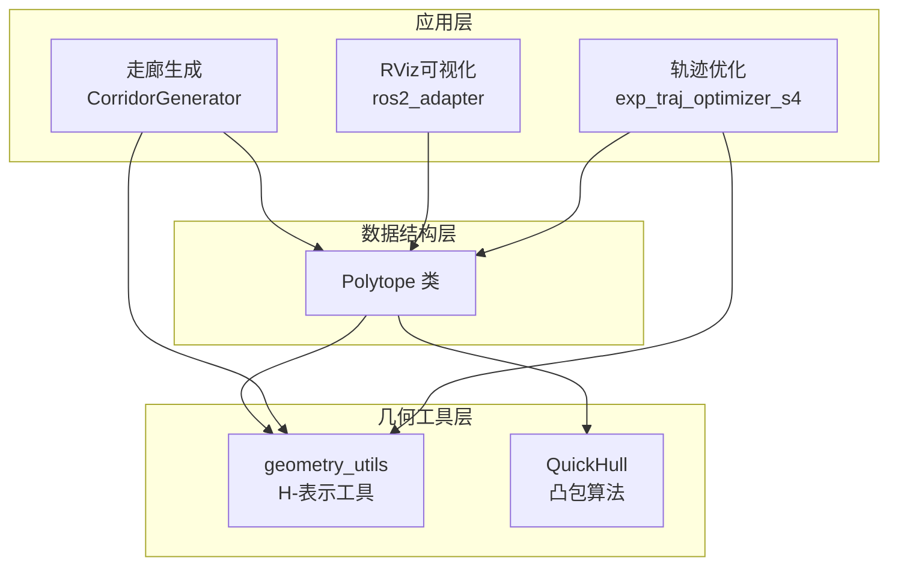
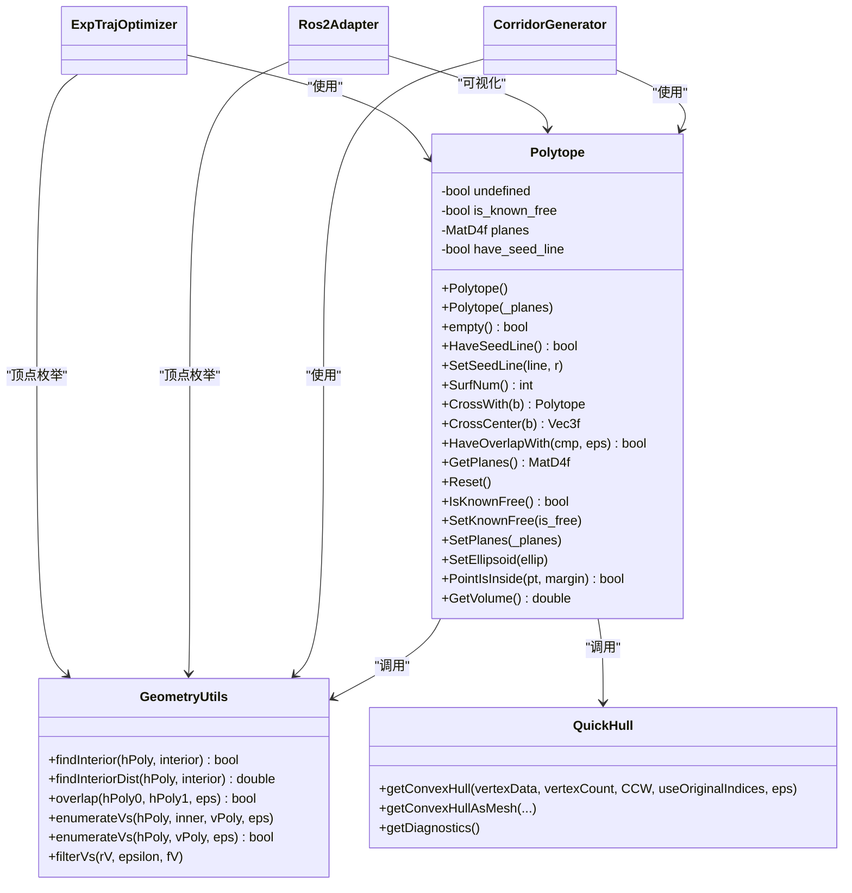
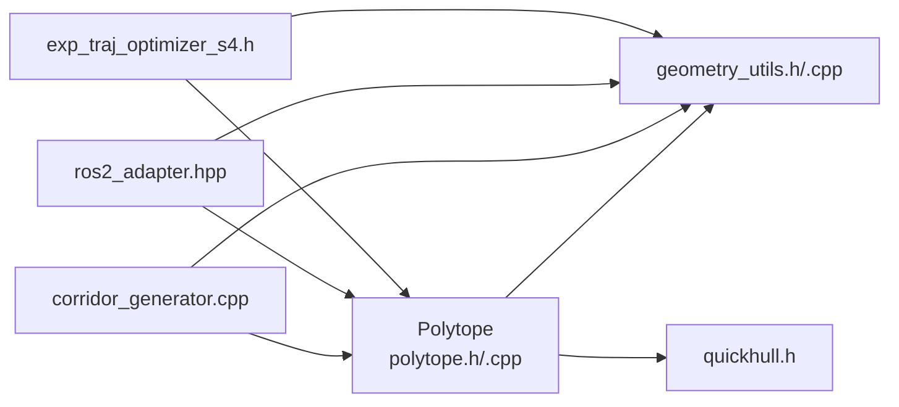

# 凸多面体数据结构

<cite>
**本文档引用的文件**
- [polytope.h](file://src/SUPER/super_planner/include/data_structure/base/polytope.h)
- [polytope.cpp](file://src/SUPER/super_planner/src/utils/polytope.cpp)
- [geometry_utils.h](file://src/SUPER/super_planner/include/utils/geometry/geometry_utils.h)
- [geometry_utils.cpp](file://src/SUPER/super_planner/src/utils/geometry_utils.cpp)
- [quickhull.h](file://src/SUPER/super_planner/include/utils/geometry/quickhull.h)
- [corridor_generator.cpp](file://src/SUPER/super_planner/src/super_core/corridor_generator.cpp)
- [ros2_adapter.hpp](file://src/SUPER/super_planner/include/ros_interface/ros2/ros2_adapter.hpp)
- [exp_traj_optimizer_s4.h](file://src/SUPER/super_planner/include/traj_opt/exp_traj_optimizer_s4.h)
</cite>

## 目录
1. [简介](#简介)
2. [项目结构](#项目结构)
3. [核心组件](#核心组件)
4. [架构总览](#架构总览)
5. [详细组件分析](#详细组件分析)
6. [依赖关系分析](#依赖关系分析)
7. [性能考量](#性能考量)
8. [故障排查指南](#故障排查指南)
9. [结论](#结论)
10. [附录：使用示例](#附录使用示例)

## 简介
本文件面向凸多面体数据结构（Polytope）的API文档与实现解析，涵盖以下主题：
- 数学表示与存储：H-表示（不等式约束矩阵）的行格式与几何含义
- 表示转换：H-表示与V-表示（顶点集合）之间的转换流程
- 几何运算：交集、并集（通过拼接不等式）、重叠检测与内点查找
- 判定方法：点包含测试、边界判断、邻域关系查询
- 应用场景：轨迹规划中的走廊建模、避障与可视化
- 复杂度与优化：顶点枚举、凸包计算、线性规划求解的性能特征
- 使用示例：如何构建、操作与查询凸多面体

## 项目结构
该功能主要位于超级规划器模块中，核心文件组织如下：
- 数据结构定义：`data_structure/base/polytope.h`
- 实现逻辑：`utils/polytope.cpp`
- 几何工具与算法：`utils/geometry/geometry_utils.h` 及其实现
- 快速凸包算法：`utils/geometry/quickhull.h`
- 典型应用：走廊生成、轨迹优化、RViz可视化适配

图表来源
- [polytope.h](file://src/SUPER/super_planner/include/data_structure/base/polytope.h#L42-L101)
- [geometry_utils.h](file://src/SUPER/super_planner/include/utils/geometry/geometry_utils.h#L55-L305)
- [quickhull.h](file://src/SUPER/super_planner/include/utils/geometry/quickhull.h#L456-L609)
- [corridor_generator.cpp](file://src/SUPER/super_planner/src/super_core/corridor_generator.cpp#L140-L339)
- [ros2_adapter.hpp](file://src/SUPER/super_planner/include/ros_interface/ros2/ros2_adapter.hpp#L356-L403)
- [exp_traj_optimizer_s4.h](file://src/SUPER/super_planner/include/traj_opt/exp_traj_optimizer_s4.h#L226-L241)

章节来源
- [polytope.h](file://src/SUPER/super_planner/include/data_structure/base/polytope.h#L42-L101)
- [geometry_utils.h](file://src/SUPER/super_planner/include/utils/geometry/geometry_utils.h#L55-L305)

## 核心组件
- Polytope类：封装H-表示的多面体，提供构造、判定点包含、体积计算、交集、重叠检测、内点查找等接口
- geometry_utils命名空间：提供H-表示与V-表示互转、内点查找、重叠检测、顶点去重等工具
- QuickHull类：基于快速凸包算法的三维凸包计算
- CorridorGenerator：将路径点序列转换为连续走廊（多面体序列），并进行重叠度评估
- ros2_adapter：将多面体转换为RViz可渲染的三角网格
- exp_traj_optimizer_s4：在轨迹优化中使用多面体的顶点表示作为约束

章节来源
- [polytope.h](file://src/SUPER/super_planner/include/data_structure/base/polytope.h#L42-L101)
- [polytope.cpp](file://src/SUPER/super_planner/src/utils/polytope.cpp#L32-L175)
- [geometry_utils.h](file://src/SUPER/super_planner/include/utils/geometry/geometry_utils.h#L211-L251)
- [quickhull.h](file://src/SUPER/super_planner/include/utils/geometry/quickhull.h#L456-L609)

## 架构总览
下图展示了Polytope与几何工具、应用模块之间的交互关系。

图表来源
- [polytope.h](file://src/SUPER/super_planner/include/data_structure/base/polytope.h#L42-L101)
- [geometry_utils.h](file://src/SUPER/super_planner/include/utils/geometry/geometry_utils.h#L211-L251)
- [quickhull.h](file://src/SUPER/super_planner/include/utils/geometry/quickhull.h#L538-L609)
- [corridor_generator.cpp](file://src/SUPER/super_planner/src/super_core/corridor_generator.cpp#L140-L195)
- [ros2_adapter.hpp](file://src/SUPER/super_planner/include/ros_interface/ros2/ros2_adapter.hpp#L356-L403)
- [exp_traj_optimizer_s4.h](file://src/SUPER/super_planner/include/traj_opt/exp_traj_optimizer_s4.h#L226-L241)

## 详细组件分析

### Polytope类
- H-表示存储：每行代表一个半空间不等式 $ h_0 x + h_1 y + h_2 z + h_3 \leq 0 $，形成矩阵 $ A x + b \leq 0 $
- 构造与状态管理：支持从H-表示构造、重置、设置已知自由区域、设置椭球近似等
- 几何运算：
  - 交集：通过拼接两个多面体的不等式矩阵实现
  - 重叠检测：调用几何工具的重叠函数
  - 内点查找：调用几何工具的内点查找函数
- 判定与查询：
  - 点包含：将点扩展为齐次坐标后与不等式矩阵相乘，取最大值与容差比较
  - 体积：先枚举顶点，再用QuickHull生成凸包并计算有向体积之和
- 可视化：通过顶点枚举与QuickHull生成三角网格，供RViz发布

章节来源
- [polytope.h](file://src/SUPER/super_planner/include/data_structure/base/polytope.h#L42-L101)
- [polytope.cpp](file://src/SUPER/super_planner/src/utils/polytope.cpp#L32-L175)

### 几何工具（geometry_utils）
- 内点查找：将H-表示归一化后转化为线性规划问题，求解可行内点与内深
- 重叠检测：将两个多面体的不等式矩阵拼接，求解线性规划以判断是否存在分离超平面
- 顶点枚举：给定内点，将不等式矩阵归一化并构造线性系统，调用QuickHull得到顶点集合；随后对顶点进行量化去重
- 顶点去重：按缩放尺度量化坐标，利用有序集合去重

章节来源
- [geometry_utils.h](file://src/SUPER/super_planner/include/utils/geometry/geometry_utils.h#L211-L251)
- [geometry_utils.cpp](file://src/SUPER/super_planner/src/utils/geometry_utils.cpp#L549-L613)

### QuickHull（凸包）
- 输入：三维点云或顶点缓冲区
- 输出：三角网格索引缓冲与顶点缓冲
- 特性：支持CW/CCW方向控制、原索引复用、诊断信息

章节来源
- [quickhull.h](file://src/SUPER/super_planner/include/utils/geometry/quickhull.h#L456-L609)

### 应用：走廊生成（CorridorGenerator）
- 从路径点序列生成连续走廊（多面体序列）
- 重叠度评估：通过交集多面体的内深判断连续性
- 连续性修复：当重叠不足时，尝试从点生成新的多面体以保证连续

章节来源
- [corridor_generator.cpp](file://src/SUPER/super_planner/src/super_core/corridor_generator.cpp#L140-L195)

### 应用：RViz可视化（ros2_adapter）
- 将多面体转换为三角网格并发布到RViz
- 先进行顶点枚举，再调用QuickHull生成网格

章节来源
- [ros2_adapter.hpp](file://src/SUPER/super_planner/include/ros_interface/ros2/ros2_adapter.hpp#L356-L403)

### 应用：轨迹优化（exp_traj_optimizer_s4）
- 在轨迹优化中使用多面体的相对顶点表示作为约束
- 通过顶点枚举得到相对坐标系下的顶点集合

章节来源
- [exp_traj_optimizer_s4.h](file://src/SUPER/super_planner/include/traj_opt/exp_traj_optimizer_s4.h#L226-L241)

## 依赖关系分析

图表来源
- [polytope.h](file://src/SUPER/super_planner/include/data_structure/base/polytope.h#L27-L29)
- [geometry_utils.h](file://src/SUPER/super_planner/include/utils/geometry/geometry_utils.h#L50-L52)
- [quickhull.h](file://src/SUPER/super_planner/include/utils/geometry/quickhull.h#L5-L18)
- [corridor_generator.cpp](file://src/SUPER/super_planner/src/super_core/corridor_generator.cpp#L1-L20)
- [ros2_adapter.hpp](file://src/SUPER/super_planner/include/ros_interface/ros2/ros2_adapter.hpp#L1-L20)
- [exp_traj_optimizer_s4.h](file://src/SUPER/super_planner/include/traj_opt/exp_traj_optimizer_s4.h#L1-L20)

章节来源
- [polytope.h](file://src/SUPER/super_planner/include/data_structure/base/polytope.h#L27-L29)
- [geometry_utils.h](file://src/SUPER/super_planner/include/utils/geometry/geometry_utils.h#L50-L52)

## 性能考量
- 顶点枚举与凸包
  - 时间复杂度：顶点枚举依赖于不等式数量与内点质量；QuickHull平均复杂度接近$ O(n \log n) $，最坏情况可能退化
  - 空间复杂度：与顶点数成正比
- 线性规划求解
  - 内点查找与重叠检测均通过线性规划求解，通常在低维（4维）情况下高效
- 顶点去重
  - 量化阈值与输入尺度相关，建议根据场景调整epsilon以平衡精度与性能
- 可视化
  - 顶点枚举+QuickHull生成网格，建议在非实时路径中使用，避免频繁调用

[本节为通用性能讨论，无需特定文件来源]

## 故障排查指南
- 多面体为空或无效
  - 检查H-表示矩阵是否为空或包含NaN
  - 使用`empty()`与`GetPlanes()`进行状态确认
- 无法计算体积
  - 若顶点枚举失败，检查H-表示是否退化或内点不可得
- 重叠检测失败
  - 确认两个多面体的H-表示正确拼接，且线性规划求解未出现无穷解
- 可视化异常
  - 若顶点枚举结果含NaN，需回溯上游生成过程（如走廊生成）

章节来源
- [polytope.cpp](file://src/SUPER/super_planner/src/utils/polytope.cpp#L118-L132)
- [geometry_utils.cpp](file://src/SUPER/super_planner/src/utils/geometry_utils.cpp#L549-L613)
- [ros2_adapter.hpp](file://src/SUPER/super_planner/include/ros_interface/ros2/ros2_adapter.hpp#L366-L398)

## 结论
Polytope类以H-表示为核心，结合geometry_utils提供的顶点枚举、内点查找与重叠检测能力，实现了高效的多面体几何运算与轨迹规划应用。通过QuickHull生成三角网格，满足RViz可视化需求。在实际工程中，应关注顶点枚举与线性规划的数值稳定性，并根据场景调整去重阈值与容差参数。

[本节为总结性内容，无需特定文件来源]

## 附录：使用示例

### 示例1：从H-表示构造多面体并查询点包含
- 步骤
  - 准备H-表示矩阵（每行对应一个不等式）
  - 构造Polytope实例
  - 调用PointIsInside进行点包含测试
- 关键接口
  - 构造：Polytope(MatD4f)
  - 查询：PointIsInside(Vec3f, margin)

章节来源
- [polytope.h](file://src/SUPER/super_planner/include/data_structure/base/polytope.h#L63-L93)
- [polytope.cpp](file://src/SUPER/super_planner/src/utils/polytope.cpp#L118-L132)

### 示例2：计算多面体体积
- 步骤
  - 获取H-表示
  - 调用GetVolume，内部会进行顶点枚举与凸包计算
- 关键接口
  - GetVolume()

章节来源
- [polytope.cpp](file://src/SUPER/super_planner/src/utils/polytope.cpp#L134-L174)

### 示例3：多面体交集与重叠检测
- 步骤
  - 使用CrossWith拼接两个多面体的不等式矩阵
  - 使用HaveOverlapWith进行重叠检测
- 关键接口
  - CrossWith(const Polytope&)
  - HaveOverlapWith(Polytope, eps)

章节来源
- [polytope.cpp](file://src/SUPER/super_planner/src/utils/polytope.cpp#L74-L85)

### 示例4：走廊生成中的多面体连续性检查
- 步骤
  - 生成相邻多面体的交集
  - 计算内深，若低于阈值则尝试修复
- 关键接口
  - CrossWith
  - geometry_utils::findInteriorDist

章节来源
- [corridor_generator.cpp](file://src/SUPER/super_planner/src/super_core/corridor_generator.cpp#L140-L195)

### 示例5：RViz可视化
- 步骤
  - 通过geometry_utils::enumerateVs获取顶点
  - 使用QuickHull生成网格并发布到RViz
- 关键接口
  - enumerateVs
  - QuickHull::getConvexHull

章节来源
- [ros2_adapter.hpp](file://src/SUPER/super_planner/include/ros_interface/ros2/ros2_adapter.hpp#L356-L403)

### 示例6：轨迹优化中的多面体约束
- 步骤
  - 顶点枚举得到相对坐标系下的顶点
  - 将相对顶点作为轨迹优化的约束
- 关键接口
  - enumerateVs
  - 相对坐标变换

章节来源
- [exp_traj_optimizer_s4.h](file://src/SUPER/super_planner/include/traj_opt/exp_traj_optimizer_s4.h#L226-L241)