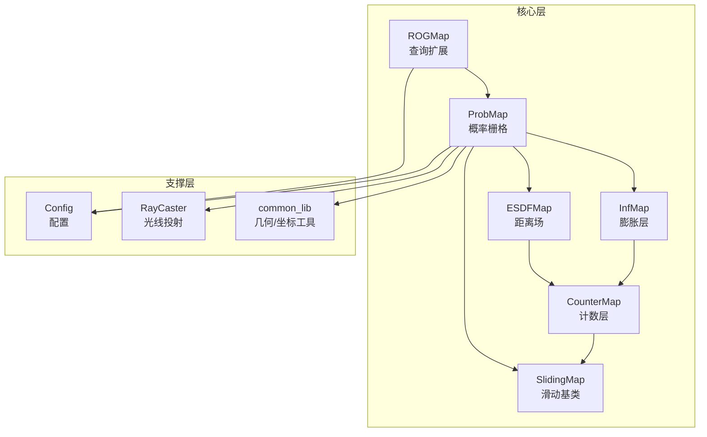
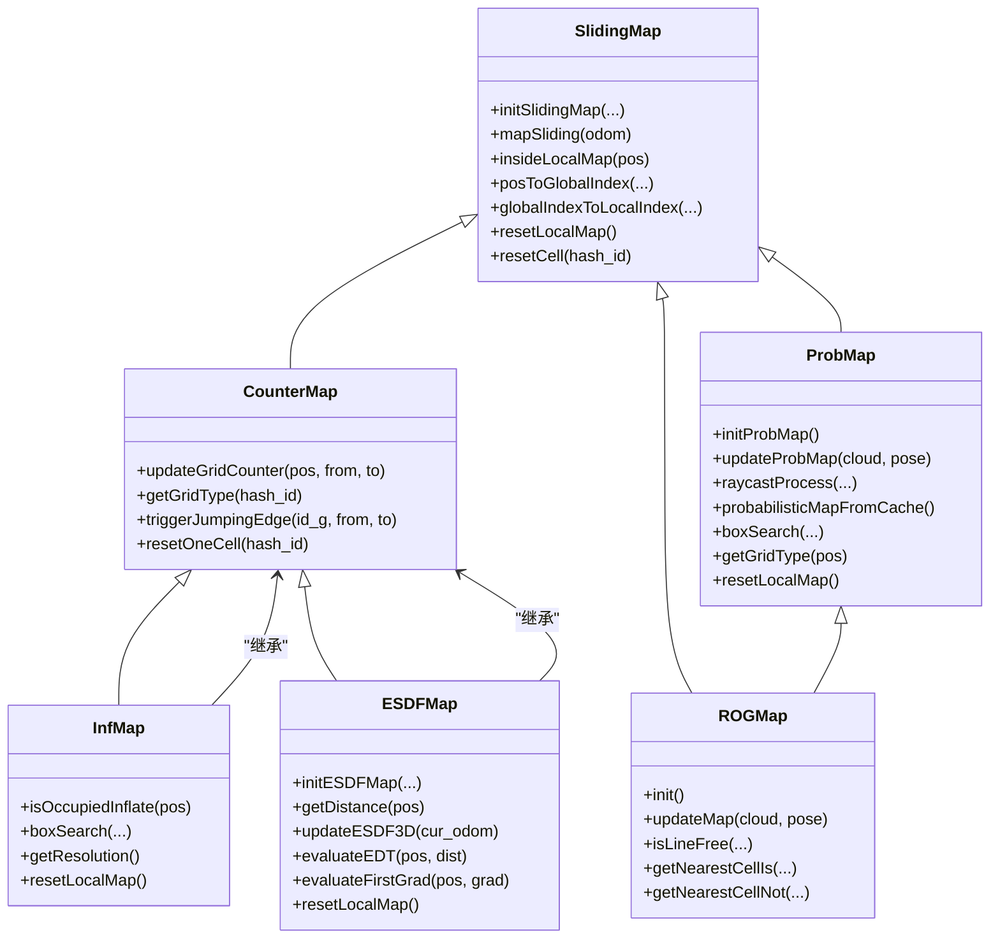
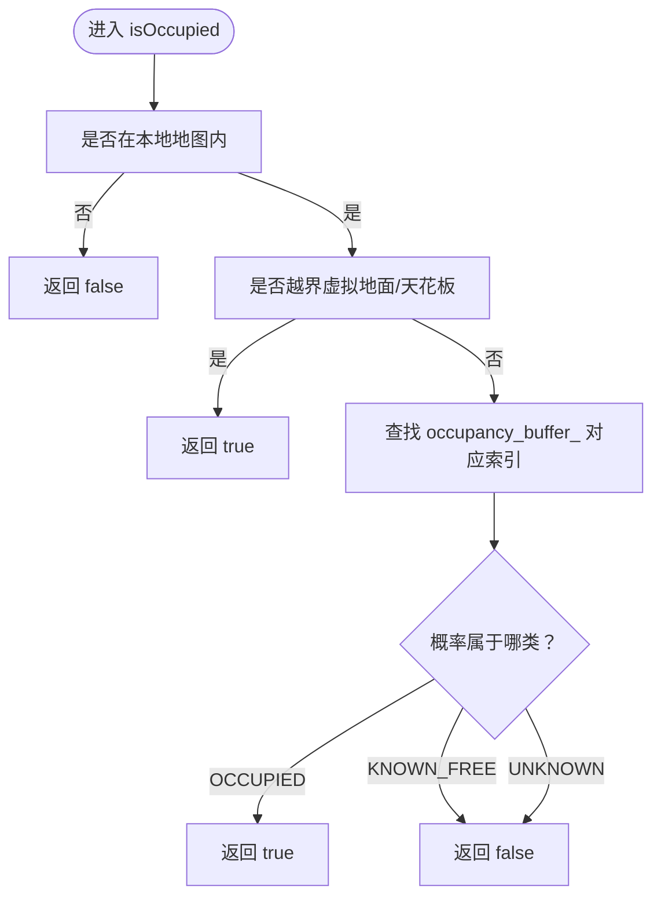
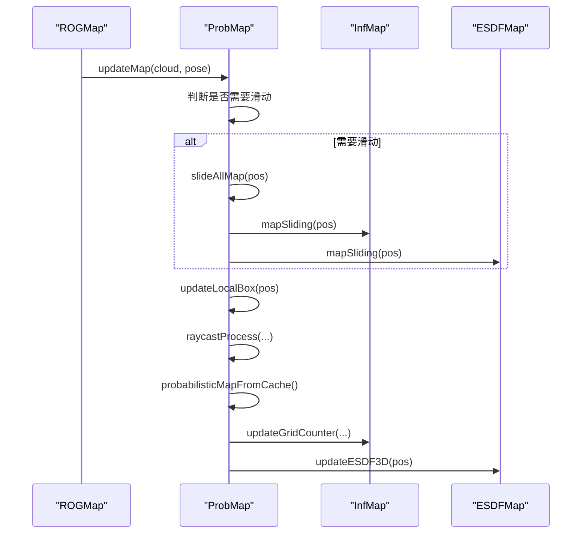
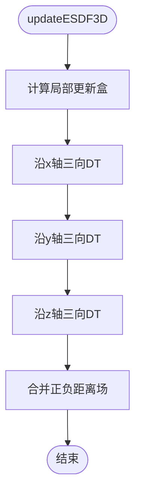
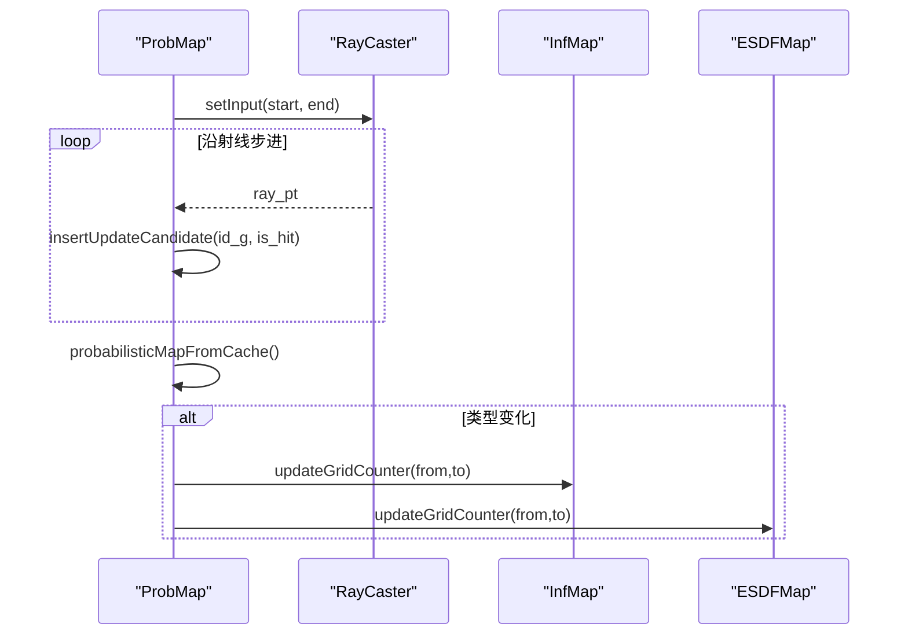
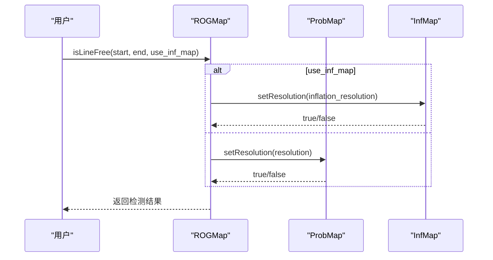
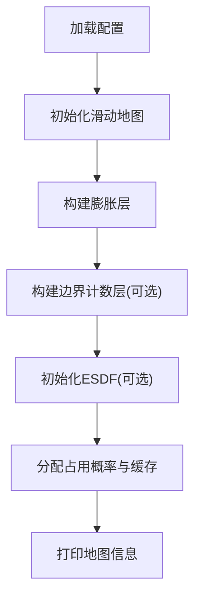
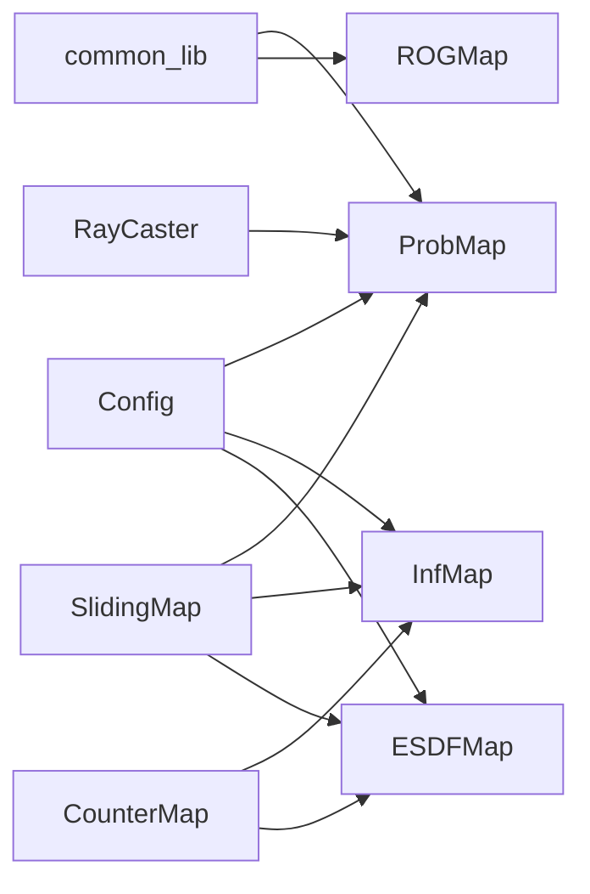

# 地图数据结构

<cite>
**本文引用的文件**
- [rog_map.h](file://src/SUPER/rog_map/include/rog_map/rog_map.h)
- [prob_map.h](file://src/SUPER/rog_map/include/rog_map/prob_map.h)
- [esdf_map.h](file://src/SUPER/rog_map/include/rog_map/esdf_map.h)
- [esdf_map.cpp](file://src/SUPER/rog_map/src/rog_map/esdf_map.cpp)
- [inf_map.h](file://src/SUPER/rog_map/include/rog_map/inf_map.h)
- [free_cnt_map.h](file://src/SUPER/rog_map/include/rog_map/free_cnt_map.h)
- [sliding_map.h](file://src/SUPER/rog_map/include/rog_map/rog_map_core/sliding_map.h)
- [raycaster.h](file://src/SUPER/rog_map/include/rog_map/rog_map_core/raycaster.h)
- [config.hpp](file://src/SUPER/rog_map/include/rog_map/rog_map_core/config.hpp)
- [common_lib.hpp](file://src/SUPER/rog_map/include/rog_map/rog_map_core/common_lib.hpp)
- [rog_map.cpp](file://src/SUPER/rog_map/src/rog_map/rog_map.cpp)
- [prob_map.cpp](file://src/SUPER/rog_map/src/rog_map/prob_map.cpp)
- [API_REFERENCE.md](file://src/SUPER/rog_map/doc/API_REFERENCE.md)
- [QUICKSTART.md](file://src/SUPER/rog_map/doc/QUICKSTART.md)
</cite>

## 目录
1. [简介](#简介)
2. [项目结构](#项目结构)
3. [核心组件](#核心组件)
4. [架构总览](#架构总览)
5. [详细组件分析](#详细组件分析)
6. [依赖关系分析](#依赖关系分析)
7. [性能考虑](#性能考虑)
8. [故障排查指南](#故障排查指南)
9. [结论](#结论)
10. [附录](#附录)

## 简介
本文件面向ROG地图系统，系统性梳理其数据结构设计与API，重点覆盖：
- 占用栅格的存储格式与类型判定
- 距离场（ESDF）数据结构与计算
- 滑动窗口机制与内存管理
- 地图初始化流程（分辨率、范围、内存分配）
- 地图更新算法（传感器数据融合、概率更新、ESDF计算）
- 地图查询接口（点查询、区域查询、路径查询）
- 序列化与持久化机制
- 空间复杂度与性能优化策略
- 具体使用示例

## 项目结构
ROG-Map采用分层架构：核心地图层（ProbMap）、膨胀层（InfMap）、计数层（CounterMap）、滑动地图基类（SlidingMap），以及ESDF距离场模块。配置由Config统一管理，坐标转换与几何工具位于common_lib中。

**图表来源**
- [rog_map.h](file://src/SUPER/rog_map/include/rog_map/rog_map.h#L39-L131)
- [prob_map.h](file://src/SUPER/rog_map/include/rog_map/prob_map.h#L38-L166)
- [inf_map.h](file://src/SUPER/rog_map/include/rog_map/inf_map.h#L30-L92)
- [esdf_map.h](file://src/SUPER/rog_map/include/rog_map/esdf_map.h#L32-L106)
- [counter_map.h](file://src/SUPER/rog_map/include/rog_map/rog_map_core/counter_map.h#L34-L141)
- [sliding_map.h](file://src/SUPER/rog_map/include/rog_map/rog_map_core/sliding_map.h#L41-L141)
- [raycaster.h](file://src/SUPER/rog_map/include/rog_map/rog_map_core/raycaster.h#L54-L93)
- [config.hpp](file://src/SUPER/rog_map/include/rog_map/rog_map_core/config.hpp#L50-L422)
- [common_lib.hpp](file://src/SUPER/rog_map/include/rog_map/rog_map_core/common_lib.hpp#L41-L157)

**章节来源**
- [API_REFERENCE.md](file://src/SUPER/rog_map/doc/API_REFERENCE.md#L29-L71)

## 核心组件
- ROGMap：在ProbMap基础上扩展线段自由检测、最近邻搜索等查询能力，并负责整体初始化与更新流程。
- ProbMap：概率占用栅格核心，维护占用概率缓存、执行光线投射与概率更新、触发膨胀传播与ESDF更新。
- InfMap：膨胀层，基于CounterMap，维护膨胀后的占据/未知计数，提供膨胀查询与盒子搜索。
- ESDFMap：距离场模块，基于CounterMap，维护正负距离场，提供三向DT与插值评估。
- CounterMap：计数层基类，维护每个网格的占据/未知子格计数，提供网格类型判定与跳变边缘触发。
- SlidingMap：滑动窗口基类，提供3D网格索引、坐标转换、内存清理与滑动策略。
- Config：集中管理地图分辨率、尺寸、更新盒、阈值、虚拟地面/天花板等参数。
- RayCaster：光线投射器，按分辨率生成沿射线的采样点。
- common_lib：坐标转换、线盒相交、路径长度等通用工具。

**章节来源**
- [rog_map.h](file://src/SUPER/rog_map/include/rog_map/rog_map.h#L39-L131)
- [prob_map.h](file://src/SUPER/rog_map/include/rog_map/prob_map.h#L38-L166)
- [inf_map.h](file://src/SUPER/rog_map/include/rog_map/inf_map.h#L30-L92)
- [esdf_map.h](file://src/SUPER/rog_map/include/rog_map/esdf_map.h#L32-L106)
- [counter_map.h](file://src/SUPER/rog_map/include/rog_map/rog_map_core/counter_map.h#L34-L141)
- [sliding_map.h](file://src/SUPER/rog_map/include/rog_map/rog_map_core/sliding_map.h#L41-L141)
- [config.hpp](file://src/SUPER/rog_map/include/rog_map/rog_map_core/config.hpp#L50-L422)
- [raycaster.h](file://src/SUPER/rog_map/include/rog_map/rog_map_core/raycaster.h#L54-L93)
- [common_lib.hpp](file://src/SUPER/rog_map/include/rog_map/rog_map_core/common_lib.hpp#L41-L157)

## 架构总览
ROG-Map采用“概率栅格 + 膨胀层 + 距离场”的多层结构：
- ProbMap持有占用概率缓存与更新缓存队列，负责概率更新与批量提交。
- InfMap基于CounterMap，对ProbMap的类型变化进行膨胀传播。
- ESDFMap基于CounterMap，维护正负距离场并进行三向DT与插值。
- SlidingMap提供滑动窗口与内存管理，确保局部更新与高效查询。

**图表来源**
- [sliding_map.h](file://src/SUPER/rog_map/include/rog_map/rog_map_core/sliding_map.h#L41-L141)
- [counter_map.h](file://src/SUPER/rog_map/include/rog_map/rog_map_core/counter_map.h#L34-L141)
- [esdf_map.h](file://src/SUPER/rog_map/include/rog_map/esdf_map.h#L32-L106)
- [inf_map.h](file://src/SUPER/rog_map/include/rog_map/inf_map.h#L30-L92)
- [prob_map.h](file://src/SUPER/rog_map/include/rog_map/prob_map.h#L38-L166)
- [rog_map.h](file://src/SUPER/rog_map/include/rog_map/rog_map.h#L39-L131)

## 详细组件分析

### 占用栅格存储与类型判定
- 存储格式
  - ProbMap使用一维浮点数组存储占用概率，按局部索引映射到全局索引，支持批量更新缓存队列。
  - 更新缓存包含操作计数与命中计数，按网格哈希索引聚合，减少重复更新。
- 类型判定
  - 基于阈值 l_free 与 l_occ 将概率映射为 KNOWN_FREE、UNKNOWN、OCCUPIED。
  - 提供 isOccupied/isUnknown/isKnownFree 的位置与索引版本。
- 膨胀查询
  - 通过 InfMap 的计数层结果进行膨胀判定，提供 isOccupiedInflate/isUnknownInflate/isKnownFreeInflate。

**图表来源**
- [prob_map.cpp](file://src/SUPER/rog_map/src/rog_map/prob_map.cpp#L102-L134)
- [prob_map.h](file://src/SUPER/rog_map/include/rog_map/prob_map.h#L49-L68)

**章节来源**
- [prob_map.h](file://src/SUPER/rog_map/include/rog_map/prob_map.h#L49-L68)
- [prob_map.cpp](file://src/SUPER/rog_map/src/rog_map/prob_map.cpp#L102-L134)
- [prob_map.cpp](file://src/SUPER/rog_map/src/rog_map/prob_map.cpp#L158-L189)

### 滑动窗口机制与内存管理
- 滑动策略
  - 当机器人位姿超出本地更新盒或滑动阈值时，整体滑动至新中心，同时同步InfMap与ESDFMap。
  - 支持固定原点模式与自适应滑动模式。
- 内存清理
  - 滑动时清理出界的内存单元，调用 resetCell 重置为 UNKNOWN，触发 CounterMap 的跳变边缘处理。
- 坐标转换
  - 提供世界坐标与网格索引之间的双向转换，支持局部/全局索引互转。

**图表来源**
- [rog_map.cpp](file://src/SUPER/rog_map/src/rog_map/rog_map.cpp#L240-L262)
- [prob_map.cpp](file://src/SUPER/rog_map/src/rog_map/prob_map.cpp#L308-L375)
- [sliding_map.h](file://src/SUPER/rog_map/include/rog_map/rog_map_core/sliding_map.h#L63-L68)

**章节来源**
- [sliding_map.h](file://src/SUPER/rog_map/include/rog_map/rog_map_core/sliding_map.h#L63-L68)
- [prob_map.cpp](file://src/SUPER/rog_map/src/rog_map/prob_map.cpp#L297-L306)
- [rog_map.cpp](file://src/SUPER/rog_map/src/rog_map/rog_map.cpp#L38-L49)

### 距离场（ESDF）数据结构与算法
- 数据结构
  - ESDFMap继承CounterMap，维护距离缓冲区与临时缓冲区，按三维索引组织。
  - 维护局部更新盒，仅对更新区域内进行三向DT（沿x/y/z轴）。
- 计算流程
  - 以当前位姿为中心，确定局部更新盒，三向DT：先z再y再x，再反向两次，最后合并正负距离。
  - 提供 evaluateEDT 与 evaluateFirstGrad/SecondGrad 的三线性插值。
- 可视化
  - 提供正/负ESDF点云导出接口，便于RViz可视化。

**图表来源**
- [esdf_map.cpp](file://src/SUPER/rog_map/src/rog_map/esdf_map.cpp#L80-L249)
- [esdf_map.h](file://src/SUPER/rog_map/include/rog_map/esdf_map.h#L53-L71)

**章节来源**
- [esdf_map.h](file://src/SUPER/rog_map/include/rog_map/esdf_map.h#L39-L71)
- [esdf_map.cpp](file://src/SUPER/rog_map/src/rog_map/esdf_map.cpp#L31-L58)
- [esdf_map.cpp](file://src/SUPER/rog_map/src/rog_map/esdf_map.cpp#L80-L249)
- [esdf_map.cpp](file://src/SUPER/rog_map/src/rog_map/esdf_map.cpp#L255-L318)

### 概率更新与传感器融合
- 光线投射
  - RayCaster 按分辨率生成采样点，支持虚拟地面/天花板截断与局部更新盒裁剪。
  - 支持禁用光线投射，直接将命中点加入更新缓存。
- 更新策略
  - 命中点：概率增加 l_hit × 命中次数，上限 l_max。
  - 未命中点：概率增加 l_miss × 未命中次数，下限 l_min。
  - 类型变化时，触发 InfMap 与 ESDFMap 的计数更新与跳变边缘处理。
- 批量更新
  - 将更新缓存中的网格一次性提交，减少锁竞争与重复计算。

**图表来源**
- [prob_map.cpp](file://src/SUPER/rog_map/src/rog_map/prob_map.cpp#L672-L793)
- [prob_map.cpp](file://src/SUPER/rog_map/src/rog_map/prob_map.cpp#L550-L574)
- [raycaster.h](file://src/SUPER/rog_map/include/rog_map/rog_map_core/raycaster.h#L71-L74)

**章节来源**
- [raycaster.h](file://src/SUPER/rog_map/include/rog_map/rog_map_core/raycaster.h#L54-L93)
- [prob_map.cpp](file://src/SUPER/rog_map/src/rog_map/prob_map.cpp#L672-L793)
- [prob_map.cpp](file://src/SUPER/rog_map/src/rog_map/prob_map.cpp#L550-L574)
- [prob_map.cpp](file://src/SUPER/rog_map/src/rog_map/prob_map.cpp#L576-L670)

### 查询接口
- 单点查询
  - isOccupied/isUnknown/isKnownFree：基础占用状态
  - isOccupiedInflate/isUnknownInflate/isKnownFreeInflate：膨胀状态
  - getGridType/getInfGridType：返回枚举类型
  - getMapValue：返回概率值
- 区域查询
  - boxSearch：在盒子内搜索特定类型体素（OCCUPIED/UNKNOWN/FRONTIER）
  - boxSearchInflate：膨胀层盒子搜索
  - boundBoxByLocalMap：限制盒子范围
- 路径查询
  - isLineFree：线段自由检测（支持膨胀与未知视为占据）
  - getNearestCellIs/Not：最近邻搜索（支持膨胀层）
- 坐标转换
  - probMapPosToGlobalIndex/probMapGlobalIndexToPos
  - infMapPosToGlobalIndex/infMapGlobalIndexToPos

**图表来源**
- [rog_map.cpp](file://src/SUPER/rog_map/src/rog_map/rog_map.cpp#L132-L175)
- [prob_map.cpp](file://src/SUPER/rog_map/src/rog_map/prob_map.cpp#L429-L497)

**章节来源**
- [rog_map.h](file://src/SUPER/rog_map/include/rog_map/rog_map.h#L59-L93)
- [prob_map.h](file://src/SUPER/rog_map/include/rog_map/prob_map.h#L49-L84)
- [rog_map.cpp](file://src/SUPER/rog_map/src/rog_map/rog_map.cpp#L132-L238)
- [prob_map.cpp](file://src/SUPER/rog_map/src/rog_map/prob_map.cpp#L429-L502)

### 初始化流程与内存分配
- 初始化步骤
  - 加载配置（分辨率、尺寸、阈值、更新盒、虚拟地面/天花板）
  - 初始化滑动地图（半尺寸、分辨率、滑动开关、阈值、固定原点）
  - 构造膨胀层与边界计数层（可选）
  - 初始化ESDF（可选），设置局部更新盒
  - 初始化占用概率缓冲区与更新缓存
- 内存分配
  - 一维数组按 sc_.map_size_i.prod() 分配
  - 更新缓存队列与计数数组按相同规模分配
  - ESDFMap 分配距离与临时缓冲区

**图表来源**
- [prob_map.cpp](file://src/SUPER/rog_map/src/rog_map/prob_map.cpp#L28-L91)
- [config.hpp](file://src/SUPER/rog_map/include/rog_map/rog_map_core/config.hpp#L349-L419)

**章节来源**
- [prob_map.cpp](file://src/SUPER/rog_map/src/rog_map/prob_map.cpp#L28-L91)
- [config.hpp](file://src/SUPER/rog_map/include/rog_map/rog_map_core/config.hpp#L143-L214)

### 序列化与持久化
- PCD加载
  - 支持从点云文件加载初始地图，加载成功后可选更新ESDF。
- 日志输出
  - 支持写入性能耗时与地图信息到CSV文件，便于调试与分析。
- 可视化
  - 提供ESDF正/负点云导出接口，配合RViz进行可视化。

**章节来源**
- [rog_map.cpp](file://src/SUPER/rog_map/src/rog_map/rog_map.cpp#L62-L78)
- [prob_map.cpp](file://src/SUPER/rog_map/src/rog_map/prob_map.cpp#L225-L256)
- [esdf_map.cpp](file://src/SUPER/rog_map/src/rog_map/esdf_map.cpp#L255-L318)

## 依赖关系分析

**图表来源**
- [config.hpp](file://src/SUPER/rog_map/include/rog_map/rog_map_core/config.hpp#L50-L422)
- [sliding_map.h](file://src/SUPER/rog_map/include/rog_map/rog_map_core/sliding_map.h#L41-L141)
- [counter_map.h](file://src/SUPER/rog_map/include/rog_map/rog_map_core/counter_map.h#L34-L141)
- [prob_map.h](file://src/SUPER/rog_map/include/rog_map/prob_map.h#L38-L166)
- [inf_map.h](file://src/SUPER/rog_map/include/rog_map/inf_map.h#L30-L92)
- [esdf_map.h](file://src/SUPER/rog_map/include/rog_map/esdf_map.h#L32-L106)
- [raycaster.h](file://src/SUPER/rog_map/include/rog_map/rog_map_core/raycaster.h#L54-L93)
- [common_lib.hpp](file://src/SUPER/rog_map/include/rog_map/rog_map_core/common_lib.hpp#L41-L157)
- [rog_map.h](file://src/SUPER/rog_map/include/rog_map/rog_map.h#L39-L131)

**章节来源**
- [API_REFERENCE.md](file://src/SUPER/rog_map/doc/API_REFERENCE.md#L29-L71)

## 性能考虑
- 时间复杂度
  - 单点查询：O(1)
  - 线段碰撞检测：O(N)，N为沿射线体素数
  - 盒子搜索：O(M)，M为盒子内总体素数
  - 最近邻搜索：O(K³)，K为搜索半径对应的网格边长
  - 地图更新：O(P + O)，P为点云大小，O为膨胀/ESDF计算
- 空间复杂度
  - 单地图：O(N³)，N为半尺寸×2
  - 多层：概率图 + 膨胀层 + ESDF（可选）
- 优化策略
  - 降低分辨率或缩小地图尺寸
  - 关闭不必要的功能（ESDF、边界提取、未知膨胀）
  - 合理设置批更新大小与点云下采样
  - 使用膨胀查询进行碰撞检测，提高安全性

**章节来源**
- [API_REFERENCE.md](file://src/SUPER/rog_map/doc/API_REFERENCE.md#L514-L541)

## 故障排查指南
- 节点启动失败
  - 检查配置文件路径与参数命名空间
- 点云不更新
  - 确认话题频率与配置项，查看日志级别
- 查询速度慢
  - 降低分辨率/地图尺寸，关闭ESDF与边界提取，减少批更新大小

**章节来源**
- [QUICKSTART.md](file://src/SUPER/rog_map/doc/QUICKSTART.md#L181-L242)

## 结论
ROG-Map通过“概率栅格 + 膨胀层 + 距离场”的分层设计，在保证实时性的前提下提供了丰富的查询与维护能力。滑动窗口机制有效控制内存占用，光线投射与批量更新提升更新效率。合理配置参数与选择查询策略，可在不同应用场景中取得良好性能与安全性平衡。

## 附录

### 使用示例（路径查询与障碍物搜索）
- 线段自由检测
  - 使用 isLineFree(start, end, use_inf_map=true) 进行安全路径检查
- 盒子搜索获取障碍物
  - 使用 boxSearch(box_min, box_max, GridType::OCCUPIED, out_points)
- 最近障碍物距离
  - 使用 getNearestCellIs(GridType::OCCUPIED, start_pos, nearest_pt, radius)

**章节来源**
- [QUICKSTART.md](file://src/SUPER/rog_map/doc/QUICKSTART.md#L128-L177)
- [rog_map.cpp](file://src/SUPER/rog_map/src/rog_map/rog_map.cpp#L132-L238)
- [prob_map.cpp](file://src/SUPER/rog_map/src/rog_map/prob_map.cpp#L429-L497)