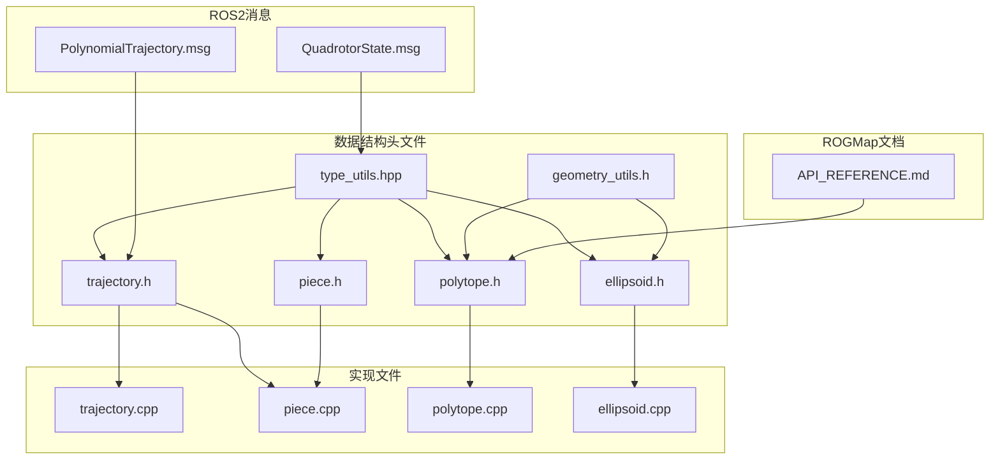
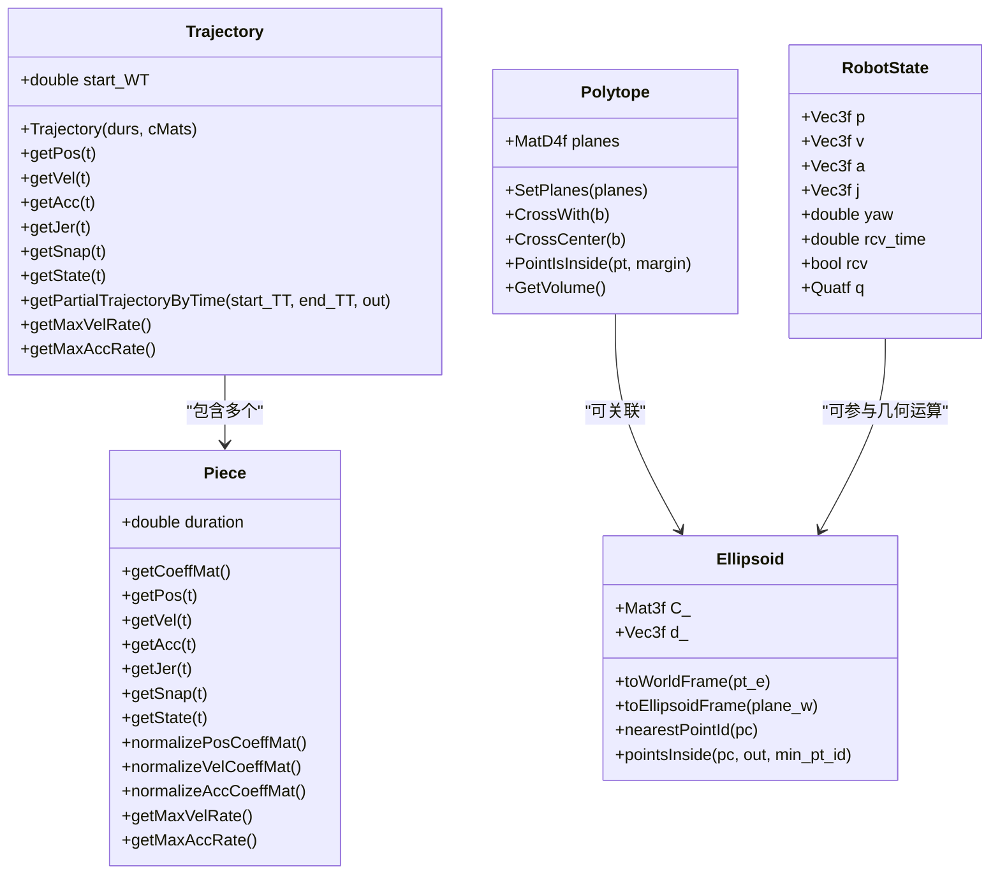
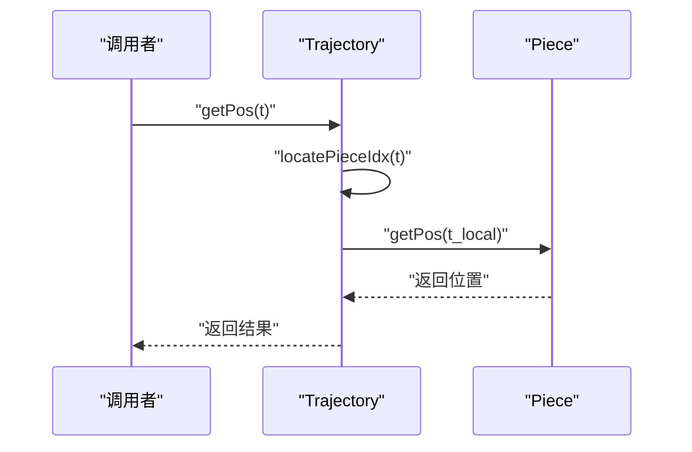
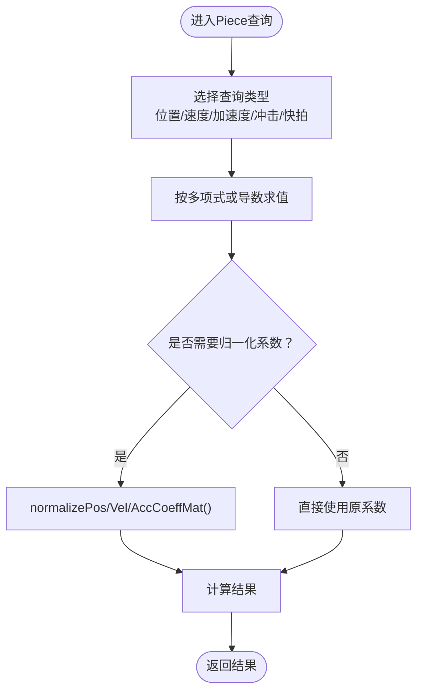
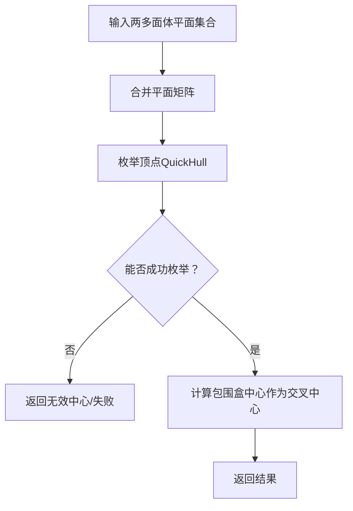
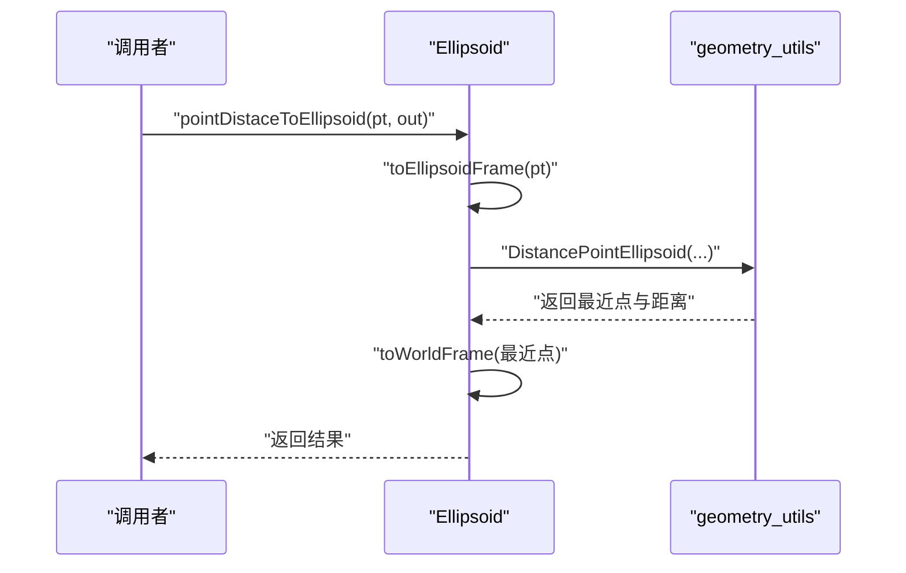
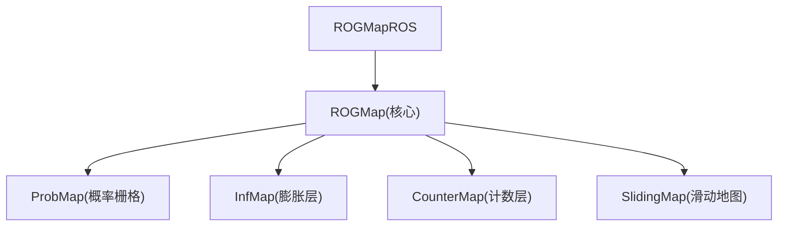
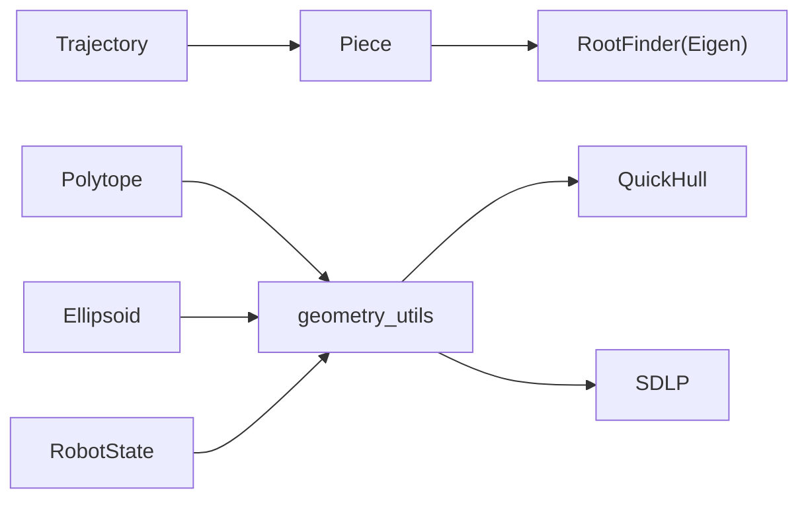

# 数据结构API

<cite>
**本文引用的文件**
- [trajectory.h](file://src/SUPER/super_planner/include/data_structure/base/trajectory.h)
- [piece.h](file://src/SUPER/super_planner/include/data_structure/base/piece.h)
- [polytope.h](file://src/SUPER/super_planner/include/data_structure/base/polytope.h)
- [ellipsoid.h](file://src/SUPER/super_planner/include/data_structure/base/ellipsoid.h)
- [type_utils.hpp](file://src/SUPER/super_planner/include/utils/header/type_utils.hpp)
- [geometry_utils.h](file://src/SUPER/super_planner/include/utils/geometry/geometry_utils.h)
- [trajectory.cpp](file://src/SUPER/super_planner/src/utils/trajectory.cpp)
- [piece.cpp](file://src/SUPER/super_planner/src/utils/piece.cpp)
- [polytope.cpp](file://src/SUPER/super_planner/src/utils/polytope.cpp)
- [ellipsoid.cpp](file://src/SUPER/super_planner/src/utils/ellipsoid.cpp)
- [PolynomialTrajectory.msg](file://src/SUPER/mars_uav_sim/mars_quadrotor_msgs/ros2_msg/PolynomialTrajectory.msg)
- [QuadrotorState.msg](file://src/SUPER/mars_uav_sim/mars_quadrotor_msgs/ros2_msg/QuadrotorState.msg)
- [API_REFERENCE.md](file://src/SUPER/rog_map/doc/API_REFERENCE.md)
</cite>

## 目录
1. [简介](#简介)
2. [项目结构](#项目结构)
3. [核心组件](#核心组件)
4. [架构总览](#架构总览)
5. [详细组件分析](#详细组件分析)
6. [依赖关系分析](#依赖关系分析)
7. [性能考量](#性能考量)
8. [故障排查指南](#故障排查指南)
9. [结论](#结论)
10. [附录](#附录)

## 简介
本文件面向数据结构API，系统化阐述以下核心数据结构及其交互：轨迹数据结构（Trajectory）、路径片段数据结构（Piece）、凸多面体数据结构（Polytope）、椭球体（Ellipsoid）以及机器人状态（RobotState）。重点覆盖：
- 多项式轨迹的存储格式与分段表示
- 状态查询接口与时间管理机制
- 路径片段的多项式系数存储、连续性约束与插值方法
- 凸多面体的数学表示（不等式约束、顶点表示、几何运算）
- 机器人状态字段定义与更新机制
- 地图数据结构（ROGMap）的存储格式与查询接口
- 数据结构之间的关系图与内存布局说明
- 使用最佳实践与性能优化建议

## 项目结构
本项目中与数据结构API直接相关的核心目录与文件如下：
- 数据结构头文件位于 include/data_structure/base 与 include/utils/geometry
- 具体实现位于 src/utils 下对应文件
- 消息定义位于 mars_quadrotor_msgs/ros2_msg，用于ROS2通信
- ROGMap文档位于 rog_map/doc，提供地图API参考

**图表来源**
- [trajectory.h](file://src/SUPER/super_planner/include/data_structure/base/trajectory.h#L56-L173)
- [piece.h](file://src/SUPER/super_planner/include/data_structure/base/piece.h#L69-L131)
- [polytope.h](file://src/SUPER/super_planner/include/data_structure/base/polytope.h#L42-L101)
- [ellipsoid.h](file://src/SUPER/super_planner/include/data_structure/base/ellipsoid.h#L37-L123)
- [type_utils.hpp](file://src/SUPER/super_planner/include/utils/header/type_utils.hpp#L99-L105)
- [geometry_utils.h](file://src/SUPER/super_planner/include/utils/geometry/geometry_utils.h#L55-L64)
- [trajectory.cpp](file://src/SUPER/super_planner/src/utils/trajectory.cpp#L24-L409)
- [piece.cpp](file://src/SUPER/super_planner/src/utils/piece.cpp#L24-L286)
- [polytope.cpp](file://src/SUPER/super_planner/src/utils/polytope.cpp#L24-L175)
- [ellipsoid.cpp](file://src/SUPER/super_planner/src/utils/ellipsoid.cpp#L24-L205)
- [PolynomialTrajectory.msg](file://src/SUPER/mars_uav_sim/mars_quadrotor_msgs/ros2_msg/PolynomialTrajectory.msg#L1-L39)
- [QuadrotorState.msg](file://src/SUPER/mars_uav_sim/mars_quadrotor_msgs/ros2_msg/QuadrotorState.msg#L1-L11)
- [API_REFERENCE.md](file://src/SUPER/rog_map/doc/API_REFERENCE.md#L1-L70)

**章节来源**
- [trajectory.h](file://src/SUPER/super_planner/include/data_structure/base/trajectory.h#L56-L173)
- [piece.h](file://src/SUPER/super_planner/include/data_structure/base/piece.h#L69-L131)
- [polytope.h](file://src/SUPER/super_planner/include/data_structure/base/polytope.h#L42-L101)
- [ellipsoid.h](file://src/SUPER/super_planner/include/data_structure/base/ellipsoid.h#L37-L123)
- [type_utils.hpp](file://src/SUPER/super_planner/include/utils/header/type_utils.hpp#L99-L105)
- [geometry_utils.h](file://src/SUPER/super_planner/include/utils/geometry/geometry_utils.h#L55-L64)

## 核心组件
本节对四大核心数据结构进行概览式说明，并给出它们在系统中的职责定位。

- Trajectory（轨迹）
  - 职责：封装多个Piece，提供按时间查询位置/速度/加速度/冲击/快拍等状态；管理整体持续时间与分段拼接；支持按片段ID或按绝对时间截取子轨迹。
  - 关键能力：分段定位、状态查询、最大速率检查、部分轨迹生成。
- Piece（路径片段）
  - 职责：以多项式参数化单段轨迹，提供任意时刻的状态查询；支持归一化系数矩阵与最大速率估计。
  - 关键能力：多项式求值（位置/速度/加速度/冲击/快拍）、归一化系数、最大速率估计与约束校验。
- Polytope（凸多面体）
  - 职责：以平面半空间交集表示凸多面体，支持相交、包含判断、体积计算、种子线等。
  - 关键能力：平面集合操作、顶点枚举、体积计算、已知自由区域标记。
- Ellipsoid（椭球体）
  - 职责：以二次型形式表示椭球体，支持点到椭球最近点、坐标系变换、点集最近点查找等。
  - 关键能力：坐标系变换、距离计算、点集内/外判断、最近点查找。
- RobotState（机器人状态）
  - 职责：统一记录位置、速度、加速度、冲击、偏航角、接收时间与四元数等状态字段。
  - 关键能力：状态容器、时间戳与有效性标记。

**章节来源**
- [trajectory.h](file://src/SUPER/super_planner/include/data_structure/base/trajectory.h#L56-L173)
- [piece.h](file://src/SUPER/super_planner/include/data_structure/base/piece.h#L69-L131)
- [polytope.h](file://src/SUPER/super_planner/include/data_structure/base/polytope.h#L42-L101)
- [ellipsoid.h](file://src/SUPER/super_planner/include/data_structure/base/ellipsoid.h#L37-L123)
- [type_utils.hpp](file://src/SUPER/super_planner/include/utils/header/type_utils.hpp#L99-L105)

## 架构总览
下图展示数据结构之间的高层关系与依赖方向：

**图表来源**
- [trajectory.h](file://src/SUPER/super_planner/include/data_structure/base/trajectory.h#L56-L173)
- [piece.h](file://src/SUPER/super_planner/include/data_structure/base/piece.h#L69-L131)
- [polytope.h](file://src/SUPER/super_planner/include/data_structure/base/polytope.h#L42-L101)
- [ellipsoid.h](file://src/SUPER/super_planner/include/data_structure/base/ellipsoid.h#L37-L123)
- [type_utils.hpp](file://src/SUPER/super_planner/include/utils/header/type_utils.hpp#L99-L105)

## 详细组件分析

### 轨迹数据结构（Trajectory）
- 设计理念
  - 分段多项式：将全局轨迹拆分为若干Piece，每段以多项式参数化，便于局部控制与连续性约束。
  - 时间管理：通过start_WT与分段duration共同管理绝对时间与相对时间，支持按绝对时间截取子轨迹。
  - 状态查询：提供位置、速度、加速度、冲击、快拍与状态矩阵查询，满足轨迹可视化与控制器输入需求。
- 存储格式
  - 内部以向量存储Piece，支持随机访问与迭代器遍历。
  - 提供序列化接口，便于持久化与日志记录。
- 分段表示与连续性
  - 连续性由Piece内部多项式系数保证；Trajectory负责分段边界的时间衔接与状态一致性。
- 状态查询接口
  - getPos/getVel/getAcc/getJer/getSnap/state系列函数，均通过locatePieceIdx定位到具体Piece后调用其查询方法。
- 时间管理机制
  - locatePieceIdx将绝对时间映射到分段索引与局部时间；getWaypointTT提供关键点的累计时间。
- 截取与拼接
  - 支持按片段ID与按绝对时间截取子轨迹；支持Trajectory拼接与移动语义插入。
- 性能与稳定性
  - locatePieceIdx采用线性扫描，适合中小规模分段；若分段数量较大，可考虑二分查找优化。
  - 部分轨迹生成涉及多项式系数转换，注意数值稳定性与阶数限制（实现中区分5阶与7阶）。

**图表来源**
- [trajectory.cpp](file://src/SUPER/super_planner/src/utils/trajectory.cpp#L126-L130)
- [piece.cpp](file://src/SUPER/super_planner/src/utils/piece.cpp#L51-L59)

**章节来源**
- [trajectory.h](file://src/SUPER/super_planner/include/data_structure/base/trajectory.h#L56-L173)
- [trajectory.cpp](file://src/SUPER/super_planner/src/utils/trajectory.cpp#L24-L409)

### 路径片段数据结构（Piece）
- 多项式系数存储
  - 以3×(D+1)矩阵存储XYZ三轴的多项式系数，D为多项式阶数（实现中支持5阶与7阶）。
  - 提供getCoeffMat访问原始系数矩阵。
- 连续性约束与插值
  - 通过多项式求导实现速度、加速度、冲击、快拍的连续性；归一化系数矩阵用于最大速率估计与约束校验。
- 插值方法
  - getPos/getVel/getAcc/getJer/getSnap分别基于多项式及其导数求值；normalize系列方法将系数映射到标准区间，提升数值稳定性。
- 最大速率估计
  - getMaxVelRate/getMaxAccRate通过构造速度/加速度平方多项式的导数根求解，结合端点与候选根评估最大范数。
- 约束校验
  - checkMaxVelRate/checkMaxAccRate将约束转化为多项式不等式，利用根计数判定是否违反约束。

**图表来源**
- [piece.h](file://src/SUPER/super_planner/include/data_structure/base/piece.h#L69-L131)
- [piece.cpp](file://src/SUPER/super_planner/src/utils/piece.cpp#L51-L119)

**章节来源**
- [piece.h](file://src/SUPER/super_planner/include/data_structure/base/piece.h#L69-L131)
- [piece.cpp](file://src/SUPER/super_planner/src/utils/piece.cpp#L24-L286)

### 凸多面体数据结构（Polytope）
- 数学表示
  - 以平面半空间交集表示，每行平面系数(a,b,c,d)满足ax+by+cz+d≤0。
  - 支持设置/获取平面矩阵、判断空多面体、设置已知自由区域。
- 几何运算
  - CrossWith：两多面体相交，合并平面集合。
  - CrossCenter：基于顶点集合计算中心点。
  - PointIsInside：判断点是否在多面体内（支持margin容差）。
  - GetVolume：通过顶点枚举与凸包分解计算体积。
- 种子线与椭球体
  - 支持设置种子线（用于走廊简化）与关联椭球体（用于几何变换与距离计算）。

**图表来源**
- [polytope.h](file://src/SUPER/super_planner/include/data_structure/base/polytope.h#L42-L101)
- [polytope.cpp](file://src/SUPER/super_planner/src/utils/polytope.cpp#L58-L71)

**章节来源**
- [polytope.h](file://src/SUPER/super_planner/include/data_structure/base/polytope.h#L42-L101)
- [polytope.cpp](file://src/SUPER/super_planner/src/utils/polytope.cpp#L24-L175)

### 椭球体数据结构（Ellipsoid）
- 表示方式
  - 以二次型C与中心d表示，或以旋转矩阵R、半轴r与中心d表示；内部维护C与C逆与旋转分解。
- 坐标系变换
  - 提供世界帧与椭球帧之间的点、平面、点集变换，支持批量矩阵运算。
- 几何查询
  - pointDistaceToEllipsoid：计算点到椭球的最近点与距离。
  - nearestPointId/nearestPoint：在点集中查找最近点。
  - pointsInside/noPointsInside：判断点集是否全部在椭球外部/内部。
  - inside：判断点是否在椭球内部。

**图表来源**
- [ellipsoid.cpp](file://src/SUPER/super_planner/src/utils/ellipsoid.cpp#L59-L72)
- [geometry_utils.h](file://src/SUPER/super_planner/include/utils/geometry/geometry_utils.h#L141-L145)

**章节来源**
- [ellipsoid.h](file://src/SUPER/super_planner/include/data_structure/base/ellipsoid.h#L37-L123)
- [ellipsoid.cpp](file://src/SUPER/super_planner/src/utils/ellipsoid.cpp#L24-L205)

### 机器人状态数据结构（RobotState）
- 字段定义
  - p（位置）、v（速度）、a（加速度）、j（冲击）、yaw（偏航角）、rcv_time（接收时间）、rcv（接收有效标记）、q（四元数）。
- 更新机制
  - 通过传感器或仿真模块更新各字段；rcv与rcv_time用于时间同步与有效性判断。
  - 与几何工具协作，进行姿态与角速度转换（如四元数到欧拉角）。

**章节来源**
- [type_utils.hpp](file://src/SUPER/super_planner/include/utils/header/type_utils.hpp#L99-L105)
- [geometry_utils.h](file://src/SUPER/super_planner/include/utils/geometry/geometry_utils.h#L246-L257)

### 地图数据结构（ROGMap相关）
- 存储格式
  - ROGMap采用多层占用栅格与滑动窗口机制，支持概率层、膨胀层、计数层与滑动地图层。
  - 核心类包括ProbMap、InfMap、CounterMap与SlidingMap，分别负责概率查询、膨胀计数、占据/未知计数与3D网格索引。
- 查询接口
  - 提供单点占有查询、盒子搜索、最近邻搜索、线段自由检测等。
- ROS2接口
  - ROGMapROS提供话题订阅/发布、服务回调与可视化接口。

**图表来源**
- [API_REFERENCE.md](file://src/SUPER/rog_map/doc/API_REFERENCE.md#L29-L70)

**章节来源**
- [API_REFERENCE.md](file://src/SUPER/rog_map/doc/API_REFERENCE.md#L1-L70)

## 依赖关系分析
- 组件耦合
  - Trajectory强依赖Piece；Piece依赖RootFinder与Eigen进行多项式求值与根求解。
  - Polytope依赖geometry_utils进行顶点枚举与体积计算；可关联Ellipsoid进行几何变换。
  - Ellipsoid依赖geometry_utils中的点到椭球距离算法。
  - RobotState作为通用状态容器，被Trajectory与Polytope等模块间接使用。
- 外部依赖
  - Eigen用于矩阵与向量运算；QuickHull用于凸包与顶点枚举；SDLP用于线性规划求解。
- 循环依赖
  - 未发现直接循环依赖；头文件间通过前置声明与分离编译避免循环包含。

**图表来源**
- [piece.cpp](file://src/SUPER/super_planner/src/utils/piece.cpp#L24-L286)
- [polytope.cpp](file://src/SUPER/super_planner/src/utils/polytope.cpp#L24-L175)
- [ellipsoid.cpp](file://src/SUPER/super_planner/src/utils/ellipsoid.cpp#L24-L205)
- [geometry_utils.h](file://src/SUPER/super_planner/include/utils/geometry/geometry_utils.h#L55-L64)

**章节来源**
- [piece.cpp](file://src/SUPER/super_planner/src/utils/piece.cpp#L24-L286)
- [polytope.cpp](file://src/SUPER/super_planner/src/utils/polytope.cpp#L24-L175)
- [ellipsoid.cpp](file://src/SUPER/super_planner/src/utils/ellipsoid.cpp#L24-L205)
- [geometry_utils.h](file://src/SUPER/super_planner/include/utils/geometry/geometry_utils.h#L55-L64)

## 性能考量
- 多项式求值
  - 使用Horner法则（隐式在循环中）进行求值，时间复杂度O(D)，适合实时控制。
- 最大速率估计
  - 归一化系数后构造导数多项式，通过根求解与端点比较确定最大范数，注意数值精度与收敛性。
- 顶点枚举与体积计算
  - QuickHull在高维情况下复杂度较高，建议在低频场景使用或缓存中间结果。
- 分段定位
  - locatePieceIdx为线性扫描，复杂度O(N_piece)；大规模分段时可考虑二分查找或分桶加速。
- 内存布局
  - Eigen矩阵按列主序存储，建议尽量批量操作以提升缓存命中率。
- ROS2消息传输
  - PolynomialTrajectory.msg将多项式系数与时间打包，注意序列化开销与网络带宽限制。

[本节为通用指导，无需列出具体文件来源]

## 故障排查指南
- 轨迹截取异常
  - 若getPartialTrajectoryByTime返回失败，检查输入时间范围与总时长；确认分段阶数为5或7。
- 最大速率越界
  - getMaxVelRate/getMaxAccRate可能因数值误差导致误判，建议放宽容差或增加采样密度。
- 多面体体积计算失败
  - enumerateVs失败通常由退化平面或数值不稳定引起，检查平面矩阵条件数与margin设置。
- 椭球变换异常
  - C矩阵非正定或SVD分解失败时，检查输入参数与旋转矩阵合法性。
- 机器人状态时间戳问题
  - rcv_time与rcv配合使用，确保时间同步与有效性判断逻辑一致。

**章节来源**
- [trajectory.cpp](file://src/SUPER/super_planner/src/utils/trajectory.cpp#L213-L360)
- [polytope.cpp](file://src/SUPER/super_planner/src/utils/polytope.cpp#L134-L174)
- [ellipsoid.cpp](file://src/SUPER/super_planner/src/utils/ellipsoid.cpp#L32-L57)

## 结论
本数据结构API围绕分段多项式轨迹、凸几何与机器人状态三大主题构建，具备清晰的职责划分与良好的扩展性。Trajectory提供统一的时间管理与状态查询接口；Piece保证局部连续性与数值稳定性；Polytope与Ellipsoid支撑复杂的几何运算与碰撞检测；RobotState为系统提供统一的状态容器。结合ROGMap的地图能力，可形成从感知到规划再到控制的完整数据链路。

[本节为总结性内容，无需列出具体文件来源]

## 附录
- ROS2消息与数据结构映射
  - PolynomialTrajectory.msg用于在ROS2中传输轨迹的多项式系数、起始时间与分段信息，便于上层节点解析与执行。
  - QuadrotorState.msg用于传输当前飞行器状态，便于监控与反馈控制。

**章节来源**
- [PolynomialTrajectory.msg](file://src/SUPER/mars_uav_sim/mars_quadrotor_msgs/ros2_msg/PolynomialTrajectory.msg#L1-L39)
- [QuadrotorState.msg](file://src/SUPER/mars_uav_sim/mars_quadrotor_msgs/ros2_msg/QuadrotorState.msg#L1-L11)