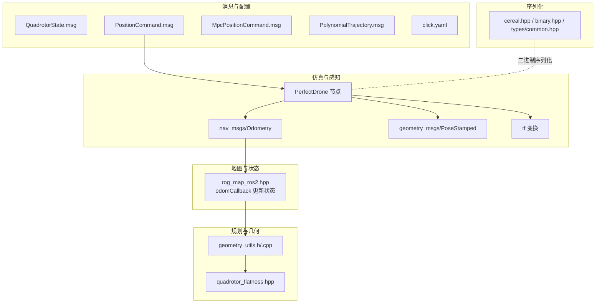
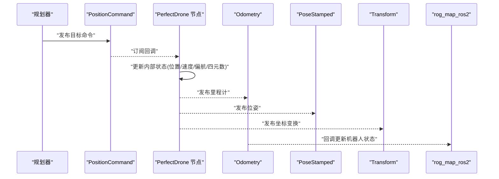
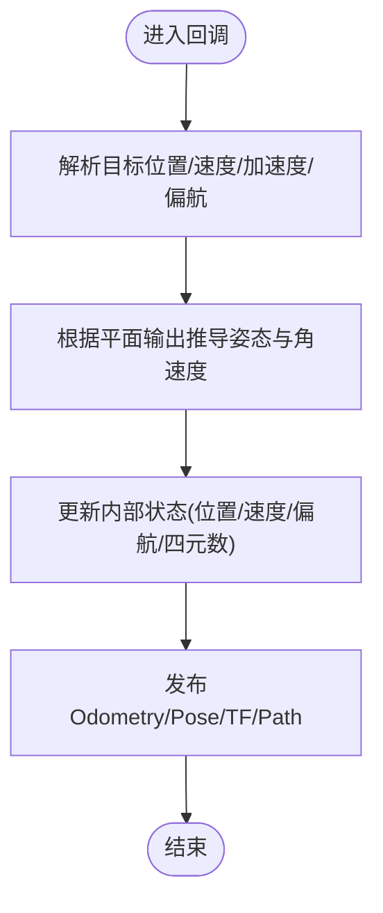
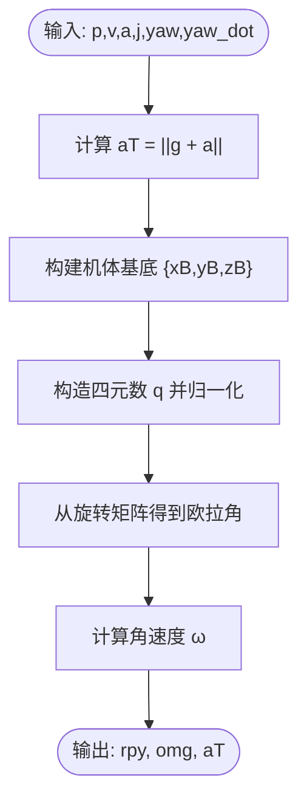
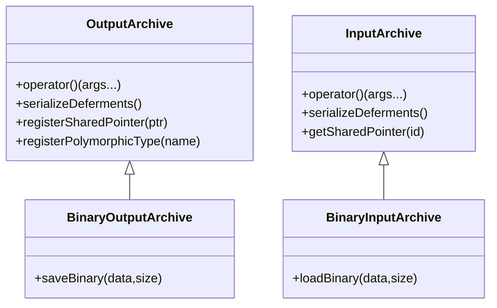
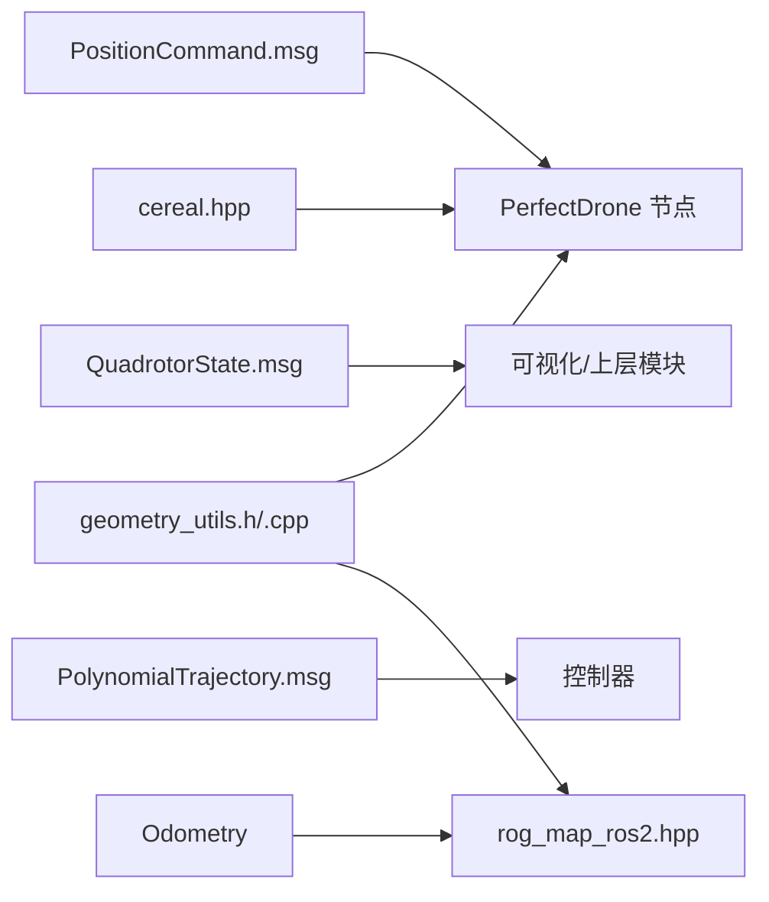

# 机器人状态数据结构

<cite>
**本文引用的文件**   
- [src/SUPER/mars_uav_sim/mars_quadrotor_msgs/ros2_msg/QuadrotorState.msg](file://src/SUPER/mars_uav_sim/mars_quadrotor_msgs/ros2_msg/QuadrotorState.msg)
- [src/SUPER/mars_uav_sim/mars_quadrotor_msgs/ros2_msg/PositionCommand.msg](file://src/SUPER/mars_uav_sim/mars_quadrotor_msgs/ros2_msg/PositionCommand.msg)
- [src/SUPER/mars_uav_sim/mars_quadrotor_msgs/ros2_msg/MpcPositionCommand.msg](file://src/SUPER/mars_uav_sim/mars_quadrotor_msgs/ros2_msg/MpcPositionCommand.msg)
- [src/SUPER/mars_uav_sim/mars_quadrotor_msgs/ros2_msg/PolynomialTrajectory.msg](file://src/SUPER/mars_uav_sim/mars_quadrotor_msgs/ros2_msg/PolynomialTrajectory.msg)
- [src/SUPER/mars_uav_sim/perfect_drone_sim/include/perfect_drone_sim/ros2_perfect_drone_model.hpp](file://src/SUPER/mars_uav_sim/perfect_drone_sim/include/perfect_drone_sim/ros2_perfect_drone_model.hpp)
- [src/SUPER/mars_uav_sim/perfect_drone_sim/perfect_drone_sim/config/click.yaml](file://src/SUPER/mars_uav_sim/perfect_drone_sim/perfect_drone_sim/config/click.yaml)
- [src/SUPER/rog_map/include/rog_map_ros/rog_map_ros2.hpp](file://src/SUPER/rog_map/include/rog_map_ros/rog_map2.hpp)
- [src/SUPER/super_planner/include/utils/geometry/geometry_utils.h](file://src/SUPER/super_planner/include/utils/geometry/geometry_utils.h)
- [src/SUPER/super_planner/src/utils/geometry_utils.cpp](file://src/SUPER/super_planner/src/utils/geometry_utils.cpp)
- [src/SUPER/super_planner/include/utils/geometry/quadrotor_flatness.hpp](file://src/SUPER/super_planner/include/utils/geometry/quadrotor_flatness.hpp)
- [src/SUPER/super_planner/include/cereal/cereal.hpp](file://src/SUPER/super_planner/include/cereal/cereal.hpp)
- [src/SUPER/super_planner/include/cereal/archives/binary.hpp](file://src/SUPER/super_planner/include/cereal/archives/binary.hpp)
- [src/SUPER/super_planner/include/cereal/types/common.hpp](file://src/SUPER/super_planner/include/cereal/types/common.hpp)
- [src/SUPER/super_planner/include/super_core/super_planner.h](file://src/SUPER/super_planner/include/super_core/super_planner.h)
</cite>

## 目录
1. [引言](#引言)
2. [项目结构](#项目结构)
3. [核心组件](#核心组件)
4. [架构总览](#架构总览)
5. [详细组件分析](#详细组件分析)
6. [依赖关系分析](#依赖关系分析)
7. [性能考虑](#性能考虑)
8. [故障排查指南](#故障排查指南)
9. [结论](#结论)
10. [附录](#附录)

## 引言
本文件围绕机器人（多旋翼无人机）状态数据结构，提供面向API与工程实践的完整说明。内容涵盖：
- 状态字段定义与数据组织：位置、速度、加速度、急动度、姿态与角速度等
- 状态更新机制：传感器数据融合、状态传播与滤波思路
- 坐标系约定与变换规则：世界坐标系、机体坐标系、欧拉角与四元数
- 模块间传递接口与消息格式：ROS2消息类型与典型发布/订阅
- 序列化与反序列化：基于cereal的二进制存档方案
- 内存布局、访问模式与性能优化建议
- 实际使用示例：创建、更新与查询机器人状态

## 项目结构
本仓库中与机器人状态直接相关的关键位置如下：
- 多旋翼消息定义：位于多旋翼仿真包的消息目录
- 完美跟踪仿真节点：接收目标命令，生成里程计与位姿消息
- 地图与SLAM模块：从里程计回调更新机器人状态
- 规划与几何工具：提供姿态/角速度转换、四元数/欧拉角互转等
- 序列化库：cereal二进制归档支持

**图表来源**
- [src/SUPER/mars_uav_sim/mars_quadrotor_msgs/ros2_msg/QuadrotorState.msg](file://src/SUPER/mars_uav_sim/mars_quadrotor_msgs/ros2_msg/QuadrotorState.msg#L1-L11)
- [src/SUPER/mars_uav_sim/mars_quadrotor_msgs/ros2_msg/PositionCommand.msg](file://src/SUPER/mars_uav_sim/mars_quadrotor_msgs/ros2_msg/PositionCommand.msg#L1-L30)
- [src/SUPER/mars_uav_sim/mars_quadrotor_msgs/ros2_msg/MpcPositionCommand.msg](file://src/SUPER/mars_uav_sim/mars_quadrotor_msgs/ros2_msg/MpcPositionCommand.msg#L1-L7)
- [src/SUPER/mars_uav_sim/mars_quadrotor_msgs/ros2_msg/PolynomialTrajectory.msg](file://src/SUPER/mars_uav_sim/mars_quadrotor_msgs/ros2_msg/PolynomialTrajectory.msg#L1-L39)
- [src/SUPER/mars_uav_sim/perfect_drone_sim/include/perfect_drone_sim/ros2_perfect_drone_model.hpp](file://src/SUPER/mars_uav_sim/perfect_drone_sim/include/perfect_drone_sim/ros2_perfect_drone_model.hpp#L180-L298)
- [src/SUPER/rog_map/include/rog_map_ros/rog_map_ros2.hpp](file://src/SUPER/rog_map/include/rog_map_ros/rog_map_ros2.hpp#L75-L97)
- [src/SUPER/super_planner/include/utils/geometry/geometry_utils.h](file://src/SUPER/super_planner/include/utils/geometry/geometry_utils.h#L282-L305)
- [src/SUPER/super_planner/src/utils/geometry_utils.cpp](file://src/SUPER/super_planner/src/utils/geometry_utils.cpp#L287-L322)
- [src/SUPER/super_planner/include/cereal/cereal.hpp](file://src/SUPER/super_planner/include/cereal/cereal.hpp#L300-L690)
- [src/SUPER/super_planner/include/cereal/archives/binary.hpp](file://src/SUPER/super_planner/include/cereal/archives/binary.hpp#L108-L169)

**章节来源**
- [src/SUPER/mars_uav_sim/mars_quadrotor_msgs/ros2_msg/QuadrotorState.msg](file://src/SUPER/mars_uav_sim/mars_quadrotor_msgs/ros2_msg/QuadrotorState.msg#L1-L11)
- [src/SUPER/mars_uav_sim/mars_quadrotor_msgs/ros2_msg/PositionCommand.msg](file://src/SUPER/mars_uav_sim/mars_quadrotor_msgs/ros2_msg/PositionCommand.msg#L1-L30)
- [src/SUPER/mars_uav_sim/mars_quadrotor_msgs/ros2_msg/MpcPositionCommand.msg](file://src/SUPER/mars_uav_sim/mars_quadrotor_msgs/ros2_msg/MpcPositionCommand.msg#L1-L7)
- [src/SUPER/mars_uav_sim/mars_quadrotor_msgs/ros2_msg/PolynomialTrajectory.msg](file://src/SUPER/mars_uav_sim/mars_quadrotor_msgs/ros2_msg/PolynomialTrajectory.msg#L1-L39)
- [src/SUPER/mars_uav_sim/perfect_drone_sim/include/perfect_drone_sim/ros2_perfect_drone_model.hpp](file://src/SUPER/mars_uav_sim/perfect_drone_sim/include/perfect_drone_sim/ros2_perfect_drone_model.hpp#L180-L298)
- [src/SUPER/mars_uav_sim/perfect_drone_sim/perfect_drone_sim/config/click.yaml](file://src/SUPER/mars_uav_sim/perfect_drone_sim/perfect_drone_sim/config/click.yaml#L1-L30)
- [src/SUPER/rog_map/include/rog_map_ros/rog_map_ros2.hpp](file://src/SUPER/rog_map/include/rog_map_ros/rog_map_ros2.hpp#L75-L97)
- [src/SUPER/super_planner/include/utils/geometry/geometry_utils.h](file://src/SUPER/super_planner/include/utils/geometry/geometry_utils.h#L282-L305)
- [src/SUPER/super_planner/src/utils/geometry_utils.cpp](file://src/SUPER/super_planner/src/utils/geometry_utils.cpp#L287-L322)
- [src/SUPER/super_planner/include/cereal/cereal.hpp](file://src/SUPER/super_planner/include/cereal/cereal.hpp#L300-L690)
- [src/SUPER/super_planner/include/cereal/archives/binary.hpp](file://src/SUPER/super_planner/include/cereal/archives/binary.hpp#L108-L169)
- [src/SUPER/super_planner/include/cereal/types/common.hpp](file://src/SUPER/super_planner/include/cereal/types/common.hpp#L35-L45)

## 核心组件
- 机器人状态消息：QuadrotorState.msg
  - 字段：推力、速度范数、加速度范数、急动度范数；位置向量、速度向量、加速度向量、急动度向量、Snap向量；姿态向量（欧拉角）、角速度向量
  - 用途：对外暴露当前飞行器状态，便于可视化与上层模块消费
- 目标命令消息：PositionCommand.msg
  - 字段：Header、目标位置/速度/加速度/急动度、目标角速度、目标姿态（欧拉角）、推力向量、偏航角与偏航角速度、速度/加速度范数、控制增益、轨迹ID与状态标志、动作标志
  - 用途：规划器下发的目标状态，仿真节点据此更新内部状态并发布里程计
- MPC命令集合：MpcPositionCommand.msg
  - 字段：Header、命令数组、MPC时域、命令标志
  - 用途：批量目标命令的打包传输
- 多项式轨迹：PolynomialTrajectory.msg
  - 字段：Header、轨迹ID、类型标志（位置/偏航/心跳/紧急停止）、分段数量、多项式阶数、起始系统墙钟时间、当前偏航/偏航速率、多项式系数与每段时间、调试信息
  - 用途：轨迹生成与回放，供控制器参考
- 仿真节点：PerfectDrone
  - 订阅PositionCommand，内部维护位置、速度、偏航与四元数，发布Odometry、Pose、TF与路径
- 地图模块：odomCallback
  - 从Odometry回调提取位置与四元数，更新内部机器人状态
- 几何工具：geometry_utils
  - 提供四元数与欧拉角互转、从平面输出推导姿态与角速度、角度归一化等
- 序列化：cereal
  - 提供二进制归档的通用框架，支持POD类型与二进制数据块

**章节来源**
- [src/SUPER/mars_uav_sim/mars_quadrotor_msgs/ros2_msg/QuadrotorState.msg](file://src/SUPER/mars_uav_sim/mars_quadrotor_msgs/ros2_msg/QuadrotorState.msg#L1-L11)
- [src/SUPER/mars_uav_sim/mars_quadrotor_msgs/ros2_msg/PositionCommand.msg](file://src/SUPER/mars_uav_sim/mars_quadrotor_msgs/ros2_msg/PositionCommand.msg#L1-L30)
- [src/SUPER/mars_uav_sim/mars_quadrotor_msgs/ros2_msg/MpcPositionCommand.msg](file://src/SUPER/mars_uav_sim/mars_quadrotor_msgs/ros2_msg/MpcPositionCommand.msg#L1-L7)
- [src/SUPER/mars_uav_sim/mars_quadrotor_msgs/ros2_msg/PolynomialTrajectory.msg](file://src/SUPER/mars_uav_sim/mars_quadrotor_msgs/ros2_msg/PolynomialTrajectory.msg#L1-L39)
- [src/SUPER/mars_uav_sim/perfect_drone_sim/include/perfect_drone_sim/ros2_perfect_drone_model.hpp](file://src/SUPER/mars_uav_sim/perfect_drone_sim/include/perfect_drone_sim/ros2_perfect_drone_model.hpp#L180-L298)
- [src/SUPER/rog_map/include/rog_map_ros/rog_map_ros2.hpp](file://src/SUPER/rog_map/include/rog_map_ros/rog_map_ros2.hpp#L75-L97)
- [src/SUPER/super_planner/include/utils/geometry/geometry_utils.h](file://src/SUPER/super_planner/include/utils/geometry/geometry_utils.h#L282-L305)
- [src/SUPER/super_planner/src/utils/geometry_utils.cpp](file://src/SUPER/super_planner/src/utils/geometry_utils.cpp#L287-L322)
- [src/SUPER/super_planner/include/cereal/cereal.hpp](file://src/SUPER/super_planner/include/cereal/cereal.hpp#L300-L690)

## 架构总览
下图展示了从目标命令到状态发布、再到下游模块消费的端到端流程。

**图表来源**
- [src/SUPER/mars_uav_sim/perfect_drone_sim/include/perfect_drone_sim/ros2_perfect_drone_model.hpp](file://src/SUPER/mars_uav_sim/perfect_drone_sim/include/perfect_drone_sim/ros2_perfect_drone_model.hpp#L180-L298)
- [src/SUPER/rog_map/include/rog_map_ros/rog_map_ros2.hpp](file://src/SUPER/rog_map/include/rog_map_ros/rog_map_ros2.hpp#L75-L97)

## 详细组件分析

### 组件A：机器人状态消息（QuadrotorState.msg）
- 字段定义
  - 标量：推力、速度范数、加速度范数、急动度范数
  - 向量：位置、速度、加速度、急动度、Snap
  - 姿态：欧拉角（roll/pitch/yaw）
  - 角速度：机体坐标系下的角速度
- 数据组织
  - 采用ROS2标准几何消息类型表达空间向量与点
  - 适合直接用于RViz可视化与上层模块消费
- 使用场景
  - 作为对外状态输出，便于监控与记录

**章节来源**
- [src/SUPER/mars_uav_sim/mars_quadrotor_msgs/ros2_msg/QuadrotorState.msg](file://src/SUPER/mars_uav_sim/mars_quadrotor_msgs/ros2_msg/QuadrotorState.msg#L1-L11)

### 组件B：目标命令消息（PositionCommand.msg）
- 字段定义
  - Header：时间戳与坐标系
  - 目标状态：位置、速度、加速度、急动度、角速度
  - 姿态：欧拉角（通常为roll/pitch/yaw）
  - 推力：三维向量
  - 偏航：偏航角与偏航角速度
  - 范数：速度/加速度范数
  - 控制增益：位置/速度增益
  - 轨迹：ID、状态标志、动作标志
- 更新机制
  - 由规划器生成并发布
  - 仿真节点订阅后驱动内部状态更新
- 传递接口
  - Topic：/planning/pos_cmd
  - QoS：可靠、保持最近若干帧

**章节来源**
- [src/SUPER/mars_uav_sim/mars_quadrotor_msgs/ros2_msg/PositionCommand.msg](file://src/SUPER/mars_uav_sim/mars_quadrotor_msgs/ros2_msg/PositionCommand.msg#L1-L30)
- [src/SUPER/mars_uav_sim/perfect_drone_sim/include/perfect_drone_sim/ros2_perfect_drone_model.hpp](file://src/SUPER/mars_uav_sim/perfect_drone_sim/include/perfect_drone_sim/ros2_perfect_drone_model.hpp#L88-L94)

### 组件C：MPC命令集合（MpcPositionCommand.msg）
- 字段定义
  - Header、命令数组、MPC时域、命令标志
- 用途
  - 批量目标命令的打包传输，便于控制器按MPC时域执行

**章节来源**
- [src/SUPER/mars_uav_sim/mars_quadrotor_msgs/ros2_msg/MpcPositionCommand.msg](file://src/SUPER/mars_uav_sim/mars_quadrotor_msgs/ros2_msg/MpcPositionCommand.msg#L1-L7)

### 组件D：多项式轨迹（PolynomialTrajectory.msg）
- 字段定义
  - Header、轨迹ID、类型标志、分段数量、多项式阶数、起始时间、当前偏航/速率、系数与每段时间、调试信息
- 用途
  - 描述位置与偏航轨迹的多项式参数，供控制器参考

**章节来源**
- [src/SUPER/mars_uav_sim/mars_quadrotor_msgs/ros2_msg/PolynomialTrajectory.msg](file://src/SUPER/mars_uav_sim/mars_quadrotor_msgs/ros2_msg/PolynomialTrajectory.msg#L1-L39)

### 组件E：仿真节点（PerfectDrone）的状态更新
- 订阅目标命令，解析目标位置、速度、加速度与偏航
- 通过“平面输出”关系推导姿态与角速度
- 维护内部状态：位置、速度、偏航、四元数
- 发布：Odometry、Pose、Transform、Mesh Marker、Path

**图表来源**
- [src/SUPER/mars_uav_sim/perfect_drone_sim/include/perfect_drone_sim/ros2_perfect_drone_model.hpp](file://src/SUPER/mars_uav_sim/perfect_drone_sim/include/perfect_drone_sim/ros2_perfect_drone_model.hpp#L180-L298)

**章节来源**
- [src/SUPER/mars_uav_sim/perfect_drone_sim/include/perfect_drone_sim/ros2_perfect_drone_model.hpp](file://src/SUPER/mars_uav_sim/perfect_drone_sim/include/perfect_drone_sim/ros2_perfect_drone_model.hpp#L180-L298)

### 组件F：地图模块的状态更新（odomCallback）
- 从Odometry回调中提取位置与四元数
- 更新内部机器人状态并发布TF

**章节来源**
- [src/SUPER/rog_map/include/rog_map_ros/rog_map_ros2.hpp](file://src/SUPER/rog_map/include/rog_map_ros/rog_map_ros2.hpp#L75-L97)

### 组件G：几何工具（姿态/角速度转换与四元数/欧拉角互转）
- 从平面输出推导姿态与角速度
- 四元数与欧拉角互转
- 角度归一化与加法

**图表来源**
- [src/SUPER/super_planner/src/utils/geometry_utils.cpp](file://src/SUPER/super_planner/src/utils/geometry_utils.cpp#L287-L322)

**章节来源**
- [src/SUPER/super_planner/src/utils/geometry_utils.cpp](file://src/SUPER/super_planner/src/utils/geometry_utils.cpp#L287-L322)
- [src/SUPER/super_planner/include/utils/geometry/geometry_utils.h](file://src/SUPER/super_planner/include/utils/geometry/geometry_utils.h#L282-L305)

### 组件H：序列化与反序列化（cereal）
- 二进制归档
  - 支持POD类型与二进制数据块
  - 通过二进制接口高效写入/读取
- 典型用法
  - 将状态对象或轨迹数据以二进制形式持久化/网络传输
  - 与上层模块共享复杂数据结构

**图表来源**
- [src/SUPER/super_planner/include/cereal/cereal.hpp](file://src/SUPER/super_planner/include/cereal/cereal.hpp#L300-L690)
- [src/SUPER/super_planner/include/cereal/archives/binary.hpp](file://src/SUPER/super_planner/include/cereal/archives/binary.hpp#L108-L169)

**章节来源**
- [src/SUPER/super_planner/include/cereal/cereal.hpp](file://src/SUPER/super_planner/include/cereal/cereal.hpp#L300-L690)
- [src/SUPER/super_planner/include/cereal/archives/binary.hpp](file://src/SUPER/super_planner/include/cereal/archives/binary.hpp#L108-L169)
- [src/SUPER/super_planner/include/cereal/types/common.hpp](file://src/SUPER/super_planner/include/cereal/types/common.hpp#L35-L45)

## 依赖关系分析
- 消息依赖
  - PositionCommand 依赖 geometry_msgs/Point、Vector3、std_msgs/Header
  - QuadrotorState 依赖 geometry_msgs/Point、Vector3、std_msgs/Header
  - PolynomialTrajectory 依赖 std_msgs/Header、字符串
- 运行时依赖
  - PerfectDrone 订阅 PositionCommand，发布 Odometry/Pose/TF/Path
  - 地图模块从 Odometry 回调更新状态
  - 几何工具被规划与仿真模块共同使用
- 序列化依赖
  - cereal 提供二进制归档能力，适用于状态与轨迹数据的持久化

**图表来源**
- [src/SUPER/mars_uav_sim/mars_quadrotor_msgs/ros2_msg/PositionCommand.msg](file://src/SUPER/mars_uav_sim/mars_quadrotor_msgs/ros2_msg/PositionCommand.msg#L1-L30)
- [src/SUPER/mars_uav_sim/mars_quadrotor_msgs/ros2_msg/QuadrotorState.msg](file://src/SUPER/mars_uav_sim/mars_quadrotor_msgs/ros2_msg/QuadrotorState.msg#L1-L11)
- [src/SUPER/mars_uav_sim/mars_quadrotor_msgs/ros2_msg/PolynomialTrajectory.msg](file://src/SUPER/mars_uav_sim/mars_quadrotor_msgs/ros2_msg/PolynomialTrajectory.msg#L1-L39)
- [src/SUPER/mars_uav_sim/perfect_drone_sim/include/perfect_drone_sim/ros2_perfect_drone_model.hpp](file://src/SUPER/mars_uav_sim/perfect_drone_sim/include/perfect_drone_sim/ros2_perfect_drone_model.hpp#L180-L298)
- [src/SUPER/rog_map/include/rog_map_ros/rog_map_ros2.hpp](file://src/SUPER/rog_map/include/rog_map_ros/rog_map_ros2.hpp#L75-L97)
- [src/SUPER/super_planner/src/utils/geometry_utils.cpp](file://src/SUPER/super_planner/src/utils/geometry_utils.cpp#L287-L322)
- [src/SUPER/super_planner/include/cereal/cereal.hpp](file://src/SUPER/super_planner/include/cereal/cereal.hpp#L300-L690)

**章节来源**
- [src/SUPER/mars_uav_sim/mars_quadrotor_msgs/ros2_msg/PositionCommand.msg](file://src/SUPER/mars_uav_sim/mars_quadrotor_msgs/ros2_msg/PositionCommand.msg#L1-L30)
- [src/SUPER/mars_uav_sim/mars_quadrotor_msgs/ros2_msg/QuadrotorState.msg](file://src/SUPER/mars_uav_sim/mars_quadrotor_msgs/ros2_msg/QuadrotorState.msg#L1-L11)
- [src/SUPER/mars_uav_sim/mars_quadrotor_msgs/ros2_msg/PolynomialTrajectory.msg](file://src/SUPER/mars_uav_sim/mars_quadrotor_msgs/ros2_msg/PolynomialTrajectory.msg#L1-L39)
- [src/SUPER/mars_uav_sim/perfect_drone_sim/include/perfect_drone_sim/ros2_perfect_drone_model.hpp](file://src/SUPER/mars_uav_sim/perfect_drone_sim/include/perfect_drone_sim/ros2_perfect_drone_model.hpp#L180-L298)
- [src/SUPER/rog_map/include/rog_map_ros/rog_map_ros2.hpp](file://src/SUPER/rog_map/include/rog_map_ros/rog_map_ros2.hpp#L75-L97)
- [src/SUPER/super_planner/src/utils/geometry_utils.cpp](file://src/SUPER/super_planner/src/utils/geometry_utils.cpp#L287-L322)
- [src/SUPER/super_planner/include/cereal/cereal.hpp](file://src/SUPER/super_planner/include/cereal/cereal.hpp#L300-L690)

## 性能考虑
- 消息发布频率
  - 仿真节点按定时器周期发布Odometry/Pose/TF，可根据需求调整
- 点云处理
  - 本地点云发布前进行体素下采样，降低带宽与CPU开销
- 数值稳定性
  - 四元数归一化与角度归一化，避免累积误差导致的姿态异常
- 序列化效率
  - 使用cereal二进制归档，对POD类型与连续内存块进行高效读写
- 内存布局
  - 使用Eigen模板类型，尽量保持列主存储以提升缓存局部性

[本节为通用指导，不直接分析具体文件]

## 故障排查指南
- 姿态异常或抖动
  - 检查四元数是否归一化、角度是否正确归一化
  - 确认从平面输出推导姿态与角速度的流程
- 里程计延迟或丢帧
  - 检查QoS设置与回调组配置
  - 关注点云下采样参数与发布周期
- TF发布失败
  - 确认frame_id与child_frame_id一致且与下游模块约定一致

**章节来源**
- [src/SUPER/super_planner/src/utils/geometry_utils.cpp](file://src/SUPER/super_planner/src/utils/geometry_utils.cpp#L287-L322)
- [src/SUPER/mars_uav_sim/perfect_drone_sim/include/perfect_drone_sim/ros2_perfect_drone_model.hpp](file://src/SUPER/mars_uav_sim/perfect_drone_sim/include/perfect_drone_sim/ros2_perfect_drone_model.hpp#L125-L145)
- [src/SUPER/rog_map/include/rog_map_ros/rog_map_ros2.hpp](file://src/SUPER/rog_map/include/rog_map_ros/rog_map_ros2.hpp#L85-L97)

## 结论
本文件梳理了多旋翼机器人状态数据结构与其在系统中的组织方式与流转路径。通过明确的消息定义、仿真节点的状态更新逻辑、几何工具的姿态/角速度转换以及cereal的二进制序列化能力，可以形成一套从规划到仿真再到可视化的闭环。建议在工程实践中：
- 明确坐标系约定并在模块间统一
- 对关键数值进行归一化与边界检查
- 利用二进制序列化提高数据交换效率
- 通过合理的QoS与回调组配置保证实时性

[本节为总结，不直接分析具体文件]

## 附录

### 坐标系约定与变换规则
- 世界坐标系（world）：位置与全局位姿
- 机体坐标系（drone/ego）：角速度与加速度在机体坐标系下表达
- 欧拉角与四元数：提供互转工具，注意角度范围与归一化
- TF变换：从Odometry派生，供RViz与下游模块使用

**章节来源**
- [src/SUPER/rog_map/include/rog_map_ros/rog_map_ros2.hpp](file://src/SUPER/rog_map/include/rog_map_ros/rog_map_ros2.hpp#L85-L97)
- [src/SUPER/super_planner/src/utils/geometry_utils.cpp](file://src/SUPER/super_planner/src/utils/geometry_utils.cpp#L817-L860)

### 状态更新机制与滤波思路
- 传感器数据融合：本仓库未直接实现多传感器融合算法，建议在上层模块引入扩展
- 状态传播：仿真节点依据目标命令进行确定性传播
- 滤波算法：可结合几何工具提供的姿态/角速度转换，设计互补/扩展卡尔曼滤波

**章节来源**
- [src/SUPER/mars_uav_sim/perfect_drone_sim/include/perfect_drone_sim/ros2_perfect_drone_model.hpp](file://src/SUPER/mars_uav_sim/perfect_drone_sim/include/perfect_drone_sim/ros2_perfect_drone_model.hpp#L282-L297)
- [src/SUPER/super_planner/src/utils/geometry_utils.cpp](file://src/SUPER/super_planner/src/utils/geometry_utils.cpp#L287-L322)

### 模块间传递接口与数据格式
- 主要Topic
  - /planning/pos_cmd：PositionCommand
  - /lidar_slam/odom：Odometry
  - /lidar_slam/pose：PoseStamped
  - robot、path、/cloud_registered、/global_pc：Marker、Path、PointCloud2
- Header字段：包含时间戳与frame_id，确保跨模块一致性

**章节来源**
- [src/SUPER/mars_uav_sim/perfect_drone_sim/include/perfect_drone_sim/ros2_perfect_drone_model.hpp](file://src/SUPER/mars_uav_sim/perfect_drone_sim/include/perfect_drone_sim/ros2_perfect_drone_model.hpp#L88-L112)
- [src/SUPER/mars_uav_sim/mars_quadrotor_msgs/ros2_msg/PositionCommand.msg](file://src/SUPER/mars_uav_sim/mars_quadrotor_msgs/ros2_msg/PositionCommand.msg#L1-L30)

### 序列化与反序列化方法
- 使用cereal二进制归档，支持POD类型与二进制数据块
- 适用于状态对象、轨迹参数等的高效持久化与传输

**章节来源**
- [src/SUPER/super_planner/include/cereal/archives/binary.hpp](file://src/SUPER/super_planner/include/cereal/archives/binary.hpp#L108-L169)
- [src/SUPER/super_planner/include/cereal/types/common.hpp](file://src/SUPER/super_planner/include/cereal/types/common.hpp#L35-L45)

### 实际使用示例（步骤说明）
- 创建状态
  - 通过Odometry/PoseStamped回调提取位置与姿态
  - 使用几何工具进行欧拉角/四元数互转
- 更新状态
  - 订阅PositionCommand，解析目标状态
  - 依据平面输出推导姿态与角速度，更新内部状态
- 查询状态
  - 从Odometry中读取位置、速度、姿态
  - 从TF中获取坐标变换关系

**章节来源**
- [src/SUPER/rog_map/include/rog_map_ros/rog_map_ros2.hpp](file://src/SUPER/rog_map/include/rog_map_ros/rog_map_ros2.hpp#L75-L97)
- [src/SUPER/mars_uav_sim/perfect_drone_sim/include/perfect_drone_sim/ros2_perfect_drone_model.hpp](file://src/SUPER/mars_uav_sim/perfect_drone_sim/include/perfect_drone_sim/ros2_perfect_drone_model.hpp#L180-L298)
- [src/SUPER/super_planner/src/utils/geometry_utils.cpp](file://src/SUPER/super_planner/src/utils/geometry_utils.cpp#L817-L860)