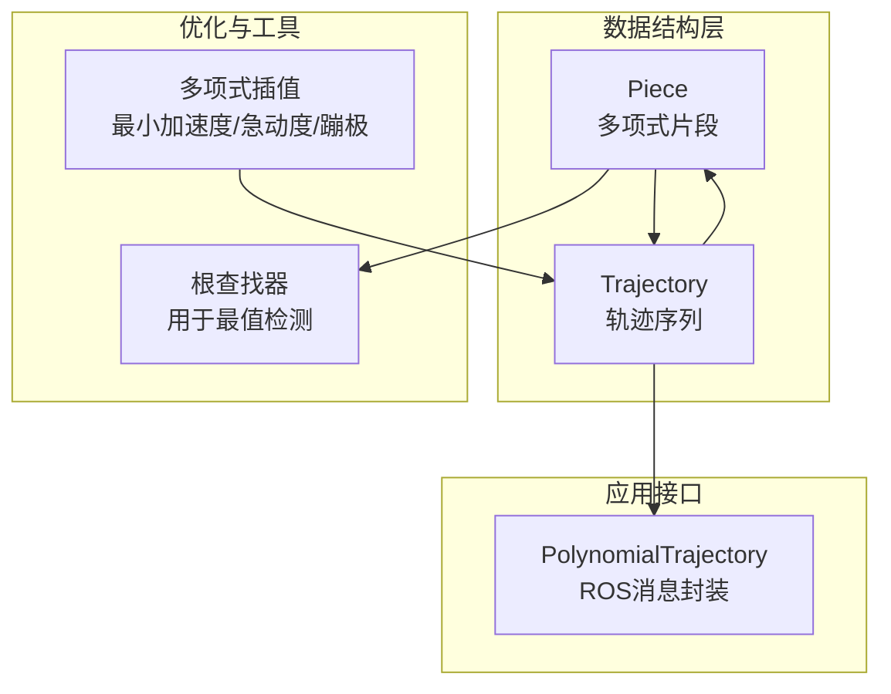
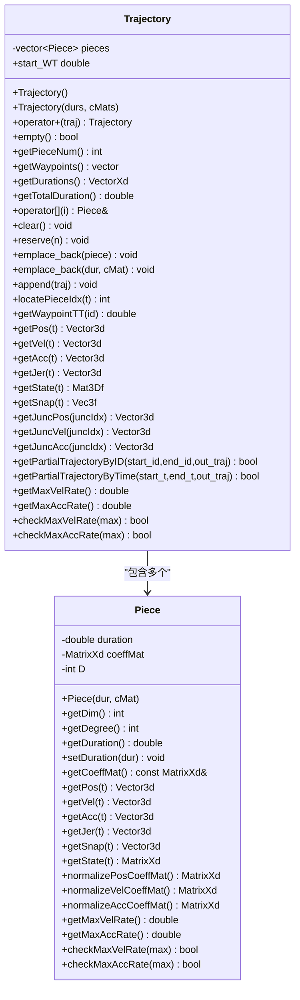
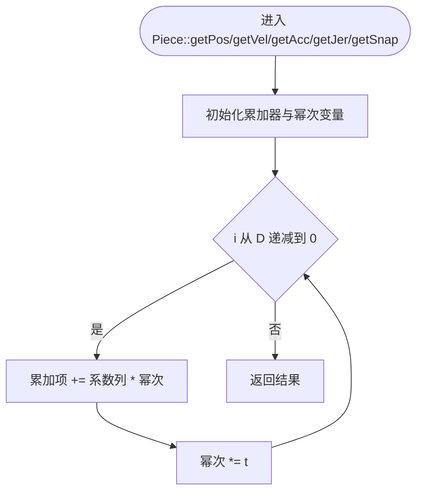
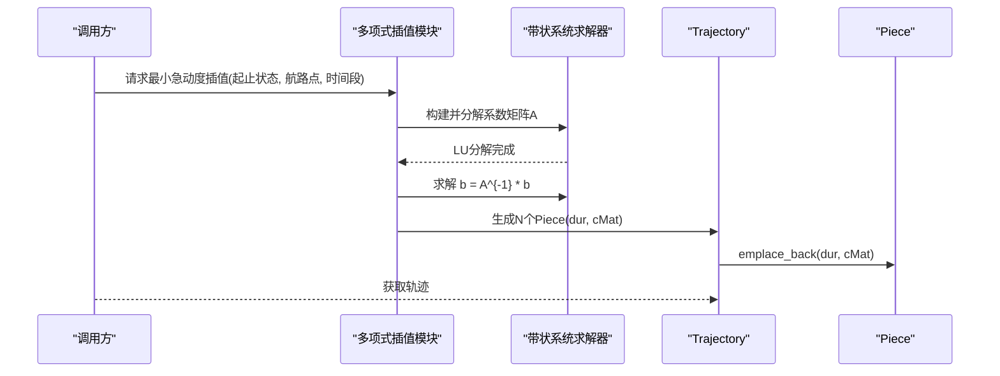
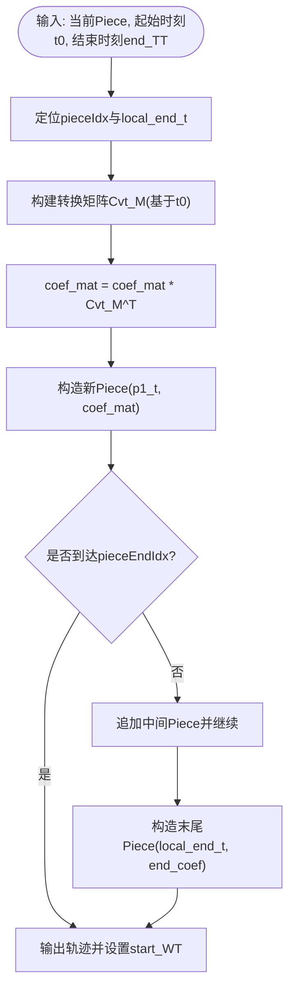
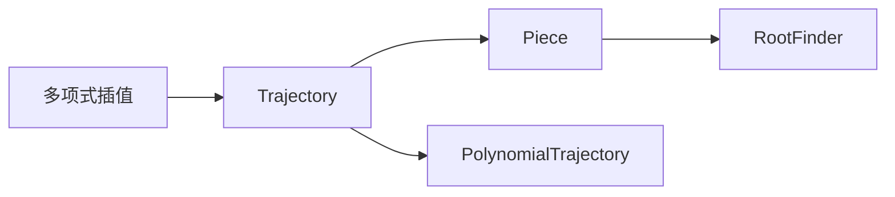

# 路径片段数据结构

<cite>
**本文引用的文件列表**
- [piece.h](file://src/SUPER/super_planner/include/data_structure/base/piece.h)
- [piece.cpp](file://src/SUPER/super_planner/src/utils/piece.cpp)
- [trajectory.h](file://src/SUPER/super_planner/include/data_structure/base/trajectory.h)
- [trajectory.cpp](file://src/SUPER/super_planner/src/utils/trajectory.cpp)
- [polynomial_interpolation.h](file://src/SUPER/super_planner/include/utils/optimization/polynomial_interpolation.h)
- [root_finder.h](file://src/SUPER/super_planner/include/utils/optimization/root_finder.h)
</cite>

## 目录
1. [简介](#简介)
2. [项目结构与定位](#项目结构与定位)
3. [核心组件总览](#核心组件总览)
4. [架构概览](#架构概览)
5. [详细组件分析](#详细组件分析)
6. [依赖关系分析](#依赖关系分析)
7. [性能特性与数值稳定性](#性能特性与数值稳定性)
8. [故障排查指南](#故障排查指南)
9. [结论](#结论)
10. [附录：使用示例与最佳实践](#附录使用示例与最佳实践)

## 简介
本文件面向“路径片段数据结构（Piece）”的API文档与设计解析，系统阐述多项式系数矩阵的存储格式、时间区间管理、连续性约束、状态计算（位置/速度/加速度/急动度/蹦极）方法、构造函数参数语义、插值与切分算法、数值稳定性保障、以及与轨迹（Trajectory）的连接规则与边界条件处理。同时给出数学基础、性能特征与典型使用场景，并通过代码路径指引帮助读者快速定位实现细节。

## 项目结构与定位
- Piece 是轨迹的基本组成单元，采用统一的多项式参数化表达，支持不同阶数（如5阶、6阶、7阶等）以满足不同的平滑与约束需求。
- Trajectory 将多个 Piece 按时间顺序拼接，提供整体状态查询、部分轨迹提取、边界点查询等功能。
- 多项式插值模块提供最小加速度、最小急动度、最小蹦极等优化策略，生成满足边界条件的系数矩阵并构造 Piece/Trajectory。

图表来源
- [piece.h](file://src/SUPER/super_planner/include/data_structure/base/piece.h#L69-L131)
- [trajectory.h](file://src/SUPER/super_planner/include/data_structure/base/trajectory.h#L56-L173)
- [polynomial_interpolation.h](file://src/SUPER/super_planner/include/utils/optimization/polynomial_interpolation.h#L31-L361)
- [root_finder.h](file://src/SUPER/super_planner/include/utils/optimization/root_finder.h)

章节来源
- [piece.h](file://src/SUPER/super_planner/include/data_structure/base/piece.h#L69-L131)
- [trajectory.h](file://src/SUPER/super_planner/include/data_structure/base/trajectory.h#L56-L173)

## 核心组件总览
- Piece
  - 存储：持续时间 duration、多项式系数矩阵 coeffMat、多项式次数 D
  - 计算：getPos/getVel/getAcc/getJer/getSnap，getState，最值检测与约束检查
  - 归一化：normalizePosCoeffMat/normalizeVelCoeffMat/normalizeAccCoeffMat
- Trajectory
  - 组织：按 Piece 序列存储，提供索引、拼接、切分、边界点查询、整体状态查询
  - 边界：通过 Piece 的系数列直接映射到位置/速度/加速度边界值

章节来源
- [piece.h](file://src/SUPER/super_planner/include/data_structure/base/piece.h#L84-L131)
- [piece.cpp](file://src/SUPER/super_planner/src/utils/piece.cpp#L31-L286)
- [trajectory.h](file://src/SUPER/super_planner/include/data_structure/base/trajectory.h#L56-L173)
- [trajectory.cpp](file://src/SUPER/super_planner/src/utils/trajectory.cpp#L40-L194)

## 架构概览
Piece 作为基本单元，提供多项式求值与求导能力；Trajectory 以 Piece 为元素进行组合，负责时间定位、边界点访问与部分轨迹切分；多项式插值模块负责从边界条件生成系数矩阵，形成 Piece/Trajectory。

图表来源
- [piece.h](file://src/SUPER/super_planner/include/data_structure/base/piece.h#L69-L131)
- [trajectory.h](file://src/SUPER/super_planner/include/data_structure/base/trajectory.h#L56-L173)

## 详细组件分析

### 数据结构与存储格式
- 系数矩阵组织
  - 矩阵形状：3 行 × (D+1) 列，分别对应 x/y/z 三个维度与 D+1 个多项式系数（从常数项到 t^D）
  - 列索引：第 i 列表示 t^i 的系数向量（i=0..D），即 coeffMat.col(i) 对应 t^i 的系数
  - 多项式形式：对任一维度，位置多项式为 Σ_{i=0}^{D} coeffMat(:,i) · t^i
- 持续时间
  - duration 表示该片段的时间跨度，t ∈ [0, duration]
- 多项式次数
  - D 由系数矩阵列数减一确定，常见 D=5/6/7 等

章节来源
- [piece.h](file://src/SUPER/super_planner/include/data_structure/base/piece.h#L84-L104)
- [piece.cpp](file://src/SUPER/super_planner/src/utils/piece.cpp#L51-L59)

### 时间区间管理与边界条件
- 时间定位
  - Trajectory::locatePieceIdx 将全局时间 t 映射到具体 Piece 的索引
- 边界点访问
  - 位置边界：Piece::getCoeffMat().col(D) 即 t^D 的系数，对应 t=duration 处的位置
  - 速度边界：t=duration 处的速度由系数矩阵的 D 阶导（含 D·(D-1) 系数）决定
  - 加速度边界：t=duration 处的加速度由系数矩阵的 D 阶导（含 D·(D-1)·(D-2) 系数）决定
- 连续性约束
  - Trajectory 在相邻 Piece 的连接处，通过共享边界点（位置、速度、加速度）实现 C^1 或更高阶连续性（取决于优化策略）

章节来源
- [trajectory.cpp](file://src/SUPER/super_planner/src/utils/trajectory.cpp#L172-L194)
- [trajectory.h](file://src/SUPER/super_planner/include/data_structure/base/trajectory.h#L154-L158)

### 状态计算：多项式求导与求值
- 位置/速度/加速度/急动度/蹦极
  - getPos/getVel/getAcc/getJer/getSnap 分别返回对应阶导在 t 的值
  - 实现采用 Horner 法逐项累加，避免显式幂运算，提升数值稳定性和效率
- 状态矩阵
  - getState(t) 返回 3×4 矩阵，包含 [pos, vel, acc, jer]^T

图表来源
- [piece.cpp](file://src/SUPER/super_planner/src/utils/piece.cpp#L51-L119)

章节来源
- [piece.cpp](file://src/SUPER/super_planner/src/utils/piece.cpp#L51-L119)

### 构造函数与参数语义
- 构造函数
  - Piece(dur, cMat)：设置持续时间与系数矩阵，并推导多项式次数 D=cMat.cols()-1
- 参数含义
  - dur：片段持续时间（秒）
  - cMat：3×(D+1) 系数矩阵，列对应 t^0..t^D 的系数

章节来源
- [piece.h](file://src/SUPER/super_planner/include/data_structure/base/piece.h#L93-L94)
- [piece.cpp](file://src/SUPER/super_planner/src/utils/piece.cpp#L35-L37)

### 插值算法与数值稳定性
- 插值策略
  - 最小加速度（minimumAccInterpolation）
  - 最小急动度（minimumSnapInterpolation）
  - 最小蹦极（minimumJerkInterpolation）
- 数值稳定性保障
  - 使用带状线性系统求解器（BandedSystem）进行稀疏矩阵 LU 分解与求解
  - 对系数矩阵进行归一化（normalizePos/Vel/Acc）后，再进行多项式平方和与求导，以降低病态性
  - 使用 RootFinder::solvePolynomial 求导后的零点集合，并在 [0,1] 区间内评估最值，避免外推误差

图表来源
- [polynomial_interpolation.h](file://src/SUPER/super_planner/include/utils/optimization/polynomial_interpolation.h#L105-L252)
- [trajectory.cpp](file://src/SUPER/super_planner/src/utils/trajectory.cpp#L90-L94)

章节来源
- [polynomial_interpolation.h](file://src/SUPER/super_planner/include/utils/optimization/polynomial_interpolation.h#L31-L361)
- [piece.cpp](file://src/SUPER/super_planner/src/utils/piece.cpp#L158-L245)

### 片段连接规则与边界条件处理
- 连接规则
  - Trajectory 在相邻 Piece 的连接处共享端点状态（位置、速度、加速度），确保 C^1 连续
- 边界条件
  - 位置边界：直接取系数矩阵的最高次项系数
  - 速度/加速度边界：通过系数矩阵的高阶导数在 t=duration 处求值
- 部分轨迹切分
  - 支持按 ID 或时间范围切分，内部使用转换矩阵将当前 Piece 在起始时刻 t0 处重参数化，生成新的 Piece

图表来源
- [trajectory.cpp](file://src/SUPER/super_planner/src/utils/trajectory.cpp#L213-L353)

章节来源
- [trajectory.cpp](file://src/SUPER/super_planner/src/utils/trajectory.cpp#L196-L353)

## 依赖关系分析
- 内部依赖
  - Piece 依赖 RootFinder 用于最值检测与零点求解
  - Trajectory 依赖 Piece 提供状态查询与边界点访问
  - 多项式插值模块依赖 BandedSystem 与 Eigen 线性代数库
- 外部接口
  - ROS 消息封装：PolynomialTrajectory，将 Trajectory 的 piece_num/order/time/coef 字段序列化传输

图表来源
- [polynomial_interpolation.h](file://src/SUPER/super_planner/include/utils/optimization/polynomial_interpolation.h#L26-L27)
- [trajectory.h](file://src/SUPER/super_planner/include/data_structure/base/trajectory.h#L51-L52)
- [root_finder.h](file://src/SUPER/super_planner/include/utils/optimization/root_finder.h)

章节来源
- [piece.h](file://src/SUPER/super_planner/include/data_structure/base/piece.h#L50-L51)
- [trajectory.h](file://src/SUPER/super_planner/include/data_structure/base/trajectory.h#L51-L52)

## 性能特性与数值稳定性
- 复杂度
  - 单次状态查询（getPos/getVel/getAcc/getJer/getSnap）为 O(D)，D 通常为 5/6/7
  - 最值检测（getMaxVelRate/getMaxAccRate）涉及多项式平方和与求导，复杂度近似 O(D^2)
- 数值稳定性
  - 使用归一化系数矩阵（normalizePos/Vel/Acc）降低病态性
  - RootFinder 基于带状系统与多项式求导，避免直接求解高次方程的不稳定
  - 插值模块采用 LU 分解与带状结构，提高求解效率与稳定性

章节来源
- [piece.cpp](file://src/SUPER/super_planner/src/utils/piece.cpp#L122-L156)
- [piece.cpp](file://src/SUPER/super_planner/src/utils/piece.cpp#L158-L245)
- [polynomial_interpolation.h](file://src/SUPER/super_planner/include/utils/optimization/polynomial_interpolation.h#L44-L87)

## 故障排查指南
- 常见问题
  - getPos/getVel/getAcc/getJer/getSnap 返回异常：检查 t 是否在 [0, duration] 范围内
  - 最值检测失败：确认 RootFinder::solvePolynomial 输入区间与精度参数合理
  - 连续性不满足：检查相邻 Piece 的边界点是否一致（位置/速度/加速度）
- 排查步骤
  - 打印 Piece 的系数矩阵与 D 值，核对多项式次数
  - 使用 getState(t) 输出 [pos, vel, acc, jer] 核对连续性
  - 对轨迹调用 getPartialTrajectoryByTime 进行局部验证

章节来源
- [piece.cpp](file://src/SUPER/super_planner/src/utils/piece.cpp#L247-L285)
- [trajectory.cpp](file://src/SUPER/super_planner/src/utils/trajectory.cpp#L213-L254)

## 结论
Piece 以统一的多项式参数化提供了高效、稳定的轨迹片段表示，结合 Trajectory 的时间管理与边界点访问，能够满足多约束场景下的轨迹规划与执行需求。多项式插值模块进一步保证了从边界条件到系数矩阵的数值稳健生成。通过合理的归一化与根查找策略，Piece 在工程实践中具备良好的可维护性与扩展性。

## 附录：使用示例与最佳实践
- 创建与操作
  - 通过多项式插值模块生成 Trajectory，内部自动构造多个 Piece
  - 使用 Trajectory::emplace_back(dur, cMat) 直接添加自定义 Piece
  - 使用 Trajectory::getPartialTrajectoryByTime 进行局部切分
- 验证与监控
  - 使用 getState(t) 获取状态矩阵，核对连续性
  - 使用 getMaxVelRate/getMaxAccRate 检查速度/加速度上限
  - 使用 checkMaxVelRate/checkMaxAccRate 快速判断约束是否满足

章节来源
- [polynomial_interpolation.h](file://src/SUPER/super_planner/include/utils/optimization/polynomial_interpolation.h#L90-L102)
- [trajectory.cpp](file://src/SUPER/super_planner/src/utils/trajectory.cpp#L90-L94)
- [trajectory.cpp](file://src/SUPER/super_planner/src/utils/trajectory.cpp#L213-L254)
- [piece.cpp](file://src/SUPER/super_planner/src/utils/piece.cpp#L254-L285)