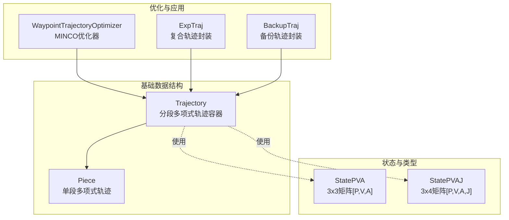
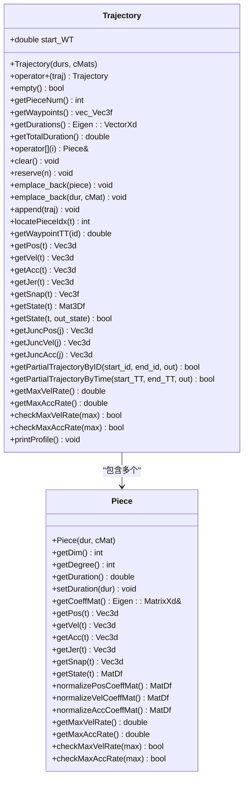
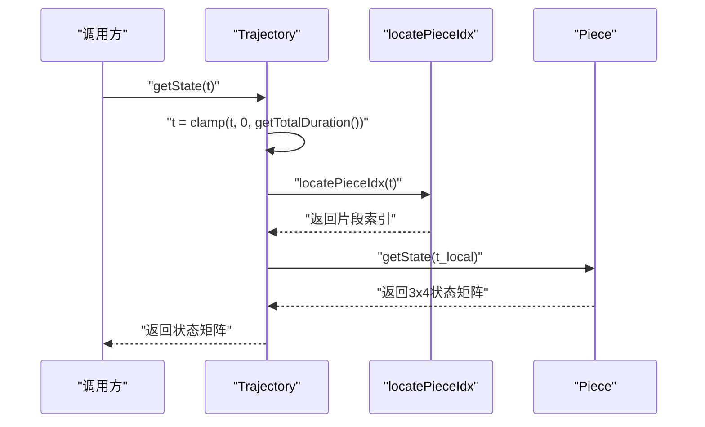
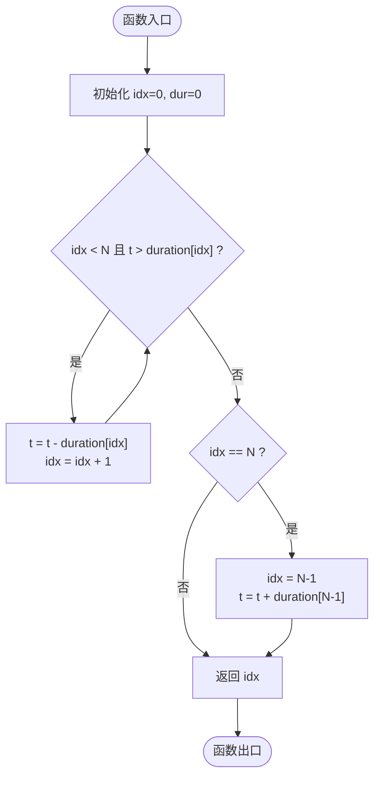
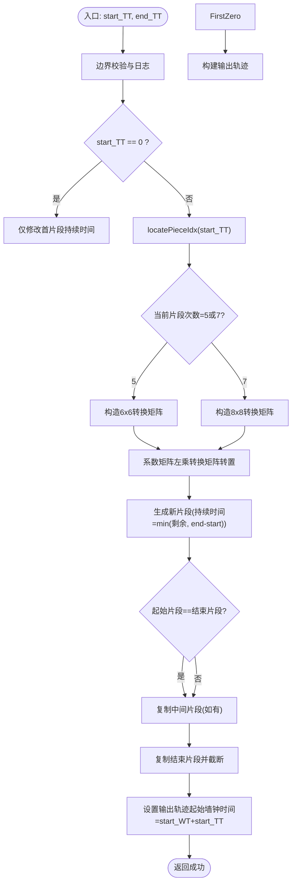
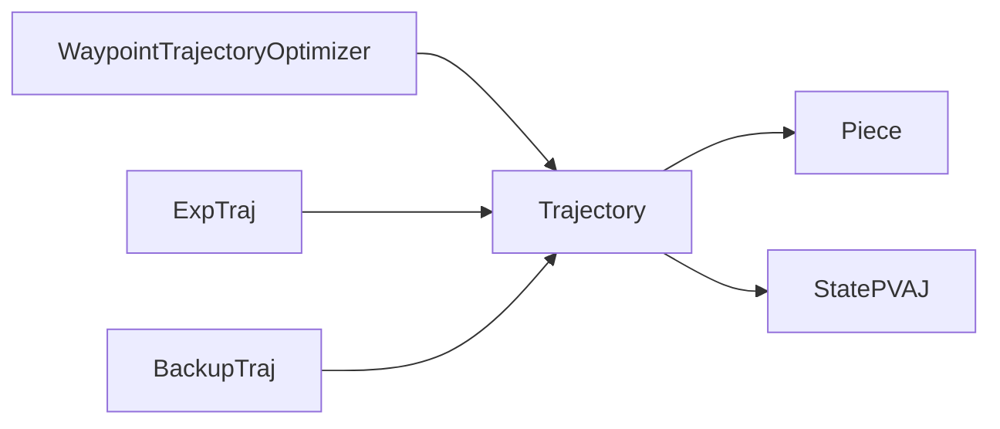

# 轨迹数据结构

<cite>
**本文引用的文件**   
- [trajectory.h](file://src/SUPER/super_planner/include/data_structure/base/trajectory.h)
- [trajectory.cpp](file://src/SUPER/super_planner/src/utils/trajectory.cpp)
- [piece.h](file://src/SUPER/super_planner/include/data_structure/base/piece.h)
- [piece.cpp](file://src/SUPER/super_planner/src/utils/piece.cpp)
- [waypoint_trajectory_optimizer.h](file://src/SUPER/super_planner/include/utils/optimization/waypoint_trajectory_optimizer.h)
- [type_utils.hpp](file://src/SUPER/super_planner/include/utils/header/type_utils.hpp)
- [eigen_alias.hpp](file://src/SUPER/super_planner/include/utils/header/eigen_alias.hpp)
- [exp_traj.h](file://src/SUPER/super_planner/include/data_structure/exp_traj.h)
- [backup_traj.h](file://src/SUPER/super_planner/include/data_structure/backup_traj.h)
</cite>

## 目录
1. [引言](#引言)
2. [项目结构](#项目结构)
3. [核心组件](#核心组件)
4. [架构总览](#架构总览)
5. [详细组件分析](#详细组件分析)
6. [依赖关系分析](#依赖关系分析)
7. [性能考量](#性能考量)
8. [故障排查指南](#故障排查指南)
9. [结论](#结论)
10. [附录：API参考与示例路径](#附录api参考与示例路径)

## 引言
本文件面向轨迹数据结构（Trajectory）的使用者与维护者，系统性阐述其设计理念、数据组织方式、状态查询接口、分段拼接与部分提取机制、定位算法 locatePieceIdx 的工作原理与复杂度、序列化与性能优化策略，并给出内存布局、访问模式与最佳实践建议。文中所有技术细节均基于仓库源码进行归纳与提炼。

## 项目结构
围绕轨迹的核心代码位于以下模块：
- 基础数据结构：Trajectory 与 Piece
- 状态容器与别名：StatePVA、StatePVAJ 等
- 优化器：Waypoint Trajectory Optimizer（MINCO）
- 高级轨迹封装：ExpTraj、BackupTraj（对 Trajectory 的组合与扩展）

**图表来源**
- [trajectory.h](file://src/SUPER/super_planner/include/data_structure/base/trajectory.h#L56-L173)
- [piece.h](file://src/SUPER/super_planner/include/data_structure/base/piece.h#L69-L131)
- [type_utils.hpp](file://src/SUPER/super_planner/include/utils/header/type_utils.hpp#L149-L150)
- [waypoint_trajectory_optimizer.h](file://src/SUPER/super_planner/include/utils/optimization/waypoint_trajectory_optimizer.h#L124-L211)
- [exp_traj.h](file://src/SUPER/super_planner/include/data_structure/exp_traj.h#L83-L159)
- [backup_traj.h](file://src/SUPER/super_planner/include/data_structure/backup_traj.h#L103-L152)

**章节来源**
- [trajectory.h](file://src/SUPER/super_planner/include/data_structure/base/trajectory.h#L56-L173)
- [piece.h](file://src/SUPER/super_planner/include/data_structure/base/piece.h#L69-L131)
- [type_utils.hpp](file://src/SUPER/super_planner/include/utils/header/type_utils.hpp#L149-L150)
- [waypoint_trajectory_optimizer.h](file://src/SUPER/super_planner/include/utils/optimization/waypoint_trajectory_optimizer.h#L124-L211)
- [exp_traj.h](file://src/SUPER/super_planner/include/data_structure/exp_traj.h#L83-L159)
- [backup_traj.h](file://src/SUPER/super_planner/include/data_structure/backup_traj.h#L103-L152)

## 核心组件
- Trajectory：由多个 Piece 组成的分段多项式轨迹容器，支持按片段索引、按时间定位、状态查询、部分提取、拼接等操作；内置起始墙钟时间字段用于时序映射。
- Piece：单段多项式轨迹，支持位置/速度/加速度/冲击/加冲击（Snap/Jerk）计算，支持系数矩阵归一化与速率上限检测。
- 状态容器：StatePVA（3x3）、StatePVAJ（3x4），分别承载位置、速度、加速度或位置、速度、加速度、冲击的并列表达。
- 优化器：WaypointTrajectoryOptimizer 提供基于 MINCO 的轨迹优化流程，输入 Trajectory 并输出满足约束的平滑轨迹。
- 复合轨迹：ExpTraj、BackupTraj 将位置轨迹与航向轨迹解耦，提供按轨迹时间的部分提取能力。

**章节来源**
- [trajectory.h](file://src/SUPER/super_planner/include/data_structure/base/trajectory.h#L56-L173)
- [piece.h](file://src/SUPER/super_planner/include/data_structure/base/piece.h#L69-L131)
- [type_utils.hpp](file://src/SUPER/super_planner/include/utils/header/type_utils.hpp#L149-L150)
- [waypoint_trajectory_optimizer.h](file://src/SUPER/super_planner/include/utils/optimization/waypoint_trajectory_optimizer.h#L124-L211)
- [exp_traj.h](file://src/SUPER/super_planner/include/data_structure/exp_traj.h#L83-L159)
- [backup_traj.h](file://src/SUPER/super_planner/include/data_structure/backup_traj.h#L103-L152)

## 架构总览
Trajectory 以 Piece 列表为内部存储，Piece 使用多项式系数矩阵表达空间轨迹。Trajectory 提供统一的时间到状态映射接口，内部通过 locatePieceIdx 定位当前片段，再委托 Piece 计算各阶导数状态。

**图表来源**
- [trajectory.h](file://src/SUPER/super_planner/include/data_structure/base/trajectory.h#L56-L173)
- [piece.h](file://src/SUPER/super_planner/include/data_structure/base/piece.h#L69-L131)

**章节来源**
- [trajectory.h](file://src/SUPER/super_planner/include/data_structure/base/trajectory.h#L56-L173)
- [piece.h](file://src/SUPER/super_planner/include/data_structure/base/piece.h#L69-L131)

## 详细组件分析

### 分段多项式轨迹的存储格式与起始时间管理
- 存储格式：Trajectory 内部以 std::vector<Piece> 存放分段轨迹；Piece 使用 Eigen::MatrixXd 表示每维（x/y/z）的多项式系数矩阵，列数即为多项式次数+1。
- 起始时间：Trajectory 持有 start_WT 字段，用于将轨迹的“轨迹时间”（TT）映射到“墙钟时间”（WT）。复合轨迹封装（ExpTraj、BackupTraj）会同步设置该字段，确保外部时间语义一致。

**章节来源**
- [trajectory.h](file://src/SUPER/super_planner/include/data_structure/base/trajectory.h#L56-L173)
- [exp_traj.h](file://src/SUPER/super_planner/include/data_structure/exp_traj.h#L83-L96)
- [backup_traj.h](file://src/SUPER/super_planner/include/data_structure/backup_traj.h#L103-L136)

### 分段轨迹拼接机制
- 连接操作：Trajectory 支持 operator+ 与 append，后者将另一个 Trajectory 的片段直接追加到末尾；同时保留原轨迹的起始墙钟时间。
- 注意事项：拼接后相邻片段在数学上连续，但物理上是否可导取决于 Piece 的构造与边界条件。

**章节来源**
- [trajectory.h](file://src/SUPER/super_planner/include/data_structure/base/trajectory.h#L75-L84)
- [trajectory.cpp](file://src/SUPER/super_planner/src/utils/trajectory.cpp#L96-L99)

### 轨迹状态查询接口
- 位置/速度/加速度/冲击/加冲击：Trajectory 在给定轨迹时间 t 时，先通过 locatePieceIdx 定位片段，再调用对应 Piece 的 getPos/getVel/getAcc/getJer/getSnap。
- 状态矩阵：getState(t) 返回 3x4 的矩阵，包含位置、速度、加速度、冲击四列；getState(t, out_state) 提供带边界裁剪的安全版本。
- 断点状态：getJuncPos/Vel/Acc 提供分段连接点处的状态（注意边界处理）。

**图表来源**
- [trajectory.cpp](file://src/SUPER/super_planner/src/utils/trajectory.cpp#L153-L169)
- [trajectory.cpp](file://src/SUPER/super_planner/src/utils/trajectory.cpp#L101-L116)
- [piece.cpp](file://src/SUPER/super_planner/src/utils/piece.cpp#L247-L252)

**章节来源**
- [trajectory.cpp](file://src/SUPER/super_planner/src/utils/trajectory.cpp#L126-L169)
- [piece.cpp](file://src/SUPER/super_planner/src/utils/piece.cpp#L51-L119)

### 定位算法 locatePieceIdx 的原理与复杂度
- 工作原理：从首片段开始累减时间 t，直到 t 不大于当前片段时停止；若越界则回退到最后一个片段并恢复剩余时间。该过程线性扫描片段列表。
- 时间复杂度：O(N)，其中 N 为片段数量；对于通常的轨迹（几十到数百片段），开销可忽略。
- 空间复杂度：O(1)。

**图表来源**
- [trajectory.cpp](file://src/SUPER/super_planner/src/utils/trajectory.cpp#L101-L116)

**章节来源**
- [trajectory.cpp](file://src/SUPER/super_planner/src/utils/trajectory.cpp#L101-L116)

### 部分提取功能：按片段 ID 与按轨迹时间
- 按片段 ID：getPartialTrajectoryByID(start_id, end_id, out) 直接拷贝片段子区间，支持 end_id=-1 表示到末尾。
- 按轨迹时间：getPartialTrajectoryByTime(start_TT, end_TT, out) 是核心逻辑，涉及：
  - 边界检查与错误日志；
  - 若 start_TT==0，仅调整首个片段的持续时间；
  - 对当前片段进行系数矩阵转换（根据多项式次数选择不同转换矩阵），生成新片段；
  - 中间完整片段直接复制；
  - 结束片段截断；
  - 设置输出轨迹的起始墙钟时间为 start_WT + start_TT，保证时间映射正确。

**图表来源**
- [trajectory.cpp](file://src/SUPER/super_planner/src/utils/trajectory.cpp#L213-L360)

**章节来源**
- [trajectory.cpp](file://src/SUPER/super_planner/src/utils/trajectory.cpp#L196-L211)
- [trajectory.cpp](file://src/SUPER/super_planner/src/utils/trajectory.cpp#L213-L360)

### 序列化机制与性能优化策略
- 序列化：Trajectory 与 Piece 均提供模板 serialize(Archive&) 接口，使用 cereal 库进行二进制/JSON/XML 等格式的序列化，便于日志记录与持久化。
- 性能优化：
  - 预分配：Trajectory::reserve 与 operator+ 的 reserve 预留容量，减少多次扩容带来的拷贝成本。
  - 移动迭代器：operator+ 使用 std::make_move_iterator 进行高效拼接。
  - 局部计算：locatePieceIdx 仅在线性扫描片段，避免不必要的全局排序或索引结构。
  - 系数归一化：Piece 的 normalize* 系列方法用于求解极值，配合 RootFinder 实现速率上限检测。
  - 优化器集成：WaypointTrajectoryOptimizer 基于 MINCO，结合 L-BFGS 进行代价函数优化，提升轨迹平滑性与可行性。

**章节来源**
- [trajectory.h](file://src/SUPER/super_planner/include/data_structure/base/trajectory.h#L62-L65)
- [piece.h](file://src/SUPER/super_planner/include/data_structure/base/piece.h#L79-L82)
- [trajectory.h](file://src/SUPER/super_planner/include/data_structure/base/trajectory.h#L75-L84)
- [trajectory.cpp](file://src/SUPER/super_planner/src/utils/trajectory.cpp#L75-L84)
- [piece.cpp](file://src/SUPER/super_planner/src/utils/piece.cpp#L122-L156)
- [waypoint_trajectory_optimizer.h](file://src/SUPER/super_planner/include/utils/optimization/waypoint_trajectory_optimizer.h#L124-L211)

### 内存布局、访问模式与最佳实践
- 内存布局：
  - Trajectory：连续容器保存多个 Piece；每个 Piece 包含 duration（double）、D（int）与系数矩阵（Eigen::MatrixXd）。Eigen 矩阵按列主存储，系数按时间幂次排列。
  - 状态容器：StatePVA（3x3）、StatePVAJ（3x4）为栈上固定大小矩阵，便于快速传递与计算。
- 访问模式：
  - 常见模式：按时间查询状态 → locatePieceIdx → Piece 计算；按片段遍历 → 迭代器；按时间切片 → getPartialTrajectoryByTime。
- 最佳实践：
  - 预估片段数量并调用 reserve，避免频繁扩容；
  - 使用 operator+ 或 append 合并轨迹前，确认起始墙钟时间一致性；
  - 部分提取时优先使用 getPartialTrajectoryByTime，确保时间边界正确；
  - 使用 getMaxVelRate/getMaxAccRate 或 check* 接口进行可行性预检，降低运行期失败概率。

**章节来源**
- [trajectory.h](file://src/SUPER/super_planner/include/data_structure/base/trajectory.h#L56-L173)
- [piece.h](file://src/SUPER/super_planner/include/data_structure/base/piece.h#L69-L131)
- [type_utils.hpp](file://src/SUPER/super_planner/include/utils/header/type_utils.hpp#L149-L150)

## 依赖关系分析
- Trajectory 依赖 Piece 与状态容器类型别名；
- WaypointTrajectoryOptimizer 依赖 MINCO 与 L-BFGS，输出 Trajectory；
- ExpTraj/BackupTraj 组合两个 Trajectory（位置与航向），并提供按轨迹时间的部分提取。

**图表来源**
- [trajectory.h](file://src/SUPER/super_planner/include/data_structure/base/trajectory.h#L56-L173)
- [piece.h](file://src/SUPER/super_planner/include/data_structure/base/piece.h#L69-L131)
- [waypoint_trajectory_optimizer.h](file://src/SUPER/super_planner/include/utils/optimization/waypoint_trajectory_optimizer.h#L124-L211)
- [exp_traj.h](file://src/SUPER/super_planner/include/data_structure/exp_traj.h#L83-L159)
- [backup_traj.h](file://src/SUPER/super_planner/include/data_structure/backup_traj.h#L103-L152)

**章节来源**
- [trajectory.h](file://src/SUPER/super_planner/include/data_structure/base/trajectory.h#L56-L173)
- [piece.h](file://src/SUPER/super_planner/include/data_structure/base/piece.h#L69-L131)
- [waypoint_trajectory_optimizer.h](file://src/SUPER/super_planner/include/utils/optimization/waypoint_trajectory_optimizer.h#L124-L211)
- [exp_traj.h](file://src/SUPER/super_planner/include/data_structure/exp_traj.h#L83-L159)
- [backup_traj.h](file://src/SUPER/super_planner/include/data_structure/backup_traj.h#L103-L152)

## 性能考量
- locatePieceIdx：线性扫描 O(N)，适合中小规模轨迹；如需高频查询，可考虑按累计时长建立简单索引（例如分块预计算）。
- 状态查询：每次查询为 O(1) 片段内计算，整体 O(N)；可通过缓存热点时间点的结果减少重复计算。
- 部分提取：getPartialTrajectoryByTime 在起始片段进行矩阵转换，复杂度与多项式次数相关；对高阶片段（degree=7）计算量略大，但通常可接受。
- 序列化：cereal 的二进制格式紧凑，适合批量日志与传输；JSON/文本格式便于调试但体积较大。

[本节为通用性能讨论，不直接分析具体文件]

## 故障排查指南
- 部分轨迹提取失败：
  - 检查输入时间边界是否合法（start_TT ≥ 0、end_TT ≤ 总时长、start_TT < end_TT）；
  - 关注日志输出，定位越界或参数错误。
- 速度/加速度越限：
  - 使用 getMaxVelRate/getMaxAccRate 获取全局最大值，或用 check* 接口进行快速可行性判断。
- 时间映射异常：
  - 确认复合轨迹封装（ExpTraj/BackupTraj）已同步设置 start_WT，避免 TT 与 WT 不一致。

**章节来源**
- [trajectory.cpp](file://src/SUPER/super_planner/src/utils/trajectory.cpp#L240-L254)
- [trajectory.cpp](file://src/SUPER/super_planner/src/utils/trajectory.cpp#L362-L400)
- [exp_traj.h](file://src/SUPER/super_planner/include/data_structure/exp_traj.h#L83-L96)
- [backup_traj.h](file://src/SUPER/super_planner/include/data_structure/backup_traj.h#L103-L136)

## 结论
Trajectory 以简洁高效的分段多项式模型为核心，结合 Piece 的多项式计算与 Trajectory 的时间定位、状态查询、部分提取能力，形成完整的轨迹数据结构体系。通过合理的序列化与优化器集成，可在仿真与实际应用中实现高性能与高可靠性的轨迹生成与查询。

[本节为总结性内容，不直接分析具体文件]

## 附录：API参考与示例路径
- 创建与拼接
  - 构造：Trajectory(durs, cMats)
  - 拼接：operator+ 或 append
  - 示例路径：[trajectory.h](file://src/SUPER/super_planner/include/data_structure/base/trajectory.h#L72-L84)
- 查询状态
  - 位置/速度/加速度/冲击/加冲击：getPos/getVel/getAcc/getJer/getSnap
  - 状态矩阵：getState(t)
  - 示例路径：[trajectory.cpp](file://src/SUPER/super_planner/src/utils/trajectory.cpp#L126-L156)
- 定位与断点
  - locatePieceIdx、getJuncPos/Vel/Acc
  - 示例路径：[trajectory.cpp](file://src/SUPER/super_planner/src/utils/trajectory.cpp#L101-L116)
- 部分提取
  - 按片段 ID：getPartialTrajectoryByID
  - 按轨迹时间：getPartialTrajectoryByTime
  - 示例路径：[trajectory.cpp](file://src/SUPER/super_planner/src/utils/trajectory.cpp#L196-L360)
- 序列化
  - Trajectory/Piece::serialize(Archive&)
  - 示例路径：[trajectory.h](file://src/SUPER/super_planner/include/data_structure/base/trajectory.h#L62-L65), [piece.h](file://src/SUPER/super_planner/include/data_structure/base/piece.h#L79-L82)
- 类型别名
  - StatePVA、StatePVAJ
  - 示例路径：[type_utils.hpp](file://src/SUPER/super_planner/include/utils/header/type_utils.hpp#L149-L150)
- 优化器集成
  - WaypointTrajectoryOptimizer::optimize(Trajectory&, ...)
  - 示例路径：[waypoint_trajectory_optimizer.h](file://src/SUPER/super_planner/include/utils/optimization/waypoint_trajectory_optimizer.h#L124-L211)
- 复合轨迹封装
  - ExpTraj/BackupTraj 的部分提取与起始时间设置
  - 示例路径：[exp_traj.h](file://src/SUPER/super_planner/include/data_structure/exp_traj.h#L143-L157), [backup_traj.h](file://src/SUPER/super_planner/include/data_structure/backup_traj.h#L138-L152)