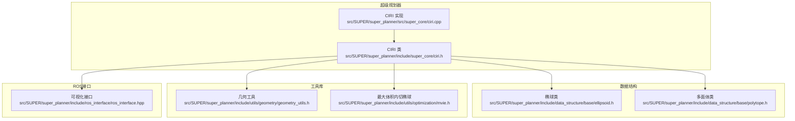
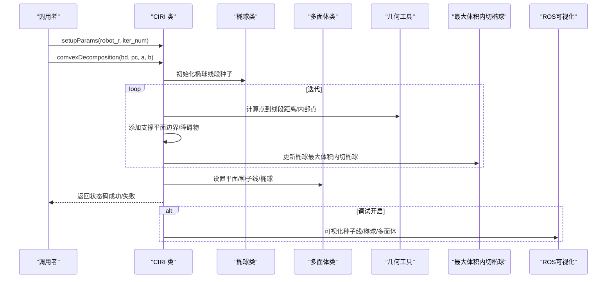
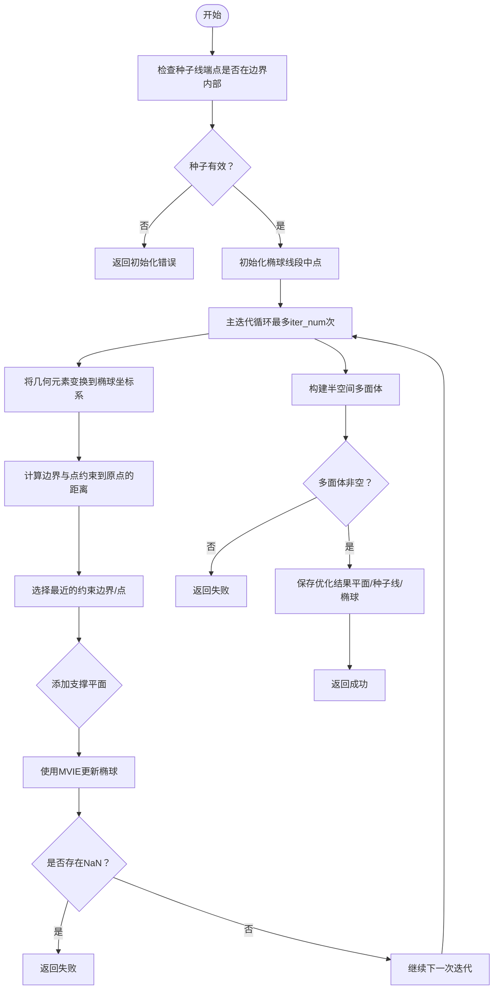
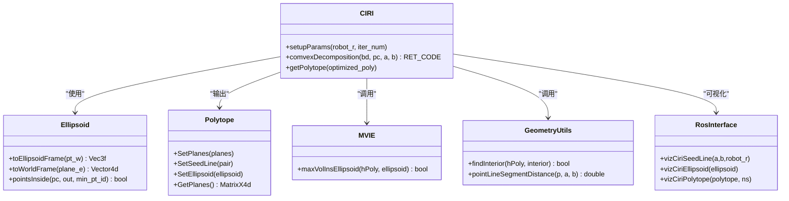
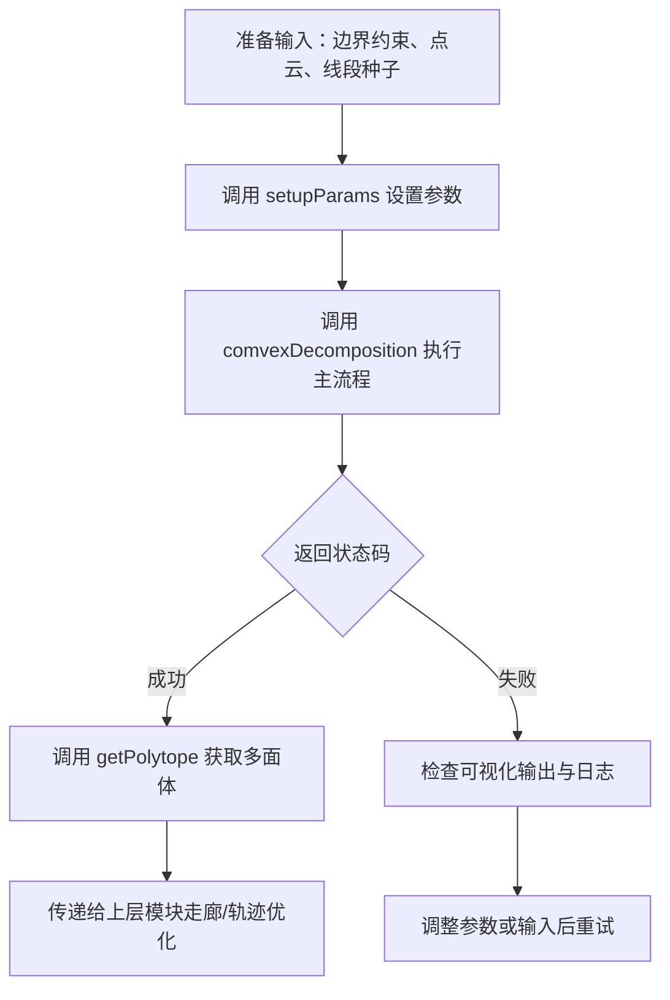

# CIRI类

<cite>
**本文引用的文件**
- [ciri.h](file://src/SUPER/super_planner/include/super_core/ciri.h)
- [ciri.cpp](file://src/SUPER/super_planner/src/super_core/ciri.cpp)
- [polytope.h](file://src/SUPER/super_planner/include/data_structure/base/polytope.h)
- [ellipsoid.h](file://src/SUPER/super_planner/include/data_structure/base/ellipsoid.h)
- [mvie.h](file://src/SUPER/super_planner/include/utils/optimization/mvie.h)
- [geometry_utils.h](file://src/SUPER/super_planner/include/utils/geometry/geometry_utils.h)
- [ros_interface.hpp](file://src/SUPER/super_planner/include/ros_interface/ros_interface.hpp)
</cite>

## 目录
1. [简介](#简介)
2. [项目结构](#项目结构)
3. [核心组件](#核心组件)
4. [架构总览](#架构总览)
5. [详细组件分析](#详细组件分析)
6. [依赖分析](#依赖分析)
7. [性能考量](#性能考量)
8. [故障排查指南](#故障排查指南)
9. [结论](#结论)
10. [附录](#附录)

## 简介
本文件为CIRI类的详细API文档。CIRI（Convex Inner-Approximation with Radius Inspection）是SUPER规划系统中的一个核心模块，负责在存在障碍物点云与边界约束的环境中，基于给定的线段种子，迭代生成一个尽可能大的内切椭球，并由此构建凸多面体（半空间交集）作为该线段的“安全凸包”。该类广泛应用于路径规划、轨迹优化与走廊生成等场景，为后续的运动学/动力学优化提供几何安全保障。

CIRI类的关键能力包括：
- 基于线段种子的椭球初始化策略
- 支撑平面（边界与障碍物点）的动态添加
- 最大体积内切椭球（MVIE）更新
- 凸多面体的构建与验证
- 可视化辅助与调试输出

## 项目结构
CIRI类位于超级规划器模块中，其相关依赖主要分布在以下目录：
- 数据结构：椭球与多面体
- 几何与优化工具：几何工具、最大体积内切椭球求解器
- ROS可视化接口：用于调试与演示

图表来源
- [ciri.h](file://src/SUPER/super_planner/include/super_core/ciri.h#L67-L142)
- [ciri.cpp](file://src/SUPER/super_planner/src/super_core/ciri.cpp#L30-L458)
- [ellipsoid.h](file://src/SUPER/super_planner/include/data_structure/base/ellipsoid.h#L37-L123)
- [polytope.h](file://src/SUPER/super_planner/include/data_structure/base/polytope.h#L42-L101)
- [geometry_utils.h](file://src/SUPER/super_planner/include/utils/geometry/geometry_utils.h#L55-L305)
- [mvie.h](file://src/SUPER/super_planner/include/utils/optimization/mvie.h#L14-L36)
- [ros_interface.hpp](file://src/SUPER/super_planner/include/ros_interface/ros_interface.hpp#L43-L149)

章节来源
- [ciri.h](file://src/SUPER/super_planner/include/super_core/ciri.h#L67-L142)
- [ciri.cpp](file://src/SUPER/super_planner/src/super_core/ciri.cpp#L30-L458)

## 核心组件
- CIRI类：对外暴露的公共接口，负责参数设置、主流程执行与结果获取。
- 椭球类（Ellipsoid）：描述形如 $ (x-d)^T C^{-1} (x-d) \leq 1 $ 的几何对象，支持世界/椭球坐标系互转、最近点查询、包含性判断等。
- 多面体类（Polytope）：由半空间平面集合表示的凸多面体，支持重置、设置平面、设置种子线、设置椭球、内部点检测等。
- 几何工具（geometry_utils）：提供点到线段距离、内部点查找、平面变换、旋转矩阵等基础几何运算。
- 最大体积内切椭球（MVIE）：提供最大体积内切椭球的数值优化求解器，用于迭代更新椭球。
- ROS可视化接口（RosInterface）：提供调试可视化能力，如种子线、椭球、不可行点、多面体与点云等。

章节来源
- [ciri.h](file://src/SUPER/super_planner/include/super_core/ciri.h#L67-L142)
- [ellipsoid.h](file://src/SUPER/super_planner/include/data_structure/base/ellipsoid.h#L37-L123)
- [polytope.h](file://src/SUPER/super_planner/include/data_structure/base/polytope.h#L42-L101)
- [geometry_utils.h](file://src/SUPER/super_planner/include/utils/geometry/geometry_utils.h#L55-L305)
- [mvie.h](file://src/SUPER/super_planner/include/utils/optimization/mvie.h#L14-L36)
- [ros_interface.hpp](file://src/SUPER/super_planner/include/ros_interface/ros_interface.hpp#L43-L149)

## 架构总览
CIRI类在规划系统中的定位如下：
- 输入：边界约束矩阵（每行代表一个半空间）、障碍物点云、线段种子（起点与终点）。
- 中间：迭代构建支撑平面，逐步逼近最优内切椭球；随后将半空间平面集合封装为多面体并校验非空。
- 输出：优化后的多面体对象，可被上层模块复用（如走廊生成、轨迹优化）。

图表来源
- [ciri.cpp](file://src/SUPER/super_planner/src/super_core/ciri.cpp#L44-L257)
- [ellipsoid.h](file://src/SUPER/super_planner/include/data_structure/base/ellipsoid.h#L37-L123)
- [polytope.h](file://src/SUPER/super_planner/include/data_structure/base/polytope.h#L42-L101)
- [geometry_utils.h](file://src/SUPER/super_planner/include/utils/geometry/geometry_utils.h#L211-L221)
- [mvie.h](file://src/SUPER/super_planner/include/utils/optimization/mvie.h#L33-L34)
- [ros_interface.hpp](file://src/SUPER/super_planner/include/ros_interface/ros_interface.hpp#L126-L135)

## 详细组件分析

### 类定义与成员
- 成员变量
  - ros_ptr_：ROS可视化接口指针，用于调试可视化
  - robot_r_：机器人半径（考虑几何安全）
  - iter_num_：最大迭代次数
  - debug_en：调试开关
  - sphere_template_：球模板椭球（半径为机器人半径）
  - optimized_polytope_：优化后的多面体缓存
- 公共接口
  - 构造函数：默认构造；带ROS指针的构造函数启用调试
  - setupParams：设置机器人半径与迭代次数
  - comvexDecomposition：执行主流程，返回状态码
  - getPolytope：获取优化后的多面体

章节来源
- [ciri.h](file://src/SUPER/super_planner/include/super_core/ciri.h#L67-L142)

### comvexDecomposition 主流程
该方法是CIRI的核心，其工作流如下：

图表来源
- [ciri.cpp](file://src/SUPER/super_planner/src/super_core/ciri.cpp#L44-L257)

章节来源
- [ciri.cpp](file://src/SUPER/super_planner/src/super_core/ciri.cpp#L44-L257)

### 关键辅助方法

#### findEllipsoid：椭球初始化
- 输入：障碍物点云、线段种子起点与终点
- 输出：初始化后的椭球（包含线段且尽量远离障碍物）
- 算法要点：
  - 以线段中点为中心，初始半轴沿线段方向
  - 考虑机器人半径，适当放大
  - 通过两阶段迭代（先调整y轴，再调整z轴），使椭球尽可能大且不包含障碍物点

章节来源
- [ciri.cpp](file://src/SUPER/super_planner/src/super_core/ciri.cpp#L363-L456)

#### findTangentPlaneOfSphere：球体切平面计算
- 输入：球心、半径、通过点、种子点
- 输出：切平面（法向量与常数项）
- 算法要点：
  - 几何法计算切点与法向量
  - 旋转坐标系简化计算
  - 确保平面方向使得种子点位于正确一侧

章节来源
- [ciri.cpp](file://src/SUPER/super_planner/src/super_core/ciri.cpp#L291-L350)

#### distancePointToSegment：点到线段距离
- 输入：点P与线段端点A、B
- 输出：最小距离
- 算法要点：参数化线段，投影到[0,1]区间，分三种情况返回端点或内部点距离

章节来源
- [ciri.cpp](file://src/SUPER/super_planner/src/super_core/ciri.cpp#L97-L119)

### 与几何与优化库的协作
- 椭球类（Ellipsoid）
  - 提供坐标系变换（toEllipsoidFrame/toWorldFrame）
  - 包含性判断与最近点查询
- 多面体类（Polytope）
  - 封装半空间平面集合
  - 提供重置、设置平面/种子线/椭球、内部点检测等
- 几何工具（geometry_utils）
  - 内部点查找（findInterior）
  - 点到线段距离（pointLineSegmentDistance）
- 最大体积内切椭球（MVIE）
  - 提供maxVolInsEllipsoid静态方法，用于迭代更新椭球

章节来源
- [ellipsoid.h](file://src/SUPER/super_planner/include/data_structure/base/ellipsoid.h#L83-L122)
- [polytope.h](file://src/SUPER/super_planner/include/data_structure/base/polytope.h#L63-L101)
- [geometry_utils.h](file://src/SUPER/super_planner/include/utils/geometry/geometry_utils.h#L211-L221)
- [mvie.h](file://src/SUPER/super_planner/include/utils/optimization/mvie.h#L33-L34)

### 与ROS的集成
- CIRI在调试模式下可通过RosInterface进行可视化：
  - 种子线、椭球、不可行点、多面体、点云
- 可视化接口提供统一的日志格式化与时间戳接口

章节来源
- [ciri.h](file://src/SUPER/super_planner/include/super_core/ciri.h#L68-L76)
- [ros_interface.hpp](file://src/SUPER/super_planner/include/ros_interface/ros_interface.hpp#L126-L135)

## 依赖分析
CIRI类的依赖关系如下：

图表来源
- [ciri.h](file://src/SUPER/super_planner/include/super_core/ciri.h#L67-L142)
- [ciri.cpp](file://src/SUPER/super_planner/src/super_core/ciri.cpp#L30-L458)
- [ellipsoid.h](file://src/SUPER/super_planner/include/data_structure/base/ellipsoid.h#L37-L123)
- [polytope.h](file://src/SUPER/super_planner/include/data_structure/base/polytope.h#L42-L101)
- [geometry_utils.h](file://src/SUPER/super_planner/include/utils/geometry/geometry_utils.h#L211-L221)
- [mvie.h](file://src/SUPER/super_planner/include/utils/optimization/mvie.h#L33-L34)
- [ros_interface.hpp](file://src/SUPER/super_planner/include/ros_interface/ros_interface.hpp#L126-L135)

## 性能考量
- 时间复杂度
  - 主循环迭代次数受iter_num限制；每次迭代涉及：
    - 计算约束到原点距离：O(M+N)
    - 添加支撑平面与更新椭球：O(1)至O(多项式，取决于具体实现)
    - 整体复杂度约为 O(iter_num × (M+N))
- 空间复杂度
  - 存储半空间平面矩阵与中间结果，空间复杂度 O(k×4)，k为支撑平面数量
- 数值稳定性
  - 对NaN检查与内部点验证，避免退化情况
  - 若出现不可行情形（点到线段距离过小），提前终止并返回失败
- 参数敏感性
  - robot_r_影响切平面构造与初始椭球尺寸
  - iter_num_决定收敛精度与运行时长

## 故障排查指南
- 常见错误与原因
  - 初始化错误：种子线端点不在边界内部
  - 不可行问题：障碍物点距离线段过近（小于机器人半径）
  - NaN错误：更新椭球或平面构造过程中出现数值异常
  - 多面体为空：内部点查找失败
- 调试建议
  - 开启调试模式，利用RosInterface可视化种子线、椭球、多面体与点云
  - 逐步缩小输入规模（减少障碍物点、简化边界约束）以定位问题
  - 调整robot_r_与iter_num_，观察收敛行为
- 相关接口
  - 可视化接口：种子线、椭球、不可行点、多面体、点云
  - 日志接口：统一格式化输出，便于记录失败场景

章节来源
- [ciri.cpp](file://src/SUPER/super_planner/src/super_core/ciri.cpp#L113-L117)
- [ciri.cpp](file://src/SUPER/super_planner/src/super_core/ciri.cpp#L220-L239)
- [ciri.cpp](file://src/SUPER/super_planner/src/super_core/ciri.cpp#L243-L248)
- [ros_interface.hpp](file://src/SUPER/super_planner/include/ros_interface/ros_interface.hpp#L126-L135)

## 结论
CIRI类通过“椭球+半空间”的组合，实现了在复杂约束环境下对线段的安全凸近似。其稳健的初始化策略、动态支撑平面添加机制以及MVIE更新步骤，保证了在大多数情况下能够快速收敛并生成可用的凸多面体。配合ROS可视化接口，CIRI为上层规划模块提供了可靠的几何安全保障与良好的可调试性。

## 附录

### API参考

- 构造与析构
  - CIRI()：默认构造
  - CIRI(ros_ptr)：带ROS指针构造，启用调试
  - ~CIRI()：析构

- 参数设置
  - setupParams(robot_r, iter_num)
    - robot_r：机器人半径
    - iter_num：最大迭代次数

- 主流程
  - comvexDecomposition(bd, pc, a, b) -> RET_CODE
    - bd：边界约束矩阵（每行半空间）
    - pc：障碍物点云
    - a/b：线段种子起点/终点
    - 返回：执行状态码（成功/失败/初始化错误）

- 结果获取
  - getPolytope(optimized_poly)
    - optimized_poly：输出优化后的多面体

章节来源
- [ciri.h](file://src/SUPER/super_planner/include/super_core/ciri.h#L122-L141)

### 使用流程图（概念示意）

### 配置示例（参数说明）
- robot_r：机器人半径（考虑几何安全）
- iter_num：最大迭代次数（平衡精度与性能）
- 可视化：启用调试模式后自动输出种子线、椭球、多面体与点云

章节来源
- [ciri.h](file://src/SUPER/super_planner/include/super_core/ciri.h#L134-L139)
- [ciri.cpp](file://src/SUPER/super_planner/src/super_core/ciri.cpp#L272-L277)
- [ros_interface.hpp](file://src/SUPER/super_planner/include/ros_interface/ros_interface.hpp#L126-L135)