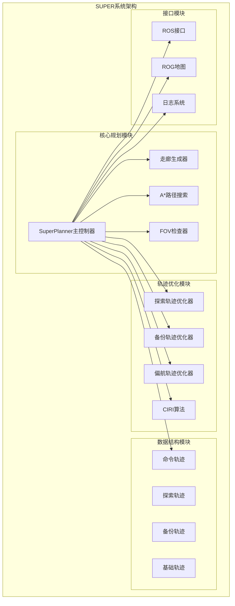
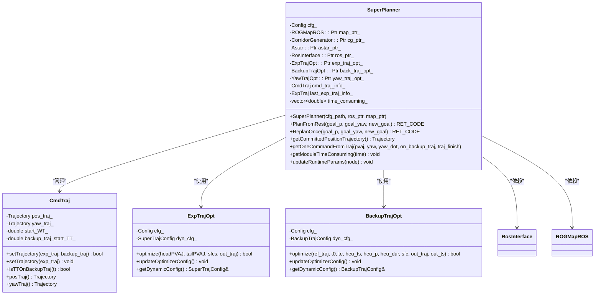
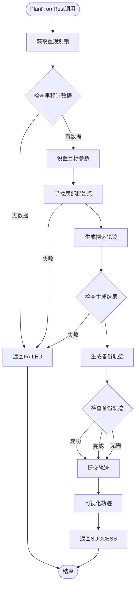
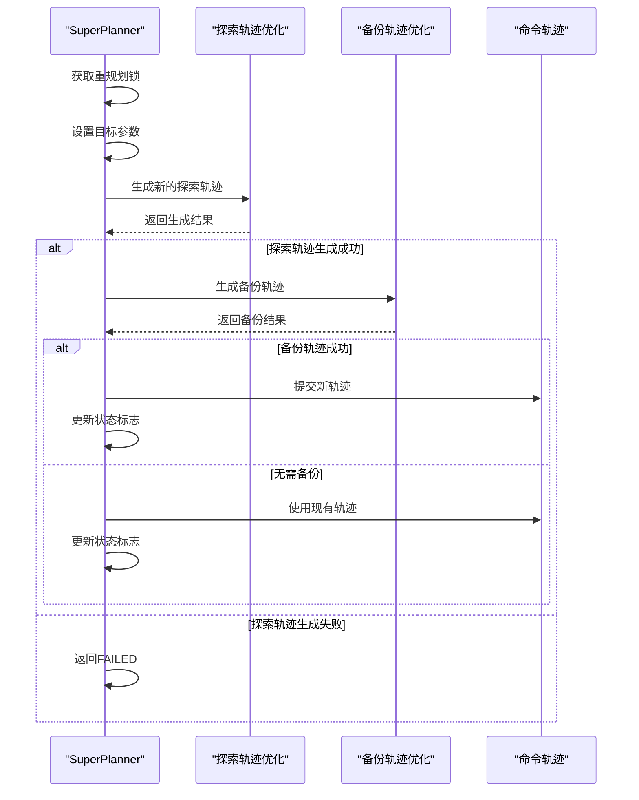
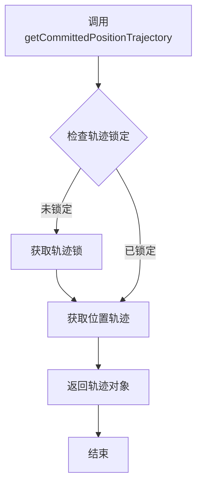
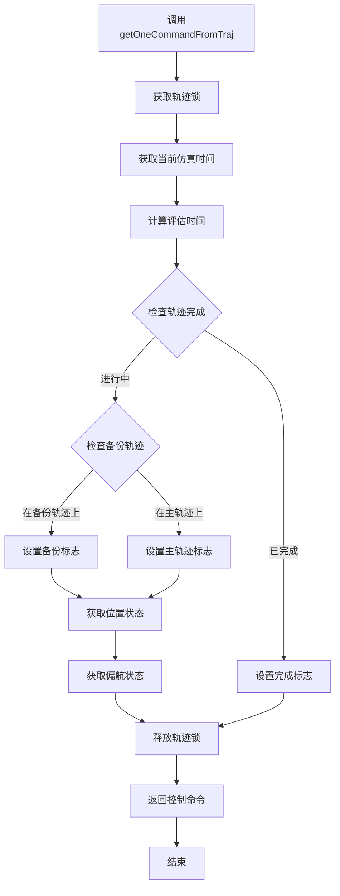
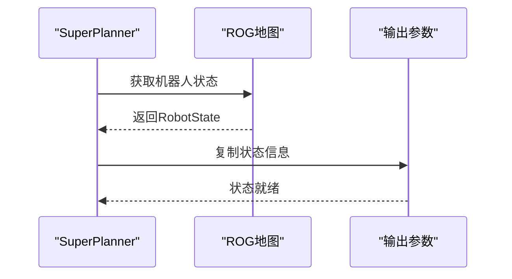
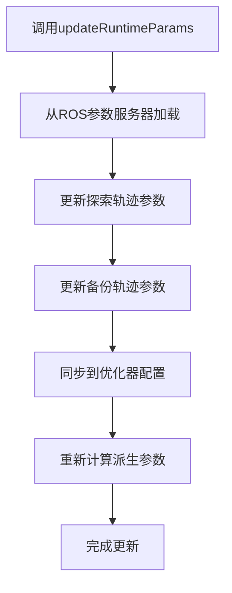
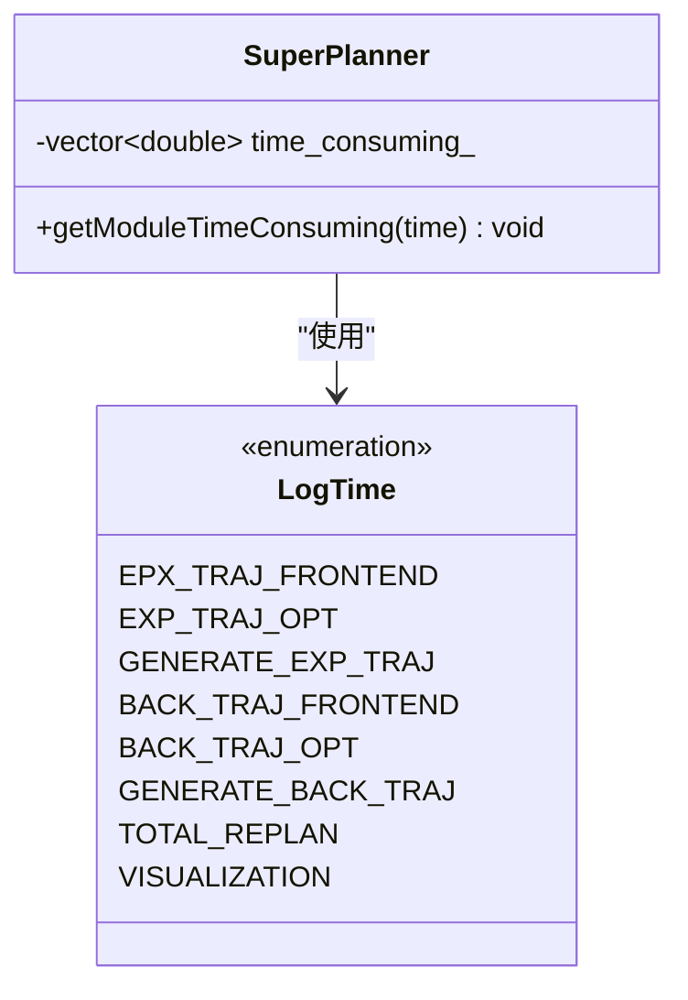
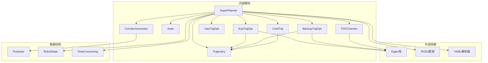

# SuperPlanner主控制器类

<cite>
**本文档引用的文件**
- [super_planner.h](file://src/SUPER/super_planner/include/super_core/super_planner.h)
- [super_planner.cpp](file://src/SUPER/super_planner/src/super_core/super_planner.cpp)
- [config.hpp](file://src/SUPER/super_planner/include/super_core/config.hpp)
- [log_utils.hpp](file://src/SUPER/super_planner/include/super_core/log_utils.hpp)
- [exp_traj_optimizer_s4.h](file://src/SUPER/super_planner/include/traj_opt/exp_traj_optimizer_s4.h)
- [cmd_traj.h](file://src/SUPER/super_planner/include/data_structure/cmd_traj.h)
- [trajectory.h](file://src/SUPER/super_planner/include/data_structure/base/trajectory.h)
- [ros_interface.hpp](file://src/SUPER/super_planner/include/ros_interface/ros_interface.hpp)
- [click.yaml](file://src/SUPER/super_planner/config/click.yaml)
</cite>

## 目录
1. [简介](#简介)
2. [项目结构](#项目结构)
3. [核心组件](#核心组件)
4. [架构概览](#架构概览)
5. [详细组件分析](#详细组件分析)
6. [依赖关系分析](#依赖关系分析)
7. [性能考虑](#性能考虑)
8. [故障排除指南](#故障排除指南)
9. [结论](#结论)
10. [附录](#附录)

## 简介

SuperPlanner是SUPER（Safe and Universal Planning for Exploration and Rescue）系统的核心控制器类，专为四旋翼无人机设计的智能轨迹规划系统。该类实现了基于安全飞行走廊（Safe Flight Corridor, SFC）的探索轨迹和备份轨迹的联合优化策略，能够在复杂环境中实现安全、高效的轨迹规划。

SuperPlanner集成了多种先进的规划技术，包括：
- 基于IRIS算法的安全飞行走廊生成
- 探索轨迹的热初始化优化
- 备份轨迹的在线生成机制
- 实时状态监控和动态参数调整
- 多层次的性能统计和可视化反馈

该控制器类提供了完整的规划生命周期管理，从初始化配置到实时轨迹执行，涵盖了无人机轨迹规划的所有关键环节。

## 项目结构

SuperPlanner位于SUPER项目的super_planner模块中，采用模块化的架构设计：



**图表来源**
- [super_planner.h](file://src/SUPER/super_planner/include/super_core/super_planner.h#L55-L102)
- [super_planner.cpp](file://src/SUPER/super_planner/src/super_core/super_planner.cpp#L32-L74)

**章节来源**
- [super_planner.h](file://src/SUPER/super_planner/include/super_core/super_planner.h#L55-L102)
- [super_planner.cpp](file://src/SUPER/super_planner/src/super_core/super_planner.cpp#L32-L74)

## 核心组件

### 构造函数与初始化

SuperPlanner的构造函数负责系统的全面初始化，包括配置加载、组件创建和参数设置：

```mermaid
sequenceDiagram
participant Client as "调用方"
participant SP as "SuperPlanner"
participant CFG as "配置系统"
participant ROS as "ROS接口"
participant MAP as "ROG地图"
participant OPT as "优化器"
Client->>SP : 创建SuperPlanner实例
SP->>CFG : 加载配置文件
CFG-->>SP : 返回配置参数
SP->>ROS : 初始化ROS接口
SP->>MAP : 初始化ROG地图
SP->>OPT : 创建轨迹优化器
OPT->>ROS : 绑定可视化接口
SP->>SP : 设置时间统计数组
SP->>SP : 初始化机器人状态
SP->>SP : 创建FOV检查器
SP-->>Client : 返回初始化完成的实例
```

**图表来源**
- [super_planner.cpp](file://src/SUPER/super_planner/src/super_core/super_planner.cpp#L33-L74)

构造函数参数说明：
- `cfg_path`: 配置文件路径，包含所有规划参数
- `ros_ptr`: ROS接口指针，用于系统通信和可视化
- `map_ptr`: ROG地图指针，提供环境感知能力

### 主要配置参数

SuperPlanner的配置系统通过Config类统一管理所有参数：

| 参数类别 | 参数名称 | 默认值 | 描述 |
|---------|----------|--------|------|
| 规划参数 | planning_horizon | 10.0 | 规划时间范围（秒） |
| 规划参数 | replan_forward_dt | 0.3 | 重规划前瞻时间（秒） |
| 规划参数 | robot_r | 0.3 | 机器人半径（米） |
| 规划参数 | corridor_bound_dis | 3.0 | 走廊边界距离（米） |
| 轨迹参数 | exp_traj_cfg.max_vel | 5.0 | 探索轨迹最大速度（m/s） |
| 轨迹参数 | exp_traj_cfg.max_acc | 5.0 | 探索轨迹最大加速度（m/s²） |
| 轨迹参数 | back_traj_cfg.piece_num | 2 | 备份轨迹分段数 |
| 可视化参数 | visualization_en | true | 是否启用可视化 |
| 功能开关 | backup_traj_en | false | 是否启用备份轨迹 |

**章节来源**
- [config.hpp](file://src/SUPER/super_planner/include/super_core/config.hpp#L96-L151)
- [click.yaml](file://src/SUPER/super_planner/config/click.yaml#L15-L37)

## 架构概览

SuperPlanner采用了分层架构设计，各组件职责明确，耦合度低：



**图表来源**
- [super_planner.h](file://src/SUPER/super_planner/include/super_core/super_planner.h#L59-L296)
- [cmd_traj.h](file://src/SUPER/super_planner/include/data_structure/cmd_traj.h#L38-L201)
- [exp_traj_optimizer_s4.h](file://src/SUPER/super_planner/include/traj_opt/exp_traj_optimizer_s4.h#L55-L368)

## 详细组件分析

### 核心规划接口

#### PlanFromRest接口

PlanFromRest是SuperPlanner的完整重规划接口，适用于无人机从静止状态开始的规划任务：



**图表来源**
- [super_planner.cpp](file://src/SUPER/super_planner/src/super_core/super_planner.cpp#L76-L175)

PlanFromRest的主要参数：
- `goal_p`: 目标位置坐标（Vec3f）
- `goal_yaw`: 目标偏航角（弧度）
- `new_goal`: 是否为新目标（bool）

返回值说明：
- `SUCCESS`: 规划成功
- `FAILED`: 规划失败
- `SUPER_NO_ODOM`: 无里程计数据
- `SUPER_NO_START_POINT`: 无法找到起始点

#### ReplanOnce接口

ReplanOnce是SuperPlanner的增量重规划接口，适用于无人机正在飞行过程中的轨迹更新：



**图表来源**
- [super_planner.cpp](file://src/SUPER/super_planner/src/super_core/super_planner.cpp#L178-L312)

ReplanOnce的特殊返回值：
- `NEW_TRAJ`: 需要切换到新轨迹
- `EMER`: 紧急情况，需要紧急处理

### 轨迹获取接口

#### getCommittedPositionTrajectory接口

getCommittedPositionTrajectory用于获取当前已提交的位置轨迹：



**图表来源**
- [super_planner.cpp](file://src/SUPER/super_planner/src/super_core/super_planner.cpp#L333-L339)

返回值：Trajectory对象，包含完整的三维位置轨迹信息。

#### getOneCommandFromTraj接口

getOneCommandFromTraj是轨迹执行的核心接口，用于获取当前时刻的控制命令：



**图表来源**
- [super_planner.cpp](file://src/SUPER/super_planner/src/super_core/super_planner.cpp#L341-L380)

接口参数说明：
- `pvaj`: 输出参数，包含位置、速度、加速度信息
- `yaw`: 输出参数，偏航角（弧度）
- `yaw_dot`: 输出参数，偏航角速度（弧度/秒）
- `on_backup_traj`: 输出参数，是否在备份轨迹上
- `traj_finish`: 输出参数，轨迹是否完成

### 状态查询与动态参数接口

#### getRobotState接口

getRobotState用于获取当前机器人的状态信息：



**图表来源**
- [super_planner.cpp](file://src/SUPER/super_planner/src/super_core/super_planner.cpp#L1207-L1210)

#### updateRuntimeParams接口

updateRuntimeParams支持运行时动态参数更新，实现参数的热插拔：



**图表来源**
- [super_planner.h](file://src/SUPER/super_planner/include/super_core/super_planner.h#L241-L295)

### 性能统计接口

#### getModuleTimeConsuming接口

getModuleTimeConsuming用于获取各模块的性能统计数据：



**图表来源**
- [log_utils.hpp](file://src/SUPER/super_planner/include/super_core/log_utils.hpp#L32-L54)
- [super_planner.cpp](file://src/SUPER/super_planner/src/super_core/super_planner.cpp#L382-L385)

性能统计包括：
- 探索轨迹前端处理时间
- 探索轨迹优化时间
- 备份轨迹前端处理时间
- 备份轨迹优化时间
- 可视化处理时间
- 总重规划时间

### 状态查询接口

#### goalValid接口

goalValid用于检查目标的有效性，确保规划过程的稳定性。

#### isEasyGoal接口

isEasyGoal用于判断目标是否容易到达，帮助系统决定规划策略。

**章节来源**
- [super_planner.h](file://src/SUPER/super_planner/include/super_core/super_planner.h#L118-L165)

## 依赖关系分析

SuperPlanner的依赖关系体现了清晰的模块化设计：



**图表来源**
- [super_planner.h](file://src/SUPER/super_planner/include/super_core/super_planner.h#L31-L52)

**章节来源**
- [super_planner.h](file://src/SUPER/super_planner/include/super_core/super_planner.h#L31-L52)

## 性能考虑

### 时间复杂度分析

SuperPlanner的各个操作具有以下时间复杂度特征：

- **PlanFromRest**: O(T × P)，其中T为轨迹段数，P为走廊多面体数量
- **ReplanOnce**: O(ΔT × ΔP)，其中ΔT为重规划时间窗口，ΔP为变化的走廊数量
- **getOneCommandFromTraj**: O(log N)，其中N为轨迹分段数
- **轨迹可视化**: O(N)，其中N为轨迹点数

### 内存使用优化

- 轨迹数据采用分段存储，支持部分轨迹的高效访问
- 使用智能指针管理内存，避免内存泄漏
- 优化器配置采用共享引用，减少内存复制

### 实时性能保证

- 重规划周期可配置，默认15Hz
- 前瞻时间限制确保实时响应
- 多线程安全设计支持并发访问

## 故障排除指南

### 常见问题诊断

#### 无里程计数据错误

**症状**: PlanFromRest返回SUPER_NO_ODOM
**原因**: 无人机未提供有效的里程计数据
**解决方案**: 
1. 检查IMU和GPS传感器连接
2. 验证传感器校准状态
3. 确认传感器数据流正常

#### 起始点不可达错误

**症状**: PlanFromRest返回SUPER_NO_START_POINT  
**原因**: 起始点周围被障碍物完全包围
**解决方案**:
1. 检查地图更新状态
2. 调整机器人半径参数
3. 等待环境清理或手动干预

#### 轨迹优化失败

**症状**: 优化器返回FAILED
**原因**: 参数设置不合理或约束冲突
**解决方案**:
1. 检查速度、加速度约束设置
2. 调整走廊边界参数
3. 简化目标环境

### 性能调优建议

#### 参数调优

根据不同的应用场景调整关键参数：

| 参数 | 低速环境 | 高速环境 | 复杂环境 |
|------|----------|----------|----------|
| planning_horizon | 15.0 | 5.0 | 8.0 |
| replan_forward_dt | 0.5 | 0.1 | 0.2 |
| robot_r | 0.3 | 0.2 | 0.25 |
| corridor_bound_dis | 4.0 | 2.0 | 3.0 |

#### 调试模式

启用详细日志模式进行问题诊断：
- 设置`detailed_log_en: true`
- 启用可视化功能
- 监控各模块性能统计

**章节来源**
- [super_planner.cpp](file://src/SUPER/super_planner/src/super_core/super_planner.cpp#L86-L113)
- [config.hpp](file://src/SUPER/super_planner/include/super_core/config.hpp#L158-L228)

## 结论

SuperPlanner主控制器类是一个功能完整、架构清晰的无人机轨迹规划系统。其设计特点包括：

1. **模块化设计**: 清晰的组件分离和职责划分
2. **实时性能**: 支持高频重规划和实时轨迹执行
3. **鲁棒性**: 完善的错误处理和异常恢复机制
4. **可扩展性**: 支持动态参数更新和模块扩展
5. **可视化**: 全面的调试和验证支持

该系统为四旋翼无人机在复杂环境中的自主飞行提供了可靠的技术支撑，适用于搜索救援、环境监测等多种应用场景。

## 附录

### API使用示例

#### 基本初始化示例

```cpp
// 创建ROS接口
auto ros_ptr = std::make_shared<RosInterface>();
// 创建ROG地图
auto map_ptr = std::make_shared<ROGMapROS>();
// 创建SuperPlanner实例
auto planner = std::make_shared<SuperPlanner>("config.yaml", ros_ptr, map_ptr);
```

#### 规划执行示例

```cpp
// 首次规划
Vec3f goal(10.0, 15.0, 2.0);
double goal_yaw = 0.0;
RET_CODE result = planner->PlanFromRest(goal, goal_yaw, true);

// 实时重规划
result = planner->ReplanOnce(goal, goal_yaw, false);

// 获取控制命令
StatePVAJ pvaj;
double yaw, yaw_dot;
bool on_backup, finished;
planner->getOneCommandFromTraj(pvaj, yaw, yaw_dot, on_backup, finished);
```

### 配置文件示例

参考`click.yaml`配置文件了解完整的参数设置选项，包括规划参数、轨迹优化参数、可视化设置等。