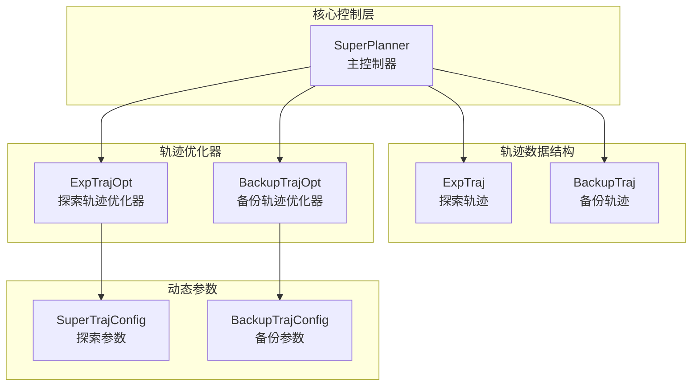
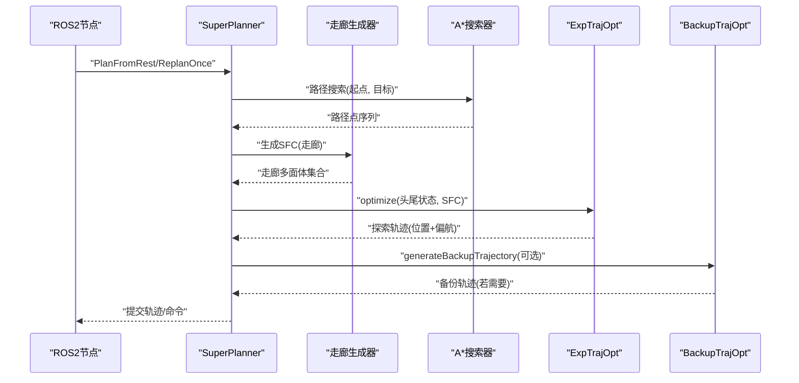
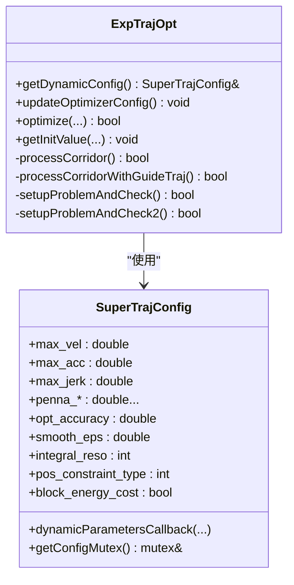
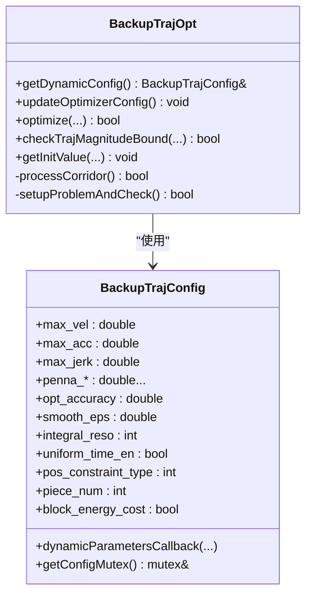
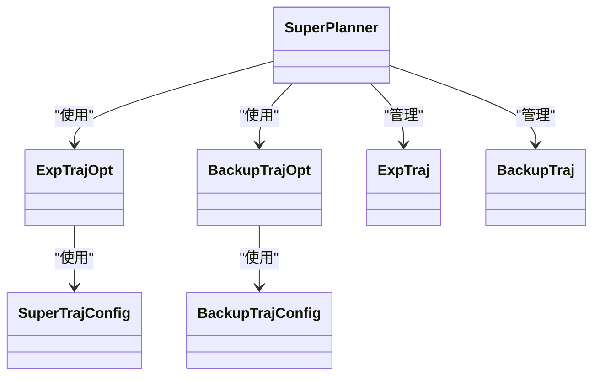
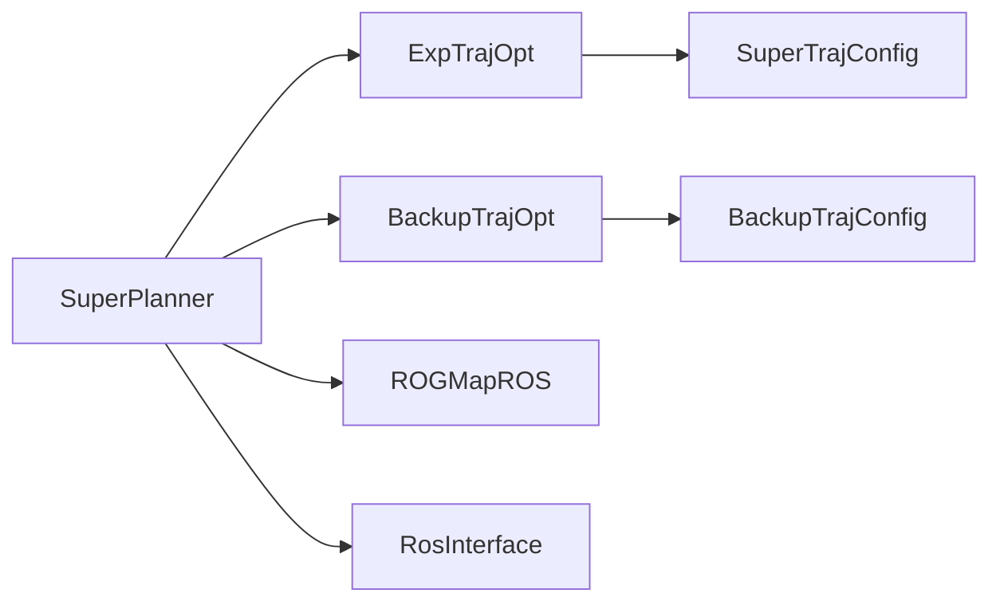

# 核心类API

<cite>
**本文引用的文件**
- [super_planner.h](file://src/SUPER/super_planner/include/super_core/super_planner.h)
- [exp_traj.h](file://src/SUPER/super_planner/include/data_structure/exp_traj.h)
- [backup_traj.h](file://src/SUPER/super_planner/include/data_structure/backup_traj.h)
- [exp_traj_optimizer_s4.h](file://src/SUPER/super_planner/include/traj_opt/exp_traj_optimizer_s4.h)
- [backup_traj_optimizer_s4.h](file://src/SUPER/super_planner/include/traj_opt/backup_traj_optimizer_s4.h)
- [super_traj_config.h](file://src/SUPER/super_planner/include/traj_opt/super_traj_config.h)
- [backup_traj_config.h](file://src/SUPER/super_planner/include/traj_opt/backup_traj_config.h)
- [super_planner.cpp](file://src/SUPER/super_planner/src/super_core/super_planner.cpp)
</cite>

## 目录
1. [简介](#简介)
2. [项目结构](#项目结构)
3. [核心组件](#核心组件)
4. [架构总览](#架构总览)
5. [详细组件分析](#详细组件分析)
6. [依赖分析](#依赖分析)
7. [性能考虑](#性能考虑)
8. [故障排查指南](#故障排查指南)
9. [结论](#结论)
10. [附录](#附录)

## 简介
本文件面向超级规划器（SUPER）核心类API，系统性梳理主控制器类 SuperPlanner 的公共接口与轨迹优化器类（ExpTrajOpt、BackupTrajOpt）的API，覆盖构造与初始化、规划接口（PlanFromRest、ReplanOnce）、轨迹获取接口（getCommittedPositionTrajectory、getOneCommandFromTraj）、状态查询接口、动态参数接口等，并提供类继承关系图与关键流程时序图，帮助读者快速理解并正确使用这些API。

## 项目结构
围绕核心API的相关文件组织如下：
- 控制器与核心逻辑：super_planner.h、super_planner.cpp
- 数据结构：exp_traj.h、backup_traj.h
- 轨迹优化器：exp_traj_optimizer_s4.h、backup_traj_optimizer_s4.h
- 动态参数配置：super_traj_config.h、backup_traj_config.h

**图表来源**
- [super_planner.h](file://src/SUPER/super_planner/include/super_core/super_planner.h#L59-L296)
- [exp_traj.h](file://src/SUPER/super_planner/include/data_structure/exp_traj.h#L34-L159)
- [backup_traj.h](file://src/SUPER/super_planner/include/data_structure/backup_traj.h#L35-L154)
- [exp_traj_optimizer_s4.h](file://src/SUPER/super_planner/include/traj_opt/exp_traj_optimizer_s4.h#L55-L368)
- [backup_traj_optimizer_s4.h](file://src/SUPER/super_planner/include/traj_opt/backup_traj_optimizer_s4.h#L52-L210)
- [super_traj_config.h](file://src/SUPER/super_planner/include/traj_opt/super_traj_config.h#L37-L177)
- [backup_traj_config.h](file://src/SUPER/super_planner/include/traj_opt/backup_traj_config.h#L37-L204)

**章节来源**
- [super_planner.h](file://src/SUPER/super_planner/include/super_core/super_planner.h#L55-L296)
- [exp_traj.h](file://src/SUPER/super_planner/include/data_structure/exp_traj.h#L30-L163)
- [backup_traj.h](file://src/SUPER/super_planner/include/data_structure/backup_traj.h#L31-L158)
- [exp_traj_optimizer_s4.h](file://src/SUPER/super_planner/include/traj_opt/exp_traj_optimizer_s4.h#L45-L371)
- [backup_traj_optimizer_s4.h](file://src/SUPER/super_planner/include/traj_opt/backup_traj_optimizer_s4.h#L44-L212)
- [super_traj_config.h](file://src/SUPER/super_planner/include/traj_opt/super_traj_config.h#L31-L179)
- [backup_traj_config.h](file://src/SUPER/super_planner/include/traj_opt/backup_traj_config.h#L31-L206)

## 核心组件
- SuperPlanner 主控制器：负责整体规划流程编排、轨迹数据结构管理、与优化器交互、动态参数同步、状态查询与可视化输出。
- ExpTrajOpt 探索轨迹优化器：基于走廊约束进行探索轨迹优化，支持引导轨迹热启动、动态参数注入与初值获取。
- BackupTrajOpt 备份轨迹优化器：在探索轨迹不可行或冲突时生成安全的备份轨迹，支持时间片与初值设定。
- ExpTraj/BackupTraj 数据结构：封装位置与偏航轨迹、起始时间、走廊标记、部分轨迹提取等能力。

**章节来源**
- [super_planner.h](file://src/SUPER/super_planner/include/super_core/super_planner.h#L59-L296)
- [exp_traj_optimizer_s4.h](file://src/SUPER/super_planner/include/traj_opt/exp_traj_optimizer_s4.h#L55-L368)
- [backup_traj_optimizer_s4.h](file://src/SUPER/super_planner/include/traj_opt/backup_traj_optimizer_s4.h#L52-L210)
- [exp_traj.h](file://src/SUPER/super_planner/include/data_structure/exp_traj.h#L34-L159)
- [backup_traj.h](file://src/SUPER/super_planner/include/data_structure/backup_traj.h#L35-L154)

## 架构总览
SuperPlanner 将“路径搜索—走廊生成—轨迹优化—备份策略—命令下发”串联起来，形成闭环控制链路。其内部持有优化器与地图/ROS接口指针，通过动态参数配置实现在线调节。

**图表来源**
- [super_planner.cpp](file://src/SUPER/super_planner/src/super_core/super_planner.cpp#L76-L175)
- [super_planner.h](file://src/SUPER/super_planner/include/super_core/super_planner.h#L138-L146)
- [exp_traj_optimizer_s4.h](file://src/SUPER/super_planner/include/traj_opt/exp_traj_optimizer_s4.h#L342-L349)
- [backup_traj_optimizer_s4.h](file://src/SUPER/super_planner/include/traj_opt/backup_traj_optimizer_s4.h#L183-L192)

## 详细组件分析

### SuperPlanner 主控制器API
- 构造函数
  - 参数
    - cfg_path: 配置文件路径（字符串）
    - ros_ptr: RosInterface 智能指针
    - map_ptr: ROGMapROS 智能指针
  - 返回值：无（构造函数）
  - 使用场景：实例化主控制器，完成优化器、地图、A*、走廊生成器等模块初始化
  - 示例路径：[构造函数定义](file://src/SUPER/super_planner/include/super_core/super_planner.h#L104-L106)，[初始化实现](file://src/SUPER/super_planner/src/super_core/super_planner.cpp#L33-L74)

- 初始化方法
  - 方法：构造函数内完成初始化（含优化器、A*、走廊生成器、FOV检查器等）
  - 说明：无需显式调用其他初始化函数
  - 示例路径：[初始化实现](file://src/SUPER/super_planner/src/super_core/super_planner.cpp#L33-L74)

- 规划接口
  - PlanFromRest(goal_p, goal_yaw, new_goal)
    - 参数
      - goal_p: Vec3f，目标位置
      - goal_yaw: double，目标偏航角
      - new_goal: bool，是否新目标
    - 返回值：RET_CODE（枚举，如 SUCCESS/FAILED 等）
    - 使用场景：首次或重启规划，生成探索轨迹并按需生成备份轨迹
    - 示例路径：[接口声明](file://src/SUPER/super_planner/include/super_core/super_planner.h#L139-L141)，[实现](file://src/SUPER/super_planner/src/super_core/super_planner.cpp#L76-L175)
  - ReplanOnce(goal_p, goal_yaw, new_goal)
    - 参数
      - goal_p: Vec3f，目标位置
      - goal_yaw: double，目标偏航角
      - new_goal: bool，是否新目标
    - 返回值：RET_CODE（枚举）
    - 使用场景：在线重规划，复用上次结果并增量优化
    - 示例路径：[接口声明](file://src/SUPER/super_planner/include/super_core/super_planner.h#L143-L146)，[实现片段](file://src/SUPER/super_planner/src/super_core/super_planner.cpp#L178-L200)

- 轨迹获取接口
  - getCommittedPositionTrajectory()
    - 返回值：Trajectory（已提交的位置轨迹）
    - 使用场景：获取当前已提交的探索轨迹（不含偏航）
    - 示例路径：[接口声明](file://src/SUPER/super_planner/include/super_core/super_planner.h#L126-L126)
  - getCommittedYawTrajectory()
    - 返回值：Trajectory（已提交的偏航轨迹）
    - 使用场景：获取当前已提交的偏航轨迹
    - 示例路径：[接口声明](file://src/SUPER/super_planner/include/super_core/super_planner.h#L128-L128)
  - getOneCommandFromTraj(pvaj, yaw, yaw_dot, on_backup_traj, traj_finish)
    - 参数
      - pvaj: StatePVAJ 输出，位置/速度/加速度/抖动
      - yaw: double 输出，偏航角
      - yaw_dot: double 输出，偏航角速度
      - on_backup_traj: bool 输出，是否处于备份轨迹
      - traj_finish: bool 输出，轨迹是否结束
    - 返回值：void
    - 使用场景：从当前轨迹中抽取下一时刻控制命令
    - 示例路径：[接口声明](file://src/SUPER/super_planner/include/super_core/super_planner.h#L130-L134)

- 状态查询与辅助接口
  - goalValid(): bool
    - 返回：目标是否有效
    - 示例路径：[接口声明](file://src/SUPER/super_planner/include/super_core/super_planner.h#L118-L120)
  - getRobotState(out): void
    - 返回：填充 rog_map::RobotState
    - 示例路径：[接口声明](file://src/SUPER/super_planner/include/super_core/super_planner.h#L163-L163)
  - isEasyGoal(goal_position): bool
    - 返回：是否为简单目标（无障碍直飞）
    - 示例路径：[接口声明](file://src/SUPER/super_planner/include/super_core/super_planner.h#L165-L165)
  - getMap(): ROGMapROS::Ptr&
    - 返回：地图指针引用
    - 示例路径：[接口声明](file://src/SUPER/super_planner/include/super_core/super_planner.h#L167-L169)

- 动态参数接口
  - getExpTrajOptDynamicConfig(): SuperTrajConfig&
    - 返回：探索轨迹优化器动态参数引用
    - 用途：外部读取/修改动态参数
    - 示例路径：[接口声明](file://src/SUPER/super_planner/include/super_core/super_planner.h#L176-L178)
  - getBackupTrajOptDynamicConfig(): BackupTrajConfig&
    - 返回：备份轨迹优化器动态参数引用
    - 用途：外部读取/修改动态参数
    - 示例路径：[接口声明](file://src/SUPER/super_planner/include/super_core/super_planner.h#L185-L187)
  - getExpTrajOpt()/getBackupTrajOpt(): 智能指针
    - 返回：优化器对象指针
    - 用途：直接访问优化器对象
    - 示例路径：[接口声明](file://src/SUPER/super_planner/include/super_core/super_planner.h#L194-L205)
  - updateRuntimeParams(node): void
    - 作用：从ROS2参数服务器同步参数到优化器动态配置
    - 示例路径：[接口声明与实现](file://src/SUPER/super_planner/include/super_core/super_planner.h#L241-L295)

- 性能统计接口
  - getFrontendTime()/getBackendTime(): double
    - 返回：前端/后端平均耗时（毫秒级），周期清零
    - 示例路径：[接口声明与实现](file://src/SUPER/super_planner/include/super_core/super_planner.h#L210-L224)

- 地图与日志
  - updateROGMap(cloud, pose): void
    - 作用：更新地图
    - 示例路径：[接口声明与实现](file://src/SUPER/super_planner/include/super_core/super_planner.h#L226-L228)
  - getLatestReplanLog(): LogOneReplan
    - 作用：获取最近一次重规划日志
    - 示例路径：[接口声明与实现](file://src/SUPER/super_planner/include/super_core/super_planner.h#L230-L234)

- 锁与轨迹保护
  - lockCommittedTraj()/unlockCommittedTraj(): void
    - 作用：对已提交轨迹加解锁，避免并发读写
    - 示例路径：[接口声明](file://src/SUPER/super_planner/include/super_core/super_planner.h#L110-L116)

**章节来源**
- [super_planner.h](file://src/SUPER/super_planner/include/super_core/super_planner.h#L104-L296)
- [super_planner.cpp](file://src/SUPER/super_planner/src/super_core/super_planner.cpp#L33-L200)

### 轨迹优化器类API

#### ExpTrajOpt（探索轨迹优化器）
- 构造与析构
  - ExpTrajOpt(cfg, ros_ptr)
  - ~ExpTrajOpt()
  - 示例路径：[构造/析构声明](file://src/SUPER/super_planner/include/traj_opt/exp_traj_optimizer_s4.h#L329-L340)

- 动态参数与配置
  - getDynamicConfig(): SuperTrajConfig&
    - 返回：动态参数引用
    - 示例路径：[接口声明](file://src/SUPER/super_planner/include/traj_opt/exp_traj_optimizer_s4.h#L336-L338)
  - updateOptimizerConfig(): void
    - 作用：在每次优化前同步动态参数
    - 示例路径：[接口声明](file://src/SUPER/super_planner/include/traj_opt/exp_traj_optimizer_s4.h#L355-L355)

- 优化方法
  - optimize(headPVAJ, tailPVAJ, sfcs, out_traj): bool
    - 输入：起点/终点状态、走廊集合
    - 输出：优化后的轨迹
    - 示例路径：[接口声明](file://src/SUPER/super_planner/include/traj_opt/exp_traj_optimizer_s4.h#L342-L344)
  - optimize(headPVAJ, tailPVAJ, guide_path, guide_t, sfcs, out_traj): bool
    - 输入：带引导轨迹的时间路径
    - 输出：优化后的轨迹
    - 示例路径：[接口声明](file://src/SUPER/super_planner/include/traj_opt/exp_traj_optimizer_s4.h#L346-L349)
  - optimize(headPVAJ, tailPVAJ, sfcs, init_ps, init_ts, out_traj): bool
    - 输入：给定初值（点列与时间分段）
    - 输出：优化后的轨迹
    - 示例路径：[接口声明](file://src/SUPER/super_planner/include/traj_opt/exp_traj_optimizer_s4.h#L362-L366)

- 初值获取
  - getInitValue(ts, ps): void
    - 输出：初始时间分段与路径点
    - 示例路径：[接口声明](file://src/SUPER/super_planner/include/traj_opt/exp_traj_optimizer_s4.h#L357-L360)

- 内部变量与流程要点
  - OptimizationVariables：包含优化变量、走廊多面体、MINCO求解器等
  - processCorridor/processCorridorWithGuideTraj：走廊处理与引导轨迹热启动
  - setupProblemAndCheck/setupProblemAndCheck2：问题构建与校验
  - 示例路径：[内部结构与方法](file://src/SUPER/super_planner/include/traj_opt/exp_traj_optimizer_s4.h#L62-L320)

**图表来源**
- [exp_traj_optimizer_s4.h](file://src/SUPER/super_planner/include/traj_opt/exp_traj_optimizer_s4.h#L55-L368)
- [super_traj_config.h](file://src/SUPER/super_planner/include/traj_opt/super_traj_config.h#L37-L177)

**章节来源**
- [exp_traj_optimizer_s4.h](file://src/SUPER/super_planner/include/traj_opt/exp_traj_optimizer_s4.h#L55-L368)
- [super_traj_config.h](file://src/SUPER/super_planner/include/traj_opt/super_traj_config.h#L37-L177)

#### BackupTrajOpt（备份轨迹优化器）
- 构造与析构
  - BackupTrajOpt(cfg, ros_ptr)
  - ~BackupTrajOpt()
  - 示例路径：[构造/析构声明](file://src/SUPER/super_planner/include/traj_opt/backup_traj_optimizer_s4.h#L158-L162)

- 动态参数与配置
  - getDynamicConfig(): BackupTrajConfig&
    - 返回：动态参数引用
    - 示例路径：[接口声明](file://src/SUPER/super_planner/include/traj_opt/backup_traj_optimizer_s4.h#L171-L173)
  - updateOptimizerConfig(): void
    - 作用：在每次优化前同步动态参数
    - 示例路径：[接口声明](file://src/SUPER/super_planner/include/traj_opt/backup_traj_optimizer_s4.h#L179-L179)

- 优化方法
  - optimize(exp_traj, t_0, t_e, heu_ts, heu_end_pt, heu_dur, sfc, out_traj, out_ts, debug=false): bool
    - 输入：参考探索轨迹、起止时间窗、启发式参数、SFC
    - 输出：优化后的备份轨迹与最优时间段
    - 示例路径：[接口声明](file://src/SUPER/super_planner/include/traj_opt/backup_traj_optimizer_s4.h#L183-L192)
  - optimize(exp_traj, t_0, t_e, heu_ts, sfc, init_t_vec, init_ps, out_traj, out_ts): bool
    - 输入：给定初值（时间向量与路径点）
    - 输出：优化后的备份轨迹
    - 示例路径：[接口声明](file://src/SUPER/super_planner/include/traj_opt/backup_traj_optimizer_s4.h#L194-L202)

- 初值获取与辅助
  - getInitValue(ts, times, ps): void
    - 输出：初始时间段、时间向量与路径点
    - 示例路径：[接口声明](file://src/SUPER/super_planner/include/traj_opt/backup_traj_optimizer_s4.h#L204-L208)
  - checkTrajMagnitudeBound(out_traj): bool
    - 作用：检查轨迹幅值边界
    - 示例路径：[接口声明](file://src/SUPER/super_planner/include/traj_opt/backup_traj_optimizer_s4.h#L181-L181)

**图表来源**
- [backup_traj_optimizer_s4.h](file://src/SUPER/super_planner/include/traj_opt/backup_traj_optimizer_s4.h#L52-L210)
- [backup_traj_config.h](file://src/SUPER/super_planner/include/traj_opt/backup_traj_config.h#L37-L204)

**章节来源**
- [backup_traj_optimizer_s4.h](file://src/SUPER/super_planner/include/traj_opt/backup_traj_optimizer_s4.h#L52-L210)
- [backup_traj_config.h](file://src/SUPER/super_planner/include/traj_opt/backup_traj_config.h#L37-L204)

### 数据结构API

#### ExpTraj（探索轨迹）
- 关键方法
  - setTrajectory(start_WT, pos_traj, yaw_traj, on_backup_start_TT=-1, on_backup_end_TT=-1): void
  - getPos/getVel(t): Vec3f
  - getYawState(t): StatePVAJ
  - getTotalDuration(): double
  - setSFC(sfc)/setGoalConnectedFlag()/setWholeTrajKnownFreeFlag(): void
  - getPartialTrajectoryByTrajectoryTime(start_t, end_t, out_pos, out_yaw): bool
  - empty()/connectedToGoal()/wholeTrajKnownFree(): bool
  - posTraj()/yawTraj()/getStartWallTime(): 访问器
  - 示例路径：[类定义与方法](file://src/SUPER/super_planner/include/data_structure/exp_traj.h#L34-L159)

**章节来源**
- [exp_traj.h](file://src/SUPER/super_planner/include/data_structure/exp_traj.h#L34-L159)

#### BackupTraj（备份轨迹）
- 关键方法
  - setTrajectory(start_WT, start_TT, pos_traj, yaw_traj): void
  - getPos/getVel(t): Vec3f
  - getYawState(t): StatePVAJ
  - getTotalDuration(): double
  - setSFC(sfc)/getSFC(): void/访问器
  - getPartialTrajectoryByTrajectoryTime(start_t, end_t, out_pos, out_yaw): bool
  - setRobotPos()/getRobotPos(): void/访问器
  - empty(): bool
  - 示例路径：[类定义与方法](file://src/SUPER/super_planner/include/data_structure/backup_traj.h#L35-L154)

**章节来源**
- [backup_traj.h](file://src/SUPER/super_planner/include/data_structure/backup_traj.h#L35-L154)

### 类继承关系与依赖
- SuperPlanner 依赖 ExpTrajOpt、BackupTrajOpt、Astar、CorridorGenerator、ROGMapROS、RosInterface、FOVChecker 等
- ExpTrajOpt/BackupTrajOpt 分别依赖 SuperTrajConfig/BackupTrajConfig 进行动态参数同步
- ExpTraj/BackupTraj 作为数据容器，封装 Trajectory 与 Polytope

**图表来源**
- [super_planner.h](file://src/SUPER/super_planner/include/super_core/super_planner.h#L59-L296)
- [exp_traj_optimizer_s4.h](file://src/SUPER/super_planner/include/traj_opt/exp_traj_optimizer_s4.h#L55-L368)
- [backup_traj_optimizer_s4.h](file://src/SUPER/super_planner/include/traj_opt/backup_traj_optimizer_s4.h#L52-L210)
- [exp_traj.h](file://src/SUPER/super_planner/include/data_structure/exp_traj.h#L34-L159)
- [backup_traj.h](file://src/SUPER/super_planner/include/data_structure/backup_traj.h#L35-L154)
- [super_traj_config.h](file://src/SUPER/super_planner/include/traj_opt/super_traj_config.h#L37-L177)
- [backup_traj_config.h](file://src/SUPER/super_planner/include/traj_opt/backup_traj_config.h#L37-L204)

## 依赖分析
- 组件耦合
  - SuperPlanner 对优化器与地图/ROS接口存在强依赖；通过智能指针管理生命周期
  - 优化器与动态参数配置之间通过引用传递，保证参数一致性
- 外部依赖
  - Eigen、几何工具、MINCO求解器、LBFGS、可视化与日志工具
- 潜在循环依赖
  - 当前设计通过头文件前置与智能指针避免直接循环包含

**图表来源**
- [super_planner.h](file://src/SUPER/super_planner/include/super_core/super_planner.h#L62-L70)
- [exp_traj_optimizer_s4.h](file://src/SUPER/super_planner/include/traj_opt/exp_traj_optimizer_s4.h#L56-L57)
- [backup_traj_optimizer_s4.h](file://src/SUPER/super_planner/include/traj_opt/backup_traj_optimizer_s4.h#L54-L61)
- [super_traj_config.h](file://src/SUPER/super_planner/include/traj_opt/super_traj_config.h#L37-L39)
- [backup_traj_config.h](file://src/SUPER/super_planner/include/traj_opt/backup_traj_config.h#L37-L39)

**章节来源**
- [super_planner.h](file://src/SUPER/super_planner/include/super_core/super_planner.h#L62-L70)
- [exp_traj_optimizer_s4.h](file://src/SUPER/super_planner/include/traj_opt/exp_traj_optimizer_s4.h#L56-L57)
- [backup_traj_optimizer_s4.h](file://src/SUPER/super_planner/include/traj_opt/backup_traj_optimizer_s4.h#L54-L61)

## 性能考虑
- 前后端耗时统计：SuperPlanner 提供 getFrontendTime()/getBackendTime() 用于统计平均耗时，便于性能监控与调参
- 优化器热启动：ExpTrajOpt 支持引导轨迹热启动，减少迭代次数
- 参数同步：updateRuntimeParams 将ROS2参数同步至优化器动态配置，避免重复初始化
- 线程安全：动态参数访问使用互斥锁保护，避免竞态

**章节来源**
- [super_planner.h](file://src/SUPER/super_planner/include/super_core/super_planner.h#L210-L224)
- [super_planner.h](file://src/SUPER/super_planner/include/super_core/super_planner.h#L241-L295)
- [exp_traj_optimizer_s4.h](file://src/SUPER/super_planner/include/traj_opt/exp_traj_optimizer_s4.h#L355-L355)
- [super_traj_config.h](file://src/SUPER/super_planner/include/traj_opt/super_traj_config.h#L174-L176)
- [backup_traj_config.h](file://src/SUPER/super_planner/include/traj_opt/backup_traj_config.h#L201-L203)

## 故障排查指南
- 无里程计数据
  - 现象：PlanFromRest 返回失败码
  - 处理：确认传感器数据可用，或在仿真中注入虚拟状态
  - 示例路径：[PlanFromRest 中的检查与返回](file://src/SUPER/super_planner/src/super_core/super_planner.cpp#L86-L90)
- 起始点深障碍
  - 现象：找不到最近自由点
  - 处理：检查地图更新与分辨率设置
  - 示例路径：[起始点查找失败分支](file://src/SUPER/super_planner/src/super_core/super_planner.cpp#L108-L113)
- 备份轨迹生成失败
  - 现象：generateBackupTrajectory 返回非成功码
  - 处理：降低速度/加速度上限、调整走廊或启用均匀时间分配
  - 示例路径：[备份轨迹生成分支](file://src/SUPER/super_planner/src/super_core/super_planner.cpp#L132-L174)

**章节来源**
- [super_planner.cpp](file://src/SUPER/super_planner/src/super_core/super_planner.cpp#L86-L174)

## 结论
SuperPlanner 通过清晰的模块划分与完善的API设计，实现了从路径搜索到轨迹优化再到命令下发的全链路控制。配合动态参数接口与性能统计能力，可在真实飞行任务中实现高鲁棒性的在线重规划。建议在工程实践中：
- 明确各接口职责，避免跨模块直接操作内部状态
- 使用动态参数接口进行在线调参，结合 updateRuntimeParams 实现参数热更新
- 通过 getOneCommandFromTraj 与 getCommittedPositionTrajectory 等接口实现稳定的控制回路

## 附录
- 常用调用示例（以路径代替具体代码）
  - 规划入口调用
    - [PlanFromRest 调用示例](file://src/SUPER/super_planner/src/super_core/super_planner.cpp#L76-L175)
    - [ReplanOnce 调用示例](file://src/SUPER/super_planner/src/super_core/super_planner.cpp#L178-L200)
  - 轨迹获取与命令抽取
    - [getCommittedPositionTrajectory](file://src/SUPER/super_planner/include/super_core/super_planner.h#L126-L126)
    - [getOneCommandFromTraj](file://src/SUPER/super_planner/include/super_core/super_planner.h#L130-L134)
  - 动态参数同步
    - [updateRuntimeParams](file://src/SUPER/super_planner/include/super_core/super_planner.h#L241-L295)
  - 优化器直接调用
    - [ExpTrajOpt.optimize](file://src/SUPER/super_planner/include/traj_opt/exp_traj_optimizer_s4.h#L342-L349)
    - [BackupTrajOpt.optimize](file://src/SUPER/super_planner/include/traj_opt/backup_traj_optimizer_s4.h#L183-L192)