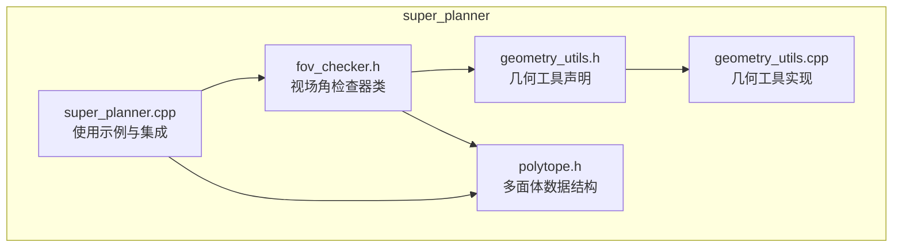
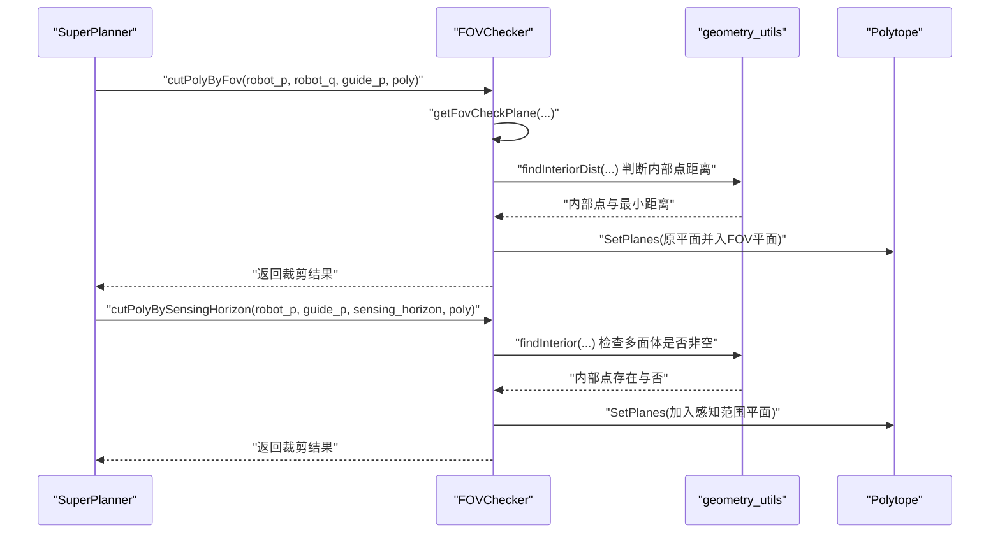
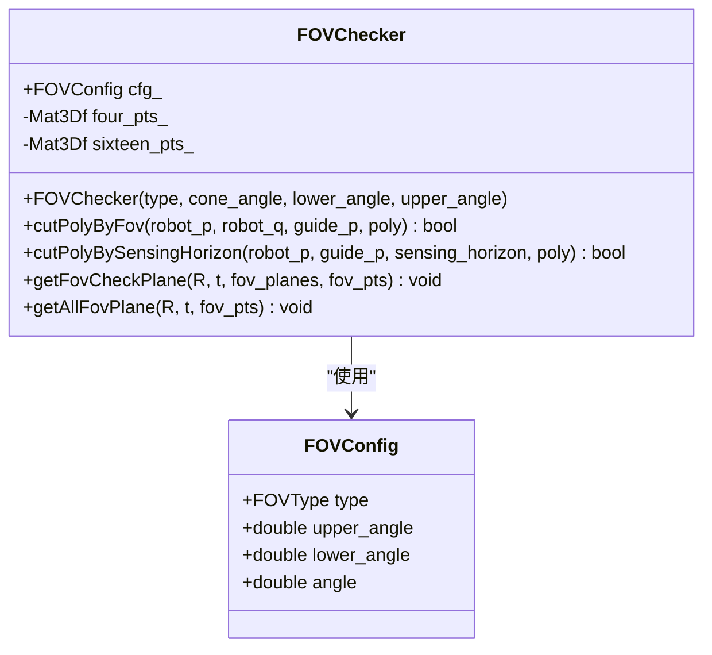
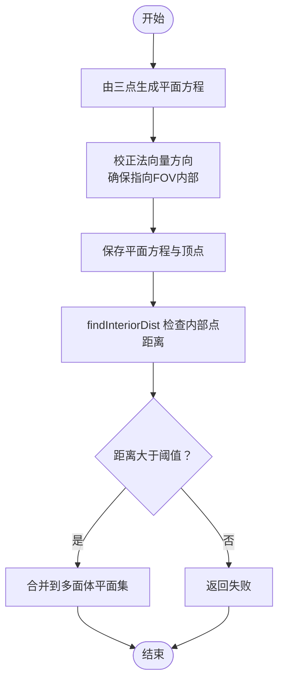
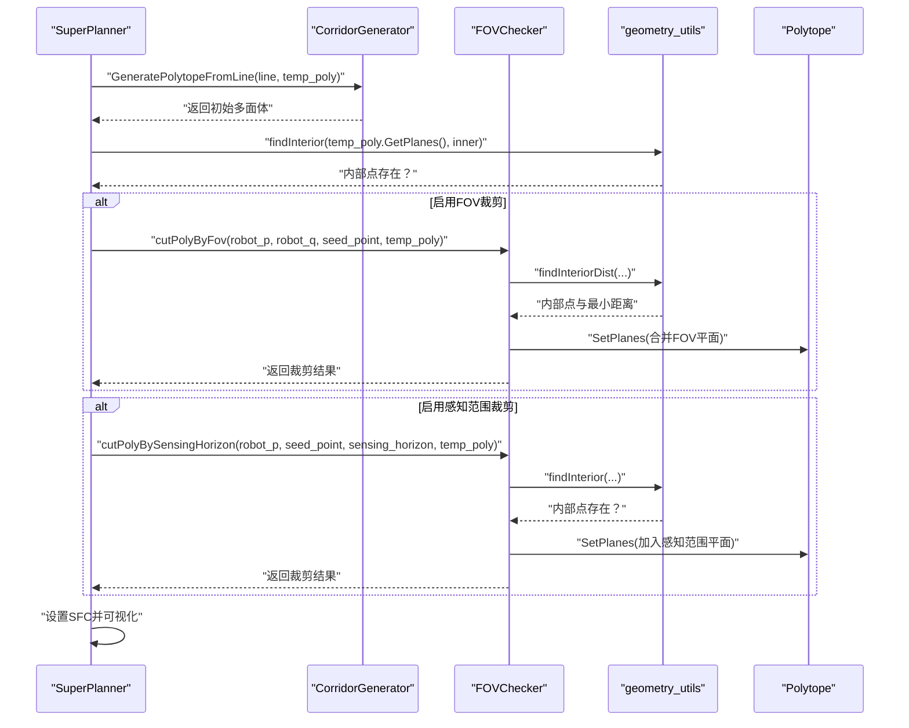
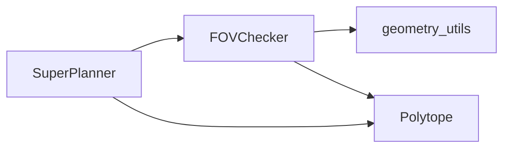

# 视场角检查器类

<cite>
**本文引用的文件**
- [fov_checker.h](file://src/SUPER/super_planner/include/super_core/fov_checker.h)
- [geometry_utils.h](file://src/SUPER/super_planner/include/utils/geometry/geometry_utils.h)
- [geometry_utils.cpp](file://src/SUPER/super_planner/src/utils/geometry_utils.cpp)
- [polytope.h](file://src/SUPER/super_planner/include/data_structure/base/polytope.h)
- [super_planner.cpp](file://src/SUPER/super_planner/src/super_core/super_planner.cpp)
</cite>

## 目录
1. [简介](#简介)
2. [项目结构](#项目结构)
3. [核心组件](#核心组件)
4. [架构总览](#架构总览)
5. [详细组件分析](#详细组件分析)
6. [依赖分析](#依赖分析)
7. [性能考虑](#性能考虑)
8. [故障排查指南](#故障排查指南)
9. [结论](#结论)
10. [附录](#附录)

## 简介
本文件为 SUPER 项目中的 FOVChecker 视场角检查器类的详细 API 文档。该类用于在无人机导航中基于几何约束对多面体（Polytope）进行裁剪，以确保轨迹或安全走廊（SFC）满足传感器视场角（FOV）与感知范围限制。文档涵盖以下内容：
- 视场角检查的核心算法与输入参数
- 可见性判断、遮挡检测与安全距离计算
- 与多面体数据结构及几何工具库的协作关系
- 完整的检查流程图与参数配置示例
- 实际代码示例展示如何使用 FOVChecker 进行安全检查

## 项目结构
FOVChecker 所属模块位于 SUPER 的 super_planner 包中，主要涉及以下文件：
- 视场角检查器类定义：src/SUPER/super_planner/include/super_core/fov_checker.h
- 几何工具库（含多面体内部点查找、平面方程生成等）：src/SUPER/super_planner/include/utils/geometry/geometry_utils.h 与 src/SUPER/super_planner/src/utils/geometry_utils.cpp
- 多面体数据结构定义：src/SUPER/super_planner/include/data_structure/base/polytope.h
- 使用示例（在 SuperPlanner 中调用 FOVChecker）：src/SUPER/super_planner/src/super_core/super_planner.cpp

**图表来源**
- [fov_checker.h](file://src/SUPER/super_planner/include/super_core/fov_checker.h#L1-L290)
- [geometry_utils.h](file://src/SUPER/super_planner/include/utils/geometry/geometry_utils.h#L1-L306)
- [geometry_utils.cpp](file://src/SUPER/super_planner/src/utils/geometry_utils.cpp#L1-L200)
- [polytope.h](file://src/SUPER/super_planner/include/data_structure/base/polytope.h#L1-L159)
- [super_planner.cpp](file://src/SUPER/super_planner/src/super_core/super_planner.cpp#L60-L259)

**章节来源**
- [fov_checker.h](file://src/SUPER/super_planner/include/super_core/fov_checker.h#L1-L290)
- [geometry_utils.h](file://src/SUPER/super_planner/include/utils/geometry/geometry_utils.h#L1-L306)
- [geometry_utils.cpp](file://src/SUPER/super_planner/src/utils/geometry_utils.cpp#L1-L200)
- [polytope.h](file://src/SUPER/super_planner/include/data_structure/base/polytope.h#L1-L159)
- [super_planner.cpp](file://src/SUPER/super_planner/src/super_core/super_planner.cpp#L60-L259)

## 核心组件
- FOVChecker 类：负责根据机器人位姿与视场参数生成 FOV 平面约束，并对多面体进行裁剪。
- FOVConfig 结构体：封装 FOV 类型与角度参数（锥形视场角、上下俯仰角）。
- 几何工具函数：提供平面方程生成、多面体内点查找、多面体相交判断等能力。
- Polytope 数据结构：存储多面体的平面方程集，支持设置/获取平面、点是否在内部等操作。

**章节来源**
- [fov_checker.h](file://src/SUPER/super_planner/include/super_core/fov_checker.h#L40-L290)
- [geometry_utils.h](file://src/SUPER/super_planner/include/utils/geometry/geometry_utils.h#L55-L306)
- [polytope.h](file://src/SUPER/super_planner/include/data_structure/base/polytope.h#L42-L101)

## 架构总览
FOVChecker 在 SUPER 导航管线中的作用：
- 输入：机器人位置 robot_p、姿态 robot_q（四元数）、引导点 guide_p、多面体 poly、感知范围 sensing_horizon。
- 处理：根据 FOV 类型（当前支持 OMNI 全向视场）生成上下两个切面的平面方程；结合感知范围生成裁剪平面。
- 输出：更新后的多面体（若裁剪后为空则返回失败），用于后续轨迹优化与安全走廊生成。

**图表来源**
- [super_planner.cpp](file://src/SUPER/super_planner/src/super_core/super_planner.cpp#L943-L957)
- [fov_checker.h](file://src/SUPER/super_planner/include/super_core/fov_checker.h#L66-L130)
- [geometry_utils.cpp](file://src/SUPER/super_planner/src/utils/geometry_utils.cpp#L552-L592)

**章节来源**
- [super_planner.cpp](file://src/SUPER/super_planner/src/super_core/super_planner.cpp#L943-L957)
- [fov_checker.h](file://src/SUPER/super_planner/include/super_core/fov_checker.h#L66-L130)
- [geometry_utils.cpp](file://src/SUPER/super_planner/src/utils/geometry_utils.cpp#L552-L592)

## 详细组件分析

### FOVChecker 类
- 角色定位：在多面体空间中引入视场角与感知范围的几何约束，保证候选轨迹或 SFC 不会进入传感器盲区或超出感知范围。
- 关键成员：
  - cfg_：FOV 配置（类型、锥形视场角、上下俯仰角）
  - four_pts_、sixteen_pts_：用于 OMNI 模式下的关键点集（上下切面与完整 FOV 平面）
- 关键方法：
  - cutPolyByFov：基于机器人位姿与引导点生成 FOV 平面，合并到多面体并验证内部点距离。
  - cutPolyBySensingHorizon：按感知范围生成平面，裁剪多面体并验证非空。
  - getFovCheckPlane/getAllFovPlane：生成 FOV 平面方程与顶点（用于 OMNI 模式）。
  - 构造函数：初始化 OMNI 模式的四点与十六点网格。

**图表来源**
- [fov_checker.h](file://src/SUPER/super_planner/include/super_core/fov_checker.h#L40-L290)

**章节来源**
- [fov_checker.h](file://src/SUPER/super_planner/include/super_core/fov_checker.h#L40-L290)

### 几何工具与多面体
- 几何工具函数：
  - FromPointsToPlane：由三点生成平面方程（法向量与 d 值）
  - findInterior/findInteriorDist：判断多面体是否存在内部点，以及内部点到边界的最小距离
  - getFovCheckPlane/GetFovPlanes：生成 FOV 平面（当前 OMNI 模式使用 getFovCheckPlane 生成上下两个切面）
- 多面体 Polytope：
  - 存储平面方程集（每行 [n_x, n_y, n_z, d]），支持设置/获取平面、点是否在内部、体积等操作

**图表来源**
- [geometry_utils.cpp](file://src/SUPER/super_planner/src/utils/geometry_utils.cpp#L442-L491)
- [geometry_utils.cpp](file://src/SUPER/super_planner/src/utils/geometry_utils.cpp#L552-L592)
- [fov_checker.h](file://src/SUPER/super_planner/include/super_core/fov_checker.h#L102-L130)

**章节来源**
- [geometry_utils.h](file://src/SUPER/super_planner/include/utils/geometry/geometry_utils.h#L198-L222)
- [geometry_utils.cpp](file://src/SUPER/super_planner/src/utils/geometry_utils.cpp#L442-L491)
- [geometry_utils.cpp](file://src/SUPER/super_planner/src/utils/geometry_utils.cpp#L552-L592)
- [polytope.h](file://src/SUPER/super_planner/include/data_structure/base/polytope.h#L42-L101)

### API 一览与参数说明
- cutPolyByFov(robot_p, robot_q, guide_p, poly) -> bool
  - 功能：基于机器人位姿与引导点生成 FOV 平面，合并到多面体并验证内部点距离
  - 输入：
    - robot_p：机器人位置（Vec3f）
    - robot_q：机器人姿态（四元数 Quatf）
    - guide_p：引导点位置（Vec3f）
    - poly：待裁剪的多面体（Polytope）
  - 返回：裁剪成功（非空）返回 true，否则 false
  - 注意：内部点距离小于小偏移量时视为不可行

- cutPolyBySensingHorizon(robot_p, guide_p, sensing_horizon, poly) -> bool
  - 功能：按感知范围生成平面，裁剪多面体并验证非空
  - 输入：
    - robot_p、guide_p：同上
    - sensing_horizon：感知范围（double）
  - 返回：裁剪后多面体非空返回 true，否则 false

- getFovCheckPlane(R, t, fov_planes, fov_pts) / getFovCheckPlane(R, t, fov_planes)
  - 功能：生成 OMNI 模式的上下两个切面的平面方程（可选返回顶点）
  - 输入：R（旋转矩阵）、t（平移向量）
  - 输出：fov_planes（每行 [n_x, n_y, n_z, d]）、fov_pts（可选）

- getAllFovPlane(R, t, fov_pts)
  - 功能：生成 OMNI 模式的完整 FOV 平面（用于可视化或更严格约束）
  - 输出：fov_pts（每个元素为三个顶点构成的三角面）

- 构造函数 FOVChecker(type, cone_angle, lower_angle, upper_angle)
  - 功能：初始化 OMNI 模式的关键点网格（四点与十六点）
  - 参数：
    - type：FOV 类型（当前支持 OMNI）
    - cone_angle：锥形视场角（度）
    - lower_angle：下俯角（度）
    - upper_angle：上仰角（度）

**章节来源**
- [fov_checker.h](file://src/SUPER/super_planner/include/super_core/fov_checker.h#L66-L130)
- [fov_checker.h](file://src/SUPER/super_planner/include/super_core/fov_checker.h#L139-L192)
- [fov_checker.h](file://src/SUPER/super_planner/include/super_core/fov_checker.h#L200-L284)

### 使用示例与流程
- 在 SuperPlanner 中的典型流程：
  - 生成初始 SFC（线段到多面体）
  - 若启用 FOV 裁剪：调用 cutPolyByFov
  - 若启用感知范围裁剪：调用 cutPolyBySensingHorizon
  - 将更新后的多面体作为备份轨迹优化的可行集

**图表来源**
- [super_planner.cpp](file://src/SUPER/super_planner/src/super_core/super_planner.cpp#L930-L965)
- [fov_checker.h](file://src/SUPER/super_planner/include/super_core/fov_checker.h#L66-L130)

**章节来源**
- [super_planner.cpp](file://src/SUPER/super_planner/src/super_core/super_planner.cpp#L930-L965)

## 依赖分析
- FOVChecker 依赖 geometry_utils 提供的平面生成与多面体内点判断能力
- FOVChecker 与 Polytope 协作，通过 SetPlanes 合并新的平面约束
- SuperPlanner 在生成备份轨迹前调用 FOVChecker 进行安全裁剪

**图表来源**
- [fov_checker.h](file://src/SUPER/super_planner/include/super_core/fov_checker.h#L27-L30)
- [geometry_utils.h](file://src/SUPER/super_planner/include/utils/geometry/geometry_utils.h#L55-L64)
- [polytope.h](file://src/SUPER/super_planner/include/data_structure/base/polytope.h#L42-L101)
- [super_planner.cpp](file://src/SUPER/super_planner/src/super_core/super_planner.cpp#L943-L957)

**章节来源**
- [fov_checker.h](file://src/SUPER/super_planner/include/super_core/fov_checker.h#L27-L30)
- [geometry_utils.h](file://src/SUPER/super_planner/include/utils/geometry/geometry_utils.h#L55-L64)
- [polytope.h](file://src/SUPER/super_planner/include/data_structure/base/polytope.h#L42-L101)
- [super_planner.cpp](file://src/SUPER/super_planner/src/super_core/super_planner.cpp#L943-L957)

## 性能考虑
- 平面数量与多面体复杂度：FOV 平面数量与多面体顶点数量直接影响求解效率。建议在 OMNI 模式下优先使用上下两个切面（getFovCheckPlane）以减少平面数量。
- 内部点查找：findInterior/findInteriorDist 基于线性规划求解，复杂度随平面数量增长。可通过合理设置感知范围与引导点减少无效裁剪。
- 数值稳定性：在平面法向量方向校正与小偏移量（如 cutPolyByFov 中的小偏移）处注意避免数值误差导致的误判。

[本节为通用指导，无需特定文件来源]

## 故障排查指南
- 裁剪后多面体为空
  - 可能原因：FOV 平面或感知范围平面过于严格，导致内部点不存在
  - 排查步骤：检查 cutPolyBySensingHorizon 返回值；确认 findInterior 返回 true
  - 相关实现参考：geometry_utils.cpp 中 findInterior 的判定逻辑
- 内部点距离过小
  - 可能原因：内部点接近边界，裁剪后可行空间不足
  - 排查步骤：检查 cutPolyByFov 中的内部点距离阈值；适当增大安全距离
- 视场角参数不合理
  - 可能原因：上下俯仰角过大或过小，导致 FOV 切面覆盖不当
  - 排查步骤：核对构造函数传入的角度参数（度）与内部弧度转换

**章节来源**
- [geometry_utils.cpp](file://src/SUPER/super_planner/src/utils/geometry_utils.cpp#L552-L592)
- [fov_checker.h](file://src/SUPER/super_planner/include/super_core/fov_checker.h#L102-L130)

## 结论
FOVChecker 通过引入视场角与感知范围的几何约束，有效提升了无人机导航中轨迹与安全走廊的安全性与可行性。其与 geometry_utils 和 Polytope 的紧密协作，使得裁剪过程既高效又稳定。在 OMNI 模式下，使用上下两个切面即可满足大多数场景需求；在需要更高精度时，可采用 getAllFovPlane 生成完整 FOV 平面。

[本节为总结，无需特定文件来源]

## 附录

### 参数配置示例（在 SuperPlanner 初始化中）
- 初始化 FOVChecker（OMNI 模式）
  - 示例路径：src/SUPER/super_planner/src/super_core/super_planner.cpp#L66-L69
  - 参数含义：FOV 类型、锥形视场角、下俯角、上仰角（单位：度）
  - 使用场景：在生成备份轨迹前进行 FOV 与感知范围裁剪

**章节来源**
- [super_planner.cpp](file://src/SUPER/super_planner/src/super_core/super_planner.cpp#L66-L69)

### 关键实现路径索引
- FOVChecker 类定义与方法
  - [fov_checker.h](file://src/SUPER/super_planner/include/super_core/fov_checker.h#L40-L290)
- 几何工具函数（平面生成、内部点判断）
  - [geometry_utils.h](file://src/SUPER/super_planner/include/utils/geometry/geometry_utils.h#L198-L222)
  - [geometry_utils.cpp](file://src/SUPER/super_planner/src/utils/geometry_utils.cpp#L442-L491)
  - [geometry_utils.cpp](file://src/SUPER/super_planner/src/utils/geometry_utils.cpp#L552-L592)
- 多面体数据结构
  - [polytope.h](file://src/SUPER/super_planner/include/data_structure/base/polytope.h#L42-L101)
- 使用示例（SuperPlanner 中的调用）
  - [super_planner.cpp](file://src/SUPER/super_planner/src/super_core/super_planner.cpp#L943-L957)