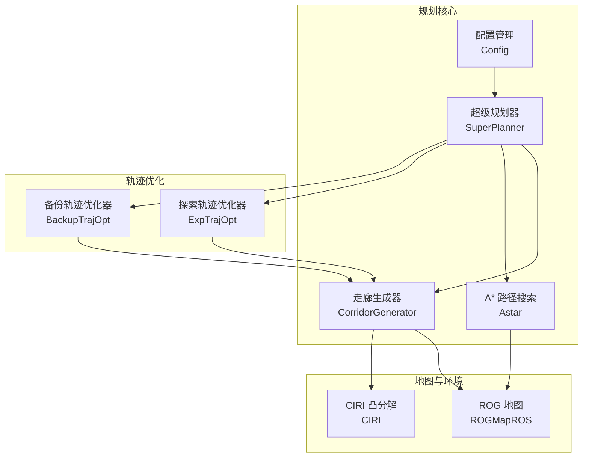
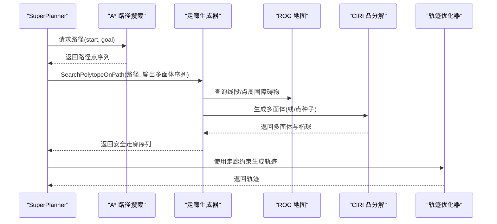
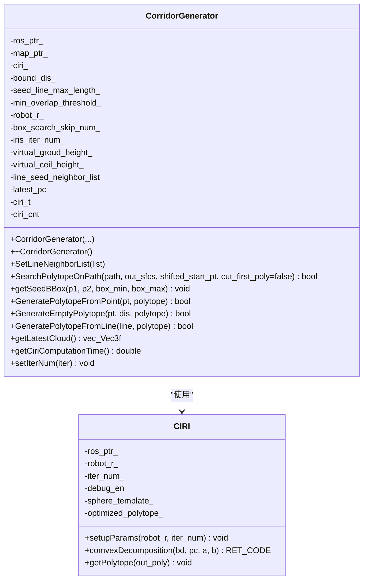
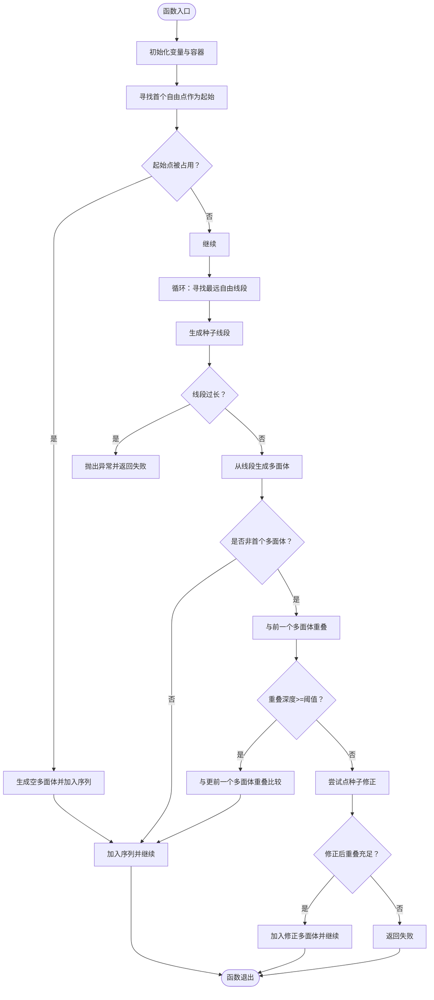
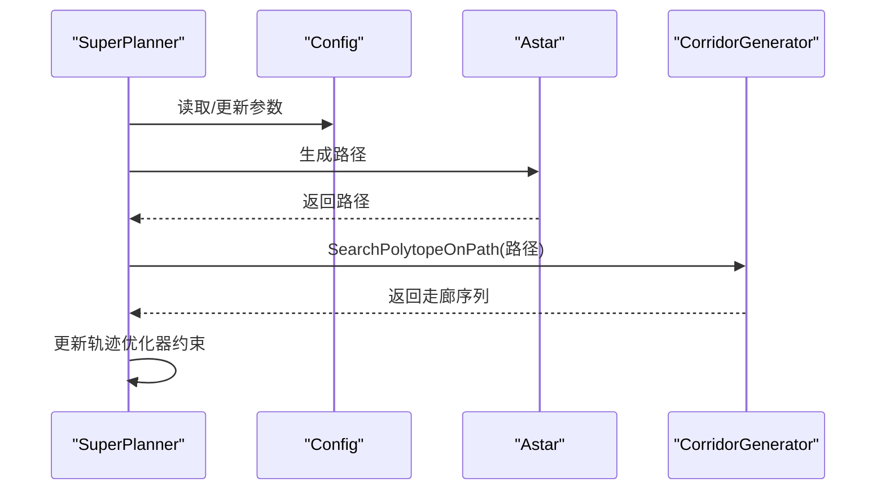
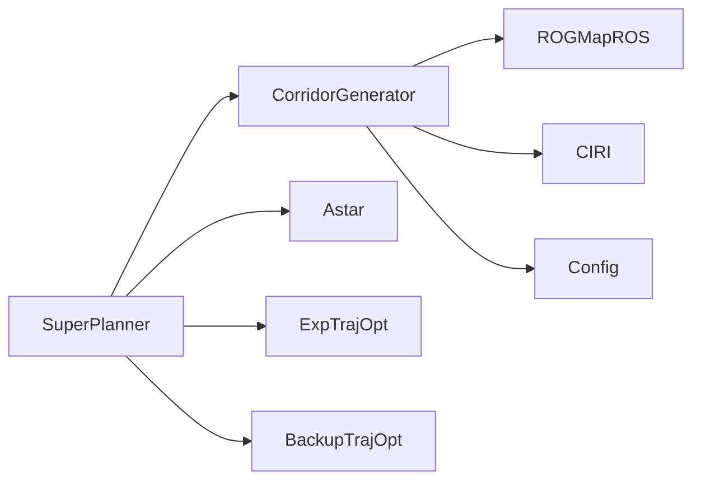

# 走廊生成器类

<cite>
**本文档引用的文件**
- [corridor_generator.h](file://src/SUPER/super_planner/include/super_core/corridor_generator.h)
- [corridor_generator.cpp](file://src/SUPER/super_planner/src/super_core/corridor_generator.cpp)
- [ciri.h](file://src/SUPER/super_planner/include/super_core/ciri.h)
- [ciri.cpp](file://src/SUPER/super_planner/src/super_core/ciri.cpp)
- [super_planner.h](file://src/SUPER/super_planner/include/super_core/super_planner.h)
- [super_planner.cpp](file://src/SUPER/super_planner/src/super_core/super_planner.cpp)
- [config.hpp](file://src/SUPER/super_planner/include/super_core/config.hpp)
</cite>

## 目录
1. [简介](#简介)
2. [项目结构](#项目结构)
3. [核心组件](#核心组件)
4. [架构概览](#架构概览)
5. [详细组件分析](#详细组件分析)
6. [依赖关系分析](#依赖关系分析)
7. [性能考量](#性能考量)
8. [故障排查指南](#故障排查指南)
9. [结论](#结论)
10. [附录](#附录)

## 简介
本文件为 SUPER 规划系统中的走廊生成器类（CorridorGenerator）提供全面的 API 文档与实现解析。重点涵盖：
- 走廊生成的核心算法与流程
- 输入参数（起始点、目标点、障碍物信息、地图与参数配置）
- 输出结果（安全走廊的多面体几何信息）
- 走廊边界计算、安全距离设置、重叠连续性保证
- 与 A* 路径搜索的协作机制与实时更新策略
- 参数配置示例与实际使用流程

## 项目结构
走廊生成器位于 SUPER 规划系统的 super_planner 模块中，与地图（ROGMap）、轨迹优化器、A* 搜索器协同工作。

**图表来源**
- [super_planner.h](file://src/SUPER/super_planner/include/super_core/super_planner.h#L59-L95)
- [corridor_generator.h](file://src/SUPER/super_planner/include/super_core/corridor_generator.h#L55-L192)
- [config.hpp](file://src/SUPER/super_planner/include/super_core/config.hpp#L44-L151)

**章节来源**
- [super_planner.h](file://src/SUPER/super_planner/include/super_core/super_planner.h#L59-L95)
- [corridor_generator.h](file://src/SUPER/super_planner/include/super_core/corridor_generator.h#L55-L192)
- [config.hpp](file://src/SUPER/super_planner/include/super_core/config.hpp#L44-L151)

## 核心组件
- CorridorGenerator：负责基于路径点序列生成安全走廊（凸多面体），并保证多面体之间的连续性与重叠度。
- CIRI：实现凸分解算法，从种子线/点出发，计算包含种子的最大椭球并生成对应的多面体。
- SuperPlanner：协调 A* 路径搜索与走廊生成，驱动轨迹优化器生成探索/备份轨迹。
- Config：集中管理规划器参数，包括走廊边界距离、线段最大长度、机器人半径、IRIS 迭代次数等。

**章节来源**
- [corridor_generator.h](file://src/SUPER/super_planner/include/super_core/corridor_generator.h#L55-L192)
- [ciri.h](file://src/SUPER/super_planner/include/super_core/ciri.h#L66-L142)
- [super_planner.h](file://src/SUPER/super_planner/include/super_core/super_planner.h#L59-L95)
- [config.hpp](file://src/SUPER/super_planner/include/super_core/config.hpp#L44-L151)

## 架构概览
走廊生成器在 SuperPlanner 的重规划流程中扮演关键角色：A* 生成路径 → CorridorGenerator 基于路径生成安全走廊 → 轨迹优化器利用走廊约束生成满足动力学与避障要求的轨迹。

**图表来源**
- [super_planner.cpp](file://src/SUPER/super_planner/src/super_core/super_planner.cpp#L700-L730)
- [corridor_generator.cpp](file://src/SUPER/super_planner/src/super_core/corridor_generator.cpp#L62-L216)
- [ciri.cpp](file://src/SUPER/super_planner/src/super_core/ciri.cpp#L44-L257)

**章节来源**
- [super_planner.cpp](file://src/SUPER/super_planner/src/super_core/super_planner.cpp#L700-L730)
- [corridor_generator.cpp](file://src/SUPER/super_planner/src/super_core/corridor_generator.cpp#L62-L216)
- [ciri.cpp](file://src/SUPER/super_planner/src/super_core/ciri.cpp#L44-L257)

## 详细组件分析

### CorridorGenerator 类 API 详解
- 构造函数
  - 参数：ROS 接口指针、ROG 地图指针、边界距离、种子线段最大长度、最小重叠阈值、虚拟地面/天花板高度、机器人半径、包围盒搜索跳过数、IRIS 迭代次数
  - 作用：初始化 CIRI 参数、设置安全边界与高度限制
- 成员方法
  - SetLineNeighborList：设置线段种子的邻域搜索列表
  - SearchPolytopeOnPath：沿路径搜索多面体，生成安全走廊序列，并返回偏移后的起始点
  - getSeedBBox：根据两点生成种子包围盒并扩展边界距离
  - GeneratePolytopeFromPoint：从单点生成多面体（空箱或由 CIRI 生成）
  - GenerateEmptyPolytope：生成指定范围的空多面体（用于起始点偏移场景）
  - GeneratePolytopeFromLine：从线段生成多面体（核心算法入口）
  - getLatestCloud：获取并清空内部最新点云缓存
  - getCiriComputationTime：获取 CIRI 平均计算时间并重置计时器
  - setIterNum：动态设置 IRIS 迭代次数

**图表来源**
- [corridor_generator.h](file://src/SUPER/super_planner/include/super_core/corridor_generator.h#L55-L192)
- [ciri.h](file://src/SUPER/super_planner/include/super_core/ciri.h#L66-L142)

**章节来源**
- [corridor_generator.h](file://src/SUPER/super_planner/include/super_core/corridor_generator.h#L55-L192)
- [corridor_generator.cpp](file://src/SUPER/super_planner/src/super_core/corridor_generator.cpp#L30-L47)

### 核心算法流程：SearchPolytopeOnPath
该方法沿路径逐步生成多面体，维护与前一个多面体的重叠，确保连续性；当重叠不足时尝试“点种子”修正，必要时回退并警告。

**图表来源**
- [corridor_generator.cpp](file://src/SUPER/super_planner/src/super_core/corridor_generator.cpp#L62-L216)

**章节来源**
- [corridor_generator.cpp](file://src/SUPER/super_planner/src/super_core/corridor_generator.cpp#L62-L216)

### 边界计算与安全距离
- getSeedBBox：以两点为对角生成包围盒，并按边界距离参数向外扩展，同时考虑虚拟地面/天花板高度与机器人半径。
- 机器人半径与 Z 轴上下限：在多面体生成前调整包围盒上下界，确保几何安全。

**章节来源**
- [corridor_generator.cpp](file://src/SUPER/super_planner/src/super_core/corridor_generator.cpp#L226-L233)
- [corridor_generator.cpp](file://src/SUPER/super_planner/src/super_core/corridor_generator.cpp#L242-L249)

### 与 A* 协作与实时更新
- SuperPlanner 在重规划流程中调用 A* 生成路径，随后调用 CorridorGenerator 的 SearchPolytopeOnPath 生成安全走廊。
- 配置参数通过 Config 类集中管理，支持运行时参数更新，影响走廊边界、线段长度、IRIS 迭代次数等。

**图表来源**
- [super_planner.cpp](file://src/SUPER/super_planner/src/super_core/super_planner.cpp#L700-L730)
- [config.hpp](file://src/SUPER/super_planner/include/super_core/config.hpp#L158-L228)

**章节来源**
- [super_planner.cpp](file://src/SUPER/super_planner/src/super_core/super_planner.cpp#L700-L730)
- [config.hpp](file://src/SUPER/super_planner/include/super_core/config.hpp#L158-L228)

### 参数配置示例
- 关键参数（来自配置文件与运行时更新）：
  - corridor_bound_dis：走廊边界距离
  - corridor_line_max_length：走廊线段最大长度
  - robot_r：机器人半径
  - iris_iter_num：IRIS 算法迭代次数
  - safe_corridor_line_max_length：安全走廊线段最大长度
  - obs_skip_num：障碍物跳过数量
- 运行时参数更新：通过 ROS2 参数服务器动态更新轨迹优化边界与惩罚项等。

**章节来源**
- [config.hpp](file://src/SUPER/super_planner/include/super_core/config.hpp#L114-L127)
- [config.hpp](file://src/SUPER/super_planner/include/super_core/config.hpp#L158-L228)

### 实际使用示例（步骤说明）
- 初始化 SuperPlanner 时创建 CorridorGenerator，并设置线段邻居列表。
- 重规划流程中：
  1) A* 生成路径
  2) 调用 SearchPolytopeOnPath 生成走廊序列
  3) 将走廊传递给轨迹优化器
  4) 可选：通过 getLatestCloud 获取最新点云进行可视化或调试
  5) 可选：通过 getCiriComputationTime 获取 CIRI 平均耗时

**章节来源**
- [super_planner.cpp](file://src/SUPER/super_planner/src/super_core/super_planner.cpp#L50-L58)
- [corridor_generator.cpp](file://src/SUPER/super_planner/src/super_core/corridor_generator.cpp#L62-L216)

## 依赖关系分析
- CorridorGenerator 依赖：
  - ROG 地图接口（查询线段自由性、包围盒搜索、占用判断）
  - CIRI 凸分解算法（生成多面体与椭球）
  - 配置参数（边界距离、线段长度、机器人半径、IRIS 迭代次数）
- SuperPlanner 协调：
  - A* 路径搜索与走廊生成的衔接
  - 轨迹优化器的约束注入
  - 参数的集中管理与运行时更新

**图表来源**
- [corridor_generator.h](file://src/SUPER/super_planner/include/super_core/corridor_generator.h#L55-L192)
- [super_planner.h](file://src/SUPER/super_planner/include/super_core/super_planner.h#L59-L95)

**章节来源**
- [corridor_generator.h](file://src/SUPER/super_planner/include/super_core/corridor_generator.h#L55-L192)
- [super_planner.h](file://src/SUPER/super_planner/include/super_core/super_planner.h#L59-L95)

## 性能考量
- CIRI 平均耗时统计：通过 getCiriComputationTime 获取平均耗时并自动重置计数器，便于性能监控与参数调优。
- 线段最大长度与重叠阈值：直接影响走廊生成的连续性与计算复杂度，需结合地图密度与机器人半径合理设置。
- 包围盒搜索跳过数：可减少点云查询开销，但需平衡精度与性能。

**章节来源**
- [corridor_generator.h](file://src/SUPER/super_planner/include/super_core/corridor_generator.h#L174-L182)
- [corridor_generator.cpp](file://src/SUPER/super_planner/src/super_core/corridor_generator.cpp#L392-L398)

## 故障排查指南
- 线段过长异常：当种子线段超过允许的最大长度时抛出异常并返回失败，需检查路径质量与参数设置。
- 无法生成连续走廊：当重叠深度低于阈值且点种子修正仍不足时返回失败，建议增大重叠阈值或检查地图更新。
- CIRI 失败：当 CIRI 返回失败或生成空多面体时，检查包围盒边界、机器人半径与障碍物分布。
- 运行时参数未生效：确认参数服务器键名与 Config.updateRuntimeParams 中的映射一致。

**章节来源**
- [corridor_generator.cpp](file://src/SUPER/super_planner/src/super_core/corridor_generator.cpp#L123-L128)
- [corridor_generator.cpp](file://src/SUPER/super_planner/src/super_core/corridor_generator.cpp#L147-L164)
- [ciri.cpp](file://src/SUPER/super_planner/src/super_core/ciri.cpp#L232-L248)
- [config.hpp](file://src/SUPER/super_planner/include/super_core/config.hpp#L158-L228)

## 结论
CorridorGenerator 通过“线段/点种子 + CIRI 凸分解”的组合，在保证安全距离与连续性的前提下高效生成多面体走廊。其与 A*、SuperPlanner、轨迹优化器形成清晰的职责分层，配合 Config 的集中参数管理与运行时更新能力，能够适应动态环境下的实时规划需求。

## 附录
- 关键 API 路径参考
  - [构造与成员函数声明](file://src/SUPER/super_planner/include/super_core/corridor_generator.h#L99-L192)
  - [SearchPolytopeOnPath 实现](file://src/SUPER/super_planner/src/super_core/corridor_generator.cpp#L62-L216)
  - [GeneratePolytopeFromLine 实现](file://src/SUPER/super_planner/src/super_core/corridor_generator.cpp#L351-L423)
  - [CIRI 凸分解实现](file://src/SUPER/super_planner/src/super_core/ciri.cpp#L44-L257)
  - [SuperPlanner 中的走廊生成调用](file://src/SUPER/super_planner/src/super_core/super_planner.cpp#L700-L730)
  - [配置参数定义与更新](file://src/SUPER/super_planner/include/super_core/config.hpp#L114-L127)