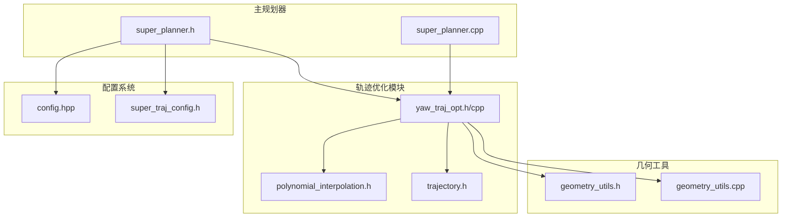
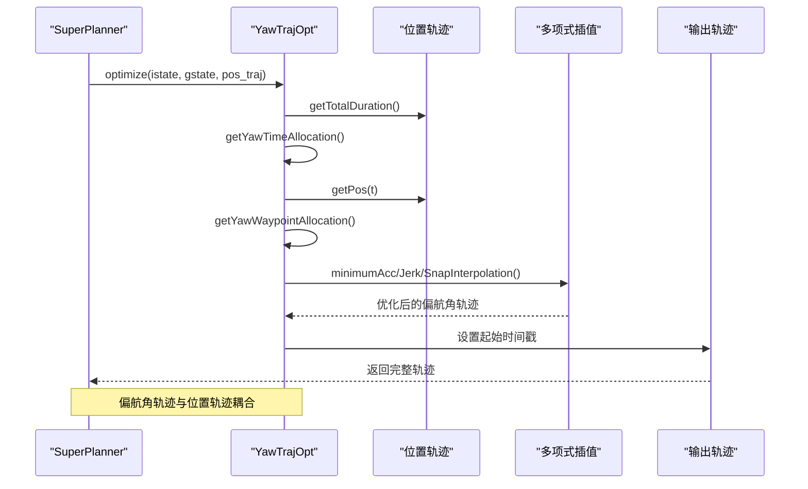
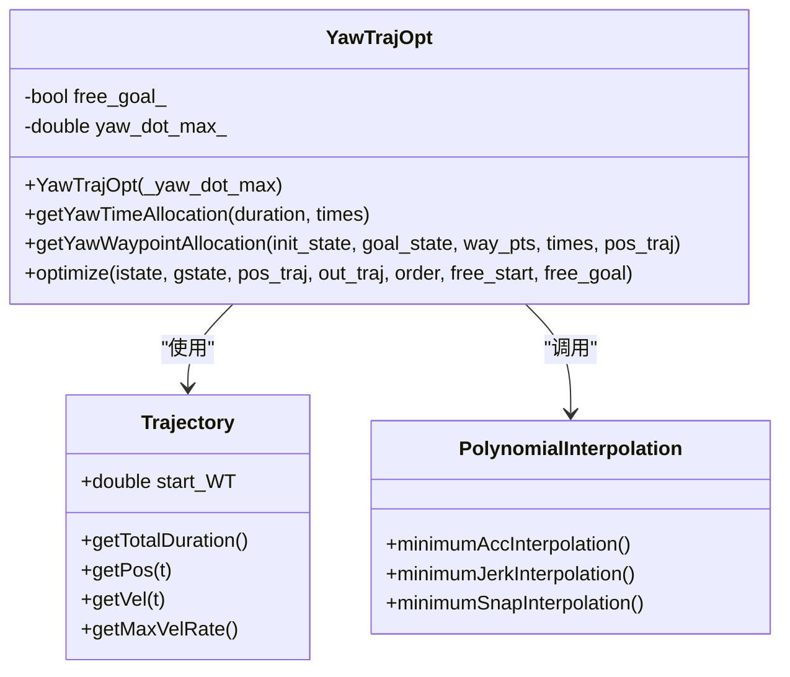
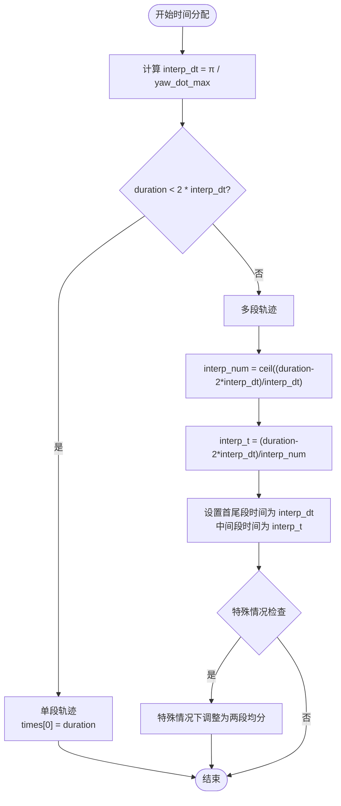
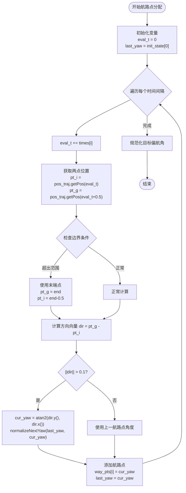
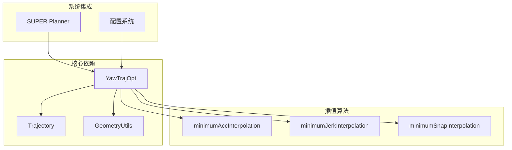

# 偏航角轨迹优化器 (YawTrajOpt)

<cite>
**本文档引用的文件**
- [yaw_traj_opt.h](file://src/SUPER/super_planner/include/traj_opt/yaw_traj_opt.h)
- [yaw_traj_opt.cpp](file://src/SUPER/super_planner/src/traj_opt/yaw_traj_opt.cpp)
- [trajectory.h](file://src/SUPER/super_planner/include/data_structure/base/trajectory.h)
- [polynomial_interpolation.h](file://src/SUPER/super_planner/include/utils/optimization/polynomial_interpolation.h)
- [geometry_utils.h](file://src/SUPER/super_planner/include/utils/geometry/geometry_utils.h)
- [geometry_utils.cpp](file://src/SUPER/super_planner/src/utils/geometry_utils.cpp)
- [super_planner.h](file://src/SUPER/super_planner/include/super_core/super_planner.h)
- [super_planner.cpp](file://src/SUPER/super_planner/src/super_core/super_planner.cpp)
- [config.hpp](file://src/SUPER/super_planner/include/traj_opt/config.hpp)
- [super_traj_config.h](file://src/SUPER/super_planner/include/traj_opt/super_traj_config.h)
</cite>

## 目录
1. [简介](#简介)
2. [项目结构](#项目结构)
3. [核心组件](#核心组件)
4. [架构概览](#架构概览)
5. [详细组件分析](#详细组件分析)
6. [依赖关系分析](#依赖关系分析)
7. [性能考虑](#性能考虑)
8. [故障排除指南](#故障排除指南)
9. [结论](#结论)
10. [附录](#附录)

## 简介

YawTrajOpt是SUPER规划系统中的偏航角轨迹优化器，专门负责生成无人机的偏航角轨迹。该优化器基于位置轨迹进行偏航角规划，确保无人机能够平滑地跟随位置轨迹并保持合理的偏航角变化率。

该优化器具有以下特点：
- 基于位置轨迹的偏航角规划
- 支持多种插值算法（加速度、加加速度、加加加速度）
- 自适应时间分配策略
- 偏航角连续性保证
- 与位置轨迹的紧密耦合

## 项目结构

YawTrajOpt位于SUPER项目的轨迹优化模块中，主要文件组织如下：



**图表来源**
- [yaw_traj_opt.h](file://src/SUPER/super_planner/include/traj_opt/yaw_traj_opt.h#L1-L71)
- [yaw_traj_opt.cpp](file://src/SUPER/super_planner/src/traj_opt/yaw_traj_opt.cpp#L1-L195)
- [super_planner.h](file://src/SUPER/super_planner/include/super_core/super_planner.h#L1-L298)

**章节来源**
- [yaw_traj_opt.h](file://src/SUPER/super_planner/include/traj_opt/yaw_traj_opt.h#L1-L71)
- [super_planner.h](file://src/SUPER/super_planner/include/super_core/super_planner.h#L1-L298)

## 核心组件

YawTrajOpt类是整个偏航角优化系统的核心，包含以下关键组件：

### 主要成员变量
- `free_goal_`: 目标偏航角自由度控制标志
- `yaw_dot_max_`: 最大偏航角速度限制（rad/s）

### 核心接口
- 构造函数：初始化最大偏航角速度
- `getYawTimeAllocation`: 时间分配算法
- `getYawWaypointAllocation`: 偏航角航路点分配
- `optimize`: 主优化函数

**章节来源**
- [yaw_traj_opt.h](file://src/SUPER/super_planner/include/traj_opt/yaw_traj_opt.h#L44-L71)
- [yaw_traj_opt.cpp](file://src/SUPER/super_planner/src/traj_opt/yaw_traj_opt.cpp#L99-L100)

## 架构概览

YawTrajOpt在整个SUPER规划系统中扮演着关键角色，作为位置轨迹的补充优化器：



**图表来源**
- [super_planner.cpp](file://src/SUPER/super_planner/src/super_core/super_planner.cpp#L337-L406)
- [yaw_traj_opt.cpp](file://src/SUPER/super_planner/src/traj_opt/yaw_traj_opt.cpp#L102-L194)

## 详细组件分析

### YawTrajOpt类设计



**图表来源**
- [yaw_traj_opt.h](file://src/SUPER/super_planner/include/traj_opt/yaw_traj_opt.h#L44-L71)
- [trajectory.h](file://src/SUPER/super_planner/include/data_structure/base/trajectory.h#L56-L173)
- [polynomial_interpolation.h](file://src/SUPER/super_planner/include/utils/optimization/polynomial_interpolation.h#L25-L259)

#### 时间分配算法

时间分配是YawTrajOpt的核心特性之一，采用自适应策略：



**图表来源**
- [yaw_traj_opt.cpp](file://src/SUPER/super_planner/src/traj_opt/yaw_traj_opt.cpp#L29-L51)

#### 偏航角航路点分配

航路点分配基于位置轨迹的局部方向：



**图表来源**
- [yaw_traj_opt.cpp](file://src/SUPER/super_planner/src/traj_opt/yaw_traj_opt.cpp#L53-L97)

#### 优化算法选择

根据order参数选择不同的插值算法：

| Order | 插值算法 | 连续性 | 特点 |
|-------|----------|--------|------|
| 3 | 最小加速度 | 位置连续 | 计算简单，适合快速应用 |
| 5 | 最小加加速度 | 速度连续 | 平滑性更好，计算复杂度中等 |
| 7 | 最小加加加速度 | 加速度连续 | 最佳平滑性，计算最复杂 |

**章节来源**
- [yaw_traj_opt.cpp](file://src/SUPER/super_planner/src/traj_opt/yaw_traj_opt.cpp#L144-L174)

### 与位置轨迹的耦合关系

YawTrajOpt与位置轨迹存在紧密的耦合关系：

1. **时间同步**：偏航角轨迹与位置轨迹共享相同的时间轴
2. **空间耦合**：偏航角基于位置轨迹的局部方向计算
3. **边界条件**：起始和终止偏航角可以自由或固定
4. **实时性**：偏航角计算依赖于位置轨迹的实时评估

**章节来源**
- [yaw_traj_opt.cpp](file://src/SUPER/super_planner/src/traj_opt/yaw_traj_opt.cpp#L102-L194)

## 依赖关系分析

YawTrajOpt的依赖关系图：



**图表来源**
- [yaw_traj_opt.h](file://src/SUPER/super_planner/include/traj_opt/yaw_traj_opt.h#L29-L34)
- [super_planner.h](file://src/SUPER/super_planner/include/super_core/super_planner.h#L68-L70)

**章节来源**
- [yaw_traj_opt.h](file://src/SUPER/super_planner/include/traj_opt/yaw_traj_opt.h#L29-L34)
- [super_planner.h](file://src/SUPER/super_planner/include/super_core/super_planner.h#L68-L70)

## 性能考虑

### 计算复杂度分析

1. **时间分配算法**：O(1)，常数时间复杂度
2. **航路点分配**：O(n)，n为时间间隔数量
3. **插值优化**：O(n³)，取决于分段数量和插值算法
4. **整体复杂度**：O(n³)，主要受插值算法影响

### 内存使用
- 时间向量：O(n)
- 航路点向量：O(n)
- 插值矩阵：O(n²)

### 优化建议
1. **合理设置yaw_dot_max**：避免过小导致过多分段
2. **选择合适的插值阶数**：平衡平滑性和计算效率
3. **预估轨迹长度**：减少不必要的重新计算

## 故障排除指南

### 常见问题及解决方案

#### 偏航角跳变问题
**症状**：偏航角在某些点出现180度跳变
**原因**：角度规范化失败
**解决**：检查`normalizeNextYaw`函数调用

#### 偏航角速度过大
**症状**：最大偏航角速度超过限制
**原因**：yaw_dot_max设置过小或轨迹过于急转弯
**解决**：增大yaw_dot_max或优化位置轨迹

#### 航路点计算失败
**症状**：航路点向量为空
**原因**：位置轨迹长度不足或方向向量过小
**解决**：检查位置轨迹的有效性

**章节来源**
- [yaw_traj_opt.cpp](file://src/SUPER/super_planner/src/traj_opt/yaw_traj_opt.cpp#L186-L190)
- [geometry_utils.cpp](file://src/SUPER/super_planner/src/utils/geometry_utils.cpp#L269-L285)

## 结论

YawTrajOpt作为SUPER规划系统中的重要组件，提供了高效的偏航角轨迹优化能力。其设计特点包括：

1. **自适应时间分配**：根据轨迹长度和约束自动调整分段策略
2. **多级平滑优化**：支持不同阶数的插值算法满足不同平滑需求
3. **实时耦合**：与位置轨迹紧密集成，确保轨迹的一致性
4. **参数可配置**：支持最大偏航角速度等关键参数的动态调整

该优化器在无人机轨迹规划中发挥着关键作用，为实现精确、平滑的飞行轨迹提供了可靠的技术支撑。

## 附录

### API参考

#### 构造函数
```cpp
explicit YawTrajOpt(const double &_yaw_dot_max);
```

#### 核心方法
```cpp
bool optimize(
    const Vec4f &istate_in,
    const Vec4f &gstate_in,
    const Trajectory &pos_traj,
    Trajectory &out_traj,
    const int &order = 3,
    const bool &free_start = false,
    const bool &free_goal = true
);
```

#### 配置参数
- `yaw_dot_max_`：最大偏航角速度限制（默认10 rad/s）
- `free_start`：是否允许自由起始偏航角
- `free_goal`：是否允许自由目标偏航角

### 使用示例

#### 基本使用流程
1. 创建YawTrajOpt实例
2. 准备位置轨迹
3. 调用optimize方法
4. 获取优化后的偏航角轨迹

#### 参数配置建议
- **高精度应用**：使用order=7，yaw_dot_max=8-10 rad/s
- **实时应用**：使用order=3，yaw_dot_max=6-8 rad/s
- **平衡应用**：使用order=5，yaw_dot_max=7-9 rad/s