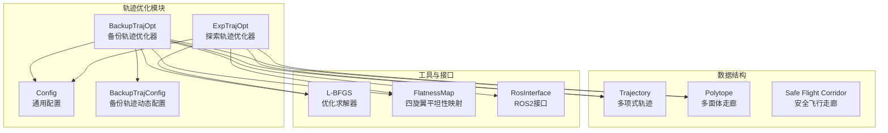
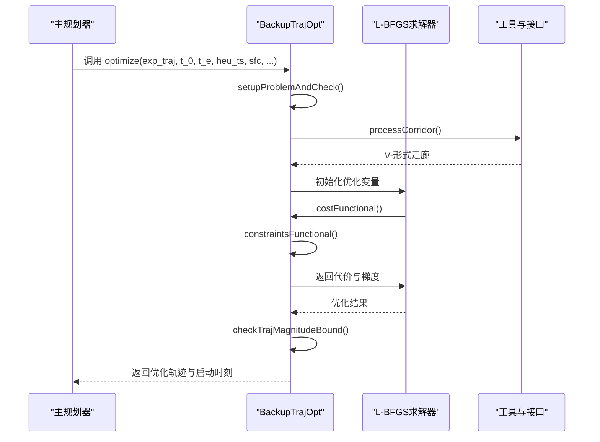
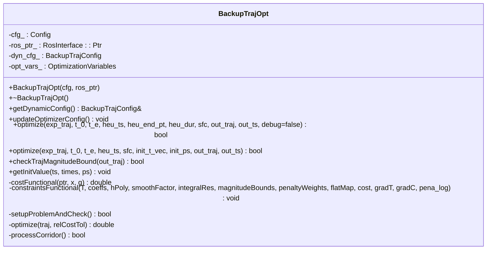
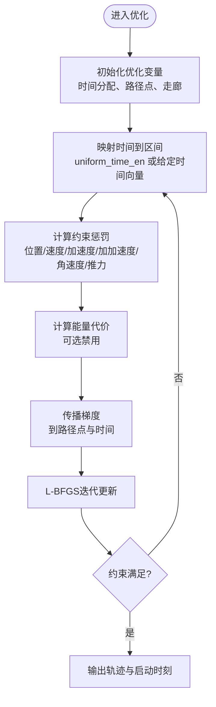
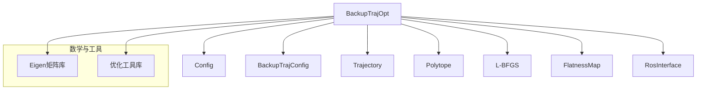

# 备份轨迹优化器 (BackupTrajOpt)

<cite>
**本文引用的文件**
- [backup_traj_optimizer_s4.h](file://src/SUPER/super_planner/include/traj_opt/backup_traj_optimizer_s4.h)
- [backup_traj_optimizer_s4.cpp](file://src/SUPER/super_planner/src/traj_opt/backup_traj_optimizer_s4.cpp)
- [backup_traj_config.h](file://src/SUPER/super_planner/include/traj_opt/backup_traj_config.h)
- [config.hpp](file://src/SUPER/super_planner/include/traj_opt/config.hpp)
- [API_REFERENCE.md](file://src/SUPER/super_planner/docs/API_REFERENCE.md)
- [CONFIGURATION_GUIDE.md](file://src/SUPER/super_planner/docs/CONFIGURATION_GUIDE.md)
- [trajectory_types.md](file://src/SUPER/super_planner/docs/trajectory_types.md)
- [backup_traj.h](file://src/SUPER/super_planner/include/data_structure/backup_traj.h)
</cite>

## 目录
1. [简介](#简介)
2. [项目结构](#项目结构)
3. [核心组件](#核心组件)
4. [架构概览](#架构概览)
5. [详细组件分析](#详细组件分析)
6. [依赖关系分析](#依赖关系分析)
7. [性能考虑](#性能考虑)
8. [故障排查指南](#故障排查指南)
9. [结论](#结论)
10. [附录](#附录)

## 简介
BackupTrajOpt 是 SUPER 规划系统中的备份轨迹优化器，负责在主规划器无法满足实时性或遇到紧急情况时，快速生成一条安全可行的备用轨迹。该优化器采用 L-BFGS 迭代优化，结合走廊约束和动力学边界，确保生成轨迹在安全飞行走廊内且满足最大速度、加速度、加加速度、角速度和推力限制。

## 项目结构
BackupTrajOpt 位于 SUPER 项目的轨迹优化模块中，与探索轨迹优化器（ExpTrajOpt）共同构成双层轨迹优化策略。其核心文件包括：
- 头文件：backup_traj_optimizer_s4.h（类声明与接口）
- 实现文件：backup_traj_optimizer_s4.cpp（算法实现与优化流程）
- 配置类：backup_traj_config.h（动态参数配置）
- 基础配置：config.hpp（通用轨迹优化配置）
- 文档：API_REFERENCE.md、CONFIGURATION_GUIDE.md、trajectory_types.md
- 数据结构：backup_traj.h（备份轨迹数据容器）

图表来源
- [backup_traj_optimizer_s4.h](file://src/SUPER/super_planner/include/traj_opt/backup_traj_optimizer_s4.h#L44-L212)
- [backup_traj_optimizer_s4.cpp](file://src/SUPER/super_planner/src/traj_opt/backup_traj_optimizer_s4.cpp#L24-L830)
- [backup_traj_config.h](file://src/SUPER/super_planner/include/traj_opt/backup_traj_config.h#L31-L206)
- [config.hpp](file://src/SUPER/super_planner/include/traj_opt/config.hpp#L32-L182)

章节来源
- [backup_traj_optimizer_s4.h](file://src/SUPER/super_planner/include/traj_opt/backup_traj_optimizer_s4.h#L44-L212)
- [backup_traj_optimizer_s4.cpp](file://src/SUPER/super_planner/src/traj_opt/backup_traj_optimizer_s4.cpp#L24-L830)
- [backup_traj_config.h](file://src/SUPER/super_planner/include/traj_opt/backup_traj_config.h#L31-L206)
- [config.hpp](file://src/SUPER/super_planner/include/traj_opt/config.hpp#L32-L182)

## 核心组件
- BackupTrajOpt：备份轨迹优化器主体，提供构造函数、初始化、优化接口 optimize()、动态配置更新等核心功能。
- BackupTrajConfig：备份轨迹优化器的动态参数配置类，支持通过 ROS2 参数服务器实时调整。
- OptimizationVariables：内部优化变量结构体，封装优化过程中的状态、梯度、走廊、多项式系数等。
- Trajectory：多项式轨迹数据结构，提供位置、速度、加速度、加加速度等状态查询。
- Polytope/Polyhedron：安全飞行走廊的数学表示，支持 H-形式和 V-形式枚举。

章节来源
- [backup_traj_optimizer_s4.h](file://src/SUPER/super_planner/include/traj_opt/backup_traj_optimizer_s4.h#L52-L212)
- [backup_traj_optimizer_s4.cpp](file://src/SUPER/super_planner/src/traj_opt/backup_traj_optimizer_s4.cpp#L32-L516)
- [backup_traj_config.h](file://src/SUPER/super_planner/include/traj_opt/backup_traj_config.h#L37-L206)
- [config.hpp](file://src/SUPER/super_planner/include/traj_opt/config.hpp#L46-L182)

## 架构概览
BackupTrajOpt 的工作流程分为以下阶段：
1. 初始化与配置：从 Config 和 BackupTrajConfig 加载参数，设置优化变量。
2. 走廊预处理：将 H-形式的走廊转换为 V-形式，便于后续优化。
3. 问题设定：根据约束类型（路径点/走廊）设置空间维度与初始值。
4. 优化求解：使用 L-BFGS 迭代求解，计算代价函数与梯度，满足约束条件。
5. 结果验证：检查轨迹是否满足边界条件，记录日志并输出结果。

图表来源
- [backup_traj_optimizer_s4.cpp](file://src/SUPER/super_planner/src/traj_opt/backup_traj_optimizer_s4.cpp#L408-L584)
- [backup_traj_optimizer_s4.cpp](file://src/SUPER/super_planner/src/traj_opt/backup_traj_optimizer_s4.cpp#L256-L390)

章节来源
- [backup_traj_optimizer_s4.cpp](file://src/SUPER/super_planner/src/traj_opt/backup_traj_optimizer_s4.cpp#L408-L584)
- [backup_traj_optimizer_s4.cpp](file://src/SUPER/super_planner/src/traj_opt/backup_traj_optimizer_s4.cpp#L256-L390)

## 详细组件分析

### BackupTrajOpt 类分析
BackupTrajOpt 提供了完整的备份轨迹优化接口，支持两种 optimize() 重载版本，分别用于基础优化和带初值的优化。其关键成员包括：
- 构造函数：接收 Config 和 RosInterface 指针，初始化优化变量与日志文件。
- getDynamicConfig()：返回 BackupTrajConfig 的引用，用于外部访问与修改动态参数。
- updateOptimizerConfig()：将动态参数同步到优化器内部参数。
- optimize()：核心优化接口，支持两种调用方式。
- checkTrajMagnitudeBound()：检查轨迹的最大速度与加速度是否超出阈值。
- getInitValue()：获取上次优化的初值，用于热启动。

图表来源
- [backup_traj_optimizer_s4.h](file://src/SUPER/super_planner/include/traj_opt/backup_traj_optimizer_s4.h#L52-L212)
- [backup_traj_optimizer_s4.cpp](file://src/SUPER/super_planner/src/traj_opt/backup_traj_optimizer_s4.cpp#L586-L637)

章节来源
- [backup_traj_optimizer_s4.h](file://src/SUPER/super_planner/include/traj_opt/backup_traj_optimizer_s4.h#L52-L212)
- [backup_traj_optimizer_s4.cpp](file://src/SUPER/super_planner/src/traj_opt/backup_traj_optimizer_s4.cpp#L586-L637)

### 优化算法与代价函数
BackupTrajOpt 使用 L-BFGS 迭代优化，代价函数由能量项与约束惩罚项组成。约束惩罚项包括：
- 位置约束：走廊边界惩罚
- 速度约束：最大速度惩罚
- 加速度约束：最大加速度惩罚
- 加加速度约束：最大加加速度惩罚
- 角速度约束：最大角速度惩罚
- 推力约束：基于四旋翼平坦性映射的推力惩罚
- 时间惩罚：总时间与时间段惩罚

图表来源
- [backup_traj_optimizer_s4.cpp](file://src/SUPER/super_planner/src/traj_opt/backup_traj_optimizer_s4.cpp#L256-L390)
- [backup_traj_optimizer_s4.cpp](file://src/SUPER/super_planner/src/traj_opt/backup_traj_optimizer_s4.cpp#L32-L253)

章节来源
- [backup_traj_optimizer_s4.cpp](file://src/SUPER/super_planner/src/traj_opt/backup_traj_optimizer_s4.cpp#L256-L390)
- [backup_traj_optimizer_s4.cpp](file://src/SUPER/super_planner/src/traj_opt/backup_traj_optimizer_s4.cpp#L32-L253)

### 备份轨迹与期望轨迹的区别
- 期望轨迹（ExpTrajOpt）：追求全局最优性能，强调时间最短、轨迹平滑，适用于正常飞行场景。
- 备份轨迹（BackupTrajOpt）：优先保证安全性与快速响应，参数更激进，适合紧急避障与动态环境下的局部重规划。
- 应用场景：当主规划器无法满足实时性或检测到未知障碍物时，切换到备份轨迹以确保安全。

章节来源
- [trajectory_types.md](file://src/SUPER/super_planner/docs/trajectory_types.md#L1-L83)
- [API_REFERENCE.md](file://src/SUPER/super_planner/docs/API_REFERENCE.md#L379-L441)

### 触发备份轨迹生成的时机
- 主规划器无法在给定时间内完成规划
- 检测到未知障碍物或环境突变
- 轨迹质量不满足安全阈值
- 需要快速局部重规划以避免碰撞

章节来源
- [API_REFERENCE.md](file://src/SUPER/super_planner/docs/API_REFERENCE.md#L520-L558)

### 优化接口 optimize() 详解
BackupTrajOpt 提供两个 optimize() 重载：
- 基础版本：输入探索轨迹、时间范围、启发式启动时刻与终点、安全飞行走廊，输出优化轨迹与启动时刻。
- 带初值版本：额外输入初始时间向量与路径点集合，用于热启动加速收敛。

章节来源
- [backup_traj_optimizer_s4.h](file://src/SUPER/super_planner/include/traj_opt/backup_traj_optimizer_s4.h#L183-L202)
- [backup_traj_optimizer_s4.cpp](file://src/SUPER/super_planner/src/traj_opt/backup_traj_optimizer_s4.cpp#L655-L737)
- [backup_traj_optimizer_s4.cpp](file://src/SUPER/super_planner/src/traj_opt/backup_traj_optimizer_s4.cpp#L765-L829)

### 配置参数说明
BackupTrajOpt 的配置参数分为三类：
- 边界约束参数：最大速度、最大加速度、最大加加速度等。
- 惩罚系数参数：时间惩罚、时间段惩罚、位置惩罚、速度惩罚、加速度惩罚、加加速度惩罚、角速度惩罚、推力惩罚等。
- 优化参数：优化精度、平滑参数、积分分辨率、是否启用均匀时间分配、位置约束类型、分段数量、是否禁用能量代价等。

章节来源
- [backup_traj_config.h](file://src/SUPER/super_planner/include/traj_opt/backup_traj_config.h#L42-L107)
- [CONFIGURATION_GUIDE.md](file://src/SUPER/super_planner/docs/CONFIGURATION_GUIDE.md#L80-L113)
- [config.hpp](file://src/SUPER/super_planner/include/traj_opt/config.hpp#L71-L98)

### 实际使用示例
以下示例展示了备份轨迹在紧急避障与路径冲突场景下的应用方法：
- 紧急避障：当检测到前方障碍物时，使用 BackupTrajOpt 在给定时间窗口内生成一条安全轨迹。
- 路径冲突：当与其他无人机或动态障碍物发生潜在冲突时，快速生成规避轨迹。

章节来源
- [API_REFERENCE.md](file://src/SUPER/super_planner/docs/API_REFERENCE.md#L562-L673)

## 依赖关系分析
BackupTrajOpt 的依赖关系如下：
- 内部依赖：Config、BackupTrajConfig、Trajectory、Polytope、L-BFGS、FlatnessMap、RosInterface。
- 外部依赖：Eigen 矩阵库、ROS2 接口、优化工具库。

图表来源
- [backup_traj_optimizer_s4.h](file://src/SUPER/super_planner/include/traj_opt/backup_traj_optimizer_s4.h#L26-L42)
- [backup_traj_optimizer_s4.cpp](file://src/SUPER/super_planner/src/traj_opt/backup_traj_optimizer_s4.cpp#L24-L30)

章节来源
- [backup_traj_optimizer_s4.h](file://src/SUPER/super_planner/include/traj_opt/backup_traj_optimizer_s4.h#L26-L42)
- [backup_traj_optimizer_s4.cpp](file://src/SUPER/super_planner/src/traj_opt/backup_traj_optimizer_s4.cpp#L24-L30)

## 性能考虑
- 优化精度与速度：通过调整 opt_accuracy、integral_reso、smooth_eps 等参数平衡性能与质量。
- 分段数量：piece_num 越小，优化速度越快，但轨迹质量可能下降。
- 均匀时间分配：uniform_time_en=true 适合高速动态场景，收敛更快。
- 能量代价：block_energy_cost=true 可禁用能量代价，提升响应速度。

章节来源
- [CONFIGURATION_GUIDE.md](file://src/SUPER/super_planner/docs/CONFIGURATION_GUIDE.md#L80-L113)
- [backup_traj_optimizer_s4.cpp](file://src/SUPER/super_planner/src/traj_opt/backup_traj_optimizer_s4.cpp#L442-L584)

## 故障排查指南
- 优化失败：检查走廊有效性、惩罚权重是否过大、初值是否合理。
- 轨迹越界：提高 penna_pos 或降低 opt_accuracy。
- 轨迹抖动：增加 penna_jerk 或 smooth_eps。
- 规划缓慢：降低分辨率或精度，或启用均匀时间分配。

章节来源
- [CONFIGURATION_GUIDE.md](file://src/SUPER/super_planner/docs/CONFIGURATION_GUIDE.md#L325-L384)
- [backup_traj_optimizer_s4.cpp](file://src/SUPER/super_planner/src/traj_opt/backup_traj_optimizer_s4.cpp#L531-L550)

## 结论
BackupTrajOpt 作为 SUPER 规划系统的重要组成部分，通过高效的 L-BFGS 优化与严格的约束处理，在保证安全的前提下实现了快速的局部重规划能力。其动态参数配置机制使得系统能够适应不同场景的需求，为无人机在复杂环境中的安全飞行提供了可靠保障。

## 附录
- 数据结构：BackupTraj（备份轨迹容器），包含位置轨迹、偏航轨迹、安全飞行走廊与相关标志位。
- 文档：API_REFERENCE.md、CONFIGURATION_GUIDE.md、trajectory_types.md 提供了详细的 API 说明与配置指南。

章节来源
- [backup_traj.h](file://src/SUPER/super_planner/include/data_structure/backup_traj.h#L35-L154)
- [API_REFERENCE.md](file://src/SUPER/super_planner/docs/API_REFERENCE.md#L379-L441)
- [CONFIGURATION_GUIDE.md](file://src/SUPER/super_planner/docs/CONFIGURATION_GUIDE.md#L80-L113)
- [trajectory_types.md](file://src/SUPER/super_planner/docs/trajectory_types.md#L1-L83)