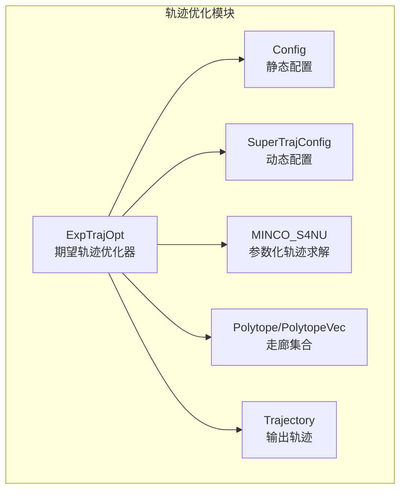
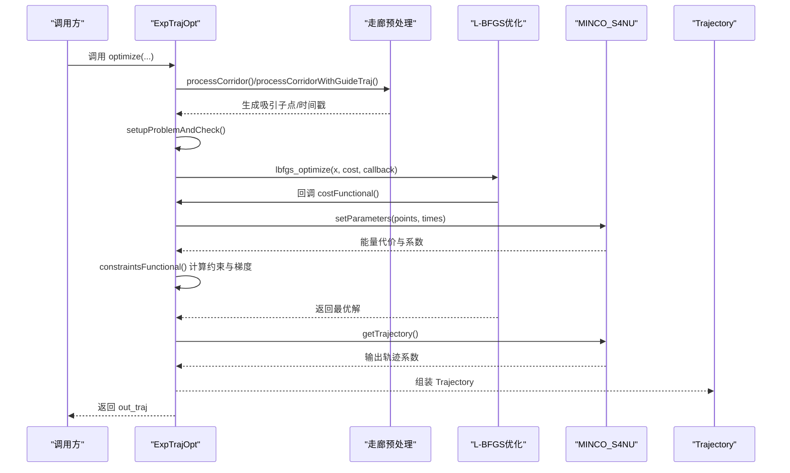
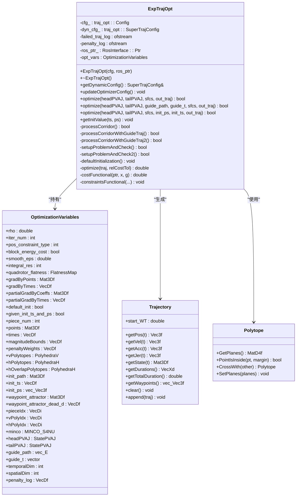
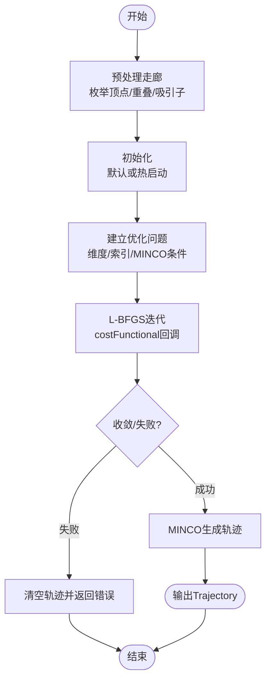
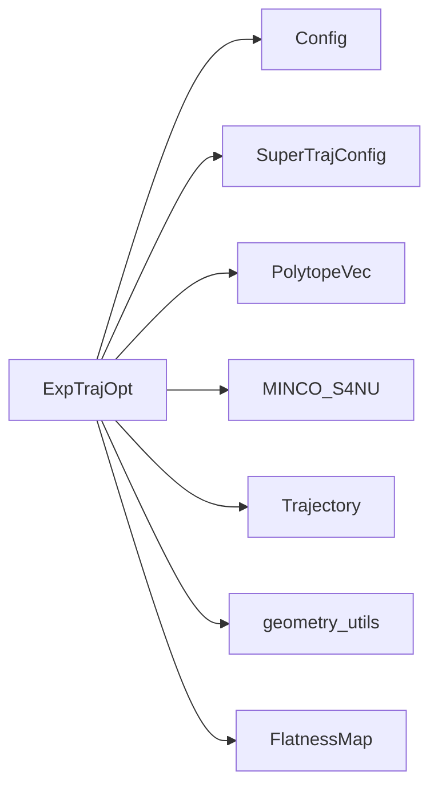

# 期望轨迹优化器 (ExpTrajOpt)

<cite>
**本文档引用的文件**
- [exp_traj_optimizer_s4.h](file://src/SUPER/super_planner/include/traj_opt/exp_traj_optimizer_s4.h)
- [exp_traj_optimizer_s4.cpp](file://src/SUPER/super_planner/src/traj_opt/exp_traj_optimizer_s4.cpp)
- [config.hpp](file://src/SUPER/super_planner/include/traj_opt/config.hpp)
- [super_traj_config.h](file://src/SUPER/super_planner/include/traj_opt/super_traj_config.h)
- [trajectory.h](file://src/SUPER/super_planner/include/data_structure/base/trajectory.h)
- [polytope.h](file://src/SUPER/super_planner/include/data_structure/base/polytope.h)
- [minco.h](file://src/SUPER/super_planner/include/utils/optimization/minco.h)
- [minco.cpp](file://src/SUPER/super_planner/src/utils/minco.cpp)
</cite>

## 目录
1. [简介](#简介)
2. [项目结构](#项目结构)
3. [核心组件](#核心组件)
4. [架构总览](#架构总览)
5. [详细组件分析](#详细组件分析)
6. [依赖关系分析](#依赖关系分析)
7. [性能考虑](#性能考虑)
8. [故障排查指南](#故障排查指南)
9. [结论](#结论)
10. [附录](#附录)

## 简介
本文件为 SUPER 轨迹优化模块中的期望轨迹优化器（ExpTrajOpt）提供完整、系统的 API 文档与算法说明。ExpTrajOpt 基于 L-BFGS 非线性优化框架，结合 MINCO 参数化轨迹求解器，对四旋翼飞行器在走廊（SFC）约束下的期望轨迹进行优化，目标是最小化能量代价并满足速度、加速度、加加速度、角速度与推力等物理约束。

该优化器支持多种优化入口：
- 仅给定起点/终点状态与走廊集合的优化；
- 提供引导轨迹（guide_path 与 guide_t）的热启动优化；
- 提供显式初始点列与时间段的热启动优化。

同时，提供动态参数配置接口，允许在运行时更新边界与惩罚权重等关键参数，保证在线场景下的灵活性。

## 项目结构
ExpTrajOpt 所在的关键目录与文件如下：
- 头文件：src/SUPER/super_planner/include/traj_opt/exp_traj_optimizer_s4.h
- 实现：src/SUPER/super_planner/src/traj_opt/exp_traj_optimizer_s4.cpp
- 配置：src/SUPER/super_planner/include/traj_opt/config.hpp
- 动态配置：src/SUPER/super_planner/include/traj_opt/super_traj_config.h
- 数据结构：Trajectory（轨迹）、Polytope（多面体/走廊）
- 优化器：MINCO_S4NU（参数化轨迹求解）

图表来源
- [exp_traj_optimizer_s4.h](file://src/SUPER/super_planner/include/traj_opt/exp_traj_optimizer_s4.h#L55-L371)
- [exp_traj_optimizer_s4.cpp](file://src/SUPER/super_planner/src/traj_opt/exp_traj_optimizer_s4.cpp#L762-L820)
- [config.hpp](file://src/SUPER/super_planner/include/traj_opt/config.hpp#L50-L182)
- [super_traj_config.h](file://src/SUPER/super_planner/include/traj_opt/super_traj_config.h#L37-L179)
- [trajectory.h](file://src/SUPER/super_planner/include/data_structure/base/trajectory.h#L56-L176)
- [polytope.h](file://src/SUPER/super_planner/include/data_structure/base/polytope.h#L42-L159)
- [minco.h](file://src/SUPER/super_planner/include/utils/optimization/minco.h#L1-L32)

章节来源
- [exp_traj_optimizer_s4.h](file://src/SUPER/super_planner/include/traj_opt/exp_traj_optimizer_s4.h#L55-L371)
- [exp_traj_optimizer_s4.cpp](file://src/SUPER/super_planner/src/traj_opt/exp_traj_optimizer_s4.cpp#L762-L820)

## 核心组件
- 构造函数与析构
  - 构造函数：接收静态配置 Config 与 ROS 接口指针，初始化日志与动态参数。
  - 析构函数：关闭调试日志文件。
- 优化接口
  - optimize(headPVAJ, tailPVAJ, sfcs, out_traj)：基于走廊集合的优化。
  - optimize(headPVAJ, tailPVAJ, guide_path, guide_t, sfcs, out_traj)：带引导轨迹的热启动优化。
  - optimize(headPVAJ, tailPVAJ, sfcs, init_ps, init_ts, out_traj)：带显式初始点列与时间段的热启动优化。
- 配置管理
  - getDynamicConfig()：返回动态配置 SuperTrajConfig 的引用，便于外部读取与修改。
  - updateOptimizerConfig()：将动态配置同步到优化器内部参数。
  - getInitValue(ts, ps)：获取当前内部初始化的时间段与路径点。
- 内部变量与辅助
  - OptimizationVariables：封装优化变量、走廊、引导轨迹、MINCO 求解器、梯度等。
  - processCorridor()/processCorridorWithGuideTraj()/processCorridorWithGuideTraj2()：走廊预处理与吸引子点生成。
  - setupProblemAndCheck()/setupProblemAndCheck2()：问题规模与维度计算、索引构建。
  - defaultInitialization()：默认初始化策略。
  - costFunctional()/constraintsFunctional()：代价与约束函数及其梯度回调。

章节来源
- [exp_traj_optimizer_s4.h](file://src/SUPER/super_planner/include/traj_opt/exp_traj_optimizer_s4.h#L329-L368)
- [exp_traj_optimizer_s4.cpp](file://src/SUPER/super_planner/src/traj_opt/exp_traj_optimizer_s4.cpp#L762-L820)
- [exp_traj_optimizer_s4.cpp](file://src/SUPER/super_planner/src/traj_opt/exp_traj_optimizer_s4.cpp#L891-L966)
- [exp_traj_optimizer_s4.cpp](file://src/SUPER/super_planner/src/traj_opt/exp_traj_optimizer_s4.cpp#L993-L1083)
- [exp_traj_optimizer_s4.cpp](file://src/SUPER/super_planner/src/traj_opt/exp_traj_optimizer_s4.cpp#L968-L991)

## 架构总览
ExpTrajOpt 将“几何走廊”与“物理约束”耦合在一个统一的非线性优化框架中，采用 L-BFGS 迭代求解，MINCO 作为参数化轨迹求解器负责能量代价与轨迹生成。

图表来源
- [exp_traj_optimizer_s4.cpp](file://src/SUPER/super_planner/src/traj_opt/exp_traj_optimizer_s4.cpp#L614-L760)
- [exp_traj_optimizer_s4.cpp](file://src/SUPER/super_planner/src/traj_opt/exp_traj_optimizer_s4.cpp#L251-L344)
- [minco.cpp](file://src/SUPER/super_planner/src/utils/minco.cpp#L513-L638)

## 详细组件分析

### 类与成员概览

图表来源
- [exp_traj_optimizer_s4.h](file://src/SUPER/super_planner/include/traj_opt/exp_traj_optimizer_s4.h#L55-L106)
- [exp_traj_optimizer_s4.h](file://src/SUPER/super_planner/include/traj_opt/exp_traj_optimizer_s4.h#L329-L368)
- [trajectory.h](file://src/SUPER/super_planner/include/data_structure/base/trajectory.h#L56-L176)
- [polytope.h](file://src/SUPER/super_planner/include/data_structure/base/polytope.h#L42-L103)

章节来源
- [exp_traj_optimizer_s4.h](file://src/SUPER/super_planner/include/traj_opt/exp_traj_optimizer_s4.h#L55-L106)
- [exp_traj_optimizer_s4.h](file://src/SUPER/super_planner/include/traj_opt/exp_traj_optimizer_s4.h#L329-L368)
- [trajectory.h](file://src/SUPER/super_planner/include/data_structure/base/trajectory.h#L56-L176)
- [polytope.h](file://src/SUPER/super_planner/include/data_structure/base/polytope.h#L42-L103)

### 优化流程与算法要点
- 位置约束类型
  - WAYPOINT=1：直接对路径点进行优化，空间维度为 3×(piece_num-1)。
  - CORRIDOR=2（默认）：在走廊顶点表示下进行优化，空间维度由每个走廊片段的顶点数决定。
- 走廊处理
  - processCorridor：枚举每个走廊的顶点，构建相对坐标系下的 V 多面体；计算相邻走廊的重叠多面体与吸引子点及半径。
  - processCorridorWithGuideTraj/processCorridorWithGuideTraj2：在存在引导轨迹时，优先匹配引导点与吸引子点，并据此分配时间段。
- 初始值生成
  - defaultInitialization：按最大速度估算每段时间，路径点设为吸引子点。
  - setInitPsAndTs：显式设置初始路径点与时间段。
- 优化变量设置
  - setupProblemAndCheck/setupProblemAndCheck2：确定 piece_num、times、points 的尺寸；计算 pieceIdx、vPolyIdx、hPolyIdx；设置 MINCO 条件与梯度缓冲区。
- 代价与约束
  - costFunctional：组合能量代价与约束惩罚，传播梯度至优化变量。
  - constraintsFunctional：沿轨迹采样积分点，计算位置、速度、加速度、加加速度、角速度、推力等惩罚项与梯度。
- 输出轨迹
  - optimize：调用 L-BFGS 求解，成功后通过 MINCO 生成 Trajectory。

图表来源
- [exp_traj_optimizer_s4.cpp](file://src/SUPER/super_planner/src/traj_opt/exp_traj_optimizer_s4.cpp#L354-L405)
- [exp_traj_optimizer_s4.cpp](file://src/SUPER/super_planner/src/traj_opt/exp_traj_optimizer_s4.cpp#L503-L509)
- [exp_traj_optimizer_s4.cpp](file://src/SUPER/super_planner/src/traj_opt/exp_traj_optimizer_s4.cpp#L511-L595)
- [exp_traj_optimizer_s4.cpp](file://src/SUPER/super_planner/src/traj_opt/exp_traj_optimizer_s4.cpp#L614-L760)
- [exp_traj_optimizer_s4.cpp](file://src/SUPER/super_planner/src/traj_opt/exp_traj_optimizer_s4.cpp#L251-L344)

章节来源
- [exp_traj_optimizer_s4.cpp](file://src/SUPER/super_planner/src/traj_opt/exp_traj_optimizer_s4.cpp#L354-L405)
- [exp_traj_optimizer_s4.cpp](file://src/SUPER/super_planner/src/traj_opt/exp_traj_optimizer_s4.cpp#L503-L509)
- [exp_traj_optimizer_s4.cpp](file://src/SUPER/super_planner/src/traj_opt/exp_traj_optimizer_s4.cpp#L511-L595)
- [exp_traj_optimizer_s4.cpp](file://src/SUPER/super_planner/src/traj_opt/exp_traj_optimizer_s4.cpp#L614-L760)
- [exp_traj_optimizer_s4.cpp](file://src/SUPER/super_planner/src/traj_opt/exp_traj_optimizer_s4.cpp#L251-L344)

### API 参考

- 构造函数
  - ExpTrajOpt(const Config&, const RosInterface::Ptr&)
  - 作用：初始化日志、动态参数与内部优化变量。
  - 注意：需要传入已配置好的 Config 与 RosInterface 指针。
  
  章节来源
  - [exp_traj_optimizer_s4.cpp](file://src/SUPER/super_planner/src/traj_opt/exp_traj_optimizer_s4.cpp#L762-L820)

- 析构函数
  - ~ExpTrajOpt()
  - 作用：关闭调试日志文件。
  
  章节来源
  - [exp_traj_optimizer_s4.cpp](file://src/SUPER/super_planner/src/traj_opt/exp_traj_optimizer_s4.cpp#L817-L820)

- 动态配置接口
  - SuperTrajConfig& getDynamicConfig()
    - 作用：返回动态配置引用，便于外部读取与修改。
  - void updateOptimizerConfig()
    - 作用：将动态配置同步到优化器内部参数（边界、权重、积分分辨率、约束类型等）。
  
  章节来源
  - [exp_traj_optimizer_s4.h](file://src/SUPER/super_planner/include/traj_opt/exp_traj_optimizer_s4.h#L336-L338)
  - [exp_traj_optimizer_s4.cpp](file://src/SUPER/super_planner/src/traj_opt/exp_traj_optimizer_s4.cpp#L968-L991)

- 优化接口
  - bool optimize(const StatePVAJ&, const StatePVAJ&, PolytopeVec&, Trajectory&)
    - 作用：在仅给定起点/终点与走廊集合的情况下进行优化。
  - bool optimize(const StatePVAJ&, const StatePVAJ&, const vec_E<Vec3f>&, const vector<double>&, PolytopeVec&, Trajectory&)
    - 作用：提供引导轨迹（路径点序列与对应时间戳），进行热启动优化。
  - bool optimize(const StatePVAJ&, const StatePVAJ&, PolytopeVec&, const vec_Vec3f&, const VecDf&, Trajectory&)
    - 作用：提供显式初始路径点与时间段，进行热启动优化。
  
  章节来源
  - [exp_traj_optimizer_s4.cpp](file://src/SUPER/super_planner/src/traj_opt/exp_traj_optimizer_s4.cpp#L891-L966)
  - [exp_traj_optimizer_s4.cpp](file://src/SUPER/super_planner/src/traj_opt/exp_traj_optimizer_s4.cpp#L993-L1083)

- 初始化查询
  - void getInitValue(VecDf&, vec_Vec3f&) const
    - 作用：获取当前内部初始化的时间段与路径点（用于调试或后续优化）。
  
  章节来源
  - [exp_traj_optimizer_s4.h](file://src/SUPER/super_planner/include/traj_opt/exp_traj_optimizer_s4.h#L357-L360)

- 关键内部方法
  - bool setInitPsAndTs(const vec_Vec3f&, const vector<double>&)
    - 作用：设置显式初始路径点与时间段。
  - double optimize(Trajectory&, const double&)
    - 作用：执行 L-BFGS 优化，返回最小化代价。
  - static double costFunctional(void*, const VecDf&, VecDf&)
    - 作用：L-BFGS 回调，计算代价与梯度。
  - static void constraintsFunctional(..., double&, VecDf&, Mat3Df&, VecDf&)
    - 作用：沿轨迹采样，计算约束惩罚与梯度。
  
  章节来源
  - [exp_traj_optimizer_s4.cpp](file://src/SUPER/super_planner/src/traj_opt/exp_traj_optimizer_s4.cpp#L597-L612)
  - [exp_traj_optimizer_s4.cpp](file://src/SUPER/super_planner/src/traj_opt/exp_traj_optimizer_s4.cpp#L614-L760)
  - [exp_traj_optimizer_s4.cpp](file://src/SUPER/super_planner/src/traj_opt/exp_traj_optimizer_s4.cpp#L45-L244)

### 参数与配置详解

- 静态配置（Config）
  - 位置约束类型：pos_constraint_type（WAYPOINT=1, CORRIDOR=2）
  - 能量代价开关：block_energy_cost
  - 边界限制：max_vel, max_acc, max_jerk, max_omg, min_acc_thr, max_acc_thr
  - 惩罚权重：penna_t, penna_pos, penna_vel, penna_acc, penna_jerk, penna_attract, penna_omg, penna_thr
  - 优化细节：opt_accuracy, smooth_eps, integral_reso, print_optimizer_log, save_log_en
  - 平坦性参数：mass, dh, dv, grav, cp, v_eps
  
  章节来源
  - [config.hpp](file://src/SUPER/super_planner/include/traj_opt/config.hpp#L50-L182)

- 动态配置（SuperTrajConfig）
  - 边界与惩罚：max_vel, max_acc, max_jerk, penna_t, penna_pos, penna_vel, penna_acc, penna_jerk, penna_attract, penna_omg, penna_thr
  - 优化参数：opt_accuracy, smooth_eps, integral_reso
  - 算法配置：pos_constraint_type, block_energy_cost
  - 动态参数回调：支持 ROS2 参数服务器更新
  
  章节来源
  - [super_traj_config.h](file://src/SUPER/super_planner/include/traj_opt/super_traj_config.h#L37-L179)

- 优化变量（OptimizationVariables）
  - 优化目标：时间权重 rho、位置约束类型、是否禁用能量代价、平滑参数 smooth_eps、积分分辨率 integral_res
  - 几何与走廊：vPolytopes, hPolytopes, hOverlapPolytopes, waypoint_attractor, waypoint_attractor_dead_d
  - 初始化：init_path, init_ts, init_ps
  - MINCO：headPVAJ, tailPVAJ, guide_path, guide_t, minco
  
  章节来源
  - [exp_traj_optimizer_s4.h](file://src/SUPER/super_planner/include/traj_opt/exp_traj_optimizer_s4.h#L62-L106)

### 关键数据结构

- Trajectory
  - 作用：存储分段多项式轨迹，提供位置/速度/加速度/加加速度查询与总时长统计。
  - 关键方法：getPos/getVel/getAcc/getJer/getState、getDurations/getTotalDuration、getWaypoints、clear/append。
  
  章节来源
  - [trajectory.h](file://src/SUPER/super_planner/include/data_structure/base/trajectory.h#L56-L176)

- Polytope/PolytopeVec
  - 作用：表示走廊（H-表示），支持平面集获取、点内判断、交叉与简化。
  - 关键方法：GetPlanes、PointIsInside、CrossWith、SimplifySFC。
  
  章节来源
  - [polytope.h](file://src/SUPER/super_planner/include/data_structure/base/polytope.h#L42-L159)

- MINCO_S4NU
  - 作用：参数化轨迹求解器，支持能量代价、系数与梯度查询，设置起点/终点状态与参数。
  
  章节来源
  - [minco.h](file://src/SUPER/super_planner/include/utils/optimization/minco.h#L1-L32)
  - [minco.cpp](file://src/SUPER/super_planner/src/utils/minco.cpp#L500-L683)

## 依赖关系分析
- 组件耦合
  - ExpTrajOpt 依赖 Config/SuperTrajConfig 提供参数，依赖 PolytopeVec 表达走廊，依赖 MINCO_S4NU 计算能量与轨迹，依赖 Trajectory 输出结果。
- 外部依赖
  - L-BFGS 求解器（lbfgs::lbfgs_optimize）
  - 几何工具（geometry_utils）：枚举顶点、寻找内点、简化走廊
  - 扁平性映射（flatness::FlatnessMap）：将轨迹状态映射为角速度与推力
  

图表来源
- [exp_traj_optimizer_s4.h](file://src/SUPER/super_planner/include/traj_opt/exp_traj_optimizer_s4.h#L45-L53)
- [exp_traj_optimizer_s4.cpp](file://src/SUPER/super_planner/src/traj_opt/exp_traj_optimizer_s4.cpp#L24-L44)
- [minco.h](file://src/SUPER/super_planner/include/utils/optimization/minco.h#L26-L32)

章节来源
- [exp_traj_optimizer_s4.h](file://src/SUPER/super_planner/include/traj_opt/exp_traj_optimizer_s4.h#L45-L53)
- [exp_traj_optimizer_s4.cpp](file://src/SUPER/super_planner/src/traj_opt/exp_traj_optimizer_s4.cpp#L24-L44)

## 性能考虑
- 积分分辨率与平滑参数
  - integral_reso 控制轨迹采样密度，越大越精确但更耗时；smooth_eps 影响惩罚函数的平滑程度，过小可能导致数值不稳定。
- 优化精度与迭代次数
  - opt_accuracy 控制相对代价容忍度；较大的 mem_size 与 past 可提升收敛稳定性。
- 约束权重缩放
  - penna_scale 可统一缩放惩罚权重，避免某些约束主导优化。
- 热启动策略
  - 提供引导轨迹或显式初始点列与时间段可显著减少迭代次数，提高鲁棒性。

## 故障排查指南
- 常见错误与提示
  - “SFC为空”或“SFC含NaN”：检查输入走廊有效性与归一化处理。
  - “初始化时间段过小”：确保初始时间大于阈值（如 1e-3）。
  - “优化失败/梯度异常”：检查动态参数是否合理，尤其是角速度与推力惩罚权重。
- 日志与调试
  - 若开启 save_log_en，将记录失败轨迹与走廊平面矩阵，便于复现与分析。
  - 优化器日志可显示各惩罚项的最大违反值，辅助定位约束瓶颈。

章节来源
- [exp_traj_optimizer_s4.cpp](file://src/SUPER/super_planner/src/traj_opt/exp_traj_optimizer_s4.cpp#L891-L966)
- [exp_traj_optimizer_s4.cpp](file://src/SUPER/super_planner/src/traj_opt/exp_traj_optimizer_s4.cpp#L993-L1083)
- [exp_traj_optimizer_s4.cpp](file://src/SUPER/super_planner/src/traj_opt/exp_traj_optimizer_s4.cpp#L702-L734)

## 结论
ExpTrajOpt 将几何走廊与物理约束统一建模，通过 MINCO 参数化轨迹与 L-BFGS 非线性优化，实现了高效且可扩展的期望轨迹优化。其动态参数接口与多种热启动策略使其适用于复杂场景下的在线轨迹规划。建议在工程实践中结合积分分辨率、平滑参数与惩罚权重进行系统性调参，以获得最佳平衡。

## 附录

### 参数配置指南（示例路径）
- 静态配置文件：traj_opt/config.hpp 中的 Config 类参数
- 动态配置参数（ROS2）：
  - traj_opt.exp_traj.penna_t, traj_opt.exp_traj.penna_pos, ..., traj_opt.exp_traj.penna_thr
  - traj_opt.exp_traj.opt_accuracy, traj_opt.exp_traj.smooth_eps, traj_opt.exp_traj.integral_reso
  - traj_opt.exp_traj.pos_constraint_type, traj_opt.exp_traj.block_energy_cost

章节来源
- [config.hpp](file://src/SUPER/super_planner/include/traj_opt/config.hpp#L110-L179)
- [super_traj_config.h](file://src/SUPER/super_planner/include/traj_opt/super_traj_config.h#L72-L167)