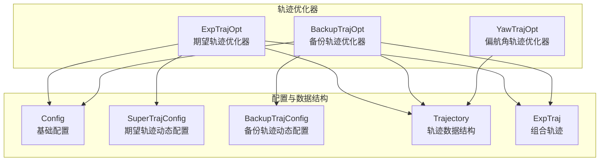
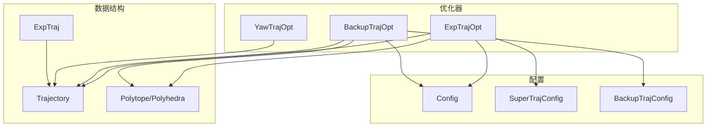
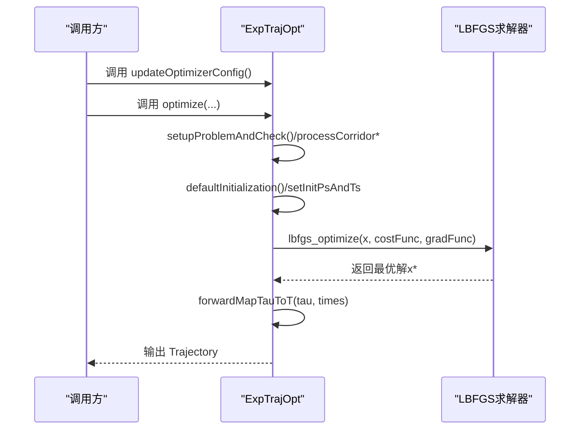
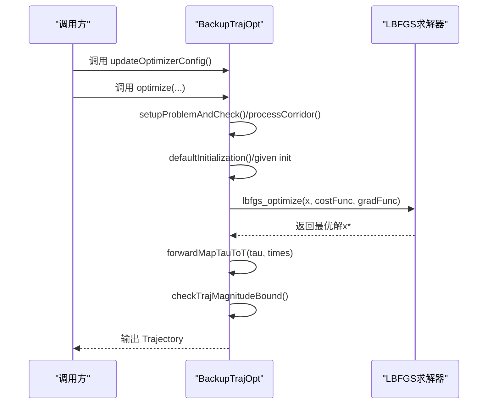
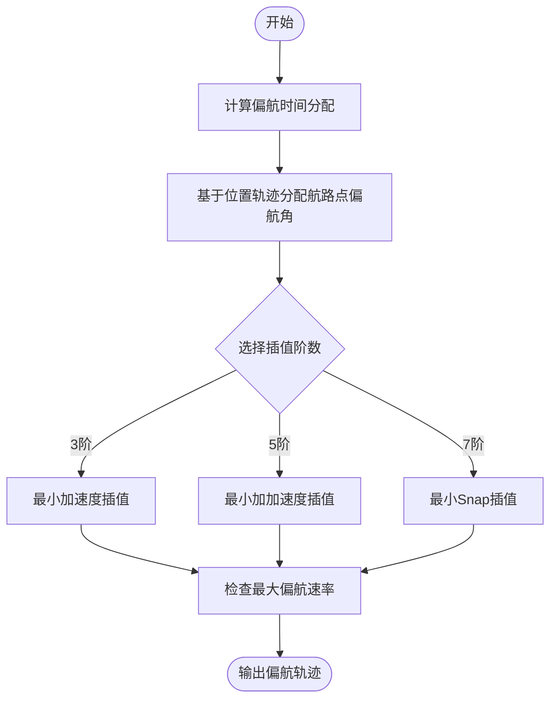
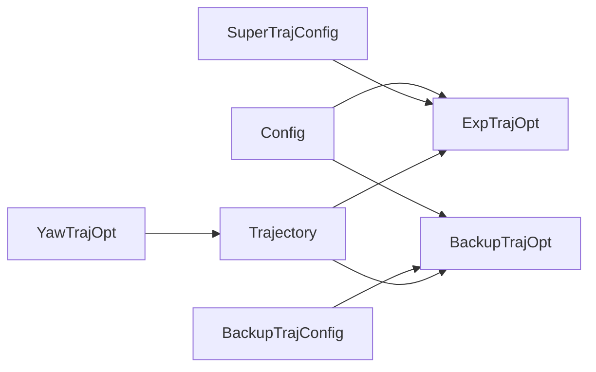

# 轨迹优化器类

<cite>
**本文档引用的文件**
- [exp_traj_optimizer_s4.h](file://src/SUPER/super_planner/include/traj_opt/exp_traj_optimizer_s4.h)
- [exp_traj_optimizer_s4.cpp](file://src/SUPER/super_planner/src/traj_opt/exp_traj_optimizer_s4.cpp)
- [backup_traj_optimizer_s4.h](file://src/SUPER/super_planner/include/traj_opt/backup_traj_optimizer_s4.h)
- [backup_traj_optimizer_s4.cpp](file://src/SUPER/super_planner/src/traj_opt/backup_traj_optimizer_s4.cpp)
- [yaw_traj_opt.h](file://src/SUPER/super_planner/include/traj_opt/yaw_traj_opt.h)
- [yaw_traj_opt.cpp](file://src/SUPER/super_planner/src/traj_opt/yaw_traj_opt.cpp)
- [config.hpp](file://src/SUPER/super_planner/include/traj_opt/config.hpp)
- [super_traj_config.h](file://src/SUPER/super_planner/include/traj_opt/super_traj_config.h)
- [backup_traj_config.h](file://src/SUPER/super_planner/include/traj_opt/backup_traj_config.h)
- [trajectory.h](file://src/SUPER/super_planner/include/data_structure/base/trajectory.h)
- [trajectory.cpp](file://src/SUPER/super_planner/src/utils/trajectory.cpp)
- [exp_traj.h](file://src/SUPER/super_planner/include/data_structure/exp_traj.h)
</cite>

## 目录
1. [简介](#简介)
2. [项目结构](#项目结构)
3. [核心组件](#核心组件)
4. [架构总览](#架构总览)
5. [详细组件分析](#详细组件分析)
6. [依赖关系分析](#依赖关系分析)
7. [性能考虑](#性能考虑)
8. [故障排查指南](#故障排查指南)
9. [结论](#结论)
10. [附录](#附录)

## 简介
本文件面向轨迹优化器类的API文档，重点覆盖以下三类优化器：
- ExpTrajOpt（期望轨迹优化器）：基于走廊/路径点约束的期望轨迹生成，支持动态参数与多种惩罚项。
- BackupTrajOpt（备份轨迹优化器）：在期望轨迹基础上进行局部修复与补足，满足边界条件与障碍物SFC约束。
- YawTrajOpt（偏航角轨迹优化器）：独立的偏航角轨迹规划模块，提供时间分配、航路点分配与多项式插值。

文档将系统阐述各优化器的构造函数、初始化方法、优化接口、配置管理接口、约束条件设置、初值获取与优化结果查询，并给出完整优化流程图与参数配置示例，帮助读者快速理解并正确使用。

## 项目结构
该模块位于超级规划器（SUPER）的轨迹优化子系统中，采用“按功能域分层”的组织方式：
- include/traj_opt：对外公开的头文件，定义优化器类、配置类与公共接口。
- src/traj_opt：优化器实现，包含期望轨迹、备份轨迹与偏航角优化的具体算法。
- include/data_structure：轨迹数据结构与组合轨迹类型。
- include/utils：几何工具、优化工具与数值积分等通用能力。

**图表来源**
- [exp_traj_optimizer_s4.h](file://src/SUPER/super_planner/include/traj_opt/exp_traj_optimizer_s4.h#L55-L368)
- [backup_traj_optimizer_s4.h](file://src/SUPER/super_planner/include/traj_opt/backup_traj_optimizer_s4.h#L52-L210)
- [yaw_traj_opt.h](file://src/SUPER/super_planner/include/traj_opt/yaw_traj_opt.h#L44-L71)
- [config.hpp](file://src/SUPER/super_planner/include/traj_opt/config.hpp#L50-L179)
- [super_traj_config.h](file://src/SUPER/super_planner/include/traj_opt/super_traj_config.h#L37-L177)
- [backup_traj_config.h](file://src/SUPER/super_planner/include/traj_opt/backup_traj_config.h#L37-L204)
- [trajectory.h](file://src/SUPER/super_planner/include/data_structure/base/trajectory.h#L56-L105)
- [exp_traj.h](file://src/SUPER/super_planner/include/data_structure/exp_traj.h#L83-L133)

**章节来源**
- [exp_traj_optimizer_s4.h](file://src/SUPER/super_planner/include/traj_opt/exp_traj_optimizer_s4.h#L55-L368)
- [backup_traj_optimizer_s4.h](file://src/SUPER/super_planner/include/traj_opt/backup_traj_optimizer_s4.h#L52-L210)
- [yaw_traj_opt.h](file://src/SUPER/super_planner/include/traj_opt/yaw_traj_opt.h#L44-L71)

## 核心组件
本节概述三个优化器的核心职责与关键API。

- ExpTrajOpt（期望轨迹优化器）
  - 职责：在给定起点/终点状态与走廊/路径点约束下，生成平滑且满足动力学边界的期望轨迹。
  - 关键API：构造函数、updateOptimizerConfig、optimize（多种重载）、getDynamicConfig、getInitValue、setInitPsAndTs。
  - 约束：速度/加速度/加加速度/角速度/推力上下限；位置惩罚、速度/加速度/加加速度惩罚、吸引力惩罚、时间惩罚等。
  - 初始值：支持默认初始化或基于引导轨迹的热启动。

- BackupTrajOpt（备份轨迹优化器）
  - 职责：在期望轨迹的某一段区间内，基于SFC（稀疏可行集）约束生成局部修复轨迹，满足起止边界与能量/动力学约束。
  - 关键API：构造函数、updateOptimizerConfig、optimize（两种重载）、getDynamicConfig、getInitValue、checkTrajMagnitudeBound。
  - 约束：与期望轨迹一致，但更强调局部修复与时间段惩罚。
  - 初始值：支持显式给定初始时间向量与路径点，或自动初始化。

- YawTrajOpt（偏航角轨迹优化器）
  - 职责：根据位置轨迹与起止偏航状态，生成满足最大偏航速率的偏航角轨迹。
  - 关键API：构造函数、getYawTimeAllocation、getYawWaypointAllocation、optimize。
  - 特殊接口：free_start/free_goal控制是否自由端偏航角；支持3/5/7阶多项式插值。

**章节来源**
- [exp_traj_optimizer_s4.h](file://src/SUPER/super_planner/include/traj_opt/exp_traj_optimizer_s4.h#L326-L368)
- [backup_traj_optimizer_s4.h](file://src/SUPER/super_planner/include/traj_opt/backup_traj_optimizer_s4.h#L156-L210)
- [yaw_traj_opt.h](file://src/SUPER/super_planner/include/traj_opt/yaw_traj_opt.h#L44-L71)

## 架构总览
下图展示了三个优化器与配置、数据结构之间的交互关系，以及优化流程的关键节点。

**图表来源**
- [exp_traj_optimizer_s4.h](file://src/SUPER/super_planner/include/traj_opt/exp_traj_optimizer_s4.h#L55-L106)
- [backup_traj_optimizer_s4.h](file://src/SUPER/super_planner/include/traj_opt/backup_traj_optimizer_s4.h#L52-L122)
- [yaw_traj_opt.h](file://src/SUPER/super_planner/include/traj_opt/yaw_traj_opt.h#L44-L68)
- [config.hpp](file://src/SUPER/super_planner/include/traj_opt/config.hpp#L50-L179)
- [super_traj_config.h](file://src/SUPER/super_planner/include/traj_opt/super_traj_config.h#L37-L177)
- [backup_traj_config.h](file://src/SUPER/super_planner/include/traj_opt/backup_traj_config.h#L37-L204)
- [trajectory.h](file://src/SUPER/super_planner/include/data_structure/base/trajectory.h#L56-L105)
- [exp_traj.h](file://src/SUPER/super_planner/include/data_structure/exp_traj.h#L83-L133)

## 详细组件分析

### ExpTrajOpt（期望轨迹优化器）

- 构造函数
  - 形参：基础配置对象、ROS接口指针。
  - 行为：初始化日志文件句柄（可选），准备优化变量结构体。
  - 参考路径：[构造函数定义](file://src/SUPER/super_planner/include/traj_opt/exp_traj_optimizer_s4.h#L329-L330)，[实现入口](file://src/SUPER/super_planner/src/traj_opt/exp_traj_optimizer_s4.cpp#L762-L776)

- 初始化与配置管理
  - updateOptimizerConfig：在每次优化前调用，确保使用最新动态参数。
  - getDynamicConfig：返回SuperTrajConfig引用，便于外部读取/修改动态参数。
  - 参考路径：[配置接口声明](file://src/SUPER/super_planner/include/traj_opt/exp_traj_optimizer_s4.h#L336-L355)

- 优化接口
  - optimize(headPVAJ, tailPVAJ, sfcs, out_traj)：标准走廊约束优化。
  - optimize(headPVAJ, tailPVAJ, guide_path, guide_t, sfcs, out_traj)：带引导轨迹的优化。
  - optimize(headPVAJ, tailPVAJ, sfcs, init_ps, init_ts, out_traj)：显式初始值优化。
  - setInitPsAndTs：设置初始路径点与时间段（热启动）。
  - 参考路径：[接口声明](file://src/SUPER/super_planner/include/traj_opt/exp_traj_optimizer_s4.h#L342-L366)，[实现片段](file://src/SUPER/super_planner/src/traj_opt/exp_traj_optimizer_s4.cpp#L597-L612)

- 初值获取
  - getInitValue(ts, ps)：获取默认初始化的时间向量与路径点。
  - 参考路径：[接口声明](file://src/SUPER/super_planner/include/traj_opt/exp_traj_optimizer_s4.h#L357-L360)

- 优化流程（序列图）

**图表来源**
- [exp_traj_optimizer_s4.cpp](file://src/SUPER/super_planner/src/traj_opt/exp_traj_optimizer_s4.cpp#L614-L706)
- [exp_traj_optimizer_s4.cpp](file://src/SUPER/super_planner/src/traj_opt/exp_traj_optimizer_s4.cpp#L589-L595)

- 约束与代价
  - 位置约束类型：路径点约束（WAYPOINT=1）或走廊约束（CORRIDOR=2）。
  - 惩罚项：速度、加速度、加加速度、角速度、推力、时间、位置、吸引力等。
  - 积分分辨率与平滑参数：影响数值积分精度和平滑性。
  - 参考路径：[配置类字段](file://src/SUPER/super_planner/include/traj_opt/config.hpp#L79-L98)，[动态配置类字段](file://src/SUPER/super_planner/include/traj_opt/super_traj_config.h#L42-L64)

- 数据结构与结果查询
  - Trajectory：轨迹容器，支持分段多项式、状态查询、总时长等。
  - ExpTraj：组合轨迹（位置+偏航），支持整体时长与状态查询。
  - 参考路径：[Trajectory接口](file://src/SUPER/super_planner/include/data_structure/base/trajectory.h#L91-L105)，[实现](file://src/SUPER/super_planner/src/utils/trajectory.cpp#L126-L169)，[ExpTraj接口](file://src/SUPER/super_planner/include/data_structure/exp_traj.h#L83-L133)

**章节来源**
- [exp_traj_optimizer_s4.h](file://src/SUPER/super_planner/include/traj_opt/exp_traj_optimizer_s4.h#L326-L368)
- [exp_traj_optimizer_s4.cpp](file://src/SUPER/super_planner/src/traj_opt/exp_traj_optimizer_s4.cpp#L589-L706)
- [config.hpp](file://src/SUPER/super_planner/include/traj_opt/config.hpp#L79-L98)
- [super_traj_config.h](file://src/SUPER/super_planner/include/traj_opt/super_traj_config.h#L42-L64)
- [trajectory.h](file://src/SUPER/super_planner/include/data_structure/base/trajectory.h#L91-L105)
- [trajectory.cpp](file://src/SUPER/super_planner/src/utils/trajectory.cpp#L126-L169)
- [exp_traj.h](file://src/SUPER/super_planner/include/data_structure/exp_traj.h#L83-L133)

### BackupTrajOpt（备份轨迹优化器）

- 构造函数
  - 形参：基础配置对象、ROS接口指针。
  - 行为：初始化日志文件句柄（可选），准备优化变量结构体。
  - 参考路径：[构造函数声明](file://src/SUPER/super_planner/include/traj_opt/backup_traj_optimizer_s4.h#L158-L158)

- 初始化与配置管理
  - updateOptimizerConfig：在每次优化前调用，确保使用最新动态参数。
  - getDynamicConfig：返回BackupTrajConfig引用，便于外部读取/修改动态参数。
  - 参考路径：[配置接口声明](file://src/SUPER/super_planner/include/traj_opt/backup_traj_optimizer_s4.h#L171-L179)

- 优化接口
  - optimize(exp_traj, t_0, t_e, heu_ts, heu_end_pt, heu_dur, sfc, out_traj, out_ts)：基于引导轨迹与端点的优化。
  - optimize(exp_traj, t_0, t_e, heu_ts, sfc, init_t_vec, init_ps, out_traj, out_ts)：显式初始值优化。
  - checkTrajMagnitudeBound：检查速度/加速度幅值是否越界。
  - getInitValue：获取默认初始化的初始时间戳、时间向量与路径点。
  - 参考路径：[接口声明](file://src/SUPER/super_planner/include/traj_opt/backup_traj_optimizer_s4.h#L183-L208)，[实现片段](file://src/SUPER/super_planner/src/traj_opt/backup_traj_optimizer_s4.cpp#L655-L806)

- 优化流程（序列图）

**图表来源**
- [backup_traj_optimizer_s4.cpp](file://src/SUPER/super_planner/src/traj_opt/backup_traj_optimizer_s4.cpp#L483-L515)
- [backup_traj_optimizer_s4.cpp](file://src/SUPER/super_planner/src/traj_opt/backup_traj_optimizer_s4.cpp#L639-L653)

- 约束与代价
  - 位置约束类型：路径点约束（WAYPOINT=1）或走廊约束（CORRIDOR=2）。
  - 惩罚项：时间、时间段、位置、速度、加速度、加加速度、角速度、推力、最大/最小推力加速度等。
  - 均匀时间分配：可启用统一时间段分配。
  - 参考路径：[配置类字段](file://src/SUPER/super_planner/include/traj_opt/config.hpp#L79-L98)，[动态配置类字段](file://src/SUPER/super_planner/include/traj_opt/backup_traj_config.h#L47-L69)

**章节来源**
- [backup_traj_optimizer_s4.h](file://src/SUPER/super_planner/include/traj_opt/backup_traj_optimizer_s4.h#L156-L210)
- [backup_traj_optimizer_s4.cpp](file://src/SUPER/super_planner/src/traj_opt/backup_traj_optimizer_s4.cpp#L655-L806)
- [config.hpp](file://src/SUPER/super_planner/include/traj_opt/config.hpp#L79-L98)
- [backup_traj_config.h](file://src/SUPER/super_planner/include/traj_opt/backup_traj_config.h#L47-L69)

### YawTrajOpt（偏航角轨迹优化器）

- 构造函数
  - 形参：最大偏航速率阈值。
  - 行为：记录最大偏航速率上限。
  - 参考路径：[构造函数声明](file://src/SUPER/super_planner/include/traj_opt/yaw_traj_opt.h#L51-L51)

- 特殊接口与使用场景
  - getYawTimeAllocation：根据总时长分配偏航段时间，保证首尾有足够转角时间。
  - getYawWaypointAllocation：基于位置轨迹计算航路点偏航角，确保连续性与平滑性。
  - optimize：综合起止状态、位置轨迹与最大偏航速率，生成偏航轨迹；支持3/5/7阶多项式插值。
  - 使用场景：当位置轨迹已知时，独立规划偏航角，满足最大偏航速率约束。
  - 参考路径：[接口声明](file://src/SUPER/super_planner/include/traj_opt/yaw_traj_opt.h#L55-L66)，[实现](file://src/SUPER/super_planner/src/traj_opt/yaw_traj_opt.cpp#L29-L194)

- 流程图（算法）

**图表来源**
- [yaw_traj_opt.cpp](file://src/SUPER/super_planner/src/traj_opt/yaw_traj_opt.cpp#L29-L194)

**章节来源**
- [yaw_traj_opt.h](file://src/SUPER/super_planner/include/traj_opt/yaw_traj_opt.h#L44-L71)
- [yaw_traj_opt.cpp](file://src/SUPER/super_planner/src/traj_opt/yaw_traj_opt.cpp#L29-L194)

## 依赖关系分析
- 优化器与配置
  - ExpTrajOpt/BackupTrajOpt均依赖Config作为基础配置，同时各自维护动态配置类（SuperTrajConfig/BackupTrajConfig）以支持运行时参数更新。
  - 动态参数通过ROS参数回调机制更新，内部使用互斥锁保护参数访问。
- 优化器与数据结构
  - 所有优化器均以Trajectory作为输入/输出载体；ExpTrajOpt还可能与组合轨迹（ExpTraj）协作。
- 优化器与工具
  - 使用LBFGS求解器进行非线性优化；使用几何工具与平坦性映射（Quadrotor Flatness）进行动力学约束建模。

**图表来源**
- [config.hpp](file://src/SUPER/super_planner/include/traj_opt/config.hpp#L50-L179)
- [super_traj_config.h](file://src/SUPER/super_planner/include/traj_opt/super_traj_config.h#L37-L177)
- [backup_traj_config.h](file://src/SUPER/super_planner/include/traj_opt/backup_traj_config.h#L37-L204)
- [exp_traj_optimizer_s4.h](file://src/SUPER/super_planner/include/traj_opt/exp_traj_optimizer_s4.h#L55-L106)
- [backup_traj_optimizer_s4.h](file://src/SUPER/super_planner/include/traj_opt/backup_traj_optimizer_s4.h#L52-L122)
- [yaw_traj_opt.h](file://src/SUPER/super_planner/include/traj_opt/yaw_traj_opt.h#L44-L68)

**章节来源**
- [config.hpp](file://src/SUPER/super_planner/include/traj_opt/config.hpp#L50-L179)
- [super_traj_config.h](file://src/SUPER/super_planner/include/traj_opt/super_traj_config.h#L37-L177)
- [backup_traj_config.h](file://src/SUPER/super_planner/include/traj_opt/backup_traj_config.h#L37-L204)
- [exp_traj_optimizer_s4.h](file://src/SUPER/super_planner/include/traj_opt/exp_traj_optimizer_s4.h#L55-L106)
- [backup_traj_optimizer_s4.h](file://src/SUPER/super_planner/include/traj_opt/backup_traj_optimizer_s4.h#L52-L122)
- [yaw_traj_opt.h](file://src/SUPER/super_planner/include/traj_opt/yaw_traj_opt.h#L44-L68)

## 性能考虑
- 积分分辨率与平滑参数
  - 提高积分分辨率会提升精度但增加计算开销；平滑参数过小可能导致数值不稳定。
- 优化精度与迭代次数
  - 相对代价容差（relCostTol）影响收敛速度与最终精度；建议结合任务实时性需求调整。
- 初始值策略
  - 使用引导轨迹进行热启动可显著减少迭代次数；显式初始值需保证可行性。
- 约束权重
  - 过大的惩罚权重可能导致数值病态；应结合物理边界合理设置。

## 故障排查指南
- 优化失败
  - 检查SFC是否有效（NaN/空集）；参考备份轨迹优化器中的失败提示逻辑。
  - 参考路径：[失败检测与日志](file://src/SUPER/super_planner/src/traj_opt/backup_traj_optimizer_s4.cpp#L666-L669)
- 结果越界
  - 使用checkTrajMagnitudeBound检查速度/加速度幅值是否超出配置阈值。
  - 参考路径：[越界检查](file://src/SUPER/super_planner/src/traj_opt/backup_traj_optimizer_s4.cpp#L639-L652)
- 偏航角过大
  - YawTrajOpt在完成插值后会检查最大偏航速率，若超过阈值会输出警告。
  - 参考路径：[速率检查](file://src/SUPER/super_planner/src/traj_opt/yaw_traj_opt.cpp#L186-L190)

**章节来源**
- [backup_traj_optimizer_s4.cpp](file://src/SUPER/super_planner/src/traj_opt/backup_traj_optimizer_s4.cpp#L639-L669)
- [yaw_traj_opt.cpp](file://src/SUPER/super_planner/src/traj_opt/yaw_traj_opt.cpp#L186-L190)

## 结论
本文档系统梳理了SUPER轨迹优化器的三类核心组件：ExpTrajOpt、BackupTrajOpt与YawTrajOpt。通过对构造函数、初始化、优化接口、配置管理、约束设置与结果查询的详细说明，并辅以流程图与依赖关系图，读者可以快速掌握如何在实际任务中正确配置与调用这些优化器，实现高效、稳定的轨迹规划与执行。

## 附录

### 参数配置示例（基于配置类字段）
- 基础配置（Config）
  - 位置约束类型：路径点约束（1）或走廊约束（2）。
  - 边界条件：最大速度、最大加速度、最大加加速度、最大角速度、推力上下限。
  - 惩罚权重：全局缩放系数与各类惩罚权重（速度、加速度、加加速度、角速度、推力、时间、位置、吸引力等）。
  - 数值参数：积分分辨率、平滑epsilon、优化精度。
  - 参考路径：[配置类字段](file://src/SUPER/super_planner/include/traj_opt/config.hpp#L79-L98)

- 期望轨迹动态配置（SuperTrajConfig）
  - 边界约束与惩罚权重：max_vel、max_acc、max_jerk、penna_*系列。
  - 优化参数：opt_accuracy、smooth_eps、integral_reso。
  - 算法配置：pos_constraint_type、block_energy_cost。
  - 参考路径：[动态配置类字段](file://src/SUPER/super_planner/include/traj_opt/super_traj_config.h#L42-L64)

- 备份轨迹动态配置（BackupTrajConfig）
  - 边界约束与惩罚权重：max_vel、max_acc、max_jerk、penna_*系列（含penna_ts、penna_max_acc_thr、penna_min_acc_thr等）。
  - 优化参数：opt_accuracy、smooth_eps、integral_reso。
  - 算法配置：uniform_time_en、pos_constraint_type、piece_num、block_energy_cost。
  - 参考路径：[动态配置类字段](file://src/SUPER/super_planner/include/traj_opt/backup_traj_config.h#L47-L69)

### 使用示例（步骤说明）
- 期望轨迹优化（ExpTrajOpt）
  - 步骤1：构造Config与SuperTrajConfig，加载参数。
  - 步骤2：创建ExpTrajOpt实例，调用updateOptimizerConfig。
  - 步骤3：准备起点/终点状态与SFC，调用optimize生成期望轨迹。
  - 步骤4：如需热启动，调用setInitPsAndTs设置初始值，或使用getInitValue获取默认初始值。
  - 参考路径：[期望轨迹接口](file://src/SUPER/super_planner/include/traj_opt/exp_traj_optimizer_s4.h#L342-L366)，[实现入口](file://src/SUPER/super_planner/src/traj_opt/exp_traj_optimizer_s4.cpp#L614-L706)

- 备份轨迹优化（BackupTrajOpt）
  - 步骤1：构造Config与BackupTrajConfig，加载参数。
  - 步骤2：创建BackupTrajOpt实例，调用updateOptimizerConfig。
  - 步骤3：传入期望轨迹与SFC，调用optimize生成局部修复轨迹。
  - 步骤4：调用checkTrajMagnitudeBound验证结果。
  - 参考路径：[备份轨迹接口](file://src/SUPER/super_planner/include/traj_opt/backup_traj_optimizer_s4.h#L183-L202)，[实现片段](file://src/SUPER/super_planner/src/traj_opt/backup_traj_optimizer_s4.cpp#L655-L806)

- 偏航角轨迹优化（YawTrajOpt）
  - 步骤1：构造YawTrajOpt，指定最大偏航速率。
  - 步骤2：调用getYawTimeAllocation与getYawWaypointAllocation。
  - 步骤3：调用optimize，选择插值阶数（3/5/7）。
  - 参考路径：[偏航接口](file://src/SUPER/super_planner/include/traj_opt/yaw_traj_opt.h#L55-L66)，[实现](file://src/SUPER/super_planner/src/traj_opt/yaw_traj_opt.cpp#L29-L194)