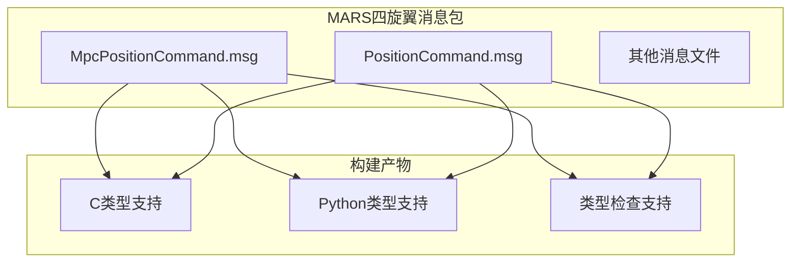
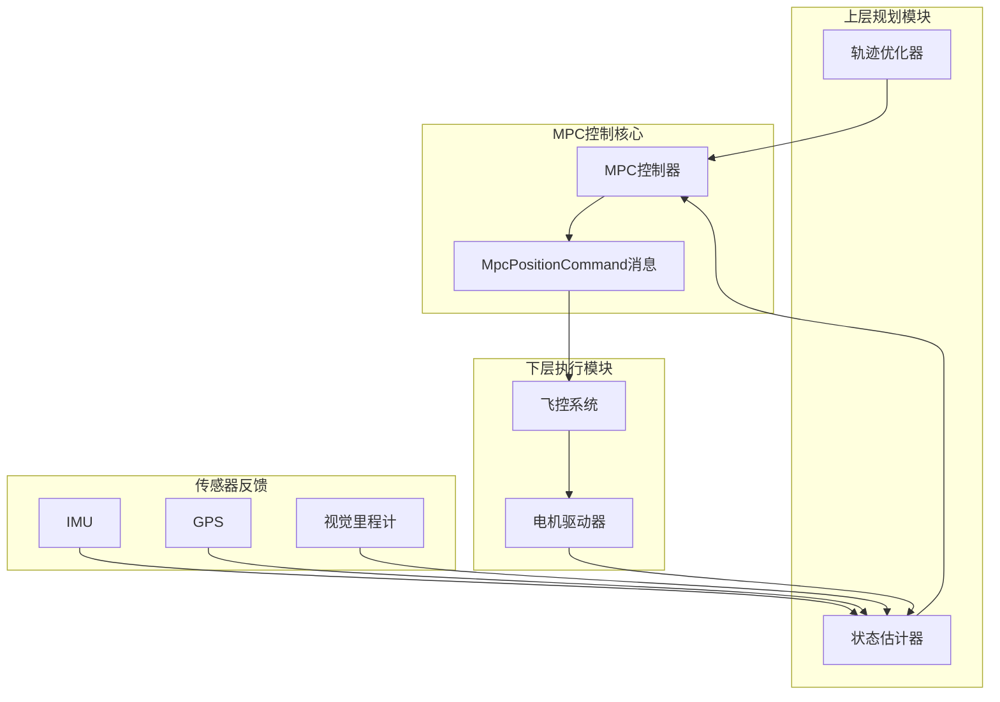
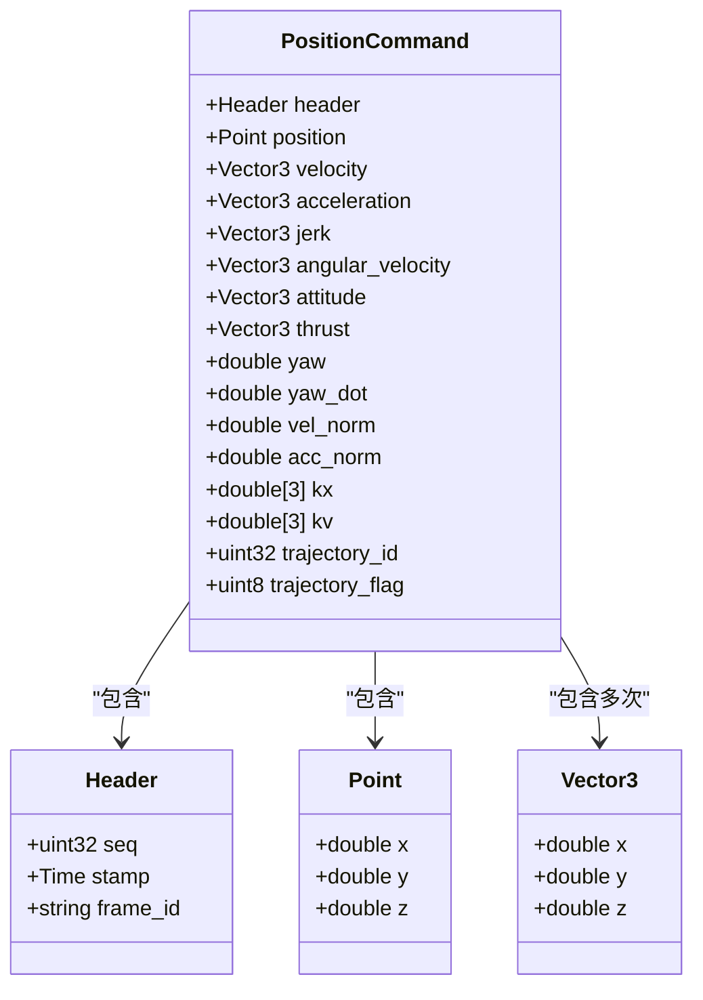
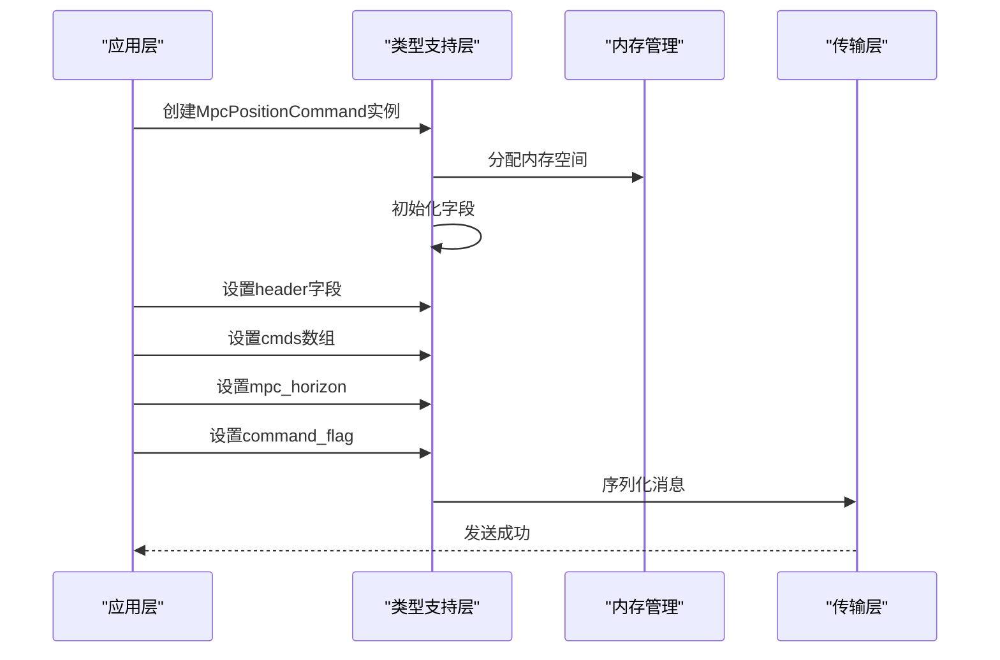
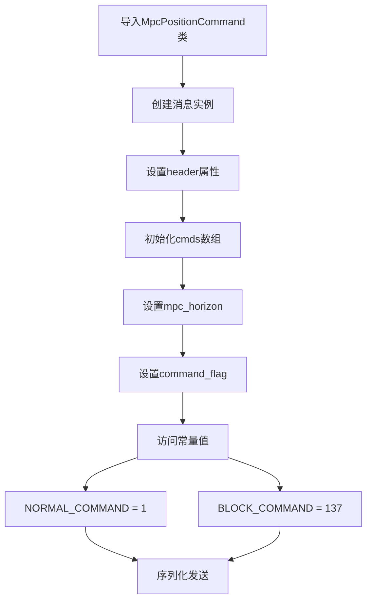
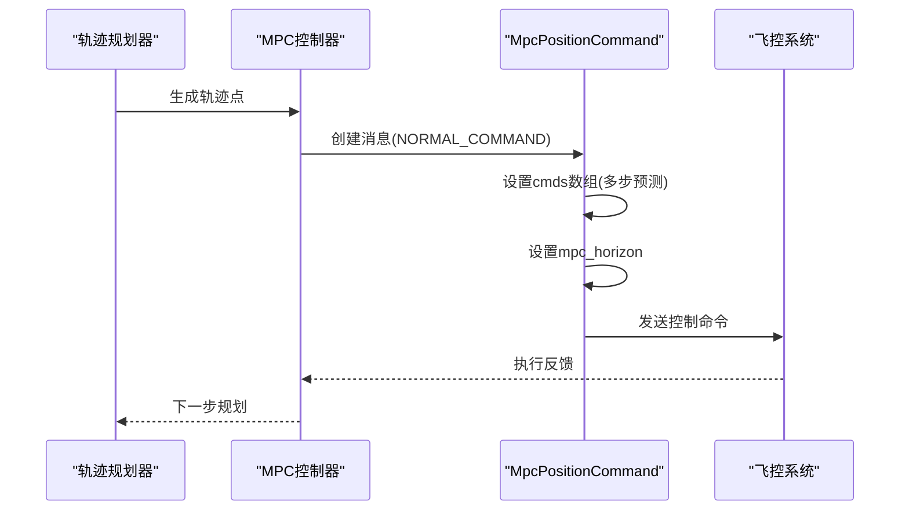
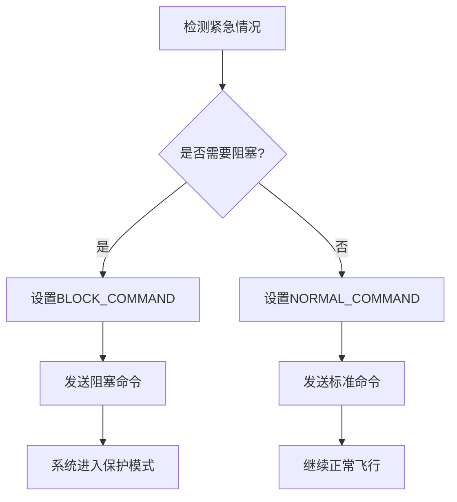
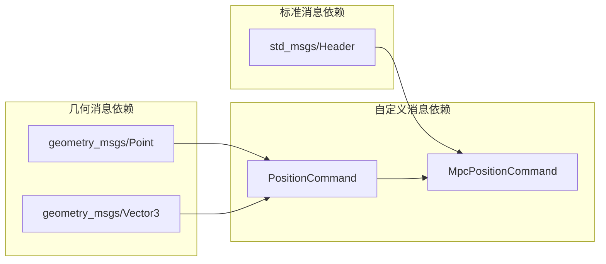
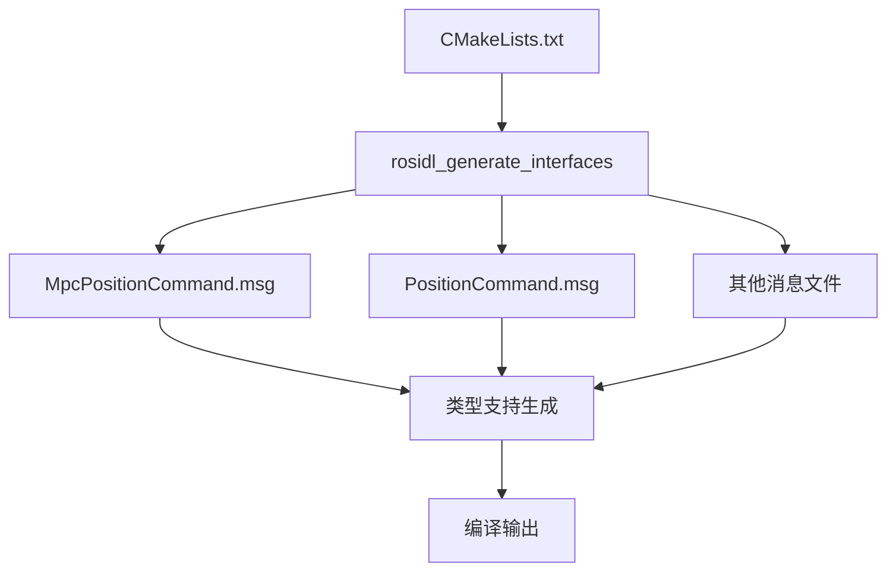

# MPC位置命令消息

<cite>
**本文档引用的文件**
- [MpcPositionCommand.msg](file://src/SUPER/mars_uav_sim/mars_quadrotor_msgs/ros2_msg/MpcPositionCommand.msg)
- [PositionCommand.msg](file://src/SUPER/mars_uav_sim/mars_quadrotor_msgs/ros2_msg/PositionCommand.msg)
- [CMakeLists.txt](file://src/SUPER/mars_uav_sim/mars_quadrotor_msgs/CMakeLists.txt)
- [fsm_ros2.hpp](file://src/SUPER/super_planner/include/ros_interface/ros2/fsm_ros2.hpp)
- [mpc_position_command__type_support.cpp](file://build/mars_quadrotor_msgs/rosidl_typesupport_c/mars_quadrotor_msgs/msg/mpc_position_command__type_support.cpp)
- [mpc_position_command.py](file://build/mars_quadrotor_msgs/rosidl_generator_py/mars_quadrotor_msgs/msg/_mpc_position_command.py)
</cite>

## 目录
1. [简介](#简介)
2. [项目结构](#项目结构)
3. [核心组件](#核心组件)
4. [架构概览](#架构概览)
5. [详细组件分析](#详细组件分析)
6. [依赖关系分析](#依赖关系分析)
7. [性能考虑](#性能考虑)
8. [故障排除指南](#故障排除指南)
9. [结论](#结论)

## 简介
本文件为MPC位置命令消息（MpcPositionCommand.msg）提供详细的API文档。该消息用于在MPC（模型预测控制）系统中传输多步预测的控制命令，包含完整的头部信息、多步位置命令数组、预测时域长度以及命令标志位。文档将深入解释消息结构、字段定义、常量含义、序列化与反序列化实现，并说明其在MPC控制算法中的作用及与其他组件的交互方式。

## 项目结构
MPC位置命令消息位于MARS四旋翼消息包中，作为ROS2消息接口的一部分，通过rosidl生成器自动生成多种语言的类型支持。消息文件组织清晰，依赖标准消息类型和几何消息类型。

**图表来源**
- [CMakeLists.txt](file://src/SUPER/mars_uav_sim/mars_quadrotor_msgs/CMakeLists.txt#L24-L37)
- [MpcPositionCommand.msg](file://src/SUPER/mars_uav_sim/mars_quadrotor_msgs/ros2_msg/MpcPositionCommand.msg#L1-L7)

**章节来源**
- [CMakeLists.txt](file://src/SUPER/mars_uav_sim/mars_quadrotor_msgs/CMakeLists.txt#L1-L46)

## 核心组件
MPC位置命令消息由以下核心组件构成：

### 消息结构总览
- **Header头部信息**: 包含时间戳和坐标系信息
- **PositionCommand数组**: 多步预测的控制命令序列
- **mpc_horizon**: 预测时域长度（步数）
- **command_flag**: 命令标志位，指示命令类型

### 字段详细定义

#### Header头部信息
- 类型: std_msgs/Header
- 作用: 提供消息的时间戳和坐标系标识
- 关键属性: stamp（时间戳）、frame_id（坐标系）

#### PositionCommand数组
- 类型: mars_quadrotor_msgs/PositionCommand[]
- 作用: 存储MPC预测时域内的多步控制命令
- 数组长度: 由mpc_horizon指定
- 每个元素包含: 位置、速度、加速度、急动度、角速度、姿态、推力、偏航角等

#### mpc_horizon预测时域长度
- 类型: uint32
- 作用: 指定MPC预测的步数
- 影响: 决定PositionCommand数组的有效长度

#### command_flag命令标志位
- 类型: uint8
- 作用: 标识命令的执行模式
- 取值: NORMAL_COMMAND或BLOCK_COMMAND

**章节来源**
- [MpcPositionCommand.msg](file://src/SUPER/mars_uav_sim/mars_quadrotor_msgs/ros2_msg/MpcPositionCommand.msg#L1-L7)

## 架构概览
MPC位置命令消息在整个控制系统中的位置如下：

**图表来源**
- [fsm_ros2.hpp](file://src/SUPER/super_planner/include/ros_interface/ros2/fsm_ros2.hpp#L40-L60)

## 详细组件分析

### PositionCommand消息详解
PositionCommand是MPC位置命令消息的核心子组件，包含完整的运动学和动力学信息：

**图表来源**
- [PositionCommand.msg](file://src/SUPER/mars_uav_sim/mars_quadrotor_msgs/ros2_msg/PositionCommand.msg#L2-L30)

### 命令标志位常量定义
MPC位置命令消息定义了两种主要的命令模式：

| 常量名称 | 十进制值 | 十六进制值 | 含义 | 使用场景 |
|---------|---------|-----------|------|----------|
| NORMAL_COMMAND | 1 | 0x01 | 标准命令模式 | 日常飞行、正常任务执行 |
| BLOCK_COMMAND | 137 | 0x89 | 阻塞/特殊命令模式 | 紧急停止、特殊操作、系统保护 |

### 序列化与反序列化实现

#### C类型支持实现
C语言类型支持通过类型支持层实现消息的序列化和反序列化：

**图表来源**
- [mpc_position_command__type_support.cpp](file://build/mars_quadrotor_msgs/rosidl_typesupport_c/mars_quadrotor_msgs/msg/mpc_position_command__type_support.cpp#L50-L72)

#### Python类型支持实现
Python生成器提供了完整的类型支持，包括常量访问：

**图表来源**
- [mpc_position_command.py](file://build/mars_quadrotor_msgs/rosidl_generator_py/mars_quadrotor_msgs/msg/_mpc_position_command.py#L22-L72)

**章节来源**
- [mpc_position_command__type_support.cpp](file://build/mars_quadrotor_msgs/rosidl_typesupport_c/mars_quadrotor_msgs/msg/mpc_position_command__type_support.cpp#L1-L90)
- [mpc_position_command.py](file://build/mars_quadrotor_msgs/rosidl_generator_py/mars_quadrotor_msgs/msg/_mpc_position_command.py#L1-L81)

### 实际应用场景

#### 标准命令模式 (NORMAL_COMMAND)
标准命令模式用于正常的飞行控制，适用于大多数任务场景：

#### 特殊命令模式 (BLOCK_COMMAND)
阻塞命令模式用于紧急情况或特殊操作：

**章节来源**
- [MpcPositionCommand.msg](file://src/SUPER/mars_uav_sim/mars_quadrotor_msgs/ros2_msg/MpcPositionCommand.msg#L5-L6)

## 依赖关系分析

### 消息依赖图
MPC位置命令消息的依赖关系如下：

**图表来源**
- [MpcPositionCommand.msg](file://src/SUPER/mars_uav_sim/mars_quadrotor_msgs/ros2_msg/MpcPositionCommand.msg#L1-L3)
- [PositionCommand.msg](file://src/SUPER/mars_uav_sim/mars_quadrotor_msgs/ros2_msg/PositionCommand.msg#L2-L13)

### 构建依赖关系
消息包的构建过程展示了各组件之间的依赖关系：

**图表来源**
- [CMakeLists.txt](file://src/SUPER/mars_uav_sim/mars_quadrotor_msgs/CMakeLists.txt#L24-L37)

**章节来源**
- [CMakeLists.txt](file://src/SUPER/mars_uav_sim/mars_quadrotor_msgs/CMakeLists.txt#L18-L40)

## 性能考虑
- **消息大小优化**: PositionCommand数组的大小直接影响网络带宽占用，应根据实时性要求合理设置mpc_horizon
- **序列化开销**: 多步预测数据的序列化和反序列化可能成为性能瓶颈，建议使用零拷贝技术
- **内存管理**: 预分配固定大小的缓冲区，避免频繁的内存分配和释放
- **传输效率**: 在高频率控制场景下，考虑压缩传输或批量发送策略

## 故障排除指南
- **消息解析错误**: 检查PositionCommand数组长度是否与mpc_horizon一致
- **坐标系问题**: 确认Header中的frame_id设置正确
- **时间戳同步**: 验证消息时间戳与系统时钟同步状态
- **命令标志位错误**: 确认command_flag设置符合预期的执行模式

## 结论
MPC位置命令消息为MPC控制系统提供了标准化的消息接口，通过明确的字段定义和类型支持，实现了高效的多步预测控制命令传输。其设计充分考虑了实时性要求和系统集成需求，是现代无人机控制系统中不可或缺的重要组件。