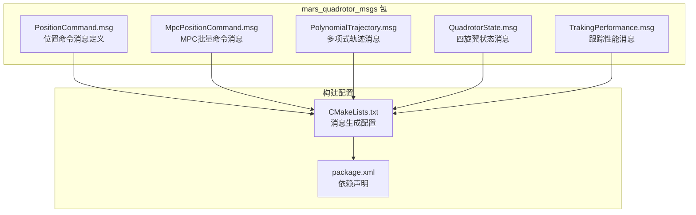
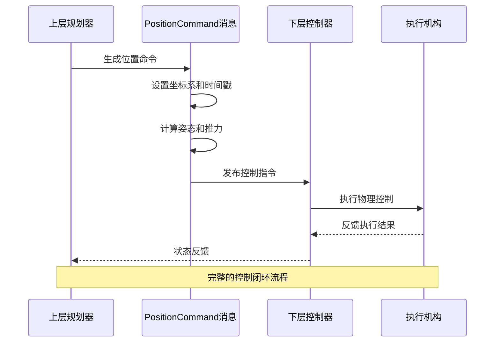
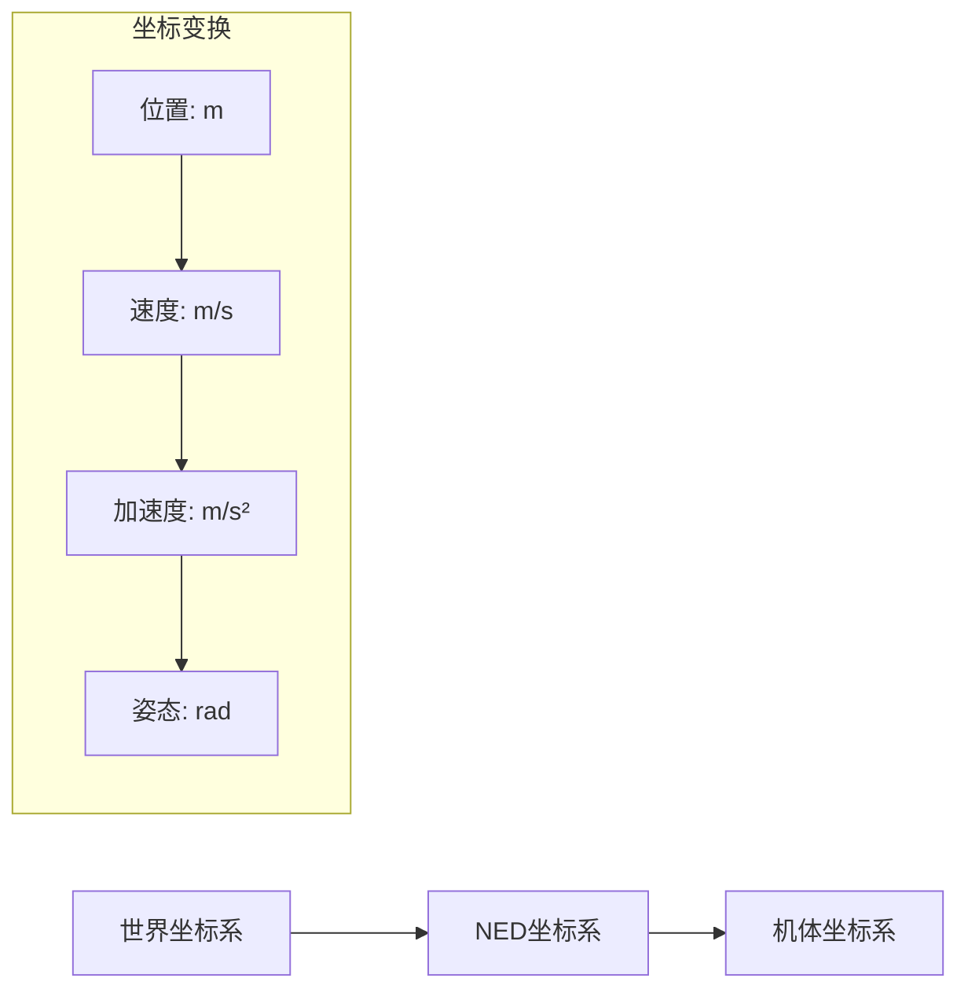
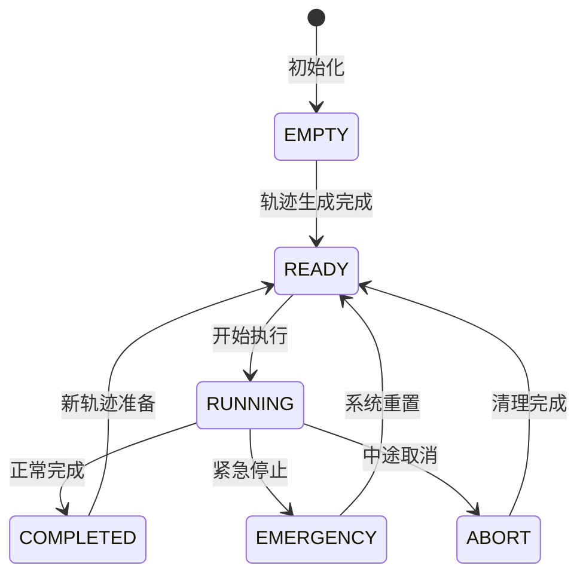
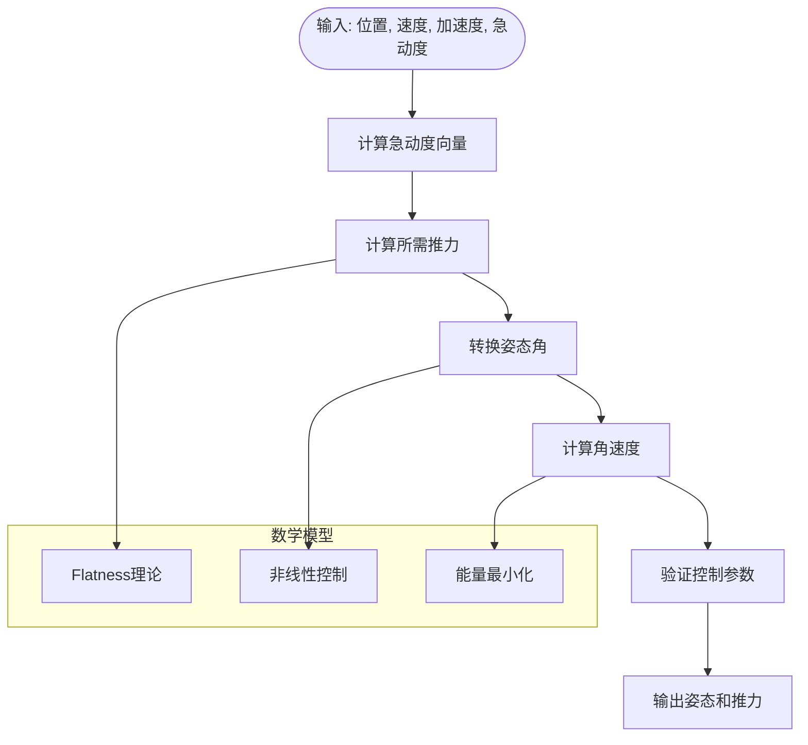
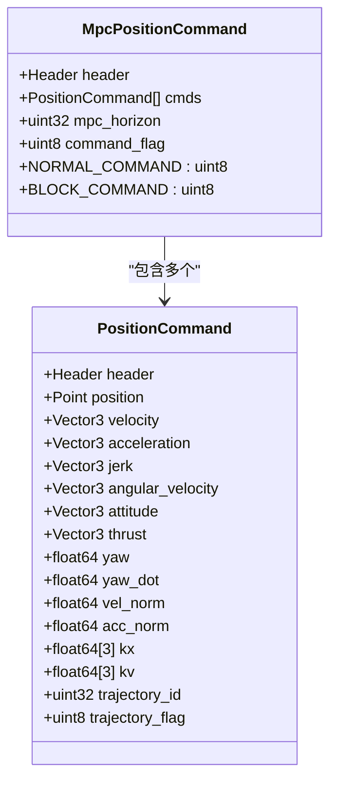
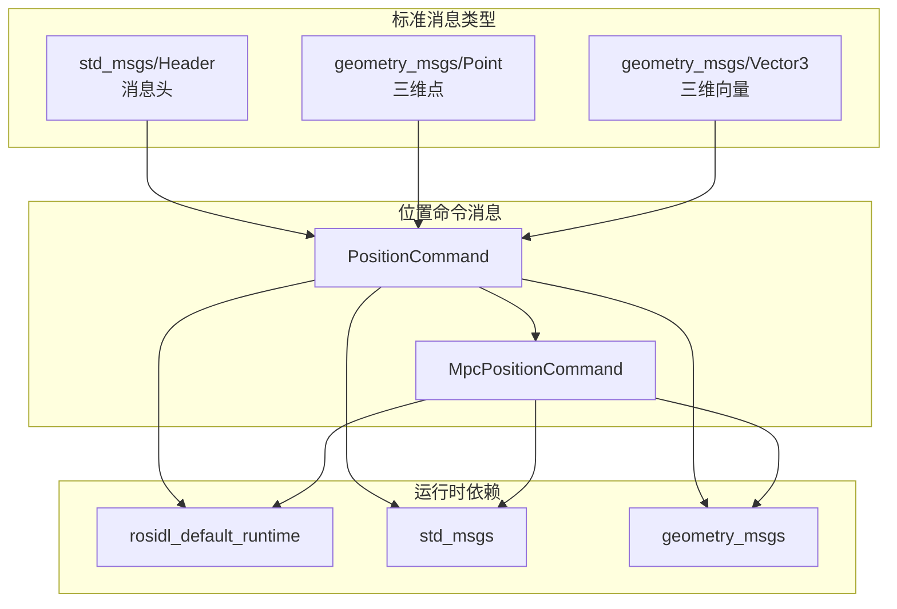
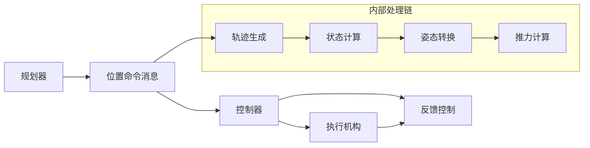

# 位置命令消息

<cite>
**本文档引用的文件**
- [PositionCommand.msg](file://src/SUPER/mars_uav_sim/mars_quadrotor_msgs/ros2_msg/PositionCommand.msg)
- [MpcPositionCommand.msg](file://src/SUPER/mars_uav_sim/mars_quadrotor_msgs/ros2_msg/MpcPositionCommand.msg)
- [CMakeLists.txt](file://src/SUPER/mars_uav_sim/mars_quadrotor_msgs/CMakeLists.txt)
- [package.xml](file://src/SUPER/mars_uav_sim/mars_quadrotor_msgs/package.xml)
- [fsm_ros2.hpp](file://src/SUPER/super_planner/include/ros_interface/ros2/fsm_ros2.hpp)
- [geometry_utils.h](file://src/SUPER/super_planner/include/utils/geometry/geometry_utils.h)
- [quadrotor_flatness.hpp](file://src/SUPER/super_planner/include/utils/geometry/quadrotor_flatness.hpp)
</cite>

## 目录
1. [简介](#简介)
2. [项目结构](#项目结构)
3. [核心组件](#核心组件)
4. [架构概览](#架构概览)
5. [详细组件分析](#详细组件分析)
6. [依赖关系分析](#依赖关系分析)
7. [性能考虑](#性能考虑)
8. [故障排除指南](#故障排除指南)
9. [结论](#结论)

## 简介
本文档详细描述了位置命令消息(PositionCommand.msg)的数据结构和使用方法。该消息是SUPER无人机系统中的关键控制指令载体，用于从上层规划器向下层控制器传递精确的位置、速度、加速度、姿态和推力指令。消息设计支持多种控制模式，包括位置保持、速度控制、加速度控制等，并提供了完整的轨迹管理和状态监控机制。

## 项目结构
位置命令消息位于SUPER项目的多旋翼仿真子模块中，作为ROS2消息接口的一部分：



**图表来源**
- [CMakeLists.txt](file://src/SUPER/mars_uav_sim/mars_quadrotor_msgs/CMakeLists.txt#L25-L31)
- [package.xml](file://src/SUPER/mars_uav_sim/mars_quadrotor_msgs/package.xml#L13-L14)

**章节来源**
- [CMakeLists.txt](file://src/SUPER/mars_uav_sim/mars_quadrotor_msgs/CMakeLists.txt#L1-L46)
- [package.xml](file://src/SUPER/mars_uav_sim/mars_quadrotor_msgs/package.xml#L1-L26)

## 核心组件
位置命令消息包含以下核心数据结构：

### 基础几何数据
- **位置向量(position)**: 三维笛卡尔坐标(x, y, z)，单位米(m)
- **速度向量(velocity)**: 三维速度矢量，单位米每秒(m/s)
- **加速度向量(acceleration)**: 三维加速度矢量，单位米每秒平方(m/s²)
- **急动度向量(jerk)**: 三维急动度矢量，单位米每秒立方(m/s³)

### 姿态和运动数据
- **角速度向量(angular_velocity)**: 三维角速度矢量，单位弧度每秒(rad/s)
- **姿态向量(attitude)**: 三维姿态角(欧拉角)，单位弧度(rad)
- **推力向量(thrust)**: 三维推力矢量，单位牛顿(N)

### 导航参数
- **偏航角(yaw)**: 绕z轴的旋转角度，单位弧度(rad)
- **偏航角速度(yaw_dot)**: 偏航角变化率，单位弧度每秒(rad/s)
- **速度范数(vel_norm)**: 速度向量的模长，单位m/s
- **加速度范数(acc_norm)**: 加速度向量的模长，单位m/s²

### 控制参数
- **位置增益(kx)**: 位置控制比例增益，长度3
- **速度增益(kv)**: 速度控制比例增益，长度3

### 轨迹管理
- **轨迹ID(trajectory_id)**: 轨迹唯一标识符，uint32类型
- **轨迹标志位(trajectory_flag)**: 轨迹状态标志，uint8类型
- **轨迹状态常量**: 定义轨迹的不同状态

**章节来源**
- [PositionCommand.msg](file://src/SUPER/mars_uav_sim/mars_quadrotor_msgs/ros2_msg/PositionCommand.msg#L2-L30)

## 架构概览
位置命令消息在整个控制系统中的流转过程：



**图表来源**
- [fsm_ros2.hpp](file://src/SUPER/super_planner/include/ros_interface/ros2/fsm_ros2.hpp#L372-L431)

## 详细组件分析

### 消息数据结构详解

#### 几何坐标系定义
位置命令消息采用标准的NED(北-东-下)坐标系：
- **X轴**: 向北方向，正向为北向
- **Y轴**: 向东方向，正向为东向  
- **Z轴**: 向下方向，正向为垂直向下

坐标系转换关系：


#### 数值范围和单位规范
- **位置**: 无固定上限，建议在飞行区域内
- **速度**: 典型范围0-20 m/s，根据任务调整
- **加速度**: 典型范围0-10 m/s²，考虑最大推力限制
- **姿态角**: -π到π弧度范围内
- **推力**: 0到最大推力值之间

#### 命令类型和使用场景

**位置保持模式**
- 特征：仅设置目标位置，速度和加速度设为零
- 应用：悬停、等待、定点保持
- 实现要点：确保位置精度和稳定性

**速度控制模式**
- 特征：设置目标速度，忽略位置微分约束
- 应用：直线飞行、速度跟踪
- 实现要点：速度限制和加速度约束

**加速度控制模式**
- 特征：直接控制加速度，适用于高动态响应
- 应用：紧急避障、快速机动
- 实现要点：加加速度限制和能量管理

**章节来源**
- [PositionCommand.msg](file://src/SUPER/mars_uav_sim/mars_quadrotor_msgs/ros2_msg/PositionCommand.msg#L2-L30)

### 轨迹管理系统

#### 轨迹状态定义


**图表来源**
- [PositionCommand.msg](file://src/SUPER/mars_uav_sim/mars_quadrotor_msgs/ros2_msg/PositionCommand.msg#L19-L26)

#### 轨迹标志位机制
- **标志位0**: 表示无轨迹或空闲状态
- **标志位1**: 表示正常轨迹执行
- **标志位2**: 表示备用轨迹激活
- **比较规则**: 可直接与0进行数值比较判断状态

**章节来源**
- [PositionCommand.msg](file://src/SUPER/mars_uav_sim/mars_quadrotor_msgs/ros2_msg/PositionCommand.msg#L28-L29)

### 姿态和推力计算

#### 急动度到姿态转换


**图表来源**
- [geometry_utils.h](file://src/SUPER/super_planner/include/utils/geometry/geometry_utils.h#L159-L168)
- [quadrotor_flatness.hpp](file://src/SUPER/super_planner/include/utils/geometry/quadrotor_flatness.hpp#L76-L156)

#### 推力计算公式
推力大小基于齐次坐标系下的扁性映射：
```
推力 = mass × (加速度 + g × z_unit) + 气动阻力项
```

姿态角转换使用四元数表示：
```
四元数 = [cos(θ/2), sin(θ/2) × 单位向量]
```

**章节来源**
- [geometry_utils.h](file://src/SUPER/super_planner/include/utils/geometry/geometry_utils.h#L270-L286)
- [quadrotor_flatness.hpp](file://src/SUPER/super_planner/include/utils/geometry/quadrotor_flatness.hpp#L84-L156)

### MPC批量控制接口

#### 批量命令消息结构
MPC控制器使用批量命令消息来优化控制性能：



**图表来源**
- [MpcPositionCommand.msg](file://src/SUPER/mars_uav_sim/mars_quadrotor_msgs/ros2_msg/MpcPositionCommand.msg#L1-L7)
- [PositionCommand.msg](file://src/SUPER/mars_uav_sim/mars_quadrotor_msgs/ros2_msg/PositionCommand.msg#L1-L30)

**章节来源**
- [MpcPositionCommand.msg](file://src/SUPER/mars_uav_sim/mars_quadrotor_msgs/ros2_msg/MpcPositionCommand.msg#L1-L7)

## 依赖关系分析

### ROS2消息依赖
位置命令消息依赖于标准ROS2消息类型：



**图表来源**
- [CMakeLists.txt](file://src/SUPER/mars_uav_sim/mars_quadrotor_msgs/CMakeLists.txt#L21-L22)
- [package.xml](file://src/SUPER/mars_uav_sim/mars_quadrotor_msgs/package.xml#L13-L14)

### 内部组件依赖


**图表来源**
- [fsm_ros2.hpp](file://src/SUPER/super_planner/include/ros_interface/ros2/fsm_ros2.hpp#L372-L431)

**章节来源**
- [CMakeLists.txt](file://src/SUPER/mars_uav_sim/mars_quadrotor_msgs/CMakeLists.txt#L18-L40)
- [package.xml](file://src/SUPER/mars_uav_sim/mars_quadrotor_msgs/package.xml#L10-L16)

## 性能考虑
位置命令消息的设计充分考虑了实时控制的性能要求：

### 数据传输优化
- **紧凑数据结构**: 最小化消息大小，减少网络带宽占用
- **高效序列化**: 利用ROS2内置的高效序列化机制
- **批处理支持**: MPC模式支持批量命令传输

### 实时性保证
- **时间戳同步**: 精确的时间戳确保控制循环的同步性
- **优先级调度**: 在ROS2中设置合适的QoS参数
- **内存管理**: 避免不必要的内存分配和拷贝

### 数值稳定性
- **范围检查**: 实施严格的数值范围验证
- **溢出防护**: 防止计算过程中的数值溢出
- **收敛保证**: 确保控制算法的数值收敛性

## 故障排除指南

### 常见问题诊断

**消息格式错误**
- 检查所有必需字段是否完整
- 验证数据类型匹配
- 确认坐标系一致性

**控制不稳定**
- 检查增益参数设置
- 验证轨迹连续性
- 确认传感器数据质量

**通信中断**
- 检查网络连接状态
- 验证消息频率设置
- 确认QoS配置正确

### 调试技巧
1. **日志记录**: 启用详细的控制回路日志
2. **可视化**: 使用RViz进行轨迹和状态可视化
3. **仿真测试**: 在Gazebo中进行离线测试
4. **参数扫描**: 系统性地调整控制参数

**章节来源**
- [fsm_ros2.hpp](file://src/SUPER/super_planner/include/ros_interface/ros2/fsm_ros2.hpp#L372-L431)

## 结论
位置命令消息(PositionCommand.msg)作为SUPER无人机系统的核心接口，提供了完整的多旋翼控制指令集。其设计特点包括：

1. **完整性**: 覆盖位置、速度、加速度、姿态、推力等所有必要控制参数
2. **灵活性**: 支持多种控制模式和轨迹管理策略
3. **实时性**: 优化的数据结构和传输机制确保控制性能
4. **可靠性**: 完善的状态管理和错误处理机制

该消息系统为上层规划器和下层控制器之间的通信提供了标准化接口，是实现高性能无人机控制的关键基础设施。通过合理配置和使用，可以实现精确的轨迹跟踪和稳定的飞行控制。