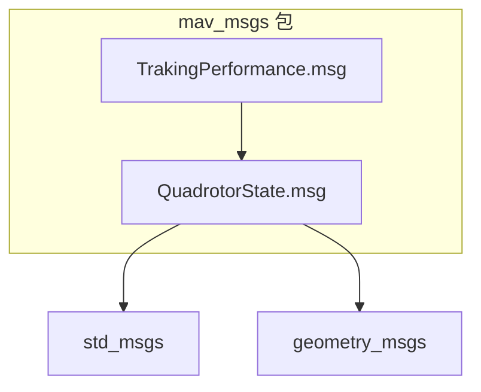
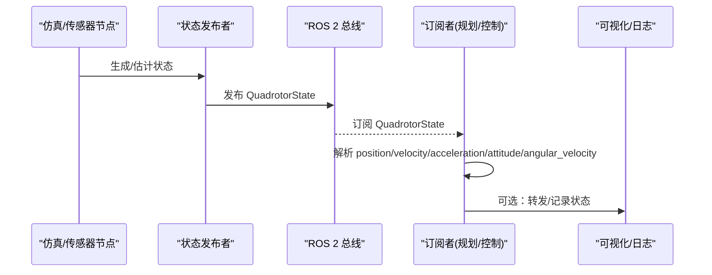
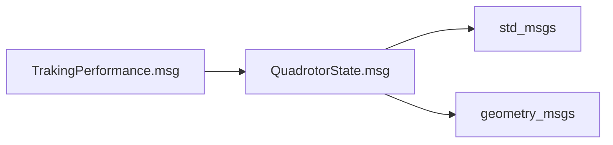

# 四旋翼机状态消息

<cite>
**本文引用的文件列表**
- [QuadrotorState.msg](file://src/SUPER/mars_uav_sim/mars_quadrotor_msgs/ros2_msg/QuadrotorState.msg)
- [TrakingPerformance.msg](file://src/SUPER/mars_uav_sim/mars_quadrotor_msgs/ros2_msg/TrakingPerformance.msg)
- [CMakeLists.txt](file://src/SUPER/mars_uav_sim/mars_quadrotor_msgs/CMakeLists.txt)
- [package.xml](file://src/SUPER/mars_uav_sim/mars_quadrotor_msgs/package.xml)
- [ros2_perfect_drone_model.hpp](file://src/SUPER/mars_uav_sim/perfect_drone_sim/include/perfect_drone_sim/ros2_perfect_drone_model.hpp)
- [ros2_perfect_drone_node.cpp](file://src/SUPER/mars_uav_sim/perfect_drone_sim/src/ros2_perfect_drone_node.cpp)
- [geometry_utils.cpp](file://src/SUPER/super_planner/src/utils/geometry_utils.cpp)
- [fsm_ros2.hpp](file://src/SUPER/super_planner/include/ros_interface/ros2/fsm_ros2.hpp)
</cite>

## 目录
1. [简介](#简介)
2. [项目结构](#项目结构)
3. [核心组件](#核心组件)
4. [架构总览](#架构总览)
5. [详细组件分析](#详细组件分析)
6. [依赖关系分析](#依赖关系分析)
7. [性能考量](#性能考量)
8. [故障排查指南](#故障排查指南)
9. [结论](#结论)
10. [附录](#附录)

## 简介
本文件为四旋翼机状态消息（QuadrotorState.msg）的详细API文档，面向仿真与真实飞行场景，系统阐述该消息所承载的状态信息、物理含义、坐标系约定与单位标准，并提供发布与订阅的实践建议及状态估计与滤波的通用指导。QuadrotorState消息用于在ROS 2系统中统一表达四旋翼无人机的位置、速度、加速度、加加速度、姿态与角速度等关键状态，是路径规划、控制与可视化等模块之间的通用数据契约。

## 项目结构
QuadrotorState位于mav_msgs族的消息包中，作为独立消息类型被多个子模块复用：
- 消息定义：src/SUPER/mars_uav_sim/mars_quadrotor_msgs/ros2_msg/QuadrotorState.msg
- 依赖声明：CMakeLists.txt与package.xml中声明std_msgs与geometry_msgs依赖
- 复用场景：TrackingPerformance消息将QuadrotorState作为reference/command/feedback/error字段使用



图表来源
- [QuadrotorState.msg](file://src/SUPER/mars_uav_sim/mars_quadrotor_msgs/ros2_msg/QuadrotorState.msg#L1-L11)
- [TrakingPerformance.msg](file://src/SUPER/mars_uav_sim/mars_quadrotor_msgs/ros2_msg/TrakingPerformance.msg#L1-L13)
- [CMakeLists.txt](file://src/SUPER/mars_uav_sim/mars_quadrotor_msgs/CMakeLists.txt#L20-L37)
- [package.xml](file://src/SUPER/mars_uav_sim/mars_quadrotor_msgs/package.xml#L13-L14)

章节来源
- [CMakeLists.txt](file://src/SUPER/mars_uav_sim/mars_quadrotor_msgs/CMakeLists.txt#L20-L37)
- [package.xml](file://src/SUPER/mars_uav_sim/mars_quadrotor_msgs/package.xml#L13-L14)

## 核心组件
QuadrotorState消息的字段定义如下（按出现顺序）：
- thrust：单位为力（牛顿），表示当前推力大小
- velocity_norm：单位为速度（米/秒），表示速度向量的模长
- acceleration_norm：单位为加速度（米/秒²），表示加速度向量的模长
- jerk_norm：单位为加加速度（米/秒³），表示加加速度向量的模长
- position：geometry_msgs/Point，单位为长度（米），表示在世界坐标系中的位置
- velocity：geometry_msgs/Vector3，单位为速度（米/秒），表示在世界坐标系中的线速度
- acceleration：geometry_msgs/Vector3，单位为加速度（米/秒²），表示在世界坐标系中的线加速度
- jerk：geometry_msgs/Vector3，单位为加加速度（米/秒³），表示在世界坐标系中的线加加速度
- snap：geometry_msgs/Vector3，单位为“快照”（米/秒⁴），表示线加加速度的导数（在轨迹优化中常用）
- attitude：geometry_msgs/Vector3，单位为角度（弧度），表示欧拉角（偏航、俯仰、横滚）或姿态角序列
- angular_velocity：geometry_msgs/Vector3，单位为角速度（弧度/秒），表示在机体坐标系中的角速度

字段与物理意义对照表
- thrust：当前升力/推力大小，常用于控制策略与能耗评估
- velocity_norm/acceleration_norm/jerk_norm：标量范数，便于统一约束与比较
- position/velocity/acceleration/jerk/snap：位移-速度-加速度-加加速度-快照序列，满足轨迹优化与控制需求
- attitude/angular_velocity：姿态与角速度，支持欧拉角或四元数（本消息以欧拉角形式给出）

章节来源
- [QuadrotorState.msg](file://src/SUPER/mars_uav_sim/mars_quadrotor_msgs/ros2_msg/QuadrotorState.msg#L1-L11)

## 架构总览
QuadrotorState在系统中的典型流转：
- 仿真/传感器节点生成或估计状态，封装为QuadrotorState并发布
- 上层规划/控制节点订阅该消息，进行轨迹规划、状态反馈与控制指令生成
- 可视化与日志模块消费该消息，进行RViz显示与数据记录



图表来源
- [ros2_perfect_drone_model.hpp](file://src/SUPER/mars_uav_sim/perfect_drone_sim/include/perfect_drone_sim/ros2_perfect_drone_model.hpp#L212-L249)
- [geometry_utils.cpp](file://src/SUPER/super_planner/src/utils/geometry_utils.cpp#L840-L855)

## 详细组件分析

### 字段解析与坐标系约定
- 坐标系
  - 位置与速度：采用世界坐标系（通常为NED或ENU，具体取决于系统约定）
  - 姿态：采用欧拉角（偏航、俯仰、横滚），单位为弧度
  - 角速度：采用机体坐标系（body frame），单位为弧度/秒
- 单位标准
  - 长度：米
  - 时间：秒
  - 角度：弧度
  - 力：牛顿
  - 速度/加速度/加加速度：分别对应米/秒、米/秒²、米/秒³
- 字段语义
  - position/velocity/acceleration/jerk/snap：连续状态序列，便于轨迹优化与控制律设计
  - attitude：欧拉角序列，可用于姿态解算与显示
  - angular_velocity：机体角速度，用于姿态控制与导航

章节来源
- [QuadrotorState.msg](file://src/SUPER/mars_uav_sim/mars_quadrotor_msgs/ros2_msg/QuadrotorState.msg#L1-L11)

### 发布与订阅示例（路径引用）
- 发布示例（仿真节点）
  - 在仿真节点中，可将内部状态映射到QuadrotorState并发布，参考以下路径：
    - [ros2_perfect_drone_model.hpp](file://src/SUPER/mars_uav_sim/perfect_drone_sim/include/perfect_drone_sim/ros2_perfect_drone_model.hpp#L212-L249)
- 订阅示例（上层模块）
  - 在规划/控制模块中订阅QuadrotorState，解析姿态与角速度，参考以下路径：
    - [geometry_utils.cpp](file://src/SUPER/super_planner/src/utils/geometry_utils.cpp#L840-L855)
    - [fsm_ros2.hpp](file://src/SUPER/super_planner/include/ros_interface/ros2/fsm_ros2.hpp#L408-L439)

章节来源
- [ros2_perfect_drone_model.hpp](file://src/SUPER/mars_uav_sim/perfect_drone_sim/include/perfect_drone_sim/ros2_perfect_drone_model.hpp#L212-L249)
- [geometry_utils.cpp](file://src/SUPER/super_planner/src/utils/geometry_utils.cpp#L840-L855)
- [fsm_ros2.hpp](file://src/SUPER/super_planner/include/ros_interface/ros2/fsm_ros2.hpp#L408-L439)

### 状态估计与滤波（概念性说明）
- 估计来源
  - 仿真：由仿真引擎直接输出理想状态
  - 实飞：由IMU、GPS、视觉里程计等多源传感器融合得到
- 滤波方法
  - 卡尔曼滤波（KF）：适用于线性系统与高斯噪声
  - 扩展卡尔曼滤波（EKF）：处理非线性观测模型
  - 无迹卡尔曼滤波（UKF）：对非线性更稳健
  - 粒子滤波（PF）：处理非高斯、非线性分布
- 实践要点
  - 状态向量应包含位置、速度、姿态与角速度
  - 观测模型需与传感器输出一致（如IMU测量加速度与角速度）
  - 参数校准与协方差设置对滤波性能至关重要
  - 对噪声进行建模（过程噪声与观测噪声），并在ROS中通过参数或launch文件配置

（本节为通用指导，不直接分析具体文件）

### 与TrackingPerformance的关系
TrackingPerformance消息将QuadrotorState作为reference、command、feedback与error字段，用于评估跟踪性能与误差统计：
- reference：期望状态
- command：控制器输出的命令状态
- feedback：反馈状态（来自传感器/仿真）
- error：三者的差值，用于性能分析

```mermaid
erDiagram
QUAD_STATE {
float64 thrust
float64 velocity_norm
float64 acceleration_norm
float64 jerk_norm
geometry_msgs/Point position
geometry_msgs/Vector3 velocity
geometry_msgs/Vector3 acceleration
geometry_msgs/Vector3 jerk
geometry_msgs/Vector3 snap
geometry_msgs/Vector3 attitude
geometry_msgs/Vector3 angular_velocity
}
TRACK_PERF {
std_msgs/Header header
std_msgs/Int64 fsm_state_id
std_msgs/String fsm_state
float64 mpc_solve_time
float64 suggest_hover_percentage
}
TRACK_PERF ||--|| QUAD_STATE : "reference"
TRACK_PERF ||--|| QUAD_STATE : "command"
TRACK_PERF ||--|| QUAD_STATE : "feedback"
TRACK_PERF ||--|| QUAD_STATE : "error"
```

图表来源
- [TrakingPerformance.msg](file://src/SUPER/mars_uav_sim/mars_quadrotor_msgs/ros2_msg/TrakingPerformance.msg#L1-L13)
- [QuadrotorState.msg](file://src/SUPER/mars_uav_sim/mars_quadrotor_msgs/ros2_msg/QuadrotorState.msg#L1-L11)

章节来源
- [TrakingPerformance.msg](file://src/SUPER/mars_uav_sim/mars_quadrotor_msgs/ros2_msg/TrakingPerformance.msg#L1-L13)

## 依赖关系分析
- 依赖std_msgs与geometry_msgs，确保消息头与几何类型可用
- 与其他mav_msgs消息协同工作，形成统一的状态与命令契约



图表来源
- [CMakeLists.txt](file://src/SUPER/mars_uav_sim/mars_quadrotor_msgs/CMakeLists.txt#L20-L37)
- [package.xml](file://src/SUPER/mars_uav_sim/mars_quadrotor_msgs/package.xml#L13-L14)

章节来源
- [CMakeLists.txt](file://src/SUPER/mars_uav_sim/mars_quadrotor_msgs/CMakeLists.txt#L20-L37)
- [package.xml](file://src/SUPER/mars_uav_sim/mars_quadrotor_msgs/package.xml#L13-L14)

## 性能考量
- 数据频率与QoS
  - 高频状态（如角速度、加速度）建议使用可靠的QoS策略，避免丢帧
  - 发布周期应与控制环路匹配，避免过低导致控制滞后
- 消息体积
  - QuadrotorState字段较多，建议在高频场景下仅发布必要字段或分发到专用topic
- 计算开销
  - 姿态转换（欧拉角↔四元数）计算量较小，但需注意数值稳定性与归一化

（本节为通用指导，不直接分析具体文件）

## 故障排查指南
- 常见问题
  - 坐标系不一致：确认position/velocity在世界坐标系，angular_velocity在机体坐标系
  - 单位错误：检查速度/加速度/角速度单位是否与系统约定一致
  - 姿态异常：当欧拉角接近奇异（如俯仰±90°）时，考虑改用四元数或进行奇异值处理
- 定位手段
  - 使用ros2 topic echo观察字段变化趋势
  - 使用rqt_plot绘制关键标量（如velocity_norm、acceleration_norm）
  - 结合geometry_utils工具函数验证姿态转换逻辑

章节来源
- [geometry_utils.cpp](file://src/SUPER/super_planner/src/utils/geometry_utils.cpp#L840-L855)

## 结论
QuadrotorState消息提供了四旋翼机在ROS 2系统中的统一状态描述，涵盖位置、速度、加速度、加加速度、姿态与角速度等关键参数。结合TrackingPerformance消息，可实现从期望到反馈的全链路状态对比与性能评估。在仿真与实飞环境中，应严格遵循坐标系与单位约定，并根据实际需求选择合适的滤波与估计方法，确保状态信息的准确性与时效性。

## 附录
- 示例路径索引
  - 发布状态（仿真节点）：[ros2_perfect_drone_model.hpp](file://src/SUPER/mars_uav_sim/perfect_drone_sim/include/perfect_drone_sim/ros2_perfect_drone_model.hpp#L212-L249)
  - 订阅与解析（上层模块）：[geometry_utils.cpp](file://src/SUPER/super_planner/src/utils/geometry_utils.cpp#L840-L855)，[fsm_ros2.hpp](file://src/SUPER/super_planner/include/ros_interface/ros2/fsm_ros2.hpp#L408-L439)
  - 消息定义与依赖：[QuadrotorState.msg](file://src/SUPER/mars_uav_sim/mars_quadrotor_msgs/ros2_msg/QuadrotorState.msg#L1-L11)，[CMakeLists.txt](file://src/SUPER/mars_uav_sim/mars_quadrotor_msgs/CMakeLists.txt#L20-L37)，[package.xml](file://src/SUPER/mars_uav_sim/mars_quadrotor_msgs/package.xml#L13-L14)