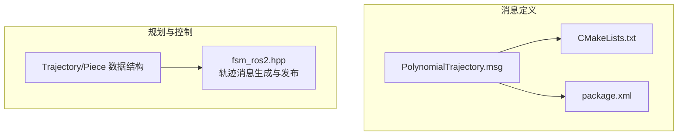
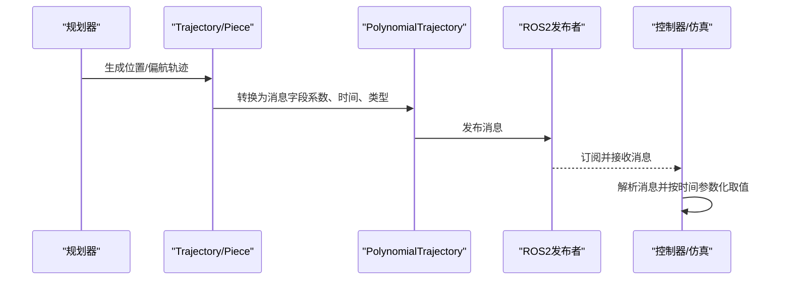
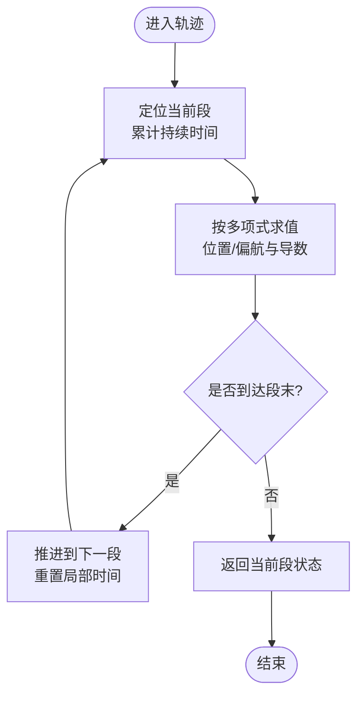
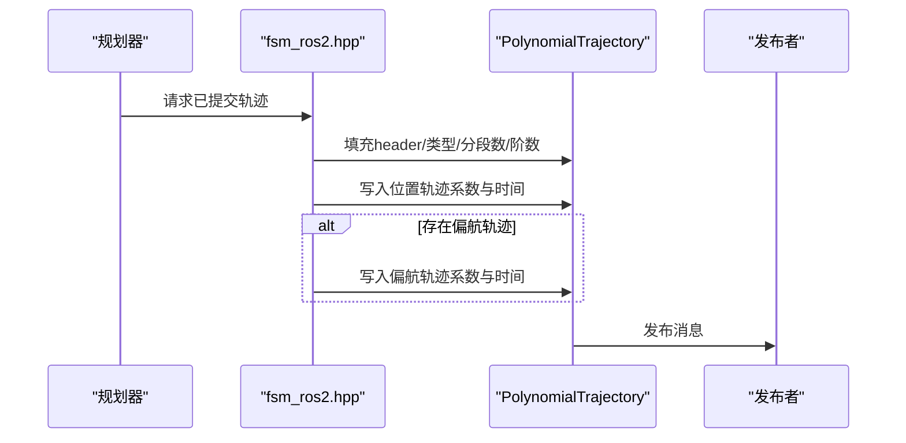
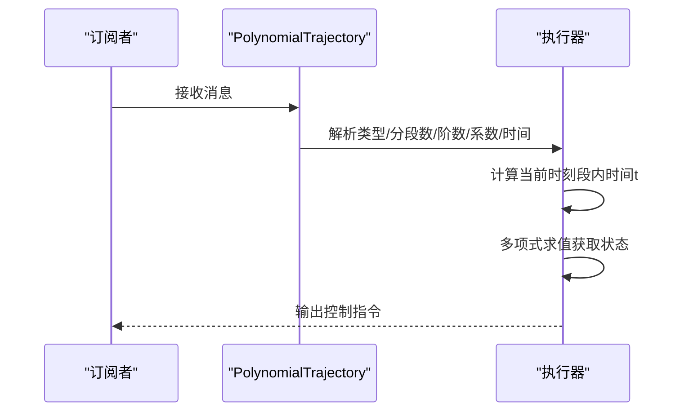
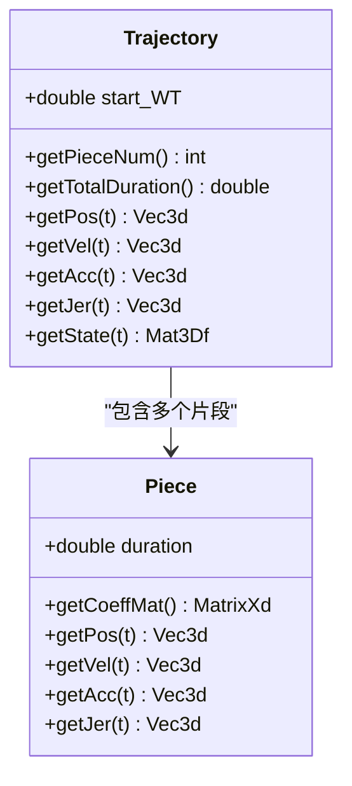

# 多项式轨迹消息

<cite>
**本文引用的文件**
- [PolynomialTrajectory.msg](file://src/SUPER/mars_uav_sim/mars_quadrotor_msgs/ros2_msg/PolynomialTrajectory.msg)
- [CMakeLists.txt](file://src/SUPER/mars_uav_sim/mars_quadrotor_msgs/CMakeLists.txt)
- [package.xml](file://src/SUPER/mars_uav_sim/mars_quadrotor_msgs/package.xml)
- [fsm_ros2.hpp](file://src/SUPER/super_planner/include/ros_interface/ros2/fsm_ros2.hpp)
- [trajectory.h](file://src/SUPER/super_planner/include/data_structure/base/trajectory.h)
- [piece.h](file://src/SUPER/super_planner/include/data_structure/base/piece.h)
- [trajectory.cpp](file://src/SUPER/super_planner/src/utils/trajectory.cpp)
- [API_REFERENCE.md](file://src/SUPER/super_planner/docs/API_REFERENCE.md)
- [trajectory_types.md](file://src/SUPER/super_planner/docs/trajectory_types.md)
</cite>

## 目录
1. [简介](#简介)
2. [项目结构](#项目结构)
3. [核心组件](#核心组件)
4. [架构概览](#架构概览)
5. [详细组件分析](#详细组件分析)
6. [依赖关系分析](#依赖关系分析)
7. [性能考量](#性能考量)
8. [故障排查指南](#故障排查指南)
9. [结论](#结论)
10. [附录](#附录)

## 简介
本文件为多项式轨迹消息（PolynomialTrajectory.msg）的权威API文档，围绕以下目标展开：
- 深入解释轨迹消息的序列化格式与解析方法，涵盖轨迹系数矩阵、时间戳信息、轨迹段落划分等关键要素
- 说明多项式轨迹的数学表示方法，包括时间参数化、空间连续性约束、边界条件设置等技术细节
- 提供轨迹消息的生成、传输与执行的完整流程示例，包括轨迹规划结果的序列化存储与网络传输
- 解释轨迹消息在实时控制系统中的应用方式与性能考虑

## 项目结构
PolynomialTrajectory.msg位于mav_msgs包中，作为ROS2消息类型参与编译与运行时序列化；其在SUPER规划系统中被用于将规划器生成的多项式轨迹发布给控制器与仿真系统。

**图表来源**
- [PolynomialTrajectory.msg](file://src/SUPER/mars_uav_sim/mars_quadrotor_msgs/ros2_msg/PolynomialTrajectory.msg#L1-L39)
- [CMakeLists.txt](file://src/SUPER/mars_uav_sim/mars_quadrotor_msgs/CMakeLists.txt#L24-L37)
- [package.xml](file://src/SUPER/mars_uav_sim/mars_quadrotor_msgs/package.xml#L10-L20)
- [fsm_ros2.hpp](file://src/SUPER/super_planner/include/ros_interface/ros2/fsm_ros2.hpp#L98-L140)
- [trajectory.h](file://src/SUPER/super_planner/include/data_structure/base/trajectory.h#L56-L173)
- [piece.h](file://src/SUPER/super_planner/include/data_structure/base/piece.h#L69-L131)

**章节来源**
- [PolynomialTrajectory.msg](file://src/SUPER/mars_uav_sim/mars_quadrotor_msgs/ros2_msg/PolynomialTrajectory.msg#L1-L39)
- [CMakeLists.txt](file://src/SUPER/mars_uav_sim/mars_quadrotor_msgs/CMakeLists.txt#L24-L37)
- [package.xml](file://src/SUPER/mars_uav_sim/mars_quadrotor_msgs/package.xml#L10-L20)

## 核心组件
- PolynomialTrajectory消息：承载轨迹类型标志、分段数量、多项式阶数、系统起始时间、系数数组与每段持续时间等字段
- Trajectory/Piece数据结构：内部多项式轨迹表示，包含每段的系数矩阵与持续时间
- 发布与解析：规划器将Trajectory转换为PolynomialTrajectory并发布；接收端可按需解析并执行

**章节来源**
- [PolynomialTrajectory.msg](file://src/SUPER/mars_uav_sim/mars_quadrotor_msgs/ros2_msg/PolynomialTrajectory.msg#L2-L39)
- [trajectory.h](file://src/SUPER/super_planner/include/data_structure/base/trajectory.h#L56-L173)
- [piece.h](file://src/SUPER/super_planner/include/data_structure/base/piece.h#L69-L131)

## 架构概览
PolynomialTrajectory消息在系统中的角色如下：
- 生成：规划器将内部Trajectory转换为PolynomialTrajectory，填充消息字段
- 传输：通过ROS2话题发布，供控制器与仿真节点订阅
- 执行：接收端解析消息，按时间参数化计算状态并驱动平台

**图表来源**
- [fsm_ros2.hpp](file://src/SUPER/super_planner/include/ros_interface/ros2/fsm_ros2.hpp#L98-L140)
- [trajectory.h](file://src/SUPER/super_planner/include/data_structure/base/trajectory.h#L56-L173)
- [piece.h](file://src/SUPER/super_planner/include/data_structure/base/piece.h#L69-L131)

## 详细组件分析

### 消息字段与序列化格式
- 消息头：包含时间戳与坐标系标识，便于跨组件同步与变换
- 轨迹类型标志：使用位掩码组合多种类型（心跳、位置轨迹、偏航轨迹、偏航指令、紧急停止）
- 分段与阶数：分别记录位置与偏航轨迹的分段数与多项式阶数
- 时间信息：系统起始时间（墙钟时间）、每段持续时间
- 系数矩阵：按段展开的一维数组，对应X/Y/Z三个方向的位置系数与偏航系数
- 调试信息：字符串形式的调试信息，便于诊断

序列化与反序列化由ROS2 rosidl生成的代码负责，用户侧无需手动处理内存布局。

**章节来源**
- [PolynomialTrajectory.msg](file://src/SUPER/mars_uav_sim/mars_quadrotor_msgs/ros2_msg/PolynomialTrajectory.msg#L2-L39)

### 数学表示与时间参数化
- 每段轨迹由多项式表示，位置与偏航分别独立建模
- 系数矩阵每行对应一个维度（X/Y/Z或偏航），列数等于多项式阶数+1
- 时间参数化：给定段内时间t，通过多项式求值得到状态；段间通过累计持续时间衔接
- 连续性约束：Trajectory/Piece提供位置、速度、加速度、加加速度等状态的连续性保障

**图表来源**
- [trajectory.cpp](file://src/SUPER/super_planner/src/utils/trajectory.cpp#L101-L116)
- [piece.h](file://src/SUPER/super_planner/include/data_structure/base/piece.h#L106-L114)

**章节来源**
- [trajectory.h](file://src/SUPER/super_planner/include/data_structure/base/trajectory.h#L140-L156)
- [piece.h](file://src/SUPER/super_planner/include/data_structure/base/piece.h#L106-L114)

### 边界条件与约束
- 边界条件：位置、速度、加速度、加加速度等状态在段间保持连续
- 物理约束：通过动态参数配置限制最大速度、加速度、加加速度等，确保轨迹可执行
- 轨迹类型：支持位置轨迹、偏航轨迹、心跳信号、紧急停止等多种类型组合

**章节来源**
- [trajectory_types.md](file://src/SUPER/super_planner/docs/trajectory_types.md#L53-L66)
- [API_REFERENCE.md](file://src/SUPER/super_planner/docs/API_REFERENCE.md#L750-L776)

### 生成与发布流程
规划器将内部Trajectory转换为PolynomialTrajectory并发布，典型步骤：
- 填充消息头（时间戳、frame_id）
- 设置类型标志（位置轨迹+心跳）
- 写入位置轨迹：分段数、阶数、每段持续时间、X/Y/Z系数数组
- 若存在偏航轨迹：写入偏航分段数、阶数、系数与每段持续时间
- 发布消息

**图表来源**
- [fsm_ros2.hpp](file://src/SUPER/super_planner/include/ros_interface/ros2/fsm_ros2.hpp#L98-L140)

**章节来源**
- [fsm_ros2.hpp](file://src/SUPER/super_planner/include/ros_interface/ros2/fsm_ros2.hpp#L98-L140)

### 解析与执行流程
接收端解析PolynomialTrajectory并按需执行：
- 解析类型标志，识别心跳、位置、偏航等类型
- 按系统起始时间与当前时间计算段内时间t
- 通过多项式求值获取位置、速度、加速度、加加速度与偏航、偏航率
- 控制器据此生成控制指令

**图表来源**
- [PolynomialTrajectory.msg](file://src/SUPER/mars_uav_sim/mars_quadrotor_msgs/ros2_msg/PolynomialTrajectory.msg#L2-L39)
- [trajectory.h](file://src/SUPER/super_planner/include/data_structure/base/trajectory.h#L140-L156)

**章节来源**
- [PolynomialTrajectory.msg](file://src/SUPER/mars_uav_sim/mars_quadrotor_msgs/ros2_msg/PolynomialTrajectory.msg#L2-L39)
- [trajectory.h](file://src/SUPER/super_planner/include/data_structure/base/trajectory.h#L140-L156)

### 数据结构关系图

**图表来源**
- [trajectory.h](file://src/SUPER/super_planner/include/data_structure/base/trajectory.h#L56-L173)
- [piece.h](file://src/SUPER/super_planner/include/data_structure/base/piece.h#L69-L131)

## 依赖关系分析
- 消息生成依赖：规划器内部Trajectory/Piece数据结构
- 消息传输依赖：ROS2消息系统与话题发布/订阅
- 消息解析依赖：接收端按消息字段顺序读取并重建状态

**图表来源**
- [fsm_ros2.hpp](file://src/SUPER/super_planner/include/ros_interface/ros2/fsm_ros2.hpp#L98-L140)
- [PolynomialTrajectory.msg](file://src/SUPER/mars_uav_sim/mars_quadrotor_msgs/ros2_msg/PolynomialTrajectory.msg#L2-L39)

**章节来源**
- [CMakeLists.txt](file://src/SUPER/mars_uav_sim/mars_quadrotor_msgs/CMakeLists.txt#L24-L37)
- [package.xml](file://src/SUPER/mars_uav_sim/mars_quadrotor_msgs/package.xml#L10-L20)

## 性能考量
- 消息大小：系数数组按段线性展开，段数越多消息越大；可通过减少分段数或降低阶数控制带宽
- 解析开销：多项式求值为常数时间操作，但频繁解析与求值会带来CPU开销；建议在高频控制回路中缓存必要中间结果
- 实时性：消息发布频率与控制回路频率匹配，避免过低导致控制滞后，过高导致带宽压力
- 参数调节：通过动态参数调整最大速度、加速度、加加速度等，平衡性能与安全性

[本节为通用性能指导，不直接分析具体文件]

## 故障排查指南
- 类型标志异常：检查类型字段是否正确设置（位置轨迹、偏航轨迹、心跳、紧急停止等）
- 系数数组长度不匹配：确认分段数与阶数一致，且系数数组长度为分段数×(阶数+1)
- 时间戳问题：核对系统起始时间与当前时间差，避免时间漂移导致状态错乱
- 消息未到达：检查话题名称、命名空间与QoS配置，确保发布/订阅双方一致
- 执行异常：验证边界条件与物理约束参数，确保轨迹满足平台能力

**章节来源**
- [PolynomialTrajectory.msg](file://src/SUPER/mars_uav_sim/mars_quadrotor_msgs/ros2_msg/PolynomialTrajectory.msg#L2-L39)
- [API_REFERENCE.md](file://src/SUPER/super_planner/docs/API_REFERENCE.md#L750-L776)

## 结论
PolynomialTrajectory.msg提供了紧凑而完整的多项式轨迹表达，结合Trajectory/Piece数据结构与ROS2消息系统，实现了从规划到执行的闭环。通过合理设置分段数、阶数与边界条件，并配合动态参数调节，可在性能与安全性之间取得良好平衡。

[本节为总结性内容，不直接分析具体文件]

## 附录
- 消息字段清单与含义详见消息定义文件
- 发布与解析示例参见规划器中的消息生成与发布逻辑
- 参数配置与动态调节参见规划器文档

**章节来源**
- [PolynomialTrajectory.msg](file://src/SUPER/mars_uav_sim/mars_quadrotor_msgs/ros2_msg/PolynomialTrajectory.msg#L2-L39)
- [fsm_ros2.hpp](file://src/SUPER/super_planner/include/ros_interface/ros2/fsm_ros2.hpp#L98-L140)
- [API_REFERENCE.md](file://src/SUPER/super_planner/docs/API_REFERENCE.md#L562-L625)