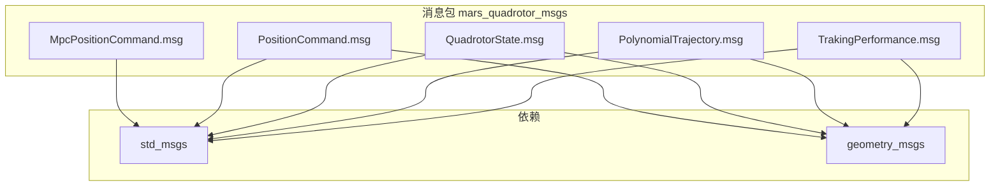
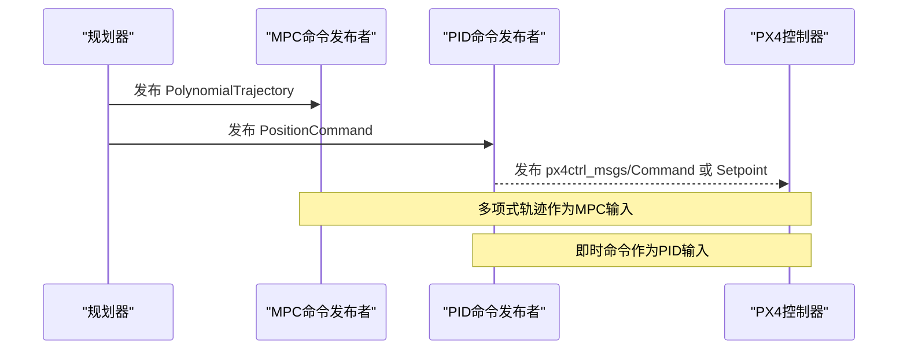
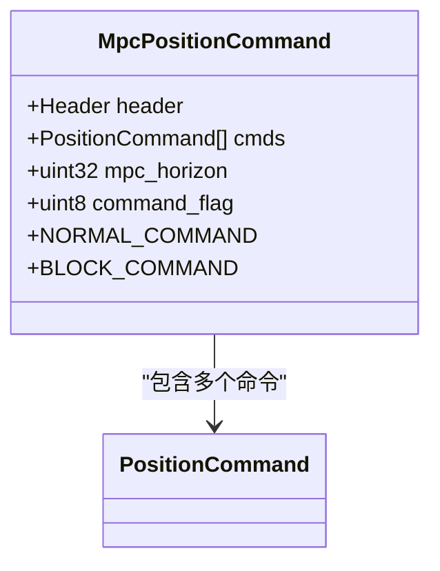
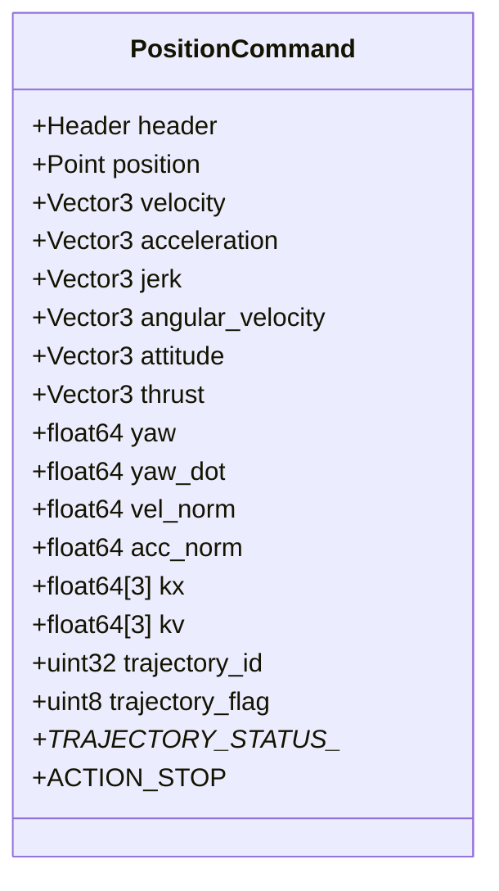
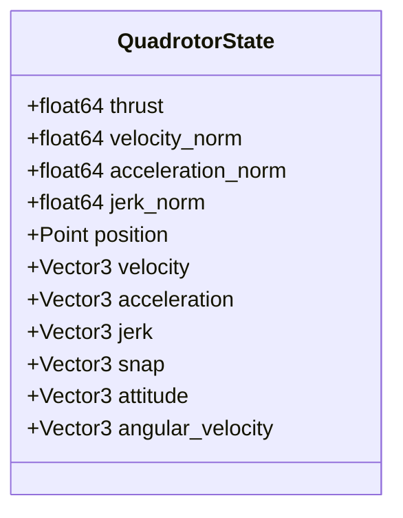
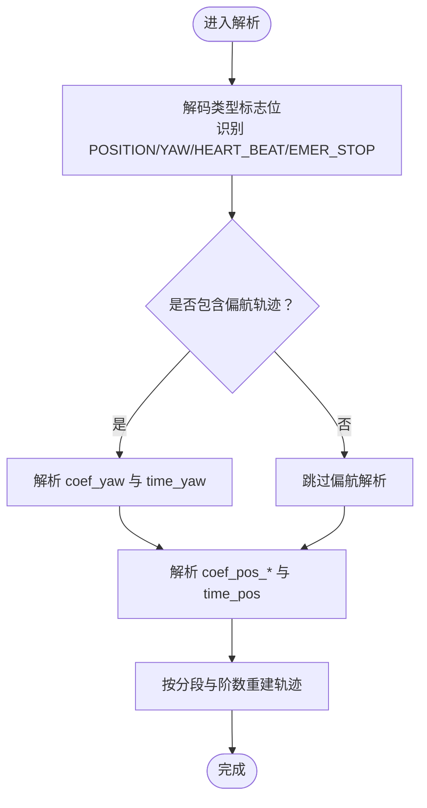
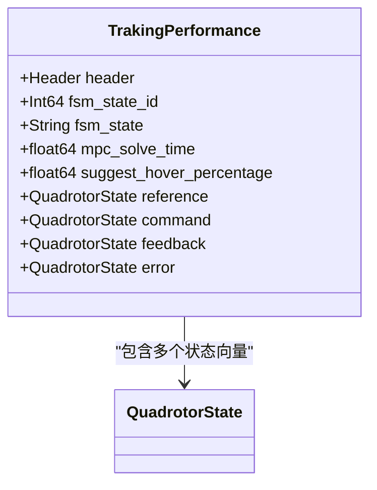
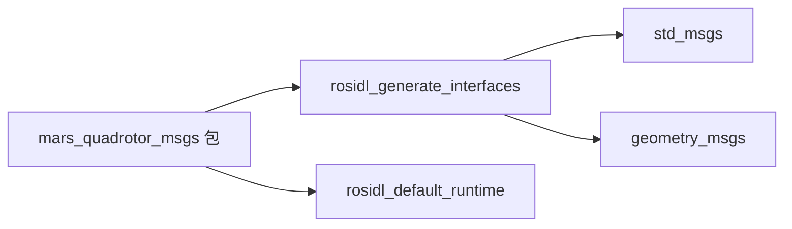

# 消息类型API

<cite>
**本文引用的消息文件**
- [MpcPositionCommand.msg](file://src/SUPER/mars_uav_sim/mars_quadrotor_msgs/ros2_msg/MpcPositionCommand.msg)
- [PositionCommand.msg](file://src/SUPER/mars_uav_sim/mars_quadrotor_msgs/ros2_msg/PositionCommand.msg)
- [QuadrotorState.msg](file://src/SUPER/mars_uav_sim/mars_quadrotor_msgs/ros2_msg/QuadrotorState.msg)
- [PolynomialTrajectory.msg](file://src/SUPER/mars_uav_sim/mars_quadrotor_msgs/ros2_msg/PolynomialTrajectory.msg)
- [TrakingPerformance.msg](file://src/SUPER/mars_uav_sim/mars_quadrotor_msgs/ros2_msg/TrakingPerformance.msg)
- [CMakeLists.txt](file://src/SUPER/mars_uav_sim/mars_quadrotor_msgs/CMakeLists.txt)
- [package.xml](file://src/SUPER/mars_uav_sim/mars_quadrotor_msgs/package.xml)
- [fsm_ros2.hpp](file://src/SUPER/super_planner/include/ros_interface/ros2/fsm_ros2.hpp)
- [command_topics.md](file://src/SUPER/super_planner/docs/command_topics.md)
- [Command.msg](file://src/SUPER/mars_uav_sim/px4ctrl_msgs/msg/Command.msg)
- [Setpoint.msg](file://src/SUPER/mars_uav_sim/px4ctrl_msgs/msg/Setpoint.msg)
- [State.msg](file://src/SUPER/mars_uav_sim/px4ctrl_msgs/msg/State.msg)
</cite>

## 目录
1. [简介](#简介)
2. [项目结构](#项目结构)
3. [核心组件](#核心组件)
4. [架构总览](#架构总览)
5. [详细组件分析](#详细组件分析)
6. [依赖分析](#依赖分析)
7. [性能考虑](#性能考虑)
8. [故障排查指南](#故障排查指南)
9. [结论](#结论)
10. [附录](#附录)

## 简介
本文件面向SUPER项目中的自定义消息类型API，围绕以下五类消息展开：MPC位置命令消息（MpcPositionCommand.msg）、位置命令消息（PositionCommand.msg）、四旋翼机状态消息（QuadrotorState.msg）、多项式轨迹消息（PolynomialTrajectory.msg）、跟踪性能消息（TrakingPerformance.msg）。文档将逐条解释字段定义、数据类型、取值范围与典型用法，并结合系统架构说明消息在规划与控制链路中的流转与转换。

## 项目结构
该消息包位于mars_quadrotor_msgs中，包含标准消息依赖（std_msgs、geometry_msgs），并通过ROS2接口生成工具生成对应语言绑定。消息文件集中于ros2_msg目录，构建脚本在CMakeLists.txt中声明，包元信息在package.xml中定义。

图表来源
- [CMakeLists.txt](file://src/SUPER/mars_uav_sim/mars_quadrotor_msgs/CMakeLists.txt#L24-L37)
- [package.xml](file://src/SUPER/mars_uav_sim/mars_quadrotor_msgs/package.xml#L13-L16)

章节来源
- [CMakeLists.txt](file://src/SUPER/mars_uav_sim/mars_quadrotor_msgs/CMakeLists.txt#L1-L46)
- [package.xml](file://src/SUPER/mars_uav_sim/mars_quadrotor_msgs/package.xml#L1-L26)

## 核心组件
本节概述五类消息的核心用途与关键字段，便于快速定位与理解。

- MpcPositionCommand.msg：MPC控制周期内发布的多步位置命令集合，包含时间窗（mpc_horizon）、命令标志（command_flag）以及命令数组（cmds）。常用于MPC滚动优化的短期指令下发。
- PositionCommand.msg：单时刻的高阶状态命令，包含位置、速度、加速度、加加速度、角速度、姿态、推力、偏航角与偏航角速度等；同时包含轨迹ID、轨迹标志位及PID增益等控制参数，适合作为PID控制器的即时参考。
- QuadrotorState.msg：四旋翼机状态向量，覆盖推力、速度范数、加速度范数、加加速度范数、位置、速度、加速度、加加速度、Snap、姿态、角速度等，用于描述当前飞行状态。
- PolynomialTrajectory.msg：多项式轨迹消息，包含轨迹ID、类型标志位（位置/偏航/心跳/紧急停止）、分段数量、多项式阶数、起始系统墙钟时间、多项式系数数组与每段持续时间，以及调试信息。支持位置与偏航轨迹的组合编码。
- TrakingPerformance.msg：跟踪性能指标消息，包含MPC有限状态机状态、求解耗时、悬停建议比例，以及reference（期望）、command（命令）、feedback（反馈）、error（误差）四个状态向量，用于评估跟踪质量与控制表现。

章节来源
- [MpcPositionCommand.msg](file://src/SUPER/mars_uav_sim/mars_quadrotor_msgs/ros2_msg/MpcPositionCommand.msg#L1-L7)
- [PositionCommand.msg](file://src/SUPER/mars_uav_sim/mars_quadrotor_msgs/ros2_msg/PositionCommand.msg#L1-L30)
- [QuadrotorState.msg](file://src/SUPER/mars_uav_sim/mars_quadrotor_msgs/ros2_msg/QuadrotorState.msg#L1-L11)
- [PolynomialTrajectory.msg](file://src/SUPER/mars_uav_sim/mars_quadrotor_msgs/ros2_msg/PolynomialTrajectory.msg#L1-L39)
- [TrakingPerformance.msg](file://src/SUPER/mars_uav_sim/mars_quadrotor_msgs/ros2_msg/TrakingPerformance.msg#L1-L16)

## 架构总览
下图展示了消息在系统中的角色与流向：规划器生成多项式轨迹或即时位置命令，经由消息发布到控制链路；部分节点会将PositionCommand转换为PX4期望状态或命令消息，形成从高层轨迹到底层控制指令的映射。

图表来源
- [command_topics.md](file://src/SUPER/super_planner/docs/command_topics.md#L1-L63)
- [fsm_ros2.hpp](file://src/SUPER/super_planner/include/ros_interface/ros2/fsm_ros2.hpp#L40-L62)
- [fsm_ros2.hpp](file://src/SUPER/super_planner/include/ros_interface/ros2/fsm_ros2.hpp#L108-L141)
- [fsm_ros2.hpp](file://src/SUPER/super_planner/include/ros_interface/ros2/fsm_ros2.hpp#L381-L410)
- [Command.msg](file://src/SUPER/mars_uav_sim/px4ctrl_msgs/msg/Command.msg#L2-L17)
- [Setpoint.msg](file://src/SUPER/mars_uav_sim/px4ctrl_msgs/msg/Setpoint.msg#L2-L13)

## 详细组件分析

### MpcPositionCommand.msg 分析
- 字段与含义
  - header：标准消息头，包含时间戳与坐标系标识。
  - cmds：PositionCommand数组，按MPC滚动窗口顺序排列的未来若干时刻的命令。
  - mpc_horizon：MPC滚动窗口大小（步数）。
  - command_flag：命令标志，NORMAL_COMMAND与BLOCK_COMMAND用于指示命令有效性或阻断策略。
- 使用场景
  - 适用于MPC滚动优化输出的短期命令序列，便于控制系统在每个控制步长内选择合适的命令执行。
- 取值范围与约束
  - mpc_horizon为非负整数；command_flag取值见消息内枚举常量。

图表来源
- [MpcPositionCommand.msg](file://src/SUPER/mars_uav_sim/mars_quadrotor_msgs/ros2_msg/MpcPositionCommand.msg#L1-L7)
- [PositionCommand.msg](file://src/SUPER/mars_uav_sim/mars_quadrotor_msgs/ros2_msg/PositionCommand.msg#L1-L30)

章节来源
- [MpcPositionCommand.msg](file://src/SUPER/mars_uav_sim/mars_quadrotor_msgs/ros2_msg/MpcPositionCommand.msg#L1-L7)

### PositionCommand.msg 分析
- 字段与含义
  - header：标准消息头。
  - position：目标位置（Point）。
  - velocity/acceleration/jerk：目标速度/加速度/加加速度（Vector3）。
  - angular_velocity：目标角速度（Vector3）。
  - attitude：目标姿态（Vector3，通常为欧拉角）。
  - thrust：推力向量（Vector3）。
  - yaw/yaw_dot：偏航角与偏航角速度（float64）。
  - vel_norm/acc_norm：速度与加速度的范数（float64）。
  - kx/kv：位置/速度控制增益（float64[3]）。
  - trajectory_id：轨迹ID（uint32，从1开始）。
  - trajectory_flag：轨迹标志位（uint8，ID从1开始，可与0比较）。
  - TRAJECTORY_STATUS_*：轨迹状态枚举常量。
  - ACTION_STOP：停止动作常量。
- 使用场景
  - 作为PID控制器的即时参考输入，提供高阶状态与控制参数。
- 取值范围与约束
  - kx/kv为控制增益，需结合系统模型与稳定性要求设定；
  - trajectory_id从1开始，0用于未指定或空状态；
  - 各范数字段为非负实数。

图表来源
- [PositionCommand.msg](file://src/SUPER/mars_uav_sim/mars_quadrotor_msgs/ros2_msg/PositionCommand.msg#L1-L30)

章节来源
- [PositionCommand.msg](file://src/SUPER/mars_uav_sim/mars_quadrotor_msgs/ros2_msg/PositionCommand.msg#L1-L30)

### QuadrotorState.msg 分析
- 字段与含义
  - thrust：瞬时推力（float64）。
  - velocity_norm/acceleration_norm/jerk_norm：速度/加速度/加加速度范数（float64）。
  - position/velocity/acceleration/jerk：位置/速度/加速度/加加速度（Point/Vector3）。
  - snap：Snap（加加速度变化率，Vector3）。
  - attitude/angular_velocity：姿态（欧拉角）与角速度（Vector3）。
- 使用场景
  - 描述当前飞行状态，用于性能评估、误差计算与可视化。
- 取值范围与约束
  - 各范数字段为非负实数；姿态与角速度为连续物理量。

图表来源
- [QuadrotorState.msg](file://src/SUPER/mars_uav_sim/mars_quadrotor_msgs/ros2_msg/QuadrotorState.msg#L1-L11)

章节来源
- [QuadrotorState.msg](file://src/SUPER/mars_uav_sim/mars_quadrotor_msgs/ros2_msg/QuadrotorState.msg#L1-L11)

### PolynomialTrajectory.msg 分析
- 字段与含义
  - header：标准消息头。
  - trajectory_id：轨迹ID（uint32，从1开始）。
  - type：轨迹类型标志位（uint32），通过位掩码组合，如HEART_BEAT、POSITION_TRAJ、YAW_TRAJ、YAW_COMMAND、EMER_STOP。
  - piece_num_* / order_*：位置/偏航轨迹的分段数与多项式阶数。
  - start_wt_*：位置/偏航轨迹的系统起始时间（float64）。
  - coef_*：X/Y/Z三轴位置多项式系数数组（float64[]）；coef_yaw：偏航多项式系数数组。
  - time_*：位置/偏航轨迹每段持续时间数组（float64[]）。
  - debug_info：调试信息（string）。
- 序列化与解析要点
  - 采用线性数组存储多项式系数与时间分配，便于高效传输与解析；
  - 类型标志位采用位运算组合，便于在接收端解码识别不同类型的轨迹分量。
- 使用场景
  - 作为MPC控制器的输入，提供未来一段时间内的完整轨迹；也可用于可视化与回放。

图表来源
- [PolynomialTrajectory.msg](file://src/SUPER/mars_uav_sim/mars_quadrotor_msgs/ros2_msg/PolynomialTrajectory.msg#L1-L39)

章节来源
- [PolynomialTrajectory.msg](file://src/SUPER/mars_uav_sim/mars_quadrotor_msgs/ros2_msg/PolynomialTrajectory.msg#L1-L39)

### TrakingPerformance.msg 分析
- 字段与含义
  - header：标准消息头。
  - fsm_state_id：MPC有限状态机状态ID（Int64）。
  - fsm_state：MPC有限状态机状态名称（String）。
  - mpc_solve_time：MPC求解耗时（float64）。
  - suggest_hover_percentage：悬停建议比例（float64）。
  - reference/command/feedback/error：期望、命令、反馈、误差四个QuadrotorState向量。
- 指标定义与计算
  - mpc_solve_time：衡量MPC优化求解的实时性；
  - suggest_hover_percentage：基于跟踪误差与系统能力给出的悬停建议比例；
  - error = reference - feedback：用于评估跟踪精度与鲁棒性。
- 使用场景
  - 性能监控与调参辅助，评估控制链路整体表现。

图表来源
- [TrakingPerformance.msg](file://src/SUPER/mars_uav_sim/mars_quadrotor_msgs/ros2_msg/TrakingPerformance.msg#L1-L16)
- [QuadrotorState.msg](file://src/SUPER/mars_uav_sim/mars_quadrotor_msgs/ros2_msg/QuadrotorState.msg#L1-L11)

章节来源
- [TrakingPerformance.msg](file://src/SUPER/mars_uav_sim/mars_quadrotor_msgs/ros2_msg/TrakingPerformance.msg#L1-L16)

## 依赖分析
消息包对标准消息与几何消息的依赖清晰明确，构建脚本统一声明了生成接口与导出依赖。

图表来源
- [CMakeLists.txt](file://src/SUPER/mars_uav_sim/mars_quadrotor_msgs/CMakeLists.txt#L18-L40)
- [package.xml](file://src/SUPER/mars_uav_sim/mars_quadrotor_msgs/package.xml#L10-L16)

章节来源
- [CMakeLists.txt](file://src/SUPER/mars_uav_sim/mars_quadrotor_msgs/CMakeLists.txt#L18-L40)
- [package.xml](file://src/SUPER/mars_uav_sim/mars_quadrotor_msgs/package.xml#L10-L16)

## 性能考虑
- 多项式轨迹的系数与时间数组采用一维数组线性存储，有利于内存局部性与高效序列化/反序列化。
- PositionCommand与PolynomialTrajectory均包含范数字段（vel_norm/acc_norm等），可用于快速判断状态规模，辅助控制参数自适应调整。
- TrakingPerformance中的求解耗时与悬停建议比例可用于在线性能监控与动态调度。

## 故障排查指南
- 命令无效或阻断
  - 若MpcPositionCommand的command_flag被设置为BLOCK_COMMAND，则控制系统应视为阻断命令，检查上层策略逻辑。
- 轨迹ID不一致
  - PositionCommand与PolynomialTrajectory的trajectory_id需保持一致，否则可能导致跟踪不匹配；确认轨迹生成与发布流程的一致性。
- 类型标志位错误
  - PolynomialTrajectory的type字段通过位运算组合，若解码失败，检查发送端的组合逻辑与接收端的解码流程。
- 状态范数异常
  - QuadrotorState中的范数字段为非负，若出现负值或NaN，需检查传感器数据与滤波算法。

章节来源
- [MpcPositionCommand.msg](file://src/SUPER/mars_uav_sim/mars_quadrotor_msgs/ros2_msg/MpcPositionCommand.msg#L4-L6)
- [PositionCommand.msg](file://src/SUPER/mars_uav_sim/mars_quadrotor_msgs/ros2_msg/PositionCommand.msg#L18-L29)
- [PolynomialTrajectory.msg](file://src/SUPER/mars_uav_sim/mars_quadrotor_msgs/ros2_msg/PolynomialTrajectory.msg#L12-L16)

## 结论
本文档系统梳理了SUPER项目中五类关键消息的字段定义、数据类型、取值范围与典型用法，并结合系统架构说明了消息在规划与控制链路中的流转与转换。通过明确的字段语义与流程图示，开发者可更高效地集成与调试相关功能模块。

## 附录

### 消息转换与序列化示例（路径指引）
- 从多项式轨迹到PID命令的填充
  - 参考路径：[fsm_ros2.hpp](file://src/SUPER/super_planner/include/ros_interface/ros2/fsm_ros2.hpp#L108-L141)
  - 参考路径：[fsm_ros2.hpp](file://src/SUPER/super_planner/include/ros_interface/ros2/fsm_ros2.hpp#L143-L169)
- 从PID命令到PX4期望状态/命令的转换
  - 参考路径：[fsm_ros2.hpp](file://src/SUPER/super_planner/include/ros_interface/ros2/fsm_ros2.hpp#L381-L410)
  - 参考路径：[Command.msg](file://src/SUPER/mars_uav_sim/px4ctrl_msgs/msg/Command.msg#L2-L17)
  - 参考路径：[Setpoint.msg](file://src/SUPER/mars_uav_sim/px4ctrl_msgs/msg/Setpoint.msg#L2-L13)
- 命令话题与消息类型说明
  - 参考路径：[command_topics.md](file://src/SUPER/super_planner/docs/command_topics.md#L1-L63)