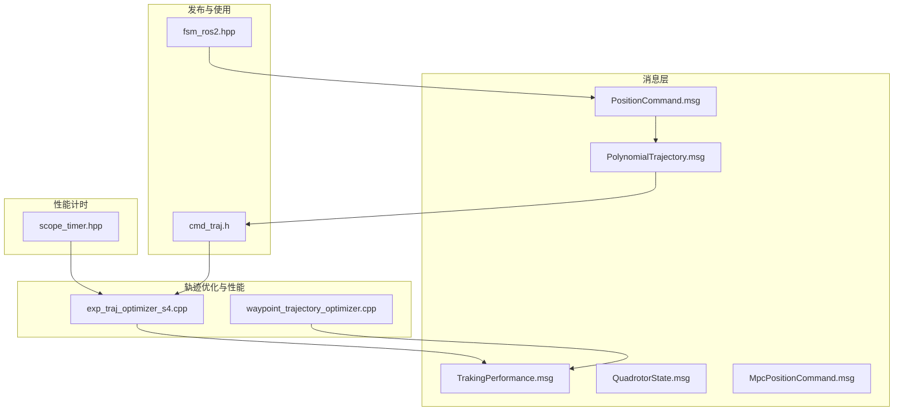
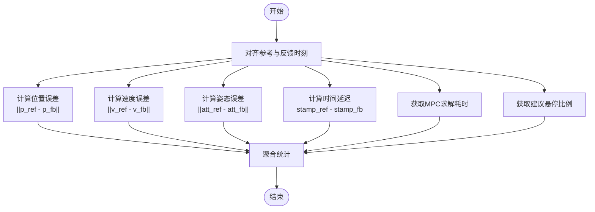
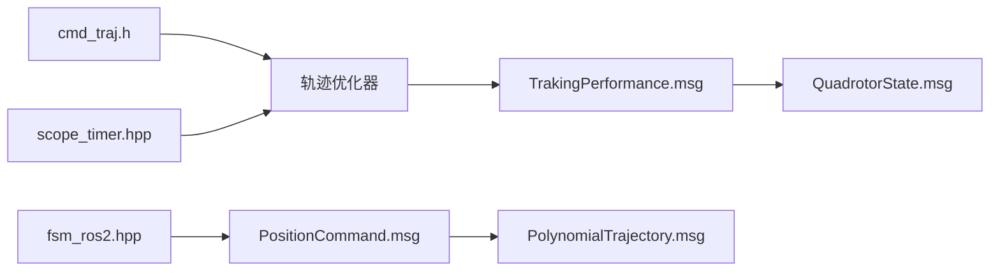

# 跟踪性能消息

<cite>
**本文引用的文件**
- [TrakingPerformance.msg](file://src/SUPER/mars_uav_sim/mars_quadrotor_msgs/ros2_msg/TrakingPerformance.msg)
- [QuadrotorState.msg](file://src/SUPER/mars_uav_sim/mars_quadrotor_msgs/ros2_msg/QuadrotorState.msg)
- [MpcPositionCommand.msg](file://src/SUPER/mars_uav_sim/mars_quadrotor_msgs/ros2_msg/MpcPositionCommand.msg)
- [PolynomialTrajectory.msg](file://src/SUPER/mars_uav_sim/mars_quadrotor_msgs/ros2_msg/PolynomialTrajectory.msg)
- [PositionCommand.msg](file://src/SUPER/mars_uav_sim/mars_quadrotor_msgs/ros2_msg/PositionCommand.msg)
- [fsm_ros2.hpp](file://src/SUPER/super_planner/include/ros_interface/ros2/fsm_ros2.hpp)
- [cmd_traj.h](file://src/SUPER/super_planner/include/data_structure/cmd_traj.h)
- [exp_traj_optimizer_s4.cpp](file://src/SUPER/super_planner/src/traj_opt/exp_traj_optimizer_s4.cpp)
- [waypoint_trajectory_optimizer.cpp](file://src/SUPER/super_planner/src/utils/waypoint_trajectory_optimizer.cpp)
- [scope_timer.hpp](file://src/SUPER/mars_uav_sim/marsim_render/include/marsim_render/scope_timer.hpp)
</cite>

## 目录
1. [简介](#简介)
2. [项目结构](#项目结构)
3. [核心组件](#核心组件)
4. [架构总览](#架构总览)
5. [详细组件分析](#详细组件分析)
6. [依赖关系分析](#依赖关系分析)
7. [性能考量](#性能考量)
8. [故障排查指南](#故障排查指南)
9. [结论](#结论)
10. [附录](#附录)

## 简介
本文件为跟踪性能消息（TrakingPerformance.msg）的完整API文档。该消息用于在飞行器轨迹跟踪系统中记录关键性能指标，包括MPC求解耗时、建议悬停比例、参考/命令/反馈/误差四态（QuadrotorState）等。通过这些指标，可以量化位置、姿态、速度跟踪误差，评估系统实时性与稳定性，并支持性能阈值设定、异常检测与报告生成。

## 项目结构
围绕TrakingPerformance消息的关键文件与模块如下：
- 消息定义：TrakingPerformance.msg、QuadrotorState.msg、MpcPositionCommand.msg、PolynomialTrajectory.msg、PositionCommand.msg
- 发布与使用：fsm_ros2.hpp（发布轨迹命令）、cmd_traj.h（轨迹查询接口）
- 性能计算与优化：exp_traj_optimizer_s4.cpp、waypoint_trajectory_optimizer.cpp
- 性能计时工具：scope_timer.hpp



**图表来源**
- [TrakingPerformance.msg](file://src/SUPER/mars_uav_sim/mars_quadrotor_msgs/ros2_msg/TrakingPerformance.msg#L1-L16)
- [QuadrotorState.msg](file://src/SUPER/mars_uav_sim/mars_quadrotor_msgs/ros2_msg/QuadrotorState.msg#L1-L11)
- [MpcPositionCommand.msg](file://src/SUPER/mars_uav_sim/mars_quadrotor_msgs/ros2_msg/MpcPositionCommand.msg#L1-L6)
- [PolynomialTrajectory.msg](file://src/SUPER/mars_uav_sim/mars_quadrotor_msgs/ros2_msg/PolynomialTrajectory.msg#L24-L38)
- [PositionCommand.msg](file://src/SUPER/mars_uav_sim/mars_quadrotor_msgs/ros2_msg/PositionCommand.msg#L16-L29)
- [fsm_ros2.hpp](file://src/SUPER/super_planner/include/ros_interface/ros2/fsm_ros2.hpp#L143-L169)
- [cmd_traj.h](file://src/SUPER/super_planner/include/data_structure/cmd_traj.h#L122-L178)
- [exp_traj_optimizer_s4.cpp](file://src/SUPER/super_planner/src/traj_opt/exp_traj_optimizer_s4.cpp#L42-L92)
- [waypoint_trajectory_optimizer.cpp](file://src/SUPER/super_planner/src/utils/waypoint_trajectory_optimizer.cpp#L271-L393)
- [scope_timer.hpp](file://src/SUPER/mars_uav_sim/marsim_render/include/marsim_render/scope_timer.hpp#L34-L117)

**章节来源**
- [TrakingPerformance.msg](file://src/SUPER/mars_uav_sim/mars_quadrotor_msgs/ros2_msg/TrakingPerformance.msg#L1-L16)
- [QuadrotorState.msg](file://src/SUPER/mars_uav_sim/mars_quadrotor_msgs/ros2_msg/QuadrotorState.msg#L1-L11)
- [MpcPositionCommand.msg](file://src/SUPER/mars_uav_sim/mars_quadrotor_msgs/ros2_msg/MpcPositionCommand.msg#L1-L6)
- [PolynomialTrajectory.msg](file://src/SUPER/mars_uav_sim/mars_quadrotor_msgs/ros2_msg/PolynomialTrajectory.msg#L24-L38)
- [PositionCommand.msg](file://src/SUPER/mars_uav_sim/mars_quadrotor_msgs/ros2_msg/PositionCommand.msg#L16-L29)
- [fsm_ros2.hpp](file://src/SUPER/super_planner/include/ros_interface/ros2/fsm_ros2.hpp#L143-L169)
- [cmd_traj.h](file://src/SUPER/super_planner/include/data_structure/cmd_traj.h#L122-L178)
- [exp_traj_optimizer_s4.cpp](file://src/SUPER/super_planner/src/traj_opt/exp_traj_optimizer_s4.cpp#L42-L92)
- [waypoint_trajectory_optimizer.cpp](file://src/SUPER/super_planner/src/utils/waypoint_trajectory_optimizer.cpp#L271-L393)
- [scope_timer.hpp](file://src/SUPER/mars_uav_sim/marsim_render/include/marsim_render/scope_timer.hpp#L34-L117)

## 核心组件
- TrakingPerformance消息字段
  - 头部与FSM状态：std_msgs/Header、std_msgs/Int64、std_msgs/String
  - MPC求解耗时与悬停建议：float64、float64
  - 四态：reference、command、feedback、error（均为QuadrotorState）
- QuadrotorState字段
  - 力与速度范数、加速度范数、加速度率范数、位置、速度、加速度、加速度率、急动度、姿态欧拉角、角速度
- 关联消息
  - MpcPositionCommand.msg：MPC命令序列与步长
  - PolynomialTrajectory.msg：多项式轨迹系数与时长
  - PositionCommand.msg：轨迹标志位与控制增益

**章节来源**
- [TrakingPerformance.msg](file://src/SUPER/mars_uav_sim/mars_quadrotor_msgs/ros2_msg/TrakingPerformance.msg#L1-L16)
- [QuadrotorState.msg](file://src/SUPER/mars_uav_sim/mars_quadrotor_msgs/ros2_msg/QuadrotorState.msg#L1-L11)
- [MpcPositionCommand.msg](file://src/SUPER/mars_uav_sim/mars_quadrotor_msgs/ros2_msg/MpcPositionCommand.msg#L1-L6)
- [PolynomialTrajectory.msg](file://src/SUPER/mars_uav_sim/mars_quadrotor_msgs/ros2_msg/PolynomialTrajectory.msg#L24-L38)
- [PositionCommand.msg](file://src/SUPER/mars_uav_sim/mars_quadrotor_msgs/ros2_msg/PositionCommand.msg#L16-L29)

## 架构总览
下图展示从轨迹生成到性能消息发布的端到端流程，以及性能指标的来源与计算位置。

```mermaid
sequenceDiagram
participant Planner as "轨迹规划器"
participant FSM as "状态机(fsm_ros2)"
participant Cmd as "PositionCommand"
participant Traj as "PolynomialTrajectory"
participant Opt as "轨迹优化(exp/waypoint)"
participant Perf as "TrakingPerformance"
Planner->>FSM : 获取一条轨迹点
FSM->>Cmd : 填充位置/速度/加速度/急动度与姿态
FSM->>Traj : 填充轨迹系数与时间分段
FSM-->>Planner : 发布命令序列
Planner->>Opt : 使用优化器计算代价/梯度
Opt-->>Perf : 记录MPC求解耗时与建议悬停比例
Planner->>Perf : 填充reference/command/feedback/error四态
Perf-->>Planner : 输出性能消息
```

**图表来源**
- [fsm_ros2.hpp](file://src/SUPER/super_planner/include/ros_interface/ros2/fsm_ros2.hpp#L143-L169)
- [cmd_traj.h](file://src/SUPER/super_planner/include/data_structure/cmd_traj.h#L122-L178)
- [exp_traj_optimizer_s4.cpp](file://src/SUPER/super_planner/src/traj_opt/exp_traj_optimizer_s4.cpp#L42-L92)
- [waypoint_trajectory_optimizer.cpp](file://src/SUPER/super_planner/src/utils/waypoint_trajectory_optimizer.cpp#L271-L393)
- [TrakingPerformance.msg](file://src/SUPER/mars_uav_sim/mars_quadrotor_msgs/ros2_msg/TrakingPerformance.msg#L1-L16)

## 详细组件分析

### TrakingPerformance消息定义与用途
- 字段说明
  - header：时间戳与坐标系标识
  - fsm_state_id：FSM状态整型ID
  - fsm_state：FSM状态字符串描述
  - mpc_solve_time：单次MPC求解耗时（秒）
  - suggest_hover_percentage：建议悬停比例（0~100）
  - reference/command/feedback/error：QuadrotorState四态
- 用途
  - 记录系统在某一时刻的跟踪性能快照，便于离线分析与在线监控

**章节来源**
- [TrakingPerformance.msg](file://src/SUPER/mars_uav_sim/mars_quadrotor_msgs/ros2_msg/TrakingPerformance.msg#L1-L16)

### QuadrotorState字段与派生指标
- 字段
  - thrust、velocity_norm、acceleration_norm、jerk_norm
  - position、velocity、acceleration、jerk、snap
  - attitude（欧拉角）、angular_velocity
- 派生指标
  - 位置跟踪误差：||position_reference - position_feedback||
  - 速度跟踪误差：||velocity_reference - velocity_feedback||
  - 姿态跟踪误差：||attitude_reference - attitude_feedback||（角度范数）
  - 跟踪时间延迟：feedback与reference的时间戳差（由header.stamp体现）

**章节来源**
- [QuadrotorState.msg](file://src/SUPER/mars_uav_sim/mars_quadrotor_msgs/ros2_msg/QuadrotorState.msg#L1-L11)

### 性能指标计算与评估
- 位置/速度/姿态误差
  - 采用向量范数（如L2范数）计算三轴误差，再取标量作为指标
  - 参考与反馈应来自同一时刻（或严格对齐的时间戳）
- 跟踪时间延迟
  - 通过消息头时间戳差估计，单位通常为秒
  - 建议统计均值、中位数、P95等分位数
- MPC求解耗时
  - 由优化器内部计时或外部计时器记录，单位秒
  - 可统计平均值、最大值、超阈值比例
- 建议悬停比例
  - 表征系统在当前轨迹段中需要悬停的比例，辅助判断轨迹可行性与安全性



**图表来源**
- [TrakingPerformance.msg](file://src/SUPER/mars_uav_sim/mars_quadrotor_msgs/ros2_msg/TrakingPerformance.msg#L1-L16)
- [QuadrotorState.msg](file://src/SUPER/mars_uav_sim/mars_quadrotor_msgs/ros2_msg/QuadrotorState.msg#L1-L11)

**章节来源**
- [TrakingPerformance.msg](file://src/SUPER/mars_uav_sim/mars_quadrotor_msgs/ros2_msg/TrakingPerformance.msg#L1-L16)
- [QuadrotorState.msg](file://src/SUPER/mars_uav_sim/mars_quadrotor_msgs/ros2_msg/QuadrotorState.msg#L1-L11)

### 性能数据收集、处理与分析示例（步骤说明）
- 数据收集
  - 订阅TrakingPerformance消息，保存每条消息中的四态与性能字段
- 数据处理
  - 对位置/速度/姿态误差进行滑动窗口统计（均值、方差、分位数）
  - 对MPC求解耗时与时间延迟进行累积分布统计
- 分析与可视化
  - 绘制误差随时间变化曲线、热力图或箱线图
  - 生成性能报告（含平均值、P95、异常比例等）

[本节为通用流程说明，不直接分析具体文件，故无“章节来源”]

### 性能阈值设置与异常检测
- 阈值建议
  - 位置误差：均值 < X，P95 < Y
  - 速度误差：均值 < V，P95 < W
  - 姿态误差：均值 < A，P95 < B
  - 时间延迟：均值 < T，P95 < U
  - MPC求解耗时：均值 < S，P95 < R
  - 建议悬停比例：> H（过高可能影响轨迹平滑性）
- 异常检测
  - 基于统计阈值的简单规则
  - 基于滑动窗口的Z-score或孤立森林
  - 报告生成：输出异常事件列表与统计摘要

[本节为通用流程说明，不直接分析具体文件，故无“章节来源”]

### 性能报告生成
- 报告内容
  - 指标统计摘要（均值、P50、P95、最大值、最小值）
  - 各指标分布直方图/箱线图
  - 异常事件与触发阈值
- 输出格式
  - CSV/JSON/HTML/PDF（根据需求选择）

[本节为通用流程说明，不直接分析具体文件，故无“章节来源”]

## 依赖关系分析
- 消息依赖
  - TrakingPerformance.msg 依赖 QuadrotorState.msg
  - PositionCommand.msg 与 PolynomialTrajectory.msg 用于轨迹命令与系数存储
- 发布与使用
  - fsm_ros2.hpp 负责将轨迹点封装为命令并发布
  - cmd_traj.h 提供轨迹查询接口，供性能计算使用
- 优化与计时
  - exp_traj_optimizer_s4.cpp 与 waypoint_trajectory_optimizer.cpp 内部包含性能相关计算
  - scope_timer.hpp 提供计时工具，可用于MPC求解耗时统计



**图表来源**
- [TrakingPerformance.msg](file://src/SUPER/mars_uav_sim/mars_quadrotor_msgs/ros2_msg/TrakingPerformance.msg#L1-L16)
- [QuadrotorState.msg](file://src/SUPER/mars_uav_sim/mars_quadrotor_msgs/ros2_msg/QuadrotorState.msg#L1-L11)
- [PositionCommand.msg](file://src/SUPER/mars_uav_sim/mars_quadrotor_msgs/ros2_msg/PositionCommand.msg#L16-L29)
- [PolynomialTrajectory.msg](file://src/SUPER/mars_uav_sim/mars_quadrotor_msgs/ros2_msg/PolynomialTrajectory.msg#L24-L38)
- [fsm_ros2.hpp](file://src/SUPER/super_planner/include/ros_interface/ros2/fsm_ros2.hpp#L143-L169)
- [cmd_traj.h](file://src/SUPER/super_planner/include/data_structure/cmd_traj.h#L122-L178)
- [exp_traj_optimizer_s4.cpp](file://src/SUPER/super_planner/src/traj_opt/exp_traj_optimizer_s4.cpp#L42-L92)
- [waypoint_trajectory_optimizer.cpp](file://src/SUPER/super_planner/src/utils/waypoint_trajectory_optimizer.cpp#L271-L393)
- [scope_timer.hpp](file://src/SUPER/mars_uav_sim/marsim_render/include/marsim_render/scope_timer.hpp#L34-L117)

**章节来源**
- [TrakingPerformance.msg](file://src/SUPER/mars_uav_sim/mars_quadrotor_msgs/ros2_msg/TrakingPerformance.msg#L1-L16)
- [QuadrotorState.msg](file://src/SUPER/mars_uav_sim/mars_quadrotor_msgs/ros2_msg/QuadrotorState.msg#L1-L11)
- [PositionCommand.msg](file://src/SUPER/mars_uav_sim/mars_quadrotor_msgs/ros2_msg/PositionCommand.msg#L16-L29)
- [PolynomialTrajectory.msg](file://src/SUPER/mars_uav_sim/mars_quadrotor_msgs/ros2_msg/PolynomialTrajectory.msg#L24-L38)
- [fsm_ros2.hpp](file://src/SUPER/super_planner/include/ros_interface/ros2/fsm_ros2.hpp#L143-L169)
- [cmd_traj.h](file://src/SUPER/super_planner/include/data_structure/cmd_traj.h#L122-L178)
- [exp_traj_optimizer_s4.cpp](file://src/SUPER/super_planner/src/traj_opt/exp_traj_optimizer_s4.cpp#L42-L92)
- [waypoint_trajectory_optimizer.cpp](file://src/SUPER/super_planner/src/utils/waypoint_trajectory_optimizer.cpp#L271-L393)
- [scope_timer.hpp](file://src/SUPER/mars_uav_sim/marsim_render/include/marsim_render/scope_timer.hpp#L34-L117)

## 性能考量
- 实时性
  - MPC求解耗时应尽可能稳定且低于控制周期，避免累积延迟
  - 建议悬停比例过高会降低轨迹跟踪效率
- 稳定性
  - 位置/速度/姿态误差应保持在设计容差内
  - 时间延迟过大可能导致控制环不稳定
- 计时精度
  - 使用高分辨率计时器（如scope_timer.hpp）确保统计准确性

[本节为通用指导，不直接分析具体文件，故无“章节来源”]

## 故障排查指南
- 常见问题
  - 误差持续增大：检查传感器噪声、模型不确定性、控制增益
  - 延迟异常：检查通信链路、CPU负载、消息队列堆积
  - 求解耗时突增：检查优化参数、约束条件、硬件资源
- 排查步骤
  - 导出TrakingPerformance消息数据，绘制指标曲线
  - 对比不同场景（高密度、高速、复杂地形）下的统计差异
  - 结合scope_timer输出定位瓶颈模块

**章节来源**
- [scope_timer.hpp](file://src/SUPER/mars_uav_sim/marsim_render/include/marsim_render/scope_timer.hpp#L34-L117)

## 结论
TrakingPerformance消息提供了系统级的跟踪性能观测窗口。通过合理定义与计算位置/速度/姿态误差、时间延迟与MPC求解耗时等指标，并结合阈值与异常检测策略，可有效支撑系统调试与性能优化。建议在实际部署中建立标准化的数据采集、处理与报告流程，持续监控关键指标并迭代改进。

[本节为总结性内容，不直接分析具体文件，故无“章节来源”]

## 附录
- 相关消息路径
  - TrakingPerformance.msg：[路径](file://src/SUPER/mars_uav_sim/mars_quadrotor_msgs/ros2_msg/TrakingPerformance.msg#L1-L16)
  - QuadrotorState.msg：[路径](file://src/SUPER/mars_uav_sim/mars_quadrotor_msgs/ros2_msg/QuadrotorState.msg#L1-L11)
  - MpcPositionCommand.msg：[路径](file://src/SUPER/mars_uav_sim/mars_quadrotor_msgs/ros2_msg/MpcPositionCommand.msg#L1-L6)
  - PolynomialTrajectory.msg：[路径](file://src/SUPER/mars_uav_sim/mars_quadrotor_msgs/ros2_msg/PolynomialTrajectory.msg#L24-L38)
  - PositionCommand.msg：[路径](file://src/SUPER/mars_uav_sim/mars_quadrotor_msgs/ros2_msg/PositionCommand.msg#L16-L29)
- 相关实现路径
  - fsm_ros2.hpp：[路径](file://src/SUPER/super_planner/include/ros_interface/ros2/fsm_ros2.hpp#L143-L169)
  - cmd_traj.h：[路径](file://src/SUPER/super_planner/include/data_structure/cmd_traj.h#L122-L178)
  - exp_traj_optimizer_s4.cpp：[路径](file://src/SUPER/super_planner/src/traj_opt/exp_traj_optimizer_s4.cpp#L42-L92)
  - waypoint_trajectory_optimizer.cpp：[路径](file://src/SUPER/super_planner/src/utils/waypoint_trajectory_optimizer.cpp#L271-L393)
  - scope_timer.hpp：[路径](file://src/SUPER/mars_uav_sim/marsim_render/include/marsim_render/scope_timer.hpp#L34-L117)

[本节为索引性内容，不直接分析具体文件，故无“章节来源”]