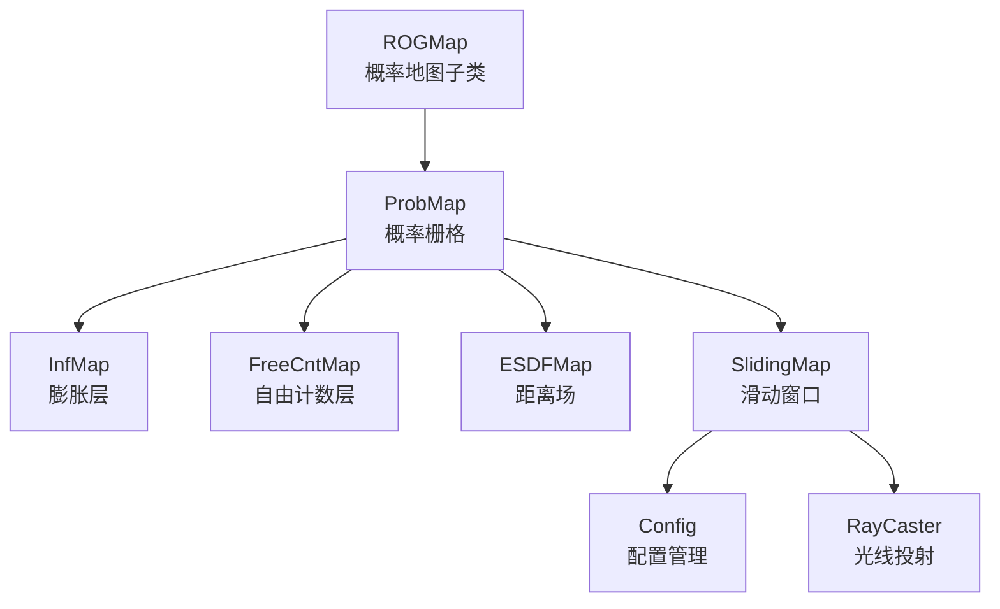
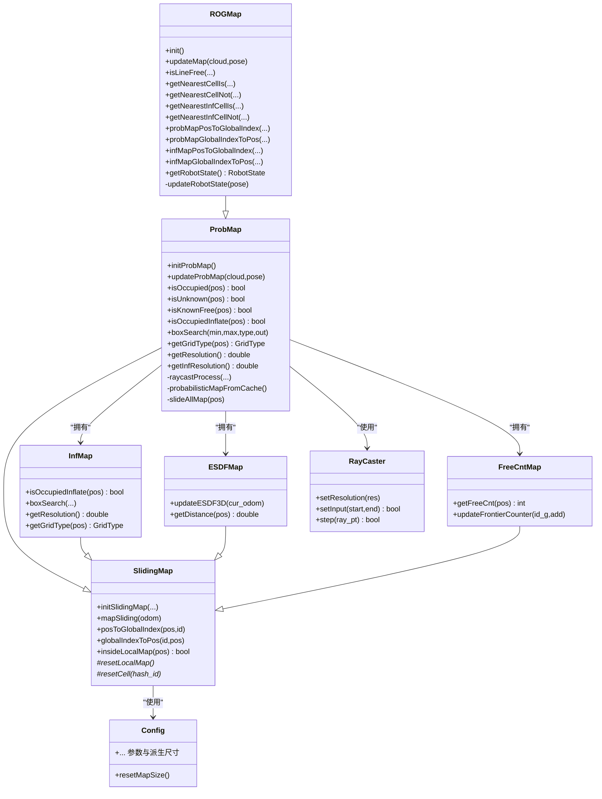
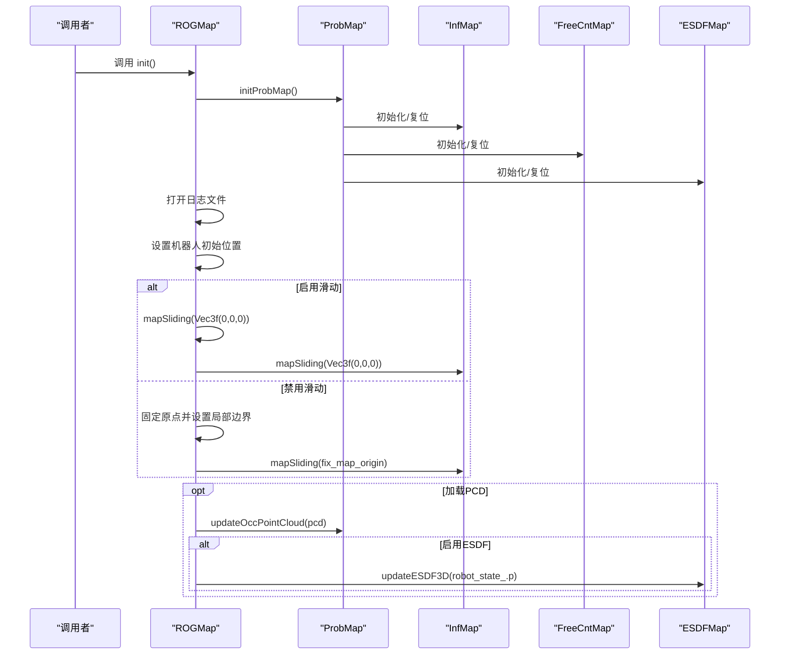
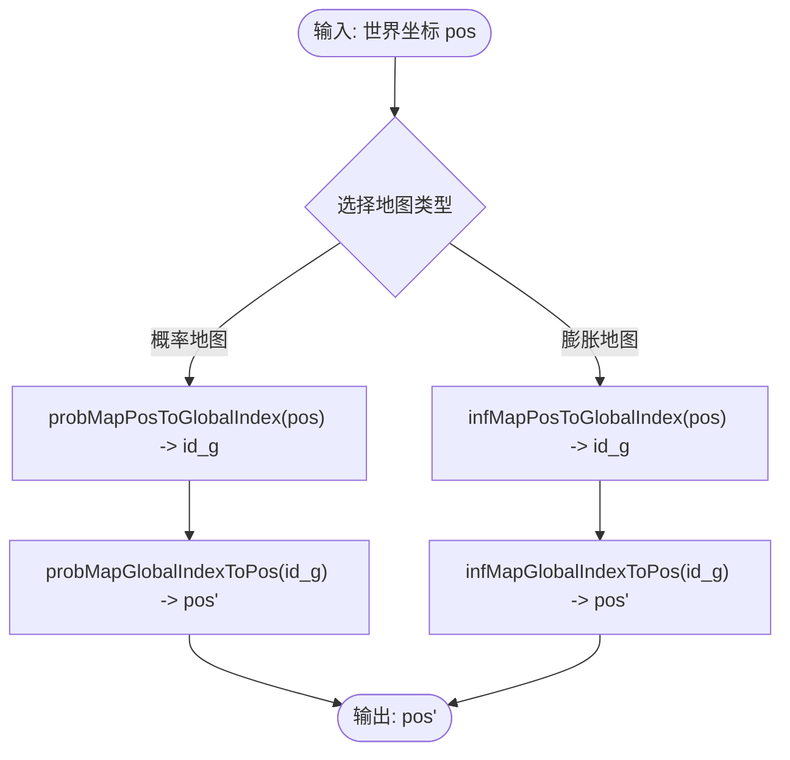
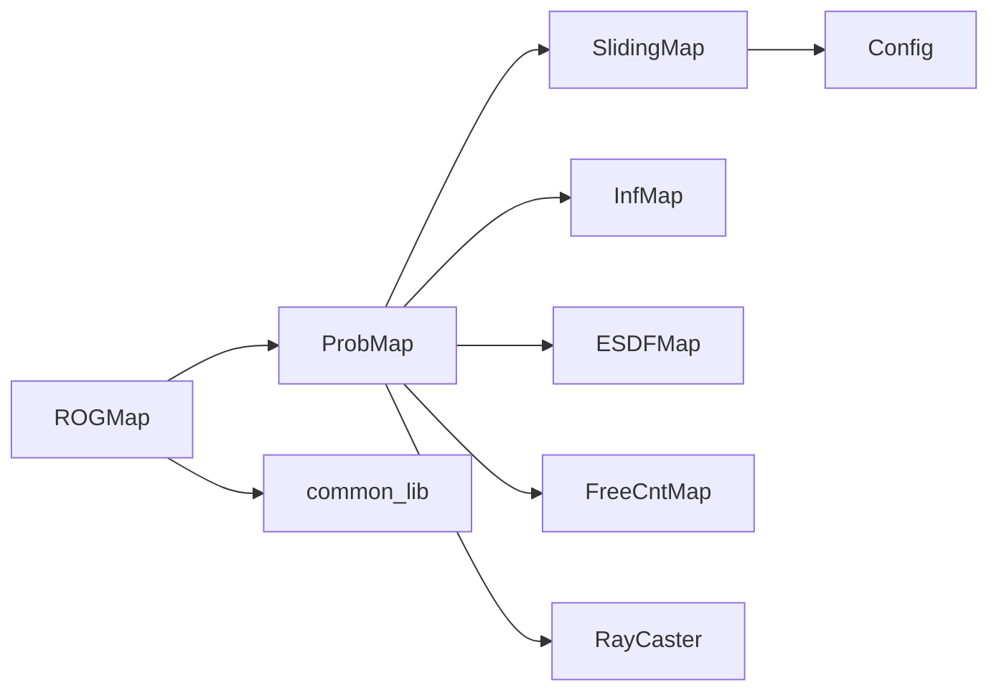

# ROG地图核心架构

<cite>
**本文引用的文件**
- [rog_map.h](file://src/SUPER/rog_map/include/rog_map/rog_map.h)
- [prob_map.h](file://src/SUPER/rog_map/include/rog_map/prob_map.h)
- [rog_map.cpp](file://src/SUPER/rog_map/src/rog_map/rog_map.cpp)
- [config.hpp](file://src/SUPER/rog_map/include/rog_map/rog_map_core/config.hpp)
- [common_lib.hpp](file://src/SUPER/rog_map/include/rog_map/rog_map_core/common_lib.hpp)
- [sliding_map.h](file://src/SUPER/rog_map/include/rog_map/rog_map_core/sliding_map.h)
- [raycaster.h](file://src/SUPER/rog_map/include/rog_map/rog_map_core/raycaster.h)
- [inf_map.h](file://src/SUPER/rog_map/include/rog_map/inf_map.h)
- [esdf_map.h](file://src/SUPER/rog_map/include/rog_map/esdf_map.h)
- [free_cnt_map.h](file://src/SUPER/rog_map/include/rog_map/free_cnt_map.h)
- [API_REFERENCE.md](file://src/SUPER/rog_map/doc/API_REFERENCE.md)
- [CONFIGURATION.md](file://src/SUPER/rog_map/doc/CONFIGURATION.md)
- [QUICKSTART.md](file://src/SUPER/rog_map/doc/QUICKSTART.md)
</cite>

## 目录
1. [简介](#简介)
2. [项目结构](#项目结构)
3. [核心组件](#核心组件)
4. [架构总览](#架构总览)
5. [详细组件分析](#详细组件分析)
6. [依赖关系分析](#依赖关系分析)
7. [性能考量](#性能考量)
8. [故障排查指南](#故障排查指南)
9. [结论](#结论)
10. [附录](#附录)

## 简介
本文件面向ROG地图核心架构，围绕ROGMap类展开，系统阐述其设计理念、继承体系、初始化流程、配置管理、坐标转换机制、机器人状态与时间戳处理、地图更新策略、API参考、内存管理与性能优化，并提供实际使用示例与最佳实践。

## 项目结构
ROG地图位于rog_map包中，核心头文件集中在include/rog_map及include/rog_map/rog_map_core，实现位于src/rog_map，配套文档位于doc目录。关键层次如下：
- 核心类：ROGMap（概率地图子类，扩展查询与坐标转换）
- 概率地图：ProbMap（概率栅格、膨胀层、ESDF、盒子搜索、滑动窗口）
- 膨胀层：InfMap（基于计数的膨胀传播）
- 计数层：CounterMap（抽象基类，提供计数与跳跃边沿触发）
- 滑动地图：SlidingMap（3D网格索引、坐标转换、内存管理）
- 工具与配置：Config、common_lib、raycaster

图表来源
- [rog_map.h](file://src/SUPER/rog_map/include/rog_map/rog_map.h#L39-L131)
- [prob_map.h](file://src/SUPER/rog_map/include/rog_map/prob_map.h#L38-L166)
- [sliding_map.h](file://src/SUPER/rog_map/include/rog_map/rog_map_core/sliding_map.h#L41-L141)
- [config.hpp](file://src/SUPER/rog_map/include/rog_map/rog_map_core/config.hpp#L50-L422)
- [raycaster.h](file://src/SUPER/rog_map/include/rog_map/rog_map_core/raycaster.h#L54-L93)
- [inf_map.h](file://src/SUPER/rog_map/include/rog_map/inf_map.h#L30-L92)
- [esdf_map.h](file://src/SUPER/rog_map/include/rog_map/esdf_map.h#L32-L106)
- [free_cnt_map.h](file://src/SUPER/rog_map/include/rog_map/free_cnt_map.h#L33-L112)

章节来源
- [rog_map.h](file://src/SUPER/rog_map/include/rog_map/rog_map.h#L39-L131)
- [prob_map.h](file://src/SUPER/rog_map/include/rog_map/prob_map.h#L38-L166)
- [sliding_map.h](file://src/SUPER/rog_map/include/rog_map/rog_map_core/sliding_map.h#L41-L141)
- [config.hpp](file://src/SUPER/rog_map/include/rog_map/rog_map_core/config.hpp#L50-L422)

## 核心组件
- ROGMap：ProbMap的子类，扩展了线段自由检测、最近邻搜索、坐标转换（概率/膨胀地图）、机器人状态管理与时间戳处理、地图更新入口。
- ProbMap：概率栅格核心，负责raycasting更新、盒子搜索、膨胀查询、ESDF集成、滑动窗口管理。
- InfMap：基于计数的膨胀层，维护占据/未知膨胀计数，提供膨胀查询与盒子搜索。
- FreeCntMap：自由计数层，维护每个栅格周围自由邻居数量，用于边界提取。
- ESDFMap：欧氏符号距离场，提供连续距离与梯度评估。
- SlidingMap：滑动窗口地图基类，提供3D网格索引、坐标转换、内存清理与局部地图边界管理。
- Config：集中式配置管理，解析YAML参数，计算派生尺寸与查找表。
- RayCaster：Bresenham风格3D光线投射，支持按分辨率步进。
- common_lib：通用几何与工具函数（线盒相交、路径长度、四元数转欧拉角等）。

章节来源
- [rog_map.h](file://src/SUPER/rog_map/include/rog_map/rog_map.h#L39-L131)
- [prob_map.h](file://src/SUPER/rog_map/include/rog_map/prob_map.h#L38-L166)
- [inf_map.h](file://src/SUPER/rog_map/include/rog_map/inf_map.h#L30-L92)
- [esdf_map.h](file://src/SUPER/rog_map/include/rog_map/esdf_map.h#L32-L106)
- [free_cnt_map.h](file://src/SUPER/rog_map/include/rog_map/free_cnt_map.h#L33-L112)
- [sliding_map.h](file://src/SUPER/rog_map/include/rog_map/rog_map_core/sliding_map.h#L41-L141)
- [config.hpp](file://src/SUPER/rog_map/include/rog_map/rog_map_core/config.hpp#L50-L422)
- [raycaster.h](file://src/SUPER/rog_map/include/rog_map/rog_map_core/raycaster.h#L54-L93)
- [common_lib.hpp](file://src/SUPER/rog_map/include/rog_map/rog_map_core/common_lib.hpp#L41-L157)

## 架构总览
ROGMap在ProbMap之上提供更高层的查询与坐标转换能力，同时封装机器人状态与时间戳，协调各子模块完成地图初始化、更新与可视化。

图表来源
- [rog_map.h](file://src/SUPER/rog_map/include/rog_map/rog_map.h#L39-L131)
- [prob_map.h](file://src/SUPER/rog_map/include/rog_map/prob_map.h#L38-L166)
- [sliding_map.h](file://src/SUPER/rog_map/include/rog_map/rog_map_core/sliding_map.h#L41-L141)
- [inf_map.h](file://src/SUPER/rog_map/include/rog_map/inf_map.h#L30-L92)
- [esdf_map.h](file://src/SUPER/rog_map/include/rog_map/esdf_map.h#L32-L106)
- [free_cnt_map.h](file://src/SUPER/rog_map/include/rog_map/free_cnt_map.h#L33-L112)
- [config.hpp](file://src/SUPER/rog_map/include/rog_map/rog_map_core/config.hpp#L50-L422)
- [raycaster.h](file://src/SUPER/rog_map/include/rog_map/rog_map_core/raycaster.h#L54-L93)

## 详细组件分析

### ROGMap类设计与继承关系
- 继承链：ROGMap -> ProbMap -> SlidingMap
- 设计理念：在概率地图基础上，提供面向任务的高层查询（线段自由检测、最近邻搜索）与坐标转换；封装机器人状态与时间戳，统一地图更新入口。
- 关键扩展：
  - 线段自由检测：支持基础、返回自由终点、膨胀版三种形态，可选择是否将未知视为占据。
  - 最近邻搜索：支持普通与膨胀两种网格类型，支持“是/否”目标类型匹配。
  - 坐标转换：提供概率地图与膨胀地图之间的双向转换。
  - 机器人状态：记录位置、姿态、时间戳、偏航角，并在更新时刷新局部更新框。

章节来源
- [rog_map.h](file://src/SUPER/rog_map/include/rog_map/rog_map.h#L39-L131)
- [rog_map.cpp](file://src/SUPER/rog_map/src/rog_map/rog_map.cpp#L28-L78)

### 地图初始化流程
- 初始化步骤：
  - 调用ProbMap初始化（内部会初始化InfMap、FreeCntMap、ESDFMap等子模块）。
  - 打开调试日志文件（地图信息与性能日志）。
  - 设置机器人初始位置为固定地图原点或根据配置滑动。
  - 若启用地图滑动，则将本地地图原点与膨胀层同步滑动；否则固定原点并设置局部边界。
  - 可选加载PCD地图并更新ESDF（若启用）。
- 关键点：
  - Config中resetMapSize会根据分辨率与膨胀步数计算各层半尺寸与索引边界。
  - 滑动窗口策略确保内存可控，超出局部范围的单元格会被重置。

图表来源
- [rog_map.cpp](file://src/SUPER/rog_map/src/rog_map/rog_map.cpp#L28-L78)
- [prob_map.h](file://src/SUPER/rog_map/include/rog_map/prob_map.h#L47-L101)
- [config.hpp](file://src/SUPER/rog_map/include/rog_map/rog_map_core/config.hpp#L349-L421)

章节来源
- [rog_map.cpp](file://src/SUPER/rog_map/src/rog_map/rog_map.cpp#L28-L78)
- [config.hpp](file://src/SUPER/rog_map/include/rog_map/rog_map_core/config.hpp#L349-L421)

### 配置管理系统
- 配置来源：YAML命名空间rog_map，支持esdf、load_pcd、map_sliding、ros_callback、visualization、raycasting、inflation、frontier_extraction等。
- 关键参数：
  - 分辨率与膨胀分辨率：影响查询与更新性能。
  - 地图尺寸与滑动阈值：控制局部窗口大小与滑动触发距离。
  - 光线投射参数：p_hit、p_miss、p_min、p_max、p_occ、p_free、ray_range、batch_update_size、unk_thresh。
  - 膨胀参数：inflation_step、unk_inflation_en、unk_inflation_step。
  - ESDF参数：enable、resolution、local_update_box。
  - 可视化参数：enable、frame_id、range、time_rate、frame_rate、pub_unknown_map_en。
  - ROS回调：enable、cloud_topic、odom_topic、odom_timeout。
  - 点云处理：point_filt_num、intensity_thresh、load_pcd_en、pcd_name。
- 派生计算：
  - resetMapSize根据分辨率与膨胀步数计算各层半尺寸、索引边界与虚拟地面/天花板高度。
  - logit(p)得到对数几率l_hit/l_miss/l_min/l_max/l_occ/l_free，用于概率更新。

章节来源
- [config.hpp](file://src/SUPER/rog_map/include/rog_map/rog_map_core/config.hpp#L68-L288)
- [config.hpp](file://src/SUPER/rog_map/include/rog_map/rog_map_core/config.hpp#L349-L421)

### 核心数据结构设计
- 网格类型：OCCUPIED、UNKNOWN、KNOWN_FREE、FRONTIER、OUT_OF_MAP。
- 机器人状态：位置、四元数、接收时间、偏航角、接收标志。
- RaycastData：缓存raycaster、更新候选队列、操作计数、命中计数、局部更新框、批更新计数与互斥锁。
- 邻域查找表：spherical_neighbor（最近邻搜索）、inf_spherical_neighbor/unk_inf_spherical_neighbor（膨胀搜索）。
- 时间消耗统计：Total、Raycast、Update_cache、Inflation、PointCloudNumber、CacheNumber、InflationNumber。

章节来源
- [prob_map.h](file://src/SUPER/rog_map/include/rog_map/prob_map.h#L102-L124)
- [config.hpp](file://src/SUPER/rog_map/include/rog_map/rog_map_core/config.hpp#L238-L287)

### 地图坐标转换机制
- 概率地图与膨胀地图坐标转换：
  - probMapPosToGlobalIndex / probMapGlobalIndexToPos：概率地图坐标与全局索引互转。
  - infMapPosToGlobalIndex / infMapGlobalIndexToPos：膨胀地图坐标与全局索引互转。
- 底层转换实现：
  - SlidingMap提供posToGlobalIndex/globalIndexToPos等通用转换。
  - InfMap持有独立分辨率，转换时考虑各自分辨率差异。
- 坐标一致性：
  - 通过Config.resetMapSize保证不同分辨率下的索引映射正确。

图表来源
- [rog_map.h](file://src/SUPER/rog_map/include/rog_map/rog_map.h#L95-L109)
- [sliding_map.h](file://src/SUPER/rog_map/include/rog_map/rog_map_core/sliding_map.h#L105-L117)
- [config.hpp](file://src/SUPER/rog_map/include/rog_map/rog_map_core/config.hpp#L349-L421)

章节来源
- [rog_map.h](file://src/SUPER/rog_map/include/rog_map/rog_map.h#L95-L109)
- [sliding_map.h](file://src/SUPER/rog_map/include/rog_map/rog_map_core/sliding_map.h#L105-L117)

### 机器人状态管理、时间戳处理与地图更新策略
- 机器人状态：
  - updateRobotState(pose)更新位置、姿态、接收时间戳、偏航角，并更新局部更新框。
- 时间戳：
  - getSystemWalltimeNow为虚函数，由具体实现提供系统墙钟时间，用于记录接收时间。
- 地图更新策略：
  - updateMap(cloud, pose)：在非ROS回调模式下执行，更新机器人状态并调用ProbMap::updateProbMap。
  - ProbMap::updateProbMap内部执行raycastProcess、probabilisticMapFromCache、膨胀传播与ESDF更新（如启用）。
  - SlidingMap::mapSliding根据阈值决定是否滑动窗口并清理超出范围的内存。

章节来源
- [rog_map.cpp](file://src/SUPER/rog_map/src/rog_map/rog_map.cpp#L240-L275)
- [rog_map.h](file://src/SUPER/rog_map/include/rog_map/rog_map.h#L43-L44)
- [prob_map.h](file://src/SUPER/rog_map/include/rog_map/prob_map.h#L100-L101)
- [sliding_map.h](file://src/SUPER/rog_map/include/rog_map/rog_map_core/sliding_map.h#L63-L67)

### ROGMap类API参考
- 初始化与配置
  - init(): 完成ProbMap初始化、日志打开、滑动窗口设置、可选加载PCD与ESDF更新。
  - getMapConfig(): 返回当前Config对象。
- 查询接口
  - isLineFree(start, end, ...): 线段自由检测，支持基础、返回终点、膨胀三种形态。
  - getNearestCellIs/Not(target_type, start_pos, nearest_pt, max_dis): 最近邻搜索（普通/膨胀）。
  - getNearestInfCellIs/Not(...): 膨胀层最近邻搜索。
- 坐标转换
  - probMapPosToGlobalIndex / probMapGlobalIndexToPos
  - infMapPosToGlobalIndex / infMapGlobalIndexToPos
- 地图维护
  - updateMap(cloud, pose): 手动更新地图（非ROS回调模式）。
  - getRobotState(): 获取机器人状态。
- 辅助
  - getLocalMapOrigin/getLocalMapSize/getResolution/getInfResolution/boundBoxByLocalMap
  - boxSearch/boxSearchInflate
  - writeTimeConsumingToLog/writeMapInfoToLog

章节来源
- [rog_map.h](file://src/SUPER/rog_map/include/rog_map/rog_map.h#L50-L128)
- [rog_map.cpp](file://src/SUPER/rog_map/src/rog_map/rog_map.cpp#L132-L275)
- [API_REFERENCE.md](file://src/SUPER/rog_map/doc/API_REFERENCE.md#L146-L340)

### 地图系统的内存管理策略与性能优化
- 内存管理
  - 滑动窗口：SlidingMap::mapSliding在机器人移动超过阈值时滑动本地窗口，清理窗口外内存并通过resetCell重置状态。
  - resetCell虚函数：由具体子类实现，确保滑动导致的越界单元格回到未知状态，避免“跳跃边缘”。
- 性能优化
  - 批处理更新：Config.batch_update_size控制raycast批处理大小。
  - 下采样：Config.point_filt_num对点云进行时间下采样。
  - 局部更新框：Config.local_update_box_d限制更新范围。
  - 可选功能：ESDF、frontier_extraction、unk_inflation按需启用。
  - 分辨率权衡：分辨率越小越精细但内存与计算成本越高。

章节来源
- [sliding_map.h](file://src/SUPER/rog_map/include/rog_map/rog_map_core/sliding_map.h#L88-L101)
- [config.hpp](file://src/SUPER/rog_map/include/rog_map/rog_map_core/config.hpp#L178-L209)
- [prob_map.h](file://src/SUPER/rog_map/include/rog_map/prob_map.h#L111-L119)

### 实际使用示例与最佳实践
- 基础查询：单点占用/未知/自由判断、盒子搜索获取障碍物、最近障碍物距离。
- 路径检查：线段自由检测，结合膨胀层进行安全距离检测。
- 可视化：订阅rog_map/*系列话题观察地图状态。
- 配置优化：根据硬件能力调整分辨率、地图尺寸、批处理大小与功能开关。

章节来源
- [QUICKSTART.md](file://src/SUPER/rog_map/doc/QUICKSTART.md#L51-L177)
- [API_REFERENCE.md](file://src/SUPER/rog_map/doc/API_REFERENCE.md#L408-L510)

## 依赖关系分析

图表来源
- [rog_map.h](file://src/SUPER/rog_map/include/rog_map/rog_map.h#L26-L30)
- [prob_map.h](file://src/SUPER/rog_map/include/rog_map/prob_map.h#L28-L31)
- [sliding_map.h](file://src/SUPER/rog_map/include/rog_map/rog_map_core/sliding_map.h#L26-L27)
- [config.hpp](file://src/SUPER/rog_map/include/rog_map/rog_map_core/config.hpp#L26-L27)
- [raycaster.h](file://src/SUPER/rog_map/include/rog_map/rog_map_core/raycaster.h#L26-L29)
- [common_lib.hpp](file://src/SUPER/rog_map/include/rog_map/rog_map_core/common_lib.hpp#L27-L38)

章节来源
- [rog_map.h](file://src/SUPER/rog_map/include/rog_map/rog_map.h#L26-L30)
- [prob_map.h](file://src/SUPER/rog_map/include/rog_map/prob_map.h#L28-L31)

## 性能考量
- 时间复杂度
  - 单点查询：O(1)
  - 线段碰撞检测：O(N)，N为沿光线的体素数
  - 盒子搜索：O(M)，M为盒子内总体素数
  - 最近邻搜索：O(K³)，K为搜索球的网格边长
  - 地图更新：O(P + O)，P为点云大小，O为膨胀计算
- 空间复杂度
  - 单地图：O(N³)，N为half_map_size_i × 2
  - 多层：概率图 + 膨胀层 + ESDF（可选）
- 优化建议
  - 降低分辨率、减小地图尺寸、增大point_filt_num、关闭不必要的功能（ESDF、frontier_extraction、unk_inflation）

章节来源
- [API_REFERENCE.md](file://src/SUPER/rog_map/doc/API_REFERENCE.md#L512-L541)

## 故障排查指南
- 节点启动失败：检查配置文件路径与权限。
- 点云不更新：确认话题是否发布、配置是否启用ros_callback、odom_timeout是否过大。
- 查询速度慢：降低分辨率、减小地图尺寸、关闭ESDF与frontier_extraction、减少批处理大小。
- 地图不更新：确认updateMap是否被调用或ros_callback是否启用。

章节来源
- [QUICKSTART.md](file://src/SUPER/rog_map/doc/QUICKSTART.md#L181-L242)
- [CONFIGURATION.md](file://src/SUPER/rog_map/doc/CONFIGURATION.md#L256-L334)

## 结论
ROGMap通过清晰的分层架构与高效的滑动窗口机制，在保证实时性的前提下提供了丰富的查询能力与可扩展的配置系统。其概率地图、膨胀层与ESDF的协同设计，使其在多旋翼无人机的高速自主导航中具备良好的实用性与可维护性。

## 附录
- 配置参数详解与示例：参见CONFIGURATION.md
- API参考与示例：参见API_REFERENCE.md
- 快速开始与常见场景：参见QUICKSTART.md