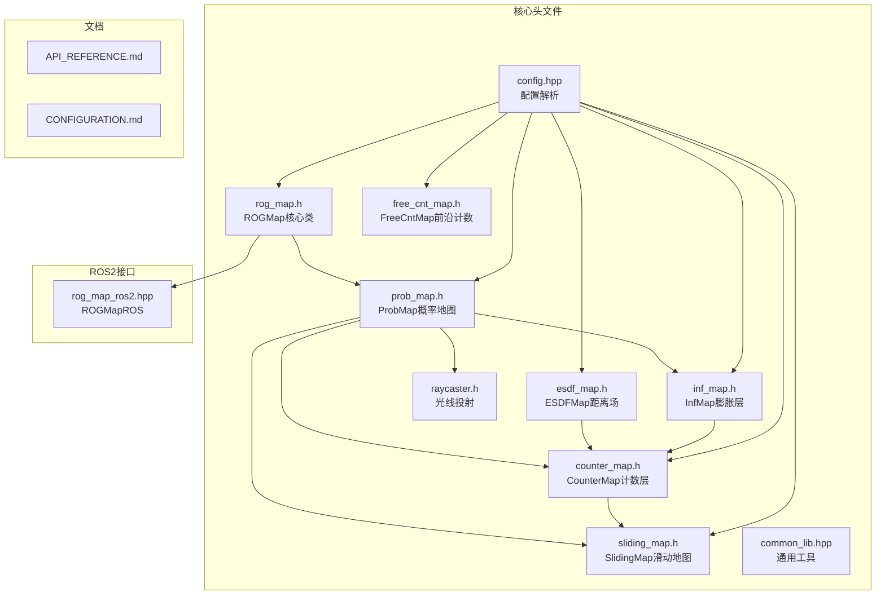
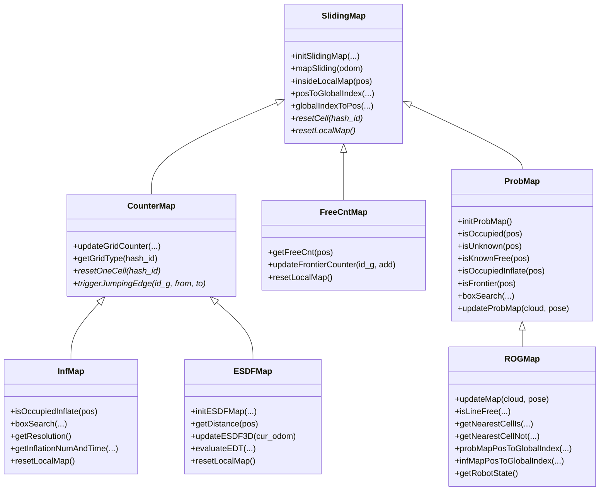
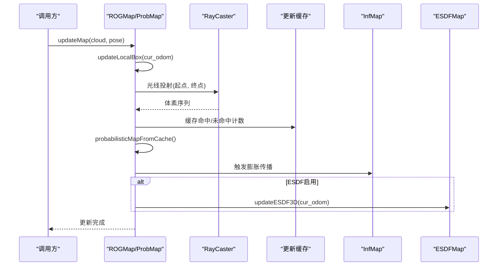
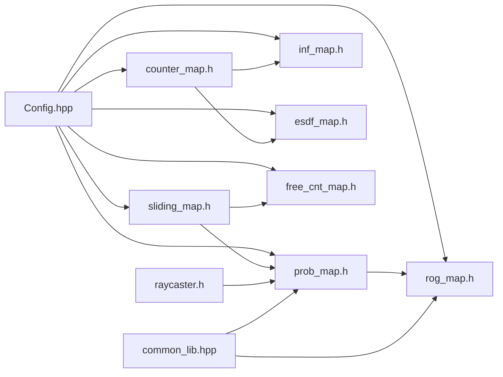

# ROG地图系统

<cite>
**本文引用的文件**
- [rog_map.h](file://src/SUPER/rog_map/include/rog_map/rog_map.h)
- [prob_map.h](file://src/SUPER/rog_map/include/rog_map/prob_map.h)
- [esdf_map.h](file://src/SUPER/rog_map/include/rog_map/esdf_map.h)
- [inf_map.h](file://src/SUPER/rog_map/include/rog_map/inf_map.h)
- [free_cnt_map.h](file://src/SUPER/rog_map/include/rog_map/free_cnt_map.h)
- [counter_map.h](file://src/SUPER/rog_map/include/rog_map/rog_map_core/counter_map.h)
- [sliding_map.h](file://src/SUPER/rog_map/include/rog_map/rog_map_core/sliding_map.h)
- [config.hpp](file://src/SUPER/rog_map/include/rog_map/rog_map_core/config.hpp)
- [common_lib.hpp](file://src/SUPER/rog_map/include/rog_map/rog_map_core/common_lib.hpp)
- [raycaster.h](file://src/SUPER/rog_map/include/rog_map/rog_map_core/raycaster.h)
- [rog_map_ros2.hpp](file://src/SUPER/rog_map/include/rog_map_ros/rog_map_ros2.hpp)
- [API_REFERENCE.md](file://src/SUPER/rog_map/doc/API_REFERENCE.md)
- [CONFIGURATION.md](file://src/SUPER/rog_map/doc/CONFIGURATION.md)
</cite>

## 目录
1. [简介](#简介)
2. [项目结构](#项目结构)
3. [核心组件](#核心组件)
4. [架构总览](#架构总览)
5. [详细组件分析](#详细组件分析)
6. [依赖关系分析](#依赖关系分析)
7. [性能考虑](#性能考虑)
8. [故障排查指南](#故障排查指南)
9. [结论](#结论)
10. [附录](#附录)

## 简介
ROG地图系统（ROG-Map）是一个面向多旋翼无人机高速自主飞行的实时3D占用栅格地图库。其核心设计理念是通过“分层地图 + 滑动窗口”的组合，在保证高实时性的前提下，提供多尺度的空间感知能力：
- 分层地图：概率地图（占有度）、膨胀层（安全边界）、ESDF（精确距离场）、边界层（前沿提取）
- 滑动窗口：以机器人位姿为中心的局部地图，动态裁剪与复用内存，避免全局重建
- 实时更新：基于光线投射的概率更新，结合缓存批量处理，显著降低更新开销

优势总结：
- 实时性强：查询与更新均针对稀疏存储与哈希索引优化
- 多尺度感知：支持基础占用、膨胀安全、ESDF距离场与前沿边界
- 内存友好：滑动窗口与分层计数，有效控制内存占用
- 易于集成：提供ROS2原生接口与可视化发布

## 项目结构
ROG地图系统位于超级规划器工程的rog_map模块中，主要目录与文件如下：
- include/rog_map：核心地图类与配置
- include/rog_map/rog_map_core：通用底层组件（滑动地图、计数层、光线投射等）
- include/rog_map_ros：ROS2接口封装
- src/rog_map：各地图类的实现源文件
- doc：API与配置文档

**图表来源**
- [rog_map.h](file://src/SUPER/rog_map/include/rog_map/rog_map.h#L39-L131)
- [prob_map.h](file://src/SUPER/rog_map/include/rog_map/prob_map.h#L38-L166)
- [esdf_map.h](file://src/SUPER/rog_map/include/rog_map/esdf_map.h#L32-L106)
- [inf_map.h](file://src/SUPER/rog_map/include/rog_map/inf_map.h#L30-L92)
- [free_cnt_map.h](file://src/SUPER/rog_map/include/rog_map/free_cnt_map.h#L33-L112)
- [counter_map.h](file://src/SUPER/rog_map/include/rog_map/rog_map_core/counter_map.h#L34-L141)
- [sliding_map.h](file://src/SUPER/rog_map/include/rog_map/rog_map_core/sliding_map.h#L41-L141)
- [config.hpp](file://src/SUPER/rog_map/include/rog_map/rog_map_core/config.hpp#L50-L422)
- [common_lib.hpp](file://src/SUPER/rog_map/include/rog_map/rog_map_core/common_lib.hpp#L41-L157)
- [raycaster.h](file://src/SUPER/rog_map/include/rog_map/rog_map_core/raycaster.h#L48-L93)
- [rog_map_ros2.hpp](file://src/SUPER/rog_map/include/rog_map_ros/rog_map_ros2.hpp)

**章节来源**
- [rog_map.h](file://src/SUPER/rog_map/include/rog_map/rog_map.h#L1-L131)
- [prob_map.h](file://src/SUPER/rog_map/include/rog_map/prob_map.h#L1-L166)
- [esdf_map.h](file://src/SUPER/rog_map/include/rog_map/esdf_map.h#L1-L106)
- [inf_map.h](file://src/SUPER/rog_map/include/rog_map/inf_map.h#L1-L92)
- [free_cnt_map.h](file://src/SUPER/rog_map/include/rog_map/free_cnt_map.h#L1-L112)
- [counter_map.h](file://src/SUPER/rog_map/include/rog_map/rog_map_core/counter_map.h#L1-L141)
- [sliding_map.h](file://src/SUPER/rog_map/include/rog_map/rog_map_core/sliding_map.h#L1-L141)
- [config.hpp](file://src/SUPER/rog_map/include/rog_map/rog_map_core/config.hpp#L1-L422)
- [common_lib.hpp](file://src/SUPER/rog_map/include/rog_map/rog_map_core/common_lib.hpp#L1-L157)
- [raycaster.h](file://src/SUPER/rog_map/include/rog_map/rog_map_core/raycaster.h#L1-L93)
- [rog_map_ros2.hpp](file://src/SUPER/rog_map/include/rog_map_ros/rog_map_ros2.hpp)

## 核心组件
本节对ROG地图系统的关键类进行概览性介绍，并给出其职责与交互关系。

- SlidingMap（滑动地图基类）
  - 负责3D网格索引、坐标转换、滑动窗口与内存清理
  - 提供统一的哈希索引与边界管理
- CounterMap（计数层）
  - 维护占据/未知计数，定义网格类型（占用地/未知/自由）
  - 支持“未知阈值”策略，决定单元格状态
- InfMap（膨胀层）
  - 基于计数层的膨胀传播，生成安全边界
  - 提供膨胀查询与盒子搜索
- ProbMap（概率地图）
  - 基于光线投射的概率更新，维护占有度缓存
  - 提供单点查询、盒子搜索、前沿提取与ESDF联动
- ESDFMap（欧式距离场）
  - 基于EDT算法计算符号距离场，支持插值查询
  - 提供局部更新与可视化点云
- ROGMap（核心查询扩展）
  - 在概率地图之上提供线段自由检测、最近邻搜索等高层查询
  - 提供坐标转换与机器人状态查询
- ROGMapROS（ROS2接口）
  - 封装节点生命周期、话题订阅、服务回调与可视化发布

**章节来源**
- [sliding_map.h](file://src/SUPER/rog_map/include/rog_map/rog_map_core/sliding_map.h#L41-L141)
- [counter_map.h](file://src/SUPER/rog_map/include/rog_map/rog_map_core/counter_map.h#L34-L141)
- [inf_map.h](file://src/SUPER/rog_map/include/rog_map/inf_map.h#L30-L92)
- [prob_map.h](file://src/SUPER/rog_map/include/rog_map/prob_map.h#L38-L166)
- [esdf_map.h](file://src/SUPER/rog_map/include/rog_map/esdf_map.h#L32-L106)
- [rog_map.h](file://src/SUPER/rog_map/include/rog_map/rog_map.h#L39-L131)
- [rog_map_ros2.hpp](file://src/SUPER/rog_map/include/rog_map_ros/rog_map_ros2.hpp)

## 架构总览
ROG地图系统采用“分层+滑动窗口”的架构，核心类之间的继承与组合关系如下：

**图表来源**
- [sliding_map.h](file://src/SUPER/rog_map/include/rog_map/rog_map_core/sliding_map.h#L41-L141)
- [counter_map.h](file://src/SUPER/rog_map/include/rog_map/rog_map_core/counter_map.h#L34-L141)
- [inf_map.h](file://src/SUPER/rog_map/include/rog_map/inf_map.h#L30-L92)
- [esdf_map.h](file://src/SUPER/rog_map/include/rog_map/esdf_map.h#L32-L106)
- [free_cnt_map.h](file://src/SUPER/rog_map/include/rog_map/free_cnt_map.h#L33-L112)
- [prob_map.h](file://src/SUPER/rog_map/include/rog_map/prob_map.h#L38-L166)
- [rog_map.h](file://src/SUPER/rog_map/include/rog_map/rog_map.h#L39-L131)

## 详细组件分析

### ROGMap（核心查询扩展）
- 职责
  - 在概率地图基础上提供线段自由检测、最近邻搜索等高层查询
  - 提供坐标转换接口与机器人状态查询
- 关键接口
  - 线段自由检测：支持基础版与膨胀版，可返回自由终点
  - 最近邻搜索：支持目标类型匹配与非匹配两类，支持膨胀版本
  - 坐标转换：概率地图与膨胀地图的坐标互转
  - 更新：接收点云与位姿，驱动内部地图层更新
- 设计要点
  - 通过继承ProbMap获得概率与膨胀查询能力
  - 通过组合InfMap与ESDFMap实现高级功能
  - 采用滑动窗口与缓存机制提升实时性

**章节来源**
- [rog_map.h](file://src/SUPER/rog_map/include/rog_map/rog_map.h#L39-L131)

### ProbMap（概率地图）
- 职责
  - 基于光线投射的概率更新，维护占有度与命中/miss计数缓存
  - 提供单点查询、盒子搜索、前沿提取与ESDF联动
- 关键接口
  - isOccupied/isUnknown/isKnownFree：单点查询
  - boxSearch/boxSearchInflate：盒子范围搜索
  - updateProbMap：主更新入口
- 数据结构
  - RaycastData：光线投射缓存、更新候选队列、局部更新框
  - occupancy_buffer_：球形邻域查找表
- 更新策略
  - 光线投射：从传感器位姿到点云投影点，逐体素更新
  - 批处理：batch_update_size控制批次规模
  - 局部更新：根据当前位姿与局部更新框裁剪更新范围

**图表来源**
- [prob_map.h](file://src/SUPER/rog_map/include/rog_map/prob_map.h#L100-L166)
- [raycaster.h](file://src/SUPER/rog_map/include/rog_map/rog_map_core/raycaster.h#L48-L93)
- [rog_map.h](file://src/SUPER/rog_map/include/rog_map/rog_map.h#L112-L113)

**章节来源**
- [prob_map.h](file://src/SUPER/rog_map/include/rog_map/prob_map.h#L38-L166)
- [raycaster.h](file://src/SUPER/rog_map/include/rog_map/rog_map_core/raycaster.h#L48-L93)

### InfMap（膨胀层）
- 职责
  - 基于计数层的膨胀传播，维护膨胀后的占据/未知计数
  - 提供膨胀查询与盒子搜索
- 关键接口
  - isOccupiedInflate/isUnknownInflate/isKnownFreeInflate
  - boxSearch
  - getResolution/getInflationNumAndTime
- 膨胀策略
  - 基于inflation_step与unk_inflation_step的球形邻域传播
  - 支持未知膨胀（unk_inflation_en）

**章节来源**
- [inf_map.h](file://src/SUPER/rog_map/include/rog_map/inf_map.h#L30-L92)
- [counter_map.h](file://src/SUPER/rog_map/include/rog_map/rog_map_core/counter_map.h#L34-L141)

### ESDFMap（欧式距离场）
- 职责
  - 计算符号距离场（EDT），支持三线性插值
  - 提供局部更新与可视化点云
- 关键接口
  - getDistance(pos/id_g)
  - evaluateEDT/evaluateFirstGrad/evaluateSecondGrad
  - getPositiveESDFPointCloud/getNegativeESDFPointCloud
  - updateESDF3D
- 实现要点
  - 基于EDT的三线性插值，支持一阶与二阶导数
  - 局部更新框控制计算范围，避免全图重算

**章节来源**
- [esdf_map.h](file://src/SUPER/rog_map/include/rog_map/esdf_map.h#L32-L106)

### FreeCntMap（前沿计数）
- 职责
  - 维护每个体素周围自由体素的数量，用于前沿提取
- 关键接口
  - getFreeCnt(pos/id_g)
  - updateFrontierCounter(id_g, add)
- 设计要点
  - 仅在frontier_extraction_en启用时使用
  - 采用3×3×3邻域累加，防止溢出

**章节来源**
- [free_cnt_map.h](file://src/SUPER/rog_map/include/rog_map/free_cnt_map.h#L33-L112)

### CounterMap（计数层）
- 职责
  - 维护占据/未知计数，定义网格类型
- 关键接口
  - getGridType(hash_id)
  - updateGridCounter
  - resetOneCell/hash_id相关转换
- 策略
  - 未知阈值：当未知计数≥unk_thresh时，单元格为未知
  - 占据判定：只要占据计数>0即为占用地

**章节来源**
- [counter_map.h](file://src/SUPER/rog_map/include/rog_map/rog_map_core/counter_map.h#L34-L141)

### SlidingMap（滑动地图）
- 职责
  - 3D网格索引、坐标转换、滑动窗口与内存清理
- 关键接口
  - initSlidingMap
  - mapSliding(odom)
  - insideLocalMap
  - pos/global/local索引互转
  - resetCell/resetLocalMap（虚函数）
- 设计要点
  - 通过虚拟地面/天花板高度处理边界
  - clearMemoryOutOfMap在滑动时清理越界内存

**章节来源**
- [sliding_map.h](file://src/SUPER/rog_map/include/rog_map/rog_map_core/sliding_map.h#L41-L141)

### 配置系统（Config）
- 职责
  - 解析YAML配置，初始化地图尺寸、分辨率、阈值与参数表
- 关键配置项
  - 地图分辨率与尺寸、滑动窗口、光线投射参数、膨胀参数、ESDF开关、前沿提取、ROS回调、可视化、点云处理
- 初始化流程
  - 加载YAML参数
  - 计算各层尺寸与分辨率比例
  - 生成球形邻域查找表（含膨胀与前沿）

**章节来源**
- [config.hpp](file://src/SUPER/rog_map/include/rog_map/rog_map_core/config.hpp#L50-L422)

### 通用工具（common_lib.hpp）
- 职责
  - 提供几何工具：yaw计算、路径长度、线盒相交、线与包围盒相交等
- 应用场景
  - 查询辅助、可视化与调试

**章节来源**
- [common_lib.hpp](file://src/SUPER/rog_map/include/rog_map/rog_map_core/common_lib.hpp#L41-L157)

### 光线投射（raycaster.h）
- 职责
  - 实现3D光线投射算法，沿光线遍历体素
- 关键接口
  - setInput(step)
  - step(ray_pt)
- 算法特点
  - 基于八叉树思想，按轴向边界推进，高效遍历

**章节来源**
- [raycaster.h](file://src/SUPER/rog_map/include/rog_map/rog_map_core/raycaster.h#L48-L93)

## 依赖关系分析

**图表来源**
- [config.hpp](file://src/SUPER/rog_map/include/rog_map/rog_map_core/config.hpp#L50-L422)
- [rog_map.h](file://src/SUPER/rog_map/include/rog_map/rog_map.h#L39-L131)
- [prob_map.h](file://src/SUPER/rog_map/include/rog_map/prob_map.h#L38-L166)
- [inf_map.h](file://src/SUPER/rog_map/include/rog_map/inf_map.h#L30-L92)
- [esdf_map.h](file://src/SUPER/rog_map/include/rog_map/esdf_map.h#L32-L106)
- [free_cnt_map.h](file://src/SUPER/rog_map/include/rog_map/free_cnt_map.h#L33-L112)
- [counter_map.h](file://src/SUPER/rog_map/include/rog_map/rog_map_core/counter_map.h#L34-L141)
- [sliding_map.h](file://src/SUPER/rog_map/include/rog_map/rog_map_core/sliding_map.h#L41-L141)
- [raycaster.h](file://src/SUPER/rog_map/include/rog_map/rog_map_core/raycaster.h#L48-L93)
- [common_lib.hpp](file://src/SUPER/rog_map/include/rog_map/rog_map_core/common_lib.hpp#L41-L157)

**章节来源**
- [config.hpp](file://src/SUPER/rog_map/include/rog_map/rog_map_core/config.hpp#L50-L422)
- [rog_map.h](file://src/SUPER/rog_map/include/rog_map/rog_map.h#L39-L131)
- [prob_map.h](file://src/SUPER/rog_map/include/rog_map/prob_map.h#L38-L166)
- [inf_map.h](file://src/SUPER/rog_map/include/rog_map/inf_map.h#L30-L92)
- [esdf_map.h](file://src/SUPER/rog_map/include/rog_map/esdf_map.h#L32-L106)
- [free_cnt_map.h](file://src/SUPER/rog_map/include/rog_map/free_cnt_map.h#L33-L112)
- [counter_map.h](file://src/SUPER/rog_map/include/rog_map/rog_map_core/counter_map.h#L34-L141)
- [sliding_map.h](file://src/SUPER/rog_map/include/rog_map/rog_map_core/sliding_map.h#L41-L141)
- [raycaster.h](file://src/SUPER/rog_map/include/rog_map/rog_map_core/raycaster.h#L48-L93)
- [common_lib.hpp](file://src/SUPER/rog_map/include/rog_map/rog_map_core/common_lib.hpp#L41-L157)

## 性能考虑
- 时间复杂度
  - 单点查询：O(1)，基于哈希索引
  - 线段碰撞检测：O(N)，N为沿光线的体素数
  - 盒子搜索：O(M)，M为盒子内总体素数
  - 最近邻搜索：O(K³)，K为搜索半径对应的网格边长
  - 地图更新：O(P + O)，P为点云数量，O为膨胀传播成本
- 空间复杂度
  - 单地图：O(N³)，N为half_map_size_i × 2
  - 多层：概率图 + 膨胀层 + ESDF（可选）
- 优化建议
  - 降低分辨率或缩小地图尺寸
  - 适当增大batch_update_size
  - 关闭ESDF与前沿提取以减少开销
  - 合理设置inflation_step与unk_inflation_en

**章节来源**
- [API_REFERENCE.md](file://src/SUPER/rog_map/doc/API_REFERENCE.md#L512-L541)
- [CONFIGURATION.md](file://src/SUPER/rog_map/doc/CONFIGURATION.md#L244-L253)

## 故障排查指南
- 常见问题
  - 点云更新缓慢：检查resolution、map_size、batch_update_size、esdf_en、frontier_extraction_en、unk_inflation_en
  - 地图不随机器人移动：确认map_sliding.enable与threshold设置
  - 膨胀边界不正确：检查inflation_step与unk_inflation_step
  - ESDF计算异常：确认esdf_en与esdf_resolution设置
- 调试手段
  - 启用时间日志与地图信息日志，定位瓶颈
  - 在RViz中订阅rog_map/occ、rog_map/unk、rog_map/inf_occ、rog_map/map_bound等话题观察状态
  - 使用writeTimeConsumingToLog/writeMapInfoToLog输出性能与统计信息

**章节来源**
- [CONFIGURATION.md](file://src/SUPER/rog_map/doc/CONFIGURATION.md#L313-L334)
- [API_REFERENCE.md](file://src/SUPER/rog_map/doc/API_REFERENCE.md#L331-L340)

## 结论
ROG地图系统通过“分层地图 + 滑动窗口 + 光线投射”的组合，实现了在复杂三维环境中对障碍物的实时感知与安全边界构建。其清晰的层次结构与完善的配置体系，使其既能满足高速导航的实时性需求，又能在探索与高精度场景下灵活扩展。配合ROS2接口与可视化发布，系统易于部署与调试。

## 附录

### API参考（摘要）
- ROGMap
  - 线段自由检测：isLineFree(start, end, ...)
  - 最近邻搜索：getNearestCellIs/Not、getNearestInfCellIs/Not
  - 坐标转换：probMapPosToGlobalIndex、infMapPosToGlobalIndex
  - 更新：updateMap(cloud, pose)
- ProbMap
  - 单点查询：isOccupied/isUnknown/isKnownFree
  - 膨胀查询：isOccupiedInflate/isUnknownInflate/isKnownFreeInflate
  - 盒子搜索：boxSearch/boxSearchInflate
  - 更新：updateProbMap
- InfMap
  - 膨胀查询：isOccupiedInflate/isUnknownInflate/isKnownFreeInflate
  - 盒子搜索：boxSearch
  - 统计：getInflationNumAndTime
- ESDFMap
  - 查询：getDistance、evaluateEDT/FirstGrad/SecondGrad
  - 可视化：getPositiveESDFPointCloud/getNegativeESDFPointCloud
  - 更新：updateESDF3D
- FreeCntMap
  - 前沿计数：getFreeCnt、updateFrontierCounter

**章节来源**
- [API_REFERENCE.md](file://src/SUPER/rog_map/doc/API_REFERENCE.md#L74-L573)

### 配置参考（摘要）
- 地图分辨率与尺寸：resolution、inflation_resolution、map_size
- 滑动窗口：map_sliding.enable、map_sliding.threshold、fix_map_origin
- 光线投射：raycasting.enable、ray_range、p_hit、p_miss、p_min、p_max、p_occ、p_free、batch_update_size、unk_thresh
- 膨胀：inflation_step、unk_inflation_en、unk_inflation_step
- ESDF：esdf.enable、esdf.resolution、esdf.local_update_box
- 前沿提取：frontier_extraction_en
- ROS2回调：ros_callback.enable、cloud_topic、odom_topic、odom_timeout
- 可视化：visualization.enable、frame_id、range、time_rate、frame_rate、pub_unknown_map_en
- 点云处理：point_filt_num、intensity_thresh、load_pcd_en、pcd_name

**章节来源**
- [CONFIGURATION.md](file://src/SUPER/rog_map/doc/CONFIGURATION.md#L19-L334)