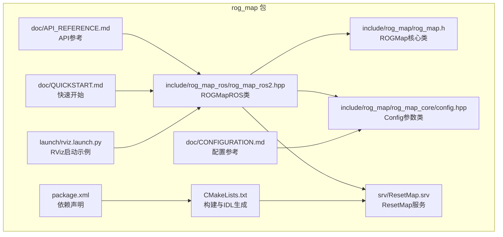
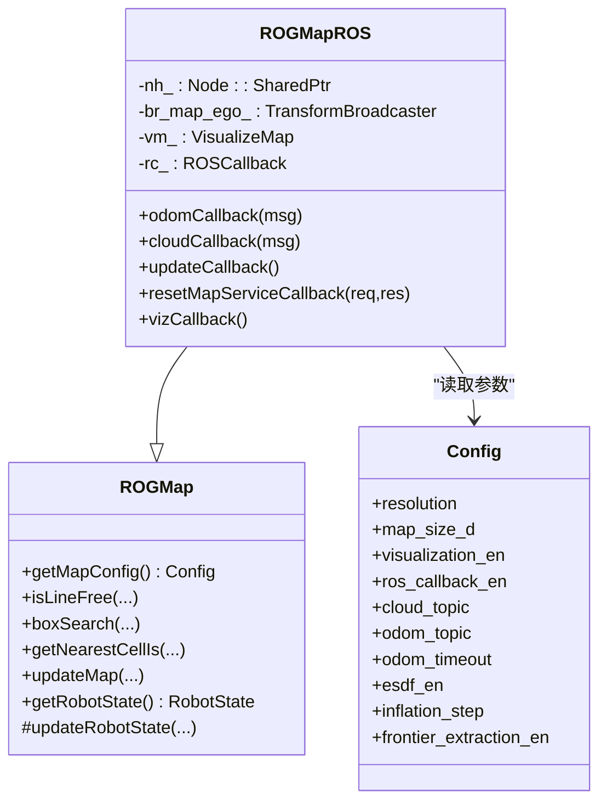
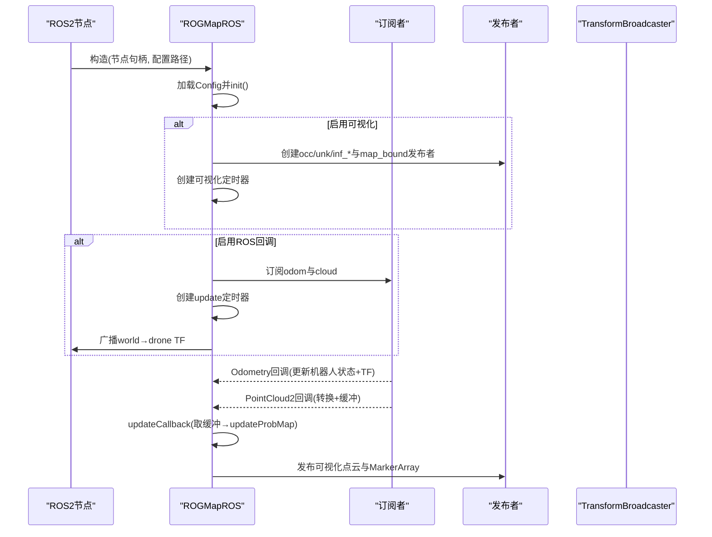
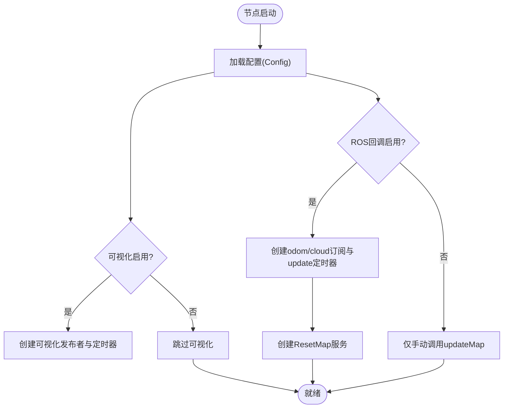
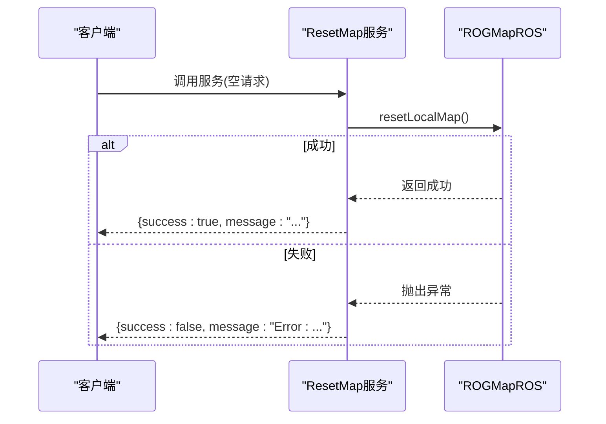
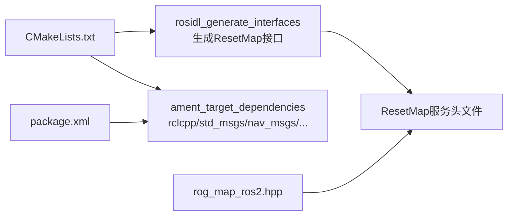

# ROS2集成与接口

<cite>
**本文引用的文件**
- [rog_map_ros2.hpp](file://src/SUPER/rog_map/include/rog_map_ros/rog_map_ros2.hpp)
- [ResetMap.srv](file://src/SUPER/rog_map/srv/ResetMap.srv)
- [CMakeLists.txt](file://src/SUPER/rog_map/CMakeLists.txt)
- [package.xml](file://src/SUPER/rog_map/package.xml)
- [rog_map.h](file://src/SUPER/rog_map/include/rog_map/rog_map.h)
- [config.hpp](file://src/SUPER/rog_map/include/rog_map/rog_map_core/config.hpp)
- [API_REFERENCE.md](file://src/SUPER/rog_map/doc/API_REFERENCE.md)
- [CONFIGURATION.md](file://src/SUPER/rog_map/doc/CONFIGURATION.md)
- [QUICKSTART.md](file://src/SUPER/rog_map/doc/QUICKSTART.md)
- [rviz.launch.py](file://src/SUPER/super_planner/launch/rviz.launch.py)
</cite>

## 目录
1. [简介](#简介)
2. [项目结构](#项目结构)
3. [核心组件](#核心组件)
4. [架构总览](#架构总览)
5. [详细组件分析](#详细组件分析)
6. [依赖关系分析](#依赖关系分析)
7. [性能考虑](#性能考虑)
8. [故障排除指南](#故障排除指南)
9. [结论](#结论)
10. [附录](#附录)

## 简介
本文件面向ROG地图系统的ROS2集成，围绕ROGMapROS类展开，系统阐述其ROS2节点封装、参数服务器集成、消息处理机制与服务接口；详解地图系统的ROS2接口（话题发布/订阅、服务接口、参数配置）；深入说明ResetMap服务的实现细节；解释地图数据的ROS2消息格式（Pointcloud2、Pose、MarkerArray等）；提供配置指南、使用示例、调试技巧与故障排除，并给出性能监控与可视化支持建议。

## 项目结构
ROG地图ROS2包位于src/SUPER/rog_map目录，关键文件包括：
- ROS2接口头文件：include/rog_map_ros/rog_map_ros2.hpp
- 服务定义：srv/ResetMap.srv
- 构建与导出：CMakeLists.txt、package.xml
- 核心地图类：include/rog_map/rog_map.h
- 配置参数类：include/rog_map/rog_map_core/config.hpp
- 文档：doc/API_REFERENCE.md、CONFIGURATION.md、QUICKSTART.md
- 示例与可视化：rviz.launch.py（示例launch）

**图表来源**
- [rog_map_ros2.hpp](file://src/SUPER/rog_map/include/rog_map_ros/rog_map_ros2.hpp#L1-L551)
- [rog_map.h](file://src/SUPER/rog_map/include/rog_map/rog_map.h#L1-L131)
- [config.hpp](file://src/SUPER/rog_map/include/rog_map/rog_map_core/config.hpp#L1-L422)
- [ResetMap.srv](file://src/SUPER/rog_map/srv/ResetMap.srv#L1-L7)
- [CMakeLists.txt](file://src/SUPER/rog_map/CMakeLists.txt#L1-L114)
- [package.xml](file://src/SUPER/rog_map/package.xml#L1-L27)
- [API_REFERENCE.md](file://src/SUPER/rog_map/doc/API_REFERENCE.md#L1-L573)
- [CONFIGURATION.md](file://src/SUPER/rog_map/doc/CONFIGURATION.md#L1-L243)
- [QUICKSTART.md](file://src/SUPER/rog_map/doc/QUICKSTART.md#L1-L319)
- [rviz.launch.py](file://src/SUPER/super_planner/launch/rviz.launch.py#L1-L30)

**章节来源**
- [CMakeLists.txt](file://src/SUPER/rog_map/CMakeLists.txt#L1-L114)
- [package.xml](file://src/SUPER/rog_map/package.xml#L1-L27)
- [API_REFERENCE.md](file://src/SUPER/rog_map/doc/API_REFERENCE.md#L1-L573)

## 核心组件
- ROGMapROS：继承自ROGMap，负责ROS2节点封装、参数加载、消息订阅与发布、定时器驱动更新、TF广播、可视化Marker发布与ResetMap服务。
- ROGMap：核心地图类，提供概率栅格、膨胀层、盒子搜索、线段自由检测、坐标转换等接口。
- Config：从YAML加载参数，控制分辨率、地图尺寸、滑动窗口、光线投射、膨胀、ESDF、可视化、ROS回调等。
- ResetMap服务：提供重置本地地图的服务接口。

**章节来源**
- [rog_map_ros2.hpp](file://src/SUPER/rog_map/include/rog_map_ros/rog_map_ros2.hpp#L41-L380)
- [rog_map.h](file://src/SUPER/rog_map/include/rog_map/rog_map.h#L39-L131)
- [config.hpp](file://src/SUPER/rog_map/include/rog_map/rog_map_core/config.hpp#L50-L288)
- [ResetMap.srv](file://src/SUPER/rog_map/srv/ResetMap.srv#L1-L7)

## 架构总览
ROGMapROS作为ROS2接口层，向上提供ROGMap核心查询与维护接口，向下对接ROS2的节点生命周期、参数服务器、话题与服务。

**图表来源**
- [rog_map_ros2.hpp](file://src/SUPER/rog_map/include/rog_map_ros/rog_map_ros2.hpp#L41-L380)
- [rog_map.h](file://src/SUPER/rog_map/include/rog_map/rog_map.h#L39-L131)
- [config.hpp](file://src/SUPER/rog_map/include/rog_map/rog_map_core/config.hpp#L50-L288)

## 详细组件分析

### ROGMapROS类实现
- 节点封装与参数加载
  - 通过构造函数接收rclcpp::Node::SharedPtr与配置文件路径，加载Config并初始化地图。
  - 若启用可视化，创建多个PointCloud2与MarkerArray发布者，并按设定频率定时发布。
  - 若启用ROS回调，创建Odometry与PointCloud2订阅者，以及ResetMap服务端口。
- 消息处理机制
  - Odometry回调：解析位姿，更新机器人状态，广播world→drone TF。
  - PointCloud2回调：校验里程计时效，使用pcl::fromROSMsg转换为内部点云，加锁写入缓冲，等待updateCallback统一处理。
  - updateCallback：从缓冲取出最新点云与位姿，调用updateProbMap执行概率更新与膨胀传播，记录耗时日志。
- 可视化与边界框
  - 可视化范围由机器人位置与配置的visualization_range决定，发布occ/unk/inf_occ/inf_unk/frontier/esdf等点云，以及MarkerArray标注地图边界、更新范围、原点等。
- ResetMap服务
  - 请求为空，响应包含success与message；成功时调用resetLocalMap并返回成功信息，异常时返回失败与错误信息。

**图表来源**
- [rog_map_ros2.hpp](file://src/SUPER/rog_map/include/rog_map_ros/rog_map_ros2.hpp#L75-L151)
- [rog_map_ros2.hpp](file://src/SUPER/rog_map/include/rog_map_ros/rog_map_ros2.hpp#L168-L298)
- [rog_map_ros2.hpp](file://src/SUPER/rog_map/include/rog_map_ros/rog_map_ros2.hpp#L317-L380)

**章节来源**
- [rog_map_ros2.hpp](file://src/SUPER/rog_map/include/rog_map_ros/rog_map_ros2.hpp#L41-L380)

### 地图系统的ROS2接口
- 话题接口
  - 订阅：
    - /lidar_slam/odom（nav_msgs/Odometry）：机器人位姿
    - /cloud_registered（sensor_msgs/PointCloud2）：LiDAR点云
  - 发布：
    - rog_map/occ、rog_map/unk、rog_map/inf_occ、rog_map/inf_unk、rog_map/frontier（sensor_msgs/PointCloud2）
    - rog_map/esdf（sensor_msgs/PointCloud2，可选）
    - rog_map/map_bound（visualization_msgs/MarkerArray）
- 服务接口
  - /rog_map/reset_map（rog_map/srv/ResetMap）：重置本地地图
- 参数配置
  - 通过Config从YAML加载，支持分辨率、地图尺寸、滑动窗口、光线投射、膨胀、ESDF、可视化、ROS回调等。

**图表来源**
- [rog_map_ros2.hpp](file://src/SUPER/rog_map/include/rog_map_ros/rog_map_ros2.hpp#L317-L380)
- [config.hpp](file://src/SUPER/rog_map/include/rog_map/rog_map_core/config.hpp#L116-L140)
- [API_REFERENCE.md](file://src/SUPER/rog_map/doc/API_REFERENCE.md#L366-L406)

**章节来源**
- [API_REFERENCE.md](file://src/SUPER/rog_map/doc/API_REFERENCE.md#L366-L406)
- [CONFIGURATION.md](file://src/SUPER/rog_map/doc/CONFIGURATION.md#L1-L243)

### ResetMap服务实现
- 请求处理
  - 请求为空，直接进入服务回调。
- 地图重置逻辑
  - 调用resetLocalMap清空本地地图。
- 响应机制
  - 成功：success=true，message为成功提示。
  - 异常：success=false，message包含错误信息。
- 调用方式
  - ros2 service call /rog_map/reset_map rog_map/srv/ResetMap

**图表来源**
- [rog_map_ros2.hpp](file://src/SUPER/rog_map/include/rog_map_ros/rog_map_ros2.hpp#L153-L166)
- [ResetMap.srv](file://src/SUPER/rog_map/srv/ResetMap.srv#L1-L7)

**章节来源**
- [rog_map_ros2.hpp](file://src/SUPER/rog_map/include/rog_map_ros/rog_map_ros2.hpp#L153-L166)
- [ResetMap.srv](file://src/SUPER/rog_map/srv/ResetMap.srv#L1-L7)

### 地图数据的ROS2消息格式
- PointCloud2消息
  - occ/unk/inf_occ/inf_unk/frontier/esdf等均以sensor_msgs/PointCloud2发布，使用vecEVec3fToPC2转换内部点云为ROS消息，设置frame_id为“world”，stamp为当前时间。
- Pose消息解析
  - Odometry消息中的pose.pose包含位置与四元数，ROGMapROS解析为内部位姿并更新机器人状态，同时广播TF。
- MarkerArray消息
  - map_bound以visualization_msgs/MarkerArray发布，包含边界框、文本标注、原点标记等，便于RViz可视化。

**章节来源**
- [rog_map_ros2.hpp](file://src/SUPER/rog_map/include/rog_map_ros/rog_map_ros2.hpp#L168-L298)
- [rog_map_ros2.hpp](file://src/SUPER/rog_map/include/rog_map_ros/rog_map_ros2.hpp#L300-L312)

### 配置指南
- 配置文件位置与加载
  - Config从YAML加载参数，节点启动时一次性读取，不支持运行时动态修改。
- 关键参数类别
  - 地图分辨率与尺寸、滑动窗口、光线投射、膨胀、ESDF、可视化、ROS回调、点云处理等。
- 示例配置
  - 提供低延迟与高精度两种配置示例，以及仿真环境下的典型配置。

**章节来源**
- [CONFIGURATION.md](file://src/SUPER/rog_map/doc/CONFIGURATION.md#L1-L243)
- [config.hpp](file://src/SUPER/rog_map/include/rog_map/rog_map_core/config.hpp#L68-L288)

### 使用示例与集成
- 基础使用
  - 创建rclcpp::Node与ROGMapROS实例，传入配置路径；若启用ROS回调，确保odom与cloud话题正常发布。
- 查询接口
  - 支持单点查询、线段自由检测、盒子搜索、最近邻搜索、坐标转换等。
- 可视化
  - 在RViz中订阅rog_map/*与rog_map/map_bound即可观察地图状态与边界框。

**章节来源**
- [QUICKSTART.md](file://src/SUPER/rog_map/doc/QUICKSTART.md#L1-L319)
- [API_REFERENCE.md](file://src/SUPER/rog_map/doc/API_REFERENCE.md#L408-L510)

## 依赖关系分析
- 构建与IDL生成
  - CMakeLists中声明依赖rclcpp、nav_msgs、sensor_msgs、geometry_msgs、visualization_msgs、tf2_ros、pcl_conversions、fmt等，并通过rosidl_generate_interfaces生成ResetMap服务接口。
- 运行时依赖
  - package.xml声明构建与执行依赖，确保运行时可用。

**图表来源**
- [CMakeLists.txt](file://src/SUPER/rog_map/CMakeLists.txt#L39-L93)
- [package.xml](file://src/SUPER/rog_map/package.xml#L10-L22)
- [rog_map_ros2.hpp](file://src/SUPER/rog_map/include/rog_map_ros/rog_map_ros2.hpp#L35-L35)

**章节来源**
- [CMakeLists.txt](file://src/SUPER/rog_map/CMakeLists.txt#L39-L93)
- [package.xml](file://src/SUPER/rog_map/package.xml#L10-L22)

## 性能考虑
- 时间复杂度
  - 单点查询O(1)，线段碰撞检测O(N)，盒子搜索O(M)，最近邻搜索O(K³)，地图更新O(P+O)。
- 配置优化建议
  - 降低分辨率、缩小地图尺寸、关闭不必要的功能（如ESDF、frontier_extraction_en、unk_inflation_en）、合理设置batch_update_size与point_filt_num。
- 实时性保障
  - updateCallback以高频定时器触发，注意避免长时间阻塞操作；可视化频率可通过viz_time_rate控制。

**章节来源**
- [API_REFERENCE.md](file://src/SUPER/rog_map/doc/API_REFERENCE.md#L512-L541)
- [CONFIGURATION.md](file://src/SUPER/rog_map/doc/CONFIGURATION.md#L182-L243)

## 故障排除指南
- 节点启动失败
  - 检查配置文件路径与权限；确认参数文件存在且字段正确。
- 点云不更新
  - 使用ros2 topic hz检查cloud_registered与/lidar_slam/odom是否正常发布；核对配置中ros_callback.enable、cloud_topic、odom_topic与odom_timeout。
- 查询速度慢
  - 降低resolution、map_size，关闭esdf_en、frontier_extraction_en、unk_inflation_en，或提高point_filt_num。
- 可视化无显示
  - 确认rog_map/*与rog_map/map_bound话题已发布；在RViz中添加对应显示。

**章节来源**
- [QUICKSTART.md](file://src/SUPER/rog_map/doc/QUICKSTART.md#L181-L242)

## 结论
ROGMapROS通过清晰的ROS2接口封装，将ROGMap核心算法无缝接入ROS2生态，提供稳定的地图更新、查询与可视化能力。通过ResetMap服务与完善的参数体系，用户可在不同场景下灵活配置与快速重置地图。结合本文的配置、使用与故障排除指南，可有效支撑实际应用部署与性能优化。

## 附录
- API参考与配置参考请参见doc目录下的API_REFERENCE.md与CONFIGURATION.md。
- RViz启动示例可参考rviz.launch.py，便于可视化验证。

**章节来源**
- [API_REFERENCE.md](file://src/SUPER/rog_map/doc/API_REFERENCE.md#L552-L573)
- [CONFIGURATION.md](file://src/SUPER/rog_map/doc/CONFIGURATION.md#L1-L243)
- [rviz.launch.py](file://src/SUPER/super_planner/launch/rviz.launch.py#L1-L30)