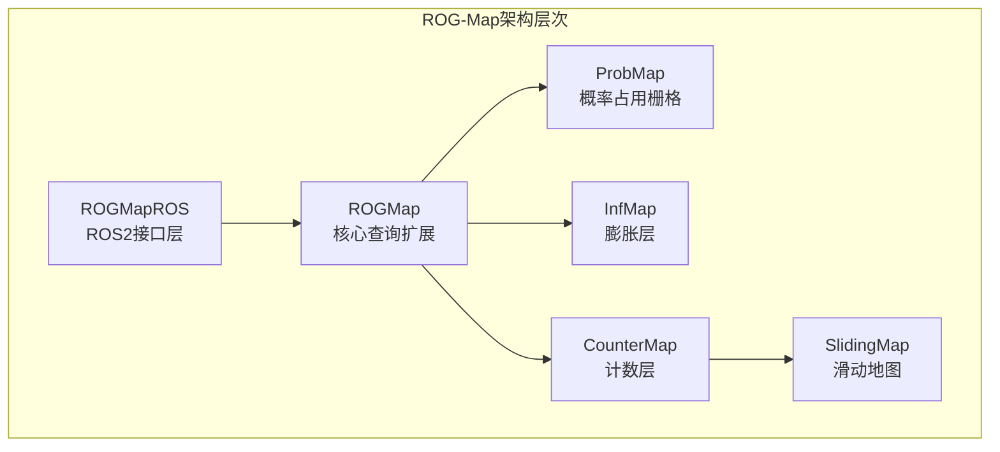
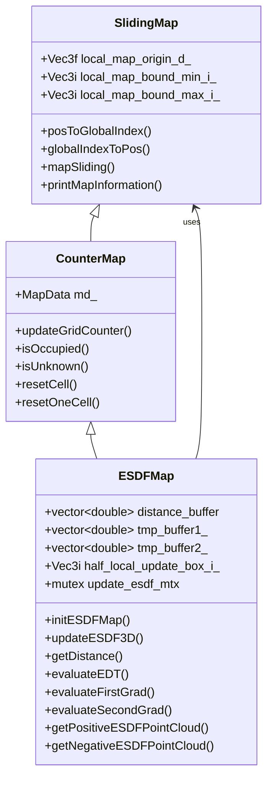
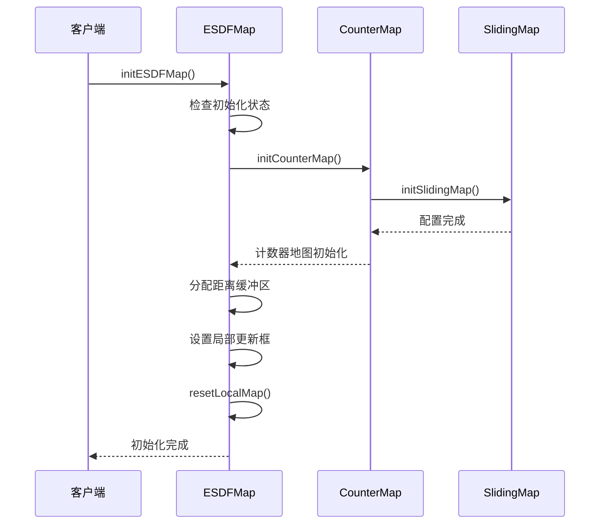
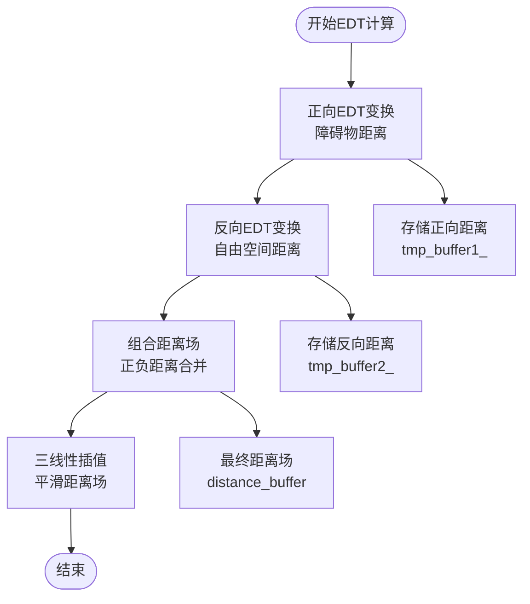
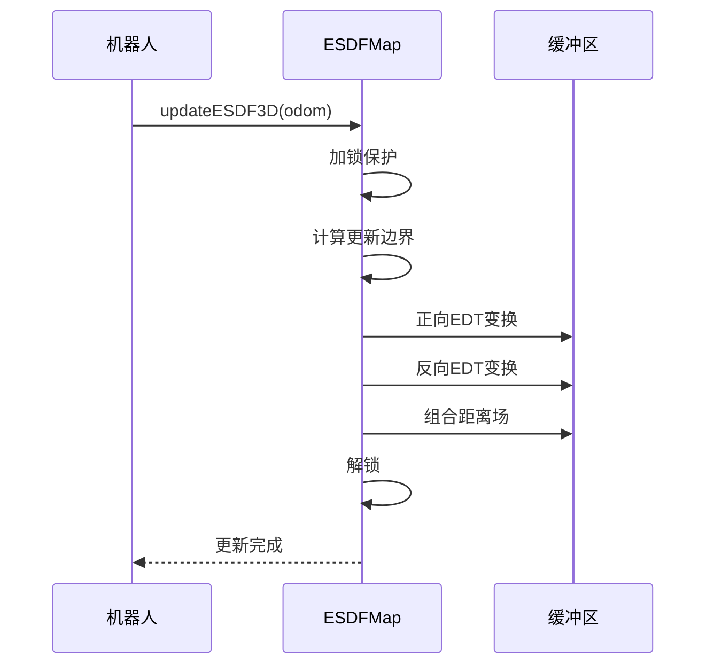
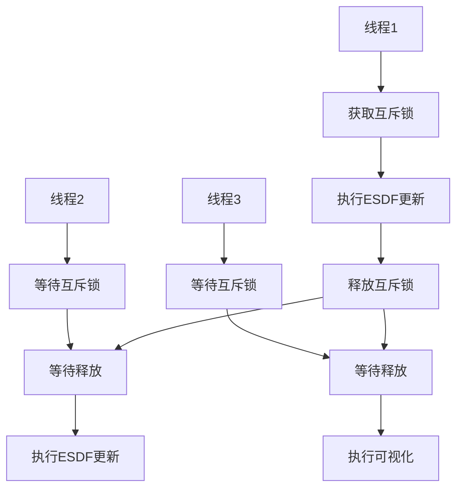
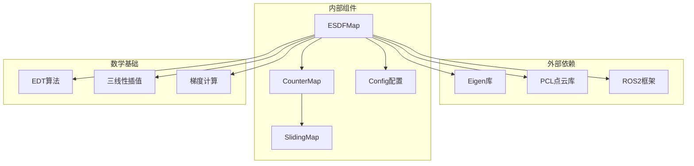

# ESDF地图实现

<cite>
**本文档引用的文件**
- [esdf_map.h](file://src/SUPER/rog_map/include/rog_map/esdf_map.h)
- [esdf_map.cpp](file://src/SUPER/rog_map/src/rog_map/esdf_map.cpp)
- [counter_map.h](file://src/SUPER/rog_map/include/rog_map/rog_map_core/counter_map.h)
- [sliding_map.h](file://src/SUPER/rog_map/include/rog_map/rog_map_core/sliding_map.h)
- [sliding_map.cpp](file://src/SUPER/rog_map/src/rog_map/sliding_map.cpp)
- [config.hpp](file://src/SUPER/rog_map/include/rog_map/rog_map_core/config.hpp)
- [rog_map.h](file://src/SUPER/rog_map/include/rog_map/rog_map.h)
- [rog_map.cpp](file://src/SUPER/rog_map/src/rog_map/rog_map.cpp)
- [API_REFERENCE.md](file://src/SUPER/rog_map/doc/API_REFERENCE.md)
</cite>

## 目录
1. [简介](#简介)
2. [项目结构](#项目结构)
3. [核心组件](#核心组件)
4. [架构概览](#架构概览)
5. [详细组件分析](#详细组件分析)
6. [依赖关系分析](#依赖关系分析)
7. [性能考虑](#性能考虑)
8. [故障排除指南](#故障排除指南)
9. [结论](#结论)

## 简介

ESDF（Euclidean Signed Distance Field，欧几里得有符号距离场）是ROG-Map系统中的重要组成部分，用于提供精确的距离信息和梯度计算。该实现基于符号距离场的数学原理，结合高效的EDT（Euclidean Distance Transform，欧几里得距离变换）算法，为无人机导航和避障提供关键的空间信息。

ESDF地图的核心优势在于其能够同时提供正负距离信息，其中正值表示到最近障碍物的距离，负值表示到最近自由空间的距离。这种双向距离信息对于路径规划和避障算法具有重要意义。

## 项目结构

ROG-Map系统采用分层架构设计，ESDF地图作为第三层核心组件，位于概率地图和膨胀层之间：



**图表来源**
- [rog_map.h](file://src/SUPER/rog_map/include/rog_map/rog_map.h#L39-L130)
- [counter_map.h](file://src/SUPER/rog_map/include/rog_map/rog_map_core/counter_map.h#L34-L141)

**章节来源**
- [rog_map.h](file://src/SUPER/rog_map/include/rog_map/rog_map.h#L1-L131)
- [API_REFERENCE.md](file://src/SUPER/rog_map/doc/API_REFERENCE.md#L29-L70)

## 核心组件

### ESDFMap类概述

ESDFMap类继承自CounterMap，专门负责符号距离场的计算和管理。该类提供了完整的ESDF功能，包括距离计算、梯度求解和可视化接口。

#### 主要特性

1. **符号距离场计算**：支持正负双向距离信息
2. **高效EDT算法**：使用快速EDT变换算法
3. **三线性插值**：提供平滑的距离场插值
4. **多线程安全**：内置互斥锁保护
5. **滑动窗口支持**：内存高效的局部更新

**章节来源**
- [esdf_map.h](file://src/SUPER/rog_map/include/rog_map/esdf_map.h#L32-L106)
- [esdf_map.cpp](file://src/SUPER/rog_map/src/rog_map/esdf_map.cpp#L31-L58)

## 架构概览

ESDF地图的实现采用了模块化设计，各个组件职责明确：



**图表来源**
- [sliding_map.h](file://src/SUPER/rog_map/include/rog_map/rog_map_core/sliding_map.h#L41-L141)
- [counter_map.h](file://src/SUPER/rog_map/include/rog_map/rog_map_core/counter_map.h#L34-L141)
- [esdf_map.h](file://src/SUPER/rog_map/include/rog_map/esdf_map.h#L32-L106)

## 详细组件分析

### ESDFMap构造函数initESDFMap

initESDFMap函数负责ESDF地图的初始化配置，包含以下关键参数：

#### 参数配置详解

| 参数名称 | 类型 | 描述 | 默认值 |
|---------|------|------|--------|
| half_prob_map_size_i | Vec3i | 地图半尺寸（以网格为单位） | 用户配置 |
| prob_map_resolution | double | 概率地图分辨率 | 用户配置 |
| temp_counter_map_resolution | double | 临时计数器地图分辨率 | 用户配置 |
| local_update_box | Vec3f | 局部更新框尺寸 | 用户配置 |
| map_sliding_en | bool | 是否启用地图滑动 | 用户配置 |
| sliding_thresh | double | 滑动阈值 | 用户配置 |
| fix_map_origin | Vec3f | 固定地图原点 | 用户配置 |
| unk_thresh | double | 未知阈值 | 用户配置 |

#### 初始化流程



**图表来源**
- [esdf_map.cpp](file://src/SUPER/rog_map/src/rog_map/esdf_map.cpp#L31-L58)
- [counter_map.h](file://src/SUPER/rog_map/include/rog_map/rog_map_core/counter_map.h#L62-L71)

**章节来源**
- [esdf_map.cpp](file://src/SUPER/rog_map/src/rog_map/esdf_map.cpp#L31-L58)
- [config.hpp](file://src/SUPER/rog_map/include/rog_map/rog_map_core/config.hpp#L82-L94)

### 距离场计算算法

ESDF地图实现了高效的EDT（Euclidean Distance Transform）算法，采用三线性插值方法提供精确的距离信息。

#### EDT算法实现

EDT算法采用快速一维EDT变换，通过以下步骤实现：

1. **正向EDT变换**：计算到最近障碍物的距离
2. **反向EDT变换**：计算到最近自由空间的距离  
3. **组合距离场**：将正负距离场合并



**图表来源**
- [esdf_map.cpp](file://src/SUPER/rog_map/src/rog_map/esdf_map.cpp#L80-L249)

#### 三线性插值方法

三线性插值提供了平滑的距离场估计，通过以下公式实现：

```
f(x,y,z) = Σ Σ Σ f(i,j,k) · α_i(x) · β_j(y) · γ_k(z)
```

其中α、β、γ是插值基函数，确保在网格点处的值保持不变。

**章节来源**
- [esdf_map.cpp](file://src/SUPER/rog_map/src/rog_map/esdf_map.cpp#L320-L378)
- [esdf_map.cpp](file://src/SUPER/rog_map/src/rog_map/esdf_map.cpp#L464-L496)

### getDistance接口使用

getDistance接口提供两种使用方式：

#### 位置查询模式
```cpp
double getDistance(const Vec3f &pos) const;
```
- **输入**：世界坐标系中的3D位置
- **输出**：该位置的符号距离值
- **用途**：快速距离查询

#### 索引查询模式
```cpp
double getDistance(const Vec3i &id_g) const;
```
- **输入**：全局网格索引
- **输出**：该网格的符号距离值
- **用途**：内部高效访问

**章节来源**
- [esdf_map.h](file://src/SUPER/rog_map/include/rog_map/esdf_map.h#L49-L51)
- [esdf_map.cpp](file://src/SUPER/rog_map/src/rog_map/esdf_map.cpp#L72-L78)

### updateESDF3D更新机制

updateESDF3D方法实现了ESDF地图的增量更新，采用滑动窗口机制：

#### 更新触发条件

1. **机器人位姿变化**：当机器人位置变化超过阈值时
2. **地图滑动**：当需要扩展或收缩局部地图时
3. **手动触发**：通过API显式调用更新

#### 更新流程



**图表来源**
- [esdf_map.cpp](file://src/SUPER/rog_map/src/rog_map/esdf_map.cpp#L80-L249)

**章节来源**
- [esdf_map.cpp](file://src/SUPER/rog_map/src/rog_map/esdf_map.cpp#L80-L249)

### 梯度计算方法

ESDF地图提供了完整的梯度计算功能，包括一阶和二阶导数：

#### evaluateEDT方法
- **功能**：计算给定点的距离值
- **输入**：3D查询位置
- **输出**：距离值
- **应用**：距离场可视化和基本查询

#### evaluateFirstGrad方法  
- **功能**：计算一阶导数（梯度）
- **输入**：3D查询位置
- **输出**：3D梯度向量
- **应用**：路径规划和避障

#### evaluateSecondGrad方法
- **功能**：计算二阶导数
- **输入**：3D查询位置  
- **输出**：3D二阶导数向量
- **应用**：高级优化算法

**章节来源**
- [esdf_map.h](file://src/SUPER/rog_map/include/rog_map/esdf_map.h#L57-L61)
- [esdf_map.cpp](file://src/SUPER/rog_map/src/rog_map/esdf_map.cpp#L428-L462)

### 点云可视化接口

ESDF地图提供了专门的点云生成接口用于可视化：

#### getPositiveESDFPointCloud
- **功能**：生成正距离场点云
- **参数**：查询盒子范围、可视化高度、点云容器
- **用途**：显示障碍物周围的正距离信息

#### getNegativeESDFPointCloud  
- **功能**：生成负距离场点云
- **参数**：查询盒子范围、可视化高度、点云容器
- **用途**：显示自由空间周围的负距离信息

**章节来源**
- [esdf_map.h](file://src/SUPER/rog_map/include/rog_map/esdf_map.h#L63-L67)
- [esdf_map.cpp](file://src/SUPER/rog_map/src/rog_map/esdf_map.cpp#L255-L318)

### 多线程安全机制

ESDF地图实现了完善的多线程安全保障：

#### 互斥锁保护
- **update_esdf_mtx**：保护ESDF更新操作
- **可视化操作**：同样使用互斥锁确保线程安全
- **缓冲区访问**：防止并发读写冲突

#### 线程安全保证



**图表来源**
- [esdf_map.h](file://src/SUPER/rog_map/include/rog_map/esdf_map.h#L86-L87)
- [esdf_map.cpp](file://src/SUPER/rog_map/src/rog_map/esdf_map.cpp#L257-L257)

**章节来源**
- [esdf_map.h](file://src/SUPER/rog_map/include/rog_map/esdf_map.h#L86-L87)
- [esdf_map.cpp](file://src/SUPER/rog_map/src/rog_map/esdf_map.cpp#L257-L318)

## 依赖关系分析

ESDF地图的实现涉及多个层次的依赖关系：



**图表来源**
- [esdf_map.h](file://src/SUPER/rog_map/include/rog_map/esdf_map.h#L26-L27)
- [counter_map.h](file://src/SUPER/rog_map/include/rog_map/rog_map_core/counter_map.h#L34-L35)
- [config.hpp](file://src/SUPER/rog_map/include/rog_map/rog_map_core/config.hpp#L50-L49)

**章节来源**
- [esdf_map.h](file://src/SUPER/rog_map/include/rog_map/esdf_map.h#L26-L27)
- [counter_map.h](file://src/SUPER/rog_map/include/rog_map/rog_map_core/counter_map.h#L34-L35)

## 性能考虑

### 时间复杂度分析

| 操作 | 复杂度 | 说明 |
|------|--------|------|
| 单点距离查询 | O(1) | 直接数组访问 |
| EDT变换 | O(N³) | N为地图尺寸 |
| 局部更新 | O(L³) | L为更新区域尺寸 |
| 梯度计算 | O(1) | 三线性插值 |

### 内存管理策略

1. **缓冲区预分配**：提前分配distance_buffer和tmp_buffer
2. **滑动窗口机制**：只维护局部地图区域
3. **智能重置**：地图滑动时智能清理内存
4. **互斥锁优化**：最小化锁持有时间

### 性能优化建议

1. **合理设置分辨率**：平衡精度和性能
2. **优化更新区域**：减少不必要的更新
3. **多线程利用**：充分利用现代CPU核心
4. **内存对齐**：提高缓存命中率

## 故障排除指南

### 常见问题及解决方案

#### ESDF初始化失败
- **症状**：抛出"init can only be called once"异常
- **原因**：重复初始化ESDF地图
- **解决**：确保只调用一次initESDFMap

#### 距离计算异常
- **症状**：getDistance返回NaN或异常值
- **原因**：地图未正确初始化或超出边界
- **解决**：检查地图配置和查询位置

#### 性能问题
- **症状**：updateESDF3D执行时间过长
- **原因**：更新区域过大或分辨率过高
- **解决**：优化配置参数

**章节来源**
- [esdf_map.cpp](file://src/SUPER/rog_map/src/rog_map/esdf_map.cpp#L36-L38)
- [esdf_map.cpp](file://src/SUPER/rog_map/src/rog_map/esdf_map.cpp#L239-L241)

## 结论

ESDF地图作为ROG-Map系统的核心组件，实现了高效的符号距离场计算。通过精心设计的算法和架构，该实现能够在保证精度的同时提供良好的性能表现。

主要技术特点包括：
- 基于EDT的精确距离计算
- 三线性插值提供平滑结果
- 完善的多线程安全保障
- 智能的内存管理和滑动窗口机制
- 丰富的可视化和查询接口

该实现为无人机导航和避障提供了坚实的基础，是ROG-Map系统的重要技术支撑。