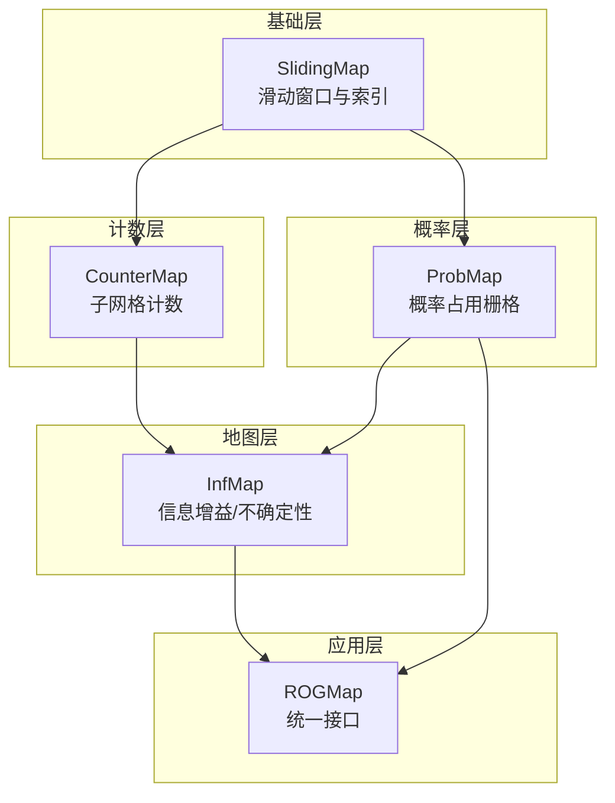
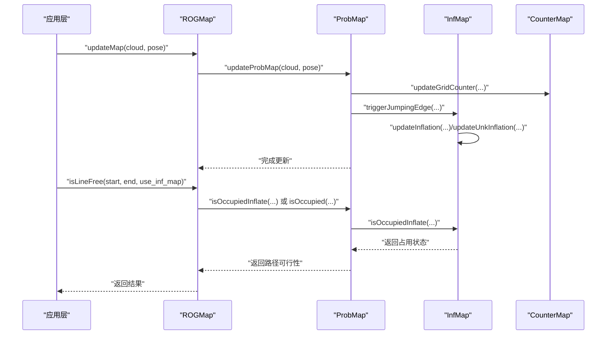
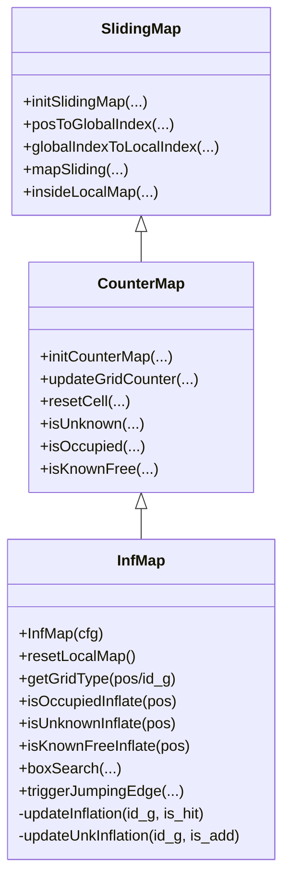
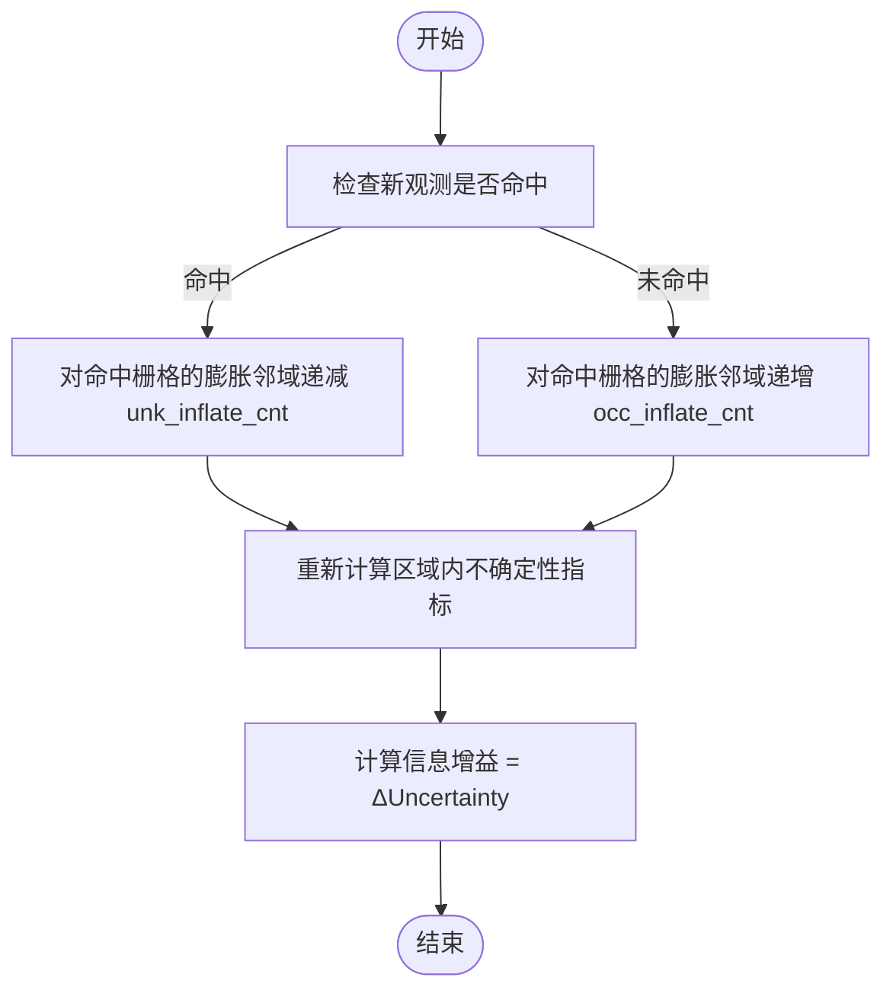
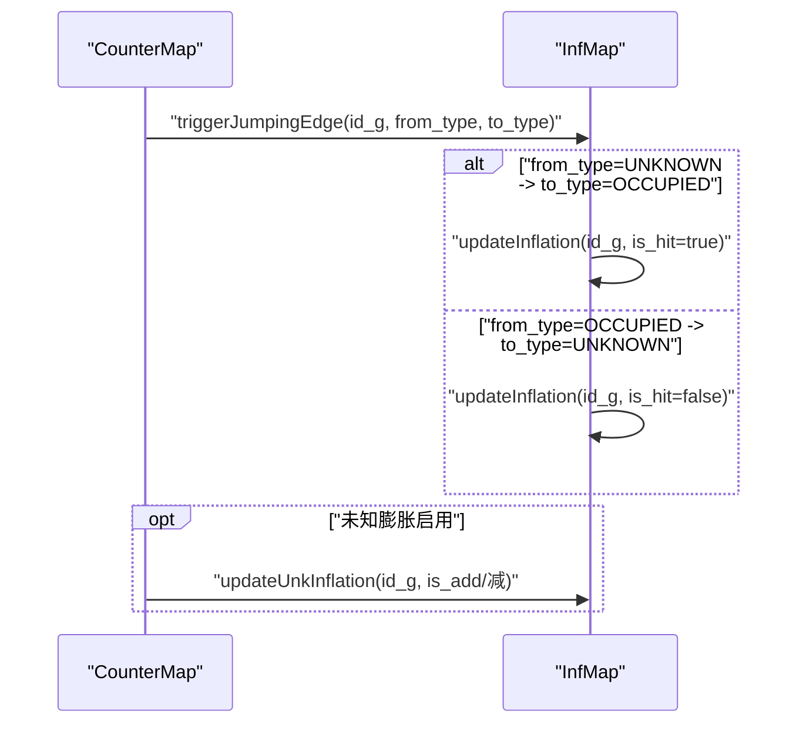
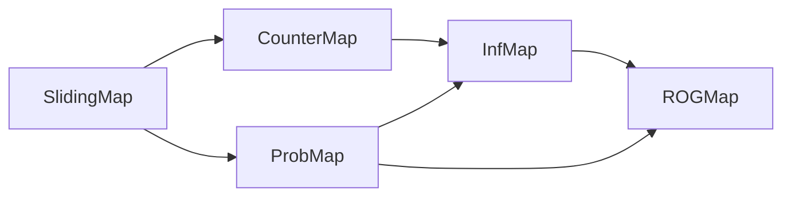
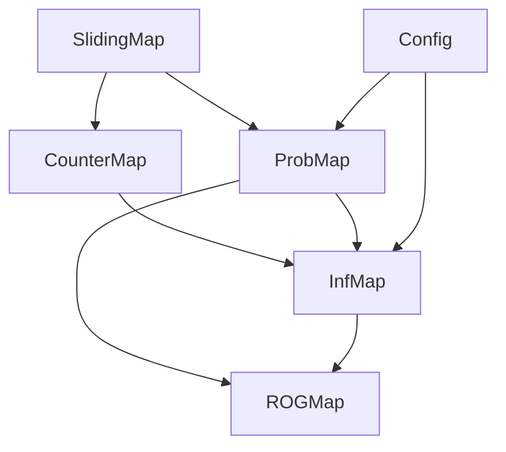

# 信息地图实现

<cite>
**本文引用的文件**
- [inf_map.h](file://src/SUPER/rog_map/include/rog_map/inf_map.h)
- [inf_map.cpp](file://src/SUPER/rog_map/src/rog_map/inf_map.cpp)
- [counter_map.h](file://src/SUPER/rog_map/include/rog_map/rog_map_core/counter_map.h)
- [counter_map.cpp](file://src/SUPER/rog_map/src/rog_map/counter_map.cpp)
- [prob_map.h](file://src/SUPER/rog_map/include/rog_map/prob_map.h)
- [prob_map.cpp](file://src/SUPER/rog_map/src/rog_map/prob_map.cpp)
- [rog_map.h](file://src/SUPER/rog_map/include/rog_map/rog_map.h)
- [rog_map.cpp](file://src/SUPER/rog_map/src/rog_map/rog_map.cpp)
- [config.hpp](file://src/SUPER/rog_map/include/rog_map/rog_map_core/config.hpp)
- [sliding_map.h](file://src/SUPER/rog_map/include/rog_map/rog_map_core/sliding_map.h)
</cite>

## 目录
1. [引言](#引言)
2. [项目结构](#项目结构)
3. [核心组件](#核心组件)
4. [架构总览](#架构总览)
5. [详细组件分析](#详细组件分析)
6. [依赖关系分析](#依赖关系分析)
7. [性能考虑](#性能考虑)
8. [故障排查指南](#故障排查指南)
9. [结论](#结论)
10. [附录](#附录)

## 引言
本技术文档围绕信息地图（InfMap）系统进行深入解析，目标是帮助读者理解信息地图的信息论基础、实现原理与使用方式，并结合概率地图（ProbMap）、计数地图（CounterMap）与滑动地图（SlidingMap）的整体架构，说明信息增益在探索与路径规划中的作用。文档涵盖以下要点：
- 信息增益的概念与计算方法（基于不确定性减少）
- InfMap 的实现原理：信息量的量化表示与累积机制
- 信息增益评估流程：如何通过新观测减少地图不确定性
- 更新策略：信息量的传播与衰减
- 查询接口：getInformationGain、getUncertainty 等方法的使用
- 自适应地图分辨率：基于信息增益动态调整精度
- 初始化配置与参数设置
- 与概率地图、计数地图的协同工作机制
- 探索性任务的应用示例与效果分析
- 性能优化与内存管理
- 不同传感器配置下的表现差异

## 项目结构
信息地图系统位于 SUPER/rog_map 模块中，采用分层设计：
- 基础层：SlidingMap 提供滑动窗口与坐标转换能力
- 计数层：CounterMap 提供子网格计数与未知阈值判定
- 地图层：InfMap 在计数基础上实现“膨胀”计数，用于不确定性建模
- 概率层：ProbMap 在概率占用栅格之上叠加 InfMap，提供统一查询接口
- 应用层：ROGMap 将 ProbMap 与 InfMap 组合，提供路径规划与探索接口

**图表来源**
- [sliding_map.h](file://src/SUPER/rog_map/include/rog_map/rog_map_core/sliding_map.h#L41-L141)
- [counter_map.h](file://src/SUPER/rog_map/include/rog_map/rog_map_core/counter_map.h#L34-L141)
- [inf_map.h](file://src/SUPER/rog_map/include/rog_map/inf_map.h#L30-L92)
- [prob_map.h](file://src/SUPER/rog_map/include/rog_map/prob_map.h#L38-L166)
- [rog_map.h](file://src/SUPER/rog_map/include/rog_map/rog_map.h#L39-L131)

**章节来源**
- [sliding_map.h](file://src/SUPER/rog_map/include/rog_map/rog_map_core/sliding_map.h#L41-L141)
- [counter_map.h](file://src/SUPER/rog_map/include/rog_map/rog_map_core/counter_map.h#L34-L141)
- [inf_map.h](file://src/SUPER/rog_map/include/rog_map/inf_map.h#L30-L92)
- [prob_map.h](file://src/SUPER/rog_map/include/rog_map/prob_map.h#L38-L166)
- [rog_map.h](file://src/SUPER/rog_map/include/rog_map/rog_map.h#L39-L131)

## 核心组件
- SlidingMap：负责地图边界、坐标变换、滑动窗口与内存清理
- CounterMap：维护每个栅格的“已占/未知”子网格计数，支持未知阈值判定
- InfMap：在 CounterMap 基础上，以“膨胀”计数记录不确定性；通过邻居累加实现信息传播
- ProbMap：概率占用栅格，与 InfMap 协作提供统一查询接口
- ROGMap：对外提供路径规划与探索接口，内部组合 ProbMap 与 InfMap

关键职责与关系：
- InfMap 依赖 CounterMap 的计数结构与滑动窗口能力
- ProbMap 同时持有 InfMap 指针，提供统一查询与可视化
- ROGMap 聚合 ProbMap，暴露 isLineFree、最近邻查询等高层接口

**章节来源**
- [sliding_map.h](file://src/SUPER/rog_map/include/rog_map/rog_map_core/sliding_map.h#L41-L141)
- [counter_map.h](file://src/SUPER/rog_map/include/rog_map/rog_map_core/counter_map.h#L34-L141)
- [inf_map.h](file://src/SUPER/rog_map/include/rog_map/inf_map.h#L30-L92)
- [prob_map.h](file://src/SUPER/rog_map/include/rog_map/prob_map.h#L38-L166)
- [rog_map.h](file://src/SUPER/rog_map/include/rog_map/rog_map.h#L39-L131)

## 架构总览
信息地图系统通过多层抽象实现从基础索引到高级查询的完整链路。下图展示各模块间的调用关系与数据流。

**图表来源**
- [rog_map.cpp](file://src/SUPER/rog_map/src/rog_map/rog_map.cpp#L240-L262)
- [prob_map.cpp](file://src/SUPER/rog_map/src/rog_map/prob_map.cpp#L1-L200)
- [inf_map.cpp](file://src/SUPER/rog_map/src/rog_map/inf_map.cpp#L188-L214)
- [counter_map.h](file://src/SUPER/rog_map/include/rog_map/rog_map_core/counter_map.h#L98-L107)

**章节来源**
- [rog_map.cpp](file://src/SUPER/rog_map/src/rog_map/rog_map.cpp#L240-L262)
- [prob_map.cpp](file://src/SUPER/rog_map/src/rog_map/prob_map.cpp#L1-L200)
- [inf_map.cpp](file://src/SUPER/rog_map/src/rog_map/inf_map.cpp#L188-L214)
- [counter_map.h](file://src/SUPER/rog_map/include/rog_map/rog_map_core/counter_map.h#L98-L107)

## 详细组件分析

### InfMap 类分析
InfMap 是信息地图的核心，基于“膨胀计数”实现不确定性量化与传播。其关键点如下：
- 数据结构：occ_inflate_cnt（占用膨胀计数）、unk_inflate_cnt（未知膨胀计数，可选）
- 初始化：根据配置的膨胀半径与分辨率，构建膨胀球形邻域表，分配计数数组
- 更新策略：triggerJumpingEdge 根据栅格类型变化触发 updateInflation/updateUnkInflation，沿邻域累加/递减
- 查询接口：isOccupiedInflate/isUnknownInflate/isKnownFreeInflate，以及按位置/全局索引的类型查询
- 虚拟边界：通过虚拟地面与天花板高度快速判定边界区域为占用

**图表来源**
- [sliding_map.h](file://src/SUPER/rog_map/include/rog_map/rog_map_core/sliding_map.h#L41-L141)
- [counter_map.h](file://src/SUPER/rog_map/include/rog_map/rog_map_core/counter_map.h#L34-L141)
- [inf_map.h](file://src/SUPER/rog_map/include/rog_map/inf_map.h#L30-L92)

**章节来源**
- [inf_map.h](file://src/SUPER/rog_map/include/rog_map/inf_map.h#L30-L92)
- [inf_map.cpp](file://src/SUPER/rog_map/src/rog_map/inf_map.cpp#L77-L109)
- [inf_map.cpp](file://src/SUPER/rog_map/src/rog_map/inf_map.cpp#L178-L186)
- [inf_map.cpp](file://src/SUPER/rog_map/src/rog_map/inf_map.cpp#L188-L214)
- [inf_map.cpp](file://src/SUPER/rog_map/src/rog_map/inf_map.cpp#L216-L250)
- [inf_map.cpp](file://src/SUPER/rog_map/src/rog_map/inf_map.cpp#L252-L269)
- [inf_map.cpp](file://src/SUPER/rog_map/src/rog_map/inf_map.cpp#L280-L309)

### 信息增益与不确定性计算
信息增益在本系统中的含义是：通过一次新的观测（命中/未命中），能够减少多少“不确定性”。InfMap 使用“膨胀计数”表达不确定性：
- 不确定性高：某栅格的“未知膨胀计数”较大，意味着周围存在较多未知区域
- 不确定性低：该栅格的“未知膨胀计数”接近于零，或被“占用膨胀计数”覆盖
- 信息增益评估：当新观测命中某栅格时，其膨胀邻域内的“未知膨胀计数”减少，从而降低不确定性

注意：仓库中未直接提供名为 getInformationGain/getUncertainty 的函数。但可通过以下方式间接实现：
- 获取当前不确定性：统计某个区域内 unk_inflate_cnt 大于阈值的体素数量
- 评估信息增益：比较新观测前后的不确定性差值（例如命中前后 unk_inflate_cnt 的变化）

**图表来源**
- [inf_map.cpp](file://src/SUPER/rog_map/src/rog_map/inf_map.cpp#L188-L214)
- [inf_map.cpp](file://src/SUPER/rog_map/src/rog_map/inf_map.cpp#L216-L250)

**章节来源**
- [inf_map.cpp](file://src/SUPER/rog_map/src/rog_map/inf_map.cpp#L188-L214)
- [inf_map.cpp](file://src/SUPER/rog_map/src/rog_map/inf_map.cpp#L216-L250)

### 信息地图的更新策略
InfMap 的更新遵循“跳跃边触发”的模式：
- 当栅格类型发生跳变（从未知到占用、从占用到未知等），触发 triggerJumpingEdge
- 对应地调用 updateInflation 或 updateUnkInflation，沿膨胀邻域累加/递减计数
- 支持“占用膨胀计数”与“未知膨胀计数”双通道，后者需启用 unk_inflation_en

**图表来源**
- [counter_map.h](file://src/SUPER/rog_map/include/rog_map/rog_map_core/counter_map.h#L98-L107)
- [inf_map.cpp](file://src/SUPER/rog_map/src/rog_map/inf_map.cpp#L252-L269)
- [inf_map.cpp](file://src/SUPER/rog_map/src/rog_map/inf_map.cpp#L188-L214)
- [inf_map.cpp](file://src/SUPER/rog_map/src/rog_map/inf_map.cpp#L216-L250)

**章节来源**
- [counter_map.h](file://src/SUPER/rog_map/include/rog_map/rog_map_core/counter_map.h#L98-L107)
- [inf_map.cpp](file://src/SUPER/rog_map/src/rog_map/inf_map.cpp#L252-L269)
- [inf_map.cpp](file://src/SUPER/rog_map/src/rog_map/inf_map.cpp#L188-L214)
- [inf_map.cpp](file://src/SUPER/rog_map/src/rog_map/inf_map.cpp#L216-L250)

### 信息查询接口与使用方法
- 基础查询
  - isOccupiedInflate(pos)：判断膨胀后是否为占用
  - isUnknownInflate(pos)：判断膨胀后是否为未知（需启用 unk_inflation_en）
  - isKnownFreeInflate(pos)：判断膨胀后是否为已知自由
  - getGridType(pos/id_g)：返回精确的栅格类型（占用/未知/已知自由）
- 辅助接口
  - boxSearch：在指定包围盒内检索特定类型的体素
  - getInflationNumAndTime：获取膨胀操作次数与耗时
  - writeMapInfoToLog：输出地图信息日志
  - infMapPosToGlobalIndex/infMapGlobalIndexToPos：坐标转换

注意：仓库未提供 getInformationGain/getUncertainty 的直接实现。建议通过统计 unk_inflate_cnt 的分布与变化来估算不确定性与信息增益。

**章节来源**
- [inf_map.h](file://src/SUPER/rog_map/include/rog_map/inf_map.h#L39-L64)
- [inf_map.cpp](file://src/SUPER/rog_map/src/rog_map/inf_map.cpp#L29-L65)
- [inf_map.cpp](file://src/SUPER/rog_map/src/rog_map/inf_map.cpp#L125-L175)
- [inf_map.cpp](file://src/SUPER/rog_map/src/rog_map/inf_map.cpp#L111-L116)
- [inf_map.cpp](file://src/SUPER/rog_map/src/rog_map/inf_map.cpp#L118-L123)

### 自适应地图分辨率与信息增益
- 分辨率关系：配置中要求膨胀分辨率不小于原分辨率，且通过整数倍关系保证索引一致性
- 自适应策略：可根据信息增益的分布动态调整分辨率（例如在高信息增益区域提高分辨率，在低信息增益区域降低分辨率）
- 实现思路：在高信息增益区域缩小膨胀步长，增强不确定性检测；在低信息增益区域扩大膨胀步长，减少计算开销

**章节来源**
- [config.hpp](file://src/SUPER/rog_map/include/rog_map/rog_map_core/config.hpp#L143-L152)
- [config.hpp](file://src/SUPER/rog_map/include/rog_map/rog_map_core/config.hpp#L349-L419)

### 初始化配置与参数设置
关键参数与行为：
- resolution/inflation_resolution：基础分辨率与膨胀分辨率
- inflation_step/unk_inflation_step：膨胀步长（决定邻域大小）
- unk_inflation_en：是否启用未知膨胀
- unk_thresh：未知阈值，决定子网格计数与未知判定
- map_size/map_sliding_*：地图尺寸与滑动策略
- raycasting_*：射线追踪概率更新参数
- virtual_ground_height/virtual_ceil_height：虚拟地面与天花板高度

初始化流程要点：
- 配置重算：根据分辨率与膨胀步长重算半地图尺寸与虚拟边界
- 膨胀邻域表：生成球形邻域并排序，按距离升序遍历
- 计数数组：分配 occ_inflate_cnt 与 unk_inflate_cnt

**章节来源**
- [config.hpp](file://src/SUPER/rog_map/include/rog_map/rog_map_core/config.hpp#L68-L288)
- [config.hpp](file://src/SUPER/rog_map/include/rog_map/rog_map_core/config.hpp#L349-L419)
- [inf_map.cpp](file://src/SUPER/rog_map/src/rog_map/inf_map.cpp#L77-L109)

### 与概率地图、计数地图的协同工作机制
- CounterMap：提供子网格计数与未知阈值判定，定义栅格类型的基本规则
- InfMap：在 CounterMap 基础上引入膨胀计数，将不确定性以“邻域累加”的方式传播
- ProbMap：在概率占用栅格之上叠加 InfMap，提供统一查询接口（如 isOccupiedInflate/isUnknownInflate）
- ROGMap：聚合 ProbMap 与 InfMap，提供 isLineFree、最近邻查询等高层功能

**图表来源**
- [counter_map.h](file://src/SUPER/rog_map/include/rog_map/rog_map_core/counter_map.h#L34-L141)
- [inf_map.h](file://src/SUPER/rog_map/include/rog_map/inf_map.h#L30-L92)
- [prob_map.h](file://src/SUPER/rog_map/include/rog_map/prob_map.h#L38-L166)
- [rog_map.h](file://src/SUPER/rog_map/include/rog_map/rog_map.h#L39-L131)

**章节来源**
- [counter_map.h](file://src/SUPER/rog_map/include/rog_map/rog_map_core/counter_map.h#L34-L141)
- [inf_map.h](file://src/SUPER/rog_map/include/rog_map/inf_map.h#L30-L92)
- [prob_map.h](file://src/SUPER/rog_map/include/rog_map/prob_map.h#L38-L166)
- [rog_map.h](file://src/SUPER/rog_map/include/rog_map/rog_map.h#L39-L131)

### 探索性任务中的应用示例与效果分析
- 路径可行性检测：通过 isLineFree(start, end, use_inf_map=true)，在膨胀空间中检测通路
- 最近邻查询：findNearestInfCellThat 可在膨胀空间中查找最近的目标类型栅格
- 不确定性引导：在高信息增益区域优先探索，以降低不确定性；在低信息增益区域减少探索频率

效果分析要点：
- 启用未知膨胀可提升对边缘与边界区域的敏感度
- 合理设置 unk_thresh 与膨胀步长，可在精度与性能间取得平衡

**章节来源**
- [rog_map.cpp](file://src/SUPER/rog_map/src/rog_map/rog_map.cpp#L132-L175)
- [rog_map.cpp](file://src/SUPER/rog_map/src/rog_map/rog_map.cpp#L80-L129)

### 性能优化策略与内存管理
- 膨胀邻域预计算：提前生成并排序膨胀邻域，避免运行时重复计算
- 批量更新：通过缓存与批量处理减少频繁的计数更新
- 内存清理：滑动窗口时清理超出局部范围的内存，触发 resetCell/resetOneCell
- 统计与日志：getInflationNumAndTime/writeTimeConsumingToLog 提供性能监控

**章节来源**
- [config.hpp](file://src/SUPER/rog_map/include/rog_map/rog_map_core/config.hpp#L238-L287)
- [sliding_map.h](file://src/SUPER/rog_map/include/rog_map/rog_map_core/sliding_map.h#L88-L98)
- [inf_map.cpp](file://src/SUPER/rog_map/src/rog_map/inf_map.cpp#L111-L116)
- [prob_map.cpp](file://src/SUPER/rog_map/src/rog_map/prob_map.cpp#L225-L232)

### 不同传感器配置下的表现差异
- 分辨率与步长：更高的分辨率与更小的膨胀步长会提升不确定性检测的精细度，但增加计算与内存开销
- 未知膨胀开关：开启 unk_inflation_en 可增强对未知区域的感知，但需要额外的计数存储与更新
- 未知阈值：unk_thresh 越大，越保守地将栅格视为未知；越小则更早识别为未知

**章节来源**
- [config.hpp](file://src/SUPER/rog_map/include/rog_map/rog_map_core/config.hpp#L143-L159)
- [config.hpp](file://src/SUPER/rog_map/include/rog_map/rog_map_core/config.hpp#L185-L191)
- [config.hpp](file://src/SUPER/rog_map/include/rog_map/rog_map_core/config.hpp#L336-L347)

## 依赖关系分析
- 继承关系：SlidingMap → CounterMap → InfMap
- 组合关系：ProbMap 持有 InfMap 指针；ROGMap 持有 ProbMap 指针
- 参数依赖：配置文件影响地图尺寸、分辨率、膨胀邻域与虚拟边界

**图表来源**
- [sliding_map.h](file://src/SUPER/rog_map/include/rog_map/rog_map_core/sliding_map.h#L41-L141)
- [counter_map.h](file://src/SUPER/rog_map/include/rog_map/rog_map_core/counter_map.h#L34-L141)
- [inf_map.h](file://src/SUPER/rog_map/include/rog_map/inf_map.h#L30-L92)
- [prob_map.h](file://src/SUPER/rog_map/include/rog_map/prob_map.h#L103-L106)
- [rog_map.h](file://src/SUPER/rog_map/include/rog_map/rog_map.h#L39-L131)
- [config.hpp](file://src/SUPER/rog_map/include/rog_map/rog_map_core/config.hpp#L68-L288)

**章节来源**
- [sliding_map.h](file://src/SUPER/rog_map/include/rog_map/rog_map_core/sliding_map.h#L41-L141)
- [counter_map.h](file://src/SUPER/rog_map/include/rog_map/rog_map_core/counter_map.h#L34-L141)
- [inf_map.h](file://src/SUPER/rog_map/include/rog_map/inf_map.h#L30-L92)
- [prob_map.h](file://src/SUPER/rog_map/include/rog_map/prob_map.h#L103-L106)
- [rog_map.h](file://src/SUPER/rog_map/include/rog_map/rog_map.h#L39-L131)
- [config.hpp](file://src/SUPER/rog_map/include/rog_map/rog_map_core/config.hpp#L68-L288)

## 性能考虑
- 邻域遍历成本：膨胀邻域数量与步长成正比，建议在配置中合理设置
- 内存占用：occ_inflate_cnt 与 unk_inflate_cnt 数组随地图体积增长，需关注内存上限
- 滑动窗口清理：定期清理超出局部范围的数据，避免无效更新
- 日志与统计：通过日志输出与时间统计接口监控性能瓶颈

[本节为通用指导，无需具体文件分析]

## 故障排查指南
- 运行时异常
  - 膨胀越界：当 id_shift 超出局部地图范围时抛出异常
  - 负计数：occ_inflate_cnt/unk_inflate_cnt 出现负值时抛出异常
- 常见问题
  - 未启用未知膨胀却调用 isUnknownInflate：会抛出异常
  - 未启用 ROS 回调却尝试通过 updateMap 插入地图：会提示并返回
- 建议
  - 在调试阶段启用 COUNTER_MAP_DEBUG 宏以捕获边界错误
  - 使用 getInflationNumAndTime 与 writeTimeConsumingToLog 定位性能热点

**章节来源**
- [inf_map.cpp](file://src/SUPER/rog_map/src/rog_map/inf_map.cpp#L192-L211)
- [inf_map.cpp](file://src/SUPER/rog_map/src/rog_map/inf_map.cpp#L226-L247)
- [rog_map.cpp](file://src/SUPER/rog_map/src/rog_map/rog_map.cpp#L242-L246)

## 结论
信息地图（InfMap）通过“膨胀计数”将不确定性量化并传播，为探索与路径规划提供更稳健的空间认知。结合概率地图（ProbMap）与计数地图（CounterMap），系统实现了从基础索引到高级查询的完整链路。通过合理的配置与性能优化策略，InfMap 能够在不同传感器与场景下平衡精度与效率，并为自适应地图分辨率与信息增益驱动的探索提供坚实基础。

[本节为总结性内容，无需具体文件分析]

## 附录
- 关键接口速查
  - InfMap：isOccupiedInflate/isUnknownInflate/isKnownFreeInflate/getGridType/boxSearch
  - ProbMap：isOccupiedInflate/isUnknownInflate/isKnownFreeInflate/getGridType
  - ROGMap：isLineFree/findNearestInfCellThat
- 建议扩展
  - 实现 getInformationGain/getUncertainty 接口，直接返回信息增益与不确定性指标
  - 增加基于信息增益的自适应分辨率调整策略

[本节为补充内容，无需具体文件分析]