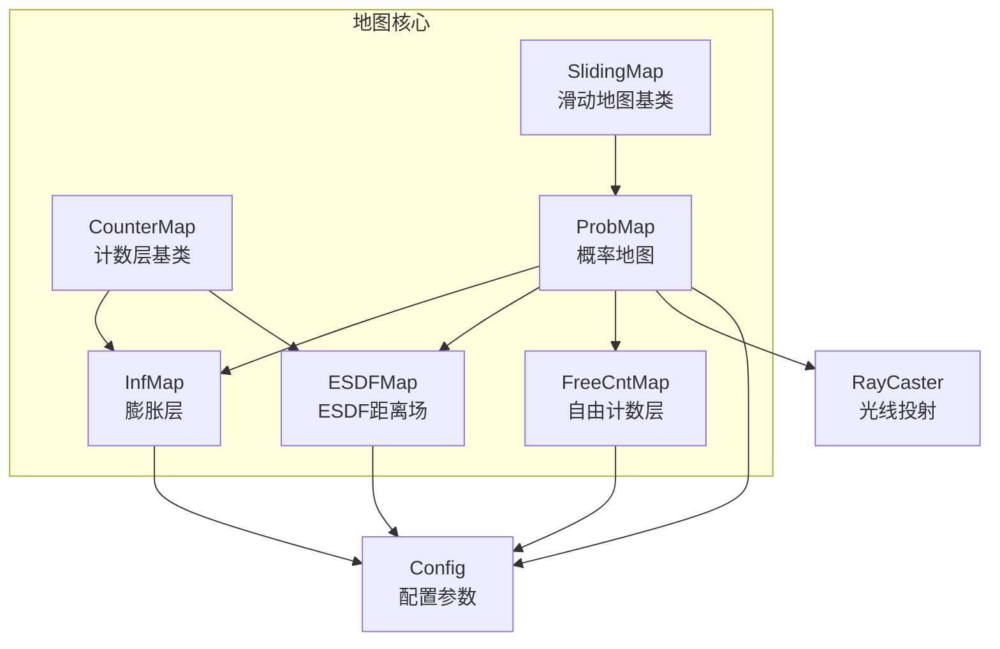
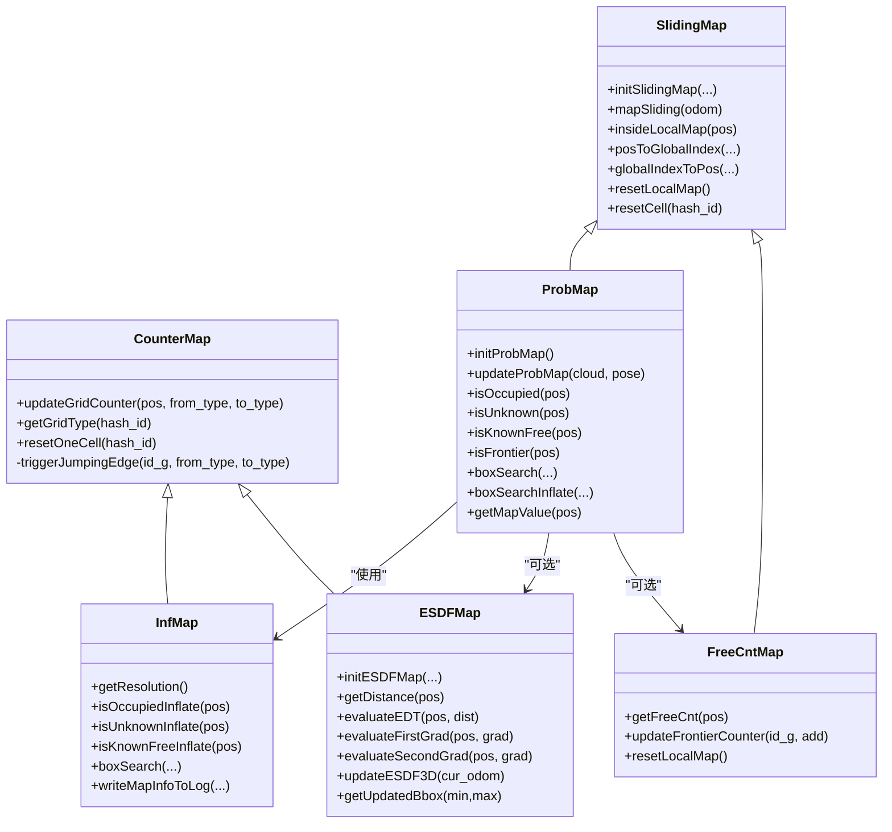
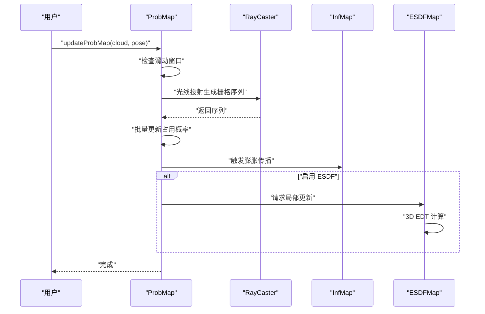
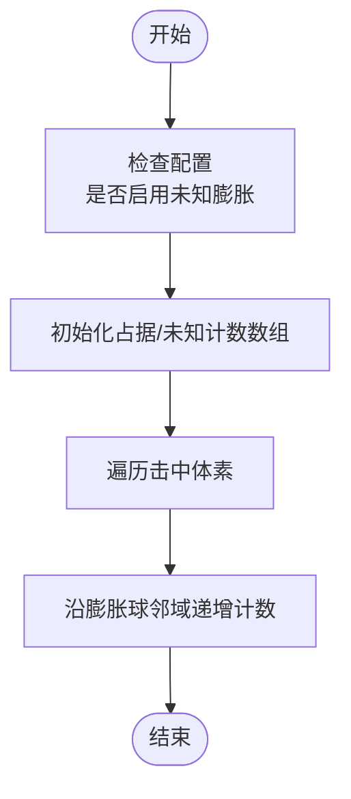
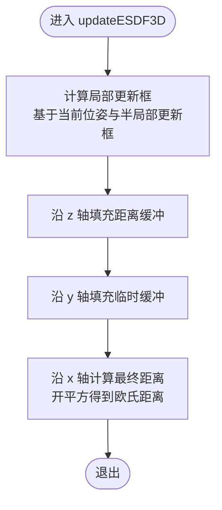
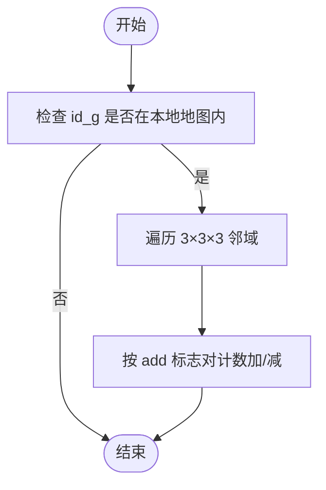
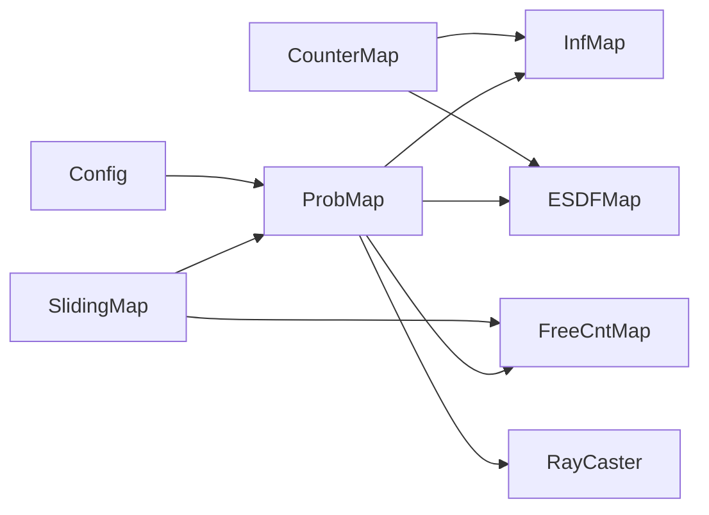

# 地图类型与实现

<cite>
**本文引用的文件**
- [rog_map.h](file://src/SUPER/rog_map/include/rog_map/rog_map.h)
- [prob_map.h](file://src/SUPER/rog_map/include/rog_map/prob_map.h)
- [esdf_map.h](file://src/SUPER/rog_map/include/rog_map/esdf_map.h)
- [free_cnt_map.h](file://src/SUPER/rog_map/include/rog_map/free_cnt_map.h)
- [inf_map.h](file://src/SUPER/rog_map/include/rog_map/inf_map.h)
- [counter_map.h](file://src/SUPER/rog_map/include/rog_map/rog_map_core/counter_map.h)
- [sliding_map.h](file://src/SUPER/rog_map/include/rog_map/rog_map_core/sliding_map.h)
- [raycaster.h](file://src/SUPER/rog_map/include/rog_map/rog_map_core/raycaster.h)
- [config.hpp](file://src/SUPER/rog_map/include/rog_map/rog_map_core/config.hpp)
- [API_REFERENCE.md](file://src/SUPER/rog_map/doc/API_REFERENCE.md)
- [CONFIGURATION.md](file://src/SUPER/rog_map/doc/CONFIGURATION.md)
- [prob_map.cpp](file://src/SUPER/rog_map/src/rog_map/prob_map.cpp)
- [esdf_map.cpp](file://src/SUPER/rog_map/src/rog_map/esdf_map.cpp)
- [inf_map.cpp](file://src/SUPER/rog_map/src/rog_map/inf_map.cpp)
</cite>

## 目录
1. [简介](#简介)
2. [项目结构](#项目结构)
3. [核心组件](#核心组件)
4. [架构总览](#架构总览)
5. [详细组件分析](#详细组件分析)
6. [依赖关系分析](#依赖关系分析)
7. [性能考量](#性能考量)
8. [故障排查指南](#故障排查指南)
9. [结论](#结论)
10. [附录](#附录)

## 简介
本文件面向 ROG 地图系统中的多种地图类型，提供全面技术文档。重点覆盖：
- ESDF（欧氏有符号距离场）地图的实现原理与应用，包括距离场计算与符号距离处理
- 概率地图的概率更新算法、占用栅格表示与不确定性建模
- 计数地图与自由计数地图的设计思路与计数机制
- 信息地图（InfMap）的实现，包括信息增益与自适应分辨率
- 各地图类型的 API 参考、构造与更新方法、查询接口与参数配置
- 地图类型之间的关系与协作机制
- 性能对比分析与使用场景建议

## 项目结构
ROG 地图系统以“分层地图”为核心思想，通过概率层、膨胀层、计数层与 ESDF 层协同工作，形成完整的 3D 占用栅格地图体系。

图表来源
- [sliding_map.h](file://src/SUPER/rog_map/include/rog_map/rog_map_core/sliding_map.h#L41-L141)
- [counter_map.h](file://src/SUPER/rog_map/include/rog_map/rog_map_core/counter_map.h#L34-L141)
- [prob_map.h](file://src/SUPER/rog_map/include/rog_map/prob_map.h#L38-L166)
- [inf_map.h](file://src/SUPER/rog_map/include/rog_map/inf_map.h#L30-L92)
- [esdf_map.h](file://src/SUPER/rog_map/include/rog_map/esdf_map.h#L32-L106)
- [free_cnt_map.h](file://src/SUPER/rog_map/include/rog_map/free_cnt_map.h#L33-L112)
- [raycaster.h](file://src/SUPER/rog_map/include/rog_map/rog_map_core/raycaster.h#L54-L93)
- [config.hpp](file://src/SUPER/rog_map/include/rog_map/rog_map_core/config.hpp#L50-L422)

章节来源
- [API_REFERENCE.md](file://src/SUPER/rog_map/doc/API_REFERENCE.md#L29-L70)

## 核心组件
- SlidingMap：提供 3D 索引、坐标转换、滑动窗口与内存管理等通用能力
- CounterMap：基于子网格计数的多层栅格抽象，定义“占用地形”的判定规则
- ProbMap：概率地图，负责点云更新、概率传播、盒子搜索、边界提取与 ESDF 更新
- InfMap：膨胀层，维护占据/未知的膨胀计数，提供膨胀查询与盒子搜索
- ESDFMap：ESDF 距离场，维护符号距离与局部更新框，提供距离查询与插值
- FreeCntMap：自由计数层，维护每个栅格周围自由体素的邻居计数，用于边界提取
- RayCaster：光线投射，沿线段生成栅格序列，支撑概率更新
- Config：统一配置加载与参数校验，决定地图尺寸、分辨率、膨胀策略与 ESDF 开关

章节来源
- [sliding_map.h](file://src/SUPER/rog_map/include/rog_map/rog_map_core/sliding_map.h#L41-L141)
- [counter_map.h](file://src/SUPER/rog_map/include/rog_map/rog_map_core/counter_map.h#L34-L141)
- [prob_map.h](file://src/SUPER/rog_map/include/rog_map/prob_map.h#L38-L166)
- [inf_map.h](file://src/SUPER/rog_map/include/rog_map/inf_map.h#L30-L92)
- [esdf_map.h](file://src/SUPER/rog_map/include/rog_map/esdf_map.h#L32-L106)
- [free_cnt_map.h](file://src/SUPER/rog_map/include/rog_map/free_cnt_map.h#L33-L112)
- [raycaster.h](file://src/SUPER/rog_map/include/rog_map/rog_map_core/raycaster.h#L54-L93)
- [config.hpp](file://src/SUPER/rog_map/include/rog_map/rog_map_core/config.hpp#L50-L422)

## 架构总览
ROG 地图系统采用“概率层 + 膨胀层 + 计数层 + ESDF 层”的分层设计，各层职责清晰、耦合度低，通过统一的配置与滑动窗口机制协同工作。

图表来源
- [sliding_map.h](file://src/SUPER/rog_map/include/rog_map/rog_map_core/sliding_map.h#L41-L141)
- [counter_map.h](file://src/SUPER/rog_map/include/rog_map/rog_map_core/counter_map.h#L34-L141)
- [prob_map.h](file://src/SUPER/rog_map/include/rog_map/prob_map.h#L38-L166)
- [inf_map.h](file://src/SUPER/rog_map/include/rog_map/inf_map.h#L30-L92)
- [esdf_map.h](file://src/SUPER/rog_map/include/rog_map/esdf_map.h#L32-L106)
- [free_cnt_map.h](file://src/SUPER/rog_map/include/rog_map/free_cnt_map.h#L33-L112)

## 详细组件分析

### 概率地图（ProbMap）
- 设计要点
  - 基于概率占用栅格，使用光线投射更新击中/未击中体素的概率
  - 通过阈值将概率映射为“已知自由/未知/占据”
  - 支持盒子搜索、边界提取与 ESDF 更新
- 关键流程
  - 初始化：建立滑动窗口、创建膨胀层、可选的自由计数层与 ESDF 层
  - 更新：根据当前位姿与点云执行光线投射，批量更新占用概率，触发膨胀传播，可选更新 ESDF
  - 查询：单点占用/未知/自由判断；盒子搜索；边界判断
- 数据结构与复杂度
  - 单点查询 O(1)，盒子搜索 O(M)，M 为盒子内体素数
- 相关接口（节选）
  - 初始化：initProbMap
  - 更新：updateProbMap
  - 查询：isOccupied/isUnknown/isKnownFree/isFrontier、boxSearch/boxSearchInflate、getMapValue
  - 配置：getMapConfig、getLocalMapOrigin/getLocalMapSize、getResolution/getInfResolution

图表来源
- [prob_map.cpp](file://src/SUPER/rog_map/src/rog_map/prob_map.cpp#L28-L91)
- [raycaster.h](file://src/SUPER/rog_map/include/rog_map/rog_map_core/raycaster.h#L54-L93)
- [inf_map.cpp](file://src/SUPER/rog_map/src/rog_map/inf_map.cpp#L188-L200)
- [esdf_map.cpp](file://src/SUPER/rog_map/src/rog_map/esdf_map.cpp#L80-L163)

章节来源
- [prob_map.h](file://src/SUPER/rog_map/include/rog_map/prob_map.h#L38-L166)
- [prob_map.cpp](file://src/SUPER/rog_map/src/rog_map/prob_map.cpp#L28-L91)
- [API_REFERENCE.md](file://src/SUPER/rog_map/doc/API_REFERENCE.md#L76-L114)

### 膨胀层（InfMap）
- 设计要点
  - 基于 CounterMap，维护占据/未知的膨胀计数，支持“未知膨胀”开关
  - 提供膨胀查询（占据/未知/已知自由）与盒子搜索
  - 统计膨胀次数与耗时，便于性能分析
- 关键流程
  - 初始化：根据配置构建膨胀球邻域，分配计数数组
  - 更新：对击中体素沿球邻域递增计数，支持未知膨胀
  - 查询：按计数阈值判断膨胀状态
- 数据结构与复杂度
  - 单点查询 O(1)，盒子搜索 O(V)，V 为搜索体积内的体素数
- 相关接口（节选）
  - 初始化：构造函数（接收 Config）
  - 查询：isOccupiedInflate/isUnknownInflate/isKnownFreeInflate、boxSearch
  - 统计：getInflationNumAndTime、writeMapInfoToLog
  - 坐标转换：infMapPosToGlobalIndex/infMapGlobalIndexToPos

图表来源
- [inf_map.cpp](file://src/SUPER/rog_map/src/rog_map/inf_map.cpp#L77-L109)
- [inf_map.cpp](file://src/SUPER/rog_map/src/rog_map/inf_map.cpp#L188-L200)
- [counter_map.h](file://src/SUPER/rog_map/include/rog_map/rog_map_core/counter_map.h#L34-L141)

章节来源
- [inf_map.h](file://src/SUPER/rog_map/include/rog_map/inf_map.h#L30-L92)
- [inf_map.cpp](file://src/SUPER/rog_map/src/rog_map/inf_map.cpp#L77-L109)
- [API_REFERENCE.md](file://src/SUPER/rog_map/doc/API_REFERENCE.md#L221-L243)

### ESDF 距离场（ESDFMap）
- 设计要点
  - 基于 CounterMap，维护每个栅格到障碍物的符号距离
  - 采用三轴顺序的 EDT（Euclidean Distance Transform）算法，先沿 z，再沿 y，最后沿 x
  - 维护局部更新框，仅对机器人附近区域进行更新，降低计算开销
- 关键流程
  - 初始化：设置 ESDF 分辨率、局部更新框，分配距离缓冲区
  - 更新：根据当前位姿确定局部更新范围，执行三轴 EDT 计算
  - 查询：提供距离与梯度插值，支持可视化输出正/负距离点云
- 数据结构与复杂度
  - 更新复杂度约 O(Lx × Ly × Lz)，L 为局部更新框尺寸
- 相关接口（节选）
  - 初始化：initESDFMap
  - 更新：updateESDF3D
  - 查询：getDistance、evaluateEDT/FirstGrad/SecondGrad
  - 可视化：getPositiveESDFPointCloud/getNegativeESDFPointCloud
  - 辅助：getUpdatedBbox/resetLocalMap

图表来源
- [esdf_map.cpp](file://src/SUPER/rog_map/src/rog_map/esdf_map.cpp#L80-L163)
- [esdf_map.cpp](file://src/SUPER/rog_map/src/rog_map/esdf_map.cpp#L164-L200)

章节来源
- [esdf_map.h](file://src/SUPER/rog_map/include/rog_map/esdf_map.h#L32-L106)
- [esdf_map.cpp](file://src/SUPER/rog_map/src/rog_map/esdf_map.cpp#L31-L58)
- [API_REFERENCE.md](file://src/SUPER/rog_map/doc/API_REFERENCE.md#L221-L243)

### 自由计数层（FreeCntMap）
- 设计要点
  - 维护每个栅格周围 3×3×3 邻域内的自由体素计数，用于边界提取
  - 当栅格为未知且其邻域存在自由体素时，判定为边界（Frontier）
- 关键流程
  - 初始化：按本地地图大小分配计数数组
  - 更新：对新增/移除的占据栅格，对其邻域计数进行加/减
  - 查询：返回指定位置的自由计数
- 数据结构与复杂度
  - 单点查询 O(1)，邻域更新 O(27)
- 相关接口（节选）
  - 初始化：构造函数（接收半地图尺寸、分辨率、滑动参数、固定原点）
  - 查询：getFreeCnt(pos/id_g)
  - 更新：updateFrontierCounter(id_g, add)
  - 清理：resetLocalMap/resetCell

图表来源
- [free_cnt_map.h](file://src/SUPER/rog_map/include/rog_map/free_cnt_map.h#L69-L97)

章节来源
- [free_cnt_map.h](file://src/SUPER/rog_map/include/rog_map/free_cnt_map.h#L33-L112)
- [API_REFERENCE.md](file://src/SUPER/rog_map/doc/API_REFERENCE.md#L221-L243)

### 计数层基类（CounterMap）
- 设计要点
  - 抽象出“子网格计数”的通用逻辑，定义“占用地形”的判定规则
  - 提供“未知阈值”控制：当未知子网格数量超过阈值则判定为未知
  - 通过虚函数接口与派生类协作，实现“跳跃边缘触发”
- 关键流程
  - 初始化：设置子网格数量、未知阈值、分辨率等
  - 更新：updateGridCounter(pos, from_type, to_type)
  - 判定：getGridType(hash_id)
- 相关接口（节选）
  - 初始化：initCounterMap
  - 更新：updateGridCounter
  - 判定：getGridType/isUnknown/isOccupied/isKnownFree
  - 抽象：triggerJumpingEdge/resetOneCell

章节来源
- [counter_map.h](file://src/SUPER/rog_map/include/rog_map/rog_map_core/counter_map.h#L34-L141)
- [API_REFERENCE.md](file://src/SUPER/rog_map/doc/API_REFERENCE.md#L221-L243)

### 滑动地图基类（SlidingMap）
- 设计要点
  - 提供 3D 坐标与索引之间的转换、本地地图边界管理与滑动窗口机制
  - 通过 resetCell/resetLocalMap 与派生类协作，保证滑动时的状态一致性
- 相关接口（节选）
  - 初始化：initSlidingMap
  - 滑动：mapSliding
  - 查询：insideLocalMap
  - 转换：posToGlobalIndex/globalIndexToPos/local/global 索引互转
  - 抽象：resetLocalMap/resetCell

章节来源
- [sliding_map.h](file://src/SUPER/rog_map/include/rog_map/rog_map_core/sliding_map.h#L41-L141)
- [API_REFERENCE.md](file://src/SUPER/rog_map/doc/API_REFERENCE.md#L261-L296)

### 光线投射（RayCaster）
- 设计要点
  - 实现沿线段的栅格化，支持步进与边界穿越
  - 提供索引与坐标的双向转换
- 相关接口（节选）
  - 设置分辨率：setResolution
  - 输入：setInput(start,end)
  - 步进：step(ray_pt)

章节来源
- [raycaster.h](file://src/SUPER/rog_map/include/rog_map/rog_map_core/raycaster.h#L54-L93)

### 配置（Config）
- 设计要点
  - 统一加载 YAML 配置，校验参数合法性
  - 计算膨胀层、概率层与 ESDF 层的尺寸与分辨率关系
  - 生成膨胀球邻域与最近邻搜索邻域
- 关键参数（节选）
  - 地图：resolution、inflation_resolution、map_size、map_sliding、fix_map_origin
  - 光线投射：raycasting_enable、ray_range、p_hit、p_miss、p_min、p_max、p_occ、p_free、batch_update_size、unk_thresh
  - 膨胀：inflation_step、unk_inflation_en、unk_inflation_step
  - ESDF：esdf_en、esdf_resolution、esdf_local_update_box
  - 可视化：visualization_enable、frame_id、range、time_rate、frame_rate、pub_unknown_map_en
  - ROS2：ros_callback_enable、cloud_topic、odom_topic、odom_timeout
  - 点云：point_filt_num、intensity_thresh、load_pcd_en、pcd_name

章节来源
- [config.hpp](file://src/SUPER/rog_map/include/rog_map/rog_map_core/config.hpp#L68-L288)
- [CONFIGURATION.md](file://src/SUPER/rog_map/doc/CONFIGURATION.md#L19-L334)

## 依赖关系分析
- 继承关系
  - SlidingMap ← ProbMap
  - SlidingMap ← FreeCntMap
  - CounterMap ← InfMap
  - CounterMap ← ESDFMap
- 组合关系
  - ProbMap 组合 InfMap、ESDFMap、FreeCntMap、RayCaster、Config
- 依赖方向
  - 上层（ProbMap/ROGMap）依赖下层（InfMap/ESDFMap/FreeCntMap）
  - 下层（InfMap/ESDFMap/FreeCntMap）依赖 CounterMap/SlidingMap
  - 所有层依赖 Config 进行参数配置

图表来源
- [prob_map.h](file://src/SUPER/rog_map/include/rog_map/prob_map.h#L38-L166)
- [inf_map.h](file://src/SUPER/rog_map/include/rog_map/inf_map.h#L30-L92)
- [esdf_map.h](file://src/SUPER/rog_map/include/rog_map/esdf_map.h#L32-L106)
- [free_cnt_map.h](file://src/SUPER/rog_map/include/rog_map/free_cnt_map.h#L33-L112)
- [counter_map.h](file://src/SUPER/rog_map/include/rog_map/rog_map_core/counter_map.h#L34-L141)
- [sliding_map.h](file://src/SUPER/rog_map/include/rog_map/rog_map_core/sliding_map.h#L41-L141)
- [raycaster.h](file://src/SUPER/rog_map/include/rog_map/rog_map_core/raycaster.h#L54-L93)
- [config.hpp](file://src/SUPER/rog_map/include/rog_map/rog_map_core/config.hpp#L50-L422)

章节来源
- [API_REFERENCE.md](file://src/SUPER/rog_map/doc/API_REFERENCE.md#L29-L70)

## 性能考量
- 时间复杂度
  - 单点查询：O(1)
  - 线段碰撞检测：O(N)，N 为沿线段的体素数
  - 盒子搜索：O(M)，M 为盒子内总体素数
  - 最近邻搜索：O(K³)，K 为搜索球的网格边长
  - 地图更新：O(P + O)，P 为点云大小，O 为膨胀计算
- 空间复杂度
  - 单地图：O(N³)，N 为半地图尺寸
  - 多层：概率图 + 膨胀层 + ESDF（可选）
- ESDF 开销
  - ESDF 计算约为总时间的 30%，按需启用
- 配置优化建议
  - 低延迟：增大分辨率、缩小地图、禁用 ESDF 与未知膨胀、降低批处理大小
  - 高精度：细化分辨率、启用 ESDF 与未知膨胀、增大地图、降低下采样

章节来源
- [API_REFERENCE.md](file://src/SUPER/rog_map/doc/API_REFERENCE.md#L512-L541)
- [CONFIGURATION.md](file://src/SUPER/rog_map/doc/CONFIGURATION.md#L244-L253)

## 故障排查指南
- 常见问题
  - 点云更新缓慢：增加 point_filt_num、降低 resolution、减小 map_size、关闭 esdf_en/unk_inflation_en
  - 未知膨胀未生效：确认配置中 unk_inflation_en 已开启
  - ESDF 导致卡顿：关闭 esdf_en 或增大 esdf_local_update_box
  - 滑动地图导致状态异常：检查 map_sliding.enable 与 threshold
- 调试手段
  - 启用日志：writeMapInfoToLog/writeTimeConsumingToLog
  - 可视化：订阅 rog_map/occ、rog_map/unk、rog_map/inf_occ、rog_map/map_bound
- 参数重载
  - 所有参数在节点启动时加载，修改需重启节点

章节来源
- [CONFIGURATION.md](file://src/SUPER/rog_map/doc/CONFIGURATION.md#L256-L334)
- [API_REFERENCE.md](file://src/SUPER/rog_map/doc/API_REFERENCE.md#L331-L405)

## 结论
ROG 地图系统通过概率层、膨胀层、计数层与 ESDF 层的协同，实现了高效率、可扩展的 3D 占用栅格地图。概率地图负责实时更新与查询，膨胀层提供安全边界，计数层支持边界提取，ESDF 层提供精确距离场。通过合理的配置与按需启用 ESDF，可在实时性与精度之间取得平衡。

## 附录

### API 参考（概览）
- ProbMap
  - 初始化：initProbMap
  - 更新：updateProbMap
  - 查询：isOccupied/isUnknown/isKnownFree/isFrontier、boxSearch/boxSearchInflate、getMapValue
  - 配置：getMapConfig/getLocalMapOrigin/getLocalMapSize/getResolution/getInfResolution
- ROGMap（继承 ProbMap）
  - 线段自由检测：isLineFree（三种变体）
  - 最近邻搜索：getNearestCellIs/Not、getNearestInfCellIs/Not
  - 坐标转换：probMapPosToGlobalIndex/probMapGlobalIndexToPos、infMapPosToGlobalIndex/infMapGlobalIndexToPos
- InfMap
  - 查询：isOccupiedInflate/isUnknownInflate/isKnownFreeInflate、boxSearch
  - 统计：getInflationNumAndTime、writeMapInfoToLog
  - 分辨率：getResolution
- ESDFMap
  - 初始化：initESDFMap
  - 更新：updateESDF3D
  - 查询：getDistance、evaluateEDT/FirstGrad/SecondGrad
  - 可视化：getPositiveESDFPointCloud/getNegativeESDFPointCloud
  - 辅助：getUpdatedBbox/resetLocalMap
- FreeCntMap
  - 查询：getFreeCnt(pos/id_g)
  - 更新：updateFrontierCounter(id_g, add)
  - 清理：resetLocalMap/resetCell

章节来源
- [API_REFERENCE.md](file://src/SUPER/rog_map/doc/API_REFERENCE.md#L74-L573)