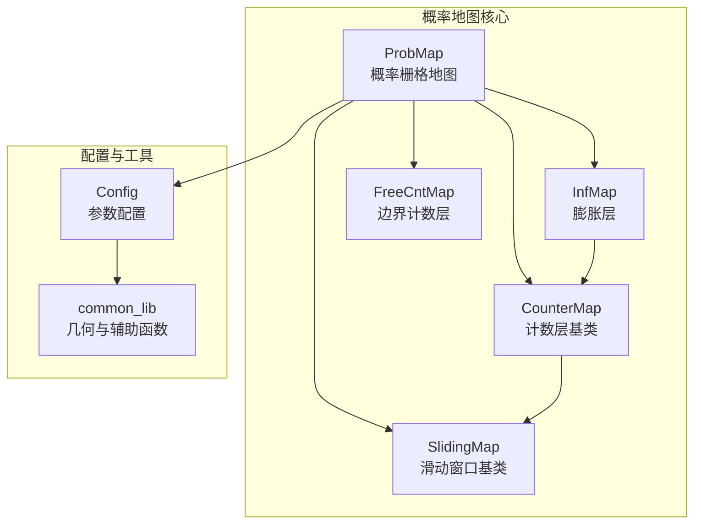
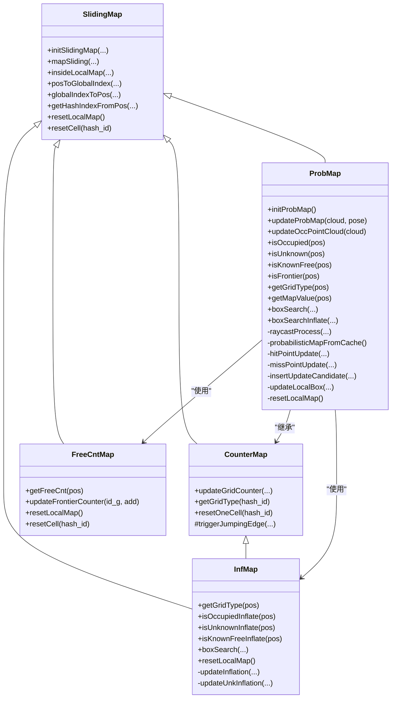
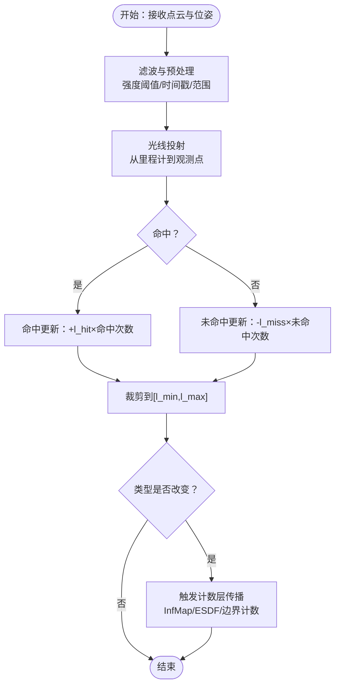
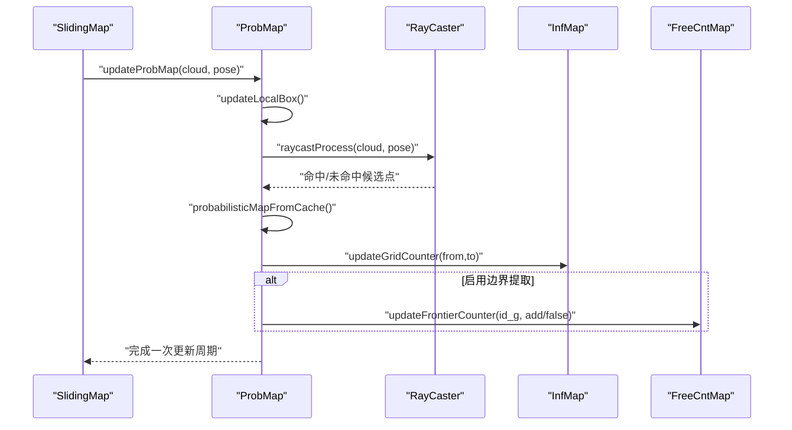
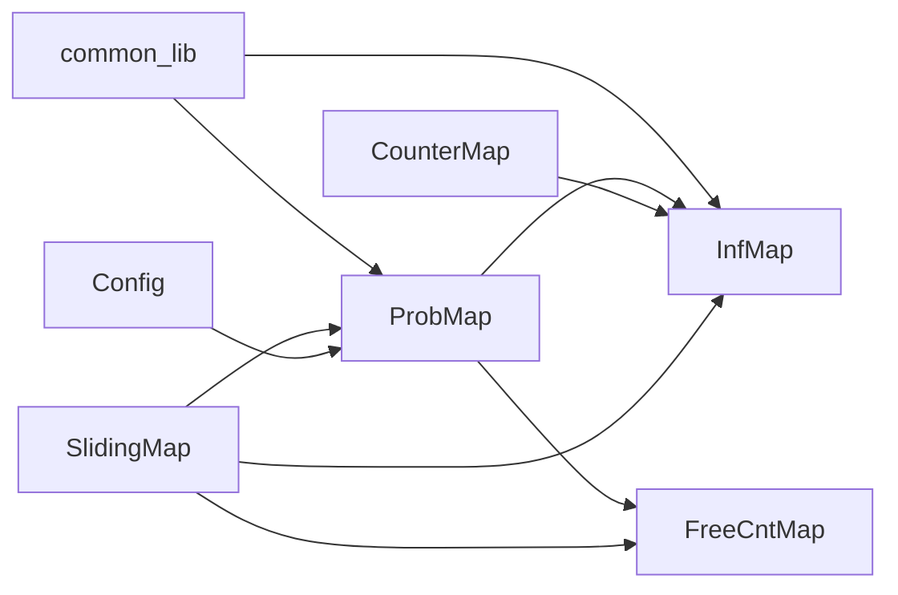

# 概率地图实现

<cite>
**本文引用的文件**
- [prob_map.h](file://src/SUPER/rog_map/include/rog_map/prob_map.h)
- [prob_map.cpp](file://src/SUPER/rog_map/src/rog_map/prob_map.cpp)
- [API_REFERENCE.md](file://src/SUPER/rog_map/doc/API_REFERENCE.md)
- [config.hpp](file://src/SUPER/rog_map/include/rog_map/rog_map_core/config.hpp)
- [common_lib.hpp](file://src/SUPER/rog_map/include/rog_map/rog_map_core/common_lib.hpp)
- [sliding_map.h](file://src/SUPER/rog_map/include/rog_map/rog_map_core/sliding_map.h)
- [counter_map.h](file://src/SUPER/rog_map/include/rog_map/rog_map_core/counter_map.h)
- [inf_map.h](file://src/SUPER/rog_map/include/rog_map/inf_map.h)
- [free_cnt_map.h](file://src/SUPER/rog_map/include/rog_map/free_cnt_map.h)
- [rog_map.h](file://src/SUPER/rog_map/include/rog_map/rog_map.h)
</cite>

## 目录
1. [简介](#简介)
2. [项目结构](#项目结构)
3. [核心组件](#核心组件)
4. [架构总览](#架构总览)
5. [详细组件分析](#详细组件分析)
6. [依赖关系分析](#依赖关系分析)
7. [性能考量](#性能考量)
8. [故障排查指南](#故障排查指南)
9. [结论](#结论)
10. [附录](#附录)

## 简介
本文件面向概率地图系统（ProbMap）的技术文档，围绕概率模型基础、贝叶斯更新规则、概率传播机制、与计数地图的协作、查询接口、未知区域处理、初始化配置与参数调优、实际应用示例与最佳实践，以及在路径规划中的作用进行系统化阐述。内容基于 ROG-Map 源码与官方 API 文档整理而成，力求兼顾工程实现细节与非专业读者的理解。

## 项目结构
概率地图模块位于 SUPER/rog_map 子项目中，核心文件组织如下：
- include/rog_map：对外公开的头文件，定义 ProbMap、InfMap、CounterMap、FreeCntMap、SlidingMap 等类及配置结构
- src/rog_map：ProbMap 的具体实现，包含概率更新、光线投射、缓存批量更新、边界与膨胀传播等逻辑
- doc/API_REFERENCE.md：官方 API 参考与使用示例
- include/rog_map/rog_map_core：通用核心组件（配置、滑动地图、计数地图等）

**图表来源**
- [prob_map.h](file://src/SUPER/rog_map/include/rog_map/prob_map.h#L38-L166)
- [inf_map.h](file://src/SUPER/rog_map/include/rog_map/inf_map.h#L30-L92)
- [counter_map.h](file://src/SUPER/rog_map/include/rog_map/rog_map_core/counter_map.h#L34-L141)
- [free_cnt_map.h](file://src/SUPER/rog_map/include/rog_map/free_cnt_map.h#L33-L112)
- [sliding_map.h](file://src/SUPER/rog_map/include/rog_map/rog_map_core/sliding_map.h#L41-L141)
- [config.hpp](file://src/SUPER/rog_map/include/rog_map/rog_map_core/config.hpp#L50-L422)
- [common_lib.hpp](file://src/SUPER/rog_map/include/rog_map/rog_map_core/common_lib.hpp#L41-L157)

**章节来源**
- [prob_map.h](file://src/SUPER/rog_map/include/rog_map/prob_map.h#L38-L166)
- [API_REFERENCE.md](file://src/SUPER/rog_map/doc/API_REFERENCE.md#L76-L114)

## 核心组件
- ProbMap：概率栅格地图的核心类，负责占用概率的存储与更新、查询接口、与膨胀层和边界计数层的联动
- InfMap：基于计数的地图层，维护膨胀传播与查询
- CounterMap：计数层基类，抽象“已占/未知”计数逻辑
- FreeCntMap：边界（前沿）计数层，统计未知格子周围自由格子数量以识别边界
- SlidingMap：滑动窗口地图基类，提供坐标变换、索引映射、内存清理与滑动逻辑
- Config：参数配置类，集中管理分辨率、阈值、射线范围、批量更新等参数，并完成 logit 映射

**章节来源**
- [prob_map.h](file://src/SUPER/rog_map/include/rog_map/prob_map.h#L38-L166)
- [inf_map.h](file://src/SUPER/rog_map/include/rog_map/inf_map.h#L30-L92)
- [counter_map.h](file://src/SUPER/rog_map/include/rog_map/rog_map_core/counter_map.h#L34-L141)
- [free_cnt_map.h](file://src/SUPER/rog_map/include/rog_map/free_cnt_map.h#L33-L112)
- [sliding_map.h](file://src/SUPER/rog_map/include/rog_map/rog_map_core/sliding_map.h#L41-L141)
- [config.hpp](file://src/SUPER/rog_map/include/rog_map/rog_map_core/config.hpp#L50-L422)

## 架构总览
ProbMap 继承自 SlidingMap，组合 InfMap、FreeCntMap、ESDFMap（按需），并通过光线投射（Raycasting）将传感器观测转化为概率更新，再通过计数层触发膨胀传播与边界提取。

**图表来源**
- [prob_map.h](file://src/SUPER/rog_map/include/rog_map/prob_map.h#L38-L166)
- [inf_map.h](file://src/SUPER/rog_map/include/rog_map/inf_map.h#L30-L92)
- [counter_map.h](file://src/SUPER/rog_map/include/rog_map/rog_map_core/counter_map.h#L34-L141)
- [free_cnt_map.h](file://src/SUPER/rog_map/include/rog_map/free_cnt_map.h#L33-L112)
- [sliding_map.h](file://src/SUPER/rog_map/include/rog_map/rog_map_core/sliding_map.h#L41-L141)

## 详细组件分析

### 概率模型基础与贝叶斯更新
- 概率表示：每个栅格单元存储占用概率值（范围标准化至 0-1），内部使用 logit 空间进行加法更新，避免直接在概率空间累加导致的数值不稳定
- 阈值划分：通过 l_free 与 l_occ 对 logit 空间进行分界，映射到概率空间后形成 KNOWN_FREE、UNKNOWN、OCCUPIED 三类
- 观测模型：
  - 命中（hit）：激光命中障碍物，概率增加 l_hit
  - 未命中（miss）：自由空间射线穿越，概率减少 l_miss
- 先验约束：概率值被裁剪到 [l_min, l_max] 区间，确保数值稳定

**图表来源**
- [prob_map.cpp](file://src/SUPER/rog_map/src/rog_map/prob_map.cpp#L672-L793)
- [prob_map.cpp](file://src/SUPER/rog_map/src/rog_map/prob_map.cpp#L576-L670)
- [config.hpp](file://src/SUPER/rog_map/include/rog_map/rog_map_core/config.hpp#L216-L237)

**章节来源**
- [config.hpp](file://src/SUPER/rog_map/include/rog_map/rog_map_core/config.hpp#L216-L237)
- [prob_map.cpp](file://src/SUPER/rog_map/src/rog_map/prob_map.cpp#L576-L670)
- [API_REFERENCE.md](file://src/SUPER/rog_map/doc/API_REFERENCE.md#L512-L528)

### ProbMap 实现原理
- 存储格式：occupancy_buffer_ 为一维数组，元素为 logit 空间的概率值；通过哈希索引快速定位
- 查询接口：
  - isOccupied/isUnknown/isKnownFree：支持世界坐标与全局索引两种形式
  - getGridType/getInfGridType：返回占用/未知/自由/边界/越界等枚举
  - getMapValue：返回 logit 空间内的概率值
  - boxSearch/boxSearchInflate：在盒子范围内检索特定类型的体素
- 更新流程：
  - updateProbMap：检查滑动、更新局部更新框、执行光线投射、批量缓存更新、触发膨胀与 ESDF 更新
  - raycastProcess：根据配置决定是否启用射线投射，生成命中与未命中的候选点
  - probabilisticMapFromCache：从缓存批量应用更新，避免逐点更新的开销
  - hitPointUpdate/missPointUpdate：在 logit 空间累加并触发类型变化传播

**图表来源**
- [prob_map.cpp](file://src/SUPER/rog_map/src/rog_map/prob_map.cpp#L308-L375)
- [prob_map.cpp](file://src/SUPER/rog_map/src/rog_map/prob_map.cpp#L672-L793)
- [prob_map.cpp](file://src/SUPER/rog_map/src/rog_map/prob_map.cpp#L550-L574)

**章节来源**
- [prob_map.h](file://src/SUPER/rog_map/include/rog_map/prob_map.h#L38-L166)
- [prob_map.cpp](file://src/SUPER/rog_map/src/rog_map/prob_map.cpp#L308-L375)
- [prob_map.cpp](file://src/SUPER/rog_map/src/rog_map/prob_map.cpp#L550-L574)

### 概率更新算法与传播机制
- 传感器观测模型：命中（hit）与未命中（miss）分别对应概率增加与减少
- 先验概率更新：每次更新后裁剪到 [l_min, l_max]，防止概率饱和或过拟合
- 类型变化传播：当 logit 值跨越 l_occ 或 l_free 时，触发 InfMap 与 ESDF 的计数更新，同时 FreeCntMap 对边界计数进行增减
- 批量更新：通过缓存队列聚合同一栅格的命中/未命中次数，降低重复计算

**章节来源**
- [prob_map.cpp](file://src/SUPER/rog_map/src/rog_map/prob_map.cpp#L576-L670)
- [prob_map.cpp](file://src/SUPER/rog_map/src/rog_map/prob_map.cpp#L517-L548)

### 概率地图与计数地图的协作
- InfMap：基于 CounterMap，维护“已占/未知”计数，实现膨胀传播与查询
- FreeCntMap：统计未知格子周围自由格子数量，用于边界（前沿）提取
- ESDFMap：按需启用，提供 3D 距离场，与概率地图协同用于安全距离评估

**章节来源**
- [inf_map.h](file://src/SUPER/rog_map/include/rog_map/inf_map.h#L30-L92)
- [counter_map.h](file://src/SUPER/rog_map/include/rog_map/rog_map_core/counter_map.h#L34-L141)
- [free_cnt_map.h](file://src/SUPER/rog_map/include/rog_map/free_cnt_map.h#L33-L112)
- [config.hpp](file://src/SUPER/rog_map/include/rog_map/rog_map_core/config.hpp#L290-L294)

### 概率查询接口详解
- 单点查询
  - isOccupied/isUnknown/isKnownFree：支持 Vec3f 与 Vec3i 输入
  - isOccupiedInflate/isUnknownInflate/isKnownFreeInflate：膨胀层查询
  - getGridType/getInfGridType：返回枚举类型
  - getMapValue：返回 logit 空间内的概率值
- 盒子搜索
  - boxSearch：在指定范围内搜索 OCCUPIED/UNKNOWN/FRONTIER
  - boxSearchInflate：膨胀层盒子搜索
- 边界查询
  - isFrontier：结合 FreeCntMap 判断未知区域的边界

**章节来源**
- [prob_map.h](file://src/SUPER/rog_map/include/rog_map/prob_map.h#L49-L101)
- [API_REFERENCE.md](file://src/SUPER/rog_map/doc/API_REFERENCE.md#L80-L143)

### 未知区域处理与不确定性建模
- 虚拟地面与天花板：通过 virtual_ground_height 与 virtual_ceil_height 限制 z 范围，超出范围默认视为占用
- 未知阈值：unk_thresh 控制计数层中未知子格比例，决定栅格是否为 UNKNOWN
- 第一帧清理：首次更新时对机器人周围球形区域执行 miss 更新，消除初始未知

**章节来源**
- [prob_map.cpp](file://src/SUPER/rog_map/src/rog_map/prob_map.cpp#L102-L134)
- [prob_map.cpp](file://src/SUPER/rog_map/src/rog_map/prob_map.cpp#L358-L374)
- [config.hpp](file://src/SUPER/rog_map/include/rog_map/rog_map_core/config.hpp#L216-L237)

### 初始化配置与参数调优
- 关键参数
  - 分辨率与地图尺寸：resolution、map_size、half_map_size_i
  - 射线投射：raycasting_en、raycast_range_min/max、local_update_box
  - 概率更新：p_hit/p_miss、p_min/p_max、p_occ/p_free、l_hit/l_miss/l_min/l_max
  - 批量更新：batch_update_size、point_filt_num
  - 膨胀与边界：inflation_step、frontier_extraction_en、esdf_en
- 调优建议
  - 提高分辨率会提升精度但增加计算与内存；合理设置 local_update_box 与 batch_update_size 平衡实时性
  - 若场景存在强遮挡，适当增大 p_hit 与 p_miss 的差异，增强区分度
  - ESDF 与边界提取会带来额外开销，仅在需要时启用

**章节来源**
- [config.hpp](file://src/SUPER/rog_map/include/rog_map/rog_map_core/config.hpp#L143-L288)
- [API_REFERENCE.md](file://src/SUPER/rog_map/doc/API_REFERENCE.md#L529-L540)

### 实际应用场景与最佳实践
- 自主导航：使用 isLineFree 进行线段碰撞检测，结合膨胀层进行安全距离评估
- 探索任务：利用 isFrontier 与 boxSearch 获取边界点，指导探索方向
- 路径规划：结合 ESDF（如启用）与膨胀层，生成安全轨迹并规避未知区域

**章节来源**
- [API_REFERENCE.md](file://src/SUPER/rog_map/doc/API_REFERENCE.md#L408-L510)

### 概率地图在路径规划中的作用
- 占据/未知判定：为 A*、Dijkstra 等离散搜索提供栅格语义
- 安全裕度：通过膨胀层与未知区域处理，避免进入潜在危险区域
- 实时性：滑动窗口与批量更新保证高频更新下的低延迟

**章节来源**
- [rog_map.h](file://src/SUPER/rog_map/include/rog_map/rog_map.h#L59-L93)
- [API_REFERENCE.md](file://src/SUPER/rog_map/doc/API_REFERENCE.md#L512-L528)

## 依赖关系分析
- 继承关系：ProbMap 继承 SlidingMap；InfMap、FreeCntMap 继承 SlidingMap；CounterMap 继承 SlidingMap 并被 InfMap 继承
- 组合关系：ProbMap 组合 InfMap、FreeCntMap、ESDFMap（按需），并通过 Config 管理参数
- 工具函数：common_lib 提供几何与辅助函数（如线盒相交、路径长度计算）

**图表来源**
- [prob_map.h](file://src/SUPER/rog_map/include/rog_map/prob_map.h#L38-L166)
- [inf_map.h](file://src/SUPER/rog_map/include/rog_map/inf_map.h#L30-L92)
- [counter_map.h](file://src/SUPER/rog_map/include/rog_map/rog_map_core/counter_map.h#L34-L141)
- [free_cnt_map.h](file://src/SUPER/rog_map/include/rog_map/free_cnt_map.h#L33-L112)
- [sliding_map.h](file://src/SUPER/rog_map/include/rog_map/rog_map_core/sliding_map.h#L41-L141)
- [config.hpp](file://src/SUPER/rog_map/include/rog_map/rog_map_core/config.hpp#L50-L422)
- [common_lib.hpp](file://src/SUPER/rog_map/include/rog_map/rog_map_core/common_lib.hpp#L41-L157)

**章节来源**
- [prob_map.h](file://src/SUPER/rog_map/include/rog_map/prob_map.h#L38-L166)
- [inf_map.h](file://src/SUPER/rog_map/include/rog_map/inf_map.h#L30-L92)
- [counter_map.h](file://src/SUPER/rog_map/include/rog_map/rog_map_core/counter_map.h#L34-L141)
- [free_cnt_map.h](file://src/SUPER/rog_map/include/rog_map/free_cnt_map.h#L33-L112)
- [sliding_map.h](file://src/SUPER/rog_map/include/rog_map/rog_map_core/sliding_map.h#L41-L141)
- [config.hpp](file://src/SUPER/rog_map/include/rog_map/rog_map_core/config.hpp#L50-L422)
- [common_lib.hpp](file://src/SUPER/rog_map/include/rog_map/rog_map_core/common_lib.hpp#L41-L157)

## 性能考量
- 单点查询：O(1)，基于哈希索引直接访问
- 线段碰撞检测：O(N)，N 为沿线段的体素数
- 盒子搜索：O(M)，M 为盒子内总体素数
- 最近邻搜索：O(K³)，K 为搜索球的网格边长
- 地图更新：O(P + O)，P 为点云大小，O 为膨胀计算

**章节来源**
- [API_REFERENCE.md](file://src/SUPER/rog_map/doc/API_REFERENCE.md#L512-L528)

## 故障排查指南
- 地图越界：insideLocalMap 检查失败时返回默认值，确认位姿与虚拟地面/天花板设置
- 滑动异常：map_sliding_en 与 map_sliding_thresh 设置不当会导致频繁滑动，建议根据场景调整
- 参数不合法：resolution 与 inflation_resolution 的关系、map_size 维度必须为 3，否则抛出异常
- 边界计数溢出：FreeCntMap 的邻居计数在增减时有边界检查，若出现溢出需检查更新逻辑

**章节来源**
- [prob_map.cpp](file://src/SUPER/rog_map/src/rog_map/prob_map.cpp#L102-L134)
- [config.hpp](file://src/SUPER/rog_map/include/rog_map/rog_map_core/config.hpp#L106-L113)
- [free_cnt_map.h](file://src/SUPER/rog_map/include/rog_map/free_cnt_map.h#L69-L97)

## 结论
ProbMap 通过 logit 空间的概率更新、光线投射与计数层传播，实现了高效的 3D 占用栅格地图构建与维护。配合 InfMap、FreeCntMap 与可选的 ESDF，系统在不确定性建模、边界提取与安全距离评估方面具备良好表现。合理配置参数与遵循最佳实践，可在多旋翼无人机等高速场景中获得稳定的实时性能。

## 附录
- 使用示例与 API 参考请参见官方文档：[API_REFERENCE.md](file://src/SUPER/rog_map/doc/API_REFERENCE.md#L408-L510)
- 几何与辅助函数参考：[common_lib.hpp](file://src/SUPER/rog_map/include/rog_map/rog_map_core/common_lib.hpp#L80-L153)