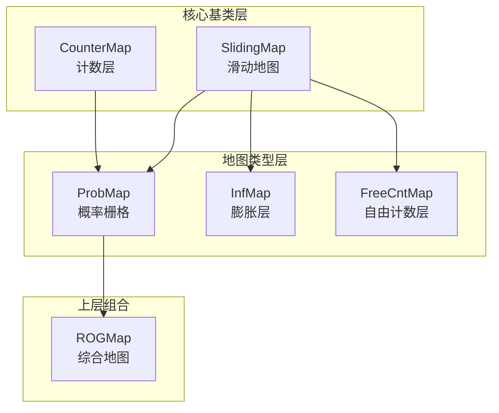
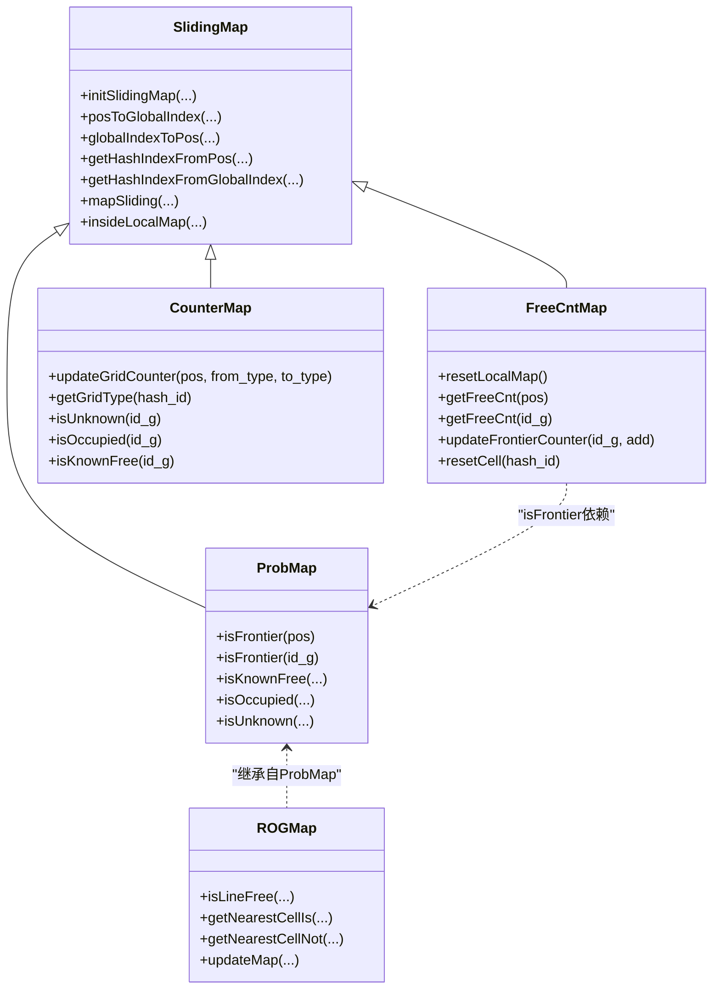
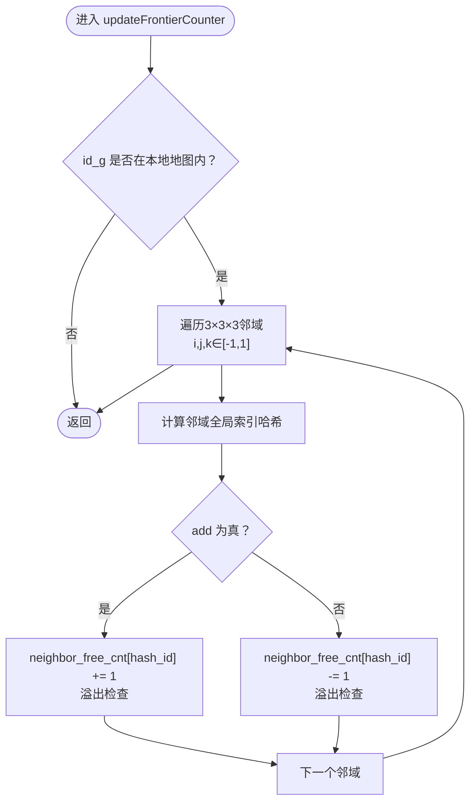
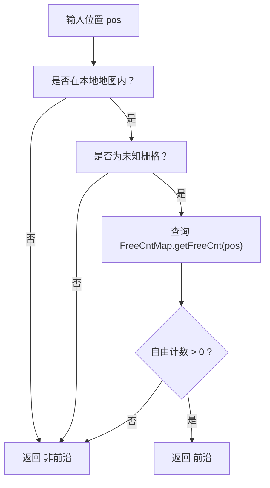
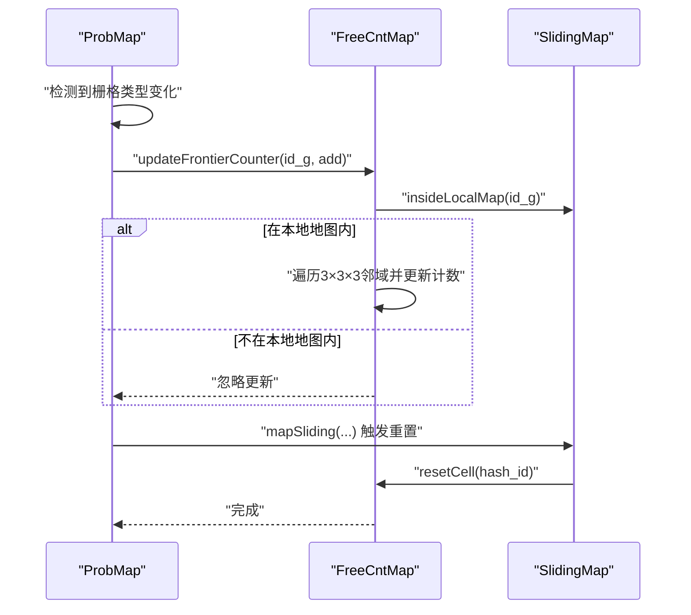
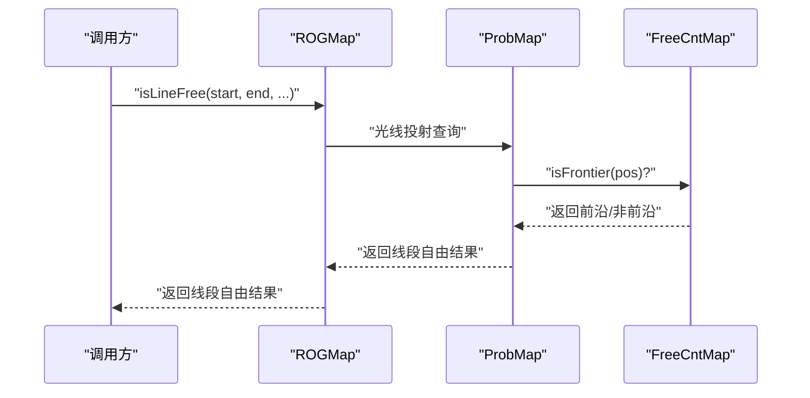
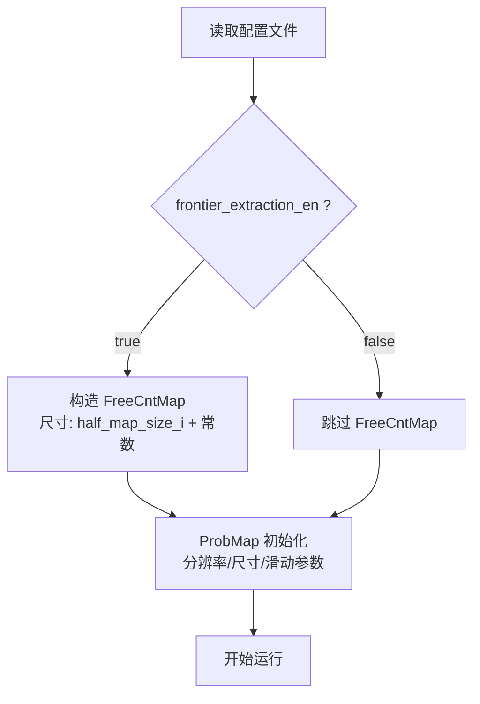
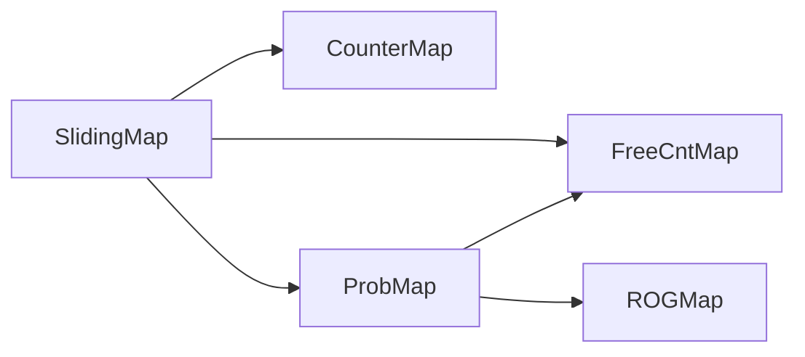

# 自由计数地图实现

<cite>
**本文引用的文件**
- [free_cnt_map.h](file://src/SUPER/rog_map/include/rog_map/free_cnt_map.h)
- [rog_map.h](file://src/SUPER/rog_map/include/rog_map/rog_map.h)
- [counter_map.h](file://src/SUPER/rog_map/include/rog_map/rog_map_core/counter_map.h)
- [sliding_map.h](file://src/SUPER/rog_map/include/rog_map/rog_map_core/sliding_map.h)
- [config.hpp](file://src/SUPER/rog_map/include/rog_map/rog_map_core/config.hpp)
- [prob_map.cpp](file://src/SUPER/rog_map/src/rog_map/prob_map.cpp)
- [rog_map.cpp](file://src/SUPER/rog_map/src/rog_map/rog_map.cpp)
- [CONFIGURATION.md](file://src/SUPER/rog_map/doc/CONFIGURATION.md)
</cite>

## 目录
1. [简介](#简介)
2. [项目结构](#项目结构)
3. [核心组件](#核心组件)
4. [架构总览](#架构总览)
5. [详细组件分析](#详细组件分析)
6. [依赖关系分析](#依赖关系分析)
7. [性能考量](#性能考量)
8. [故障排查指南](#故障排查指南)
9. [结论](#结论)
10. [附录](#附录)

## 简介
本技术文档聚焦于自由计数地图（FreeCntMap）的设计理念与实现细节，系统阐述其如何通过“自由计数”与“占用计数”的分离设计，实现对自由空间与边界（前沿）的高效判别；并结合ROG-Map整体架构，解释自由计数更新策略、查询接口、初始化配置与参数调优、在复杂环境中的鲁棒性，以及在实时路径规划中的应用与性能表现。

## 项目结构
自由计数地图位于ROG-Map的“rog_map”模块中，采用分层架构：
- 核心基类层：SlidingMap（滑动地图）、CounterMap（计数层）
- 地图类型层：ProbMap（概率栅格）、InfMap（膨胀层）、FreeCntMap（自由计数层）
- 上层组合：ROGMap（综合地图与查询接口）

**图表来源**
- [sliding_map.h](file://src/SUPER/rog_map/include/rog_map/rog_map_core/sliding_map.h#L41-L141)
- [counter_map.h](file://src/SUPER/rog_map/include/rog_map/rog_map_core/counter_map.h#L34-L141)
- [free_cnt_map.h](file://src/SUPER/rog_map/include/rog_map/free_cnt_map.h#L33-L112)
- [rog_map.h](file://src/SUPER/rog_map/include/rog_map/rog_map.h#L39-L131)

**章节来源**
- [sliding_map.h](file://src/SUPER/rog_map/include/rog_map/rog_map_core/sliding_map.h#L41-L141)
- [counter_map.h](file://src/SUPER/rog_map/include/rog_map/rog_map_core/counter_map.h#L34-L141)
- [free_cnt_map.h](file://src/SUPER/rog_map/include/rog_map/free_cnt_map.h#L33-L112)
- [rog_map.h](file://src/SUPER/rog_map/include/rog_map/rog_map.h#L39-L131)

## 核心组件
- FreeCntMap：独立的自由计数层，维护每个栅格的“邻居中自由单元数量”，用于前沿检测与自由空间判定。
- SlidingMap：提供坐标转换、索引映射、滑动窗口与内存管理能力。
- CounterMap：通用计数层基类，定义“占用/未知计数+阈值”的网格类型判定逻辑。
- ProbMap：概率栅格层，负责占用/未知/已知自由的判定，并在frontier_extraction_en开启时与FreeCntMap协作。
- ROGMap：对外统一接口，提供线段自由检测、最近邻搜索等高层功能。

**章节来源**
- [free_cnt_map.h](file://src/SUPER/rog_map/include/rog_map/free_cnt_map.h#L33-L112)
- [sliding_map.h](file://src/SUPER/rog_map/include/rog_map/rog_map_core/sliding_map.h#L41-L141)
- [counter_map.h](file://src/SUPER/rog_map/include/rog_map/rog_map_core/counter_map.h#L34-L141)
- [rog_map.h](file://src/SUPER/rog_map/include/rog_map/rog_map.h#L39-L131)

## 架构总览
自由计数地图在ROG-Map中的位置与交互如下：

**图表来源**
- [sliding_map.h](file://src/SUPER/rog_map/include/rog_map/rog_map_core/sliding_map.h#L41-L141)
- [free_cnt_map.h](file://src/SUPER/rog_map/include/rog_map/free_cnt_map.h#L33-L112)
- [counter_map.h](file://src/SUPER/rog_map/include/rog_map/rog_map_core/counter_map.h#L34-L141)
- [rog_map.h](file://src/SUPER/rog_map/include/rog_map/rog_map.h#L39-L131)

## 详细组件分析

### FreeCntMap 设计与实现
- 组件职责
  - 维护每个栅格的“邻居中自由单元数量”（neighbor_free_cnt），用于前沿检测与自由区域判定。
  - 支持滑动窗口（SlidingMap）下的坐标转换与内存管理。
- 数据结构
  - neighbor_free_cnt：一维数组，存储每个栅格的自由计数，类型为int16_t，避免过大内存开销。
- 关键方法
  - getFreeCnt(pos/id_g)：查询指定位置的自由计数。
  - updateFrontierCounter(id_g, add)：对给定栅格及其3×3×3邻域执行+1或-1操作，实现“前沿计数”的传播更新。
  - resetLocalMap()/resetCell(hash_id)：清零计数，保证滑动窗口移出区域时的正确性。
- 计数范围保护
  - 在+1/-1过程中进行溢出检查，防止异常计数导致误判。

**图表来源**
- [free_cnt_map.h](file://src/SUPER/rog_map/include/rog_map/free_cnt_map.h#L69-L97)

**章节来源**
- [free_cnt_map.h](file://src/SUPER/rog_map/include/rog_map/free_cnt_map.h#L33-L112)

### 自由空间检测算法与前沿判定
- 前沿判定流程
  - 若某栅格为未知，则进一步检查其自由计数是否大于0；若大于0，则认为该栅格处于“已知-未知”边界，即前沿。
- 自由区域判定
  - 自由计数越大，表示该栅格周围越多自由单元，越可能属于自由空间的一部分。
- 与概率栅格的集成
  - ProbMap在isFrontier中先判断未知，再查询FreeCntMap的自由计数，二者共同决定前沿。

**图表来源**
- [prob_map.cpp](file://src/SUPER/rog_map/src/rog_map/prob_map.cpp#L136-L155)

**章节来源**
- [prob_map.cpp](file://src/SUPER/rog_map/src/rog_map/prob_map.cpp#L136-L207)

### 自由计数更新策略
- 更新触发
  - 当概率栅格发生类型变化（例如从未知变为已知自由）时，会触发前沿计数的传播更新。
- 更新规则
  - 对涉及的栅格及其3×3×3邻域进行+1或-1操作，确保前沿计数随占用/未知状态变化而传播。
- 与滑动窗口的关系
  - 滑动窗口移出区域时，FreeCntMap会重置对应栅格计数，避免残留历史信息影响前沿判定。

**图表来源**
- [free_cnt_map.h](file://src/SUPER/rog_map/include/rog_map/free_cnt_map.h#L69-L101)
- [sliding_map.h](file://src/SUPER/rog_map/include/rog_map/rog_map_core/sliding_map.h#L63-L100)

**章节来源**
- [free_cnt_map.h](file://src/SUPER/rog_map/include/rog_map/free_cnt_map.h#L69-L101)
- [sliding_map.h](file://src/SUPER/rog_map/include/rog_map/rog_map_core/sliding_map.h#L63-L100)

### 查询接口与使用方法
- isFrontier(pos/id_g)
  - 输入：世界坐标或全局索引
  - 返回：是否为前沿
  - 实现要点：先判断未知，再查询FreeCntMap自由计数
- getFreeCnt(pos/id_g)
  - 输入：世界坐标或全局索引
  - 返回：自由计数（整型）
  - 用途：前沿判定、自由区域评估
- isLineFree(start, end, ...)
  - 输入：起点、终点、可选参数（是否使用膨胀层、是否将未知视为占用等）
  - 返回：线段是否自由
  - 用途：路径规划中的碰撞检测

**图表来源**
- [rog_map.cpp](file://src/SUPER/rog_map/src/rog_map/rog_map.cpp#L132-L175)
- [prob_map.cpp](file://src/SUPER/rog_map/src/rog_map/prob_map.cpp#L136-L207)

**章节来源**
- [rog_map.cpp](file://src/SUPER/rog_map/src/rog_map/rog_map.cpp#L132-L238)
- [prob_map.cpp](file://src/SUPER/rog_map/src/rog_map/prob_map.cpp#L136-L207)

### 与传统概率地图的区别与优势
- 区别
  - 传统概率地图仅基于概率阈值判断未知/自由/占用，无法直接表达“前沿”概念。
  - FreeCntMap引入“自由计数”，以邻域统计的方式刻画前沿与自由空间的分布。
- 优势
  - 前沿检测更直观且鲁棒：前沿计数反映未知-自由边界的强度，适合探索与目标选择。
  - 与概率栅格互补：概率栅格负责占用/未知/自由的全局建模，FreeCntMap负责局部前沿传播。

**章节来源**
- [counter_map.h](file://src/SUPER/rog_map/include/rog_map/rog_map_core/counter_map.h#L80-L96)
- [prob_map.cpp](file://src/SUPER/rog_map/src/rog_map/prob_map.cpp#L136-L207)

### 初始化配置与参数调优
- 关键配置项
  - frontier_extraction_en：是否启用前沿提取（默认关闭）
  - resolution/inflation_resolution：基础分辨率与膨胀分辨率
  - map_size：地图尺寸（X,Y,Z）
  - map_sliding.enable/threshold：滑动窗口开关与触发阈值
  - raycasting.*：光线投射概率更新参数
- 初始化流程
  - 当frontier_extraction_en为真时，ProbMap构造FreeCntMap实例，尺寸为半地图大小+常数扩展，以容纳邻域计数边界。
  - FreeCntMap与InfMap共享相同的滑动窗口与分辨率设置。

**图表来源**
- [prob_map.cpp](file://src/SUPER/rog_map/src/rog_map/prob_map.cpp#L41-L47)
- [config.hpp](file://src/SUPER/rog_map/include/rog_map/rog_map_core/config.hpp#L382-L385)

**章节来源**
- [CONFIGURATION.md](file://src/SUPER/rog_map/doc/CONFIGURATION.md#L1-L334)
- [prob_map.cpp](file://src/SUPER/rog_map/src/rog_map/prob_map.cpp#L41-L47)
- [config.hpp](file://src/SUPER/rog_map/include/rog_map/rog_map_core/config.hpp#L382-L385)

### 复杂环境中的准确性与鲁棒性
- 复杂场景挑战
  - 点云稀疏、遮挡、动态障碍等会导致未知区域扩大，影响前沿计数的稳定性。
- 鲁棒性策略
  - 使用滑动窗口与边界重置，避免历史信息污染。
  - 结合概率栅格的“未知阈值”与“膨胀层”，在自由计数基础上做多层约束。
  - 合理设置frontier_extraction_en与分辨率，平衡精度与性能。

**章节来源**
- [sliding_map.h](file://src/SUPER/rog_map/include/rog_map/rog_map_core/sliding_map.h#L63-L100)
- [counter_map.h](file://src/SUPER/rog_map/include/rog_map/rog_map_core/counter_map.h#L80-L96)

### 实时路径规划中的应用与性能
- 应用示例
  - 使用isLineFree进行快速碰撞检测，支持两种模式：允许未知/自由、仅允许已知自由。
  - 使用isFrontier选择探索目标，优先选择前沿且自由计数较高的区域。
- 性能特征
  - FreeCntMap查询为O(1)，邻域更新为O(27)，整体开销可控。
  - 建议在低延迟配置下（分辨率较大、关闭ESDF与前沿提取）提升实时性。

**章节来源**
- [rog_map.cpp](file://src/SUPER/rog_map/src/rog_map/rog_map.cpp#L132-L175)
- [CONFIGURATION.md](file://src/SUPER/rog_map/doc/CONFIGURATION.md#L244-L253)

### 与其他地图类型的融合使用
- 与InfMap融合
  - 前沿检测可结合膨胀层，实现“安全边界”的前沿判定。
- 与ESDF融合
  - 在需要精确距离场的场景（如轨迹优化）启用ESDF，FreeCntMap仍提供高效的前沿与自由空间线索。
- 与ProbMap融合
  - FreeCntMap依赖ProbMap的未知/自由判定作为前置条件，二者协同实现稳健的前沿提取。

**章节来源**
- [rog_map.h](file://src/SUPER/rog_map/include/rog_map/rog_map.h#L39-L131)
- [CONFIGURATION.md](file://src/SUPER/rog_map/doc/CONFIGURATION.md#L123-L136)

## 依赖关系分析
- 继承关系
  - FreeCntMap/CounterMap/ProbMap均继承自SlidingMap，复用坐标转换与滑动窗口能力。
- 组合关系
  - ProbMap持有FreeCntMap指针（按需启用），在前沿检测中调用FreeCntMap。
  - ROGMap继承ProbMap，提供更高层的查询接口。
- 外部依赖
  - Eigen（向量运算）、PCL（点云处理）、YAML（配置解析）。

**图表来源**
- [sliding_map.h](file://src/SUPER/rog_map/include/rog_map/rog_map_core/sliding_map.h#L41-L141)
- [free_cnt_map.h](file://src/SUPER/rog_map/include/rog_map/free_cnt_map.h#L33-L112)
- [counter_map.h](file://src/SUPER/rog_map/include/rog_map/rog_map_core/counter_map.h#L34-L141)
- [rog_map.h](file://src/SUPER/rog_map/include/rog_map/rog_map.h#L39-L131)

**章节来源**
- [sliding_map.h](file://src/SUPER/rog_map/include/rog_map/rog_map_core/sliding_map.h#L41-L141)
- [rog_map.h](file://src/SUPER/rog_map/include/rog_map/rog_map.h#L39-L131)

## 性能考量
- 查询复杂度
  - FreeCntMap查询为O(1)，更新为O(27)邻域。
- 计算热点
  - 前沿更新与光线投射更新并行时，建议合理设置batch_update_size与point_filt_num。
- 内存占用
  - neighbor_free_cnt为int16_t数组，按栅格数量线性增长；可通过增大resolution与缩小map_size降低内存。
- 实时性建议
  - 关闭frontier_extraction_en与esdf_en可显著降低CPU开销；在需要前沿时可按需开启。

**章节来源**
- [CONFIGURATION.md](file://src/SUPER/rog_map/doc/CONFIGURATION.md#L244-L253)
- [config.hpp](file://src/SUPER/rog_map/include/rog_map/rog_map_core/config.hpp#L349-L396)

## 故障排查指南
- 前沿计数溢出
  - 现象：抛出“计数超出范围”异常
  - 原因：+1/-1操作后计数越界
  - 处理：检查更新逻辑与滑动窗口边界重置是否正常
- 未知区域过多导致前沿缺失
  - 现象：isFrontier返回false
  - 原因：FreeCntMap自由计数为0
  - 处理：适当提高分辨率或启用frontier_extraction_en
- 线段检测误判
  - 现象：isLineFree返回错误
  - 原因：参数设置不当（是否将未知视为占用）
  - 处理：根据任务需求切换use_unk_as_occ或use_inf_map

**章节来源**
- [free_cnt_map.h](file://src/SUPER/rog_map/include/rog_map/free_cnt_map.h#L82-L93)
- [rog_map.cpp](file://src/SUPER/rog_map/src/rog_map/rog_map.cpp#L132-L175)

## 结论
FreeCntMap通过“自由计数+邻域传播”的方式，为ROG-Map提供了高效、鲁棒的前沿检测能力。它与概率栅格、膨胀层、滑动窗口等组件协同工作，在保证实时性的前提下，显著提升了复杂环境中自由空间与前沿的识别精度，适用于探索、目标选择与路径规划等多种应用场景。

## 附录
- 常用配置建议
  - 实时导航：frontier_extraction_en=false，resolution较大，关闭esdf
  - 探索模式：frontier_extraction_en=true，resolution较小，开启esdf
- 关键接口速查
  - isFrontier(pos/id_g)：前沿判定
  - getFreeCnt(pos/id_g)：自由计数查询
  - isLineFree(...)：线段自由检测

**章节来源**
- [CONFIGURATION.md](file://src/SUPER/rog_map/doc/CONFIGURATION.md#L184-L241)
- [rog_map.cpp](file://src/SUPER/rog_map/src/rog_map/rog_map.cpp#L132-L175)