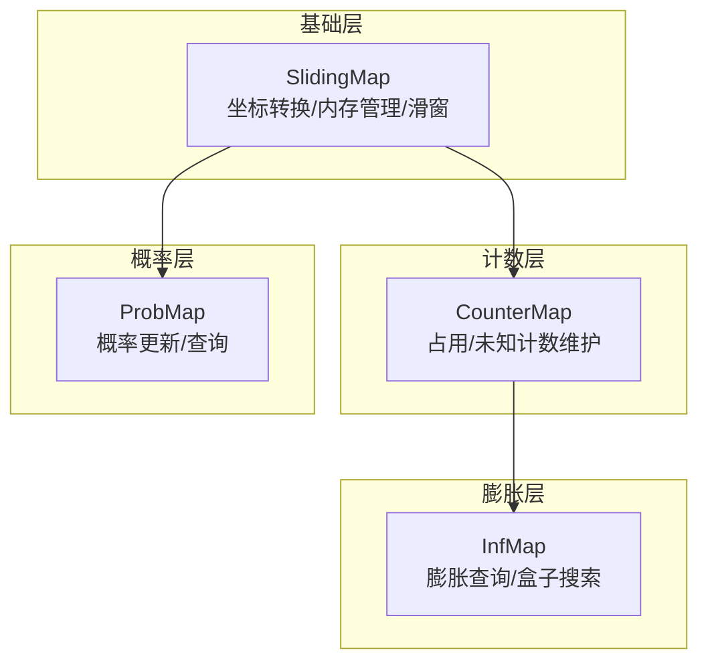
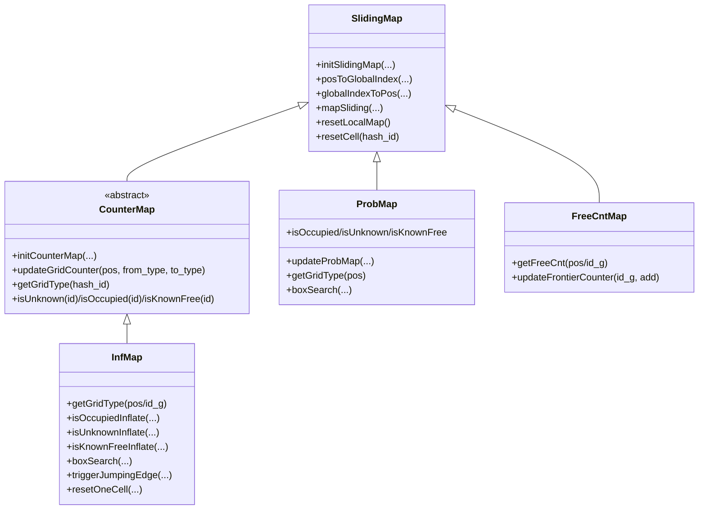
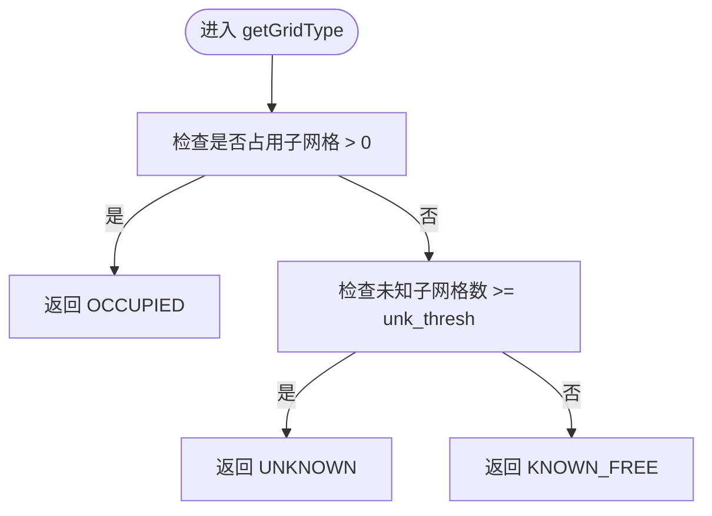
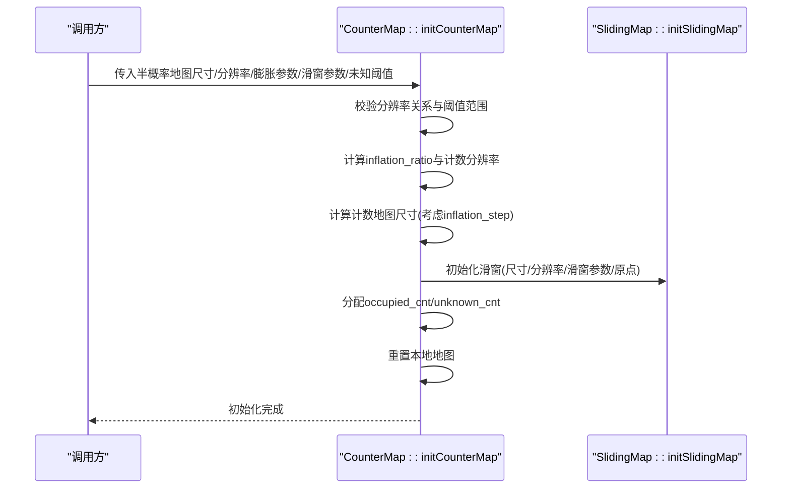
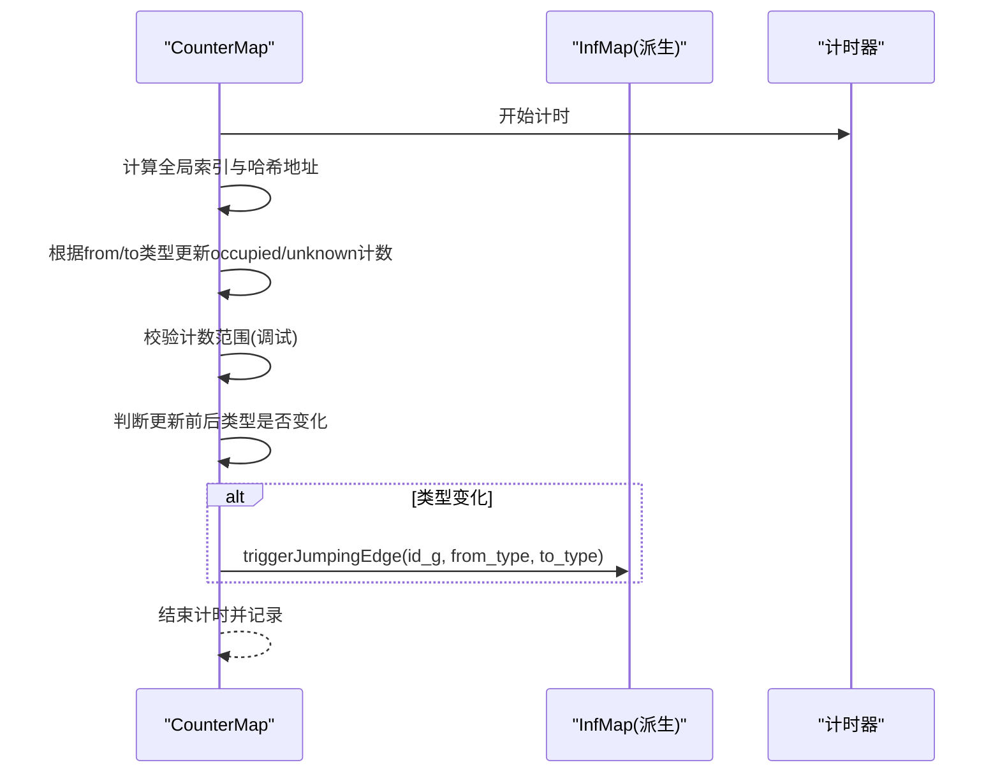
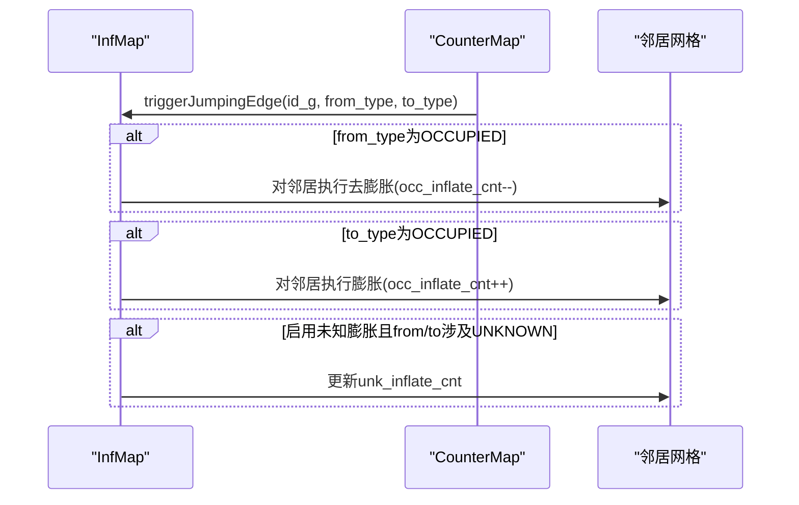
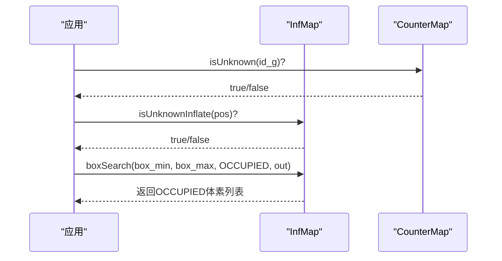
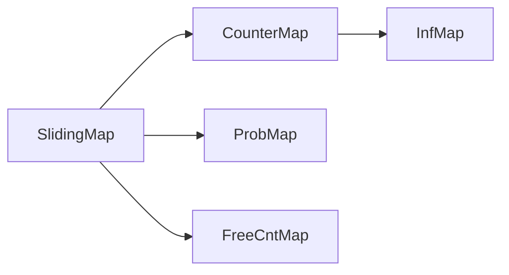

# 计数地图实现

<cite>
**本文引用的文件**
- [counter_map.h](file://src/SUPER/rog_map/include/rog_map/rog_map_core/counter_map.h)
- [counter_map.cpp](file://src/SUPER/rog_map/src/rog_map/counter_map.cpp)
- [inf_map.h](file://src/SUPER/rog_map/include/rog_map/inf_map.h)
- [inf_map.cpp](file://src/SUPER/rog_map/src/rog_map/inf_map.cpp)
- [sliding_map.h](file://src/SUPER/rog_map/include/rog_map/rog_map_core/sliding_map.h)
- [config.hpp](file://src/SUPER/rog_map/include/rog_map/rog_map_core/config.hpp)
- [prob_map.h](file://src/SUPER/rog_map/include/rog_map/prob_map.h)
- [free_cnt_map.h](file://src/SUPER/rog_map/include/rog_map/free_cnt_map.h)
- [API_REFERENCE.md](file://src/SUPER/rog_map/doc/API_REFERENCE.md)
- [CONFIGURATION.md](file://src/SUPER/rog_map/doc/CONFIGURATION.md)
</cite>

## 目录
1. [简介](#简介)
2. [项目结构](#项目结构)
3. [核心组件](#核心组件)
4. [架构总览](#架构总览)
5. [详细组件分析](#详细组件分析)
6. [依赖关系分析](#依赖关系分析)
7. [性能考量](#性能考量)
8. [故障排查指南](#故障排查指南)
9. [结论](#结论)
10. [附录](#附录)

## 简介
本技术文档围绕计数地图系统展开，重点阐述计数机制如何提升地图精度与可靠性，解释CounterMap基类的架构设计、计数器数据结构与存储方式，详述计数更新算法（观测计数、非观测计数与总计数管理）、计数地图与概率地图的关系及通过计数改进概率估计准确性的方法。同时提供计数查询接口的使用方法、计数衰减与时间相关的更新策略、初始化配置与参数设置、多传感器数据融合中的计数处理、性能表现与适用场景，以及调试与可视化方法。

## 项目结构
计数地图系统位于rog_map模块中，采用分层架构：
- 基础层：SlidingMap（滑动地图，负责坐标转换、内存管理与滑窗）
- 计数层：CounterMap（计数地图，维护占用/未知子网格计数）
- 膨胀层：InfMap（基于计数的地图膨胀层，提供膨胀查询与盒子搜索）
- 概率层：ProbMap（概率占用栅格，提供raycast更新与查询）

**图表来源**
- [sliding_map.h](file://src/SUPER/rog_map/include/rog_map/rog_map_core/sliding_map.h#L41-L141)
- [counter_map.h](file://src/SUPER/rog_map/include/rog_map/rog_map_core/counter_map.h#L34-L141)
- [inf_map.h](file://src/SUPER/rog_map/include/rog_map/inf_map.h#L30-L92)
- [prob_map.h](file://src/SUPER/rog_map/include/rog_map/prob_map.h#L38-L166)

**章节来源**
- [sliding_map.h](file://src/SUPER/rog_map/include/rog_map/rog_map_core/sliding_map.h#L41-L141)
- [counter_map.h](file://src/SUPER/rog_map/include/rog_map/rog_map_core/counter_map.h#L34-L141)
- [inf_map.h](file://src/SUPER/rog_map/include/rog_map/inf_map.h#L30-L92)
- [prob_map.h](file://src/SUPER/rog_map/include/rog_map/prob_map.h#L38-L166)

## 核心组件
- CounterMap：计数地图基类，维护每个网格的子网格级占用计数与未知计数，定义网格类型判定规则，并通过虚函数与派生类交互以触发膨胀更新。
- InfMap：继承自CounterMap，实现具体的膨胀传播逻辑，提供膨胀层查询与盒子搜索。
- SlidingMap：提供坐标转换、哈希索引、滑动窗口与内存清理等通用能力。
- ProbMap：概率占用栅格，负责raycast更新、概率阈值判定与查询。
- FreeCntMap：自由边界计数（辅助边界提取），与计数地图协同工作。

**章节来源**
- [counter_map.h](file://src/SUPER/rog_map/include/rog_map/rog_map_core/counter_map.h#L34-L141)
- [inf_map.h](file://src/SUPER/rog_map/include/rog_map/inf_map.h#L30-L92)
- [sliding_map.h](file://src/SUPER/rog_map/include/rog_map/rog_map_core/sliding_map.h#L41-L141)
- [prob_map.h](file://src/SUPER/rog_map/include/rog_map/prob_map.h#L38-L166)
- [free_cnt_map.h](file://src/SUPER/rog_map/include/rog_map/free_cnt_map.h#L33-L112)

## 架构总览
计数地图通过“子网格计数 + 网格类型判定”的方式，将概率不确定性量化为可传播的计数信号，从而在膨胀层实现更稳健的碰撞检测与边界提取。

**图表来源**
- [sliding_map.h](file://src/SUPER/rog_map/include/rog_map/rog_map_core/sliding_map.h#L41-L141)
- [counter_map.h](file://src/SUPER/rog_map/include/rog_map/rog_map_core/counter_map.h#L34-L141)
- [inf_map.h](file://src/SUPER/rog_map/include/rog_map/inf_map.h#L30-L92)
- [prob_map.h](file://src/SUPER/rog_map/include/rog_map/prob_map.h#L38-L166)
- [free_cnt_map.h](file://src/SUPER/rog_map/include/rog_map/free_cnt_map.h#L33-L112)

## 详细组件分析

### CounterMap基类设计与数据结构
- 数据结构
  - occupied_cnt：每个网格的“占用”子网格计数（int16_t）
  - unknown_cnt：每个网格的“未知”子网格计数（int16_t）
  - sub_grid_num：每个网格的子网格数量（立方）
  - unk_thresh：未知阈值（ceil(unk_thresh * sub_grid_num)）
- 存储与索引
  - 通过SlidingMap提供的哈希索引与全局/局部索引映射，实现O(1)访问
  - resetOneCell由派生类实现，用于在滑窗重置时清理派生层状态
- 网格类型判定
  - 若任意子网格为占用，则网格为占用
  - 否则若未知子网格数≥unk_thresh，则网格为未知
  - 否则为已知自由

**图表来源**
- [counter_map.h](file://src/SUPER/rog_map/include/rog_map/rog_map_core/counter_map.h#L80-L96)

**章节来源**
- [counter_map.h](file://src/SUPER/rog_map/include/rog_map/rog_map_core/counter_map.h#L51-L96)
- [sliding_map.h](file://src/SUPER/rog_map/include/rog_map/rog_map_core/sliding_map.h#L103-L133)

### 计数初始化与参数设置
- 初始化流程
  - 计算膨胀比例（inflation_ratio = round(temp_counter_map_resolution / prob_map_resolution)）
  - 确保分辨率关系与奇偶约束（CENTER模式要求奇数倍）
  - 计算计数地图尺寸（考虑inflation_step与边界）
  - 初始化计数数组（occupied_cnt全0，unknown_cnt全sub_grid_num）
  - 设置unk_thresh并重置本地地图
- 关键参数
  - prob_map_resolution/inflation_resolution：基础与计数分辨率
  - inflation_step：膨胀步数
  - unk_thresh：未知阈值（0~1）
  - map_sliding_en/sliding_thresh/fix_map_origin：滑窗策略

**图表来源**
- [counter_map.cpp](file://src/SUPER/rog_map/src/rog_map/counter_map.cpp#L31-L91)
- [sliding_map.h](file://src/SUPER/rog_map/include/rog_map/rog_map_core/sliding_map.h#L55-L59)

**章节来源**
- [counter_map.cpp](file://src/SUPER/rog_map/src/rog_map/counter_map.cpp#L31-L91)
- [config.hpp](file://src/SUPER/rog_map/include/rog_map/rog_map_core/config.hpp#L143-L185)
- [config.hpp](file://src/SUPER/rog_map/include/rog_map/rog_map_core/config.hpp#L349-L420)

### 计数更新算法与触发机制
- 更新入口：updateGridCounter(pos, from_type, to_type)
- 更新规则
  - from_type为OCCUPIED：occupied_cnt减1
  - to_type为OCCUPIED：occupied_cnt加1
  - from_type为UNKNOWN：unknown_cnt减1
  - to_type为UNKNOWN：unknown_cnt加1
- 边界检查与一致性校验（调试宏）
  - 位置必须在本地地图内
  - from_type≠to_type
  - 计数越界抛错
- 类型变化检测
  - 若更新前后网格类型发生变化，触发triggerJumpingEdge(id_g, from_type, to_type)

**图表来源**
- [counter_map.cpp](file://src/SUPER/rog_map/src/rog_map/counter_map.cpp#L94-L151)
- [inf_map.cpp](file://src/SUPER/rog_map/src/rog_map/inf_map.cpp#L252-L269)

**章节来源**
- [counter_map.cpp](file://src/SUPER/rog_map/src/rog_map/counter_map.cpp#L94-L151)
- [counter_map.h](file://src/SUPER/rog_map/include/rog_map/rog_map_core/counter_map.h#L98-L107)

### 膨胀层（InfMap）与计数传播
- 膨胀计数
  - occ_inflate_cnt：膨胀层占用计数
  - unk_inflate_cnt：膨胀层未知计数（可选）
- 触发传播
  - 当网格从OCCUPIED变为非OCCUPIED：对周围邻居执行去膨胀（occ_inflate_cnt减1）
  - 当网格变为OCCUPIED：对周围邻居执行膨胀（occ_inflate_cnt加1）
  - 当启用未知膨胀且网格状态变化涉及UNKNOWN：对周围邻居更新unk_inflate_cnt
- 查询接口
  - isOccupiedInflate/isUnknownInflate/isKnownFreeInflate
  - boxSearch（仅UNKNOWN或OCCUPIED）

**图表来源**
- [inf_map.cpp](file://src/SUPER/rog_map/src/rog_map/inf_map.cpp#L252-L269)

**章节来源**
- [inf_map.h](file://src/SUPER/rog_map/include/rog_map/inf_map.h#L67-L89)
- [inf_map.cpp](file://src/SUPER/rog_map/src/rog_map/inf_map.cpp#L188-L250)
- [inf_map.cpp](file://src/SUPER/rog_map/src/rog_map/inf_map.cpp#L252-L269)

### 计数地图与概率地图的关系
- 概率地图（ProbMap）通过raycast更新概率，设定概率阈值（l_free/l_occ）决定网格类型
- 计数地图（CounterMap）提供更细粒度的不确定性度量：未知子网格比例
- 两者结合
  - 计数层用于判定“未知”网格（未知子网格比例超过阈值）
  - 膨胀层（InfMap）在计数基础上进行几何膨胀，提供更稳健的碰撞检测
  - 通过计数改进概率估计的准确性：当未知子网格比例高时，网格更可能被判定为未知，避免误判为已知自由

**章节来源**
- [prob_map.h](file://src/SUPER/rog_map/include/rog_map/prob_map.h#L128-L138)
- [counter_map.h](file://src/SUPER/rog_map/include/rog_map/rog_map_core/counter_map.h#L80-L96)
- [inf_map.cpp](file://src/SUPER/rog_map/src/rog_map/inf_map.cpp#L280-L309)

### 计数查询接口与使用方法
- 基础查询
  - isOccupied(id_g)/isUnknown(id_g)/isKnownFree(id_g)：基于计数判定
  - getGridType(hash_id)：返回OCCUPIED/UNKNOWN/KNOWN_FREE之一
- 膨胀查询（InfMap）
  - isOccupiedInflate/isUnknownInflate/isKnownFreeInflate
  - boxSearch：在盒子范围内搜索特定类型的体素
- 坐标转换
  - probMapPosToGlobalIndex/probMapGlobalIndexToPos
  - infMapPosToGlobalIndex/infMapGlobalIndexToPos

**图表来源**
- [counter_map.cpp](file://src/SUPER/rog_map/src/rog_map/counter_map.cpp#L153-L163)
- [inf_map.cpp](file://src/SUPER/rog_map/src/rog_map/inf_map.cpp#L125-L175)

**章节来源**
- [counter_map.cpp](file://src/SUPER/rog_map/src/rog_map/counter_map.cpp#L153-L163)
- [inf_map.cpp](file://src/SUPER/rog_map/src/rog_map/inf_map.cpp#L125-L175)
- [API_REFERENCE.md](file://src/SUPER/rog_map/doc/API_REFERENCE.md#L221-L243)

### 计数衰减与时间相关的更新策略
- 计数衰减
  - 代码中未显式实现“时间衰减”逻辑；计数主要通过观测更新（raycast）与滑窗重置维持时效性
- 滑窗与重置
  - 当机器人移动超过阈值时，触发mapSliding，清理滑出范围外的内存，导致对应网格状态变为UNKNOWN
  - resetOneCell由派生类实现，用于在滑窗重置时清理派生层状态
- 时间统计
  - 计数更新过程包含计时器记录，便于性能分析

**章节来源**
- [sliding_map.h](file://src/SUPER/rog_map/include/rog_map/rog_map_core/sliding_map.h#L63-L100)
- [counter_map.cpp](file://src/SUPER/rog_map/src/rog_map/counter_map.cpp#L13-L22)
- [counter_map.cpp](file://src/SUPER/rog_map/src/rog_map/counter_map.cpp#L101-L101)

### 初始化配置与参数设置
- 关键参数
  - resolution/inflation_resolution：基础与计数分辨率
  - inflation_step：膨胀步数
  - unk_inflation_en/unk_inflation_step：未知膨胀开关与步数
  - unk_thresh：未知阈值（0~1）
  - map_sliding_en/map_sliding_thresh/fix_map_origin：滑窗策略
  - raycasting相关：p_hit/p_miss/p_min/p_max/p_occ/p_free/batch_update_size/ray_range
- 尺寸与分辨率关系
  - CENTER模式要求inflation_ratio为奇数
  - 通过resetMapSize统一计算计数/概率/边界地图尺寸

**章节来源**
- [config.hpp](file://src/SUPER/rog_map/include/rog_map/rog_map_core/config.hpp#L143-L185)
- [config.hpp](file://src/SUPER/rog_map/include/rog_map/rog_map_core/config.hpp#L349-L420)
- [CONFIGURATION.md](file://src/SUPER/rog_map/doc/CONFIGURATION.md#L19-L104)

### 多传感器数据融合中的计数处理
- 融合流程
  - 通过ProbMap的updateProbMap接收点云与位姿，执行raycast更新
  - 根据观测结果触发CounterMap::updateGridCounter，更新占用/未知计数
  - InfMap根据类型变化传播膨胀
- 边界提取
  - FreeCntMap维护邻居自由计数，配合计数地图进行边界提取

**章节来源**
- [prob_map.h](file://src/SUPER/rog_map/include/rog_map/prob_map.h#L100-L101)
- [free_cnt_map.h](file://src/SUPER/rog_map/include/rog_map/free_cnt_map.h#L69-L97)

### 性能表现与适用场景
- 复杂度
  - 单点查询O(1)，盒子搜索O(M)，最近邻搜索O(K³)
- 适用场景
  - 高速飞行器导航：通过膨胀层提供安全边界
  - 探索任务：利用未知阈值与未知膨胀提升鲁棒性
  - 实时性要求高的场景：可通过增大分辨率/减小地图尺寸平衡性能

**章节来源**
- [API_REFERENCE.md](file://src/SUPER/rog_map/doc/API_REFERENCE.md#L514-L528)

### 调试工具与可视化
- 日志输出
  - writeTimeConsumingToLog/writeMapInfoToLog：输出性能与地图信息
- 可视化
  - 发布rog_map/occ、rog_map/unk、rog_map/inf_occ、rog_map/inf_unk、rog_map/frontier、rog_map/esdf等话题
  - 在RViz中订阅上述话题观察地图状态

**章节来源**
- [prob_map.h](file://src/SUPER/rog_map/include/rog_map/prob_map.h#L96-L98)
- [inf_map.cpp](file://src/SUPER/rog_map/src/rog_map/inf_map.cpp#L118-L123)
- [CONFIGURATION.md](file://src/SUPER/rog_map/doc/CONFIGURATION.md#L313-L334)

## 依赖关系分析
- CounterMap依赖SlidingMap提供的坐标转换与内存管理
- InfMap继承CounterMap，复用计数逻辑并扩展膨胀传播
- ProbMap独立于计数层，但通过raycast更新概率，间接影响计数层网格类型
- FreeCntMap与计数地图协同，用于边界提取

**图表来源**
- [sliding_map.h](file://src/SUPER/rog_map/include/rog_map/rog_map_core/sliding_map.h#L41-L141)
- [counter_map.h](file://src/SUPER/rog_map/include/rog_map/rog_map_core/counter_map.h#L34-L141)
- [inf_map.h](file://src/SUPER/rog_map/include/rog_map/inf_map.h#L30-L92)
- [prob_map.h](file://src/SUPER/rog_map/include/rog_map/prob_map.h#L38-L166)
- [free_cnt_map.h](file://src/SUPER/rog_map/include/rog_map/free_cnt_map.h#L33-L112)

**章节来源**
- [sliding_map.h](file://src/SUPER/rog_map/include/rog_map/rog_map_core/sliding_map.h#L41-L141)
- [counter_map.h](file://src/SUPER/rog_map/include/rog_map/rog_map_core/counter_map.h#L34-L141)
- [inf_map.h](file://src/SUPER/rog_map/include/rog_map/inf_map.h#L30-L92)
- [prob_map.h](file://src/SUPER/rog_map/include/rog_map/prob_map.h#L38-L166)
- [free_cnt_map.h](file://src/SUPER/rog_map/include/rog_map/free_cnt_map.h#L33-L112)

## 性能考量
- 分辨率与尺寸
  - resolution越小、map_size越大，内存与计算开销越高
- 膨胀参数
  - inflation_step越大，膨胀范围越大，查询更保守但计算量增加
- 未知膨胀
  - 启用unk_inflation_en会增加额外计数与更新开销
- 批处理与下采样
  - batch_update_size与point_filt_num可调节更新频率与计算负载

**章节来源**
- [CONFIGURATION.md](file://src/SUPER/rog_map/doc/CONFIGURATION.md#L244-L253)
- [config.hpp](file://src/SUPER/rog_map/include/rog_map/rog_map_core/config.hpp#L177-L185)

## 故障排查指南
- 初始化错误
  - 分辨率关系非法：prob_map_resolution应不大于temp_counter_map_resolution
  - 未知阈值越界：应在[0,1]
- 运行时异常
  - 位置不在本地地图内或from_type等于to_type（调试宏开启时）
  - 计数越界（occupied/unknown超出[0, sub_grid_num]）
- 滑窗相关
  - 滑窗触发后，超出范围的网格会被重置为UNKNOWN，这是预期行为
- 可视化与日志
  - 通过writeTimeConsumingToLog/writeMapInfoToLog定位性能瓶颈
  - 在RViz中订阅rog_map话题观察地图状态

**章节来源**
- [counter_map.cpp](file://src/SUPER/rog_map/src/rog_map/counter_map.cpp#L48-L56)
- [counter_map.cpp](file://src/SUPER/rog_map/src/rog_map/counter_map.cpp#L106-L144)
- [sliding_map.h](file://src/SUPER/rog_map/include/rog_map/rog_map_core/sliding_map.h#L90-L98)
- [CONFIGURATION.md](file://src/SUPER/rog_map/doc/CONFIGURATION.md#L313-L334)

## 结论
计数地图通过子网格级计数与阈值判定，将概率不确定性转化为可传播的几何信号，在膨胀层实现稳健的碰撞检测与边界提取。结合概率地图的raycast更新与滑窗机制，系统在保证实时性的同时显著提升了地图精度与可靠性。合理配置分辨率、膨胀步数与未知阈值，可在不同应用场景中取得最佳性能与安全性平衡。

## 附录
- API参考与使用示例参见API_REFERENCE文档
- 配置项与示例参见CONFIGURATION文档

**章节来源**
- [API_REFERENCE.md](file://src/SUPER/rog_map/doc/API_REFERENCE.md#L1-L573)
- [CONFIGURATION.md](file://src/SUPER/rog_map/doc/CONFIGURATION.md#L1-L334)