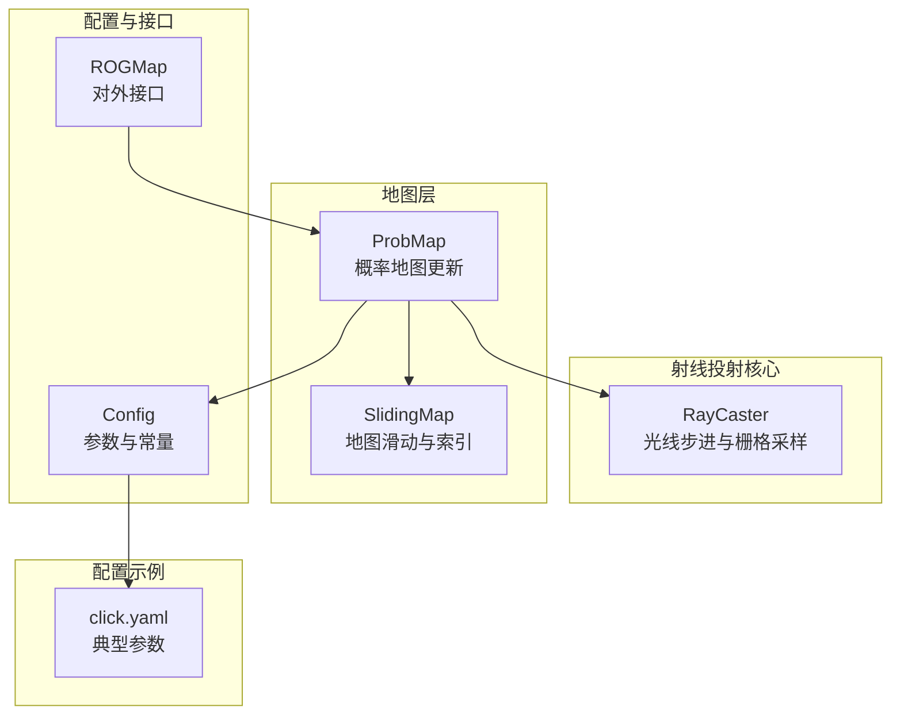
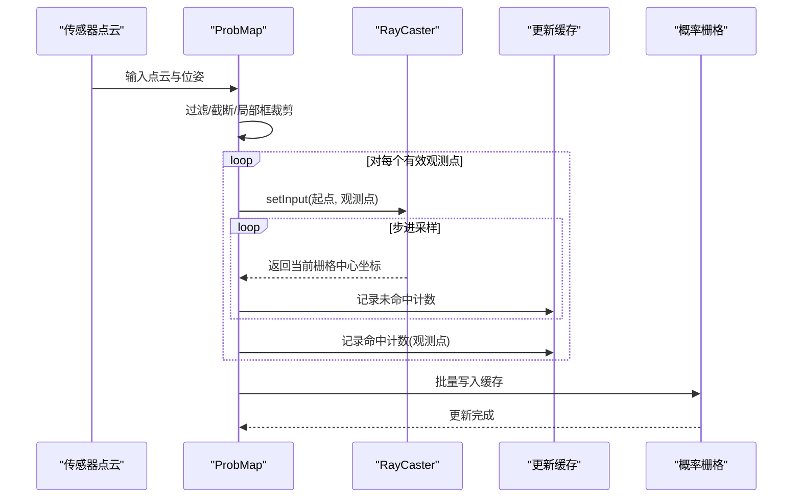
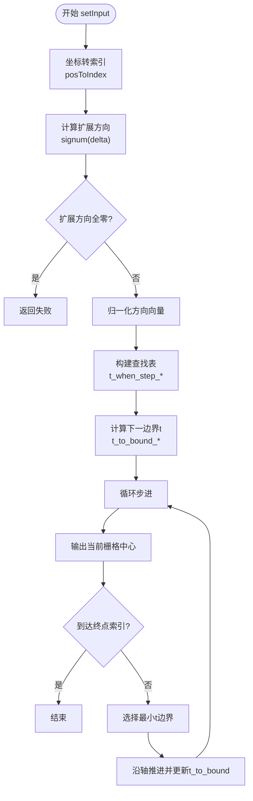
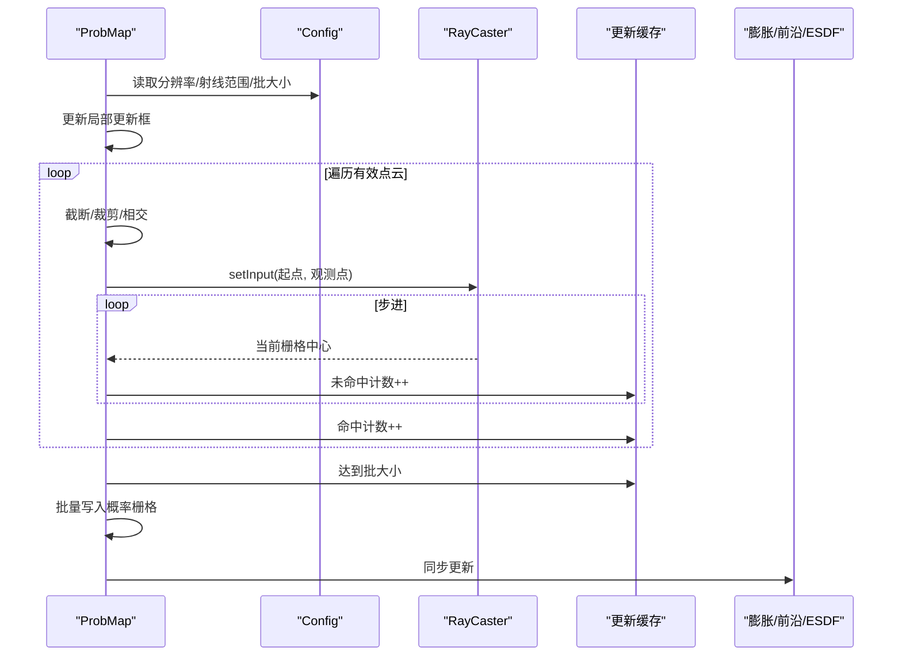
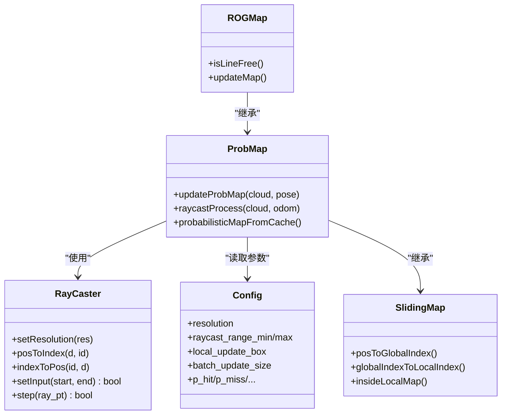

# 射线投射算法

<cite>
**本文档引用的文件**
- [raycaster.h](file://src/SUPER/rog_map/include/rog_map/rog_map_core/raycaster.h)
- [raycaster.cpp](file://src/SUPER/rog_map/include/rog_map/rog_map_core/raycaster.cpp)
- [config.hpp](file://src/SUPER/rog_map/include/rog_map/rog_map_core/config.hpp)
- [prob_map.h](file://src/SUPER/rog_map/include/rog_map/prob_map.h)
- [prob_map.cpp](file://src/SUPER/rog_map/src/rog_map/prob_map.cpp)
- [rog_map.h](file://src/SUPER/rog_map/include/rog_map/rog_map.h)
- [sliding_map.h](file://src/SUPER/rog_map/include/rog_map/rog_map_core/sliding_map.h)
- [click.yaml](file://src/SUPER/super_planner/config/click.yaml)
</cite>

## 目录
1. [简介](#简介)
2. [项目结构](#项目结构)
3. [核心组件](#核心组件)
4. [架构总览](#架构总览)
5. [详细组件分析](#详细组件分析)
6. [依赖关系分析](#依赖关系分析)
7. [性能考虑](#性能考虑)
8. [故障排查指南](#故障排查指南)
9. [结论](#结论)
10. [附录](#附录)

## 简介
本文件面向ROG地图系统中的射线投射（RayCaster）算法，系统性阐述其在地图更新中的核心作用与实现细节。射线投射负责将传感器观测（如激光雷达点云）从世界坐标映射到栅格地图，通过“命中/未命中”更新概率栅格状态，并结合批量缓存与概率更新策略，实现高效、稳定的三维栅格地图维护。

## 项目结构
与射线投射相关的关键文件组织如下：
- 核心算法：rog_map_core/raycaster.{h,cpp} 提供光线步进与栅格采样
- 地图层：rog_map/prob_map.{h,cpp} 实现概率地图更新流程，包含射线投射主流程
- 配置：rog_map_core/config.hpp 定义分辨率、射线范围、概率参数等
- 基类：rog_map_core/sliding_map.h 提供地图滑动与索引转换能力
- 外观接口：rog_map/rog_map.h 暴露查询与更新接口
- 配置示例：super_planner/config/click.yaml 展示典型参数

**图表来源**
- [raycaster.h](file://src/SUPER/rog_map/include/rog_map/rog_map_core/raycaster.h#L48-L90)
- [raycaster.cpp](file://src/SUPER/rog_map/include/rog_map/rog_map_core/raycaster.cpp#L28-L212)
- [prob_map.h](file://src/SUPER/rog_map/include/rog_map/prob_map.h#L38-L166)
- [prob_map.cpp](file://src/SUPER/rog_map/src/rog_map/prob_map.cpp#L308-L849)
- [config.hpp](file://src/SUPER/rog_map/include/rog_map/rog_map_core/config.hpp#L50-L422)
- [sliding_map.h](file://src/SUPER/rog_map/include/rog_map/rog_map_core/sliding_map.h#L41-L141)
- [rog_map.h](file://src/SUPER/rog_map/include/rog_map/rog_map.h#L39-L131)
- [click.yaml](file://src/SUPER/super_planner/config/click.yaml#L119-L190)

**章节来源**
- [raycaster.h](file://src/SUPER/rog_map/include/rog_map/rog_map_core/raycaster.h#L48-L90)
- [raycaster.cpp](file://src/SUPER/rog_map/include/rog_map/rog_map_core/raycaster.cpp#L28-L212)
- [prob_map.h](file://src/SUPER/rog_map/include/rog_map/prob_map.h#L38-L166)
- [prob_map.cpp](file://src/SUPER/rog_map/src/rog_map/prob_map.cpp#L308-L849)
- [config.hpp](file://src/SUPER/rog_map/include/rog_map/rog_map_core/config.hpp#L50-L422)
- [sliding_map.h](file://src/SUPER/rog_map/include/rog_map/rog_map_core/sliding_map.h#L41-L141)
- [rog_map.h](file://src/SUPER/rog_map/include/rog_map/rog_map.h#L39-L131)
- [click.yaml](file://src/SUPER/super_planner/config/click.yaml#L119-L190)

## 核心组件
- 射线投射器（RayCaster）
  - 提供光线步进、栅格索引转换、边界穿越判定与终止条件判断
  - 支持两种原点模式（栅格角/中心），通过编译宏控制
- 概率地图（ProbMap）
  - 组织射线投射流程：过滤点云、截取虚拟地面/天花板、限定局部更新框、批量缓存更新
  - 调用RayCaster进行自由空间采样，结合命中点更新概率
- 配置（Config）
  - 定义分辨率、射线范围、概率参数、局部更新框、批处理大小等
- 地图滑动（SlidingMap）
  - 提供全局/局部索引转换、边界检查、内存清理与重置
- 对外接口（ROGMap）
  - 暴露查询接口（可达性、最近单元格等）与更新入口

**章节来源**
- [raycaster.h](file://src/SUPER/rog_map/include/rog_map/rog_map_core/raycaster.h#L48-L90)
- [raycaster.cpp](file://src/SUPER/rog_map/include/rog_map/rog_map_core/raycaster.cpp#L28-L212)
- [prob_map.h](file://src/SUPER/rog_map/include/rog_map/prob_map.h#L38-L166)
- [prob_map.cpp](file://src/SUPER/rog_map/src/rog_map/prob_map.cpp#L672-L849)
- [config.hpp](file://src/SUPER/rog_map/include/rog_map/rog_map_core/config.hpp#L50-L422)
- [sliding_map.h](file://src/SUPER/rog_map/include/rog_map/rog_map_core/sliding_map.h#L41-L141)
- [rog_map.h](file://src/SUPER/rog_map/include/rog_map/rog_map.h#L39-L131)

## 架构总览
射线投射贯穿从传感器数据到栅格地图更新的完整链路：点云经滤波与几何约束后，对每个有效观测点执行从传感器位置到观测点的射线采样，命中点标记为占用，射线上的自由点累计未命中权重，最终批量写入概率栅格并同步到膨胀/前沿/ESDF等派生层。

**图表来源**
- [prob_map.cpp](file://src/SUPER/rog_map/src/rog_map/prob_map.cpp#L672-L793)
- [raycaster.cpp](file://src/SUPER/rog_map/include/rog_map/rog_map_core/raycaster.cpp#L71-L209)

**章节来源**
- [prob_map.cpp](file://src/SUPER/rog_map/src/rog_map/prob_map.cpp#L308-L375)
- [prob_map.cpp](file://src/SUPER/rog_map/src/rog_map/prob_map.cpp#L672-L793)
- [raycaster.cpp](file://src/SUPER/rog_map/include/rog_map/rog_map_core/raycaster.cpp#L71-L209)

## 详细组件分析

### 射线投射器（RayCaster）算法详解
- 数学原理与光线方程
  - 使用参数形式的光线方程：P(t) = start + t * direction，其中t为步长参数
  - 通过查找表预计算沿各轴步进所需的t增量（t_when_step_*），实现等距步进
- 步进策略与栅格采样
  - 每次迭代选择下一个最近的栅格边界穿越（按t_to_bound比较），沿对应轴推进一格
  - 输出当前栅格中心坐标（支持两种原点模式：角/中心）
- 终止条件
  - 当当前栅格索引等于终点索引时停止
- 关键变量
  - 起点/终点坐标与索引、扩展方向、下一边界t、各轴步进t增量、当前索引、步数计数

**图表来源**
- [raycaster.cpp](file://src/SUPER/rog_map/include/rog_map/rog_map_core/raycaster.cpp#L71-L209)
- [raycaster.h](file://src/SUPER/rog_map/include/rog_map/rog_map_core/raycaster.h#L54-L90)

**章节来源**
- [raycaster.h](file://src/SUPER/rog_map/include/rog_map/rog_map_core/raycaster.h#L48-L90)
- [raycaster.cpp](file://src/SUPER/rog_map/include/rog_map/rog_map_core/raycaster.cpp#L28-L212)

### 概率地图更新流程（射线投射主流程）
- 局部更新框与滑动
  - 根据当前位姿与配置的局部更新框，动态维护射线投射的有效范围
  - 当机器人移动超出阈值或地图为空时，触发地图滑动与重置
- 点云预处理
  - 强度滤波、时间下采样、虚拟地面/天花板截断、射线范围裁剪、与局部更新框相交
- 射线采样
  - 对每个有效观测点，从最小射程起点到观测点进行射线步进，记录未命中
  - 观测点本身记录为命中
- 批量更新
  - 将命中/未命中计数汇总到缓存队列，达到批处理大小后一次性写入概率栅格
- 同步更新派生层
  - 同步更新膨胀、前沿、ESDF等子地图

**图表来源**
- [prob_map.cpp](file://src/SUPER/rog_map/src/rog_map/prob_map.cpp#L308-L375)
- [prob_map.cpp](file://src/SUPER/rog_map/src/rog_map/prob_map.cpp#L672-L793)
- [config.hpp](file://src/SUPER/rog_map/include/rog_map/rog_map_core/config.hpp#L177-L214)

**章节来源**
- [prob_map.cpp](file://src/SUPER/rog_map/src/rog_map/prob_map.cpp#L308-L375)
- [prob_map.cpp](file://src/SUPER/rog_map/src/rog_map/prob_map.cpp#L672-L793)
- [config.hpp](file://src/SUPER/rog_map/include/rog_map/rog_map_core/config.hpp#L177-L214)

### 参数配置与优化策略
- 关键参数
  - 分辨率与膨胀分辨率：决定栅格粒度与派生层一致性
  - 射线范围：最小/最大射程，平方范数缓存用于快速判断
  - 局部更新框：限制每次射线投射的计算范围
  - 批处理大小：减少写入次数，提升吞吐
  - 概率参数：命中/未命中/上下限，采用对数几率（logit）离散化
- 优化策略
  - 查找表：预计算t增量，避免每步重复除法
  - 等距步进：按最近边界穿越推进，减少浮点误差累积
  - 批量更新：合并多次操作，降低缓存写放大
  - 时间/强度滤波：减少无效点数量，缩短射线长度
  - 局部更新框：仅对感兴趣区域计算，避免全图扫描

**章节来源**
- [config.hpp](file://src/SUPER/rog_map/include/rog_map/rog_map_core/config.hpp#L143-L214)
- [raycaster.cpp](file://src/SUPER/rog_map/include/rog_map/rog_map_core/raycaster.cpp#L119-L153)
- [prob_map.cpp](file://src/SUPER/rog_map/src/rog_map/prob_map.cpp#L342-L349)
- [click.yaml](file://src/SUPER/super_planner/config/click.yaml#L168-L190)

### 不同地图类型的适用差异
- 概率栅格（ProbMap）
  - 通过命中/未命中计数更新概率，适合动态环境与不确定性建模
- 膨胀/前沿/ESDF
  - 基于概率栅格派生，射线投射为其提供自由/占用状态的输入
- 计数地图（CounterMap）
  - 通过RayCaster在膨胀分辨率下进行更细粒度采样，再聚合到概率分辨率
  - 本仓库未直接展示计数地图的射线投射实现，但其核心思想一致

**章节来源**
- [prob_map.h](file://src/SUPER/rog_map/include/rog_map/prob_map.h#L103-L166)
- [config.hpp](file://src/SUPER/rog_map/include/rog_map/rog_map_core/config.hpp#L289-L422)

## 依赖关系分析
- 组件耦合
  - ProbMap依赖RayCaster进行射线步进；依赖Config提供参数；依赖SlidingMap进行索引与边界管理
  - ROGMap在ProbMap之上提供查询接口
- 外部依赖
  - Eigen用于向量运算
  - PCL用于点云处理
  - YAML配置加载

**图表来源**
- [raycaster.h](file://src/SUPER/rog_map/include/rog_map/rog_map_core/raycaster.h#L48-L90)
- [prob_map.h](file://src/SUPER/rog_map/include/rog_map/prob_map.h#L38-L166)
- [config.hpp](file://src/SUPER/rog_map/include/rog_map/rog_map_core/config.hpp#L50-L422)
- [sliding_map.h](file://src/SUPER/rog_map/include/rog_map/rog_map_core/sliding_map.h#L41-L141)
- [rog_map.h](file://src/SUPER/rog_map/include/rog_map/rog_map.h#L39-L131)

**章节来源**
- [raycaster.h](file://src/SUPER/rog_map/include/rog_map/rog_map_core/raycaster.h#L48-L90)
- [prob_map.h](file://src/SUPER/rog_map/include/rog_map/prob_map.h#L38-L166)
- [config.hpp](file://src/SUPER/rog_map/include/rog_map/rog_map_core/config.hpp#L50-L422)
- [sliding_map.h](file://src/SUPER/rog_map/include/rog_map/rog_map_core/sliding_map.h#L41-L141)
- [rog_map.h](file://src/SUPER/rog_map/include/rog_map/rog_map.h#L39-L131)

## 性能考虑
- 复杂度分析
  - 单次射线步进：O(1)，主要为常数时间的比较与加法
  - 单帧射线投射：O(N_rays * steps_per_ray)，steps_per_ray ≈ 远端距离/分辨率
  - 批量更新：O(N_cells)，按缓存队列规模
- 优化建议
  - 合理设置分辨率与射线范围，避免过密步进
  - 使用局部更新框限制计算域
  - 增大批处理大小，减少写入开销
  - 启用强度/时间滤波，减少无效射线
  - 在高分辨率场景下，优先使用角原点以保证奇数膨胀比（见配置重置逻辑）

[本节为通用性能讨论，不直接分析具体文件]

## 故障排查指南
- 常见问题
  - 分辨率未设置或为负：初始化抛出异常
  - 原点模式冲突：同时定义角/中心或均未定义，抛出异常
  - 起点与终点重合：返回失败，无射线步进
  - 地图滑动阈值过大：导致频繁重置；过小则频繁滑动
  - 射线范围设置不当：过短导致覆盖不足，过长增加计算量
- 调试技巧
  - 开启可视化更新框与局部地图原点，观察射线采样范围
  - 逐步注释批处理写入，定位缓存堆积问题
  - 检查虚拟地面/天花板截断是否误伤有效观测
  - 使用时间日志对比射线投射与概率更新耗时

**章节来源**
- [raycaster.cpp](file://src/SUPER/rog_map/include/rog_map/rog_map_core/raycaster.cpp#L28-L46)
- [prob_map.cpp](file://src/SUPER/rog_map/src/rog_map/prob_map.cpp#L308-L375)
- [config.hpp](file://src/SUPER/rog_map/include/rog_map/rog_map_core/config.hpp#L349-L419)

## 结论
ROG地图的射线投射算法以高效的光线步进与栅格采样为核心，结合局部更新框、批量缓存与概率更新策略，在保证精度的同时显著提升实时性。通过合理的参数配置与优化手段，可在复杂三维环境中稳定维护概率栅格地图，并为后续规划与导航提供可靠基础。

[本节为总结性内容，不直接分析具体文件]

## 附录
- 参数速查
  - 分辨率与膨胀分辨率：影响栅格粒度与派生层一致性
  - 射线范围：最小/最大射程，平方范数缓存加速
  - 局部更新框：限制射线投射范围
  - 批处理大小：平衡吞吐与延迟
  - 概率参数：命中/未命中/上下限，采用对数几率离散化

**章节来源**
- [config.hpp](file://src/SUPER/rog_map/include/rog_map/rog_map_core/config.hpp#L143-L214)
- [click.yaml](file://src/SUPER/super_planner/config/click.yaml#L168-L190)