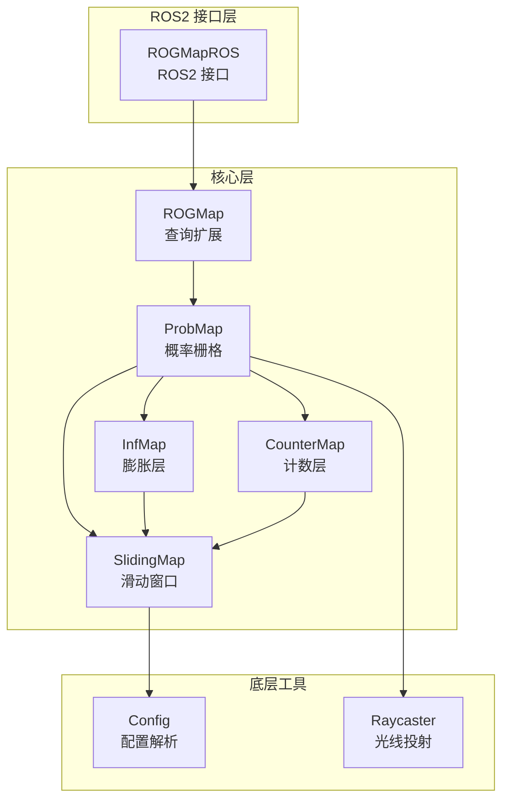
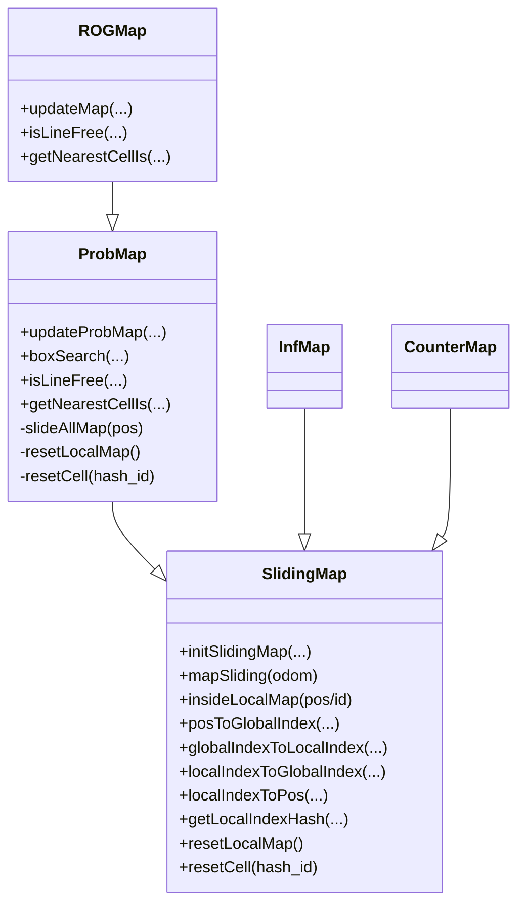
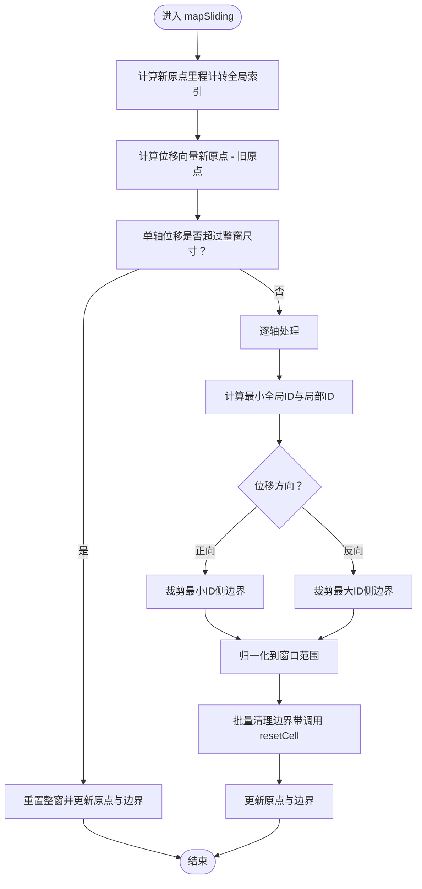
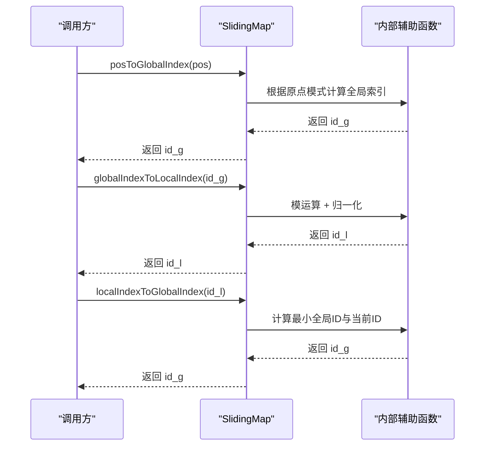
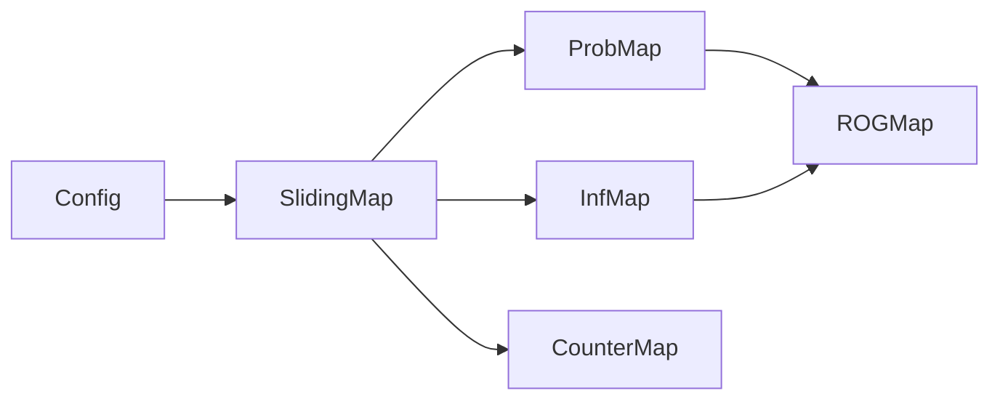

# 滑动窗口机制

<cite>
**本文引用的文件**
- [sliding_map.h](file://src/SUPER/rog_map/include/rog_map/rog_map_core/sliding_map.h)
- [sliding_map.cpp](file://src/SUPER/rog_map/src/rog_map/sliding_map.cpp)
- [config.hpp](file://src/SUPER/rog_map/include/rog_map/rog_map_core/config.hpp)
- [API_REFERENCE.md](file://src/SUPER/rog_map/doc/API_REFERENCE.md)
- [CONFIGURATION.md](file://src/SUPER/rog_map/doc/CONFIGURATION.md)
- [prob_map.h](file://src/SUPER/rog_map/include/rog_map/prob_map.h)
- [rog_map.h](file://src/SUPER/rog_map/include/rog_map/rog_map.h)
- [rog_map.cpp](file://src/SUPER/rog_map/src/rog_map/rog_map.cpp)
- [common_lib.hpp](file://src/SUPER/rog_map/include/rog_map/rog_map_core/common_lib.hpp)
</cite>

## 目录
1. [简介](#简介)
2. [项目结构](#项目结构)
3. [核心组件](#核心组件)
4. [架构总览](#架构总览)
5. [详细组件分析](#详细组件分析)
6. [依赖关系分析](#依赖关系分析)
7. [性能考量](#性能考量)
8. [故障排查指南](#故障排查指南)
9. [结论](#结论)
10. [附录](#附录)

## 简介
本文件围绕 ROG 地图系统的“滑动窗口机制”展开，系统性阐述其设计理念、实现原理、坐标转换、更新策略与配置参数，并给出与传统全量地图的性能对比、内存使用分析、测试建议与最佳实践。滑动窗口通过仅维护机器人周边有限范围的地图，显著降低内存占用与更新开销，同时保持实时性能与查询效率。

## 项目结构
ROG 地图系统采用分层架构，滑动窗口位于底层核心模块，向上为概率地图、膨胀层、ESDF 等功能模块提供统一的坐标与内存管理能力。

图表来源
- [API_REFERENCE.md](file://src/SUPER/rog_map/doc/API_REFERENCE.md#L31-L70)
- [rog_map.h](file://src/SUPER/rog_map/include/rog_map/rog_map.h#L39-L131)
- [prob_map.h](file://src/SUPER/rog_map/include/rog_map/prob_map.h#L38-L166)
- [config.hpp](file://src/SUPER/rog_map/include/rog_map/rog_map_core/config.hpp#L50-L422)

章节来源
- [API_REFERENCE.md](file://src/SUPER/rog_map/doc/API_REFERENCE.md#L29-L70)

## 核心组件
- SlidingMap：滑动窗口核心，负责窗口大小控制、滚动策略、边界处理、坐标转换与内存清理。
- ProbMap/InfMap/CounterMap：基于 SlidingMap 的具体地图类型，实现各自的数据结构与更新逻辑。
- Config：读取 YAML 配置，初始化分辨率、地图尺寸、滑动阈值等参数。
- ROGMap：在 ProbMap 基础上提供线段自由检测、最近邻搜索等高级查询。

章节来源
- [sliding_map.h](file://src/SUPER/rog_map/include/rog_map/rog_map_core/sliding_map.h#L41-L141)
- [prob_map.h](file://src/SUPER/rog_map/include/rog_map/prob_map.h#L38-L166)
- [rog_map.h](file://src/SUPER/rog_map/include/rog_map/rog_map.h#L39-L131)
- [config.hpp](file://src/SUPER/rog_map/include/rog_map/rog_map_core/config.hpp#L50-L422)

## 架构总览
滑动窗口作为所有地图类型的基类，向上提供统一的坐标转换与内存管理接口；向下由具体地图类型实现各自的更新与查询逻辑。

图表来源
- [sliding_map.h](file://src/SUPER/rog_map/include/rog_map/rog_map_core/sliding_map.h#L41-L141)
- [prob_map.h](file://src/SUPER/rog_map/include/rog_map/prob_map.h#L38-L166)
- [rog_map.h](file://src/SUPER/rog_map/include/rog_map/rog_map.h#L39-L131)

## 详细组件分析

### 设计理念与优势
- 内存效率：仅维护以机器人为中心的有限大小本地地图，避免全量地图带来的内存峰值。
- 实时性能：滑动窗口通过“边界裁剪 + 局部重置”的方式，将更新复杂度控制在边界带宽内，显著降低每次更新的计算量。
- 可扩展性：SlidingMap 提供统一的坐标转换与索引映射接口，便于在不同地图类型之间复用。

章节来源
- [API_REFERENCE.md](file://src/SUPER/rog_map/doc/API_REFERENCE.md#L19-L26)

### 窗口大小控制与滚动策略
- 窗口尺寸：由配置中的地图半尺寸与分辨率共同决定，最终以网格数量表示。
- 滚动触发：当机器人位移超过滑动阈值时，触发窗口平移；若单轴位移超过整窗尺寸，则整体重置。
- 边界裁剪：对即将移出窗口的边界带进行批量清理，调用派生类的 resetCell 接口将单元格状态置为未知，避免内存泄漏。

图表来源
- [sliding_map.cpp](file://src/SUPER/rog_map/src/rog_map/sliding_map.cpp#L170-L226)

章节来源
- [sliding_map.cpp](file://src/SUPER/rog_map/src/rog_map/sliding_map.cpp#L170-L226)

### 坐标系统与索引映射
- 坐标原点模式：支持“中心原点”和“角落原点”两种模式，通过编译期宏控制，二者不可同时启用。
- 位置与索引互转：提供全局索引与位置、局部索引与位置、哈希索引与位置之间的双向转换。
- 索引归一化：局部索引通过模运算与尺寸归一化，确保在窗口内的唯一性与连续性。

图表来源
- [sliding_map.cpp](file://src/SUPER/rog_map/src/rog_map/sliding_map.cpp#L246-L373)

章节来源
- [sliding_map.cpp](file://src/SUPER/rog_map/src/rog_map/sliding_map.cpp#L246-L373)

### 更新机制与内存清理
- 新数据插入：通过光线投射与概率更新在窗口内进行增量更新。
- 旧数据移除：在窗口平移时，对即将移出的边界带执行批量清理，调用 resetCell 将单元格状态置为未知。
- 窗口平移：根据位移向量逐轴裁剪，保证窗口始终覆盖机器人当前位置。

章节来源
- [sliding_map.cpp](file://src/SUPER/rog_map/src/rog_map/sliding_map.cpp#L145-L164)
- [sliding_map.cpp](file://src/SUPER/rog_map/src/rog_map/sliding_map.cpp#L194-L223)

### 配置参数
- 地图分辨率与膨胀分辨率：影响网格粒度与膨胀层分辨率一致性。
- 地图尺寸：以米为单位的本地地图范围，最终转换为网格半尺寸。
- 滑动开关与阈值：控制是否启用滑动以及触发平移的位移阈值。
- 点云处理与可视化：点云下采样、可视化范围与时率等。

章节来源
- [CONFIGURATION.md](file://src/SUPER/rog_map/doc/CONFIGURATION.md#L21-L180)
- [config.hpp](file://src/SUPER/rog_map/include/rog_map/rog_map_core/config.hpp#L143-L214)

### 与传统全量地图的性能对比
- 内存占用：滑动窗口为 O(N^3)（N 为半窗尺寸），全量地图为 O(全局范围^3)，后者在大场景下内存压力更大。
- 更新复杂度：滑动窗口更新主要集中在边界带，复杂度与窗口周长成正比；全量地图更新需遍历全部体素，复杂度与全局体素数成正比。
- 查询效率：两者均为 O(1) 单点查询，但滑动窗口在大场景下的缓存命中率更高，延迟更低。

章节来源
- [API_REFERENCE.md](file://src/SUPER/rog_map/doc/API_REFERENCE.md#L514-L528)

## 依赖关系分析
- SlidingMap 依赖 Config 进行初始化与参数校验。
- ProbMap/InfMap/CounterMap 继承自 SlidingMap，分别实现各自的数据结构与更新逻辑。
- ROGMap 在 ProbMap 基础上提供高级查询接口，并在初始化时同步调用各层的 mapSliding。

图表来源
- [config.hpp](file://src/SUPER/rog_map/include/rog_map/rog_map_core/config.hpp#L50-L422)
- [sliding_map.h](file://src/SUPER/rog_map/include/rog_map/rog_map_core/sliding_map.h#L41-L141)
- [prob_map.h](file://src/SUPER/rog_map/include/rog_map/prob_map.h#L38-L166)
- [rog_map.h](file://src/SUPER/rog_map/include/rog_map/rog_map.h#L39-L131)

章节来源
- [rog_map.cpp](file://src/SUPER/rog_map/src/rog_map/rog_map.cpp#L28-L78)

## 性能考量
- 时间复杂度：单点查询 O(1)，线段检测 O(N)，盒子搜索 O(M)，最近邻搜索 O(K^3)。
- 空间复杂度：单层地图 O(N^3)，多层叠加（概率+膨胀+ESDF）按需启用。
- 配置优化建议：
  - 降低分辨率或减小地图尺寸以换取更快更新。
  - 关闭 ESDF 或边界提取以减少额外计算。
  - 合理设置点云下采样与批处理大小，平衡精度与速度。
  - 在高精度场景下启用未知膨胀与 ESDF，但注意性能代价。

章节来源
- [API_REFERENCE.md](file://src/SUPER/rog_map/doc/API_REFERENCE.md#L514-L541)
- [CONFIGURATION.md](file://src/SUPER/rog_map/doc/CONFIGURATION.md#L244-L291)

## 故障排查指南
- 初始化错误：若重复初始化或原点模式宏冲突，会抛出异常。检查 Config 初始化与宏定义。
- 滑动异常：若单轴位移超过整窗尺寸，将触发整窗重置；确认滑动阈值与地图尺寸设置合理。
- 坐标转换异常：确保使用与配置一致的原点模式（中心/角落），避免混用导致索引错位。
- 性能瓶颈：优先检查点云下采样、地图尺寸与 ESDF 开关；必要时降低分辨率或关闭非关键功能。

章节来源
- [sliding_map.cpp](file://src/SUPER/rog_map/src/rog_map/sliding_map.cpp#L56-L84)
- [config.hpp](file://src/SUPER/rog_map/include/rog_map/rog_map_core/config.hpp#L68-L80)

## 结论
滑动窗口机制通过“局部维护 + 边界裁剪 + 局部重置”的策略，在保证实时性的前提下显著降低了内存与计算开销。结合合理的配置与使用建议，可在不同任务场景（低延迟导航、高精度探索）中取得良好平衡。

## 附录

### 实际应用场景与最佳实践
- 低延迟导航：增大分辨率、缩小地图尺寸、关闭 ESDF 与边界提取，提高更新频率与查询速度。
- 高精度探索：降低点云下采样、启用未知膨胀与 ESDF，提升环境感知与路径优化质量。
- 固定原点模式：在静态场景或离线演示中禁用滑动，固定地图原点以简化调试与可视化。

章节来源
- [CONFIGURATION.md](file://src/SUPER/rog_map/doc/CONFIGURATION.md#L182-L241)
- [API_REFERENCE.md](file://src/SUPER/rog_map/doc/API_REFERENCE.md#L543-L550)