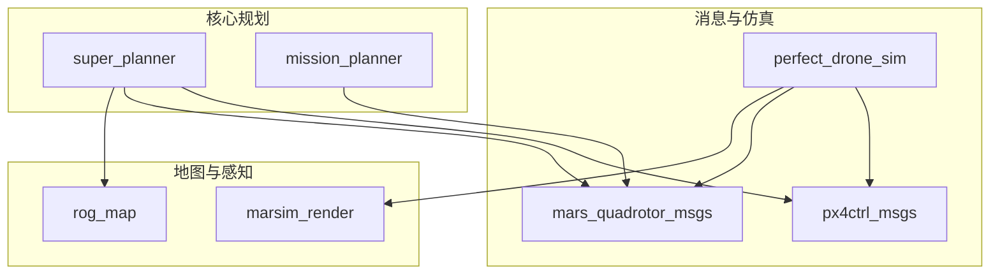
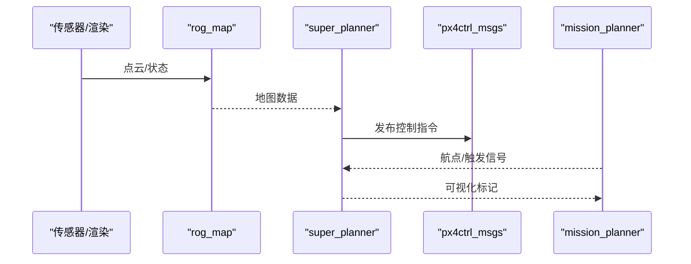
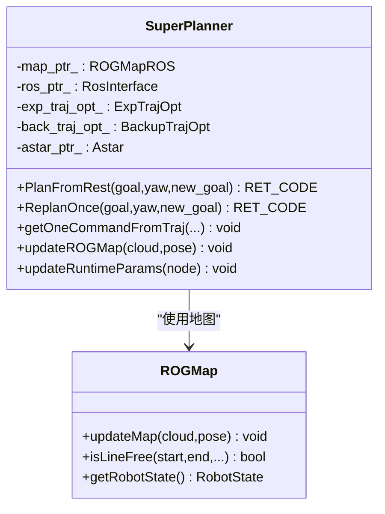
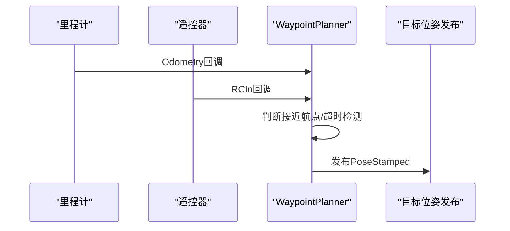
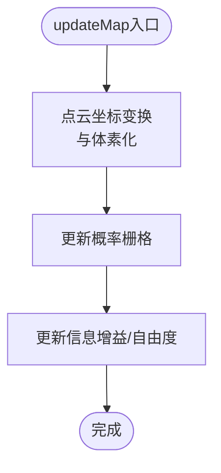
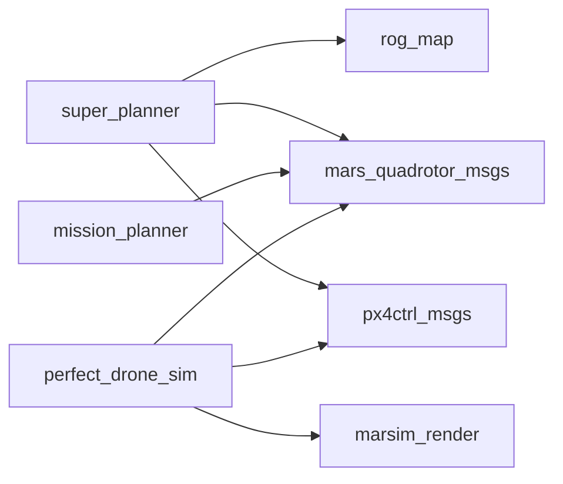

# ROS2包结构与依赖

<cite>
**本文档引用的文件**
- [super_planner 包配置](file://src/SUPER/super_planner/package.xml)
- [mission_planner 包配置](file://src/SUPER/mission_planner/package.xml)
- [rog_map 包配置](file://src/SUPER/rog_map/package.xml)
- [mars_quadrotor_msgs 包配置](file://src/SUPER/mars_uav_sim/mars_quadrotor_msgs/package.xml)
- [px4ctrl_msgs 包配置](file://src/SUPER/mars_uav_sim/px4ctrl_msgs/package.xml)
- [marsim_render 包配置](file://src/SUPER/mars_uav_sim/marsim_render/package.xml)
- [perfect_drone_sim 包配置](file://src/SUPER/mars_uav_sim/perfect_drone_sim/package.xml)
- [super_planner 构建脚本](file://src/SUPER/super_planner/CMakeLists.txt)
- [rog_map 构建脚本](file://src/SUPER/rog_map/CMakeLists.txt)
- [mission_planner 构建脚本](file://src/SUPER/mission_planner/CMakeLists.txt)
- [mars_quadrotor_msgs 构建脚本](file://src/SUPER/mars_uav_sim/mars_quadrotor_msgs/CMakeLists.txt)
- [px4ctrl_msgs 构建脚本](file://src/SUPER/mars_uav_sim/px4ctrl_msgs/CMakeLists.txt)
- [perfect_drone_sim 构建脚本](file://src/SUPER/mars_uav_sim/perfect_drone_sim/CMakeLists.txt)
- [super_planner 核心类定义](file://src/SUPER/super_planner/include/super_core/super_planner.h)
- [rog_map 地图核心类定义](file://src/SUPER/rog_map/include/rog_map/rog_map.h)
- [mission_planner 航点规划器定义](file://src/SUPER/mission_planner/include/waypoint_mission/ros2_waypoint_planner.hpp)
- [px4ctrl 控制命令消息](file://src/SUPER/mars_uav_sim/px4ctrl_msgs/msg/Command.msg)
</cite>

## 目录
1. [引言](#引言)
2. [项目结构](#项目结构)
3. [核心组件](#核心组件)
4. [架构总览](#架构总览)
5. [详细组件分析](#详细组件分析)
6. [依赖关系分析](#依赖关系分析)
7. [性能考量](#性能考量)
8. [故障排查指南](#故障排查指南)
9. [结论](#结论)
10. [附录](#附录)

## 引言
本文件系统性梳理该ROS2工作空间中核心包的结构与依赖关系，重点覆盖以下方面：
- package.xml配置：版本管理、依赖声明、构建工具配置
- 核心包设计：super_planner、mission_planner、rog_map的模块化与职责边界
- 包间接口耦合与数据流：消息类型、服务接口、话题订阅/发布
- 构建流程：ament_cmake使用、依赖解析与安装导出
- 安装验证与环境配置：如何正确编译、安装与运行
- 生命周期与版本兼容：包的生命周期管理、版本策略与兼容性建议

## 项目结构
该工作空间采用按功能域分层的包组织方式，核心包位于src/SUPER目录下，分为：
- 地图与感知：rog_map、marsim_render
- 规划与控制：super_planner、mission_planner
- 消息与仿真：mars_quadrotor_msgs、px4ctrl_msgs、perfect_drone_sim

图表来源
- [super_planner 包配置](file://src/SUPER/super_planner/package.xml#L1-L21)
- [mission_planner 包配置](file://src/SUPER/mission_planner/package.xml#L1-L19)
- [rog_map 包配置](file://src/SUPER/rog_map/package.xml#L1-L27)
- [mars_quadrotor_msgs 包配置](file://src/SUPER/mars_uav_sim/mars_quadrotor_msgs/package.xml#L1-L26)
- [px4ctrl_msgs 包配置](file://src/SUPER/mars_uav_sim/px4ctrl_msgs/package.xml#L1-L22)
- [marsim_render 包配置](file://src/SUPER/mars_uav_sim/marsim_render/package.xml#L1-L20)
- [perfect_drone_sim 包配置](file://src/SUPER/mars_uav_sim/perfect_drone_sim/package.xml#L1-L20)

章节来源
- [super_planner 包配置](file://src/SUPER/super_planner/package.xml#L1-L21)
- [mission_planner 包配置](file://src/SUPER/mission_planner/package.xml#L1-L19)
- [rog_map 包配置](file://src/SUPER/rog_map/package.xml#L1-L27)
- [mars_quadrotor_msgs 包配置](file://src/SUPER/mars_uav_sim/mars_quadrotor_msgs/package.xml#L1-L26)
- [px4ctrl_msgs 包配置](file://src/SUPER/mars_uav_sim/px4ctrl_msgs/package.xml#L1-L22)
- [marsim_render 包配置](file://src/SUPER/mars_uav_sim/marsim_render/package.xml#L1-L20)
- [perfect_drone_sim 包配置](file://src/SUPER/mars_uav_sim/perfect_drone_sim/package.xml#L1-L20)

## 核心组件
本节聚焦三个核心包的职责与接口：
- super_planner：基于ROG地图进行路径搜索与轨迹优化，输出位姿/姿态/加加速度等控制指令
- mission_planner：航点任务发布与可视化，接收里程计/遥控器触发，发布目标位姿
- rog_map：三维栅格地图构建与查询，支持概率/未知/自由/障碍等多层信息

章节来源
- [super_planner 核心类定义](file://src/SUPER/super_planner/include/super_core/super_planner.h#L55-L298)
- [rog_map 地图核心类定义](file://src/SUPER/rog_map/include/rog_map/rog_map.h#L39-L131)
- [mission_planner 航点规划器定义](file://src/SUPER/mission_planner/include/waypoint_mission/ros2_waypoint_planner.hpp#L24-L410)

## 架构总览
整体架构围绕“感知—地图—规划—控制”闭环展开：
- 感知与渲染：perfect_drone_sim通过marsim_render提供传感器仿真与渲染
- 地图：rog_map维护三维栅格地图，供super_planner消费
- 规划：super_planner进行A*路径搜索与轨迹优化，生成控制指令
- 任务：mission_planner负责航点任务下发与RViz可视化
- 消息：mars_quadrotor_msgs与px4ctrl_msgs提供统一的消息/服务接口

图表来源
- [super_planner 包配置](file://src/SUPER/super_planner/package.xml#L13-L15)
- [rog_map 包配置](file://src/SUPER/rog_map/package.xml#L12-L18)
- [px4ctrl_msgs 包配置](file://src/SUPER/mars_uav_sim/px4ctrl_msgs/package.xml#L10-L17)
- [mission_planner 包配置](file://src/SUPER/mission_planner/package.xml#L13-L13)

## 详细组件分析

### super_planner 组件分析
- 模块化设计
  - 路径搜索：A*算法实现，支持走廊生成与视野检查
  - 轨迹优化：指数轨迹与备份轨迹优化器，支持动态参数同步
  - 地图集成：通过ROGMapROS对接rog_map提供的地图数据
  - ROS接口：封装RosInterface以适配rclcpp节点与消息
- 关键接口
  - 地图更新：updateROGMap(cloud, pose)
  - 轨迹获取：getOneCommandFromTraj(...)返回位姿/姿态/加加速度
  - 动态参数：updateRuntimeParams(node)同步配置到优化器
- 依赖关系
  - 编译期依赖：rclcpp、geometry_msgs、sensor_msgs、nav_msgs、std_msgs、tf2_ros、pcl_conversions、rog_map、mars_quadrotor_msgs、px4ctrl_msgs
  - 运行期依赖：ament_cmake、rosidl_default_runtime（当存在srv/msg时）

图表来源
- [super_planner 核心类定义](file://src/SUPER/super_planner/include/super_core/super_planner.h#L59-L298)
- [rog_map 地图核心类定义](file://src/SUPER/rog_map/include/rog_map/rog_map.h#L39-L131)

章节来源
- [super_planner 包配置](file://src/SUPER/super_planner/package.xml#L7-L15)
- [super_planner 构建脚本](file://src/SUPER/super_planner/CMakeLists.txt#L33-L74)
- [super_planner 核心类定义](file://src/SUPER/super_planner/include/super_core/super_planner.h#L226-L298)

### mission_planner 组件分析
- 职责边界
  - 接收里程计/遥控器触发，周期性判断是否到达航点
  - 发布目标位姿到后续控制器
  - 可选RViz可视化航点与切换半径
- 关键接口
  - 订阅：/mavros/rc/in（遥控器）、/mavros/global_position/local（里程计）
  - 发布：/move_base_simple/goal（目标位姿）
  - 参数：config_name、data_name、odom_timeout、publish_dt等
- 依赖关系
  - 依赖mavros_msgs用于接收遥控器输入
  - 依赖geometry_msgs、nav_msgs、visualization_msgs进行位姿与可视化

图表来源
- [mission_planner 航点规划器定义](file://src/SUPER/mission_planner/include/waypoint_mission/ros2_waypoint_planner.hpp#L52-L160)
- [mission_planner 包配置](file://src/SUPER/mission_planner/package.xml#L13-L13)

章节来源
- [mission_planner 包配置](file://src/SUPER/mission_planner/package.xml#L7-L13)
- [mission_planner 构建脚本](file://src/SUPER/mission_planner/CMakeLists.txt#L26-L70)
- [mission_planner 航点规划器定义](file://src/SUPER/mission_planner/include/waypoint_mission/ros2_waypoint_planner.hpp#L162-L223)

### rog_map 组件分析
- 功能定位
  - 基于概率栅格的三维地图，支持自由/未知/障碍等多层信息
  - 提供线段可视性检查、最近单元格查询等几何工具
- 关键接口
  - updateMap(cloud, pose)：增量更新地图
  - isLineFree(...)：线段碰撞检测
  - getRobotState()：获取机器人当前位姿
- 依赖关系
  - 依赖PCL、tf2_ros、pcl_conversions、rosidl_default_generators（含srv/msg时）
  - 导出头文件与库供super_planner链接

图表来源
- [rog_map 地图核心类定义](file://src/SUPER/rog_map/include/rog_map/rog_map.h#L112-L120)

章节来源
- [rog_map 包配置](file://src/SUPER/rog_map/package.xml#L10-L22)
- [rog_map 构建脚本](file://src/SUPER/rog_map/CMakeLists.txt#L29-L87)
- [rog_map 地图核心类定义](file://src/SUPER/rog_map/include/rog_map/rog_map.h#L39-L131)

### 消息与服务接口
- px4ctrl_msgs
  - 消息：Command.msg，包含控制输入、状态、偏航等字段
  - 服务：GetReference.srv、StepSim.srv
- mars_quadrotor_msgs
  - 消息：QuadrotorState.msg、PositionCommand.msg、PolynomialTrajectory.msg、MpcPositionCommand.msg、TrakingPerformance.msg
  - 通过rosidl_default_generators生成对应语言绑定

章节来源
- [px4ctrl 控制命令消息](file://src/SUPER/mars_uav_sim/px4ctrl_msgs/msg/Command.msg#L1-L18)
- [px4ctrl_msgs 包配置](file://src/SUPER/mars_uav_sim/px4ctrl_msgs/package.xml#L10-L17)
- [mars_quadrotor_msgs 包配置](file://src/SUPER/mars_uav_sim/mars_quadrotor_msgs/package.xml#L10-L20)
- [mars_quadrotor_msgs 构建脚本](file://src/SUPER/mars_uav_sim/mars_quadrotor_msgs/CMakeLists.txt#L24-L37)

## 依赖关系分析
- 版本与格式
  - super_planner、mission_planner、perfect_drone_sim使用package format="2"
  - rog_map、mars_quadrotor_msgs、px4ctrl_msgs使用package format="3"
- 构建工具
  - 所有包均使用buildtool_depend: ament_cmake
  - 消息包额外声明rosidl_default_generators作为build_depend
- 直接依赖
  - super_planner：rclcpp、geometry_msgs、sensor_msgs、nav_msgs、std_msgs、tf2_ros、pcl_conversions、rog_map、mars_quadrotor_msgs、px4ctrl_msgs
  - mission_planner：rclcpp、geometry_msgs、sensor_msgs、nav_msgs、std_msgs、mavros_msgs
  - rog_map：rclcpp、geometry_msgs、sensor_msgs、nav_msgs、std_msgs、tf2_ros、pcl_conversions；含rosidl_default_generators与rosidl_default_runtime
  - perfect_drone_sim：rclcpp、geometry_msgs、sensor_msgs、nav_msgs、std_msgs、tf2_ros、pcl_conversions、marsim_render、mars_quadrotor_msgs、px4ctrl_msgs
- 间接依赖
  - super_planner依赖rog_map提供的地图核心库
  - mission_planner依赖mavros_msgs进行遥控器输入
  - perfect_drone_sim依赖marsim_render进行渲染与传感器仿真

图表来源
- [super_planner 包配置](file://src/SUPER/super_planner/package.xml#L7-L15)
- [mission_planner 包配置](file://src/SUPER/mission_planner/package.xml#L7-L13)
- [rog_map 包配置](file://src/SUPER/rog_map/package.xml#L10-L22)
- [perfect_drone_sim 包配置](file://src/SUPER/mars_uav_sim/perfect_drone_sim/package.xml#L7-L15)

章节来源
- [super_planner 包配置](file://src/SUPER/super_planner/package.xml#L1-L21)
- [mission_planner 包配置](file://src/SUPER/mission_planner/package.xml#L1-L19)
- [rog_map 包配置](file://src/SUPER/rog_map/package.xml#L1-L27)
- [mars_quadrotor_msgs 包配置](file://src/SUPER/mars_uav_sim/mars_quadrotor_msgs/package.xml#L1-L26)
- [px4ctrl_msgs 包配置](file://src/SUPER/mars_uav_sim/px4ctrl_msgs/package.xml#L1-L22)
- [marsim_render 包配置](file://src/SUPER/mars_uav_sim/marsim_render/package.xml#L1-L20)
- [perfect_drone_sim 包配置](file://src/SUPER/mars_uav_sim/perfect_drone_sim/package.xml#L1-L20)

## 性能考量
- 编译优化
  - 多数包启用C++17标准与-O3优化标志，确保实时性能
  - 使用-fPIC与-Wall等编译选项提升兼容性与警告级别
- 依赖选择
  - PCL与yaml-cpp作为主要第三方库，减少不必要的依赖链
  - 通过ament_target_dependencies精确声明依赖，避免冗余链接
- 实时性建议
  - 将高频处理逻辑（如轨迹优化）置于独立线程或回调组
  - 合理设置QoS与定时器频率，避免阻塞主循环

## 故障排查指南
- 构建失败：找不到rog_map_core库
  - 现象：CMake报错无法找到rog_map_core
  - 处理：确认rog_map已成功构建并安装，检查CMAKE_PREFIX_PATH与rog_map_LIBRARY_DIRS
- 消息生成问题
  - 现象：rosidl_default_generators未找到或生成失败
  - 处理：确保rosidl_default_generators已安装，且package.xml中声明了build_depend与exec_depend
- 依赖解析错误
  - 现象：ament_cmake无法解析某些包依赖
  - 处理：检查各包的CMakeLists.txt中find_package调用顺序与名称一致性

章节来源
- [super_planner 构建脚本](file://src/SUPER/super_planner/CMakeLists.txt#L109-L115)
- [rog_map 构建脚本](file://src/SUPER/rog_map/CMakeLists.txt#L89-L93)
- [mars_quadrotor_msgs 构建脚本](file://src/SUPER/mars_uav_sim/mars_quadrotor_msgs/CMakeLists.txt#L18-L23)
- [px4ctrl_msgs 构建脚本](file://src/SUPER/mars_uav_sim/px4ctrl_msgs/CMakeLists.txt#L5-L9)

## 结论
该工作空间通过清晰的包边界与严格的依赖声明，实现了从感知、地图到规划与控制的完整链路。super_planner与rog_map形成强耦合的核心地图-规划模块，mission_planner提供任务下发与可视化，消息包统一了控制与状态接口。遵循ament_cmake规范与合理的编译配置，可确保跨平台与多发行版的兼容性。

## 附录

### 包编译构建流程说明
- 依赖解析
  - ament_cmake扫描各包的CMakeLists.txt与package.xml，自动解析依赖
  - find_package按顺序查找rclcpp、geometry_msgs、sensor_msgs、nav_msgs、std_msgs、tf2_ros、pcl_conversions、PCL、rosidl_default_generators等
- 目标构建
  - super_planner：构建libsuper与可执行文件fsm_node、test_dynamic_params
  - rog_map：构建rog_map_core库并导出头文件与依赖
  - mission_planner：构建waypoint_mission可执行文件
  - 消息包：通过rosidl_generate_interfaces生成语言绑定
- 安装与导出
  - install规则导出头文件、库、可执行文件与launch/config目录
  - ament_export_*导出include目录、库与依赖，供其他包链接

章节来源
- [super_planner 构建脚本](file://src/SUPER/super_planner/CMakeLists.txt#L33-L188)
- [rog_map 构建脚本](file://src/SUPER/rog_map/CMakeLists.txt#L29-L114)
- [mission_planner 构建脚本](file://src/SUPER/mission_planner/CMakeLists.txt#L26-L109)
- [mars_quadrotor_msgs 构建脚本](file://src/SUPER/mars_uav_sim/mars_quadrotor_msgs/CMakeLists.txt#L18-L43)
- [px4ctrl_msgs 构建脚本](file://src/SUPER/mars_uav_sim/px4ctrl_msgs/CMakeLists.txt#L5-L27)

### 包安装验证与环境配置
- 环境准备
  - 确保ROS2环境变量已加载（例如使用setup.bash）
  - 安装系统依赖（PCL、yaml-cpp、Eigen3、OpenCV等）
- 编译与安装
  - 在工作空间根目录执行colcon build，或指定--packages-up-to进行增量构建
  - 安装后source install/setup.bash
- 验证步骤
  - 运行rog_map_core与super_planner的单元测试
  - 启动perfect_drone_sim进行端到端验证
  - 使用RViz观察mission_planner发布的航点可视化

### 生命周期管理与版本兼容性
- 生命周期
  - 包的开发阶段：在各自package.xml中维护版本号与变更记录
  - 构建阶段：通过CMakeLists.txt与ament_cmake管理依赖与导出
  - 部署阶段：install规则导出头文件、库与配置，便于二次开发复用
- 兼容性
  - package format差异：format="2"与"3"需注意构建工具版本要求
  - 消息包：统一使用rosidl_default_generators生成绑定，保证跨语言兼容
  - 依赖版本：建议固定关键依赖版本范围，避免上游变更导致的不兼容