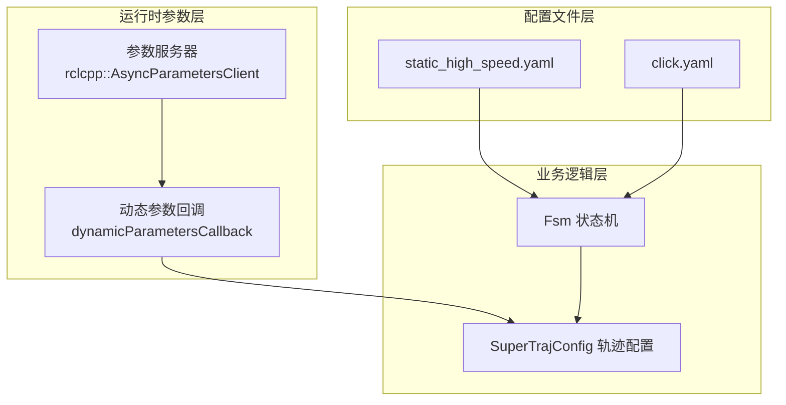
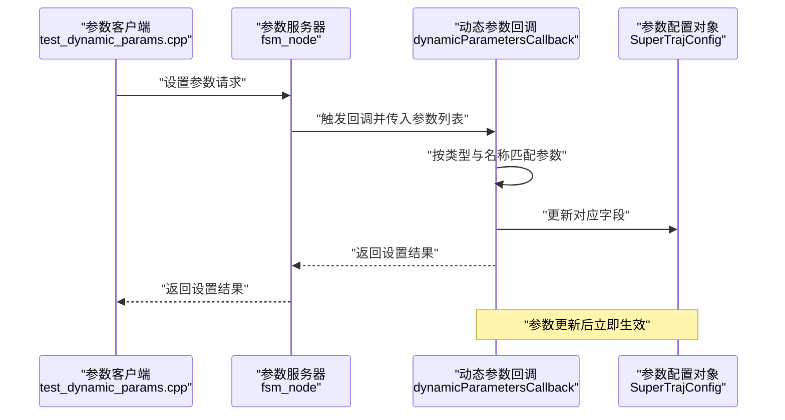
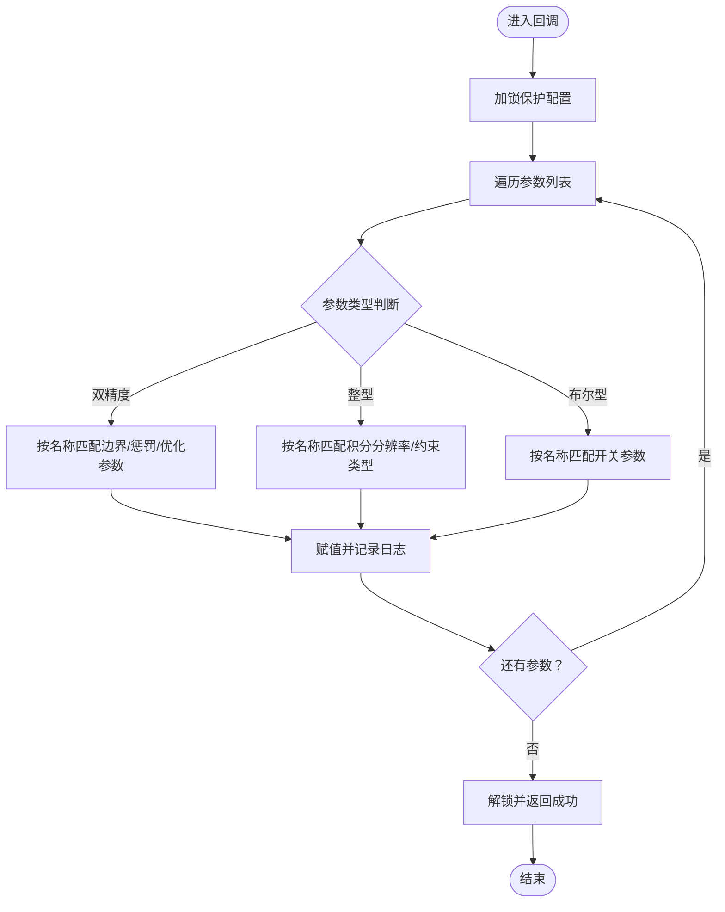
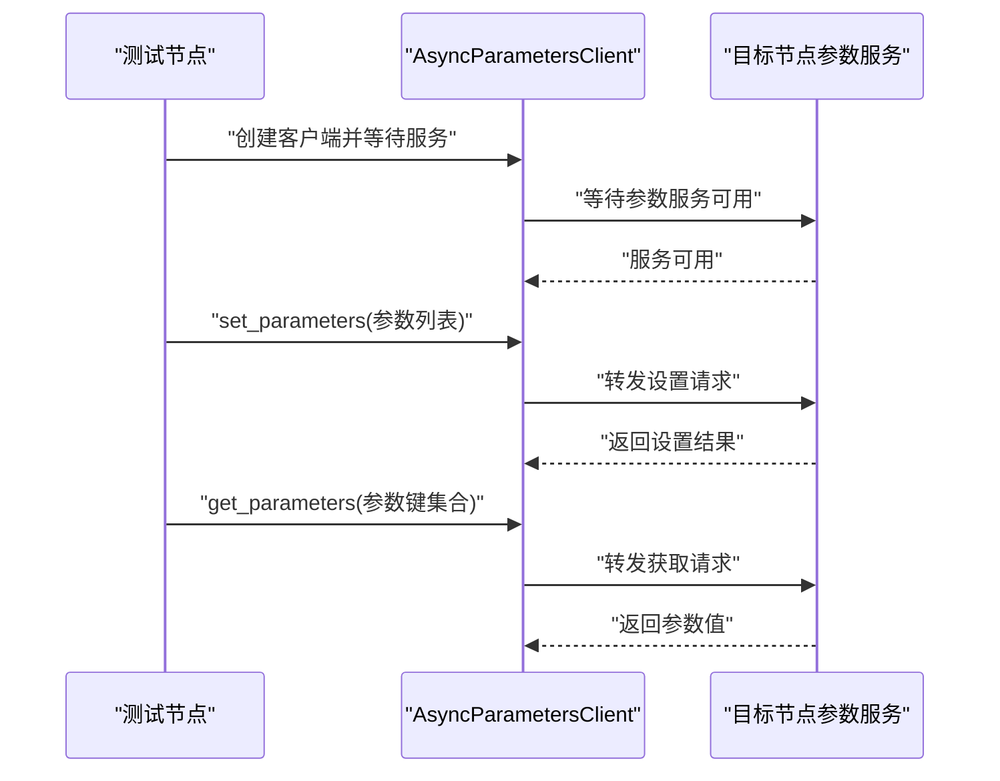
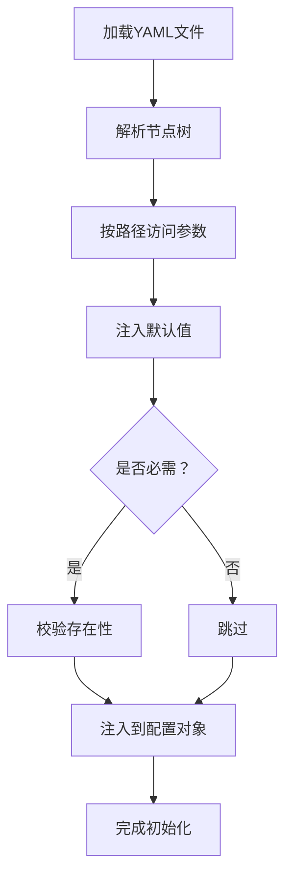
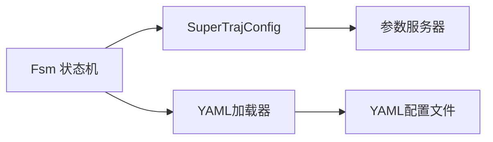

# ROS2参数系统

<cite>
**本文档引用的文件**
- [super_traj_config.h](file://src/SUPER/super_planner/include/traj_opt/super_traj_config.h)
- [test_dynamic_params.cpp](file://src/SUPER/super_planner/test/test_dynamic_params.cpp)
- [static_high_speed.yaml](file://src/SUPER/super_planner/config/static_high_speed.yaml)
- [click.yaml](file://src/SUPER/super_planner/config/click.yaml)
- [fsm.h](file://src/SUPER/super_planner/include/fsm/fsm.h)
- [fsm.cpp](file://src/SUPER/super_planner/src/super_core/fsm.cpp)
- [config.hpp](file://src/SUPER/super_planner/include/fsm/config.hpp)
- [yaml_loader.hpp](file://src/SUPER/mission_planner/include/utils/yaml_loader.hpp)
- [yaml_loader.hpp](file://src/SUPER/mars_uav_sim/perfect_drone_sim/include/utils/yaml_loader.hpp)
- [yaml_loader.hpp](file://src/SUPER/rog_map/include/super_utils/yaml_loader.hpp)
</cite>

## 目录
1. [简介](#简介)
2. [项目结构](#项目结构)
3. [核心组件](#核心组件)
4. [架构总览](#架构总览)
5. [详细组件分析](#详细组件分析)
6. [依赖关系分析](#依赖关系分析)
7. [性能考虑](#性能考虑)
8. [故障排除指南](#故障排除指南)
9. [结论](#结论)
10. [附录](#附录)

## 简介
本文件面向ROS2参数系统的实现与使用，聚焦于动态参数回调机制、参数服务器集成、实时更新流程、参数验证与范围检查、类型验证与依赖关系处理、运行时参数更新的检测与应用机制、参数配置最佳实践（默认值、分组、文档化）、参数与YAML配置文件的映射关系（含继承机制）以及参数调试工具与故障排除方法。内容基于仓库中SUPER规划器的参数系统实现，结合动态参数测试脚本、配置文件与通用YAML加载器，形成一套可操作、可扩展的参数系统文档。

## 项目结构
本项目围绕“状态机节点（fsm_node）”组织参数系统，参数主要分为以下层次：
- 全局配置层：通过YAML文件加载基础参数（如fsm、super_planner、traj_opt等），用于节点启动时初始化。
- 运行时动态参数层：通过ROS2参数服务器暴露可动态更新的参数，供外部工具（如rqt_reconfigure、参数客户端）实时调整。
- 参数验证与应用层：在动态参数回调中进行类型匹配、范围检查与依赖关系处理，确保参数更新的安全性与一致性。

图表来源
- [static_high_speed.yaml](file://src/SUPER/super_planner/config/static_high_speed.yaml#L1-L187)
- [click.yaml](file://src/SUPER/super_planner/config/click.yaml#L1-L190)
- [fsm.h](file://src/SUPER/super_planner/include/fsm/fsm.h#L40-L172)
- [fsm.cpp](file://src/SUPER/super_planner/src/super_core/fsm.cpp#L1-L287)
- [super_traj_config.h](file://src/SUPER/super_planner/include/traj_opt/super_traj_config.h#L37-L179)

章节来源
- [static_high_speed.yaml](file://src/SUPER/super_planner/config/static_high_speed.yaml#L1-L187)
- [click.yaml](file://src/SUPER/super_planner/config/click.yaml#L1-L190)
- [fsm.h](file://src/SUPER/super_planner/include/fsm/fsm.h#L40-L172)
- [fsm.cpp](file://src/SUPER/super_planner/src/super_core/fsm.cpp#L1-L287)
- [super_traj_config.h](file://src/SUPER/super_planner/include/traj_opt/super_traj_config.h#L37-L179)

## 核心组件
- 动态参数回调类：提供动态参数更新入口，负责参数类型识别、名称匹配、赋值与日志输出，并返回设置结果。
- 参数客户端：用于外部节点发起参数设置/获取请求，连接目标节点的参数服务。
- YAML加载器：统一从YAML文件加载参数，支持路径访问与默认值注入。
- 状态机节点：承载参数服务器注册、动态参数回调注册与参数应用的协调者。

章节来源
- [super_traj_config.h](file://src/SUPER/super_planner/include/traj_opt/super_traj_config.h#L66-L167)
- [test_dynamic_params.cpp](file://src/SUPER/super_planner/test/test_dynamic_params.cpp#L10-L107)
- [yaml_loader.hpp](file://src/SUPER/mission_planner/include/utils/yaml_loader.hpp#L44-L58)

## 架构总览
动态参数更新的端到端流程如下：
- 外部节点通过参数客户端向目标节点（fsm_node）发送参数设置请求。
- 目标节点的参数服务器接收请求并触发动态参数回调。
- 回调函数根据参数名称与类型进行匹配与赋值，必要时进行范围检查与依赖关系处理。
- 应用后的参数立即生效，供业务逻辑（如轨迹优化器）读取使用。

图表来源
- [test_dynamic_params.cpp](file://src/SUPER/super_planner/test/test_dynamic_params.cpp#L37-L103)
- [super_traj_config.h](file://src/SUPER/super_planner/include/traj_opt/super_traj_config.h#L72-L167)

## 详细组件分析

### 动态参数回调机制
- 回调入口：在配置类中定义动态参数回调函数，接收参数列表并逐项处理。
- 线程安全：回调内部使用互斥锁保护共享配置，避免并发更新导致的数据竞争。
- 类型与名称匹配：根据参数类型（double/int/bool）与完整参数名进行精确匹配，分别更新对应字段。
- 日志输出：每次参数更新都会输出日志，便于调试与审计。
- 结果返回：回调返回标准设置结果消息，指示本次更新是否成功。

图表来源
- [super_traj_config.h](file://src/SUPER/super_planner/include/traj_opt/super_traj_config.h#L72-L167)

章节来源
- [super_traj_config.h](file://src/SUPER/super_planner/include/traj_opt/super_traj_config.h#L66-L167)

### 参数服务器集成与实时更新
- 参数客户端：测试脚本展示了如何创建异步参数客户端并等待目标节点参数服务可用。
- 请求与响应：通过设置参数与获取参数接口实现双向交互；设置参数返回批量结果，获取参数返回参数值。
- 实时性：参数更新通过回调即时应用，业务逻辑可直接读取最新值。

图表来源
- [test_dynamic_params.cpp](file://src/SUPER/super_planner/test/test_dynamic_params.cpp#L13-L103)

章节来源
- [test_dynamic_params.cpp](file://src/SUPER/super_planner/test/test_dynamic_params.cpp#L10-L118)

### 参数验证系统设计
- 类型验证：回调中严格区分double/int/bool类型，避免错误赋值。
- 范围检查：可在回调中增加范围校验逻辑（如最大速度、加速度等），若越界则拒绝更新并返回失败。
- 依赖关系处理：对于存在依赖关系的参数（如积分分辨率影响优化精度），可在回调中进行联动校验与提示。
- 建议：将验证规则集中在一个验证函数中，便于维护与扩展。

章节来源
- [super_traj_config.h](file://src/SUPER/super_planner/include/traj_opt/super_traj_config.h#L72-L167)

### 运行时参数更新的实现细节
- 参数变更检测：回调逐项处理参数，无需额外的变更检测逻辑，因为参数服务器已保证传入的是待更新的参数。
- 配置应用机制：回调内直接对成员变量赋值，配合互斥锁确保读写安全；业务逻辑在使用前获取锁，避免读取到中间状态。
- 生效时机：参数更新完成后立即生效，无需重启节点。

章节来源
- [super_traj_config.h](file://src/SUPER/super_planner/include/traj_opt/super_traj_config.h#L72-L176)

### 参数配置最佳实践
- 默认值设置：在配置类中为每个参数提供合理默认值，确保无配置文件或缺失键时仍可正常运行。
- 参数分组：按照功能域（如边界约束、惩罚系数、优化参数）进行分组，提升可读性与可维护性。
- 文档化策略：在配置文件中添加注释说明参数含义、单位与典型取值范围；在代码中补充参数用途与约束。
- 可观测性：为关键参数添加日志输出，便于追踪参数变化与问题定位。

章节来源
- [static_high_speed.yaml](file://src/SUPER/super_planner/config/static_high_speed.yaml#L42-L95)
- [click.yaml](file://src/SUPER/super_planner/config/click.yaml#L46-L102)
- [super_traj_config.h](file://src/SUPER/super_planner/include/traj_opt/super_traj_config.h#L42-L64)

### 参数与配置文件的映射关系
- YAML文件解析：通过通用YAML加载器按路径访问参数，支持默认值注入与必填项校验。
- 参数继承机制：可通过多级YAML文件组合实现参数继承与覆盖；加载器支持斜杠路径访问，便于深层参数定位。
- 启动时初始化：状态机配置类在构造时加载YAML文件，将参数注入到运行时配置对象中。

图表来源
- [yaml_loader.hpp](file://src/SUPER/mission_planner/include/utils/yaml_loader.hpp#L44-L58)
- [yaml_loader.hpp](file://src/SUPER/mars_uav_sim/perfect_drone_sim/include/utils/yaml_loader.hpp#L44-L58)
- [yaml_loader.hpp](file://src/SUPER/rog_map/include/super_utils/yaml_loader.hpp#L44-L58)
- [config.hpp](file://src/SUPER/super_planner/include/fsm/config.hpp#L55-L72)

章节来源
- [yaml_loader.hpp](file://src/SUPER/mission_planner/include/utils/yaml_loader.hpp#L44-L58)
- [yaml_loader.hpp](file://src/SUPER/mars_uav_sim/perfect_drone_sim/include/utils/yaml_loader.hpp#L44-L58)
- [yaml_loader.hpp](file://src/SUPER/rog_map/include/super_utils/yaml_loader.hpp#L44-L58)
- [config.hpp](file://src/SUPER/super_planner/include/fsm/config.hpp#L55-L72)

## 依赖关系分析
- 状态机节点依赖配置类与参数服务器，负责参数的注册与回调处理。
- 配置类依赖参数服务器提供的回调接口，实现动态参数更新。
- YAML加载器被多个模块复用，提供统一的参数加载能力。

图表来源
- [fsm.h](file://src/SUPER/super_planner/include/fsm/fsm.h#L40-L172)
- [super_traj_config.h](file://src/SUPER/super_planner/include/traj_opt/super_traj_config.h#L37-L179)
- [yaml_loader.hpp](file://src/SUPER/mission_planner/include/utils/yaml_loader.hpp#L44-L58)

章节来源
- [fsm.h](file://src/SUPER/super_planner/include/fsm/fsm.h#L40-L172)
- [super_traj_config.h](file://src/SUPER/super_planner/include/traj_opt/super_traj_config.h#L37-L179)
- [yaml_loader.hpp](file://src/SUPER/mission_planner/include/utils/yaml_loader.hpp#L44-L58)

## 性能考虑
- 回调锁粒度：在回调中仅对配置对象加锁，避免长时间持锁影响参数服务器响应。
- 参数批量处理：参数客户端支持批量设置，减少网络往返与回调触发次数。
- 日志级别：在高频参数更新场景中，适当降低日志级别，避免I/O成为瓶颈。
- 读写分离：业务逻辑在读取参数时也应获取锁，确保一致性与安全性。

## 故障排除指南
- 参数服务不可用：确认目标节点已启动且参数服务可用；测试脚本提供了等待与重试逻辑。
- 参数设置失败：检查参数名称是否正确、类型是否匹配、是否超出范围；查看回调返回的原因。
- 参数未生效：确认回调已执行且配置对象已被业务逻辑读取；检查锁的使用是否正确。
- YAML加载异常：检查YAML文件语法与路径；确认默认值与必需参数的配置。

章节来源
- [test_dynamic_params.cpp](file://src/SUPER/super_planner/test/test_dynamic_params.cpp#L18-L25)
- [test_dynamic_params.cpp](file://src/SUPER/super_planner/test/test_dynamic_params.cpp#L54-L80)
- [super_traj_config.h](file://src/SUPER/super_planner/include/traj_opt/super_traj_config.h#L72-L167)

## 结论
本参数系统通过清晰的分层设计与严格的类型/范围验证，在保证安全性的同时实现了高效的动态参数更新。结合YAML配置文件与通用加载器，既满足启动时的稳定初始化，又支持运行时的灵活调整。建议在实际工程中进一步完善验证规则与依赖关系处理，并加强文档化与可观测性，以提升系统的可维护性与可诊断性。

## 附录
- 关键参数示例（来源于配置文件）
  - 边界约束：最大速度、最大加速度、最大加加速度等
  - 惩罚系数：时间、位置、速度、加速度、加加速度、吸引子、角速度、推力等
  - 优化参数：优化精度、平滑参数、积分分辨率等
  - 算法配置：位置约束类型、是否禁用能量代价等

章节来源
- [static_high_speed.yaml](file://src/SUPER/super_planner/config/static_high_speed.yaml#L42-L95)
- [click.yaml](file://src/SUPER/super_planner/config/click.yaml#L46-L102)
- [super_traj_config.h](file://src/SUPER/super_planner/include/traj_opt/super_traj_config.h#L42-L64)