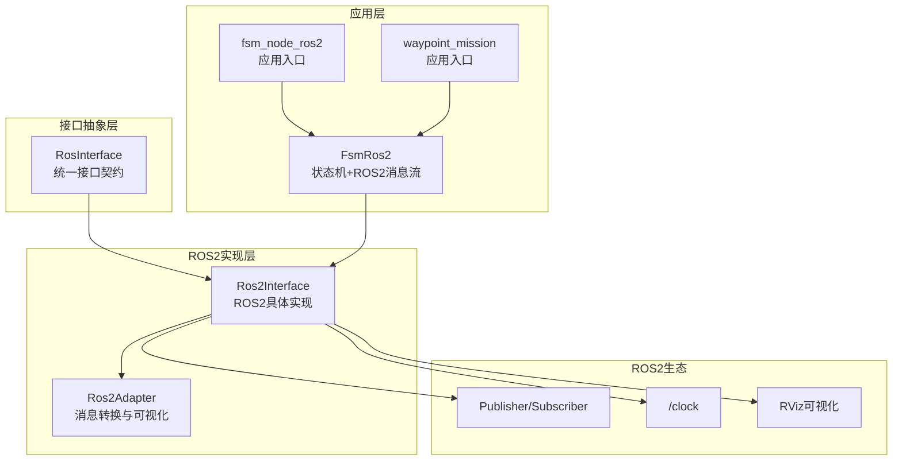
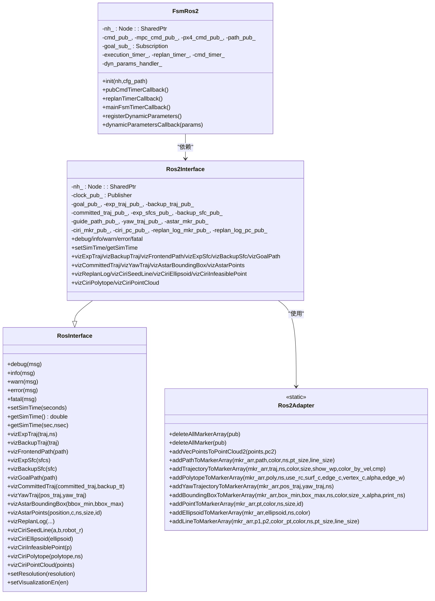
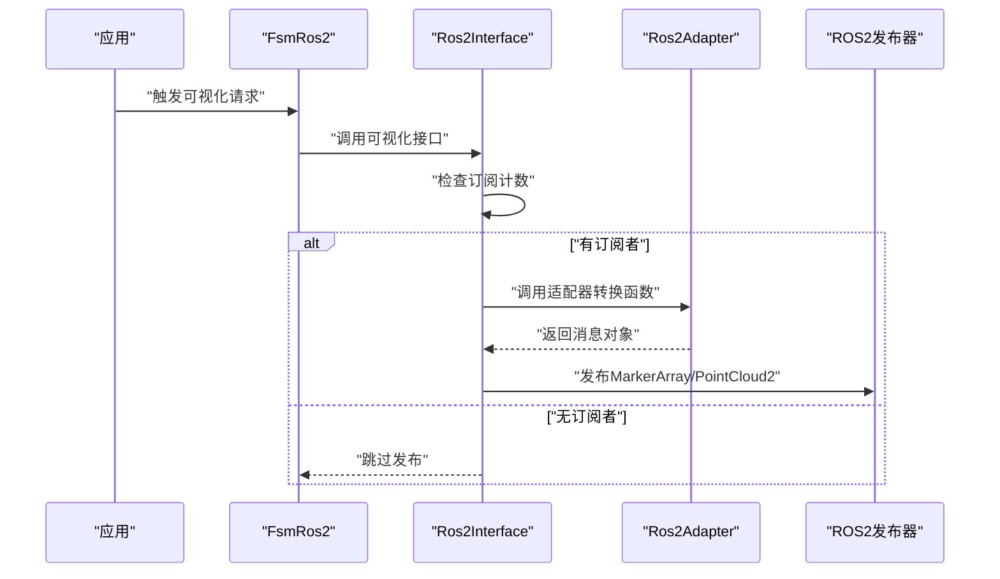
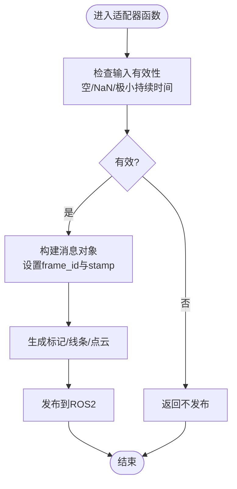
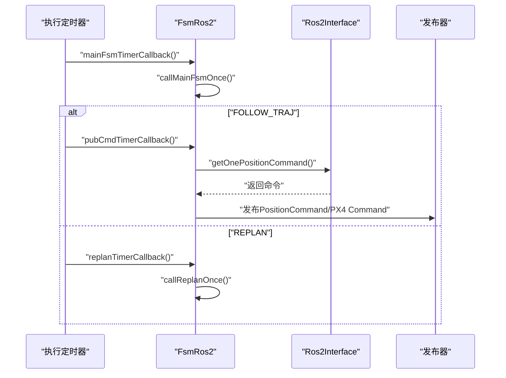
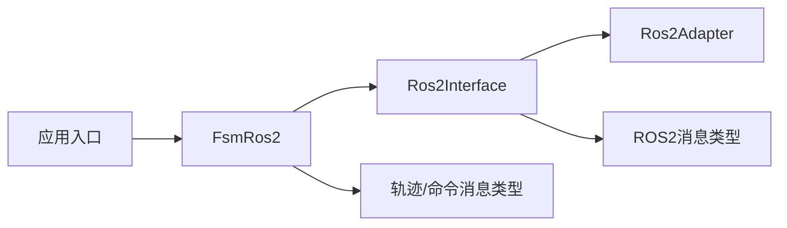

# ROS2接口层实现

<cite>
**本文档引用的文件**
- [ros_interface.hpp](file://src/SUPER/super_planner/include/ros_interface/ros_interface.hpp)
- [ros2_interface.hpp](file://src/SUPER/super_planner/include/ros_interface/ros2/ros2_interface.hpp)
- [ros2_adapter.hpp](file://src/SUPER/super_planner/include/ros_interface/ros2/ros2_adapter.hpp)
- [fsm_ros2.hpp](file://src/SUPER/super_planner/include/ros_interface/ros2/fsm_ros2.hpp)
- [fsm_node_ros2.cpp](file://src/SUPER/super_planner/Apps/fsm_node_ros2.cpp)
- [ros2_waypoint_mission.cpp](file://src/SUPER/mission_planner/Apps/ros2_waypoint_mission.cpp)
- [ros2_perfect_drone_node.cpp](file://src/SUPER/mars_uav_sim/perfect_drone_sim/src/ros2_perfect_drone_node.cpp)
</cite>

## 目录
1. [引言](#引言)
2. [项目结构](#项目结构)
3. [核心组件](#核心组件)
4. [架构总览](#架构总览)
5. [详细组件分析](#详细组件分析)
6. [依赖关系分析](#依赖关系分析)
7. [性能考虑](#性能考虑)
8. [故障排除指南](#故障排除指南)
9. [结论](#结论)
10. [附录](#附录)

## 引言
本文件面向ROS2接口层实现，系统性阐述RosInterface抽象层设计理念与架构模式，重点覆盖以下方面：
- 接口统一化：通过RosInterface定义跨平台的日志、时间、可视化等通用能力接口，屏蔽底层差异。
- 多平台适配策略：以Ros2Interface为具体实现，对接ROS2生态的消息发布/订阅、时钟与可视化。
- 适配器模式：Ros2Adapter封装消息转换、点云与轨迹可视化等通用逻辑，降低上层耦合。
- FSM ROS2接口：FsmRos2将状态机与ROS2消息流打通，实现轨迹生成、命令发布与动态参数回调。
- 扩展开发指南：提供新增接口类型与修改现有接口的方法论与最佳实践。
- 错误处理与异常恢复：涵盖参数校验、订阅计数检查、空轨迹保护与动态参数回滚策略。

## 项目结构
ROS2接口层位于超级规划器模块中，采用“接口抽象 + 具体实现 + 适配器 + 应用入口”的分层组织方式：
- 抽象接口层：RosInterface定义统一能力契约（日志、时间、可视化）。
- ROS2实现层：Ros2Interface基于rclcpp实现具体接口，并管理多个可视化发布器。
- 适配器层：Ros2Adapter提供消息转换与RViz可视化辅助函数。
- 应用层：FsmRos2集成状态机与ROS2消息流；示例应用包括fsm_node_ros2、waypoint_mission等。

**图表来源**
- [ros_interface.hpp](file://src/SUPER/super_planner/include/ros_interface/ros_interface.hpp#L43-L149)
- [ros2_interface.hpp](file://src/SUPER/super_planner/include/ros_interface/ros2/ros2_interface.hpp#L41-L450)
- [ros2_adapter.hpp](file://src/SUPER/super_planner/include/ros_interface/ros2/ros2_adapter.hpp#L57-L875)
- [fsm_ros2.hpp](file://src/SUPER/super_planner/include/ros_interface/ros2/fsm_ros2.hpp#L41-L537)
- [fsm_node_ros2.cpp](file://src/SUPER/super_planner/Apps/fsm_node_ros2.cpp#L48-L101)

**章节来源**
- [ros_interface.hpp](file://src/SUPER/super_planner/include/ros_interface/ros_interface.hpp#L39-L149)
- [ros2_interface.hpp](file://src/SUPER/super_planner/include/ros_interface/ros2/ros2_interface.hpp#L39-L450)
- [ros2_adapter.hpp](file://src/SUPER/super_planner/include/ros_interface/ros2/ros2_adapter.hpp#L44-L875)
- [fsm_ros2.hpp](file://src/SUPER/super_planner/include/ros_interface/ros2/fsm_ros2.hpp#L40-L537)
- [fsm_node_ros2.cpp](file://src/SUPER/super_planner/Apps/fsm_node_ros2.cpp#L48-L101)

## 核心组件
- RosInterface：定义日志、时间与可视化接口，支持格式化输出与分辨率控制。
- Ros2Interface：继承RosInterface，基于rclcpp实现ROS2节点初始化、时钟发布、可视化发布器管理与多种可视化功能。
- Ros2Adapter：静态工具类，封装MarkerArray、PointCloud2、轨迹/多面体/边界框/点/线等可视化辅助函数，以及点云转换。
- FsmRos2：继承自状态机基类，集成ROS2消息发布（位置命令、多项式轨迹、PX4命令）、订阅（目标位姿）、定时器与动态参数回调。

**章节来源**
- [ros_interface.hpp](file://src/SUPER/super_planner/include/ros_interface/ros_interface.hpp#L43-L149)
- [ros2_interface.hpp](file://src/SUPER/super_planner/include/ros_interface/ros2/ros2_interface.hpp#L41-L450)
- [ros2_adapter.hpp](file://src/SUPER/super_planner/include/ros_interface/ros2/ros2_adapter.hpp#L57-L875)
- [fsm_ros2.hpp](file://src/SUPER/super_planner/include/ros_interface/ros2/fsm_ros2.hpp#L41-L537)

## 架构总览
下图展示Ros2Interface与Ros2Adapter在可视化链路中的协作关系，以及FsmRos2如何通过Ros2Interface与ROS2生态交互。

**图表来源**
- [ros_interface.hpp](file://src/SUPER/super_planner/include/ros_interface/ros_interface.hpp#L43-L149)
- [ros2_interface.hpp](file://src/SUPER/super_planner/include/ros_interface/ros2/ros2_interface.hpp#L41-L450)
- [ros2_adapter.hpp](file://src/SUPER/super_planner/include/ros_interface/ros2/ros2_adapter.hpp#L57-L875)
- [fsm_ros2.hpp](file://src/SUPER/super_planner/include/ros_interface/ros2/fsm_ros2.hpp#L41-L537)

## 详细组件分析

### RosInterface抽象层
- 设计理念：通过纯虚函数定义统一接口，确保不同平台（如ROS2、未来可能的其他框架）可无缝替换。
- 关键能力：
  - 日志接口：支持格式化输出，便于统一日志风格。
  - 时间接口：提供仿真时间设置与获取，兼容ROS2时钟。
  - 可视化接口：涵盖轨迹、多面体、路径、边界框、偏航箭头、CIRI相关可视化等。
  - 参数控制：分辨率与可视化开关，便于调试与性能权衡。

**章节来源**
- [ros_interface.hpp](file://src/SUPER/super_planner/include/ros_interface/ros_interface.hpp#L43-L149)

### Ros2Interface实现
- 节点初始化与QoS策略：构造函数中创建多个可视化发布器，统一使用可靠、环形缓冲、易失持久性的QoS。
- 日志与时间：
  - 日志：直接委托rclcpp日志接口。
  - 仿真时钟：通过Clock消息发布/获取，支持秒与纳秒拆分。
- 可视化发布流程：
  - 订阅计数检查：若无订阅者则提前返回，避免无效发布。
  - 清理旧标记：发布前先删除所有标记，确保RViz显示一致性。
  - 适配器调用：将轨迹、路径、多面体等几何对象转换为MarkerArray或PointCloud2后发布。
- 特定可视化：
  - 已发布轨迹与备份轨迹：支持航路点显示与按速度着色。
  - 偏航轨迹：按时间映射颜色生成箭头序列。
  - A*与CIRI调试：边界框、点云、椭球体、种子线等。

**图表来源**
- [ros2_interface.hpp](file://src/SUPER/super_planner/include/ros_interface/ros2/ros2_interface.hpp#L120-L266)
- [ros2_adapter.hpp](file://src/SUPER/super_planner/include/ros_interface/ros2/ros2_adapter.hpp#L111-L186)

**章节来源**
- [ros2_interface.hpp](file://src/SUPER/super_planner/include/ros_interface/ros2/ros2_interface.hpp#L41-L450)
- [ros2_adapter.hpp](file://src/SUPER/super_planner/include/ros_interface/ros2/ros2_adapter.hpp#L57-L875)

### Ros2Adapter适配器
- 核心职责：封装消息转换与RViz可视化辅助，降低上层对具体消息类型的依赖。
- 主要功能：
  - 点云转换：Vec3f向量数组转PointCloud2。
  - 路径/轨迹/多面体/边界框/点/线/椭球体可视化：生成MarkerArray。
  - 颜色映射：支持Jet等颜色映射，按速度或时间插值。
  - 安全检查：对NaN、空轨迹、空路径等进行保护。
- 性能特性：使用静态方法减少对象开销；合理设置采样间隔与尺寸，平衡精度与渲染性能。

**图表来源**
- [ros2_adapter.hpp](file://src/SUPER/super_planner/include/ros_interface/ros2/ros2_adapter.hpp#L87-L100)
- [ros2_adapter.hpp](file://src/SUPER/super_planner/include/ros_interface/ros2/ros2_adapter.hpp#L209-L280)
- [ros2_adapter.hpp](file://src/SUPER/super_planner/include/ros_interface/ros2/ros2_adapter.hpp#L356-L563)

**章节来源**
- [ros2_adapter.hpp](file://src/SUPER/super_planner/include/ros_interface/ros2/ros2_adapter.hpp#L57-L875)

### FSM ROS2接口（FsmRos2）
- 角色定位：连接状态机与ROS2消息生态，负责命令发布、轨迹发布、目标订阅与动态参数回调。
- 关键实现要点：
  - 发布器与订阅器：位置命令、多项式轨迹、PX4命令、路径、目标位姿。
  - 定时器：执行周期、命令发布周期、重规划周期，分别对应状态机推进、命令下发与轨迹重规划。
  - 回调组：为不同任务分配独立回调组，避免阻塞。
  - 动态参数：声明参数并在参数服务器更新时回调，同步到轨迹优化器配置。
  - 日志记录：保存重规划日志与命令CSV，便于离线分析。
- 状态机与ROS2消息映射：
  - FOLLOW_TRAJ状态下周期发布位置命令与心跳轨迹，同时将命令转换为PX4期望的四元数形式。
  - TRAJ_FINISH时切换状态至WAIT_GOAL或GENERATE_TRAJ，确保闭环行为一致。

**图表来源**
- [fsm_ros2.hpp](file://src/SUPER/super_planner/include/ros_interface/ros2/fsm_ros2.hpp#L325-L356)
- [fsm_ros2.hpp](file://src/SUPER/super_planner/include/ros_interface/ros2/fsm_ros2.hpp#L372-L431)
- [fsm_ros2.hpp](file://src/SUPER/super_planner/include/ros_interface/ros2/fsm_ros2.hpp#L433-L439)

**章节来源**
- [fsm_ros2.hpp](file://src/SUPER/super_planner/include/ros_interface/ros2/fsm_ros2.hpp#L41-L537)

### 应用入口与示例
- fsm_node_ros2：创建节点、参数处理、初始化FsmRos2并启动多线程执行器。
- waypoint_mission：演示路径规划应用的节点创建与执行器启动。
- perfect_drone_node：演示简单模型节点的创建与spin。

**章节来源**
- [fsm_node_ros2.cpp](file://src/SUPER/super_planner/Apps/fsm_node_ros2.cpp#L48-L101)
- [ros2_waypoint_mission.cpp](file://src/SUPER/mission_planner/Apps/ros2_waypoint_mission.cpp#L11-L22)
- [ros2_perfect_drone_node.cpp](file://src/SUPER/mars_uav_sim/perfect_drone_sim/src/ros2_perfect_drone_node.cpp#L4-L10)

## 依赖关系分析
- Ros2Interface依赖rclcpp与ROS2消息类型（Clock、MarkerArray、PointCloud2等），并通过Ros2Adapter完成消息转换。
- FsmRos2依赖Ros2Interface、轨迹消息类型（PositionCommand、PolynomialTrajectory）与px4ctrl消息类型，同时管理多个定时器与回调组。
- Ros2Adapter作为纯静态工具类，被Ros2Interface广泛调用，形成清晰的分层与低耦合。

**图表来源**
- [ros2_interface.hpp](file://src/SUPER/super_planner/include/ros_interface/ros2/ros2_interface.hpp#L27-L38)
- [ros2_adapter.hpp](file://src/SUPER/super_planner/include/ros_interface/ros2/ros2_adapter.hpp#L27-L42)
- [fsm_ros2.hpp](file://src/SUPER/super_planner/include/ros_interface/ros2/fsm_ros2.hpp#L29-L37)

**章节来源**
- [ros2_interface.hpp](file://src/SUPER/super_planner/include/ros_interface/ros2/ros2_interface.hpp#L27-L38)
- [ros2_adapter.hpp](file://src/SUPER/super_planner/include/ros_interface/ros2/ros2_adapter.hpp#L27-L42)
- [fsm_ros2.hpp](file://src/SUPER/super_planner/include/ros_interface/ros2/fsm_ros2.hpp#L29-L37)

## 性能考虑
- QoS与可靠性：统一使用可靠、环形缓冲、易失持久性QoS，确保可视化消息稳定传输。
- 订阅计数检查：在发布前检查订阅数量，避免无效网络负载。
- 采样与渲染：轨迹可视化采用固定步长采样，兼顾精度与性能；颜色映射使用高效查找表。
- 多线程执行器：应用入口使用多线程执行器，分离不同回调组，提升并发处理能力。
- 点云转换：使用PCL高效转换，设置合理的frame_id与时间戳。

[本节为通用指导，无需特定文件分析]

## 故障排除指南
- 无订阅者导致不发布：Ros2Interface在发布前检查订阅计数，若为0则直接返回。可通过确认RViz或订阅节点是否启动排查。
- 空轨迹/NaN保护：Ros2Adapter对空轨迹、极小持续时间与NaN进行保护，避免异常渲染。建议在上层逻辑中增加轨迹有效性检查。
- 参数未生效：动态参数需在参数服务器更新后触发回调，确认参数声明与回调注册是否正确。
- PX4命令四元数转换：发布前将欧拉角转换为四元数，确保与PX4期望格式一致。
- 日志与CSV导出：保存重规划日志与命令CSV，便于离线分析问题。

**章节来源**
- [ros2_interface.hpp](file://src/SUPER/super_planner/include/ros_interface/ros2/ros2_interface.hpp#L120-L131)
- [ros2_adapter.hpp](file://src/SUPER/super_planner/include/ros_interface/ros2/ros2_adapter.hpp#L209-L215)
- [fsm_ros2.hpp](file://src/SUPER/super_planner/include/ros_interface/ros2/fsm_ros2.hpp#L447-L483)
- [fsm_ros2.hpp](file://src/SUPER/super_planner/include/ros_interface/ros2/fsm_ros2.hpp#L385-L422)

## 结论
该ROS2接口层通过RosInterface抽象统一能力，Ros2Interface与Ros2Adapter实现具体适配与消息转换，FsmRos2将状态机与ROS2消息流深度融合。整体设计具备良好的可扩展性与可维护性，适合在多平台、多任务场景下复用与演进。

[本节为总结，无需特定文件分析]

## 附录

### 接口扩展开发指南
- 新增可视化接口：
  - 在RosInterface中声明新接口签名。
  - 在Ros2Interface中实现具体逻辑，遵循“订阅计数检查 → 清理旧标记 → 适配器转换 → 发布”的流程。
  - 如涉及复杂几何对象，优先在Ros2Adapter中扩展相应转换函数。
- 修改现有接口：
  - 保持RosInterface签名不变，仅调整实现细节。
  - 对Ros2Adapter的转换函数进行增强时，注意输入验证与性能影响。
- 新增消息类型：
  - 在FsmRos2中声明新的发布器/订阅器，配置QoS与回调组。
  - 在init中完成创建与绑定，在回调中完成消息转换与发布。
- 动态参数：
  - 在FsmRos2中声明参数并在回调中同步到优化器配置，必要时提供回滚策略。

**章节来源**
- [ros_interface.hpp](file://src/SUPER/super_planner/include/ros_interface/ros_interface.hpp#L56-L149)
- [ros2_interface.hpp](file://src/SUPER/super_planner/include/ros_interface/ros2/ros2_interface.hpp#L41-L117)
- [ros2_adapter.hpp](file://src/SUPER/super_planner/include/ros_interface/ros2/ros2_adapter.hpp#L57-L875)
- [fsm_ros2.hpp](file://src/SUPER/super_planner/include/ros_interface/ros2/fsm_ros2.hpp#L489-L535)