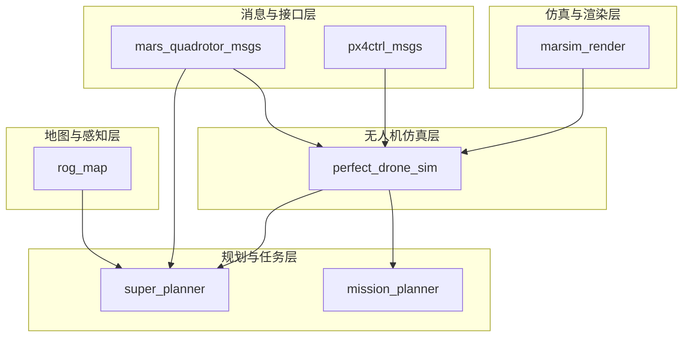
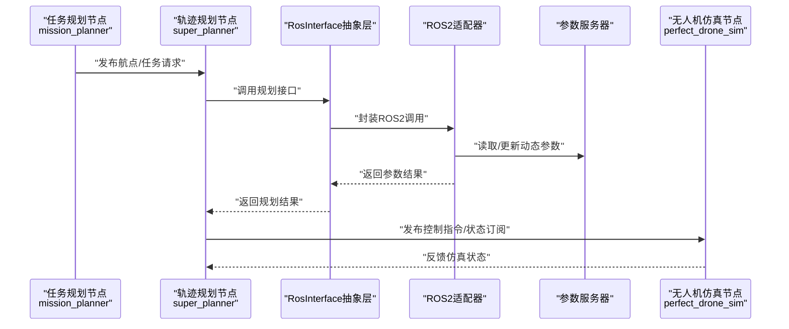
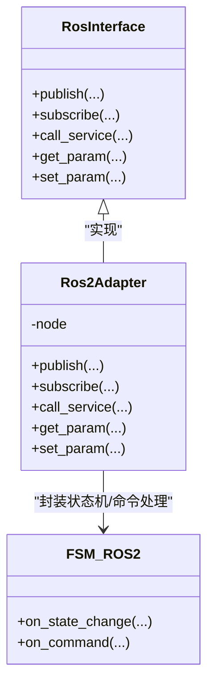
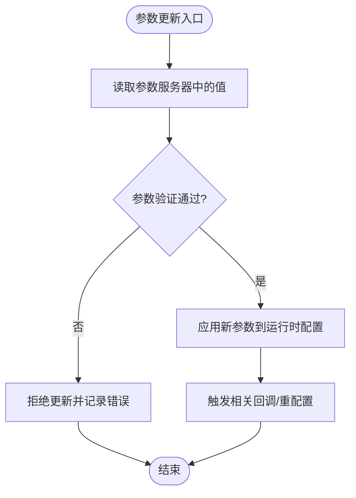
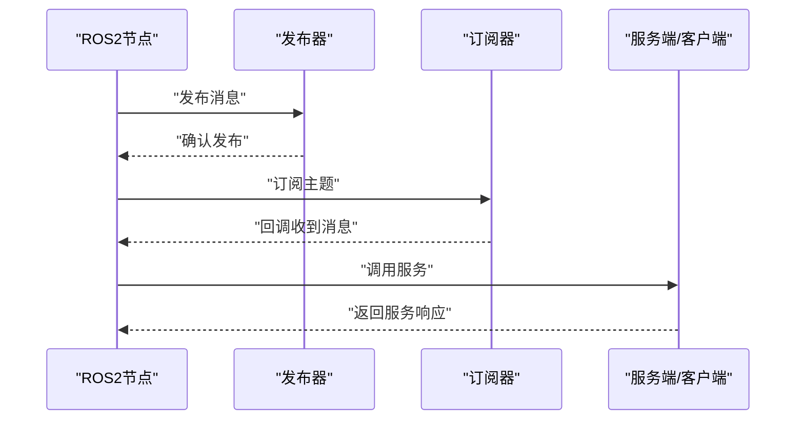
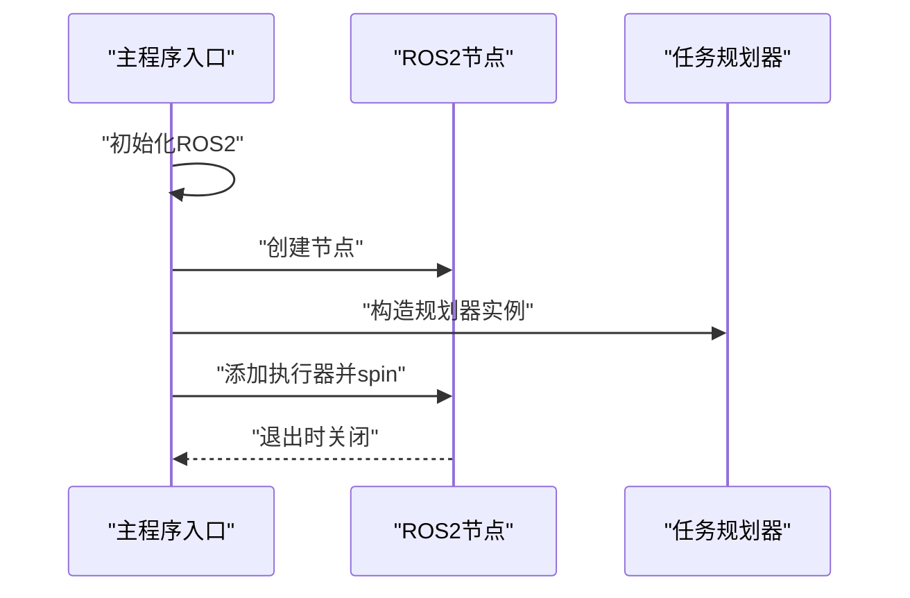
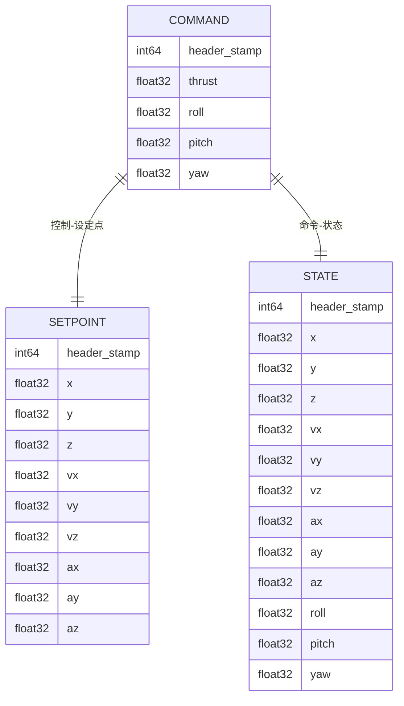
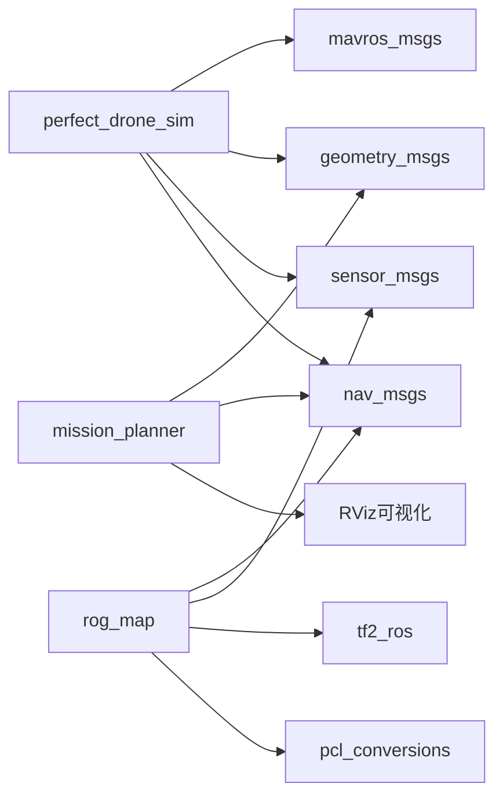
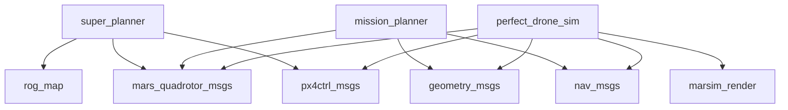

# ROS2集成与接口

<cite>
**本文引用的文件**
- [mars_quadrotor_msgs/package.xml](file://src/SUPER/mars_uav_sim/mars_quadrotor_msgs/package.xml)
- [marsim_render/package.xml](file://src/SUPER/mars_uav_sim/marsim_render/package.xml)
- [perfect_drone_sim/package.xml](file://src/SUPER/mars_uav_sim/perfect_drone_sim/package.xml)
- [px4ctrl_msgs/package.xml](file://src/SUPER/mars_uav_sim/px4ctrl_msgs/package.xml)
- [mission_planner/package.xml](file://src/SUPER/mission_planner/package.xml)
- [rog_map/package.xml](file://src/SUPER/rog_map/package.xml)
- [super_planner/package.xml](file://src/SUPER/super_planner/package.xml)
- [ros2_waypoint_mission.cpp](file://src/SUPER/mission_planner/Apps/ros2_waypoint_mission.cpp)
- [ros2_interface.hpp](file://src/SUPER/super_planner/include/ros_interface/ros2/ros2_interface.hpp)
- [ros2_adapter.hpp](file://src/SUPER/super_planner/include/ros_interface/ros2/ros2_adapter.hpp)
- [ros_interface.hpp](file://src/SUPER/super_planner/include/ros_interface/ros_interface.hpp)
- [fsm_ros2.hpp](file://src/SUPER/super_planner/include/ros_interface/ros2/fsm_ros2.hpp)
- [rog_map_ros2.hpp](file://src/SUPER/rog_map/include/rog_map_ros/rog_map_ros2.hpp)
- [MpcPositionCommand.msg](file://src/SUPER/mars_uav_sim/mars_quadrotor_msgs/ros2_msg/MpcPositionCommand.msg)
- [PositionCommand.msg](file://src/SUPER/mars_uav_sim/mars_quadrotor_msgs/ros2_msg/PositionCommand.msg)
- [QuadrotorState.msg](file://src/SUPER/mars_uav_sim/mars_quadrotor_msgs/ros2_msg/QuadrotorState.msg)
- [Command.msg](file://src/SUPER/mars_uav_sim/px4ctrl_msgs/msg/Command.msg)
- [Setpoint.msg](file://src/SUPER/mars_uav_sim/px4ctrl_msgs/msg/Setpoint.msg)
- [State.msg](file://src/SUPER/mars_uav_sim/px4ctrl_msgs/msg/State.msg)
- [GetReference.srv](file://src/SUPER/mars_uav_sim/px4ctrl_msgs/srv/GetReference.srv)
- [StepSim.srv](file://src/SUPER/mars_uav_sim/px4ctrl_msgs/srv/StepSim.srv)
- [test_dynamic_params.cpp](file://src/SUPER/super_planner/test/test_dynamic_params.cpp)
</cite>

## 目录
1. [引言](#引言)
2. [项目结构](#项目结构)
3. [核心组件](#核心组件)
4. [架构总览](#架构总览)
5. [详细组件分析](#详细组件分析)
6. [依赖分析](#依赖分析)
7. [性能考虑](#性能考虑)
8. [故障排除指南](#故障排除指南)
9. [结论](#结论)
10. [附录](#附录)

## 引言
本文件面向ROS2集成与接口的开发者与使用者，系统性梳理SUPER项目中各ROS2包的结构、依赖关系与节点注册机制；深入解析RosInterface抽象层设计、ROS2适配器实现与参数服务器集成；详解动态参数回调与参数验证体系；全面说明ROS2接口层（话题发布订阅、服务接口、动作服务器）的实现方式；提供PX4飞控系统的消息格式转换与控制命令发送指南；解释与第三方系统的通信协议与数据交换格式；给出ROS2调试工具使用方法与故障排除建议；最后提供自定义ROS2接口的开发指南。

## 项目结构
本仓库采用按功能域分层的组织方式：顶层为SUPER包集合，内部包含多套ROS2包，涵盖消息定义、仿真渲染、无人机仿真、地图构建、轨迹规划与任务规划等模块。每个子包均包含独立的CMakeLists.txt与package.xml，遵循ROS2标准构建与依赖声明规范。

- 消息与接口层：mars_quadrotor_msgs、px4ctrl_msgs负责自定义消息与服务的定义与生成。
- 仿真与渲染层：marsim_render提供渲染与可视化支持。
- 无人机仿真层：perfect_drone_sim整合传感器、控制消息与渲染模块。
- 地图与感知层：rog_map提供基于ROS2的地图构建与服务接口。
- 规划与任务层：super_planner与mission_planner分别提供轨迹规划与航点任务管理，二者通过RosInterface抽象层对接ROS2。

**图表来源**
- [perfect_drone_sim/package.xml](file://src/SUPER/mars_uav_sim/perfect_drone_sim/package.xml#L1-L20)
- [super_planner/package.xml](file://src/SUPER/super_planner/package.xml#L1-L21)
- [mission_planner/package.xml](file://src/SUPER/mission_planner/package.xml#L1-L19)
- [rog_map/package.xml](file://src/SUPER/rog_map/package.xml#L1-L27)

**章节来源**
- [perfect_drone_sim/package.xml](file://src/SUPER/mars_uav_sim/perfect_drone_sim/package.xml#L1-L20)
- [super_planner/package.xml](file://src/SUPER/super_planner/package.xml#L1-L21)
- [mission_planner/package.xml](file://src/SUPER/mission_planner/package.xml#L1-L19)
- [rog_map/package.xml](file://src/SUPER/rog_map/package.xml#L1-L27)

## 核心组件
本节聚焦于RosInterface抽象层与ROS2适配器，以及关键消息与服务类型，帮助读者快速把握系统接口设计与数据流。

- RosInterface抽象层：统一规划器与ROS2之间的接口契约，屏蔽具体通信细节，便于扩展与替换。
- ROS2适配器：实现RosInterface到具体ROS2节点、话题、服务、参数服务器的映射。
- 参数服务器集成：通过动态参数回调与参数验证，实现运行时参数更新与安全校验。
- 自定义消息与服务：mars_quadrotor_msgs与px4ctrl_msgs提供飞行状态、控制指令与参考查询等能力。

**章节来源**
- [ros_interface.hpp](file://src/SUPER/super_planner/include/ros_interface/ros_interface.hpp)
- [ros2_adapter.hpp](file://src/SUPER/super_planner/include/ros_interface/ros2/ros2_adapter.hpp)
- [ros2_interface.hpp](file://src/SUPER/super_planner/include/ros_interface/ros2/ros2_interface.hpp)
- [test_dynamic_params.cpp](file://src/SUPER/super_planner/test/test_dynamic_params.cpp)

## 架构总览
下图展示从任务规划到无人机仿真再到参数服务器的整体交互流程，体现RosInterface抽象层在其中的桥梁作用。

**图表来源**
- [ros2_waypoint_mission.cpp](file://src/SUPER/mission_planner/Apps/ros2_waypoint_mission.cpp#L1-L23)
- [ros2_adapter.hpp](file://src/SUPER/super_planner/include/ros_interface/ros2/ros2_adapter.hpp)
- [ros2_interface.hpp](file://src/SUPER/super_planner/include/ros_interface/ros2/ros2_interface.hpp)
- [perfect_drone_sim/package.xml](file://src/SUPER/mars_uav_sim/perfect_drone_sim/package.xml#L1-L20)

## 详细组件分析

### RosInterface抽象层与ROS2适配器
RosInterface作为统一接口，屏蔽底层通信细节；ROS2适配器实现具体的消息发布、订阅、服务调用与参数访问逻辑。该设计使上层规划器无需关心ROS2细节，提升可维护性与可移植性。

**图表来源**
- [ros_interface.hpp](file://src/SUPER/super_planner/include/ros_interface/ros_interface.hpp)
- [ros2_adapter.hpp](file://src/SUPER/super_planner/include/ros_interface/ros2/ros2_adapter.hpp)
- [fsm_ros2.hpp](file://src/SUPER/super_planner/include/ros_interface/ros2/fsm_ros2.hpp)

**章节来源**
- [ros_interface.hpp](file://src/SUPER/super_planner/include/ros_interface/ros_interface.hpp)
- [ros2_adapter.hpp](file://src/SUPER/super_planner/include/ros_interface/ros2/ros2_adapter.hpp)
- [fsm_ros2.hpp](file://src/SUPER/super_planner/include/ros_interface/ros2/fsm_ros2.hpp)

### 动态参数回调与参数验证系统
动态参数通过参数服务器进行集中管理，结合回调函数实现实时更新；参数验证确保参数范围与一致性，避免非法配置导致系统异常。

**图表来源**
- [test_dynamic_params.cpp](file://src/SUPER/super_planner/test/test_dynamic_params.cpp)

**章节来源**
- [test_dynamic_params.cpp](file://src/SUPER/super_planner/test/test_dynamic_params.cpp)

### ROS2接口层实现（话题、服务、动作）
- 话题发布/订阅：通过Ros2Adapter封装发布器与订阅器，实现状态、命令、轨迹等消息的双向传输。
- 服务接口：封装服务客户端与服务端，用于参考查询与仿真步进等操作。
- 动作服务器：可扩展为轨迹执行或任务调度的动作接口，当前仓库以消息与服务为主。

**图表来源**
- [ros2_adapter.hpp](file://src/SUPER/super_planner/include/ros_interface/ros2/ros2_adapter.hpp)
- [ros2_interface.hpp](file://src/SUPER/super_planner/include/ros_interface/ros2/ros2_interface.hpp)

**章节来源**
- [ros2_adapter.hpp](file://src/SUPER/super_planner/include/ros_interface/ros2/ros2_adapter.hpp)
- [ros2_interface.hpp](file://src/SUPER/super_planner/include/ros_interface/ros2/ros2_interface.hpp)

### 任务规划节点与主程序入口
任务规划节点通过主程序入口初始化ROS2节点，创建规划器实例并启动多线程执行器，保证消息处理与业务逻辑并发运行。

**图表来源**
- [ros2_waypoint_mission.cpp](file://src/SUPER/mission_planner/Apps/ros2_waypoint_mission.cpp#L1-L23)

**章节来源**
- [ros2_waypoint_mission.cpp](file://src/SUPER/mission_planner/Apps/ros2_waypoint_mission.cpp#L1-L23)

### PX4飞控系统集成指南
本项目通过px4ctrl_msgs提供与PX4相关的消息类型，包括命令、设定点与状态，便于在仿真或真实系统中进行消息格式转换与控制命令发送。

- 消息类型
  - Command：控制命令
  - Setpoint：期望设定点
  - State：当前状态
- 服务类型
  - GetReference：获取参考轨迹/目标
  - StepSim：单步仿真推进

**图表来源**
- [Command.msg](file://src/SUPER/mars_uav_sim/px4ctrl_msgs/msg/Command.msg)
- [Setpoint.msg](file://src/SUPER/mars_uav_sim/px4ctrl_msgs/msg/Setpoint.msg)
- [State.msg](file://src/SUPER/mars_uav_sim/px4ctrl_msgs/msg/State.msg)
- [GetReference.srv](file://src/SUPER/mars_uav_sim/px4ctrl_msgs/srv/GetReference.srv)
- [StepSim.srv](file://src/SUPER/mars_uav_sim/px4ctrl_msgs/srv/StepSim.srv)

**章节来源**
- [px4ctrl_msgs/package.xml](file://src/SUPER/mars_uav_sim/px4ctrl_msgs/package.xml#L1-L22)
- [Command.msg](file://src/SUPER/mars_uav_sim/px4ctrl_msgs/msg/Command.msg)
- [Setpoint.msg](file://src/SUPER/mars_uav_sim/px4ctrl_msgs/msg/Setpoint.msg)
- [State.msg](file://src/SUPER/mars_uav_sim/px4ctrl_msgs/msg/State.msg)
- [GetReference.srv](file://src/SUPER/mars_uav_sim/px4ctrl_msgs/srv/GetReference.srv)
- [StepSim.srv](file://src/SUPER/mars_uav_sim/px4ctrl_msgs/srv/StepSim.srv)

### 第三方系统通信协议与数据交换
- 无人机仿真与渲染：perfect_drone_sim依赖mavros_msgs、geometry_msgs、sensor_msgs等，实现与地面站、传感器与渲染模块的数据交换。
- 地图构建：rog_map依赖nav_msgs、sensor_msgs、tf2_ros等，提供地图服务与点云转换接口。
- 任务规划：mission_planner依赖geometry_msgs、nav_msgs等，实现航点任务与RViz可视化。

**图表来源**
- [perfect_drone_sim/package.xml](file://src/SUPER/mars_uav_sim/perfect_drone_sim/package.xml#L1-L20)
- [rog_map/package.xml](file://src/SUPER/rog_map/package.xml#L1-L27)
- [mission_planner/package.xml](file://src/SUPER/mission_planner/package.xml#L1-L19)

**章节来源**
- [perfect_drone_sim/package.xml](file://src/SUPER/mars_uav_sim/perfect_drone_sim/package.xml#L1-L20)
- [rog_map/package.xml](file://src/SUPER/rog_map/package.xml#L1-L27)
- [mission_planner/package.xml](file://src/SUPER/mission_planner/package.xml#L1-L19)

### 自定义ROS2接口开发指南
- 定义消息与服务：在对应包的msg/srv目录下新增消息/服务定义，更新CMake与package.xml，确保生成与导出正确。
- 实现RosInterface适配器：在ros2目录下实现Ros2Adapter的具体方法，封装发布/订阅、服务调用与参数访问。
- 注册节点与launch：在launch目录提供启动脚本，确保节点命名空间与参数服务器配置一致。
- 验证与测试：编写单元测试与动态参数测试，覆盖边界条件与异常场景。

**章节来源**
- [mars_quadrotor_msgs/package.xml](file://src/SUPER/mars_uav_sim/mars_quadrotor_msgs/package.xml#L1-L26)
- [px4ctrl_msgs/package.xml](file://src/SUPER/mars_uav_sim/px4ctrl_msgs/package.xml#L1-L22)
- [ros2_adapter.hpp](file://src/SUPER/super_planner/include/ros_interface/ros2/ros2_adapter.hpp)
- [test_dynamic_params.cpp](file://src/SUPER/super_planner/test/test_dynamic_params.cpp)

## 依赖分析
各包之间的依赖关系清晰，遵循“上层规划依赖底层消息与地图”的原则。super_planner依赖rog_map与自定义消息包，mission_planner依赖mavros_msgs与几何/导航消息，perfect_drone_sim整合多类依赖形成闭环仿真链路。

**图表来源**
- [super_planner/package.xml](file://src/SUPER/super_planner/package.xml#L1-L21)
- [mission_planner/package.xml](file://src/SUPER/mission_planner/package.xml#L1-L19)
- [perfect_drone_sim/package.xml](file://src/SUPER/mars_uav_sim/perfect_drone_sim/package.xml#L1-L20)
- [rog_map/package.xml](file://src/SUPER/rog_map/package.xml#L1-L27)
- [mars_quadrotor_msgs/package.xml](file://src/SUPER/mars_uav_sim/mars_quadrotor_msgs/package.xml#L1-L26)
- [px4ctrl_msgs/package.xml](file://src/SUPER/mars_uav_sim/px4ctrl_msgs/package.xml#L1-L22)

**章节来源**
- [super_planner/package.xml](file://src/SUPER/super_planner/package.xml#L1-L21)
- [mission_planner/package.xml](file://src/SUPER/mission_planner/package.xml#L1-L19)
- [perfect_drone_sim/package.xml](file://src/SUPER/mars_uav_sim/perfect_drone_sim/package.xml#L1-L20)
- [rog_map/package.xml](file://src/SUPER/rog_map/package.xml#L1-L27)
- [mars_quadrotor_msgs/package.xml](file://src/SUPER/mars_uav_sim/mars_quadrotor_msgs/package.xml#L1-L26)
- [px4ctrl_msgs/package.xml](file://src/SUPER/mars_uav_sim/px4ctrl_msgs/package.xml#L1-L22)

## 性能考虑
- 多线程执行器：在任务规划节点中使用多线程执行器，提高并发处理能力，降低消息延迟。
- 参数缓存与批量更新：对频繁读取的参数进行本地缓存，减少参数服务器访问次数；批量更新时采用事务式回调，避免中间态。
- 消息队列与QoS：合理设置订阅QoS与发布QoS，避免丢包与阻塞；对高频消息采用低开销序列化格式。
- 资源隔离：将计算密集型任务（如路径优化）与实时通信任务分离，必要时使用独立线程或进程。

**章节来源**
- [ros2_waypoint_mission.cpp](file://src/SUPER/mission_planner/Apps/ros2_waypoint_mission.cpp#L1-L23)

## 故障排除指南
- 节点无法启动：检查package.xml依赖是否完整，CMake是否正确生成接口；确认launch文件中的节点名与参数服务器路径一致。
- 消息不匹配：核对消息定义版本与生成产物，确保编译顺序正确；使用ros2 interface show验证消息结构。
- 参数未生效：确认参数服务器键名与命名空间；检查动态参数回调是否被注册；查看日志输出定位验证失败原因。
- 仿真卡顿：排查多线程锁竞争与阻塞调用；优化高频订阅的回调频率；启用CPU亲和性与实时策略（在允许范围内）。

**章节来源**
- [test_dynamic_params.cpp](file://src/SUPER/super_planner/test/test_dynamic_params.cpp)

## 结论
本项目通过清晰的包结构与RosInterface抽象层，实现了从任务规划到无人机仿真的完整ROS2集成方案。借助px4ctrl_msgs与自定义消息，系统能够高效完成消息格式转换与控制命令下发；通过参数服务器与动态回调，实现灵活的运行时配置与安全校验。建议在实际部署中进一步完善动作服务器、增强日志与监控能力，并持续优化性能与稳定性。

## 附录
- 常用命令
  - 查看消息：ros2 interface show <包名>/msg/<消息名>
  - 启动包：ros2 launch <包名> <launch文件>
  - 参数设置：ros2 param set /<节点> <参数键> <值>
  - 日志查看：ros2 bag record /<话题> -o <输出目录>
- 参考消息定义
  - 位置/速度/加速度：PositionCommand、MpcPositionCommand、QuadrotorState
  - 控制与状态：Command、Setpoint、State

**章节来源**
- [MpcPositionCommand.msg](file://src/SUPER/mars_uav_sim/mars_quadrotor_msgs/ros2_msg/MpcPositionCommand.msg)
- [PositionCommand.msg](file://src/SUPER/mars_uav_sim/mars_quadrotor_msgs/ros2_msg/PositionCommand.msg)
- [QuadrotorState.msg](file://src/SUPER/mars_uav_sim/mars_quadrotor_msgs/ros2_msg/QuadrotorState.msg)
- [ros2_waypoint_mission.cpp](file://src/SUPER/mission_planner/Apps/ros2_waypoint_mission.cpp#L1-L23)