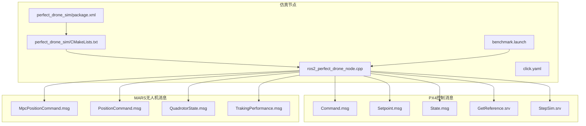
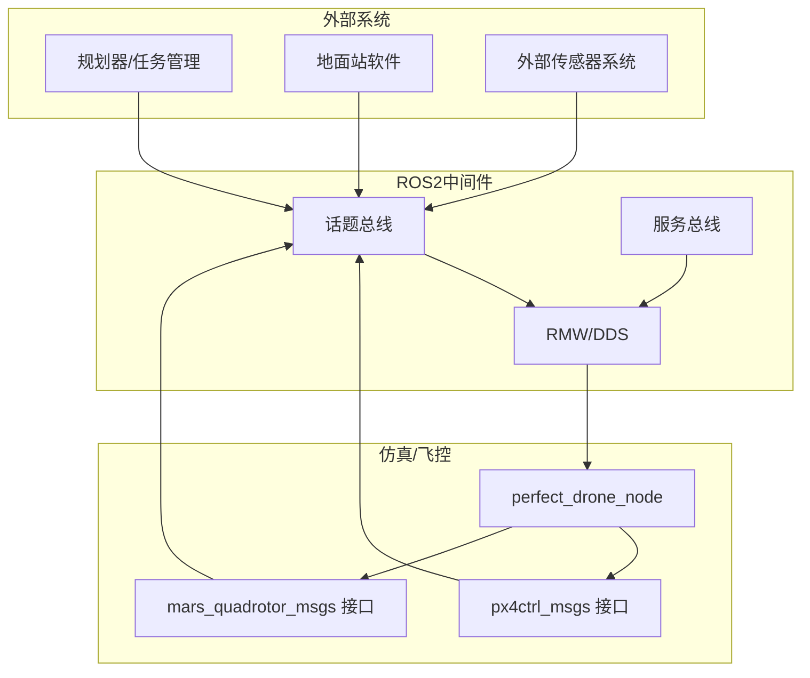
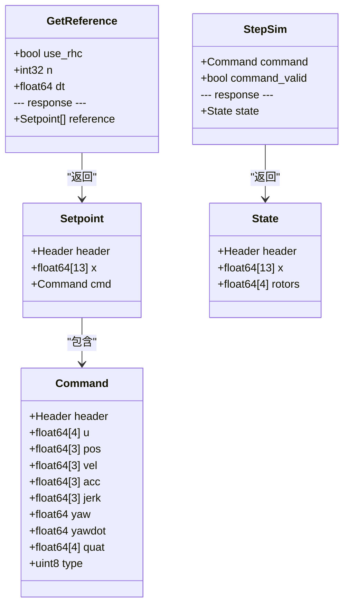
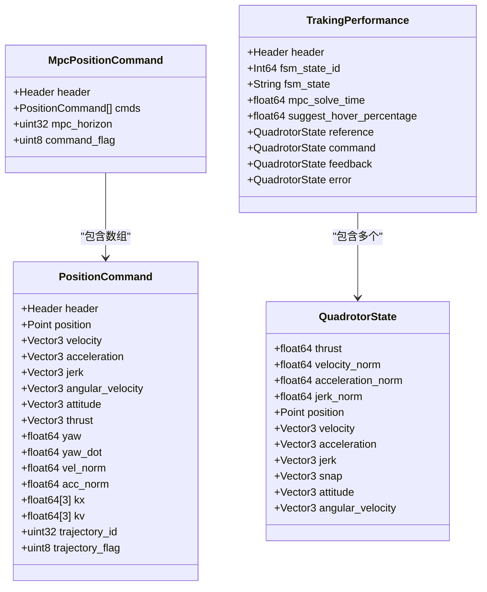
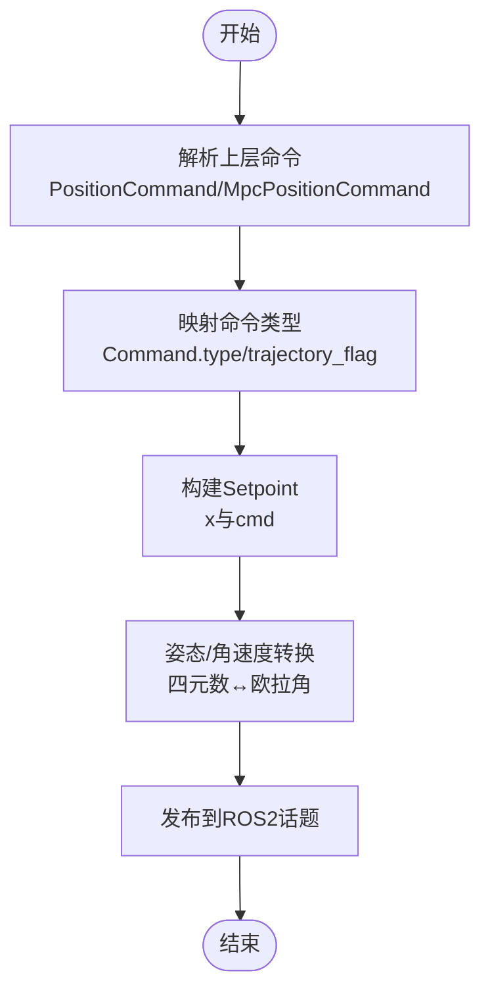
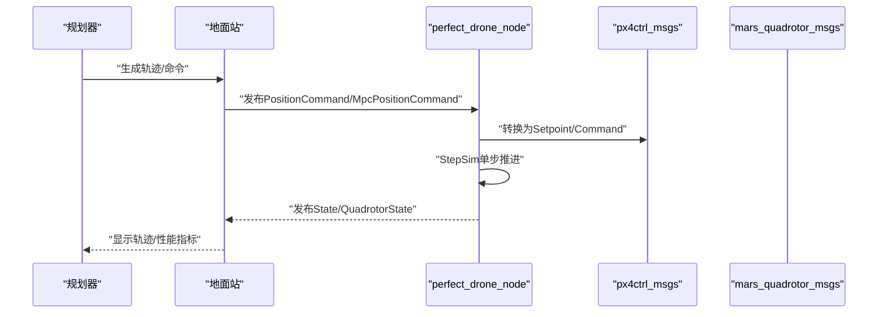
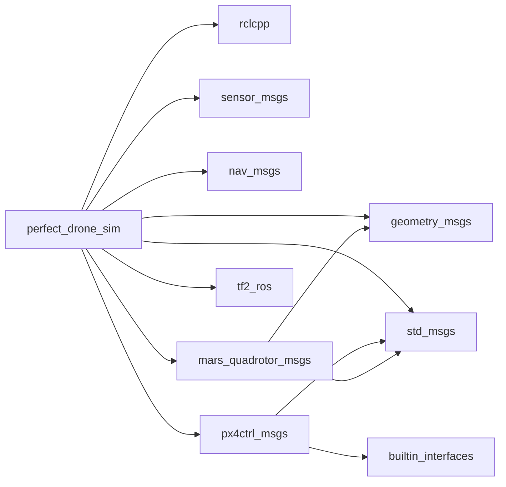

# 第三方系统集成

<cite>
**本文引用的文件**
- [src/SUPER/mars_uav_sim/px4ctrl_msgs/package.xml](file://src/SUPER/mars_uav_sim/px4ctrl_msgs/package.xml)
- [src/SUPER/mars_uav_sim/px4ctrl_msgs/CMakeLists.txt](file://src/SUPER/mars_uav_sim/px4ctrl_msgs/CMakeLists.txt)
- [src/SUPER/mars_uav_sim/px4ctrl_msgs/msg/Command.msg](file://src/SUPER/mars_uav_sim/px4ctrl_msgs/msg/Command.msg)
- [src/SUPER/mars_uav_sim/px4ctrl_msgs/msg/Setpoint.msg](file://src/SUPER/mars_uav_sim/px4ctrl_msgs/msg/Setpoint.msg)
- [src/SUPER/mars_uav_sim/px4ctrl_msgs/msg/State.msg](file://src/SUPER/mars_uav_sim/px4ctrl_msgs/msg/State.msg)
- [src/SUPER/mars_uav_sim/px4ctrl_msgs/srv/GetReference.srv](file://src/SUPER/mars_uav_sim/px4ctrl_msgs/srv/GetReference.srv)
- [src/SUPER/mars_uav_sim/px4ctrl_msgs/srv/StepSim.srv](file://src/SUPER/mars_uav_sim/px4ctrl_msgs/srv/StepSim.srv)
- [src/SUPER/mars_uav_sim/mars_quadrotor_msgs/package.xml](file://src/SUPER/mars_uav_sim/mars_quadrotor_msgs/package.xml)
- [src/SUPER/mars_uav_sim/mars_quadrotor_msgs/CMakeLists.txt](file://src/SUPER/mars_uav_sim/mars_quadrotor_msgs/CMakeLists.txt)
- [src/SUPER/mars_uav_sim/mars_quadrotor_msgs/ros2_msg/MpcPositionCommand.msg](file://src/SUPER/mars_uav_sim/mars_quadrotor_msgs/ros2_msg/MpcPositionCommand.msg)
- [src/SUPER/mars_uav_sim/mars_quadrotor_msgs/ros2_msg/PositionCommand.msg](file://src/SUPER/mars_uav_sim/mars_quadrotor_msgs/ros2_msg/PositionCommand.msg)
- [src/SUPER/mars_uav_sim/mars_quadrotor_msgs/ros2_msg/QuadrotorState.msg](file://src/SUPER/mars_uav_sim/mars_quadrotor_msgs/ros2_msg/QuadrotorState.msg)
- [src/SUPER/mars_uav_sim/mars_quadrotor_msgs/ros2_msg/TrakingPerformance.msg](file://src/SUPER/mars_uav_sim/mars_quadrotor_msgs/ros2_msg/TrakingPerformance.msg)
- [src/SUPER/mars_uav_sim/perfect_drone_sim/package.xml](file://src/SUPER/mars_uav_sim/perfect_drone_sim/package.xml)
- [src/SUPER/mars_uav_sim/perfect_drone_sim/CMakeLists.txt](file://src/SUPER/mars_uav_sim/perfect_drone_sim/CMakeLists.txt)
- [src/SUPER/mars_uav_sim/perfect_drone_sim/src/ros2_perfect_drone_node.cpp](file://src/SUPER/mars_uav_sim/perfect_drone_sim/src/ros2_perfect_drone_node.cpp)
- [src/SUPER/mars_uav_sim/perfect_drone_sim/launch/benchmark.launch](file://src/SUPER/mars_uav_sim/perfect_drone_sim/launch/benchmark.launch)
- [src/SUPER/mars_uav_sim/perfect_drone_sim/config/click.yaml](file://src/SUPER/mars_uav_sim/perfect_drone_sim/config/click.yaml)
</cite>

## 目录
1. [引言](#引言)
2. [项目结构](#项目结构)
3. [核心组件](#核心组件)
4. [架构总览](#架构总览)
5. [详细组件分析](#详细组件分析)
6. [依赖关系分析](#依赖关系分析)
7. [性能考虑](#性能考虑)
8. [故障排查指南](#故障排查指南)
9. [结论](#结论)
10. [附录](#附录)

## 引言
本技术指南面向需要将第三方系统与PX4飞控及MARS无人机消息体系进行集成的工程师与研究者。文档围绕以下目标展开：
- 解释PX4飞控系统的ROS2消息与服务接口，涵盖px4ctrl_msgs的消息类型定义与使用方法。
- 深入描述MARS无人机消息系统，包括MpcPositionCommand、PositionCommand、QuadrotorState等自定义消息的格式与用途。
- 解释消息格式转换机制，包括数据类型映射与协议适配策略。
- 提供与外部传感器系统的通信协议建议，包括数据交换格式与同步机制。
- 说明与地面站软件的接口实现思路，包括命令下发与状态回传。
- 给出集成测试方法与兼容性验证流程。
- 提供故障诊断与性能优化建议。

## 项目结构
该仓库采用按功能域划分的包结构，核心与集成相关的模块如下：
- px4ctrl_msgs：定义PX4风格的控制消息与服务，用于与仿真器或飞控侧进行状态与命令交互。
- mars_quadrotor_msgs：定义MARS无人机专用消息，覆盖轨迹、状态、跟踪性能等。
- perfect_drone_sim：基于上述消息的ROS2节点示例，演示消息发布/订阅与配置加载。
- super_planner、super_ros等上层规划与可视化模块（在本指南中作为外部系统集成对象）。

**图表来源**
- [src/SUPER/mars_uav_sim/px4ctrl_msgs/msg/Command.msg](file://src/SUPER/mars_uav_sim/px4ctrl_msgs/msg/Command.msg#L1-L18)
- [src/SUPER/mars_uav_sim/px4ctrl_msgs/msg/Setpoint.msg](file://src/SUPER/mars_uav_sim/px4ctrl_msgs/msg/Setpoint.msg#L1-L14)
- [src/SUPER/mars_uav_sim/px4ctrl_msgs/msg/State.msg](file://src/SUPER/mars_uav_sim/px4ctrl_msgs/msg/State.msg#L1-L12)
- [src/SUPER/mars_uav_sim/px4ctrl_msgs/srv/GetReference.srv](file://src/SUPER/mars_uav_sim/px4ctrl_msgs/srv/GetReference.srv#L1-L9)
- [src/SUPER/mars_uav_sim/px4ctrl_msgs/srv/StepSim.srv](file://src/SUPER/mars_uav_sim/px4ctrl_msgs/srv/StepSim.srv#L1-L10)
- [src/SUPER/mars_uav_sim/mars_quadrotor_msgs/ros2_msg/MpcPositionCommand.msg](file://src/SUPER/mars_uav_sim/mars_quadrotor_msgs/ros2_msg/MpcPositionCommand.msg#L1-L7)
- [src/SUPER/mars_uav_sim/mars_quadrotor_msgs/ros2_msg/PositionCommand.msg](file://src/SUPER/mars_uav_sim/mars_quadrotor_msgs/ros2_msg/PositionCommand.msg#L1-L30)
- [src/SUPER/mars_uav_sim/mars_quadrotor_msgs/ros2_msg/QuadrotorState.msg](file://src/SUPER/mars_uav_sim/mars_quadrotor_msgs/ros2_msg/QuadrotorState.msg#L1-L11)
- [src/SUPER/mars_uav_sim/mars_quadrotor_msgs/ros2_msg/TrakingPerformance.msg](file://src/SUPER/mars_uav_sim/mars_quadrotor_msgs/ros2_msg/TrakingPerformance.msg#L1-L16)
- [src/SUPER/mars_uav_sim/perfect_drone_sim/package.xml](file://src/SUPER/mars_uav_sim/perfect_drone_sim/package.xml#L1-L20)
- [src/SUPER/mars_uav_sim/perfect_drone_sim/CMakeLists.txt](file://src/SUPER/mars_uav_sim/perfect_drone_sim/CMakeLists.txt#L1-L119)
- [src/SUPER/mars_uav_sim/perfect_drone_sim/src/ros2_perfect_drone_node.cpp](file://src/SUPER/mars_uav_sim/perfect_drone_sim/src/ros2_perfect_drone_node.cpp#L1-L11)
- [src/SUPER/mars_uav_sim/perfect_drone_sim/launch/benchmark.launch](file://src/SUPER/mars_uav_sim/perfect_drone_sim/launch/benchmark.launch#L1-L16)
- [src/SUPER/mars_uav_sim/perfect_drone_sim/config/click.yaml](file://src/SUPER/mars_uav_sim/perfect_drone_sim/config/click.yaml#L1-L30)

**章节来源**
- [src/SUPER/mars_uav_sim/px4ctrl_msgs/CMakeLists.txt](file://src/SUPER/mars_uav_sim/px4ctrl_msgs/CMakeLists.txt#L1-L27)
- [src/SUPER/mars_uav_sim/mars_quadrotor_msgs/CMakeLists.txt](file://src/SUPER/mars_uav_sim/mars_quadrotor_msgs/CMakeLists.txt#L1-L46)
- [src/SUPER/mars_uav_sim/perfect_drone_sim/CMakeLists.txt](file://src/SUPER/mars_uav_sim/perfect_drone_sim/CMakeLists.txt#L1-L119)

## 核心组件
本节聚焦于px4ctrl_msgs与mars_quadrotor_msgs两大消息包，以及它们在perfect_drone_sim中的应用。

- px4ctrl_msgs
  - Command.msg：定义控制输入、状态观测、命令类型等字段，支持多种命令模式（如集体推力+机体角速率、期望状态等）。
  - Setpoint.msg：以状态设定点与命令组合的形式表达期望轨迹点。
  - State.msg：当前飞行器状态向量与各旋翼转速/推力。
  - 服务：GetReference.srv用于请求参考轨迹；StepSim.srv用于单步仿真推进与状态回读。
- mars_quadrotor_msgs
  - PositionCommand.msg：目标位置、速度、加速度、角速度、姿态、推力、航向与导数，以及轨迹标志位。
  - MpcPositionCommand.msg：MPC滚动时域内的多步命令序列与命令标志。
  - QuadrotorState.msg：当前推力、速度/加速度/加加速度/加加加速度范数与三维矢量状态。
  - TrakingPerformance.msg：MPC状态机、求解耗时、悬停建议百分比与参考/命令/反馈/误差状态。

这些消息通过CMake构建生成ROS2接口，供上层规划器、仿真器与地面站使用。

**章节来源**
- [src/SUPER/mars_uav_sim/px4ctrl_msgs/msg/Command.msg](file://src/SUPER/mars_uav_sim/px4ctrl_msgs/msg/Command.msg#L1-L18)
- [src/SUPER/mars_uav_sim/px4ctrl_msgs/msg/Setpoint.msg](file://src/SUPER/mars_uav_sim/px4ctrl_msgs/msg/Setpoint.msg#L1-L14)
- [src/SUPER/mars_uav_sim/px4ctrl_msgs/msg/State.msg](file://src/SUPER/mars_uav_sim/px4ctrl_msgs/msg/State.msg#L1-L12)
- [src/SUPER/mars_uav_sim/px4ctrl_msgs/srv/GetReference.srv](file://src/SUPER/mars_uav_sim/px4ctrl_msgs/srv/GetReference.srv#L1-L9)
- [src/SUPER/mars_uav_sim/px4ctrl_msgs/srv/StepSim.srv](file://src/SUPER/mars_uav_sim/px4ctrl_msgs/srv/StepSim.srv#L1-L10)
- [src/SUPER/mars_uav_sim/mars_quadrotor_msgs/ros2_msg/PositionCommand.msg](file://src/SUPER/mars_uav_sim/mars_quadrotor_msgs/ros2_msg/PositionCommand.msg#L1-L30)
- [src/SUPER/mars_uav_sim/mars_quadrotor_msgs/ros2_msg/MpcPositionCommand.msg](file://src/SUPER/mars_uav_sim/mars_quadrotor_msgs/ros2_msg/MpcPositionCommand.msg#L1-L7)
- [src/SUPER/mars_uav_sim/mars_quadrotor_msgs/ros2_msg/QuadrotorState.msg](file://src/SUPER/mars_uav_sim/mars_quadrotor_msgs/ros2_msg/QuadrotorState.msg#L1-L11)
- [src/SUPER/mars_uav_sim/mars_quadrotor_msgs/ros2_msg/TrakingPerformance.msg](file://src/SUPER/mars_uav_sim/mars_quadrotor_msgs/ros2_msg/TrakingPerformance.msg#L1-L16)

## 架构总览
下图展示了典型第三方系统集成的端到端路径：上层规划器/地面站通过ROS2话题与服务与仿真器/飞控交互，消息在px4ctrl_msgs与mars_quadrotor_msgs之间进行协议适配。

**图表来源**
- [src/SUPER/mars_uav_sim/perfect_drone_sim/src/ros2_perfect_drone_node.cpp](file://src/SUPER/mars_uav_sim/perfect_drone_sim/src/ros2_perfect_drone_node.cpp#L1-L11)
- [src/SUPER/mars_uav_sim/px4ctrl_msgs/CMakeLists.txt](file://src/SUPER/mars_uav_sim/px4ctrl_msgs/CMakeLists.txt#L10-L18)
- [src/SUPER/mars_uav_sim/mars_quadrotor_msgs/CMakeLists.txt](file://src/SUPER/mars_uav_sim/mars_quadrotor_msgs/CMakeLists.txt#L24-L37)

## 详细组件分析

### px4ctrl_msgs 消息与服务
- Command.msg
  - 字段：Header、控制输入向量u、位置/速度/加速度/加加速度、偏航与偏航率、四元数、命令类型枚举。
  - 用途：作为底层控制命令载体，支持多种控制模式（集合式推力/角速率、期望状态等）。
- Setpoint.msg
  - 字段：Header、长度为13的状态向量x（位置、速度、四元数、角速度）、Command命令。
  - 用途：表达单一时刻的期望状态与控制命令，便于轨迹点级联。
- State.msg
  - 字段：Header、长度为13的状态向量x、四个旋翼转速/推力。
  - 用途：反馈当前飞行器状态与动力学信息。
- 服务
  - GetReference.srv：请求n个时间步长dt的参考轨迹点，返回Setpoint数组。
  - StepSim.srv：单步仿真推进，携带Command与有效性标记，返回当前State。

**图表来源**
- [src/SUPER/mars_uav_sim/px4ctrl_msgs/msg/Command.msg](file://src/SUPER/mars_uav_sim/px4ctrl_msgs/msg/Command.msg#L1-L18)
- [src/SUPER/mars_uav_sim/px4ctrl_msgs/msg/Setpoint.msg](file://src/SUPER/mars_uav_sim/px4ctrl_msgs/msg/Setpoint.msg#L1-L14)
- [src/SUPER/mars_uav_sim/px4ctrl_msgs/msg/State.msg](file://src/SUPER/mars_uav_sim/px4ctrl_msgs/msg/State.msg#L1-L12)
- [src/SUPER/mars_uav_sim/px4ctrl_msgs/srv/GetReference.srv](file://src/SUPER/mars_uav_sim/px4ctrl_msgs/srv/GetReference.srv#L1-L9)
- [src/SUPER/mars_uav_sim/px4ctrl_msgs/srv/StepSim.srv](file://src/SUPER/mars_uav_sim/px4ctrl_msgs/srv/StepSim.srv#L1-L10)

**章节来源**
- [src/SUPER/mars_uav_sim/px4ctrl_msgs/msg/Command.msg](file://src/SUPER/mars_uav_sim/px4ctrl_msgs/msg/Command.msg#L1-L18)
- [src/SUPER/mars_uav_sim/px4ctrl_msgs/msg/Setpoint.msg](file://src/SUPER/mars_uav_sim/px4ctrl_msgs/msg/Setpoint.msg#L1-L14)
- [src/SUPER/mars_uav_sim/px4ctrl_msgs/msg/State.msg](file://src/SUPER/mars_uav_sim/px4ctrl_msgs/msg/State.msg#L1-L12)
- [src/SUPER/mars_uav_sim/px4ctrl_msgs/srv/GetReference.srv](file://src/SUPER/mars_uav_sim/px4ctrl_msgs/srv/GetReference.srv#L1-L9)
- [src/SUPER/mars_uav_sim/px4ctrl_msgs/srv/StepSim.srv](file://src/SUPER/mars_uav_sim/px4ctrl_msgs/srv/StepSim.srv#L1-L10)

### mars_quadrotor_msgs 消息
- PositionCommand.msg
  - 字段：目标位置、速度、加速度、加加速度、角速度、姿态、推力、航向、航向率、速度/加速度范数、控制增益kx/kv、轨迹ID、轨迹状态标志、动作标志。
  - 用途：高层轨迹/控制命令载体，便于MPC/轨迹规划器下发。
- MpcPositionCommand.msg
  - 字段：Header、PositionCommand数组、MPC时域长度、命令标志。
  - 用途：批量下发MPC滚动时域内的多步命令。
- QuadrotorState.msg
  - 字段：推力、速度/加速度/加加速度/加加加速度范数、三维位置/速度/加速度/加加速度/加加加速度、姿态、角速度。
  - 用途：统一的状态表示，便于性能评估与可视化。
- TrakingPerformance.msg
  - 字段：Header、MPC FSM状态、求解耗时、悬停建议百分比、参考/命令/反馈/误差状态。
  - 用途：跟踪性能指标与状态机信息的聚合。

**图表来源**
- [src/SUPER/mars_uav_sim/mars_quadrotor_msgs/ros2_msg/PositionCommand.msg](file://src/SUPER/mars_uav_sim/mars_quadrotor_msgs/ros2_msg/PositionCommand.msg#L1-L30)
- [src/SUPER/mars_uav_sim/mars_quadrotor_msgs/ros2_msg/MpcPositionCommand.msg](file://src/SUPER/mars_uav_sim/mars_quadrotor_msgs/ros2_msg/MpcPositionCommand.msg#L1-L7)
- [src/SUPER/mars_uav_sim/mars_quadrotor_msgs/ros2_msg/QuadrotorState.msg](file://src/SUPER/mars_uav_sim/mars_quadrotor_msgs/ros2_msg/QuadrotorState.msg#L1-L11)
- [src/SUPER/mars_uav_sim/mars_quadrotor_msgs/ros2_msg/TrakingPerformance.msg](file://src/SUPER/mars_uav_sim/mars_quadrotor_msgs/ros2_msg/TrakingPerformance.msg#L1-L16)

**章节来源**
- [src/SUPER/mars_uav_sim/mars_quadrotor_msgs/ros2_msg/PositionCommand.msg](file://src/SUPER/mars_uav_sim/mars_quadrotor_msgs/ros2_msg/PositionCommand.msg#L1-L30)
- [src/SUPER/mars_uav_sim/mars_quadrotor_msgs/ros2_msg/MpcPositionCommand.msg](file://src/SUPER/mars_uav_sim/mars_quadrotor_msgs/ros2_msg/MpcPositionCommand.msg#L1-L7)
- [src/SUPER/mars_uav_sim/mars_quadrotor_msgs/ros2_msg/QuadrotorState.msg](file://src/SUPER/mars_uav_sim/mars_quadrotor_msgs/ros2_msg/QuadrotorState.msg#L1-L11)
- [src/SUPER/mars_uav_sim/mars_quadrotor_msgs/ros2_msg/TrakingPerformance.msg](file://src/SUPER/mars_uav_sim/mars_quadrotor_msgs/ros2_msg/TrakingPerformance.msg#L1-L16)

### 消息格式转换与协议适配
- 数据类型映射
  - 位置/速度/加速度/加加速度：在px4ctrl_msgs与mars_quadrotor_msgs中均以几何消息与浮点数组形式表达，可直接映射。
  - 姿态与角速度：px4ctrl_msgs使用四元数，mars_quadrotor_msgs使用欧拉角与向量，需在边界处进行坐标系与参数化转换。
  - 命令类型：px4ctrl_msgs的Command.type与mars_quadrotor_msgs的trajectory_flag/命令标志需建立映射表，确保上层规划器下发的意图被正确解释。
- 协议适配
  - Setpoint与PositionCommand：前者强调“期望状态+命令”，后者强调“目标轨迹点+控制参数”。可通过解析Setpoint.x与Command.u，映射到PositionCommand的目标与增益。
  - State与QuadrotorState：前者包含四个旋翼信息，后者不包含；在需要动力学细节时，可在上层进行补充或降维处理。
- 同步机制
  - 使用Header.stamp进行时间戳对齐，结合固定频率的定时器或回调队列保证发布/订阅的节奏一致。
  - 对于服务调用（GetReference），建议设置超时与重试策略，避免阻塞主循环。

**图表来源**
- [src/SUPER/mars_uav_sim/mars_quadrotor_msgs/ros2_msg/PositionCommand.msg](file://src/SUPER/mars_uav_sim/mars_quadrotor_msgs/ros2_msg/PositionCommand.msg#L1-L30)
- [src/SUPER/mars_uav_sim/px4ctrl_msgs/msg/Setpoint.msg](file://src/SUPER/mars_uav_sim/px4ctrl_msgs/msg/Setpoint.msg#L1-L14)
- [src/SUPER/mars_uav_sim/px4ctrl_msgs/msg/Command.msg](file://src/SUPER/mars_uav_sim/px4ctrl_msgs/msg/Command.msg#L1-L18)

**章节来源**
- [src/SUPER/mars_uav_sim/mars_quadrotor_msgs/ros2_msg/PositionCommand.msg](file://src/SUPER/mars_uav_sim/mars_quadrotor_msgs/ros2_msg/PositionCommand.msg#L1-L30)
- [src/SUPER/mars_uav_sim/px4ctrl_msgs/msg/Setpoint.msg](file://src/SUPER/mars_uav_sim/px4ctrl_msgs/msg/Setpoint.msg#L1-L14)
- [src/SUPER/mars_uav_sim/px4ctrl_msgs/msg/Command.msg](file://src/SUPER/mars_uav_sim/px4ctrl_msgs/msg/Command.msg#L1-L18)

### 与外部传感器系统的通信协议
- 数据交换格式
  - 使用geometry_msgs/Point/Vector3与sensor_msgs/PointCloud2等标准消息承载感知数据。
  - 在perfect_drone_sim中已引入sensor_msgs、nav_msgs、visualization_msgs等依赖，可直接复用。
- 同步机制
  - 以Header.stamp为基准进行时间同步，必要时使用TF2进行坐标变换与时间对齐。
  - 对高频传感器（LiDAR/IMU）建议使用独立的回调线程或异步队列，避免阻塞主控制回路。

**章节来源**
- [src/SUPER/mars_uav_sim/perfect_drone_sim/CMakeLists.txt](file://src/SUPER/mars_uav_sim/perfect_drone_sim/CMakeLists.txt#L24-L70)
- [src/SUPER/mars_uav_sim/perfect_drone_sim/config/click.yaml](file://src/SUPER/mars_uav_sim/perfect_drone_sim/config/click.yaml#L10-L26)

### 与地面站软件的接口实现
- 命令发送
  - 将上层规划器生成的PositionCommand/MpcPositionCommand封装为Setpoint或直接发布到px4ctrl_msgs/Command，由仿真器/飞控执行。
- 状态接收
  - 订阅px4ctrl_msgs/State与mars_quadrotor_msgs/QuadrotorState，解析反馈状态并在地面站界面展示。
- 服务接口
  - 使用GetReference查询未来轨迹点，使用StepSim进行单步仿真推进与状态回读，便于调试与离线验证。

**图表来源**
- [src/SUPER/mars_uav_sim/perfect_drone_sim/src/ros2_perfect_drone_node.cpp](file://src/SUPER/mars_uav_sim/perfect_drone_sim/src/ros2_perfect_drone_node.cpp#L1-L11)
- [src/SUPER/mars_uav_sim/px4ctrl_msgs/srv/StepSim.srv](file://src/SUPER/mars_uav_sim/px4ctrl_msgs/srv/StepSim.srv#L1-L10)
- [src/SUPER/mars_uav_sim/mars_quadrotor_msgs/ros2_msg/TrakingPerformance.msg](file://src/SUPER/mars_uav_sim/mars_quadrotor_msgs/ros2_msg/TrakingPerformance.msg#L1-L16)

**章节来源**
- [src/SUPER/mars_uav_sim/perfect_drone_sim/src/ros2_perfect_drone_node.cpp](file://src/SUPER/mars_uav_sim/perfect_drone_sim/src/ros2_perfect_drone_node.cpp#L1-L11)
- [src/SUPER/mars_uav_sim/px4ctrl_msgs/srv/StepSim.srv](file://src/SUPER/mars_uav_sim/px4ctrl_msgs/srv/StepSim.srv#L1-L10)
- [src/SUPER/mars_uav_sim/mars_quadrotor_msgs/ros2_msg/TrakingPerformance.msg](file://src/SUPER/mars_uav_sim/mars_quadrotor_msgs/ros2_msg/TrakingPerformance.msg#L1-L16)

## 依赖关系分析
- 包依赖
  - perfect_drone_sim依赖rclcpp、geometry_msgs、sensor_msgs、nav_msgs、std_msgs、mars_quadrotor_msgs、px4ctrl_msgs、tf2_ros等。
  - px4ctrl_msgs与mars_quadrotor_msgs分别依赖builtin_interfaces、std_msgs、geometry_msgs等基础消息。
- 构建与导出
  - 通过ament_cmake与rosidl_default_generators生成接口，导出rosidl_default_runtime等运行时依赖。

**图表来源**
- [src/SUPER/mars_uav_sim/perfect_drone_sim/package.xml](file://src/SUPER/mars_uav_sim/perfect_drone_sim/package.xml#L1-L20)
- [src/SUPER/mars_uav_sim/px4ctrl_msgs/package.xml](file://src/SUPER/mars_uav_sim/px4ctrl_msgs/package.xml#L10-L22)
- [src/SUPER/mars_uav_sim/mars_quadrotor_msgs/package.xml](file://src/SUPER/mars_uav_sim/mars_quadrotor_msgs/package.xml#L10-L26)

**章节来源**
- [src/SUPER/mars_uav_sim/perfect_drone_sim/package.xml](file://src/SUPER/mars_uav_sim/perfect_drone_sim/package.xml#L1-L20)
- [src/SUPER/mars_uav_sim/px4ctrl_msgs/package.xml](file://src/SUPER/mars_uav_sim/px4ctrl_msgs/package.xml#L10-L22)
- [src/SUPER/mars_uav_sim/mars_quadrotor_msgs/package.xml](file://src/SUPER/mars_uav_sim/mars_quadrotor_msgs/package.xml#L10-L26)

## 性能考虑
- 发布/订阅频率与负载
  - 控制命令与状态建议以固定频率发布，避免过载总线。
  - 对高频传感器数据采用降采样或分发策略，减少CPU/GPU压力。
- 内存与计算开销
  - 在消息转换过程中尽量避免深拷贝，优先使用共享指针或就地转换。
  - 对MPC时域较长的场景，合理设置Horizon长度，平衡实时性与精度。
- 可视化与RViz
  - 使用轻量化的Marker与精简的RViz配置，降低渲染开销。

## 故障排查指南
- 常见问题
  - 消息类型不匹配：检查px4ctrl_msgs与mars_quadrotor_msgs的版本一致性，确保生成的接口一致。
  - 时间戳不同步：确认Header.stamp来源与系统时钟，必要时启用NTP或硬件时钟。
  - 服务调用超时：为GetReference/StepSim设置合理超时与重试次数。
- 调试工具
  - 使用ros2 topic echo/plot与ros2 service调用验证消息通路。
  - 利用launch文件加载配置，快速定位参数错误。

**章节来源**
- [src/SUPER/mars_uav_sim/perfect_drone_sim/launch/benchmark.launch](file://src/SUPER/mars_uav_sim/perfect_drone_sim/launch/benchmark.launch#L1-L16)
- [src/SUPER/mars_uav_sim/px4ctrl_msgs/srv/GetReference.srv](file://src/SUPER/mars_uav_sim/px4ctrl_msgs/srv/GetReference.srv#L1-L9)
- [src/SUPER/mars_uav_sim/px4ctrl_msgs/srv/StepSim.srv](file://src/SUPER/mars_uav_sim/px4ctrl_msgs/srv/StepSim.srv#L1-L10)

## 结论
本指南提供了PX4飞控与MARS无人机消息体系在ROS2环境下的完整集成蓝图：从消息定义、服务接口到协议适配与外部系统对接均有明确路径。通过规范的数据类型映射、严格的同步机制与完善的测试流程，第三方系统可稳定接入仿真/飞控平台并实现高效协同。

## 附录
- 集成测试方法
  - 单元测试：针对消息转换函数编写单元测试，覆盖边界条件与异常路径。
  - 端到端测试：使用benchmark.launch启动仿真节点，验证命令下发与状态回传链路。
  - 兼容性验证：在不同ROS2发行版与硬件平台上验证接口稳定性。
- 兼容性清单
  - 包依赖版本：确保rclcpp、geometry_msgs、sensor_msgs等版本满足最低要求。
  - 消息版本：保持px4ctrl_msgs与mars_quadrotor_msgs的接口稳定，避免破坏性变更。