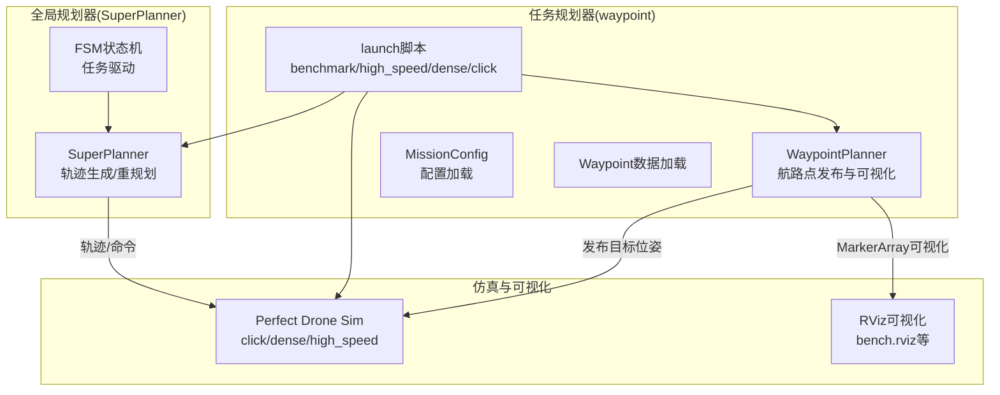
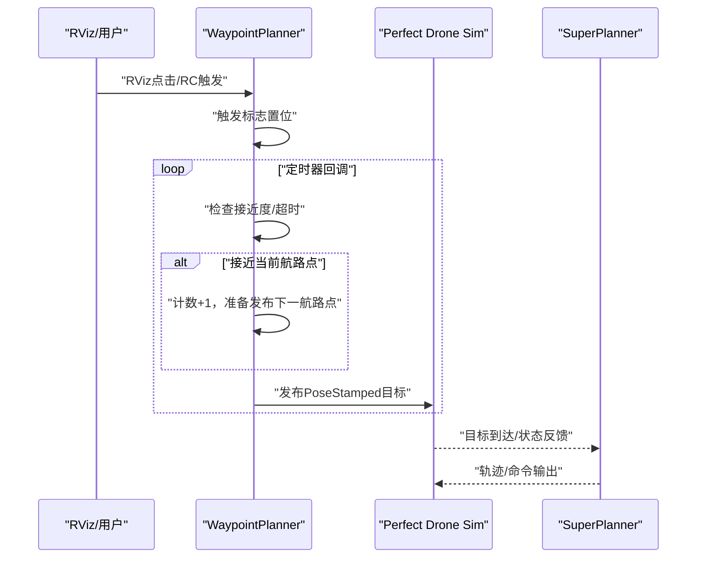
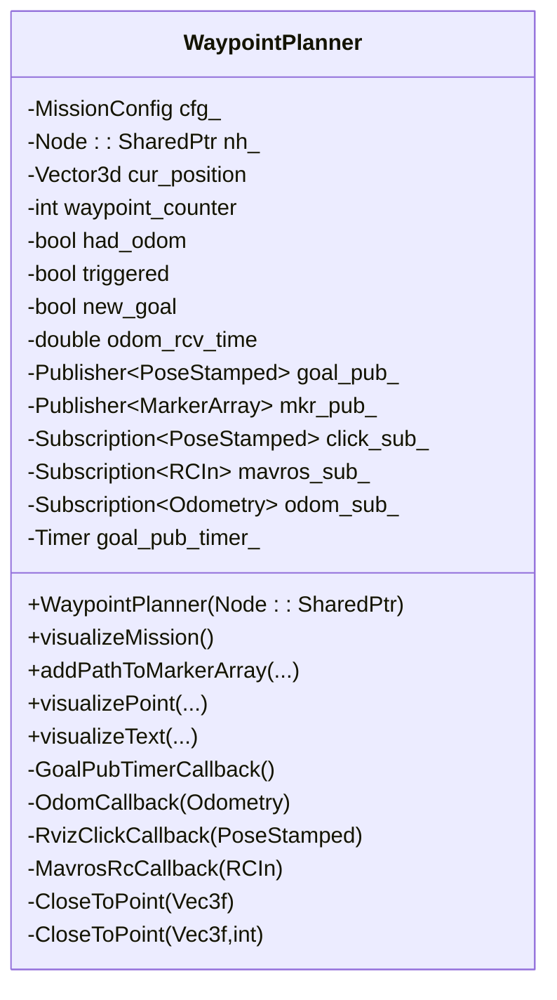
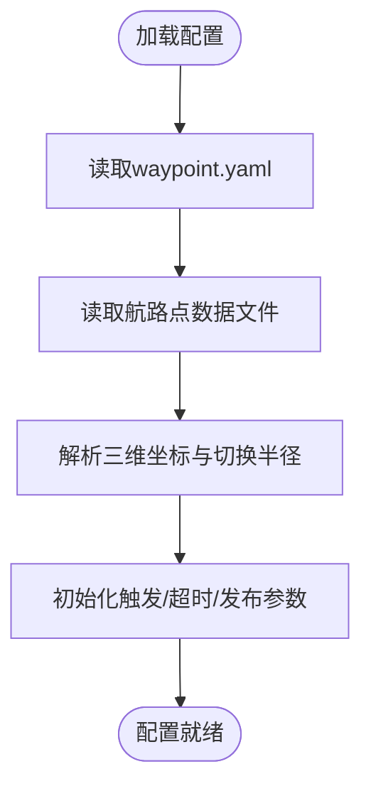
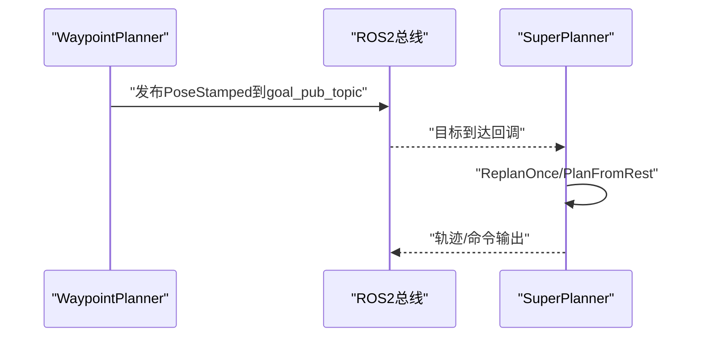
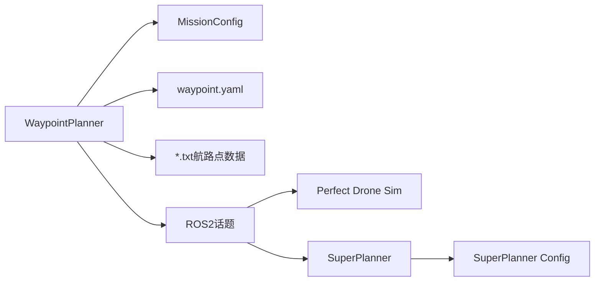

# 任务规划器模块

<cite>
**本文档引用的文件**
- [src/SUPER/mission_planner/include/waypoint_mission/ros2_waypoint_planner.hpp](file://src/SUPER/mission_planner/include/waypoint_mission/ros2_waypoint_planner.hpp)
- [src/SUPER/mission_planner/Apps/ros2_waypoint_mission.cpp](file://src/SUPER/mission_planner/Apps/ros2_waypoint_mission.cpp)
- [src/SUPER/mission_planner/config/waypoint.yaml](file://src/SUPER/mission_planner/config/waypoint.yaml)
- [src/SUPER/mission_planner/include/waypoint_mission/config.hpp](file://src/SUPER/mission_planner/include/waypoint_mission/config.hpp)
- [src/SUPER/mission_planner/data/benchmark.txt](file://src/SUPER/mission_planner/data/benchmark.txt)
- [src/SUPER/mission_planner/data/benchmark_dense.txt](file://src/SUPER/mission_planner/data/benchmark_dense.txt)
- [src/SUPER/mission_planner/launch/banchmark_high_speed.launch.py](file://src/SUPER/mission_planner/launch/banchmark_high_speed.launch.py)
- [src/SUPER/mission_planner/launch/benchmark_dense.launch.py](file://src/SUPER/mission_planner/launch/benchmark_dense.launch.py)
- [src/SUPER/mission_planner/launch/click_demo.launch.py](file://src/SUPER/mission_planner/launch/click_demo.launch.py)
- [src/SUPER/super_planner/include/super_core/super_planner.h](file://src/SUPER/super_planner/include/super_core/super_planner.h)
- [src/SUPER/super_planner/include/fsm/fsm.h](file://src/SUPER/super_planner/include/fsm/fsm.h)
- [src/SUPER/super_planner/include/super_core/config.hpp](file://src/SUPER/super_planner/include/super_core/config.hpp)
- [src/SUPER/super_planner/rviz/bench.rviz](file://src/SUPER/super_planner/rviz/bench.rviz)
</cite>

## 目录
1. [简介](#简介)
2. [项目结构](#项目结构)
3. [核心组件](#核心组件)
4. [架构总览](#架构总览)
5. [详细组件分析](#详细组件分析)
6. [依赖关系分析](#依赖关系分析)
7. [性能考虑](#性能考虑)
8. [故障排查指南](#故障排查指南)
9. [结论](#结论)
10. [附录](#附录)

## 简介
本文件面向任务规划器模块，系统性阐述 WaypointPlanner 的实现原理与使用方法，覆盖航路点管理、任务序列处理与目标跟踪机制；解释任务规划器与 SuperPlanner 的交互接口与消息格式；给出配置文件结构与参数含义，并提供参数调优建议；详述基准测试、高密度环境、点击演示等预设场景的配置；提供 API 参考与使用示例；说明与 RViz 的集成与可视化配置；最后给出调试方法、性能评估工具以及自定义任务场景的开发指南。

## 项目结构
任务规划器模块位于 mission_planner 包中，核心由 WaypointPlanner 类、配置加载器、数据加载器、启动脚本与可视化配置组成；同时通过 launch 文件串联仿真模型与 SuperPlanner 规划器，形成端到端的任务执行链路。

**图表来源**
- [src/SUPER/mission_planner/include/waypoint_mission/ros2_waypoint_planner.hpp](file://src/SUPER/mission_planner/include/waypoint_mission/ros2_waypoint_planner.hpp#L24-L223)
- [src/SUPER/mission_planner/Apps/ros2_waypoint_mission.cpp](file://src/SUPER/mission_planner/Apps/ros2_waypoint_mission.cpp#L11-L22)
- [src/SUPER/mission_planner/launch/banchmark_high_speed.launch.py](file://src/SUPER/mission_planner/launch/banchmark_high_speed.launch.py#L67-L98)
- [src/SUPER/super_planner/include/super_core/super_planner.h](file://src/SUPER/super_planner/include/super_core/super_planner.h#L59-L120)
- [src/SUPER/super_planner/include/fsm/fsm.h](file://src/SUPER/super_planner/include/fsm/fsm.h#L41-L121)

**章节来源**
- [src/SUPER/mission_planner/include/waypoint_mission/ros2_waypoint_planner.hpp](file://src/SUPER/mission_planner/include/waypoint_mission/ros2_waypoint_planner.hpp#L24-L223)
- [src/SUPER/mission_planner/Apps/ros2_waypoint_mission.cpp](file://src/SUPER/mission_planner/Apps/ros2_waypoint_mission.cpp#L11-L22)
- [src/SUPER/mission_planner/launch/banchmark_high_speed.launch.py](file://src/SUPER/mission_planner/launch/banchmark_high_speed.launch.py#L13-L100)

## 核心组件
- WaypointPlanner：负责航路点序列管理、触发机制、目标跟踪与周期发布、RViz 可视化。
- MissionConfig：加载 waypoint.yaml 与航路点数据文件，解析触发类型、发布周期、超时阈值等参数。
- 启动脚本：提供 benchmark、dense、high_speed、click 等场景的组合启动。
- SuperPlanner：接收 WaypointPlanner 发布的目标，进行轨迹生成与重规划，输出命令给仿真或真实飞行器。

**章节来源**
- [src/SUPER/mission_planner/include/waypoint_mission/ros2_waypoint_planner.hpp](file://src/SUPER/mission_planner/include/waypoint_mission/ros2_waypoint_planner.hpp#L24-L223)
- [src/SUPER/mission_planner/include/waypoint_mission/config.hpp](file://src/SUPER/mission_planner/include/waypoint_mission/config.hpp#L31-L96)
- [src/SUPER/super_planner/include/super_core/super_planner.h](file://src/SUPER/super_planner/include/super_core/super_planner.h#L104-L146)

## 架构总览
WaypointPlanner 作为前端任务规划器，订阅里程计与用户触发信号，周期性判断是否接近当前航路点，接近则切换下一个航路点并发布新的目标位姿；同时通过 MarkerArray 在 RViz 中可视化航路点与切换半径。SuperPlanner 作为后端全局规划器，接收目标并生成满足动力学约束的轨迹，二者通过 ROS2 话题完成解耦协作。

**图表来源**
- [src/SUPER/mission_planner/include/waypoint_mission/ros2_waypoint_planner.hpp](file://src/SUPER/mission_planner/include/waypoint_mission/ros2_waypoint_planner.hpp#L95-L160)
- [src/SUPER/mission_planner/config/waypoint.yaml](file://src/SUPER/mission_planner/config/waypoint.yaml#L1-L19)
- [src/SUPER/super_planner/include/super_core/super_planner.h](file://src/SUPER/super_planner/include/super_core/super_planner.h#L139-L146)

## 详细组件分析

### WaypointPlanner 实现原理
- 航路点管理
  - 通过 MissionConfig 加载 waypoints 与切换半径数组，支持每个航路点独立的接近阈值。
  - 支持从文本文件批量加载航路点，每行前若干列为三维坐标，最后一列为该航路点的切换半径。
- 任务序列处理
  - 通过定时器周期检查当前位置与当前航路点的距离，达到阈值则切换到下一个航路点。
  - 提供三种触发方式：RViz 点击、Mavros RC 遥控通道、系统启动延时触发。
- 目标跟踪与发布
  - 使用 PoseStamped 发布目标位姿，帧 ID 固定为 world，时间戳为当前 ROS 时间。
  - 支持设定发布周期与里程计超时阈值，避免无效发布与死循环。
- RViz 可视化
  - 将航路点序列与切换半径以 MarkerArray 形式发布，便于观察与调试。

**图表来源**
- [src/SUPER/mission_planner/include/waypoint_mission/ros2_waypoint_planner.hpp](file://src/SUPER/mission_planner/include/waypoint_mission/ros2_waypoint_planner.hpp#L24-L223)

**章节来源**
- [src/SUPER/mission_planner/include/waypoint_mission/ros2_waypoint_planner.hpp](file://src/SUPER/mission_planner/include/waypoint_mission/ros2_waypoint_planner.hpp#L52-L160)
- [src/SUPER/mission_planner/include/waypoint_mission/ros2_waypoint_planner.hpp](file://src/SUPER/mission_planner/include/waypoint_mission/ros2_waypoint_planner.hpp#L225-L405)

### MissionConfig 配置与数据加载
- 参数来源
  - 从 waypoint.yaml 读取：目标发布话题、里程计话题、触发类型、延迟、命令类型、切换距离、超时、发布周期等。
  - 从文本文件读取：航路点序列与对应切换半径。
- 关键字段
  - start_trigger_type：触发类型（RViz/RC/延时）。
  - start_program_delay：延时触发的等待时间。
  - cmd_type：命令类型（路径/航路点）。
  - switch_dis / switch_dis_vec：全局/逐点切换半径。
  - odom_timeout / publish_dt：里程计超时与发布周期。
  - goal_pub_topic / odom_topic：话题名。

**图表来源**
- [src/SUPER/mission_planner/include/waypoint_mission/config.hpp](file://src/SUPER/mission_planner/include/waypoint_mission/config.hpp#L54-L96)
- [src/SUPER/mission_planner/data/benchmark.txt](file://src/SUPER/mission_planner/data/benchmark.txt#L1-L2)

**章节来源**
- [src/SUPER/mission_planner/include/waypoint_mission/config.hpp](file://src/SUPER/mission_planner/include/waypoint_mission/config.hpp#L31-L96)
- [src/SUPER/mission_planner/config/waypoint.yaml](file://src/SUPER/mission_planner/config/waypoint.yaml#L1-L19)
- [src/SUPER/mission_planner/data/benchmark.txt](file://src/SUPER/mission_planner/data/benchmark.txt#L1-L2)

### 与 SuperPlanner 的交互接口
- 输入接口
  - 目标位姿：WaypointPlanner 发布 geometry_msgs/PoseStamped 到 goal_pub_topic。
  - 里程计：订阅 nav_msgs/Odometry 到 odom_topic，用于接近度判断与超时检测。
- 输出接口
  - SuperPlanner 通过自身内部流程生成轨迹/命令，通常发布至 px4 控制或仿真接口（具体由 SuperPlanner 配置决定）。
- 协议约定
  - 坐标系：world 帧。
  - 时间戳：ROS 时间。
  - 触发策略：由 WaypointPlanner 决定何时发布下一个目标，SuperPlanner 仅响应目标到达事件并进行轨迹生成。

**图表来源**
- [src/SUPER/mission_planner/include/waypoint_mission/ros2_waypoint_planner.hpp](file://src/SUPER/mission_planner/include/waypoint_mission/ros2_waypoint_planner.hpp#L144-L157)
- [src/SUPER/super_planner/include/super_core/super_planner.h](file://src/SUPER/super_planner/include/super_core/super_planner.h#L139-L146)

**章节来源**
- [src/SUPER/mission_planner/include/waypoint_mission/ros2_waypoint_planner.hpp](file://src/SUPER/mission_planner/include/waypoint_mission/ros2_waypoint_planner.hpp#L191-L222)
- [src/SUPER/super_planner/include/super_core/super_planner.h](file://src/SUPER/super_planner/include/super_core/super_planner.h#L104-L146)

### 预设场景配置与启动
- 基准测试（benchmark）
  - Waypoint 数据：benchmark.txt 或 benchmark_dense.txt。
  - 启动：benchmark_dense.launch.py 或 banchmark_high_speed.launch.py。
- 高密度环境（dense）
  - 仿真配置：perfect_drone_sim 的 dense.yaml。
  - 启动：benchmark_dense.launch.py。
- 点击演示（click）
  - 仿真配置：perfect_drone_sim 的 click.yaml。
  - 启动：click_demo.launch.py。
- SuperPlanner 配置
  - static_dense.yaml / static_high_speed.yaml / click_smooth_ros2.yaml 等，按场景选择。

**章节来源**
- [src/SUPER/mission_planner/launch/benchmark_dense.launch.py](file://src/SUPER/mission_planner/launch/benchmark_dense.launch.py#L13-L100)
- [src/SUPER/mission_planner/launch/banchmark_high_speed.launch.py](file://src/SUPER/mission_planner/launch/banchmark_high_speed.launch.py#L13-L100)
- [src/SUPER/mission_planner/launch/click_demo.launch.py](file://src/SUPER/mission_planner/launch/click_demo.launch.py#L13-L98)

### API 参考与使用示例
- 公共接口
  - WaypointPlanner(Node::SharedPtr)：构造函数，完成参数声明、订阅、发布器创建与定时器初始化。
  - visualizeMission()：发布航路点与切换半径的 MarkerArray。
  - addPathToMarkerArray(...) / visualizePoint(...) / visualizeText(...)：辅助可视化函数。
- 使用示例
  - 启动任务规划器节点：ros2 run mission_planner waypoint_mission。
  - 通过 launch 文件指定 config_name 与 data_name 参数，加载不同场景配置。
  - 在 RViz 中查看 /mission/mkr 与 /planning/click_goal 的可视化与目标发布情况。

**章节来源**
- [src/SUPER/mission_planner/Apps/ros2_waypoint_mission.cpp](file://src/SUPER/mission_planner/Apps/ros2_waypoint_mission.cpp#L11-L22)
- [src/SUPER/mission_planner/include/waypoint_mission/ros2_waypoint_planner.hpp](file://src/SUPER/mission_planner/include/waypoint_mission/ros2_waypoint_planner.hpp#L165-L223)

### 与 RViz 的集成与可视化
- 可视化主题
  - bench.rviz：包含全局/局部点云、轨迹/走廊可视化、MarkerArray 显示组等。
- 关键显示项
  - /mission/mkr：航路点与切换半径可视化。
  - /planning/click_goal：目标位姿发布。
  - /lidar_slam/odom：里程计显示。
- 启动方式
  - 通过 launch 文件加载 RViz 配置文件，或手动运行 rviz2 -d <rviz文件>。

**章节来源**
- [src/SUPER/super_planner/rviz/bench.rviz](file://src/SUPER/super_planner/rviz/bench.rviz#L1-L648)
- [src/SUPER/mission_planner/launch/click_demo.launch.py](file://src/SUPER/mission_planner/launch/click_demo.launch.py#L59-L73)

## 依赖关系分析
- 组件内聚与耦合
  - WaypointPlanner 与 MissionConfig 解耦，通过配置文件与数据文件注入参数与航路点。
  - 与 SuperPlanner 通过 ROS2 话题弱耦合，不直接依赖其内部实现。
- 外部依赖
  - Eigen 几何库、ROS2 rclcpp、RViz MarkerArray、yaml_loader 工具。
- 潜在环依赖
  - 未发现直接环依赖；启动脚本统一编排，避免循环引用。

**图表来源**
- [src/SUPER/mission_planner/include/waypoint_mission/ros2_waypoint_planner.hpp](file://src/SUPER/mission_planner/include/waypoint_mission/ros2_waypoint_planner.hpp#L165-L223)
- [src/SUPER/mission_planner/include/waypoint_mission/config.hpp](file://src/SUPER/mission_planner/include/waypoint_mission/config.hpp#L82-L96)
- [src/SUPER/super_planner/include/super_core/config.hpp](file://src/SUPER/super_planner/include/super_core/config.hpp#L96-L151)

**章节来源**
- [src/SUPER/mission_planner/include/waypoint_mission/ros2_waypoint_planner.hpp](file://src/SUPER/mission_planner/include/waypoint_mission/ros2_waypoint_planner.hpp#L165-L223)
- [src/SUPER/mission_planner/include/waypoint_mission/config.hpp](file://src/SUPER/mission_planner/include/waypoint_mission/config.hpp#L82-L96)
- [src/SUPER/super_planner/include/super_core/config.hpp](file://src/SUPER/super_planner/include/super_core/config.hpp#L96-L151)

## 性能考虑
- 发布频率与接近判定
  - publish_dt 过小会导致频繁发布与 CPU 占用上升；过大则目标更新滞后。
  - switch_dis 与 switch_dis_vec 过小会频繁切换，增加抖动；过大则影响精度。
- 里程计超时
  - odom_timeout 过短可能误判超时；过长可能导致目标滞留。
- 触发策略
  - start_trigger_type=2（延时触发）适合多节点启动顺序控制；RC 触发适合实飞场景。
- 可视化开销
  - MarkerArray 数量与刷新频率会影响 RViz 性能，建议在复杂场景降低刷新频率或减少显示项。

[本节为通用指导，无需列出章节来源]

## 故障排查指南
- 无航路点发布
  - 检查 config_name 与 data_name 参数是否正确传入；确认 waypoint.yaml 与数据文件路径有效。
  - 检查 odom_topic 是否正确，若无里程计回调，将无法进入触发状态。
- 目标未切换
  - 检查 switch_dis 与当前航路点位置；确认 CloseToPoint 判断逻辑生效。
  - 检查 publish_dt 是否导致发布被抑制。
- RViz 不显示航路点
  - 确认 /mission/mkr 订阅者数量大于 0；检查 RViz 主题与命名空间。
- 超时告警
  - 若出现 Odom Timeout 提示，检查传感器数据流与订阅 QoS 设置。

**章节来源**
- [src/SUPER/mission_planner/include/waypoint_mission/ros2_waypoint_planner.hpp](file://src/SUPER/mission_planner/include/waypoint_mission/ros2_waypoint_planner.hpp#L113-L125)
- [src/SUPER/mission_planner/config/waypoint.yaml](file://src/SUPER/mission_planner/config/waypoint.yaml#L1-L19)

## 结论
WaypointPlanner 以简洁的航路点管理与触发机制为核心，通过 ROS2 话题与 SuperPlanner 解耦协作，形成可扩展的任务执行链路。合理设置参数与可视化配置，可在仿真与实飞环境中稳定运行多种预设场景，并为自定义任务场景提供清晰的扩展路径。

[本节为总结性内容，无需列出章节来源]

## 附录

### 参数调优指南
- 触发与延时
  - start_trigger_type：根据场景选择 RViz/RC/延时触发；延时触发适用于多节点启动顺序。
  - start_program_delay：确保系统稳定后再开始任务。
- 接近判定
  - switch_dis：全局切换半径；switch_dis_vec：逐点半径，复杂场景建议差异化设置。
- 发布与超时
  - publish_dt：平衡实时性与系统负载；odom_timeout：保障安全性。
- 话题与数据
  - goal_pub_topic：与下游控制器一致；odom_topic：与传感器数据一致。
  - data_name：选择合适的数据文件（benchmark/benchmark_dense）。

**章节来源**
- [src/SUPER/mission_planner/config/waypoint.yaml](file://src/SUPER/mission_planner/config/waypoint.yaml#L1-L19)
- [src/SUPER/mission_planner/include/waypoint_mission/config.hpp](file://src/SUPER/mission_planner/include/waypoint_mission/config.hpp#L82-L96)

### 自定义任务场景开发指南
- 新增航路点数据
  - 在 data/ 下新增 *.txt，格式为每行 x y z 切换半径。
- 新增场景配置
  - 在 config/waypoint.yaml 中调整参数；在 launch/ 下新增启动文件，指定 config_name 与 data_name。
- 可视化与验证
  - 使用 RViz bench.rviz 或自定义主题，观察 /mission/mkr 与目标发布效果。
- 与 SuperPlanner 对接
  - 确保目标位姿发布到 SuperPlanner 期望的话题；根据场景选择合适的 SuperPlanner 配置文件。

**章节来源**
- [src/SUPER/mission_planner/data/benchmark.txt](file://src/SUPER/mission_planner/data/benchmark.txt#L1-L2)
- [src/SUPER/mission_planner/launch/benchmark_dense.launch.py](file://src/SUPER/mission_planner/launch/benchmark_dense.launch.py#L67-L76)
- [src/SUPER/super_planner/rviz/bench.rviz](file://src/SUPER/super_planner/rviz/bench.rviz#L1-L648)