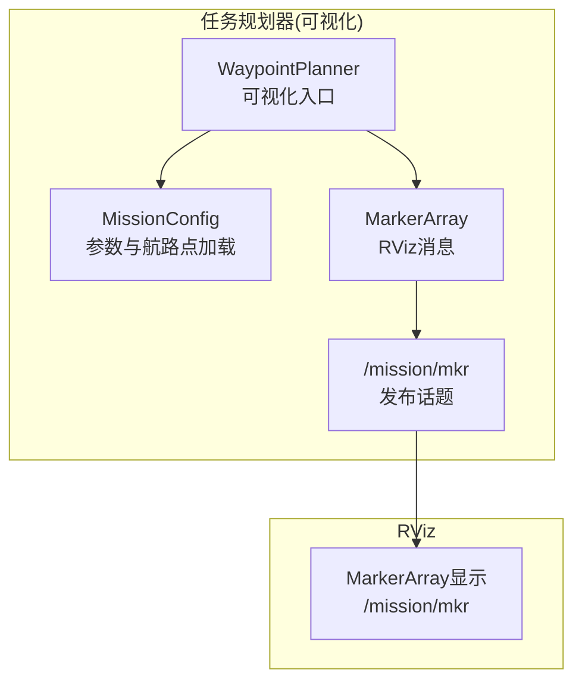
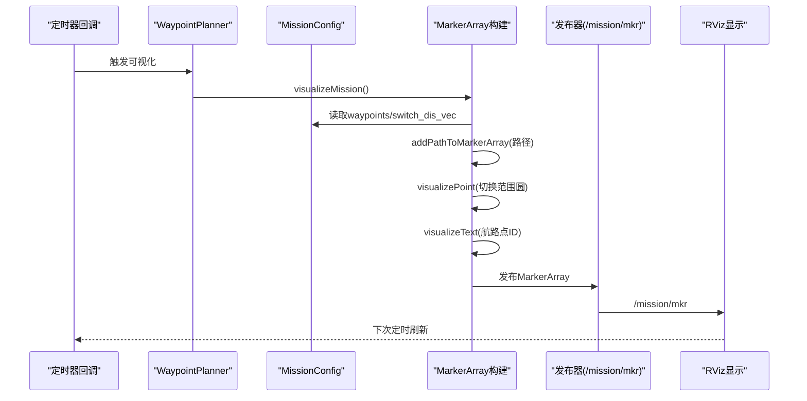
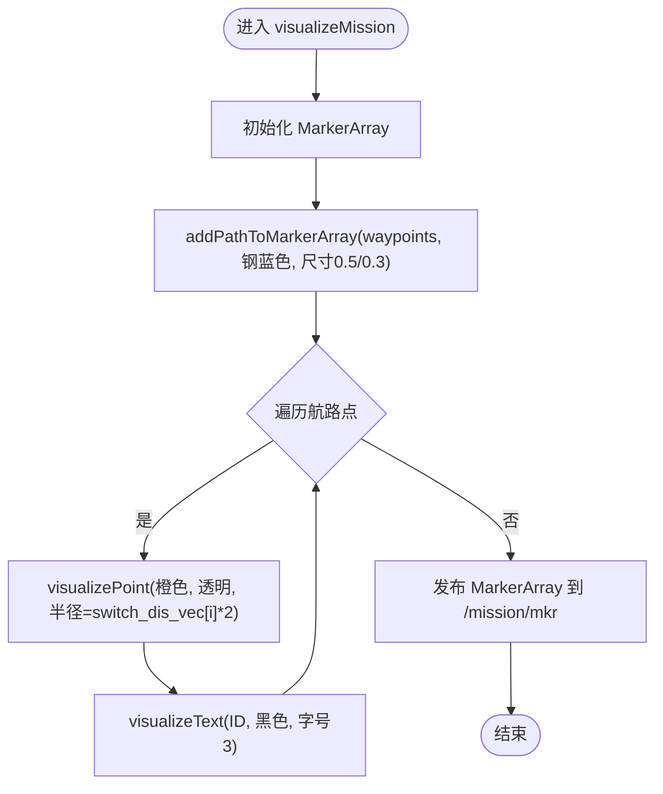
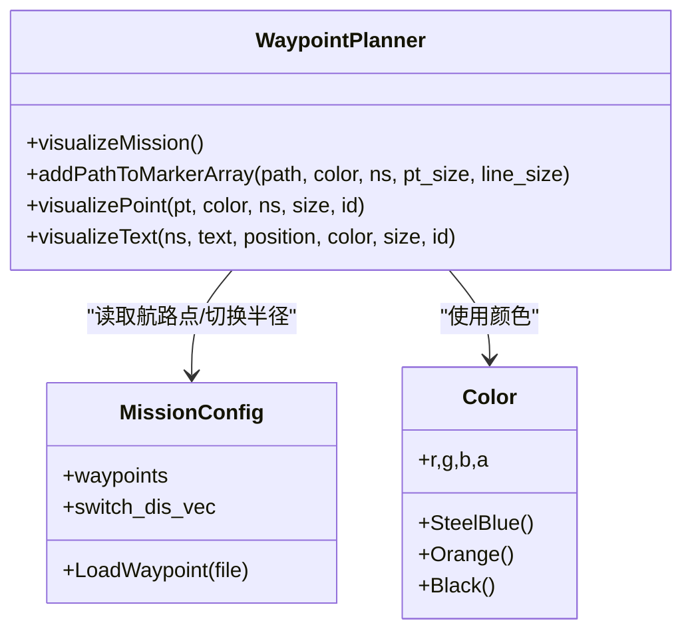

# 可视化集成

<cite>
**本文档引用的文件**
- [ros2_waypoint_planner.hpp](file://src/SUPER/mission_planner/include/waypoint_mission/ros2_waypoint_planner.hpp)
- [default.rviz](file://src/SUPER/super_planner/rviz/default.rviz)
- [bench.rviz](file://src/SUPER/super_planner/rviz/bench.rviz)
- [waypoint.yaml](file://src/SUPER/mission_planner/config/waypoint.yaml)
- [color_msg_utils.hpp](file://src/SUPER/mission_planner/include/utils/color_msg_utils.hpp)
- [config.hpp](file://src/SUPER/mission_planner/include/waypoint_mission/config.hpp)
- [benchmark.txt](file://src/SUPER/mission_planner/data/benchmark.txt)
- [benchmark_dense.txt](file://src/SUPER/mission_planner/data/benchmark_dense.txt)
</cite>

## 目录
1. [简介](#简介)
2. [项目结构](#项目结构)
3. [核心组件](#核心组件)
4. [架构总览](#架构总览)
5. [详细组件分析](#详细组件分析)
6. [依赖关系分析](#依赖关系分析)
7. [性能考量](#性能考量)
8. [故障排除指南](#故障排除指南)
9. [结论](#结论)
10. [附录](#附录)

## 简介
本文件面向任务规划器的RViz可视化集成，系统性阐述以下内容：
- RViz可视化实现原理与MarkerArray使用方式
- 航路点可视化与切换区域显示机制
- visualizeMission()方法的实现细节（路径绘制、点云可视化、文本标注）
- 可视化元素作用与参数配置（颜色、尺寸、透明度）
- RViz配置指南（主题、显示参数、调试工具）
- 实时更新机制与性能优化策略
- 故障排除与调试技巧

## 项目结构
任务规划器的可视化主要集中在mission_planner模块中，涉及如下关键文件：
- 可视化核心实现：ros2_waypoint_planner.hpp
- RViz配置：super_planner/rviz/*.rviz
- 参数配置：mission_planner/config/waypoint.yaml
- 数据加载：mission_planner/data/*.txt
- 颜色工具：mission_planner/include/utils/color_msg_utils.hpp

图表来源
- [ros2_waypoint_planner.hpp](file://src/SUPER/mission_planner/include/waypoint_mission/ros2_waypoint_planner.hpp#L225-L238)
- [default.rviz](file://src/SUPER/super_planner/rviz/default.rviz#L394-L399)

章节来源
- [ros2_waypoint_planner.hpp](file://src/SUPER/mission_planner/include/waypoint_mission/ros2_waypoint_planner.hpp#L225-L238)
- [default.rviz](file://src/SUPER/super_planner/rviz/default.rviz#L394-L399)

## 核心组件
- WaypointPlanner：负责航路点可视化、触发条件处理、目标发布与定时器逻辑
- MissionConfig：加载航路点与切换半径等配置
- Color工具：统一的颜色封装，支持RGB与透明度
- RViz配置文件：定义显示主题、队列长度、命名空间过滤等

章节来源
- [ros2_waypoint_planner.hpp](file://src/SUPER/mission_planner/include/waypoint_mission/ros2_waypoint_planner.hpp#L24-L50)
- [config.hpp](file://src/SUPER/mission_planner/include/waypoint_mission/config.hpp#L54-L83)
- [color_msg_utils.hpp](file://src/SUPER/mission_planner/include/utils/color_msg_utils.hpp#L10-L68)

## 架构总览
可视化流程自上而下分为三层：
- 数据层：航路点集合、切换半径、颜色配置
- 渲染层：addPathToMarkerArray、visualizePoint、visualizeText生成MarkerArray
- 显示层：RViz订阅/mission/mkr并渲染

图表来源
- [ros2_waypoint_planner.hpp](file://src/SUPER/mission_planner/include/waypoint_mission/ros2_waypoint_planner.hpp#L225-L238)
- [ros2_waypoint_planner.hpp](file://src/SUPER/mission_planner/include/waypoint_mission/ros2_waypoint_planner.hpp#L331-L405)
- [ros2_waypoint_planner.hpp](file://src/SUPER/mission_planner/include/waypoint_mission/ros2_waypoint_planner.hpp#L240-L298)
- [ros2_waypoint_planner.hpp](file://src/SUPER/mission_planner/include/waypoint_mission/ros2_waypoint_planner.hpp#L300-L329)

## 详细组件分析

### visualizeMission()方法详解
该方法是可视化的核心入口，负责一次性构建完整的MarkerArray并发布：
- 调用addPathToMarkerArray绘制航路点连线（线段+点）
- 对每个航路点调用visualizePoint绘制透明橙色圆（表示切换范围）
- 对每个航路点调用visualizeText绘制ID文本标注
- 发布至/mission/mkr

图表来源
- [ros2_waypoint_planner.hpp](file://src/SUPER/mission_planner/include/waypoint_mission/ros2_waypoint_planner.hpp#L225-L238)

章节来源
- [ros2_waypoint_planner.hpp](file://src/SUPER/mission_planner/include/waypoint_mission/ros2_waypoint_planner.hpp#L225-L238)

### MarkerArray与可视化元素
- 航路点球体（SPHERE）：用于标识航路点位置，尺寸由pt_size控制
- 路径线条（LINE_LIST）：连接相邻航路点，线宽由line_size控制
- 切换范围圆（SPHERE）：以航路点为中心的透明圆，半径=switch_dis_vec[i]*2
- ID标签（TEXT_VIEW_FACING）：在航路点上方显示序号

章节来源
- [ros2_waypoint_planner.hpp](file://src/SUPER/mission_planner/include/waypoint_mission/ros2_waypoint_planner.hpp#L240-L298)
- [ros2_waypoint_planner.hpp](file://src/SUPER/mission_planner/include/waypoint_mission/ros2_waypoint_planner.hpp#L300-L329)
- [ros2_waypoint_planner.hpp](file://src/SUPER/mission_planner/include/waypoint_mission/ros2_waypoint_planner.hpp#L331-L405)

### addPathToMarkerArray实现要点
- 输入：路径点序列、颜色、命名空间、点尺寸、线尺寸
- 输出：向MarkerArray追加球体点与线段
- 关键参数：
  - 点尺寸：scale.x/y/z = pt_size
  - 线宽：scale.x = line_size（LINE_STRIP/LINE_LIST仅用x分量）
  - 颜色：color（含透明度a）

章节来源
- [ros2_waypoint_planner.hpp](file://src/SUPER/mission_planner/include/waypoint_mission/ros2_waypoint_planner.hpp#L331-L405)

### visualizePoint与visualizeText参数
- visualizePoint：
  - 类型：SPHERE
  - 尺寸：scale.x/y/z = size
  - 颜色：可指定透明度
  - 文本标注：可选开启，用于显示命名空间或ID
- visualizeText：
  - 类型：TEXT_VIEW_FACING
  - 尺寸：scale.z = size（仅Z方向有效）
  - 位置：在航路点坐标基础上偏移以避免遮挡

章节来源
- [ros2_waypoint_planner.hpp](file://src/SUPER/mission_planner/include/waypoint_mission/ros2_waypoint_planner.hpp#L240-L298)
- [ros2_waypoint_planner.hpp](file://src/SUPER/mission_planner/include/waypoint_mission/ros2_waypoint_planner.hpp#L300-L329)

### 可视化参数配置
- 颜色设置：通过Color工具类选择预设颜色或自定义RGB+透明度
- 尺寸调整：航路点球体尺寸pt_size、路径线宽line_size、文本高度size
- 透明度控制：通过Color的alpha通道设置（如切换范围圆a=0.2）

章节来源
- [color_msg_utils.hpp](file://src/SUPER/mission_planner/include/utils/color_msg_utils.hpp#L10-L68)
- [ros2_waypoint_planner.hpp](file://src/SUPER/mission_planner/include/waypoint_mission/ros2_waypoint_planner.hpp#L227-L236)
- [ros2_waypoint_planner.hpp](file://src/SUPER/mission_planner/include/waypoint_mission/ros2_waypoint_planner.hpp#L331-L405)

### RViz配置指南
- 主题与显示参数：
  - 固定帧：world
  - MarkerArray显示：订阅/mission/mkr
  - 队列长度：100（默认）
  - 命名空间过滤：可按需启用
- 调试工具：
  - 使用“Interact/MoveCamera/Select”等工具观察视角
  - 使用“PublishPoint”发布点击点辅助定位
  - 同步源：根据需要设置PointCloud2等同步源

章节来源
- [default.rviz](file://src/SUPER/super_planner/rviz/default.rviz#L428-L429)
- [default.rviz](file://src/SUPER/super_planner/rviz/default.rviz#L394-L399)
- [bench.rviz](file://src/SUPER/super_planner/rviz/bench.rviz#L591-L592)

### 可视化数据实时更新机制
- 定时器回调：每10ms检查一次订阅数量变化，若存在订阅则调用visualizeMission()
- 触发条件：RViz订阅/mission/mkr后开始发布；支持RViz点击或RC输入触发
- 目标发布：当接近当前航路点时自动切换下一个目标

章节来源
- [ros2_waypoint_planner.hpp](file://src/SUPER/mission_planner/include/waypoint_mission/ros2_waypoint_planner.hpp#L95-L160)
- [ros2_waypoint_planner.hpp](file://src/SUPER/mission_planner/include/waypoint_mission/ros2_waypoint_planner.hpp#L210-L223)

## 依赖关系分析
- WaypointPlanner依赖MissionConfig加载航路点与切换半径
- 可视化函数依赖Color工具进行颜色封装
- RViz显示依赖MarkerArray消息格式与命名空间组织

图表来源
- [ros2_waypoint_planner.hpp](file://src/SUPER/mission_planner/include/waypoint_mission/ros2_waypoint_planner.hpp#L225-L329)
- [config.hpp](file://src/SUPER/mission_planner/include/waypoint_mission/config.hpp#L54-L83)
- [color_msg_utils.hpp](file://src/SUPER/mission_planner/include/utils/color_msg_utils.hpp#L10-L68)

章节来源
- [ros2_waypoint_planner.hpp](file://src/SUPER/mission_planner/include/waypoint_mission/ros2_waypoint_planner.hpp#L225-L329)
- [config.hpp](file://src/SUPER/mission_planner/include/waypoint_mission/config.hpp#L54-L83)
- [color_msg_utils.hpp](file://src/SUPER/mission_planner/include/utils/color_msg_utils.hpp#L10-L68)

## 性能考量
- 发布频率：定时器周期10ms，建议在RViz订阅存在时才发布，避免空转
- Marker数量：路径N个点生成N个球体+最多(N-1)条线，航路点K个生成K个透明圆+K个文本
- 队列长度：RViz显示队列默认100，可根据场景调整
- 颜色与透明度：透明圆a=0.2，建议仅在必要时开启，减少渲染压力
- 数据加载：航路点文件为二维坐标+切换半径，建议保持简洁

章节来源
- [ros2_waypoint_planner.hpp](file://src/SUPER/mission_planner/include/waypoint_mission/ros2_waypoint_planner.hpp#L95-L102)
- [default.rviz](file://src/SUPER/super_planner/rviz/default.rviz#L394-L399)
- [config.hpp](file://src/SUPER/mission_planner/include/waypoint_mission/config.hpp#L54-L83)

## 故障排除指南
- 无航路点显示：
  - 检查/mission/mkr是否有订阅者；确认定时器回调已触发
  - 确认航路点文件路径与格式正确
- 切换范围圆不显示：
  - 检查switch_dis_vec是否为空或全零
  - 确认透明度a=0.2生效
- 文本标注错位：
  - 检查visualizeText的position与偏移设置
- RViz显示异常：
  - 检查固定帧是否为world
  - 检查MarkerArray显示的队列长度与命名空间过滤

章节来源
- [ros2_waypoint_planner.hpp](file://src/SUPER/mission_planner/include/waypoint_mission/ros2_waypoint_planner.hpp#L225-L238)
- [ros2_waypoint_planner.hpp](file://src/SUPER/mission_planner/include/waypoint_mission/ros2_waypoint_planner.hpp#L300-L329)
- [default.rviz](file://src/SUPER/super_planner/rviz/default.rviz#L428-L429)

## 结论
本可视化方案通过MarkerArray高效表达航路点、路径与切换区域，并结合RViz的灵活显示配置，实现了直观且可调参的可视化效果。通过合理的参数设置与性能优化策略，可在保证观感的同时维持良好的运行效率。

## 附录

### 参数与数据文件
- 参数文件：waypoint.yaml
  - 目标发布话题、里程计话题、触发类型、切换距离、超时阈值、发布周期等
- 数据文件：benchmark.txt / benchmark_dense.txt
  - 每行包含X、Y、Z坐标与切换半径

章节来源
- [waypoint.yaml](file://src/SUPER/mission_planner/config/waypoint.yaml#L1-L19)
- [benchmark.txt](file://src/SUPER/mission_planner/data/benchmark.txt#L1-L2)
- [benchmark_dense.txt](file://src/SUPER/mission_planner/data/benchmark_dense.txt#L1-L2)