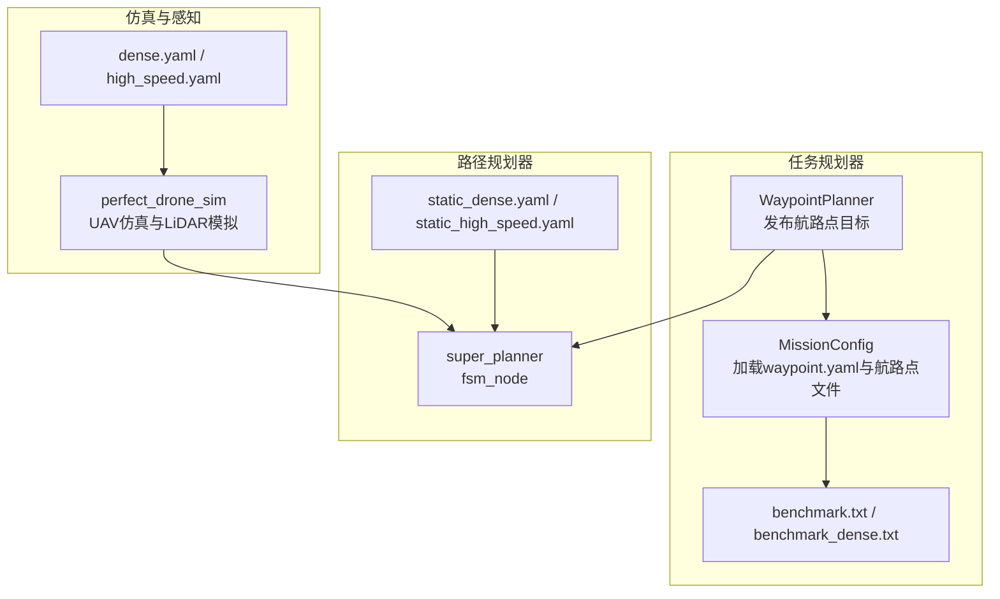
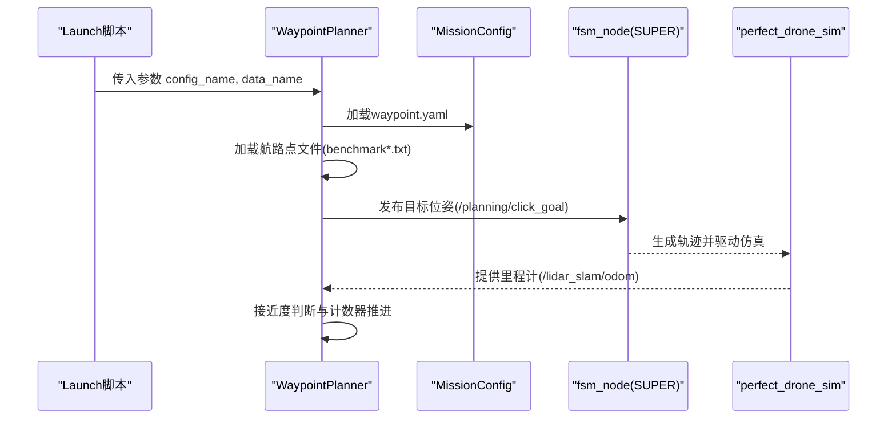
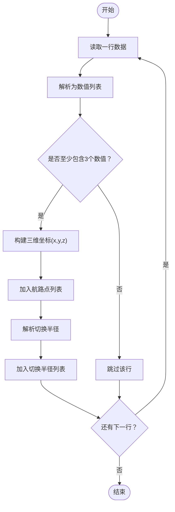
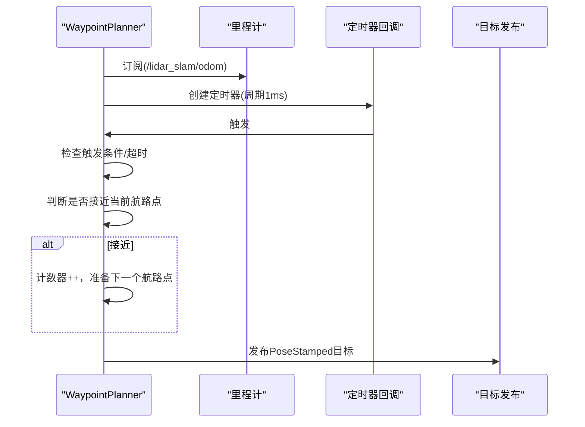
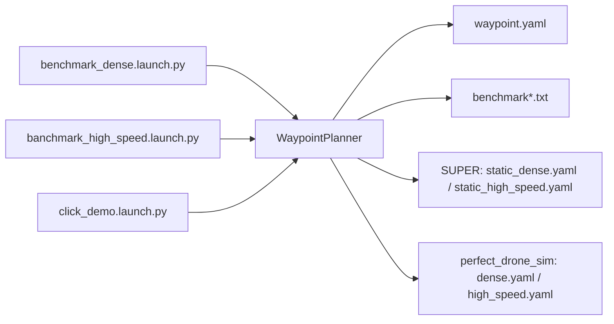

# 场景预设

<cite>
**本文引用的文件**
- [src/SUPER/mission_planner/data/benchmark.txt](file://src/SUPER/mission_planner/data/benchmark.txt)
- [src/SUPER/mission_planner/data/benchmark_dense.txt](file://src/SUPER/mission_planner/data/benchmark_dense.txt)
- [src/SUPER/mission_planner/config/waypoint.yaml](file://src/SUPER/mission_planner/config/waypoint.yaml)
- [src/SUPER/mission_planner/include/waypoint_mission/config.hpp](file://src/SUPER/mission_planner/include/waypoint_mission/config.hpp)
- [src/SUPER/mission_planner/include/waypoint_mission/ros2_waypoint_planner.hpp](file://src/SUPER/mission_planner/include/waypoint_mission/ros2_waypoint_planner.hpp)
- [src/SUPER/mission_planner/Apps/ros2_waypoint_mission.cpp](file://src/SUPER/mission_planner/Apps/ros2_waypoint_mission.cpp)
- [src/SUPER/mission_planner/launch/benchmark_dense.launch.py](file://src/SUPER/mission_planner/launch/benchmark_dense.launch.py)
- [src/SUPER/mission_planner/launch/banchmark_high_speed.launch.py](file://src/SUPER/mission_planner/launch/banchmark_high_speed.launch.py)
- [src/SUPER/mission_planner/launch/click_demo.launch.py](file://src/SUPER/mission_planner/launch/click_demo.launch.py)
- [src/SUPER/super_planner/config/static_dense.yaml](file://src/SUPER/super_planner/config/static_dense.yaml)
- [src/SUPER/super_planner/config/static_high_speed.yaml](file://src/SUPER/super_planner/config/static_high_speed.yaml)
- [src/SUPER/mars_uav_sim/perfect_drone_sim/config/dense.yaml](file://src/SUPER/mars_uav_sim/perfect_drone_sim/config/dense.yaml)
- [src/SUPER/mars_uav_sim/perfect_drone_sim/config/high_speed.yaml](file://src/SUPER/mars_uav_sim/perfect_drone_sim/config/high_speed.yaml)
</cite>

## 目录
1. [简介](#简介)
2. [项目结构](#项目结构)
3. [核心组件](#核心组件)
4. [架构总览](#架构总览)
5. [详细组件分析](#详细组件分析)
6. [依赖关系分析](#依赖关系分析)
7. [性能考虑](#性能考虑)
8. [故障排查指南](#故障排查指南)
9. [结论](#结论)
10. [附录：自定义场景开发指南](#附录自定义场景开发指南)

## 简介
本文件面向任务规划器的“场景预设”能力，系统性说明三种典型场景的设计理念、适用条件与性能特征，并给出基准测试场景、高密度环境场景与点击演示场景的使用方法。同时，详解 benchmark.txt 与 benchmark_dense.txt 的数据格式与内容结构，解释航路点坐标、顺序与特殊标记；梳理场景文件与配置文件之间的关联关系，以及如何通过启动参数在不同场景间切换；最后提供场景测试方法与性能评估指标建议。

## 项目结构
任务规划器场景预设相关的核心位置如下：
- 场景数据文件：mission_planner/data 下的 benchmark.txt 与 benchmark_dense.txt
- 场景配置：mission_planner/config/waypoint.yaml
- 启动脚本：mission_planner/launch 下的 benchmark_dense.launch.py、banchmark_high_speed.launch.py、click_demo.launch.py
- 规划器配置：super_planner/config 下的 static_dense.yaml、static_high_speed.yaml
- 仿真配置：mars_uav_sim/perfect_drone_sim/config 下的 dense.yaml、high_speed.yaml
- 核心节点与配置加载：mission_planner 包含 WaypointPlanner 与 MissionConfig 类

图表来源
- [src/SUPER/mission_planner/include/waypoint_mission/ros2_waypoint_planner.hpp](file://src/SUPER/mission_planner/include/waypoint_mission/ros2_waypoint_planner.hpp#L165-L223)
- [src/SUPER/mission_planner/include/waypoint_mission/config.hpp](file://src/SUPER/mission_planner/include/waypoint_mission/config.hpp#L54-L96)
- [src/SUPER/mission_planner/launch/benchmark_dense.launch.py](file://src/SUPER/mission_planner/launch/benchmark_dense.launch.py#L67-L98)
- [src/SUPER/mars_uav_sim/perfect_drone_sim/config/dense.yaml](file://src/SUPER/mars_uav_sim/perfect_drone_sim/config/dense.yaml#L1-L30)
- [src/SUPER/super_planner/config/static_dense.yaml](file://src/SUPER/super_planner/config/static_dense.yaml#L1-L186)

章节来源
- [src/SUPER/mission_planner/Apps/ros2_waypoint_mission.cpp](file://src/SUPER/mission_planner/Apps/ros2_waypoint_mission.cpp#L11-L22)
- [src/SUPER/mission_planner/config/waypoint.yaml](file://src/SUPER/mission_planner/config/waypoint.yaml#L1-L19)

## 核心组件
- WaypointPlanner：负责订阅里程计、接收RViz点击或遥控触发，按航路点序列发布目标位姿，支持定时发布与接近度切换。
- MissionConfig：从 waypoint.yaml 加载运行参数，从指定航路点文件加载航路点序列与切换半径。
- 航路点文件加载：逐行解析，前三个数值为坐标(x,y,z)，最后一个数值为该航路点的切换半径（m）。

章节来源
- [src/SUPER/mission_planner/include/waypoint_mission/ros2_waypoint_planner.hpp](file://src/SUPER/mission_planner/include/waypoint_mission/ros2_waypoint_planner.hpp#L24-L223)
- [src/SUPER/mission_planner/include/waypoint_mission/config.hpp](file://src/SUPER/mission_planner/include/waypoint_mission/config.hpp#L31-L96)

## 架构总览
下图展示从启动到执行的关键流程：启动脚本传入 config_name 与 data_name 参数，WaypointPlanner 加载配置与航路点文件，随后根据触发方式与接近度阈值循环发布目标位姿给 super_planner，由其生成轨迹并驱动仿真。

图表来源
- [src/SUPER/mission_planner/launch/benchmark_dense.launch.py](file://src/SUPER/mission_planner/launch/benchmark_dense.launch.py#L67-L98)
- [src/SUPER/mission_planner/include/waypoint_mission/ros2_waypoint_planner.hpp](file://src/SUPER/mission_planner/include/waypoint_mission/ros2_waypoint_planner.hpp#L95-L160)
- [src/SUPER/mission_planner/include/waypoint_mission/config.hpp](file://src/SUPER/mission_planner/include/waypoint_mission/config.hpp#L54-L96)

## 详细组件分析

### 基准测试场景（benchmark）
- 设计理念：提供一条简单直线航路，便于快速验证任务规划器与仿真链路连通性与基本轨迹生成能力。
- 数据文件：benchmark.txt
  - 每行包含四个数值：x、y、z、切换半径
  - 当前仓库中两条记录均为相同坐标，实际使用时应按需扩展航路点序列
- 启动脚本：benchmark_dense.launch.py 与 banchmark_high_speed.launch.py
  - 默认 data_name 指向 benchmark.txt
  - 分别搭配 dense.yaml 与 high_speed.yaml 的仿真配置
- 性能特点：航程短、航路点少，适合初次联调与基础功能验证。

章节来源
- [src/SUPER/mission_planner/data/benchmark.txt](file://src/SUPER/mission_planner/data/benchmark.txt#L1-L2)
- [src/SUPER/mission_planner/launch/benchmark_dense.launch.py](file://src/SUPER/mission_planner/launch/benchmark_dense.launch.py#L19-L23)
- [src/SUPER/mission_planner/launch/banchmark_high_speed.launch.py](file://src/SUPER/mission_planner/launch/banchmark_high_speed.launch.py#L19-L23)

### 高密度环境场景（benchmark_dense）
- 设计理念：在有限空间内布置密集障碍物，用于评估路径规划器在复杂环境下的避障能力与计算稳定性。
- 数据文件：benchmark_dense.txt
  - 格式同 benchmark.txt，当前仓库中两条记录与基准场景一致
- 仿真配置：dense.yaml
  - LiDAR 采用广角与高分辨率设置，提升感知范围与精度
  - 初始位姿位于 y=-50 方向，便于沿 X 方向前进
- 规划器配置：static_dense.yaml
  - 地图分辨率与膨胀参数更精细，视野与安全裕度更严格
  - 可视化与过程日志按需开启，便于观察与调试

章节来源
- [src/SUPER/mission_planner/data/benchmark_dense.txt](file://src/SUPER/mission_planner/data/benchmark_dense.txt#L1-L2)
- [src/SUPER/mars_uav_sim/perfect_drone_sim/config/dense.yaml](file://src/SUPER/mars_uav_sim/perfect_drone_sim/config/dense.yaml#L1-L30)
- [src/SUPER/super_planner/config/static_dense.yaml](file://src/SUPER/super_planner/config/static_dense.yaml#L105-L186)
- [src/SUPER/mission_planner/launch/benchmark_dense.launch.py](file://src/SUPER/mission_planner/launch/benchmark_dense.launch.py#L22-L23)

### 点击演示场景（click_demo）
- 设计理念：通过 RViz 点击交互设定目标，结合 SUPER 的平滑策略与可视化，直观展示规划与跟踪效果。
- 启动脚本：click_demo.launch.py
  - 默认 data_name 指向 benchmark.txt，但实际以 RViz 点击为目标源
  - 使用 click.yaml 仿真配置与 click_smooth_ros2.yaml 规划器配置
- 适用条件：需要人机交互演示或快速验证不同目标点对规划性能的影响。

章节来源
- [src/SUPER/mission_planner/launch/click_demo.launch.py](file://src/SUPER/mission_planner/launch/click_demo.launch.py#L24-L25)
- [src/SUPER/super_planner/config/click_smooth_ros2.yaml](file://src/SUPER/super_planner/config/click_smooth_ros2.yaml#L1-L200)

### Waypoint 文件格式与解析流程
- 文件格式
  - 每行四个数值：x、y、z、切换半径
  - 坐标单位：米；切换半径：米
- 解析流程
  - 逐行读取，将前三列转为三维坐标，最后一列作为该航路点的接近切换半径
  - 将所有航路点与对应半径保存至容器，供 WaypointPlanner 循环发布

图表来源
- [src/SUPER/mission_planner/include/waypoint_mission/config.hpp](file://src/SUPER/mission_planner/include/waypoint_mission/config.hpp#L54-L78)

章节来源
- [src/SUPER/mission_planner/include/waypoint_mission/config.hpp](file://src/SUPER/mission_planner/include/waypoint_mission/config.hpp#L54-L78)

### WaypointPlanner 执行流程
- 初始化
  - 从 ROS 参数获取 config_name 与 data_name
  - 加载 waypoint.yaml 与对应航路点文件
  - 订阅里程计、RViz点击与遥控输入，创建目标发布定时器
- 运行
  - 根据触发类型与超时阈值决定是否开始发布
  - 当无人机接近当前航路点且小于切换半径时，推进到下一个航路点
  - 按发布周期或新目标标志发布 PoseStamped 目标

图表来源
- [src/SUPER/mission_planner/include/waypoint_mission/ros2_waypoint_planner.hpp](file://src/SUPER/mission_planner/include/waypoint_mission/ros2_waypoint_planner.hpp#L95-L160)
- [src/SUPER/mission_planner/include/waypoint_mission/ros2_waypoint_planner.hpp](file://src/SUPER/mission_planner/include/waypoint_mission/ros2_waypoint_planner.hpp#L191-L222)

章节来源
- [src/SUPER/mission_planner/include/waypoint_mission/ros2_waypoint_planner.hpp](file://src/SUPER/mission_planner/include/waypoint_mission/ros2_waypoint_planner.hpp#L95-L160)

## 依赖关系分析
- 启动脚本通过参数传递 config_name 与 data_name，WaypointPlanner 依据参数定位配置与数据文件
- WaypointPlanner 依赖 MissionConfig 完成参数与航路点加载
- 规划器（fsm_node）与仿真（perfect_drone_sim）分别由独立配置文件控制
- 不同场景通过替换 data_name 或 config_name 实现切换

图表来源
- [src/SUPER/mission_planner/launch/benchmark_dense.launch.py](file://src/SUPER/mission_planner/launch/benchmark_dense.launch.py#L19-L23)
- [src/SUPER/mission_planner/launch/banchmark_high_speed.launch.py](file://src/SUPER/mission_planner/launch/banchmark_high_speed.launch.py#L19-L23)
- [src/SUPER/mission_planner/launch/click_demo.launch.py](file://src/SUPER/mission_planner/launch/click_demo.launch.py#L21-L25)

章节来源
- [src/SUPER/mission_planner/launch/benchmark_dense.launch.py](file://src/SUPER/mission_planner/launch/benchmark_dense.launch.py#L19-L23)
- [src/SUPER/mission_planner/launch/banchmark_high_speed.launch.py](file://src/SUPER/mission_planner/launch/banchmark_high_speed.launch.py#L19-L23)
- [src/SUPER/mission_planner/launch/click_demo.launch.py](file://src/SUPER/mission_planner/launch/click_demo.launch.py#L21-L25)

## 性能考虑
- 场景选择建议
  - 基准测试：首次联调与功能验证，关注链路连通性与基本轨迹生成
  - 高密度环境：评估复杂场景下的避障稳定性与计算开销
  - 点击演示：强调交互与可视化，便于快速迭代与演示
- 关键参数影响
  - 发布周期（publish_dt）与接近切换半径（switch_dis）影响轨迹平滑与目标更新频率
  - 仿真 LiDAR 设置（sensing_horizon、polar_resolution）影响感知范围与实时性
  - 规划器地图分辨率与安全裕度（corridor_*、robot_r）影响路径可行性与鲁棒性
- 评估指标建议
  - 轨迹生成时间、CPU 占用、内存占用
  - 目标到达率、平均接近时间、最大/均值轨迹误差
  - 规划成功率、重规划次数、轨迹平滑度（加速度/角速度峰值）

[本节为通用指导，不直接分析具体文件]

## 故障排查指南
- 无目标发布
  - 检查 start_trigger_type 与触发条件（RViz 点击、遥控、或延时启动）
  - 确认 odom_topic 是否正常，是否存在超时（odom_timeout）
- 目标未切换
  - 检查航路点文件格式与切换半径设置
  - 确认当前航路点是否接近（CloseToPoint），或发布周期是否过长（publish_dt）
- 仿真无反馈
  - 检查仿真配置（dense.yaml / high_speed.yaml）与话题名称一致性
  - 确认 SUPER 的配置（static_dense.yaml / static_high_speed.yaml）已正确加载

章节来源
- [src/SUPER/mission_planner/include/waypoint_mission/ros2_waypoint_planner.hpp](file://src/SUPER/mission_planner/include/waypoint_mission/ros2_waypoint_planner.hpp#L95-L160)
- [src/SUPER/mission_planner/include/waypoint_mission/config.hpp](file://src/SUPER/mission_planner/include/waypoint_mission/config.hpp#L82-L96)

## 结论
场景预设通过统一的 WaypointPlanner 与 MissionConfig，配合多套启动脚本与配置文件，实现了从简单到复杂的多场景覆盖。用户可基于本指南选择合适场景进行测试，并通过参数切换与自定义航路点文件扩展更多用例。

[本节为总结性内容，不直接分析具体文件]

## 附录：自定义场景开发指南

### 1. 数据格式规范
- 文件每行四个数值：x（米）、y（米）、z（米）、切换半径（米）
- 建议按飞行方向顺序排列航路点，确保连续性与安全性
- 切换半径建议与飞行速度匹配，避免频繁切换或过早进入下一航路点

章节来源
- [src/SUPER/mission_planner/include/waypoint_mission/config.hpp](file://src/SUPER/mission_planner/include/waypoint_mission/config.hpp#L54-L78)

### 2. 坐标系约定
- 世界坐标系原点与 RViz/仿真一致，航路点坐标以米为单位
- z 轴向上为正，符合机器人常用约定

章节来源
- [src/SUPER/mission_planner/include/waypoint_mission/ros2_waypoint_planner.hpp](file://src/SUPER/mission_planner/include/waypoint_mission/ros2_waypoint_planner.hpp#L144-L156)

### 3. 最佳实践
- 先用基准场景验证链路，再逐步引入复杂场景
- 为每个场景维护独立的航路点文件与启动脚本参数
- 在仿真配置中合理设置 LiDAR 参数，兼顾感知范围与实时性
- 在规划器配置中平衡地图分辨率、安全裕度与计算负载

[本节为通用指导，不直接分析具体文件]

### 4. 场景文件与配置文件的关联关系
- WaypointPlanner 通过参数加载 waypoint.yaml 与航路点文件
- 启动脚本通过参数传入 config_name 与 data_name，从而切换不同场景
- SUPER 与仿真分别由独立配置文件控制，可通过启动脚本参数切换

章节来源
- [src/SUPER/mission_planner/include/waypoint_mission/ros2_waypoint_planner.hpp](file://src/SUPER/mission_planner/include/waypoint_mission/ros2_waypoint_planner.hpp#L165-L189)
- [src/SUPER/mission_planner/launch/benchmark_dense.launch.py](file://src/SUPER/mission_planner/launch/benchmark_dense.launch.py#L19-L23)
- [src/SUPER/mission_planner/launch/banchmark_high_speed.launch.py](file://src/SUPER/mission_planner/launch/banchmark_high_speed.launch.py#L19-L23)
- [src/SUPER/mission_planner/launch/click_demo.launch.py](file://src/SUPER/mission_planner/launch/click_demo.launch.py#L21-L25)

### 5. 场景测试方法与性能评估
- 测试方法
  - 使用对应启动脚本启动场景，确认 RViz/可视化正常
  - 观察目标发布与切换行为，检查轨迹生成与跟踪
- 性能评估指标
  - 轨迹生成耗时、CPU/内存占用
  - 目标到达率、接近时间、轨迹误差
  - 成功率、重规划次数、轨迹平滑度

[本节为通用指导，不直接分析具体文件]