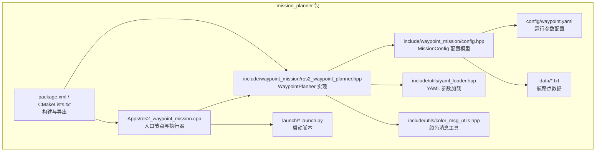
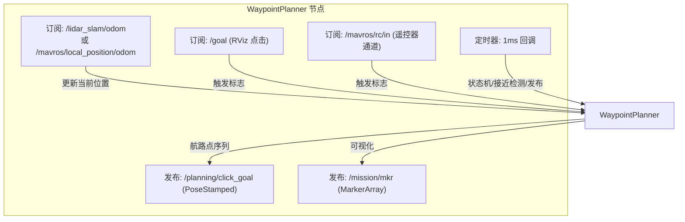
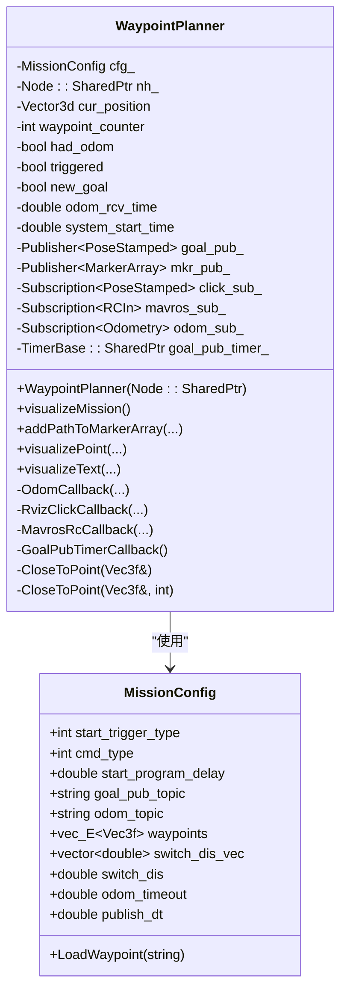
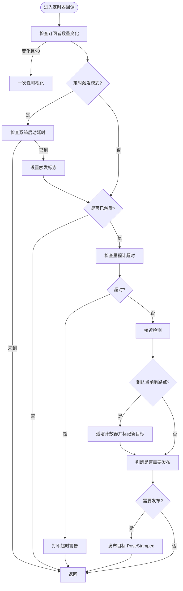
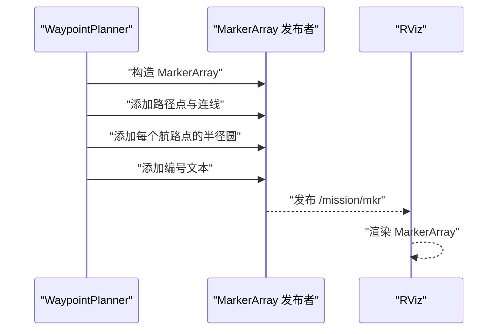
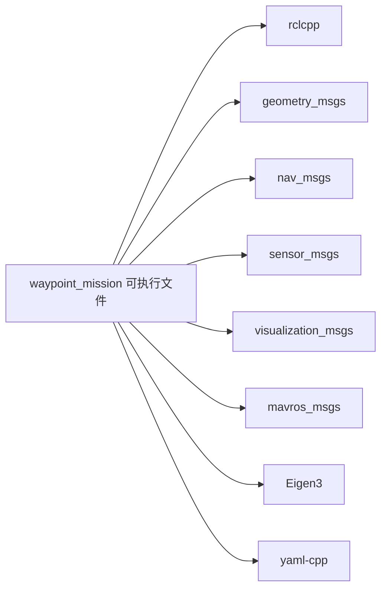

# 航路点规划器核心

<cite>
**本文档引用的文件**
- [ros2_waypoint_planner.hpp](file://src/SUPER/mission_planner/include/waypoint_mission/ros2_waypoint_planner.hpp)
- [ros2_waypoint_mission.cpp](file://src/SUPER/mission_planner/Apps/ros2_waypoint_mission.cpp)
- [config.hpp](file://src/SUPER/mission_planner/include/waypoint_mission/config.hpp)
- [waypoint.yaml](file://src/SUPER/mission_planner/config/waypoint.yaml)
- [benchmark.txt](file://src/SUPER/mission_planner/data/benchmark.txt)
- [benchmark_dense.txt](file://src/SUPER/mission_planner/data/benchmark_dense.txt)
- [yaml_loader.hpp](file://src/SUPER/mission_planner/include/utils/yaml_loader.hpp)
- [color_msg_utils.hpp](file://src/SUPER/mission_planner/include/utils/color_msg_utils.hpp)
- [package.xml](file://src/SUPER/mission_planner/package.xml)
- [CMakeLists.txt](file://src/SUPER/mission_planner/CMakeLists.txt)
- [click_demo.launch.py](file://src/SUPER/mission_planner/launch/click_demo.launch.py)
- [benchmark_dense.launch.py](file://src/SUPER/mission_planner/launch/benchmark_dense.launch.py)
- [default.rviz](file://src/SUPER/super_planner/rviz/default.rviz)
</cite>

## 目录
1. [简介](#简介)
2. [项目结构](#项目结构)
3. [核心组件](#核心组件)
4. [架构总览](#架构总览)
5. [详细组件分析](#详细组件分析)
6. [依赖关系分析](#依赖关系分析)
7. [性能考虑](#性能考虑)
8. [故障排查指南](#故障排查指南)
9. [结论](#结论)
10. [附录：API 参考](#附录api-参考)

## 简介
本文件面向航路点规划器的核心功能，围绕 WaypointPlanner 类进行深入解析，涵盖航路点管理、任务序列处理、目标跟踪机制、航路点切换逻辑（接近检测算法、切换距离参数、状态机管理）、与 ROS2 的集成（话题订阅、发布、回调函数）、触发机制（RViz 点击触发、Mavros 遥控器触发、定时器触发）、API 使用说明以及航路点可视化（MarkerArray 与 RViz 集成）。

## 项目结构
- 包含核心实现文件：WaypointPlanner 类、配置加载、可视化工具等
- 启动脚本：提供多套演示与基准场景的启动配置
- 数据与配置：航路点数据文件、参数配置文件
- 构建与导出：CMakeLists.txt、package.xml

图表来源
- [ros2_waypoint_mission.cpp](file://src/SUPER/mission_planner/Apps/ros2_waypoint_mission.cpp#L1-L23)
- [ros2_waypoint_planner.hpp](file://src/SUPER/mission_planner/include/waypoint_mission/ros2_waypoint_planner.hpp#L1-L410)
- [config.hpp](file://src/SUPER/mission_planner/include/waypoint_mission/config.hpp#L1-L101)
- [waypoint.yaml](file://src/SUPER/mission_planner/config/waypoint.yaml#L1-L19)
- [yaml_loader.hpp](file://src/SUPER/mission_planner/include/utils/yaml_loader.hpp#L1-L154)
- [color_msg_utils.hpp](file://src/SUPER/mission_planner/include/utils/color_msg_utils.hpp#L1-L71)
- [CMakeLists.txt](file://src/SUPER/mission_planner/CMakeLists.txt#L1-L109)
- [package.xml](file://src/SUPER/mission_planner/package.xml#L1-L19)

章节来源
- [CMakeLists.txt](file://src/SUPER/mission_planner/CMakeLists.txt#L1-L109)
- [package.xml](file://src/SUPER/mission_planner/package.xml#L1-L19)

## 核心组件
- WaypointPlanner：航路点规划与发布的核心类，负责航路点序列管理、接近检测、状态机控制、触发机制、可视化发布
- MissionConfig：封装配置参数与航路点数据加载，支持 YAML 参数读取与航路点文本文件解析
- 可视化工具：基于 visualization_msgs::msg::MarkerArray 提供航路点路径、半径圆与文本标注的绘制

章节来源
- [ros2_waypoint_planner.hpp](file://src/SUPER/mission_planner/include/waypoint_mission/ros2_waypoint_planner.hpp#L24-L407)
- [config.hpp](file://src/SUPER/mission_planner/include/waypoint_mission/config.hpp#L31-L98)

## 架构总览
WaypointPlanner 在 ROS2 节点内运行，通过订阅里程计、RViz 点击、Mavros 遥控器输入，结合定时器周期性检查当前位姿与目标航路点的距离，实现自动切换与目标发布；同时将航路点可视化发布到 RViz。

图表来源
- [ros2_waypoint_planner.hpp](file://src/SUPER/mission_planner/include/waypoint_mission/ros2_waypoint_planner.hpp#L191-L223)
- [waypoint.yaml](file://src/SUPER/mission_planner/config/waypoint.yaml#L1-L19)

## 详细组件分析

### WaypointPlanner 类
- 关键成员
  - 当前位姿：Eigen::Vector3d cur_position
  - 计数器与状态：int waypoint_counter、bool triggered、bool new_goal、bool had_odom
  - 时间戳：double odom_rcv_time、double system_start_time、static double last_pub_time
  - 配置：MissionConfig cfg_
  - ROS2 句柄与话题：Node::SharedPtr nh_、goal_pub_、mkr_pub_、odom_sub_、click_sub_、mavros_sub_、goal_pub_timer_
  - 回调组：click_cb_group_、mavros_cb_group_、odom_cb_group_、goal_pub_timer_cb_group_

- 回调与状态机
  - OdomCallback：接收里程计，更新 had_odom、odom_rcv_time、cur_position
  - RvizClickCallback：收到 RViz 点击后设置 triggered、new_goal、重置 waypoint_counter
  - MavrosRcCallback：检测遥控器通道变化，满足条件时设置触发标志
  - GoalPubTimerCallback：定时器主循环，负责
    - 订阅者数量变化时触发一次可视化
    - 定时触发模式下延时启动
    - 检查里程计超时
    - 接近检测 CloseToPoint 切换下一个航路点
    - 控制发布频率与目标发布

- 接近检测与切换逻辑
  - 单一阈值：CloseToPoint(Vec3f& position) 使用 cfg_.switch_dis
  - 分段阈值：CloseToPoint(Vec3f& position, int id) 使用 cfg_.switch_dis_vec[id]
  - 切换条件：到达当前航路点阈值内则递增 waypoint_counter 并标记 new_goal=true
  - 发布策略：new_goal 或超过 publish_dt 才重新发布目标

- 触发机制
  - RViz 点击触发：/goal 话题，设置 triggered=true、new_goal=true、counter=0
  - Mavros 遥控触发：通道9低-高沿触发，设置相同标志
  - 定时器触发：start_trigger_type=2 且延时 start_program_delay 后触发一次

- 可视化
  - visualizeMission：发布航路点路径与每个航路点的接近半径圆及编号文本
  - addPathToMarkerArray：将路径点与连线加入 MarkerArray
  - visualizePoint/visualizeText：辅助绘制球体与文本标注

图表来源
- [ros2_waypoint_planner.hpp](file://src/SUPER/mission_planner/include/waypoint_mission/ros2_waypoint_planner.hpp#L24-L407)
- [config.hpp](file://src/SUPER/mission_planner/include/waypoint_mission/config.hpp#L31-L98)

章节来源
- [ros2_waypoint_planner.hpp](file://src/SUPER/mission_planner/include/waypoint_mission/ros2_waypoint_planner.hpp#L52-L160)
- [config.hpp](file://src/SUPER/mission_planner/include/waypoint_mission/config.hpp#L31-L98)

### 触发机制流程图

图表来源
- [ros2_waypoint_planner.hpp](file://src/SUPER/mission_planner/include/waypoint_mission/ros2_waypoint_planner.hpp#L95-L160)

章节来源
- [ros2_waypoint_planner.hpp](file://src/SUPER/mission_planner/include/waypoint_mission/ros2_waypoint_planner.hpp#L95-L160)

### 可视化与 RViz 集成
- 发布主题：/mission/mkr (MarkerArray)
- 可视化内容：航路点路径（球体+连线）、每个航路点的接近半径圆（透明）、航路点编号文本
- RViz 配置：在默认 RViz 中已配置显示 /mission/mkr 的 MarkerArray

图表来源
- [ros2_waypoint_planner.hpp](file://src/SUPER/mission_planner/include/waypoint_mission/ros2_waypoint_planner.hpp#L225-L238)
- [default.rviz](file://src/SUPER/super_planner/rviz/default.rviz#L394-L399)

章节来源
- [ros2_waypoint_planner.hpp](file://src/SUPER/mission_planner/include/waypoint_mission/ros2_waypoint_planner.hpp#L225-L238)
- [default.rviz](file://src/SUPER/super_planner/rviz/default.rviz#L394-L399)

## 依赖关系分析
- ROS2 依赖：rclcpp、geometry_msgs、nav_msgs、sensor_msgs、visualization_msgs、mavros_msgs
- 数学与工具：Eigen、yaml-cpp、自定义颜色消息工具
- 启动与导出：CMakeLists.txt 定义可执行文件、安装规则与依赖包

图表来源
- [CMakeLists.txt](file://src/SUPER/mission_planner/CMakeLists.txt#L26-L62)
- [package.xml](file://src/SUPER/mission_planner/package.xml#L8-L13)

章节来源
- [CMakeLists.txt](file://src/SUPER/mission_planner/CMakeLists.txt#L26-L62)
- [package.xml](file://src/SUPER/mission_planner/package.xml#L8-L13)

## 性能考虑
- 定时器频率：1ms 回调，保证高频响应；注意 CPU 占用与发布频率参数 publish_dt 的配合
- QoS 设置：采用尽力而为、保持最后若干条、易失持久性的配置，适合仿真环境
- 可视化开销：一次性订阅者数量变化触发可视化，避免频繁重复绘制
- 接近检测：单次 O(N) 距离计算，N 为航路点数量；可通过分段阈值 switch_dis_vec 优化不同航路段的切换行为

## 故障排查指南
- 无里程计数据
  - 现象：定时器回调打印“里程计超时”
  - 排查：确认 odom_topic 是否正确、传感器是否正常、数据格式是否匹配
- 触发无效
  - RViz 点击：确认 /goal 订阅存在、回调组设置正确
  - 遥控器触发：确认 /mavros/rc/in 存在、通道索引与阈值设置合理
- 发布频率异常
  - 检查 publish_dt 参数与 new_goal 标志是否按预期切换
- 可视化不显示
  - 确认 RViz 已配置 /mission/mkr 的 MarkerArray 显示项

章节来源
- [ros2_waypoint_planner.hpp](file://src/SUPER/mission_planner/include/waypoint_mission/ros2_waypoint_planner.hpp#L118-L125)
- [default.rviz](file://src/SUPER/super_planner/rviz/default.rviz#L394-L399)

## 结论
WaypointPlanner 以简洁的状态机与接近检测为核心，结合多种触发方式与可视化输出，形成一套完整、可配置的航路点规划与演示方案。通过 YAML 参数与文本数据文件，用户可以快速定制航路点序列与行为特征；借助 RViz 的 MarkerArray 可视化，能够直观观察航路点路径与切换过程。

## 附录：API 参考

### 公共方法
- 构造函数
  - WaypointPlanner(rclcpp::Node::SharedPtr nh)
  - 功能：初始化参数、订阅/发布、定时器、回调组
- 可视化
  - visualizeMission()：发布航路点路径、半径圆与编号文本
  - addPathToMarkerArray(...)：向 MarkerArray 添加路径点与连线
  - visualizePoint(...)：添加球体标记（可选文本）
  - visualizeText(...)：添加文本标记
- 内部回调
  - OdomCallback(...)：更新当前位姿
  - RvizClickCallback(...)：RViz 点击触发
  - MavrosRcCallback(...)：遥控器触发
  - GoalPubTimerCallback()：定时器主循环

章节来源
- [ros2_waypoint_planner.hpp](file://src/SUPER/mission_planner/include/waypoint_mission/ros2_waypoint_planner.hpp#L165-L223)
- [ros2_waypoint_planner.hpp](file://src/SUPER/mission_planner/include/waypoint_mission/ros2_waypoint_planner.hpp#L225-L405)

### 参数配置
- 配置文件：config/waypoint.yaml
  - goal_pub_topic：目标发布主题名
  - odom_topic：里程计主题名
  - start_trigger_type：触发类型（0=RViz点击；1=Mavros遥控；2=定时器）
  - start_program_delay：定时器触发延时（秒）
  - cmd_type：命令类型（PATH/WAYPOINT）
  - switch_dis：统一接近切换距离
  - odom_timeout：里程计超时阈值（秒）
  - publish_dt：目标发布周期（秒）
- 数据文件：data/*.txt
  - 每行包含 x y z 与 switch_dis_vec[i]（最后一个数值为该航路点的接近半径）

章节来源
- [waypoint.yaml](file://src/SUPER/mission_planner/config/waypoint.yaml#L1-L19)
- [config.hpp](file://src/SUPER/mission_planner/include/waypoint_mission/config.hpp#L54-L78)

### 使用示例
- 启动演示
  - click_demo.launch.py：启动 RViz、仿真无人机与超级规划器，同时运行航路点规划器
  - benchmark_dense.launch.py：启动 RViz、航路点规划器、仿真无人机与超级规划器
- 运行方式
  - 通过 launch 文件传入 config_name 与 data_name 参数，指定 YAML 与数据文件
  - WaypointPlanner 节点内部根据参数加载配置与航路点数据

章节来源
- [click_demo.launch.py](file://src/SUPER/mission_planner/launch/click_demo.launch.py#L67-L84)
- [benchmark_dense.launch.py](file://src/SUPER/mission_planner/launch/benchmark_dense.launch.py#L67-L87)
- [ros2_waypoint_mission.cpp](file://src/SUPER/mission_planner/Apps/ros2_waypoint_mission.cpp#L11-L22)

### 话题与消息
- 订阅
  - /goal：geometry_msgs/PoseStamped（RViz 点击）
  - /mavros/rc/in：mavros_msgs/RCIn（遥控器通道）
  - /lidar_slam/odom 或 /mavros/local_position/odom：nav_msgs/Odometry（里程计）
- 发布
  - /planning/click_goal：geometry_msgs/PoseStamped（目标位置）
  - /mission/mkr：visualization_msgs/MarkerArray（航路点可视化）

章节来源
- [ros2_waypoint_planner.hpp](file://src/SUPER/mission_planner/include/waypoint_mission/ros2_waypoint_planner.hpp#L191-L223)
- [waypoint.yaml](file://src/SUPER/mission_planner/config/waypoint.yaml#L1-L4)