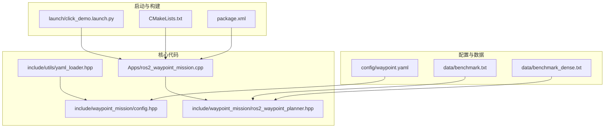
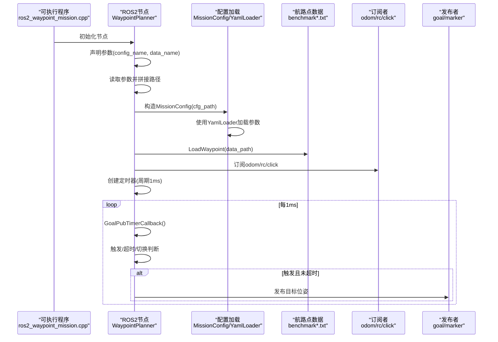
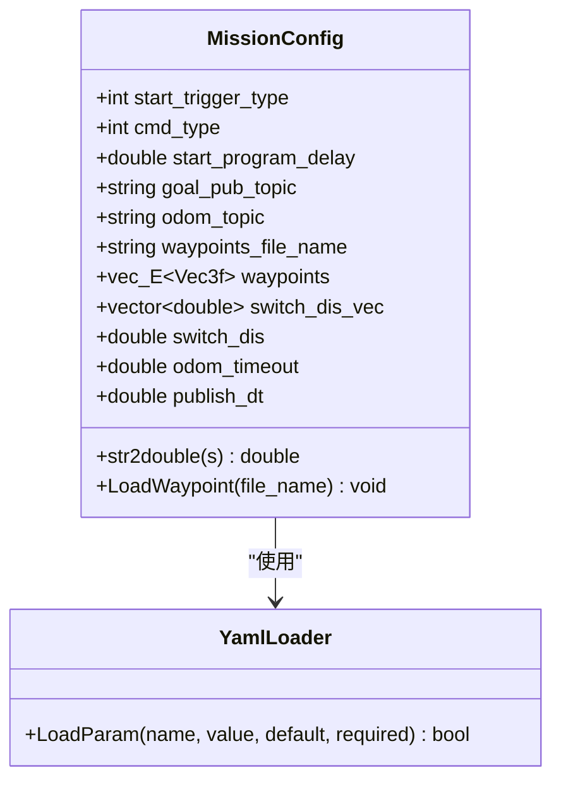
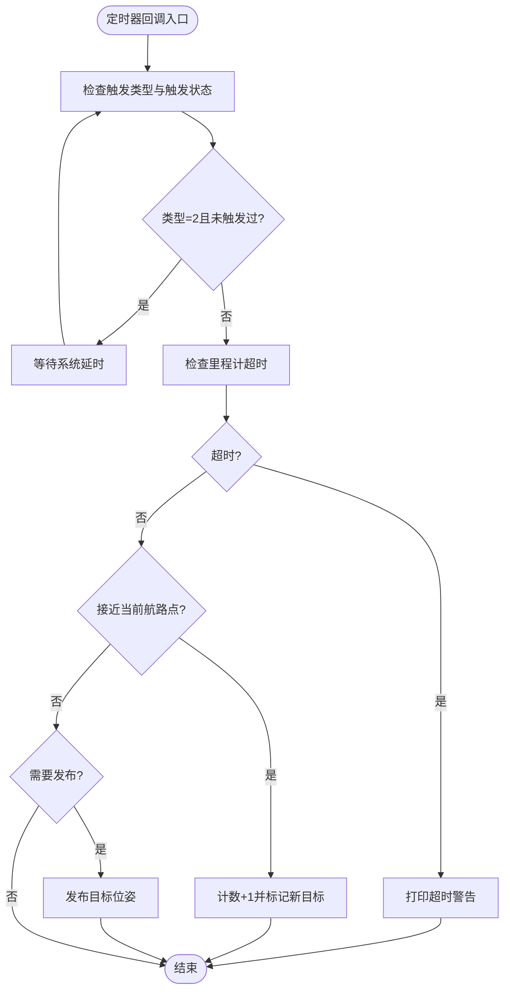
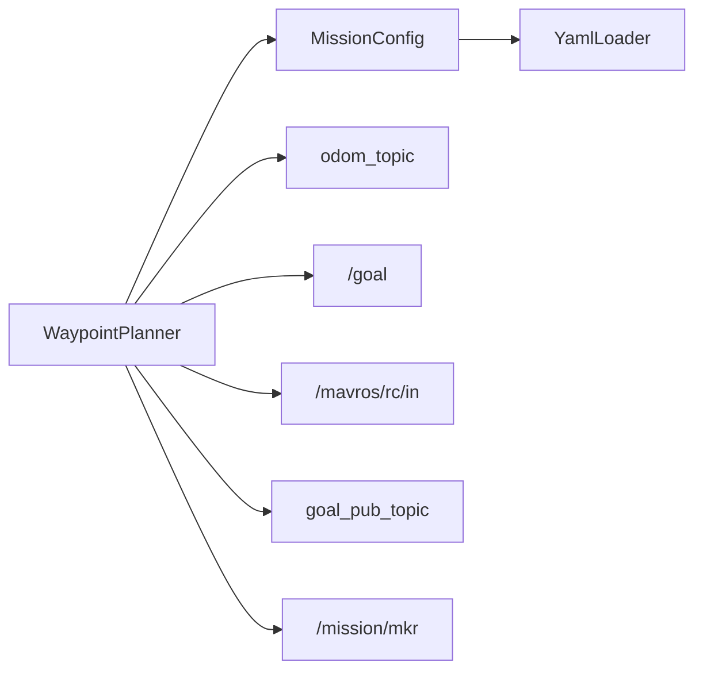

# 配置系统

<cite>
**本文引用的文件**
- [waypoint.yaml](file://src/SUPER/mission_planner/config/waypoint.yaml)
- [config.hpp](file://src/SUPER/mission_planner/include/waypoint_mission/config.hpp)
- [ros2_waypoint_planner.hpp](file://src/SUPER/mission_planner/include/waypoint_mission/ros2_waypoint_planner.hpp)
- [yaml_loader.hpp](file://src/SUPER/mission_planner/include/utils/yaml_loader.hpp)
- [benchmark.txt](file://src/SUPER/mission_planner/data/benchmark.txt)
- [benchmark_dense.txt](file://src/SUPER/mission_planner/data/benchmark_dense.txt)
- [ros2_waypoint_mission.cpp](file://src/SUPER/mission_planner/Apps/ros2_waypoint_mission.cpp)
- [click_demo.launch.py](file://src/SUPER/mission_planner/launch/click_demo.launch.py)
- [CMakeLists.txt](file://src/SUPER/mission_planner/CMakeLists.txt)
- [package.xml](file://src/SUPER/mission_planner/package.xml)
</cite>

## 目录
1. [简介](#简介)
2. [项目结构](#项目结构)
3. [核心组件](#核心组件)
4. [架构总览](#架构总览)
5. [详细组件分析](#详细组件分析)
6. [依赖关系分析](#依赖关系分析)
7. [性能考量](#性能考量)
8. [故障排查指南](#故障排查指南)
9. [结论](#结论)
10. [附录](#附录)

## 简介
本文件面向任务规划器配置系统，聚焦于航路点任务的配置与运行机制。内容涵盖：
- waypoint.yaml 配置项的语义与默认值
- MissionConfig 类的参数加载、默认值与校验机制
- 触发类型（手动、自动、延迟）的配置与行为
- 航路点数据文件格式、坐标系统与数据结构
- 发布频率与切换距离等关键参数的调优建议
- 配置文件的动态加载与运行时参数更新能力说明

## 项目结构
任务规划器位于 mission_planner 包中，核心文件组织如下：
- 配置文件：config/waypoint.yaml
- 数据文件：data/benchmark.txt、data/benchmark_dense.txt
- 核心类与接口：include/waypoint_mission/config.hpp、include/waypoint_mission/ros2_waypoint_planner.hpp
- 工具类：include/utils/yaml_loader.hpp
- 可执行入口：Apps/ros2_waypoint_mission.cpp
- 启动文件：launch/click_demo.launch.py
- 构建配置：CMakeLists.txt、package.xml

图表来源
- [waypoint.yaml](file://src/SUPER/mission_planner/config/waypoint.yaml#L1-L19)
- [config.hpp](file://src/SUPER/mission_planner/include/waypoint_mission/config.hpp#L1-L101)
- [ros2_waypoint_planner.hpp](file://src/SUPER/mission_planner/include/waypoint_mission/ros2_waypoint_planner.hpp#L1-L410)
- [yaml_loader.hpp](file://src/SUPER/mission_planner/include/utils/yaml_loader.hpp#L1-L154)
- [benchmark.txt](file://src/SUPER/mission_planner/data/benchmark.txt#L1-L2)
- [benchmark_dense.txt](file://src/SUPER/mission_planner/data/benchmark_dense.txt#L1-L2)
- [ros2_waypoint_mission.cpp](file://src/SUPER/mission_planner/Apps/ros2_waypoint_mission.cpp#L1-L23)
- [click_demo.launch.py](file://src/SUPER/mission_planner/launch/click_demo.launch.py#L1-L98)
- [CMakeLists.txt](file://src/SUPER/mission_planner/CMakeLists.txt#L1-L109)
- [package.xml](file://src/SUPER/mission_planner/package.xml#L1-L19)

章节来源
- [waypoint.yaml](file://src/SUPER/mission_planner/config/waypoint.yaml#L1-L19)
- [config.hpp](file://src/SUPER/mission_planner/include/waypoint_mission/config.hpp#L1-L101)
- [ros2_waypoint_planner.hpp](file://src/SUPER/mission_planner/include/waypoint_mission/ros2_waypoint_planner.hpp#L1-L410)
- [yaml_loader.hpp](file://src/SUPER/mission_planner/include/utils/yaml_loader.hpp#L1-L154)
- [benchmark.txt](file://src/SUPER/mission_planner/data/benchmark.txt#L1-L2)
- [benchmark_dense.txt](file://src/SUPER/mission_planner/data/benchmark_dense.txt#L1-L2)
- [ros2_waypoint_mission.cpp](file://src/SUPER/mission_planner/Apps/ros2_waypoint_mission.cpp#L1-L23)
- [click_demo.launch.py](file://src/SUPER/mission_planner/launch/click_demo.launch.py#L1-L98)
- [CMakeLists.txt](file://src/SUPER/mission_planner/CMakeLists.txt#L1-L109)
- [package.xml](file://src/SUPER/mission_planner/package.xml#L1-L19)

## 核心组件
- MissionConfig：负责从 YAML 加载参数、解析航路点文件、提供默认值与基本校验。
- WaypointPlanner：ROS2 节点封装，订阅里程计/遥控器/RVIZ点击，按配置发布目标位姿；包含触发逻辑、超时检测、航路点切换与可视化。
- YamlLoader：通用 YAML 参数加载器，支持默认值、类型检查与路径访问。

章节来源
- [config.hpp](file://src/SUPER/mission_planner/include/waypoint_mission/config.hpp#L31-L98)
- [ros2_waypoint_planner.hpp](file://src/SUPER/mission_planner/include/waypoint_mission/ros2_waypoint_planner.hpp#L24-L223)
- [yaml_loader.hpp](file://src/SUPER/mission_planner/include/utils/yaml_loader.hpp#L25-L105)

## 架构总览
下图展示配置系统在运行时的关键交互：节点通过参数声明与读取确定配置文件与数据文件路径，随后由 MissionConfig 与 YamlLoader 完成参数与航路点加载，WaypointPlanner 在回调中根据触发条件与状态机发布目标位姿。

图表来源
- [ros2_waypoint_mission.cpp](file://src/SUPER/mission_planner/Apps/ros2_waypoint_mission.cpp#L11-L22)
- [ros2_waypoint_planner.hpp](file://src/SUPER/mission_planner/include/waypoint_mission/ros2_waypoint_planner.hpp#L165-L223)
- [config.hpp](file://src/SUPER/mission_planner/include/waypoint_mission/config.hpp#L82-L96)
- [yaml_loader.hpp](file://src/SUPER/mission_planner/include/utils/yaml_loader.hpp#L27-L42)

## 详细组件分析

### waypoint.yaml 配置项详解
- 目标发布话题：goal_pub_topic
- 里程计话题：odom_topic
- 启动触发类型：start_trigger_type（0=RVIZ点击，1=Mavros RC，2=系统延时触发）
- 启动延时（秒）：start_program_delay
- 命令类型：cmd_type（0=路径命令，1=航路点命令）
- 切换距离阈值：switch_dis（单位米）
- 里程计超时阈值（秒）：odom_timeout
- 目标发布周期（秒）：publish_dt（设为极大值表示仅发布一次）

章节来源
- [waypoint.yaml](file://src/SUPER/mission_planner/config/waypoint.yaml#L1-L19)

### MissionConfig 类实现
- 参数加载机制
  - 通过 YamlLoader::LoadParam 读取配置项，支持默认值与类型检查。
  - 关键参数：start_trigger_type、start_program_delay、cmd_type、switch_dis、odom_timeout、publish_dt、goal_pub_topic、odom_topic。
- 默认值设置
  - 未在 YAML 中提供的参数使用构造函数中的默认值。
- 参数验证
  - YamlLoader 对类型不匹配进行回退并打印提示；必要参数缺失时抛出异常。
- 航路点加载
  - LoadWaypoint 逐行解析文本文件，前三个数为三维坐标，最后一个数为该航路点对应的切换距离向量元素。
  - 输出加载统计与每个航路点信息。

图表来源
- [config.hpp](file://src/SUPER/mission_planner/include/waypoint_mission/config.hpp#L31-L98)
- [yaml_loader.hpp](file://src/SUPER/mission_planner/include/utils/yaml_loader.hpp#L25-L105)

章节来源
- [config.hpp](file://src/SUPER/mission_planner/include/waypoint_mission/config.hpp#L31-L98)
- [yaml_loader.hpp](file://src/SUPER/mission_planner/include/utils/yaml_loader.hpp#L25-L105)

### WaypointPlanner 运行时流程
- 参数与数据加载
  - 通过节点参数 config_name、data_name 决定配置与数据文件路径。
  - 构造 MissionConfig 并加载航路点。
- 订阅与发布
  - 订阅 odom_topic、/goal、/mavros/rc/in。
  - 发布 goal_pub_topic 的 PoseStamped 目标位姿与 /mission/mkr 的 MarkerArray 可视化。
- 触发与状态机
  - 触发类型：
    - 0：RVIZ 点击触发，收到点击消息后重置计数并进入发布循环。
    - 1：Mavros RC 触发，通道9下降沿触发。
    - 2：系统延时触发，达到 start_program_delay 后自动触发一次。
  - 超时检测：若超过 odom_timeout 未收到里程计，则打印超时提示并暂停发布。
  - 航路点切换：当当前位置与当前航路点距离小于 switch_dis 或对应阈值时，前进到下一个航路点。
  - 发布控制：当新目标或距离上次发布时间超过 publish_dt 时发布。
- 定时器周期
  - 以 1ms 周期驱动状态机与发布决策。

图表来源
- [ros2_waypoint_planner.hpp](file://src/SUPER/mission_planner/include/waypoint_mission/ros2_waypoint_planner.hpp#L95-L160)

章节来源
- [ros2_waypoint_planner.hpp](file://src/SUPER/mission_planner/include/waypoint_mission/ros2_waypoint_planner.hpp#L24-L223)
- [ros2_waypoint_planner.hpp](file://src/SUPER/mission_planner/include/waypoint_mission/ros2_waypoint_planner.hpp#L95-L160)

### 触发类型配置与参数
- 手动触发（RVIZ 点击）
  - 触发源：/goal 话题的 PoseStamped 消息。
  - 参数：start_trigger_type=0。
- 自动触发（Mavros RC）
  - 触发源：/mavros/rc/in 话题的 RCIn 消息，通道9下降沿触发。
  - 参数：start_trigger_type=1。
- 延迟触发（系统延时）
  - 触发源：系统启动后经过 start_program_delay 秒自动触发一次。
  - 参数：start_trigger_type=2，start_program_delay（秒）。

章节来源
- [waypoint.yaml](file://src/SUPER/mission_planner/config/waypoint.yaml#L5-L7)
- [ros2_waypoint_planner.hpp](file://src/SUPER/mission_planner/include/waypoint_mission/ros2_waypoint_planner.hpp#L68-L93)
- [ros2_waypoint_planner.hpp](file://src/SUPER/mission_planner/include/waypoint_mission/ros2_waypoint_planner.hpp#L102-L112)

### 航路点数据文件格式
- 文件位置：data/benchmark.txt、data/benchmark_dense.txt
- 行格式：每行包含四个数值，前三列为三维坐标（单位：米），第四列为该航路点的切换距离阈值（单位：米）。
- 解析逻辑：逐行读取，前三个数转为 Vec3f，第四个数存入 switch_dis_vec。
- 示例文件内容：
  - benchmark.txt：两行示例航路点
  - benchmark_dense.txt：两行示例航路点

章节来源
- [benchmark.txt](file://src/SUPER/mission_planner/data/benchmark.txt#L1-L2)
- [benchmark_dense.txt](file://src/SUPER/mission_planner/data/benchmark_dense.txt#L1-L2)
- [config.hpp](file://src/SUPER/mission_planner/include/waypoint_mission/config.hpp#L54-L78)

### 参数调优指南
- 切换距离 switch_dis
  - 建议范围：根据飞行平台尺寸与期望的“到达精度”设定，通常在 0.5–5 米之间。
  - 影响：过小导致频繁切换，过大可能导致越飞过远。
- 发布间隔 publish_dt
  - 建议范围：0.1–1.0 秒；若仅需一次性发布，可设为极大值。
  - 影响：过短增加通信与计算开销，过长可能错过最新状态。
- 里程计超时 odom_timeout
  - 建议范围：0.05–0.2 秒；确保在传感器抖动范围内仍能稳定工作。
  - 影响：过短易误判超时，过长可能导致控制滞后。
- 启动延时 start_program_delay
  - 建议范围：1–5 秒；用于等待传感器稳定与系统初始化。
  - 影响：过短可能在不稳定状态下开始任务，过长影响任务时效性。
- 命令类型 cmd_type
  - 0：路径命令；1：航路点命令。根据下游控制器需求选择。

章节来源
- [waypoint.yaml](file://src/SUPER/mission_planner/config/waypoint.yaml#L10-L15)
- [config.hpp](file://src/SUPER/mission_planner/include/waypoint_mission/config.hpp#L82-L96)
- [ros2_waypoint_planner.hpp](file://src/SUPER/mission_planner/include/waypoint_mission/ros2_waypoint_planner.hpp#L118-L125)

### 配置文件的动态加载与运行时参数更新
- 动态加载机制
  - WaypointPlanner 在构造阶段通过节点参数 config_name、data_name 决定配置与数据文件路径，随后加载。
  - 启动文件 click_demo.launch.py 提供参数声明与默认值。
- 运行时参数更新
  - 当前 MissionConfig 与 WaypointPlanner 未实现运行时参数热更新逻辑；参数在节点初始化时一次性加载。
  - 若需动态更新，可在现有基础上扩展：在 WaypointPlanner 中注册参数回调，在回调中重建 MissionConfig 并重新加载数据文件。

章节来源
- [ros2_waypoint_mission.cpp](file://src/SUPER/mission_planner/Apps/ros2_waypoint_mission.cpp#L11-L22)
- [ros2_waypoint_planner.hpp](file://src/SUPER/mission_planner/include/waypoint_mission/ros2_waypoint_planner.hpp#L165-L189)
- [click_demo.launch.py](file://src/SUPER/mission_planner/launch/click_demo.launch.py#L32-L39)

## 依赖关系分析
- 组件耦合
  - WaypointPlanner 依赖 MissionConfig 与 YamlLoader；MissionConfig 依赖 YamlLoader 与航路点文件。
  - 订阅/发布关系：odom_topic → OdomCallback；/goal → RvizClickCallback；/mavros/rc/in → MavrosRcCallback；goal_pub_topic ← 目标位姿。
- 外部依赖
  - rclcpp、geometry_msgs、nav_msgs、visualization_msgs、mavros_msgs、yaml-cpp、Eigen3。
- 构建导出
  - CMakeLists 安装 launch、config、data 目录，便于部署与复用。

图表来源
- [ros2_waypoint_planner.hpp](file://src/SUPER/mission_planner/include/waypoint_mission/ros2_waypoint_planner.hpp#L24-L223)
- [config.hpp](file://src/SUPER/mission_planner/include/waypoint_mission/config.hpp#L31-L98)
- [yaml_loader.hpp](file://src/SUPER/mission_planner/include/utils/yaml_loader.hpp#L25-L105)

章节来源
- [CMakeLists.txt](file://src/SUPER/mission_planner/CMakeLists.txt#L47-L105)
- [package.xml](file://src/SUPER/mission_planner/package.xml#L1-L19)

## 性能考量
- 定时器周期：1ms，保证高响应性；注意避免在回调内执行重型计算。
- 发布频率：受 publish_dt 控制，建议与下游控制器采样周期匹配。
- 距离计算：CloseToPoint 使用 L2 范数，复杂度 O(1)，对实时性友好。
- 数据文件：航路点数量有限时，I/O 开销可忽略；大规模航路点建议预处理与缓存。

## 故障排查指南
- 无法加载配置
  - 检查 config_name 参数是否正确；确认 waypoint.yaml 存在且路径拼接无误。
  - 查看 YamlLoader 的日志输出，确认参数类型与默认值回退情况。
- 无法加载航路点
  - 检查 data_name 参数与 benchmark*.txt 文件是否存在；确认每行格式为四列数值。
- 未触发或触发异常
  - start_trigger_type=0：确认 RVIZ 点击消息发布到 /goal。
  - start_trigger_type=1：确认 /mavros/rc/in 话题存在且通道9下降沿有效。
  - start_trigger_type=2：确认系统启动时间与 start_program_delay 设置合理。
- 超时告警
  - 检查 odom_topic 是否正常；适当增大 odom_timeout。
- 发布频率异常
  - 检查 publish_dt 设置；确认下游订阅者数量变化导致的可视化刷新。

章节来源
- [yaml_loader.hpp](file://src/SUPER/mission_planner/include/utils/yaml_loader.hpp#L47-L105)
- [ros2_waypoint_planner.hpp](file://src/SUPER/mission_planner/include/waypoint_mission/ros2_waypoint_planner.hpp#L118-L125)
- [ros2_waypoint_planner.hpp](file://src/SUPER/mission_planner/include/waypoint_mission/ros2_waypoint_planner.hpp#L142-L157)

## 结论
本配置系统通过简洁的 YAML 参数与文本航路点文件，实现了灵活的任务规划与发布机制。MissionConfig 与 YamlLoader 提供了稳健的参数加载与默认值回退策略；WaypointPlanner 将触发、超时、切换与发布整合为统一的状态机。建议在实际部署中结合平台特性与场景需求，合理设置切换距离、发布间隔与超时阈值，并关注数据文件格式与话题连通性。

## 附录
- 启动与参数
  - 启动文件 click_demo.launch.py 提供 config_name、data_name 参数声明与默认值。
  - 可通过节点参数覆盖默认配置文件与数据文件名。
- 构建与安装
  - CMakeLists 安装 launch、config、data 目录，便于在多包协作中共享资源。

章节来源
- [click_demo.launch.py](file://src/SUPER/mission_planner/launch/click_demo.launch.py#L32-L39)
- [CMakeLists.txt](file://src/SUPER/mission_planner/CMakeLists.txt#L100-L105)