# MARSIM渲染引擎

<cite>
**本文档引用的文件**
- [marsim_render.hpp](file://src/SUPER/mars_uav_sim/marsim_render/include/marsim_render/marsim_render.hpp)
- [config.hpp](file://src/SUPER/mars_uav_sim/marsim_render/include/marsim_render/config.hpp)
- [shader_m.h](file://src/SUPER/mars_uav_sim/marsim_render/include/marsim_render/shader_m.h)
- [marsim_render.cpp](file://src/SUPER/mars_uav_sim/marsim_render/src/marsim_render.cpp)
- [general_360_lidar.yaml](file://src/SUPER/mars_uav_sim/marsim_render/config/general_360_lidar.yaml)
- [360camera.vs](file://src/SUPER/mars_uav_sim/marsim_render/config/pattern/360camera.vs)
- [camera.vs](file://src/SUPER/mars_uav_sim/marsim_render/config/pattern/camera.vs)
- [camera.fs](file://src/SUPER/mars_uav_sim/marsim_render/config/pattern/camera.fs)
- [yaml_loader.hpp](file://src/SUPER/mars_uav_sim/marsim_render/include/marsim_render/yaml_loader.hpp)
- [scope_timer.hpp](file://src/SUPER/mars_uav_sim/marsim_render/include/marsim_render/scope_timer.hpp)
- [main.cpp](file://src/SUPER/mars_uav_sim/marsim_render/test/main.cpp)
- [CMakeLists.txt](file://src/SUPER/mars_uav_sim/marsim_render/CMakeLists.txt)
</cite>

## 目录
1. [简介](#简介)
2. [项目结构](#项目结构)
3. [核心组件](#核心组件)
4. [架构概览](#架构概览)
5. [详细组件分析](#详细组件分析)
6. [依赖关系分析](#依赖关系分析)
7. [性能考虑](#性能考虑)
8. [故障排除指南](#故障排除指南)
9. [结论](#结论)

## 简介

MARSIM渲染引擎是一个专为无人机仿真设计的高性能3D渲染系统，集成了点云渲染、LiDAR模拟和实时可视化功能。该引擎基于OpenGL 3.3核心配置，结合PCL（Point Cloud Library）进行点云处理，支持多种LiDAR传感器模式的精确模拟。

该渲染引擎的主要特点包括：
- 基于OpenGL的高效3D渲染管线
- 支持多种LiDAR传感器类型的精确模拟
- 实时点云渲染和深度图像生成
- 完整的相机系统和视锥体裁剪
- 可配置的渲染质量和性能优化
- ROS2集成能力

## 项目结构

MARSIM渲染引擎采用模块化设计，主要包含以下目录结构：

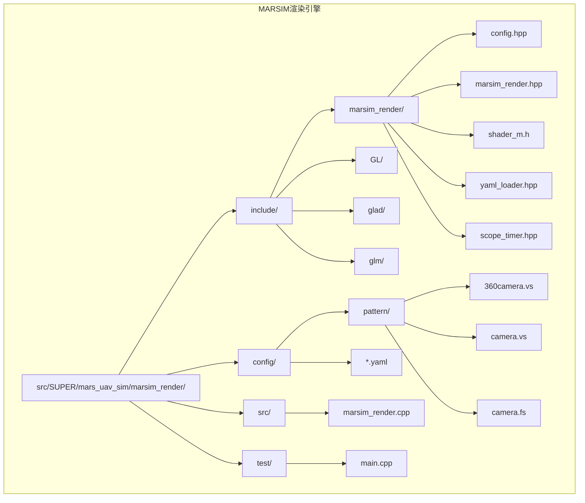

**图表来源**
- [CMakeLists.txt](file://src/SUPER/mars_uav_sim/marsim_render/CMakeLists.txt#L1-L132)
- [marsim_render.hpp](file://src/SUPER/mars_uav_sim/marsim_render/include/marsim_render/marsim_render.hpp#L1-L215)

**章节来源**
- [CMakeLists.txt](file://src/SUPER/mars_uav_sim/marsim_render/CMakeLists.txt#L1-L132)

## 核心组件

MARSIM渲染引擎由以下几个核心组件构成：

### 1. 渲染主类 (MarsimRender)
这是引擎的核心类，负责整个渲染流程的协调和管理。

### 2. 配置管理系统 (Config)
管理所有渲染相关的配置参数，包括LiDAR参数、相机参数和渲染设置。

### 3. 着色器管理系统 (Shader)
封装OpenGL着色器程序的加载、编译和使用。

### 4. YAML配置加载器 (YamlLoader)
提供类型安全的配置参数加载和验证功能。

### 5. 性能计时器 (ScopeTimer)
用于性能分析和渲染时间测量。

**章节来源**
- [marsim_render.hpp](file://src/SUPER/mars_uav_sim/marsim_render/include/marsim_render/marsim_render.hpp#L90-L214)
- [config.hpp](file://src/SUPER/mars_uav_sim/marsim_render/include/marsim_render/config.hpp#L46-L101)
- [shader_m.h](file://src/SUPER/mars_uav_sim/marsim_render/include/marsim_render/shader_m.h#L12-L167)

## 架构概览

MARSIM渲染引擎采用分层架构设计，实现了清晰的关注点分离：

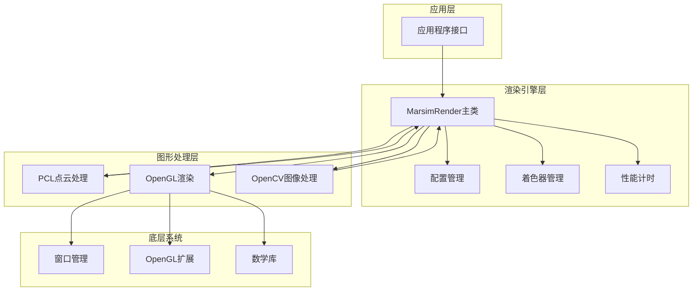

**图表来源**
- [marsim_render.cpp](file://src/SUPER/mars_uav_sim/marsim_render/src/marsim_render.cpp#L16-L149)
- [marsim_render.hpp](file://src/SUPER/mars_uav_sim/marsim_render/include/marsim_render/marsim_render.hpp#L90-L214)

## 详细组件分析

### 渲染主类 (MarsimRender)

MarsimRender是引擎的核心类，负责管理完整的渲染生命周期：

#### 主要职责
- OpenGL上下文初始化和管理
- 点云数据加载和预处理
- LiDAR模式模拟
- 相机系统管理
- 渲染状态控制

#### 关键数据结构

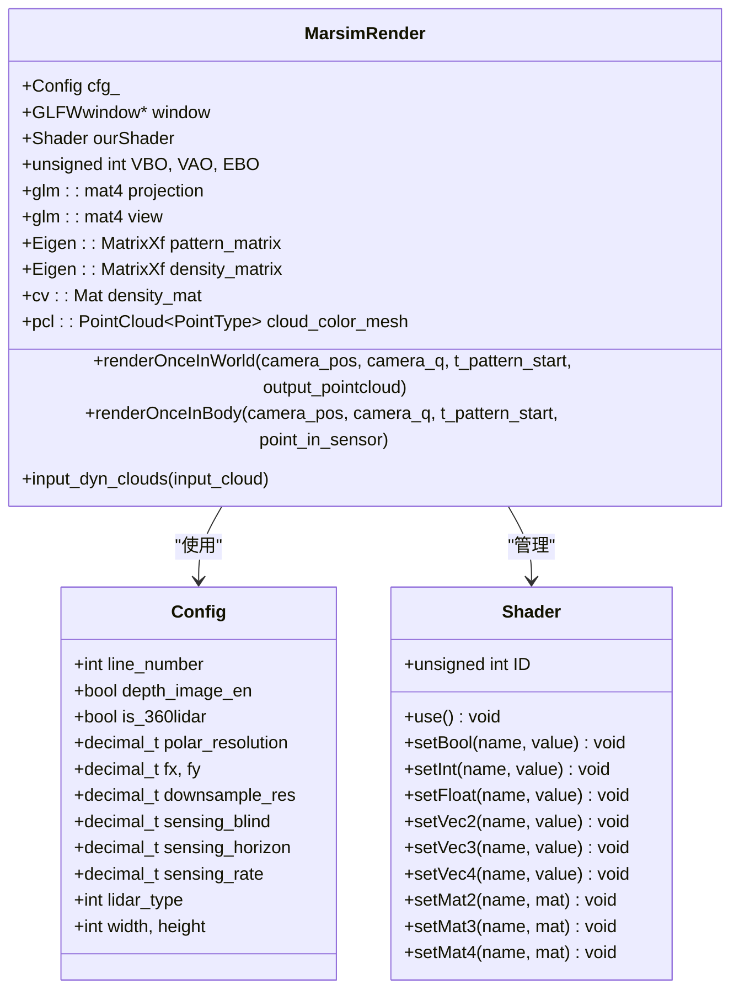

**图表来源**
- [marsim_render.hpp](file://src/SUPER/mars_uav_sim/marsim_render/include/marsim_render/marsim_render.hpp#L90-L214)
- [config.hpp](file://src/SUPER/mars_uav_sim/marsim_render/include/marsim_render/config.hpp#L46-L101)
- [shader_m.h](file://src/SUPER/mars_uav_sim/marsim_render/include/marsim_render/shader_m.h#L12-L167)

#### 渲染流程

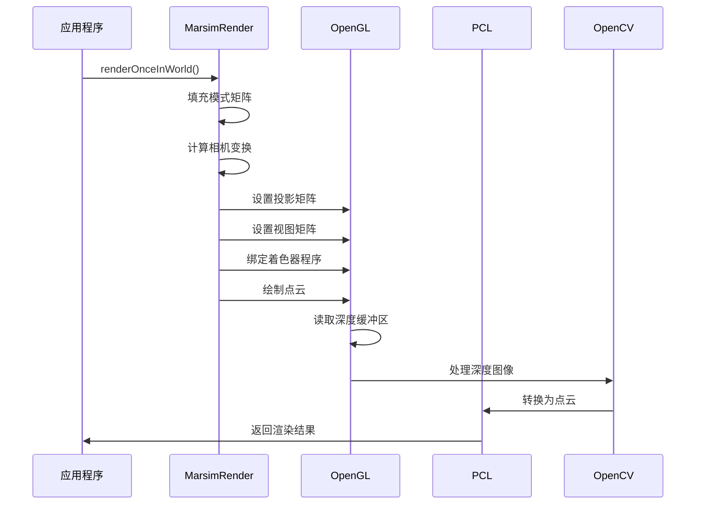

**图表来源**
- [marsim_render.cpp](file://src/SUPER/mars_uav_sim/marsim_render/src/marsim_render.cpp#L171-L399)

**章节来源**
- [marsim_render.cpp](file://src/SUPER/mars_uav_sim/marsim_render/src/marsim_render.cpp#L171-L399)

### OpenGL上下文管理

引擎使用GLFW和GLAD来管理OpenGL上下文：

#### 初始化流程

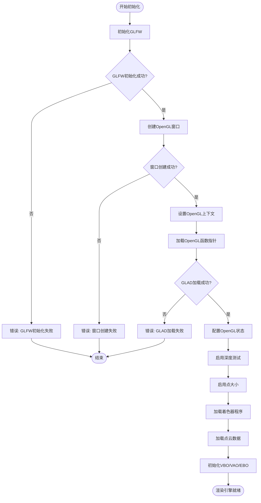

**图表来源**
- [marsim_render.cpp](file://src/SUPER/mars_uav_sim/marsim_render/src/marsim_render.cpp#L16-L149)

#### OpenGL状态配置

引擎启用了以下关键OpenGL状态：
- 深度测试 (GL_DEPTH_TEST)
- 程序化点大小 (GL_PROGRAM_POINT_SIZE)
- 透明度支持 (通过着色器实现)

**章节来源**
- [marsim_render.cpp](file://src/SUPER/mars_uav_sim/marsim_render/src/marsim_render.cpp#L62-L81)

### 着色器程序加载和管理

着色器系统提供了完整的OpenGL着色器管理功能：

#### 着色器编译流程

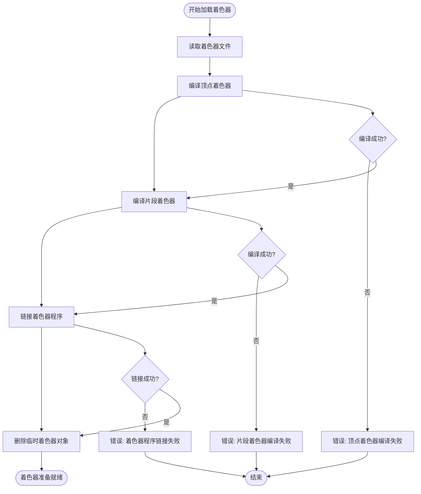

**图表来源**
- [shader_m.h](file://src/SUPER/mars_uav_sim/marsim_render/include/marsim_render/shader_m.h#L20-L74)

#### 着色器参数传递

引擎支持多种数据类型的着色器参数传递：
- 布尔值、整数、浮点数
- 向量2、3、4维
- 矩阵2×2、3×3、4×4

**章节来源**
- [shader_m.h](file://src/SUPER/mars_uav_sim/marsim_render/include/marsim_render/shader_m.h#L75-L139)

### 3D渲染管道实现

MARSIM引擎实现了完整的3D渲染管道，包括顶点着色器、片段着色器和几何着色器的工作原理。

#### 顶点着色器工作原理

顶点着色器实现了从世界坐标到屏幕坐标的转换：

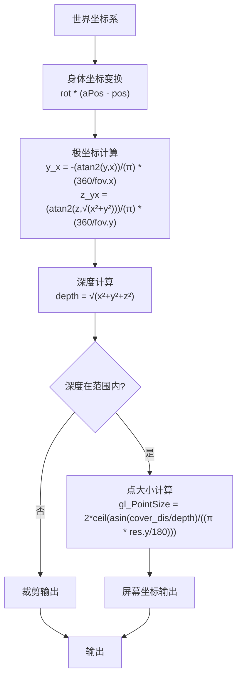

**图表来源**
- [360camera.vs](file://src/SUPER/mars_uav_sim/marsim_render/config/pattern/360camera.vs#L55-L88)

#### 片段着色器工作原理

片段着色器负责颜色插值和最终像素输出：

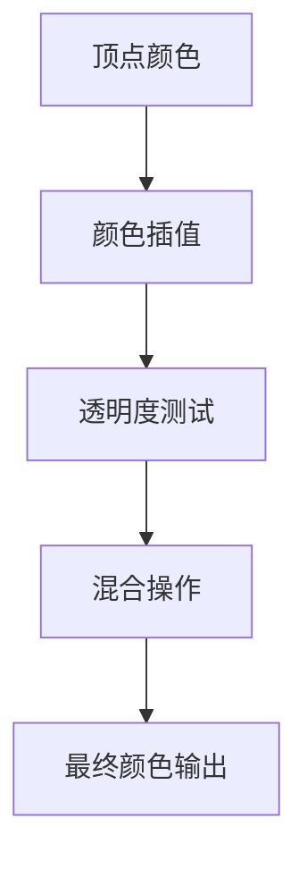

**图表来源**
- [camera.fs](file://src/SUPER/mars_uav_sim/marsim_render/config/pattern/camera.fs#L10-L15)

**章节来源**
- [360camera.vs](file://src/SUPER/mars_uav_sim/marsim_render/config/pattern/360camera.vs#L20-L128)
- [camera.fs](file://src/SUPER/mars_uav_sim/marsim_render/config/pattern/camera.fs#L1-L15)

### 点云渲染技术

MARSIM引擎实现了高效的点云渲染技术，包括数据处理、颜色映射和透明度控制。

#### 点云数据处理流程

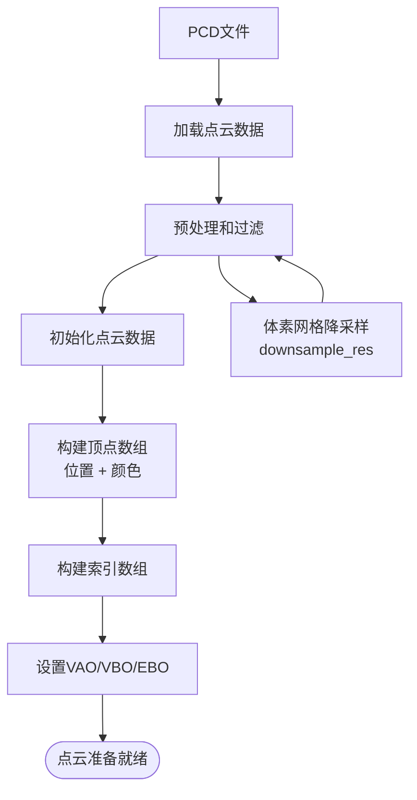

**图表来源**
- [marsim_render.cpp](file://src/SUPER/mars_uav_sim/marsim_render/src/marsim_render.cpp#L401-L406)
- [marsim_render.cpp](file://src/SUPER/mars_uav_sim/marsim_render/src/marsim_render.cpp#L671-L688)

#### 颜色映射和透明度控制

引擎支持多种颜色映射策略：
- 基于深度的颜色映射
- 动态密度映射
- 透明度控制参数

**章节来源**
- [marsim_render.cpp](file://src/SUPER/mars_uav_sim/marsim_render/src/marsim_render.cpp#L495-L575)

### 相机系统设计

相机系统实现了完整的3D相机控制，包括视角变换、投影矩阵和视锥体裁剪。

#### 相机变换矩阵

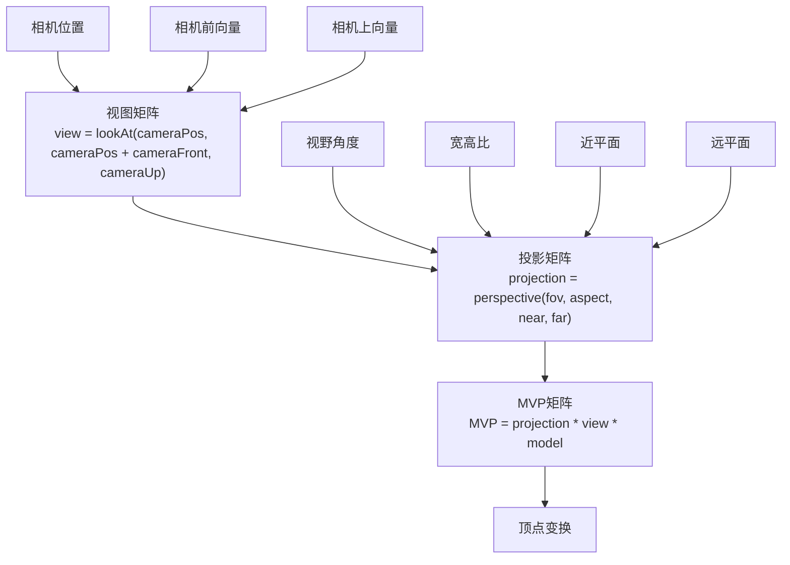

**图表来源**
- [marsim_render.cpp](file://src/SUPER/mars_uav_sim/marsim_render/src/marsim_render.cpp#L315-L324)

#### 视锥体裁剪

引擎实现了高效的视锥体裁剪：
- 深度范围检查 (sensing_blind 到 sensing_horizon)
- 极坐标范围检查
- 性能优化的裁剪算法

**章节来源**
- [marsim_render.cpp](file://src/SUPER/mars_uav_sim/marsim_render/src/marsim_render.cpp#L315-L327)

### 渲染配置系统

渲染配置系统提供了灵活的参数控制和性能优化选项。

#### 配置参数分类

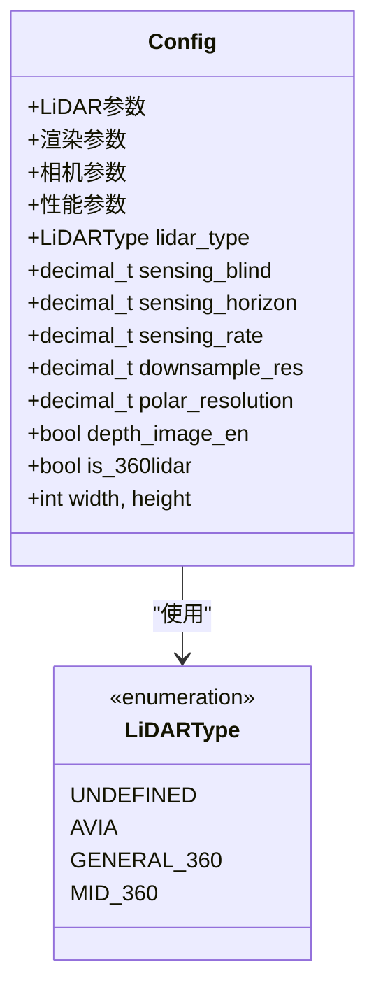

**图表来源**
- [config.hpp](file://src/SUPER/mars_uav_sim/marsim_render/include/marsim_render/config.hpp#L38-L43)
- [config.hpp](file://src/SUPER/mars_uav_sim/marsim_render/include/marsim_render/config.hpp#L46-L101)

#### YAML配置文件结构

配置文件支持嵌套参数和类型安全加载：

**章节来源**
- [general_360_lidar.yaml](file://src/SUPER/mars_uav_sim/marsim_render/config/general_360_lidar.yaml#L1-L16)
- [yaml_loader.hpp](file://src/SUPER/mars_uav_sim/marsim_render/include/marsim_render/yaml_loader.hpp#L48-L172)

## 依赖关系分析

MARSIM渲染引擎依赖多个第三方库和框架：

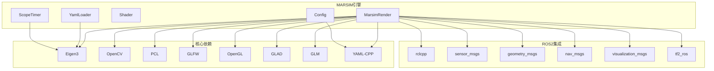

**图表来源**
- [CMakeLists.txt](file://src/SUPER/mars_uav_sim/marsim_render/CMakeLists.txt#L54-L96)

### 关键依赖说明

#### 图形库依赖
- **OpenGL 3.3 Core Profile**: 提供现代3D渲染功能
- **GLFW**: 窗口管理和输入处理
- **GLAD**: OpenGL函数加载器
- **GLM**: 数学运算库

#### 数据处理依赖
- **PCL**: 点云数据处理和滤波
- **OpenCV**: 图像处理和颜色映射
- **Eigen3**: 矩阵运算和线性代数

#### 配置管理依赖
- **YAML-CPP**: 配置文件解析
- **ROS2**: 消息传递和系统集成

**章节来源**
- [CMakeLists.txt](file://src/SUPER/mars_uav_sim/marsim_render/CMakeLists.txt#L54-L96)

## 性能考虑

MARSIM渲染引擎在设计时充分考虑了性能优化：

### 渲染性能优化策略

#### 1. 内存管理优化
- 使用动态内存分配减少峰值内存占用
- 批量数据传输减少GPU同步开销
- 智能缓存机制避免重复计算

#### 2. 算法优化
- 体素网格降采样减少点云数量
- 并行处理动态点云
- 高效的视锥体裁剪算法

#### 3. GPU资源优化
- 使用VBO/VAO减少状态切换
- 最小化着色器状态变化
- 优化纹理和缓冲区使用

### 性能监控和分析

引擎内置了完整的性能监控系统：

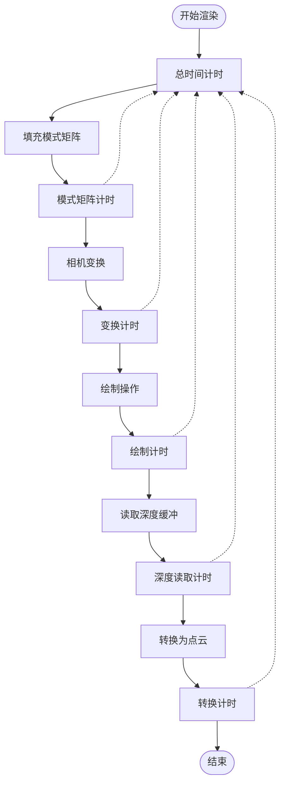

**图表来源**
- [marsim_render.cpp](file://src/SUPER/mars_uav_sim/marsim_render/src/marsim_render.cpp#L177-L399)
- [scope_timer.hpp](file://src/SUPER/mars_uav_sim/marsim_render/include/marsim_render/scope_timer.hpp#L34-L117)

**章节来源**
- [scope_timer.hpp](file://src/SUPER/mars_uav_sim/marsim_render/include/marsim_render/scope_timer.hpp#L34-L117)

## 故障排除指南

### 常见问题和解决方案

#### 1. OpenGL初始化失败
**症状**: "Failed to initialize GLFW" 或 "Failed to initialize GLAD"
**解决方案**:
- 检查显卡驱动和OpenGL支持
- 确认系统满足OpenGL 3.3要求
- 验证GLFW和GLAD库正确安装

#### 2. 着色器编译错误
**症状**: "SHADER_COMPILATION_ERROR" 或 "PROGRAM_LINKING_ERROR"
**解决方案**:
- 检查着色器文件路径和权限
- 验证着色器语法正确性
- 确认OpenGL版本兼容性

#### 3. 点云加载失败
**症状**: "can't read file" 或点云为空
**解决方案**:
- 检查PCD文件格式和完整性
- 验证文件路径配置正确
- 确认PCL库正确安装

#### 4. 性能问题
**症状**: 渲染帧率低或内存占用过高
**解决方案**:
- 调整降采样参数 (downsample_res)
- 减少点云数量或简化模型
- 优化着色器代码和纹理尺寸

**章节来源**
- [shader_m.h](file://src/SUPER/mars_uav_sim/marsim_render/include/marsim_render/shader_m.h#L143-L165)
- [marsim_render.cpp](file://src/SUPER/mars_uav_sim/marsim_render/src/marsim_render.cpp#L19-L27)

## 结论

MARSIM渲染引擎是一个功能完整、性能优异的3D渲染系统，专门为无人机仿真和LiDAR模拟而设计。该引擎具有以下优势：

### 技术优势
- **模块化设计**: 清晰的组件分离便于维护和扩展
- **高性能渲染**: 基于OpenGL 3.3的优化渲染管线
- **灵活配置**: YAML配置系统支持丰富的参数调整
- **ROS2集成**: 完整的消息传递和系统集成能力

### 应用价值
- **学术研究**: 支持无人机导航和感知算法研究
- **工业应用**: 为实际无人机系统提供仿真平台
- **教育用途**: 优秀的教学和学习工具

### 发展方向
- **扩展LiDAR支持**: 添加更多传感器类型的模拟
- **增强渲染效果**: 支持更复杂的光照和材质效果
- **优化性能**: 进一步提升渲染效率和质量
- **增强工具链**: 提供更多的可视化和分析工具

MARSIM渲染引擎为无人机仿真领域提供了一个强大而灵活的解决方案，为相关研究和开发工作奠定了坚实的基础。